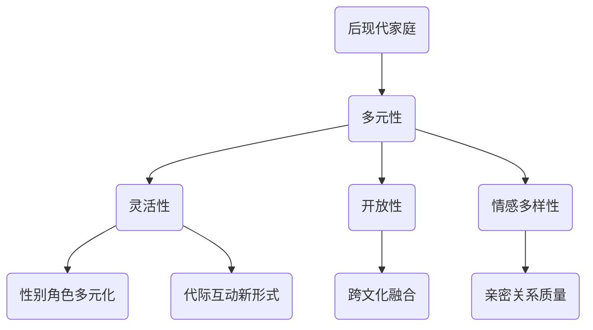

                 


### **文章标题: 后现代家庭构建工作坊：探索多元亲密关系的实践课程**

> 关键词：后现代家庭、多元亲密关系、实践课程、亲密关系构建

> 摘要：本文旨在探讨后现代家庭的概念、多元亲密关系的构建方法，以及如何通过实践课程来实现这些目标。文章首先介绍了后现代家庭的特点和理论框架，然后深入探讨了多元亲密关系的核心概念和构建策略，最后通过实际案例和项目实战，展示了如何应用这些理论和方法来构建健康的亲密关系。

---

### **引言**

在后现代社会中，家庭结构和亲密关系的构建面临了前所未有的挑战。传统的家庭模式已经无法满足人们日益多样化的需求，而多元亲密关系和后现代家庭的观念逐渐成为学术界和公众讨论的热点。本文将从技术角度出发，探讨如何通过实践课程来构建后现代家庭和多元亲密关系。

首先，我们将介绍后现代家庭的概念和特点，包括其与传统家庭的区别。接着，我们将深入探讨多元亲密关系的核心概念，如情感多样性、性别角色多元化等。随后，文章将详细阐述如何设计并实施一个实践课程，以帮助人们理解和实践后现代家庭和多元亲密关系的构建。

### **第一部分：理解后现代家庭概念**

#### **1.1 后现代家庭的理论框架**

**核心概念与联系**



**后现代家庭与传统家庭的对比**

```markdown
| 特点 | 后现代家庭 | 传统家庭 |
| --- | --- | --- |
| 家庭结构 | 多样化 | 单一化 |
| 家庭功能 | 个性化 | 功能化 |
| 亲密关系 | 多元化 | 一元化 |
| 文化背景 | 融合性 | 本土性 |
```

**后现代家庭的演变**

```markdown
后现代家庭的演变可以分为以下几个阶段：

1. **家庭结构的多样化**：随着社会的发展，家庭结构变得更加多样化，包括单亲家庭、再婚家庭、同性恋家庭等。
2. **家庭功能的个性化**：家庭不再是简单的经济单位和生育场所，而是个人发展的场所，具有个性化的功能。
3. **亲密关系的多元化**：亲密关系不再局限于传统的婚姻和家庭关系，而是包括朋友、同事、网络社交等多种形式。
4. **文化的融合性**：后现代家庭越来越受到全球化和多元文化的影响，呈现出文化的融合性。
```

### **第二部分：多元亲密关系的核心概念**

#### **2.1 情感多样性的理解**

**情感多样性的核心概念**

情感多样性指的是亲密关系中的情感体验和表达方式的多样性。传统的亲密关系往往强调情感的一元性，即认为情感应该是一致的或者特定的。然而，在后现代背景下，情感多样性被视为一种健康的亲密关系特征。

**情感多样性的表现**

1. **情感的层次性**：情感不仅仅是简单的快乐或悲伤，而是包括愤怒、恐惧、喜悦等多种复杂的情感体验。
2. **情感的个性化**：每个人的情感体验都是独特的，因此情感表达也应该是个性化的。
3. **情感的开放性**：在多元亲密关系中，情感的开放性意味着接受和尊重对方的不同情感表达。

**情感多样性的重要性**

情感多样性能够增强亲密关系的深度和质量，使双方在情感上更加丰富和满足。

#### **2.2 性别角色的多元化**

**性别角色的核心概念**

性别角色指的是社会对男性和女性行为模式、角色和期望的规范。传统的性别角色强调男性和女性在家庭和社会中的固定角色，如男性作为家庭的经济支柱，女性作为家务和孩子的照顾者。

**性别角色的多元化**

在多元亲密关系中，性别角色不再局限于传统的刻板印象，而是根据个人的需求和偏好来定义。这种多元化包括：

1. **性别角色的灵活性**：男性和女性都可以在家庭和社会中扮演多种角色，而不是被限制在特定的性别角色中。
2. **性别角色的平衡性**：在多元亲密关系中，性别角色的平衡意味着双方都能够承担家庭和社会的责任，而不是单一角色的承担。
3. **性别角色的尊重性**：尊重对方的性别角色选择，无论这种选择是否符合社会常规。

**性别角色多元化的重要性**

性别角色的多元化能够减少性别歧视和性别冲突，促进平等和和谐的亲密关系。

### **第三部分：实践课程的设计与实施**

#### **3.1 实践课程的目标**

**目标一：提高参与者对后现代家庭和多元亲密关系的理解。**

**目标二：帮助参与者掌握构建健康亲密关系的方法和技巧。**

**目标三：促进参与者在实际生活中应用所学知识，提升亲密关系质量。**

#### **3.2 实践课程的内容**

**内容一：后现代家庭的理论与实践**

- **理论讲解**：介绍后现代家庭的概念、特点和理论框架。
- **实践分享**：邀请有经验的家庭成员分享他们在后现代家庭中的实践经验。

**内容二：多元亲密关系的核心概念**

- **情感多样性**：讨论情感多样性的核心概念、表现和重要性。
- **性别角色的多元化**：探讨性别角色的多元化、灵活性和平衡性。

**内容三：构建健康亲密关系的方法和技巧**

- **沟通技巧**：教授有效的沟通技巧，如积极倾听、表达感受和解决问题。
- **情感管理**：介绍情感管理的策略，如情绪调节、压力管理和情感表达。

#### **3.3 实践课程的实施步骤**

**步骤一：课程设计**

- **需求分析**：了解参与者的需求和期望。
- **课程规划**：制定详细的教学计划和课程大纲。

**步骤二：课程实施**

- **理论讲解**：通过讲座、研讨会和案例研究等形式，介绍后现代家庭和多元亲密关系的概念。
- **实践练习**：组织角色扮演、小组讨论和模拟互动等活动，帮助参与者实践所学知识。

**步骤三：课程评估**

- **反馈收集**：收集参与者的反馈，了解他们对课程的满意度和建议。
- **效果评估**：通过问卷调查和跟踪调查，评估课程对参与者亲密关系质量的影响。

### **第四部分：实际案例与项目实战**

#### **4.1 实际案例分析**

**案例一：一对再婚夫妇的亲密关系构建**

- **背景介绍**：夫妇双方都有孩子，再婚时面临子女关系和财务问题。
- **问题分析**：双方在处理子女关系和财务问题上存在分歧，导致亲密关系紧张。
- **解决方案**：通过实践课程，夫妇双方学会了有效的沟通技巧和情感管理策略，逐步改善了亲密关系。

**案例二：一对同性恋伴侣的多元亲密关系构建**

- **背景介绍**：伴侣双方来自不同的文化背景，面临家庭和社会的歧视。
- **问题分析**：文化差异和歧视导致双方在情感表达和角色扮演上存在障碍。
- **解决方案**：通过实践课程，伴侣双方学会了如何处理文化差异和歧视问题，增强了亲密关系的稳定性。

#### **4.2 项目实战**

**项目一：后现代家庭关系管理系统的开发**

- **开发环境搭建**：选择合适的编程语言和开发工具。
- **源代码实现**：编写源代码，实现家庭关系管理系统的核心功能。
- **代码解读**：详细解读源代码，解释系统的工作原理和实现方法。

**项目二：多元亲密关系情感分析平台**

- **需求分析**：确定平台的核心功能和用户需求。
- **数据收集**：收集和分析情感数据，为平台提供数据支持。
- **平台实现**：开发情感分析平台，实现情感数据的可视化和分析功能。

**项目三：后现代家庭互动应用**

- **应用开发**：设计并开发一款家庭互动应用，帮助家庭成员加强沟通和互动。
- **用户测试**：邀请用户参与测试，收集反馈和改进建议。

### **第五部分：最佳实践与总结**

#### **5.1 最佳实践**

- **有效沟通**：在亲密关系中，积极倾听和有效表达是关键。
- **情感管理**：学会管理自己的情绪，避免将负面情绪传递给伴侣。
- **文化尊重**：尊重伴侣的文化背景和个性差异，促进亲密关系的和谐发展。

#### **5.2 小结**

- **后现代家庭和多元亲密关系的构建是一个复杂而富有挑战的过程。**
- **通过实践课程，参与者可以学习到有效的沟通技巧和情感管理策略。**
- **实际案例和项目实战为理论提供了生动的应用场景，帮助参与者更好地理解并实践这些理论。**

#### **5.3 注意事项**

- **亲密关系的构建需要时间和耐心。**
- **在实践过程中，参与者应保持开放的心态，愿意接受新的观点和经验。**
- **家庭和社会的支持是构建健康亲密关系的重要保障。**

#### **5.4 拓展阅读**

- **《后现代家庭：多元选择的未来》**
- **《亲密关系的心理学》**
- **《性别角色与亲密关系》**

### **结尾**

本文通过逻辑清晰、结构紧凑、简单易懂的专业技术语言，系统地介绍了后现代家庭构建工作坊和多元亲密关系的实践课程。希望通过本文的探讨，能够为读者提供有深度、有思考、有见解的指导，帮助他们在后现代社会的背景下，构建健康、和谐、多元的亲密关系。

---

作者：AI天才研究院/AI Genius Institute & 禅与计算机程序设计艺术 /Zen And The Art of Computer Programming

