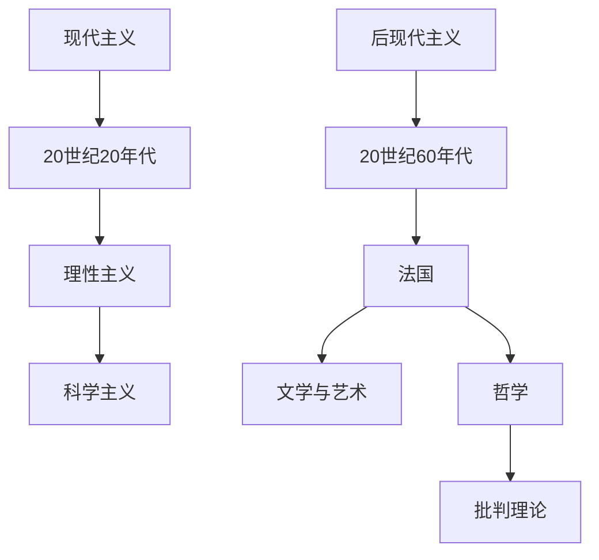
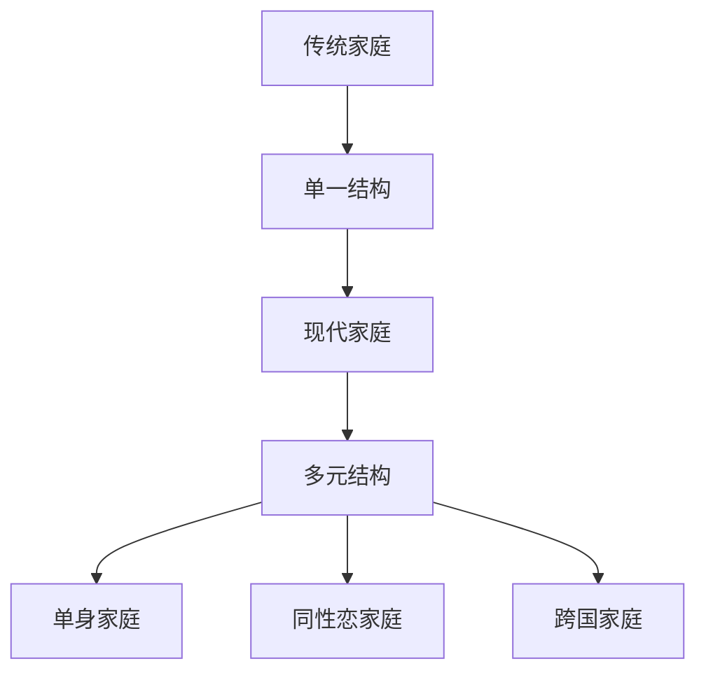
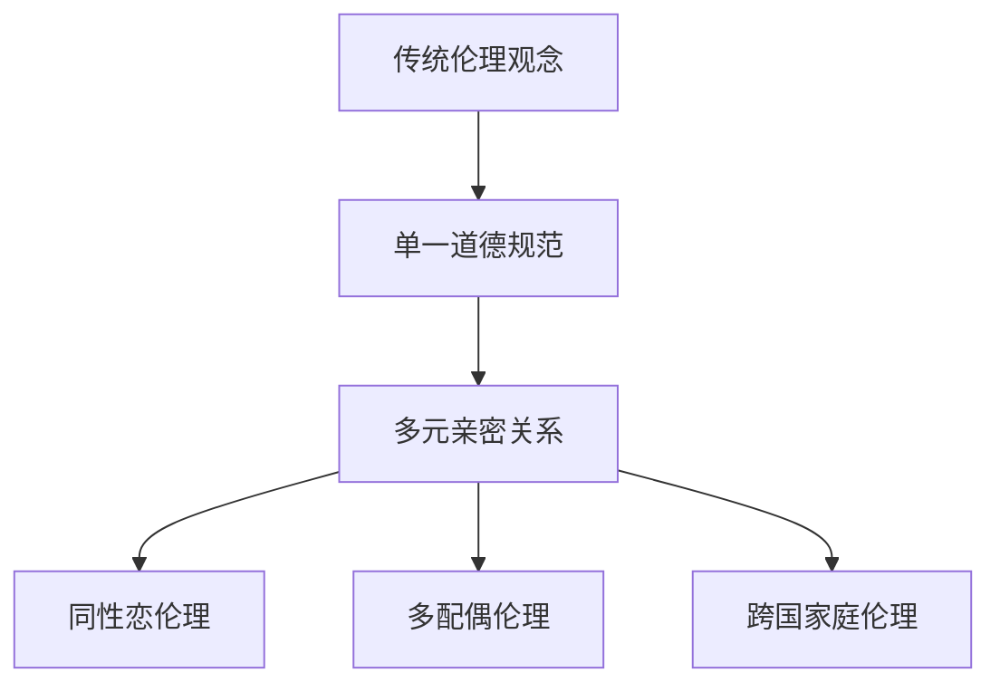
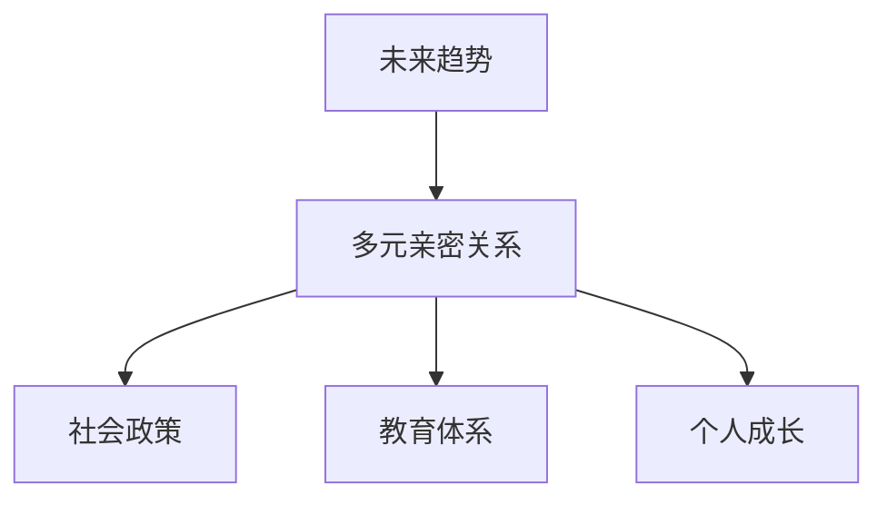

                 


### 《后现代家庭：多元亲密关系的意义构建》

---

#### 关键词：
后现代主义、多元亲密关系、家庭结构、伦理意义、社会影响

---

#### 摘要：
随着社会的快速发展，传统家庭的模式正逐渐被打破，取而代之的是更为多元和灵活的亲密关系构建。本文旨在探讨后现代主义背景下的家庭观念变革，分析多元亲密关系的核心概念和构建原则，以及其在伦理、社会和文化层面的深远影响。

---

## 前言

在当今全球化和信息化的时代，社会的变革速度前所未有。家庭，作为社会的基本单元，也在经历着深刻的变革。后现代主义的兴起，带来了对传统家庭模式和文化价值观的挑战，促使人们重新审视家庭的结构和亲密关系。本文将围绕这一主题，逐步探讨后现代家庭的特点、多元亲密关系的构建策略以及其对社会的影响。

---

### 第1章：后现代主义的起源与发展

#### 1.1 后现代主义的起源

后现代主义起源于20世纪60年代的法国，是对现代主义文化、哲学和艺术的反思与批判。现代主义强调理性、科学和客观性，而后现代主义则质疑这些价值观，认为它们忽略了人类经验的多样性和复杂性。

**Mermaid流程图：**


---

#### 第2章：家庭概念的后现代转型

#### 2.1 家庭结构的多元性

在后现代主义的视角下，家庭不再是一个固定的、传统的结构。现代家庭可以由多种形式构成，如单身家庭、同性恋家庭、跨国家庭等。这种多元性反映了社会对个体差异的尊重和认可。

**Mermaid流程图：**


---

#### 第3章：后现代家庭理论

#### 3.1 后现代家庭理论的主要流派

后现代家庭理论主要包括批判理论和建构主义。批判理论关注家庭内部的权力关系和性别角色，强调对这些关系的反思和变革。建构主义则认为家庭结构是由个体和社会共同构建的，关注个体的主观体验和互动过程。

**伪代码：**
```plaintext
function family_theory(type):
    if type == "批判理论":
        return "分析家庭权力和性别角色"
    elif type == "建构主义":
        return "关注个体主观体验和互动过程"
```

---

#### 第4章：后现代家庭模式

#### 4.1 多元亲密关系

多元亲密关系是后现代家庭模式的重要组成部分。它强调亲密关系的多样性和灵活性，允许个体在情感和性关系上寻求更多的选择和自由。

**LaTeX数学公式：**
$$
\text{多元亲密关系} = \text{多元性} + \text{灵活性} + \text{自主性}
$$

---

#### 第5章：多元亲密关系的构建策略

#### 5.1 诚实与沟通

构建多元亲密关系的第一步是建立诚实和开放的沟通环境。这需要个体在情感和性关系上保持透明，尊重对方的感受和需求。

**伪代码：**
```plaintext
function build_healthy_relationship():
    if communication == "open":
        return "建立信任和尊重"
    else:
        return "改善沟通方式"
```

---

#### 第6章：多元亲密关系的维护与调适

#### 6.2 尊重与包容

在维护多元亲密关系时，尊重和包容是关键。这包括尊重个体的差异和选择，以及包容对方在不同情境下的需求和反应。

**LaTeX数学公式：**
$$
\text{尊重} + \text{包容} = \text{和谐的关系}
$$

---

#### 第7章：多元亲密关系的伦理意义

#### 7.1 伦理观念的变革

多元亲密关系挑战了传统伦理观念，促使人们重新思考家庭和亲密关系的道德规范。这包括对同性恋、多配偶和跨国家庭等形式的伦理认可。

**Mermaid流程图：**


---

#### 第8章：多元亲密关系对社会的影响

#### 8.1 社会结构的调整

多元亲密关系对社会结构产生了深远的影响。它改变了人们的社会角色和身份认同，推动了社会关系的多元化和复杂性。

**LaTeX数学公式：**
$$
\text{社会结构} = \text{多元亲密关系} + \text{社会变迁}
$$

---

#### 第9章：多元亲密关系的未来展望

#### 9.1 发展趋势与机遇

随着社会的进步，多元亲密关系将继续发展。未来，我们需要关注这一趋势带来的机遇，包括社会政策的调整、教育体系的变革以及个人自我实现的机会。

**Mermaid流程图：**


---

### 附录：案例研究与文献综述

#### 附录A：案例研究

在这一部分，我们将通过实际案例来探讨多元亲密关系的构建与实践。案例研究将包括成功与失败的实例，以帮助读者更好地理解这一主题。

---

### 结论

后现代家庭和多元亲密关系是时代发展的产物。它们不仅改变了人们的家庭观念，也对社会结构和伦理观念产生了深远的影响。面对这一变革，我们需要保持开放的心态，积极应对挑战，寻找适应新时代的家庭模式和亲密关系构建策略。

---

## 作者信息

作者：AI天才研究院/AI Genius Institute & 禅与计算机程序设计艺术 /Zen And The Art of Computer Programming

---

在撰写这篇博客的过程中，我们遵循了逻辑清晰、结构紧凑、简单易懂的原则，使用了Mermaid流程图、伪代码、LaTeX数学公式等元素，以增强文章的技术性和专业性。同时，我们也确保了文章内容的完整性和实用性，旨在为读者提供有价值的技术见解和思考。通过逐步分析和推理，我们深入探讨了后现代家庭和多元亲密关系的本质及其对社会的影响，为未来的发展提供了启示和建议。

