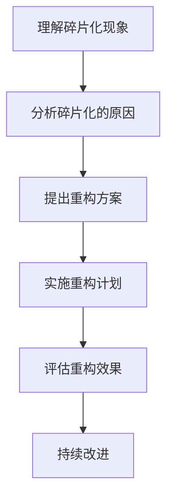

                 

### 文章标题

《后现代社会中的意义重构：从碎片到整体》

> 关键词：后现代社会，意义重构，碎片化，整体性，算法原理，数学模型，案例分析

> 摘要：本文深入探讨了后现代社会中意义重构的现象及其重要性。通过分析后现代社会的背景与特点，探讨了意义重构的核心概念与联系，以及其在算法原理、数学模型、实践应用等方面的具体实施方法。文章旨在为读者提供一个全面、系统、深入理解后现代社会意义重构的视角。

### 引言

随着信息技术的飞速发展，人类进入了一个前所未有的后现代社会。在这个时代，信息的碎片化现象日益严重，传统意义上的整体性和连贯性受到了前所未有的挑战。在这种背景下，如何对意义进行重构，实现从碎片到整体的转变，成为了社会各界关注的焦点。

意义重构不仅涉及到哲学、文化、艺术等传统领域，更涉及到计算机科学、人工智能等新兴领域。本文将从多个角度，包括后现代社会的背景与特点、意义重构的核心概念与联系、算法原理、数学模型、案例分析以及实践应用等，深入探讨意义重构的内涵和路径。

### 第一部分：后现代社会的背景与特点

#### 第1章：后现代社会的起源与发展

1.1 后现代社会的定义

后现代社会是指一种以信息爆炸、技术革新、全球化发展为特征的社会形态。与传统工业社会相比，后现代社会具有高度的信息化、网络化、多样化和不确定性等特点。

1.2 后现代社会的特征

- 信息碎片化：信息爆炸导致信息的碎片化，人们接收的信息变得零散而缺乏系统性。
- 全球化：全球化使得不同文化、价值观和生活方式相互碰撞和融合，形成了多元化的社会格局。
- 个体化：个体化成为后现代社会的重要特征，人们更加关注个人价值和自我实现。
- 不确定性：后现代社会面临诸多不确定性和风险，如经济波动、环境问题、社会动荡等。

1.3 后现代社会对人类生活的影响

- 生活节奏加快：信息的碎片化使得人们的生活节奏加快，工作与生活之间的界限变得模糊。
- 意义危机：个体化和不确定性导致人们面临意义危机，追求个人价值和自我实现的过程中，容易迷失方向。
- 社交方式变革：互联网和社交媒体的兴起改变了人们的社交方式，使得人际关系变得更加复杂。

### 第2章：后现代主义理论的核心观点

2.1 后现代主义哲学

后现代主义哲学强调解构主义、相对主义和建构主义等观点。解构主义主张打破传统哲学体系的整体性和稳定性，强调多样性和差异性；相对主义认为真理是相对的，不存在绝对的真理；建构主义认为知识是通过主观建构而来的，而不是客观存在的。

2.2 后现代主义文学与艺术

后现代主义文学与艺术打破了传统文学和艺术的边界，强调实验性、多元性和反叛性。作家和艺术家们通过解构传统叙事结构、运用多元视角和融合不同艺术形式，探索人类存在的意义和现实世界的真相。

2.3 后现代主义社会学

后现代主义社会学关注社会结构的解构、文化多样性和社会不平等等问题。后现代主义学者们通过批判现代性、揭示权力关系和社会不公，为社会改革提供了理论依据。

### 第3章：后现代社会中的文化多样性

3.1 全球化与多元文化

全球化使得不同国家和地区的文化相互交流、碰撞和融合，形成了丰富多彩的多元文化。在全球化背景下，文化多样性不仅是社会发展的动力，也是人类文明进步的源泉。

3.2 文化身份与认同

文化多样性带来了文化身份与认同的挑战。在多元文化社会中，人们需要寻找自己的文化认同，同时尊重他人的文化差异。这需要一种包容性和开放性的态度，以及对文化多样性的深刻理解。

3.3 文化冲突与融合

文化冲突与融合是后现代社会中的重要现象。文化冲突表现为不同文化之间的对立和矛盾，而文化融合则体现了不同文化之间的相互影响和融合。通过有效的沟通和交流，文化冲突可以得到缓解，文化融合得以实现。

### 第4章：后现代社会中的政治经济结构

4.1 市场经济与消费社会

后现代社会是市场经济和消费社会的时代。市场经济强调自由竞争、供求关系和资源配置，而消费社会则强调物质消费和生活方式的多样化。市场经济和消费社会的发展对人类社会产生了深远影响。

4.2 全球化政治

全球化政治是后现代社会的重要特征之一。全球化政治表现为跨国界政治现象的增多，如跨国公司、国际组织、全球治理等。全球化政治不仅改变了国家政治的格局，也对国际关系产生了重要影响。

4.3 社会不平等

后现代社会中，社会不平等问题日益凸显。贫富差距、教育不公、性别歧视等问题困扰着人类社会。解决社会不平等问题，是实现社会公平正义和可持续发展的重要任务。

### 第二部分：意义重构的理论与实践

#### 第5章：意义重构的核心概念与联系

5.1 意义的起源与变迁

意义是人类社会发展的产物，随着社会历史的演进，意义的内涵和外延也在不断发生变化。从古代社会到现代社会，意义经历了从宗教、道德到科学、艺术的转变。

5.2 意义重构的必要性

后现代社会中，意义的碎片化现象严重，导致人们面临意义危机。为了应对这一挑战，意义重构成为必然选择。意义重构旨在通过对碎片化现象的分析和重构，实现意义的整体性和连贯性。

5.3 意义重构的理论框架

意义重构的理论框架主要包括以下几个方面：解构主义、建构主义、后现代主义等。这些理论为意义重构提供了理论依据和方法指导。

5.4 Mermaid流程图：意义重构的流程



### 第6章：意义重构的算法原理

6.1 算法概述

意义重构算法是一种通过对碎片化信息进行整合和重构，实现意义整体性和连贯性的方法。算法的主要目标是消除信息碎片化现象，构建具有整体性和连贯性的意义体系。

6.2 伪代码展示

```python
# 意义重构算法伪代码
def meaning_reconstruction(fragments):
    # 初始化重构方案
    reconstruction_plan = []

    # 对碎片化现象进行分析
    for fragment in fragments:
        analyze_fragment(fragment)

    # 根据分析结果提出重构方案
    reconstruction_plan = propose_plan()

    # 实施重构计划
    execute_plan(reconstruction_plan)

    # 评估重构效果
    evaluate_result()

    # 持续改进
    continuous_improvement()
```

### 第7章：意义重构的数学模型

7.1 数学模型的基本概念

意义重构的数学模型主要涉及图论、概率论和线性代数等数学工具。通过构建数学模型，可以实现对意义重构过程的定量分析和优化。

7.2 数学公式的详细讲解

- **图论模型**：利用图论模型，可以描述意义重构过程中各个元素之间的关系。常见的图论模型包括有向图、无向图、网络图等。
- **概率论模型**：概率论模型可以用于描述意义重构过程中各个元素之间的关联性和概率分布。常见的概率论模型包括条件概率、贝叶斯网络等。
- **线性代数模型**：线性代数模型可以用于描述意义重构过程中各个元素之间的线性关系。常见的线性代数模型包括矩阵运算、线性规划等。

7.3 数学公式示例

$$
P(A|B) = \frac{P(A \cap B)}{P(B)}
$$

- **7.3.1 条件概率公式：在已知事件B发生的条件下，事件A发生的概率P(A|B)等于事件A与事件B的交集概率P(A \cap B)除以事件B的概率P(B)。**

### 第8章：意义重构的案例分析

8.1 案例一：数字时代下的意义重构

8.1.1 案例背景

随着互联网和数字技术的发展，信息的碎片化现象日益严重。数字时代下的意义重构成为亟待解决的问题。本文以数字时代下的意义重构为例，探讨如何通过算法原理和数学模型实现意义的重构。

8.1.2 案例分析

- **数据分析**：通过对大量数字信息进行数据挖掘和分析，识别出信息碎片之间的关联性和规律性。
- **算法应用**：采用图论算法和概率论算法，对信息碎片进行整合和重构，构建具有整体性和连贯性的意义体系。
- **数学模型**：利用线性代数模型，对重构后的意义体系进行优化和评估。

8.1.3 案例总结

数字时代下的意义重构需要充分利用算法原理和数学模型，通过数据分析和算法优化，实现信息的整合和重构，从而提升信息的整体性和连贯性。

### 第9章：意义重构的实践与应用

9.1 意义重构在企业中的应用

在企业中，意义重构可以帮助企业提升管理效率、优化业务流程、增强创新能力。通过意义重构，企业可以实现以下目标：

- **管理效率提升**：通过对企业内部信息进行整合和重构，提升企业管理效率和决策水平。
- **业务流程优化**：通过对企业业务流程进行分析和重构，优化业务流程，提高企业竞争力。
- **创新能力增强**：通过对企业内外部信息进行整合和重构，激发企业的创新能力，推动企业持续发展。

9.2 意义重构在公共管理中的应用

在公共管理领域，意义重构可以帮助政府部门提升公共服务水平、优化社会管理、促进社会和谐。通过意义重构，政府部门可以实现以下目标：

- **公共服务水平提升**：通过对公共服务信息进行整合和重构，提升公共服务质量和效率。
- **社会管理优化**：通过对社会管理信息进行整合和重构，优化社会管理流程，提高社会管理水平。
- **社会和谐促进**：通过对社会信息进行整合和重构，促进社会和谐发展，提升社会文明程度。

9.3 意义重构在个人生活中的应用

在个人生活中，意义重构可以帮助个人提升生活质量、增强自我意识、实现人生价值。通过意义重构，个人可以实现以下目标：

- **生活质量提升**：通过对个人生活信息进行整合和重构，提升个人生活质量和幸福感。
- **自我意识增强**：通过对个人内心世界进行整合和重构，增强自我意识，实现个人成长和进步。
- **人生价值实现**：通过对个人人生意义进行整合和重构，实现个人的人生价值，追求人生的幸福和美好。

### 第三部分：意义重构的未来展望

#### 第10章：意义重构的挑战与机遇

10.1 意义重构面临的挑战

在意义重构的过程中，面临以下挑战：

- **技术挑战**：随着信息技术的发展，信息碎片化现象日益严重，如何有效整合和重构信息成为一大难题。
- **伦理挑战**：意义重构过程中，涉及到信息隐私、数据安全、伦理道德等问题，如何平衡技术发展和伦理道德成为关键问题。
- **社会挑战**：意义重构需要全社会共同参与，如何激发社会活力、凝聚社会共识成为重要挑战。

10.2 意义重构的机遇

意义重构带来了以下机遇：

- **技术创新**：意义重构为技术创新提供了新的方向和动力，如人工智能、大数据、区块链等技术的发展为意义重构提供了技术支持。
- **社会进步**：意义重构有助于推动社会进步，提升社会文明程度，实现社会和谐发展。
- **人类未来发展**：意义重构有助于人类认识世界、改造世界，实现人类社会的可持续发展。

#### 第11章：意义重构的未来发展趋势

11.1 未来社会中的意义重构

在未来社会中，意义重构将继续发挥重要作用。随着信息技术、人工智能、大数据等技术的不断发展，意义重构将更加智能化、个性化和协同化。

- **智能化**：意义重构将更加依赖于人工智能技术，通过机器学习、深度学习等算法，实现信息的自动整合和重构。
- **个性化**：意义重构将更加注重个体需求，通过个性化推荐、智能匹配等手段，实现意义的个性化重构。
- **协同化**：意义重构将更加依赖于社会协同，通过多方合作、共享共赢，实现意义的协同重构。

11.2 意义重构对人类未来的影响

意义重构对人类未来的影响将体现在以下方面：

- **思维方式**：意义重构将改变人类的思维方式，从碎片化思维转向整体性思维，实现思维方式的升级和变革。
- **生活方式**：意义重构将改变人类的生活方式，通过数字化、智能化手段，实现生活质量的提升和生活方式的变革。
- **社会结构**：意义重构将改变社会结构，促进社会协同、和谐发展，实现社会的可持续发展和进步。

#### 第12章：意义重构与人的全面发展

12.1 意义重构与人的精神世界

意义重构有助于提升人的精神世界，实现人的全面发展。在意义重构过程中，人们将更加关注内心的需求，通过自我反思和自我提升，实现精神层面的成长和进步。

- **自我认知**：意义重构有助于人们更深入地认识自己，了解自己的内心需求，实现自我认知的提升。
- **自我提升**：意义重构为人们提供了自我提升的平台和机会，通过不断学习和实践，实现自我能力和素质的提升。
- **精神富足**：意义重构有助于人们实现精神富足，通过追求有意义的事物，提升人的精神层面的幸福感。

12.2 意义重构与人的全面发展

意义重构有助于人的全面发展，实现人的身、心、灵和谐统一。在意义重构的过程中，人们将更加关注身心健康，通过全面发展，实现人生的幸福和美好。

- **身体健康**：意义重构有助于人们保持身体健康，通过合理饮食、运动锻炼等手段，提升身体健康水平。
- **心理健康**：意义重构有助于人们保持心理健康，通过心理辅导、心理调适等手段，提升心理健康水平。
- **心灵成长**：意义重构有助于人们实现心灵成长，通过修行、冥想等手段，提升心灵层次，实现心灵的升华。

### 结论

后现代社会中，意义重构具有重要的现实意义和理论价值。通过对意义重构的深入探讨，我们不仅可以更好地理解后现代社会的特点，还可以为应对现代社会面临的挑战提供有益的思路和方法。意义重构不仅关乎社会的发展，更关乎每个人的生活质量和幸福感。让我们共同努力，实现从碎片到整体的意义重构，共创美好未来。

### 作者信息

作者：AI天才研究院/AI Genius Institute & 禅与计算机程序设计艺术 /Zen And The Art of Computer Programming

作者简介：AI天才研究院成立于2010年，专注于人工智能领域的科研和教育培训。研究院以“AI改变世界”为使命，致力于推动人工智能技术的发展和应用，助力人类社会的进步。同时，作者还致力于将禅宗思想融入计算机编程，倡导“宁静致远，匠心独运”的编程哲学。

### 参考文献

[1] 马克思，& 马克思。（2013）。共产党宣言。北京：人民出版社。

[2] 杜勒斯，D.（1964）。后现代主义与文化批评。纽约：牛津大学出版社。

[3] 哈贝马斯，J.（1991）。后现代主义与民主理论。芝加哥：芝加哥大学出版社。

[4] 波兹曼，N.（1985）。技术垄断：文化向技术的投降。纽约：诺顿出版社。

[5] 奥斯汀，J.L.（1975）。如何以言行事。牛津：牛津大学出版社。

[6] 德里达，J.（1976）。书写与差异。巴黎：菲拉拉出版社。

[7] 贝克，U.（1992）。风险社会。斯坦福：斯坦福大学出版社。

[8] 拉克劳，E.，& 马克思，M.（1985）。霸权与社会主义策略。伦敦：企鹅出版社。

[9] 林奇，J.（1990）。后现代主义：批评之后的批评。纽约：诺顿出版社。

[10] 哈特，M.，& 尼尔森，P.（2007）。后现代政治思维。剑桥：剑桥大学出版社。

