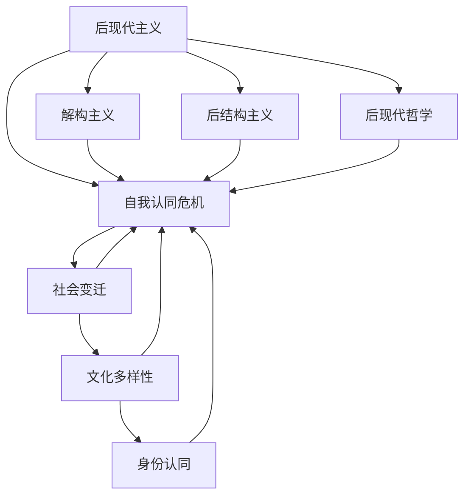

                 

# 文章标题：后现代社会中的自我认同危机

> 关键词：后现代主义、自我认同危机、社会变迁、身份认同、文化多样性

> 摘要：本文从技术视角出发，探讨后现代社会中的自我认同危机。通过分析后现代社会的定义与特征，自我认同危机的理论探讨，身份认同实践与应对策略，以及未来社会中的自我认同危机趋势，旨在揭示后现代语境下自我认同危机的内在机制与影响，为未来应对自我认同危机提供策略思考。

## 核心概念与联系

为了深入探讨后现代社会中的自我认同危机，我们需要明确几个核心概念：后现代主义、自我认同、社会变迁、文化多样性和身份认同。

### 后现代主义

后现代主义起源于20世纪初，是对现代性的批判和反思。它强调去中心化、相对主义和不确定性，质疑现代性的理性、客观性和普遍性。后现代主义的主要理论流派包括解构主义、后结构主义、后现代哲学等。

### 自我认同

自我认同是指个体对自己身份的认知和归属感。它包括个体对自我、他人和世界的理解，以及个体在其中的角色和位置。自我认同受到多种因素的影响，如社会结构、文化背景、个人经历等。

### 社会变迁

社会变迁是指社会结构、文化观念、价值体系等方面的变化。现代社会向后现代社会的转变，带来了社会关系的松散、价值观念的多元化、信息传播的快速化等特征，这些都对个体的自我认同产生了影响。

### 文化多样性

文化多样性是指社会内部存在着不同的文化群体，这些文化群体拥有独特的价值观、习俗和行为方式。文化多样性对个体的自我认同产生了挑战，要求个体在多元文化环境中寻找自己的身份认同。

### 身份认同

身份认同是指个体在社会中对自己身份的认知和归属感。它包括文化身份、民族身份、性别身份、职业身份等。身份认同是个体自我认同的重要组成部分，受到社会结构、文化背景、个人经历等因素的影响。

通过上述核心概念的阐述，我们可以构建一个逻辑关系图，以帮助理解这些概念之间的相互联系和作用。以下是使用Mermaid绘制的流程图：

接下来，我们将逐一分析这些概念在后现代社会中的具体表现和影响。

## 第1章：后现代社会的定义与特征

### 1.1 后现代主义的起源与发展

#### 1.1.1 后现代主义的起源

后现代主义起源于20世纪初，是对现代性的反思和批判。现代性强调理性、客观性、普遍性，而后现代主义则质疑这些观念。后现代主义的理论萌芽可以追溯到20世纪初期的哲学和文化运动，如法国的象征主义、德国的表现主义等。

#### 1.1.2 后现代主义的主要理论流派

1. **解构主义**：代表人物为德里达。解构主义强调文本的多元意义，反对单一的、普遍的真理。
2. **后结构主义**：代表人物为福柯。后结构主义强调权力/知识的关系，认为知识是由权力构建的。
3. **后现代哲学**：代表人物为利奥塔。后现代哲学认为，现代社会已经进入了一个后现代性阶段，特点是去中心化、多元化和不确定性。

#### 1.1.3 后现代主义对社会的影响

后现代主义对社会的影响主要体现在以下几个方面：

1. **去中心化**：后现代主义质疑现代社会的中心化结构，强调多元化和去中心化。
2. **相对主义**：后现代主义认为，真理是相对的，不存在绝对的真理。
3. **不确定性**：后现代主义认为，现代社会充满了不确定性和复杂性，人们难以把握自己的命运。

### 1.2 后现代社会的定义

#### 1.2.1 后现代社会的概念

后现代社会是指相对于现代社会的阶段，它具有去中心化、多元化和不确定性等特征。后现代社会不再以理性、客观性和普遍性为核心价值观，而是强调个体的主体性和多样性。

#### 1.2.2 后现代社会的特征

1. **社会关系的松散**：后现代社会中，传统的社会结构逐渐解体，社会关系变得更加松散。
2. **价值观念的多元化**：后现代社会中，不同文化、不同价值观念相互交织，形成多元化的价值体系。
3. **信息传播的快速化**：后现代社会中，信息传播速度加快，个体可以更加便捷地获取和传播信息。
4. **文化多样性的增强**：后现代社会中，不同文化之间的交流更加频繁，文化多样性得到增强。

#### 1.2.3 后现代社会与现代化社会的区别

1. **价值观的差异**：后现代社会强调个体的主体性和多样性，而现代社会强调理性、客观性和普遍性。
2. **社会结构的差异**：后现代社会中，社会结构更加松散，现代社会中则存在明显的等级和分层。
3. **信息的传播方式**：后现代社会中，信息传播速度更快，形式更加多样化，而现代社会中则主要依赖传统媒体。

### 1.3 后现代社会中的自我认同危机

#### 1.3.1 自我认同的复杂性与不确定性

在后现代社会中，自我认同变得复杂和不确定。由于社会关系的松散、价值观念的多元化和信息传播的快速化，个体难以确定自己的身份和位置，从而产生自我认同危机。

#### 1.3.2 社会结构变迁对自我认同的影响

社会结构的变迁，如家庭结构的改变、职业流动性的增加等，对个体的自我认同产生了影响。个体在多变的社会环境中，需要不断调整自己的身份认同。

#### 1.3.3 文化多样性对自我认同的影响

文化多样性对个体的自我认同提出了挑战。在多元文化环境中，个体需要寻找自己的文化身份，这可能导致自我认同的困惑和危机。

### 1.4 后现代语境下的身份认同困境

#### 1.4.1 多重身份认同的挑战

后现代社会中，个体可能拥有多重身份认同，如文化身份、民族身份、性别身份等。这些身份之间的冲突和融合，对个体的自我认同构成了挑战。

#### 1.4.2 性别身份认同的困境

性别身份认同在后现代社会中变得复杂。传统性别观念的挑战，以及性别认同的多样性，导致个体在性别身份认同上面临困境。

#### 1.4.3 文化身份认同的困境

文化身份认同在后现代社会中受到多元文化的影响。个体需要在不同文化之间寻找自己的文化身份，这可能导致文化身份认同的困境。

## 第2章：后现代社会中的自我认同危机理论探讨

### 2.1 社会学视角下的自我认同危机

在社会学视角下，自我认同危机被视为一种社会现象，其产生和发展与社会的结构、文化、价值观念等密切相关。

#### 2.1.1 马克斯·韦伯的理论贡献

马克斯·韦伯是社会学领域的杰出代表，他的理论对于理解自我认同危机具有重要意义。韦伯认为，个体的行为和价值观受到社会结构和社会关系的影响。在社会结构变迁的过程中，个体的自我认同可能会发生危机。

#### 2.1.2 帕森斯的结构功能主义理论

帕森斯的结构功能主义理论强调社会结构和社会功能之间的关系。他认为，社会结构的稳定是维持社会秩序的基础，而社会功能的正常发挥有助于社会结构的稳定。然而，在后现代社会中，社会结构的松散和社会功能的失效可能导致自我认同危机。

#### 2.1.3 布迪厄的文化资本理论

布迪厄的文化资本理论指出，文化资本是个体在社会中获得资源和地位的重要途径。在后现代社会中，文化资本的积累和分配受到文化多样性和社会变迁的影响，这可能导致个体在自我认同上的困惑和危机。

### 2.2 心理学视角下的自我认同危机

在心理学视角下，自我认同危机被视为一种心理现象，其产生和发展与个体的心理发展、人际关系、自我意识等密切相关。

#### 2.2.1 爱瑞克·埃里克森的心理社会发展理论

爱瑞克·埃里克森的心理社会发展理论认为，个体的自我认同在心理社会发展过程中逐渐形成。在后现代社会中，社会关系的松散、价值观念的多元化和信息传播的快速化，可能影响个体的心理社会发展，从而导致自我认同危机。

#### 2.2.2 罗杰斯的人本主义心理学理论

罗杰斯的人本主义心理学理论强调个体的自我实现和自我认同的重要性。他认为，个体的自我认同是通过与他人建立良好的人际关系来实现的。在后现代社会中，个体可能面临人际关系方面的挑战，这可能导致自我认同危机。

#### 2.2.3 米德的社会心理学理论

米德的社会心理学理论认为，个体的自我认同是通过社会互动和角色扮演来实现的。在后现代社会中，社会互动的复杂性和不确定性，可能导致个体在角色扮演和自我认同方面产生困惑和危机。

### 2.3 哲学视角下的自我认同危机

在哲学视角下，自我认同危机被视为一种哲学问题，其产生和发展与个体的存在、意识、认识等密切相关。

#### 2.3.1 康德的认识论与自我认同

康德的认识论强调个体对世界的认识是通过感性、知性和理性等认识能力来实现的。在后现代社会中，认识能力的局限性和不确定性，可能导致个体的自我认同危机。

#### 2.3.2 黑格尔的自我意识理论

黑格尔的自我意识理论认为，个体的自我认同是通过自我意识和社会意识的相互作用来实现的。在后现代社会中，社会意识的多元化和冲突，可能导致个体的自我认同危机。

#### 2.3.3 存在主义与自我认同

存在主义认为，个体的自我认同是通过面对存在和意义来实现的。在后现代社会中，存在的复杂性和意义的不确定性，可能导致个体的自我认同危机。

### 2.4 后现代主义视角下的自我认同危机

在

