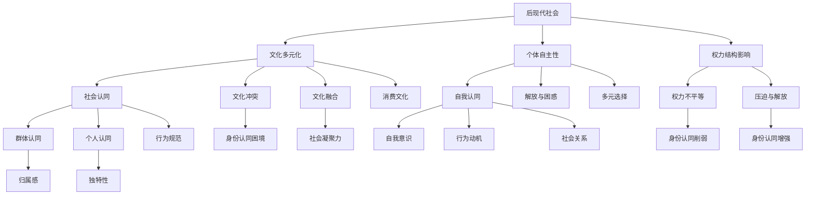

                 

### 文章标题

# 后现代社会中的身份认同：谁是真正的我？

### 关键词

- 后现代社会
- 身份认同
- 文化多元化
- 心理健康
- 社会行动

### 摘要

在快速变化的后现代社会中，个体身份认同成为了一个备受关注的议题。《后现代社会中的身份认同：谁是真正的我？》这篇文章通过深入探讨后现代社会的定义、特征，以及身份认同的理论基础，分析了个体身份认同在多元文化背景下的困境与挑战。文章从心理学视角解读了身份认同的心理机制和健康影响，探讨了社会行动对身份认同的作用，并对身份认同的未来趋势进行了展望。通过对这些方面的详细分析，本文旨在帮助读者更好地理解身份认同问题，并为其在现代社会中的自我探索提供指导。

## 引言

### 后现代社会的兴起与身份认同的重要性

后现代社会是一个相对较新的概念，起源于20世纪中叶，尤其与法国哲学家让-弗朗索瓦·利奥塔（Jean-François Lyotard）的工作密切相关。后现代主义强调现代社会中知识、真理、价值观的相对性，认为传统的社会结构和意识形态正在瓦解。这种社会背景为个体身份认同带来了前所未有的挑战和机遇。

身份认同（Identity）是指个体对自己本质的感知和认识，包括个人的价值观、信仰、文化背景等。在传统社会中，身份认同往往与家庭、民族、宗教等紧密相关，具有明确的边界和稳定性。然而，在后现代社会中，身份认同变得复杂而多变，受到全球化、技术进步、文化多元化等多种因素的影响。

后现代社会中的身份认同问题的重要性体现在以下几个方面：

1. **个体自主性**：在后现代社会中，个体有更多的自由去选择和塑造自己的身份，这既是一种解放，也可能导致身份的模糊和困惑。
2. **社会凝聚力**：身份认同的多元化可能导致社会分裂和冲突，如何保持社会凝聚力成为了一个重要议题。
3. **心理健康**：身份认同的不稳定可能对个体的心理健康产生负面影响，如自我怀疑、焦虑等。
4. **社会参与**：身份认同影响个体对社会的归属感和参与感，影响其在社会中的角色和地位。

因此，探讨后现代社会中的身份认同问题不仅有助于理解个体的内心世界，也对社会的稳定和发展具有重要意义。本文将通过多个角度分析后现代社会中的身份认同问题，为读者提供一个全面而深入的视角。

### 目标读者群体

本文的目标读者群体主要包括以下几个方面：

1. **学术研究者**：包括社会学家、人类学家、文化研究者等，他们可能对后现代理论和身份认同问题有较高的学术兴趣，希望通过本文深入理解这一议题。
2. **普通读者**：对后现代理论和文化现象感兴趣的一般读者，希望通过本文了解后现代社会中身份认同的复杂性。
3. **心理健康专业人士**：如心理咨询师、治疗师等，他们可能希望从心理学视角探讨身份认同问题，以更好地服务其客户。
4. **社会活动家和社会工作者**：对这些领域的工作者来说，了解身份认同问题有助于他们更有效地参与社会行动和促进社会公正。

通过针对不同读者的需求，本文力求为各群体提供有价值的见解和思考。

### 文章结构与内容安排

本文将按照以下结构安排内容：

1. **前序部分**：介绍后现代社会的定义、特征及其对身份认同的影响，明确文章的研究背景和目标。
2. **理论基础部分**：探讨身份认同的概念、理论基础以及多元文化背景下的身份认同问题。
3. **核心分析部分**：分析后现代社会中的身份认同困境、社会文化因素对身份认同的影响，以及心理学视角下的身份认同问题。
4. **社会行动与未来展望部分**：探讨社会行动对身份认同的影响以及身份认同的未来趋势。
5. **总结与结论**：总结文章的主要观点，强调身份认同问题的重要性，并对未来研究方向进行展望。

通过这样的结构安排，本文力求条理清晰、内容丰富，帮助读者全面理解后现代社会中的身份认同问题。

## 后现代社会的兴起

### 后现代的定义

后现代（Postmodernism）是一个复杂而广泛的概念，涉及文化、社会、哲学等多个领域。简而言之，后现代主义是一种对现代社会结构和主流意识形态的批判，强调知识、真理、价值观的相对性和多元性。它起源于20世纪中叶，尤其是在法国学术界和艺术界获得了广泛关注。

后现代主义的核心理念包括：

1. **相对主义**：认为不存在绝对的知识和真理，所有知识都是相对的，取决于特定的历史、文化和社会背景。
2. **解构主义**：强调通过批判性分析来揭示文本、意识形态和社会结构中的矛盾和不确定性。
3. **多元化**：主张多元文化、多元价值观的存在，反对单一文化或意识形态的霸权。
4. **碎片化**：认为现代社会是一个由碎片化、异质化的元素构成的网络，传统的社会结构和组织形式已经不再适用。

### 后现代的主要特征

后现代社会的特征可以从多个方面来理解：

1. **文化多元化**：后现代社会中，文化不再由单一中心决定，而是由多个文化力量共同塑造。全球化带来了不同文化的交流和碰撞，使得文化多元化成为后现代社会的显著特征。

2. **媒体与信息传播**：信息技术的发展，特别是互联网和社交媒体的兴起，改变了信息传播的方式。信息传播的碎片化、即时性和去中心化，使得个体能够更容易地获取和分享信息，同时也带来了信息过载和信息真实性难以保证的问题。

3. **消费文化**：后现代社会是一个高度消费主义的社会，物质财富和消费行为成为社会生活的重要部分。消费文化不仅影响个体的生活方式，也塑造了社会的价值观和意识形态。

4. **去中心化**：传统的社会结构往往具有明显的中心与边缘关系，而后现代社会则强调去中心化，认为不存在固定的中心或权威。这种去中心化不仅体现在社会组织形式上，也反映在个体的自我认同和身份构建中。

### 后现代对社会的影响

后现代对社会的多个方面产生了深远影响：

1. **政治领域**：后现代主义质疑现代政治制度的合法性和代表性，推动了政治参与方式的多样化和去中心化。同时，它也引发了对民主、权力、正义等政治概念的新思考。

2. **文化领域**：后现代主义挑战了传统艺术的权威，促进了实验性和多元文化的兴起。艺术创作不再局限于单一的风格或形式，而是更加注重多元性和个体性。

3. **教育领域**：后现代教育理念强调学生的主动性和创造性，倡导多元化学习方式和批判性思维。教育不再只是传授知识，而是注重培养学生的独立思考能力和社会责任感。

4. **经济领域**：后现代经济强调知识经济和服务业的重要性，传统的工业经济模式逐渐被知识密集型经济所取代。经济全球化也使得不同文化背景的个体在经济活动中扮演更重要的角色。

### 后现代与身份认同

在后现代社会中，身份认同问题变得尤为重要。身份认同不仅受到个体的主观感知和选择的影响，也受到社会文化、政治经济等多方面的制约。

1. **个体的自主性**：后现代强调个体的自主性和多元性，个体有更多的自由去选择和定义自己的身份。这种自主性既是一种解放，也可能导致身份的不确定性和困惑。

2. **多元文化背景**：后现代社会的文化多元化使得个体在身份认同上面临更多的选择和挑战。个体需要在多元文化中找到自己的位置，这既可能增强身份认同，也可能导致身份认同的冲突和困境。

3. **社会文化的制约**：尽管后现代强调个体的自主性，但社会文化仍然在很大程度上影响个体的身份认同。家庭、社会、媒体等外部因素对个体身份的塑造和重构具有深远的影响。

4. **权力结构的影响**：后现代主义质疑现代社会的权力结构，认为权力关系对个体的身份认同有重要影响。权力不平等和压迫可能削弱个体的身份认同，而权力平等和解放则可能增强个体的身份认同。

通过以上分析，可以看出后现代社会的兴起对身份认同产生了深远的影响。理解这些影响有助于我们更好地探讨个体在后现代社会中的身份认同问题，并为解决这一问题提供理论依据。

### 身份认同的理论基础

#### 自我认同的概念

自我认同（Self-identity）是指个体对自己本质的认知和感知，包括个体的价值观、信念、文化背景等。自我认同是身份认同的核心部分，它决定了个体在社会中的定位和行为方式。

自我认同的发展可以分为以下几个阶段：

1. **童年阶段**：在这一阶段，个体的自我认同主要受到家庭和文化环境的影响。家庭关系、父母教育等对个体的自我认同形成有重要影响。
2. **青少年阶段**：青少年时期，个体开始独立思考和探索自己的身份。他们可能会尝试不同的角色和价值观，以找到最符合自己内心的认同。
3. **成年阶段**：成年后，个体的自我认同趋于稳定，但仍然会随着生活的变化和外部环境的影响而进行调整和重塑。

自我认同的重要性体现在以下几个方面：

1. **自我意识**：自我认同帮助个体建立自我意识，明确自己在社会中的角色和地位。
2. **行为动机**：自我认同影响个体的行为动机，使个体能够根据自己的价值观和信仰做出决策。
3. **社会关系**：自我认同影响个体与他人的互动，塑造个体在社会中的社会关系和网络。

#### 社会认同的理论

社会认同（Social identity）是指个体在群体中找到自己的位置，并认同该群体的价值观、目标和身份。社会认同包括群体认同和个人认同两个层面。

1. **群体认同**：群体认同是指个体认同某一群体，如民族、种族、职业、宗教等。群体认同为个体提供归属感和认同感，增强个体在群体中的凝聚力和归属感。
2. **个人认同**：个人认同是指个体在群体中的独特性，包括个体的个性、兴趣、价值观等。个人认同使个体在群体中保持独立性和独特性。

社会认同的作用包括：

1. **群体凝聚**：社会认同有助于增强群体凝聚力，促进群体内部的协作和合作。
2. **自我定义**：社会认同帮助个体定义自己，明确自己在社会中的角色和地位。
3. **行为规范**：社会认同为个体提供行为规范，使个体在特定情境中知道如何行动。

社会认同的类型可以分为以下几种：

1. **积极认同**：积极认同是指个体对群体的认同和支持，使个体在群体中获得认同感和归属感。
2. **消极认同**：消极认同是指个体对群体的反感和排斥，可能源于群体内部的冲突和矛盾。
3. **双重认同**：双重认同是指个体同时认同多个群体，如民族认同和文化认同。双重认同可能带来身份认同的冲突和困境。

#### 多元文化背景下的身份认同

在多元文化背景下，身份认同变得复杂而多变。多元文化不仅丰富了社会的内容，也为个体提供了更多的选择和可能性。然而，多元文化也可能导致身份认同的困境和冲突。

1. **文化多样性**：多元文化为个体提供了多样的文化背景和价值观，使个体有更多的机会去探索和定义自己的身份。
2. **文化冲突**：多元文化也可能导致文化冲突，如不同文化价值观的冲突、文化霸权的存在等。这些冲突可能影响个体的身份认同，使其感到不确定和困惑。
3. **文化融合**：文化融合是指不同文化之间的相互影响和融合，有助于增强社会凝聚力和个体身份认同。

在多元文化背景下，个体需要：

1. **保持开放心态**：对不同的文化保持开放和尊重，避免文化偏见和歧视。
2. **寻找共同点**：在多元文化中寻找共同点，增强群体凝聚力和身份认同。
3. **尊重差异**：尊重不同文化的差异，避免文化冲突和身份认同困境。

通过理解自我认同、社会认同以及多元文化背景下的身份认同，我们可以更好地探讨个体在后现代社会中的身份认同问题，并为解决这一问题提供理论依据。

#### 核心概念之间的联系架构

为了更好地理解后现代社会中的身份认同问题，我们可以通过一个Mermaid流程图来展示核心概念之间的关系架构：

在这个流程图中，后现代社会作为起点，与多个核心概念相连接，展示了文化多元化、个体自主性、社会认同（包括群体认同和个人认同）、自我认同以及多元文化背景下的身份认同问题之间的相互作用。通过这一架构，我们可以更清晰地理解这些概念之间的关系，从而深入探讨后现代社会中的身份认同问题。

### 后现代社会中的身份认同问题

#### 身份认同的困境

在后现代社会中，身份认同问题面临着诸多困境，这些困境主要体现在以下几个方面：

1. **多元化背景下的身份认同冲突**：随着全球化和文化多元化的发展，个体面临着越来越多的文化选择和身份认同选项。然而，这种多元化也导致了身份认同的冲突。例如，一个多元文化的个体可能在不同的文化群体中感到分裂，无法找到一个明确和稳定的文化身份。

2. **文化霸权与边缘化**：在某些社会中，特定的文化或群体可能占据主导地位，形成文化霸权。这可能导致其他文化或群体的边缘化，使其成员感到身份认同的困境。例如，在多元文化社会中，某些民族或种族可能面临歧视和排斥，这影响了他们的身份认同。

3. **信息过载与身份认同迷失**：互联网和社交媒体的兴起使得个体能够获取大量的信息，但同时也带来了信息过载的问题。在信息爆炸的时代，个体可能会感到迷失，无法确定自己的身份认同。过多的信息选择可能导致身份认同的不确定性和困惑。

4. **个体自主性与自我认同的不确定性**：后现代社会强调个体的自主性，个体有更多的自由去选择和定义自己的身份。然而，这种自由也带来了自我认同的不确定性。个体可能在探索身份认同的过程中感到困惑和迷失，无法确定自己真正的身份。

5. **文化适应与身份认同冲突**：随着全球化和跨国界交流的增加，个体可能需要在不同的文化环境中适应。文化适应的过程中，个体可能会面临身份认同的冲突。他们需要在保留自己原有文化身份的同时，融入新的文化环境，这既可能增强身份认同，也可能导致冲突。

6. **全球化与身份认同的挑战**：全球化使得不同文化之间的交流更加频繁，但也带来了身份认同的挑战。全球化一方面促进了文化多样性的发展，另一方面也导致了文化同质化。在全球化背景下，个体需要在多元文化中找到自己的位置，这既可能增强身份认同，也可能导致身份认同的困境。

#### 多元文化背景下的身份认同挑战

多元文化背景下的身份认同挑战主要表现在以下几个方面：

1. **文化认同与自我认同的冲突**：在多元文化背景下，个体可能同时认同多个文化，如民族、种族、宗教等。这种多重认同可能导致文化认同与自我认同的冲突。个体可能需要在不同的文化身份之间寻找平衡，这既可能增强身份认同，也可能导致冲突。

2. **文化适应与自我认同的不确定性**：在多元文化环境中，个体需要适应不同的文化规范和价值观念。文化适应的过程中，个体可能会面临自我认同的不确定性。他们需要在保持自己原有文化特征的同时，融入新的文化环境，这既可能增强身份认同，也可能导致冲突。

3. **文化偏见与歧视**：多元文化社会中，文化偏见和歧视可能导致个体身份认同的困境。某些文化或群体的成员可能因为其文化背景而受到歧视，这影响了他们的身份认同。文化偏见和歧视不仅影响个体的心理健康，也对社会凝聚力和和谐发展产生负面影响。

4. **文化多样性与社会凝聚力**：多元文化社会的文化多样性可能对社会凝聚力产生挑战。如何在保持文化多样性的同时，促进社会凝聚力成为一个重要议题。如果处理不当，文化多样性可能导致社会分裂和冲突，影响个体的身份认同。

5. **文化融合与身份认同困境**：文化融合是一种解决多元文化背景下身份认同困境的途径，但同时也可能带来新的挑战。文化融合过程中，个体需要在多个文化之间寻找平衡，这可能导致身份认同的困境。例如，个体可能需要在保留自己原有文化特征的同时，融入新的文化环境，这既可能增强身份认同，也可能导致冲突。

6. **文化认同的多样性与身份认同的稳定性**：在多元文化背景下，个体可能同时认同多个文化，如民族、种族、宗教等。这种多重认同可能导致文化认同的多样性与身份认同的稳定性之间的矛盾。个体如何在多个文化认同之间保持稳定性，是一个重要的挑战。

通过分析后现代社会中的身份认同困境和多元文化背景下的身份认同挑战，我们可以更深入地理解个体在后现代社会中的身份认同问题，并为解决这些问题提供理论依据和实践指导。

### 社会文化因素对身份认同的影响

#### 家庭与社会环境

家庭是个人最早接触的社会单元，对个体身份认同的建立起着关键作用。家庭环境、家庭关系以及父母的教育方式都在不同程度上影响个体的自我认同和社会认同。

1. **家庭关系**：家庭关系的紧密程度和家庭成员之间的互动模式对个体身份认同有重要影响。在一个和谐、支持的家庭环境中，个体更容易形成积极的自我认同，并在社会中找到自己的位置。相反，家庭冲突或冷漠可能导致个体感到不确定和孤独，影响其身份认同。

2. **父母的角色**：父母在个体身份认同的形成中扮演着双重角色。一方面，他们作为模仿对象，个体的行为和价值观往往受到父母的影响。另一方面，父母的期望和态度会影响个体对自己身份的认知。如果父母给予个体足够的支持和鼓励，个体更有可能形成积极的身份认同。

3. **家庭文化**：家庭文化包括家庭的传统、价值观和生活方式等，对个体身份认同有深远的影响。例如，在一个重视教育和成就的家庭中，个体可能更倾向于认同“学者”或“专业人士”的身份。而一个重视家庭和社区关系的家庭可能培养出更具有社区责任感的个体。

#### 教育与文化传统

教育是塑造个体身份认同的重要途径，它不仅传递知识和技能，还传递社会和文化价值观。教育系统中的课程设置、教育方法和教育内容都影响着个体身份认同的构建。

1. **课程设置**：不同课程对个体身份认同的影响各不相同。例如，历史课程可以帮助个体了解自己的文化传统和民族历史，从而增强其文化认同。而科学课程则可能培养个体的理性思维和科学精神，影响其自我认同。

2. **教育方法**：教育方法对个体身份认同的形成也有重要影响。例如，参与式学习和合作学习可能增强个体的自我认同和社会认同，因为它们鼓励个体参与和互动。而传统灌输式教育方法可能限制个体的思考自由，影响其身份认同的多元化。

3. **文化传统**：文化传统对个体身份认同有着深远的影响。文化传统包括语言、宗教、习俗、艺术等，它们为个体提供了身份认同的基础。例如，一个重视集体主义文化的国家可能培养出更多具有强烈社区意识和集体责任感的人。相反，一个强调个人主义文化的国家可能培养出更多独立思考和追求个人成就的人。

#### 媒体与身份认同

媒体作为现代社会中重要的信息传播渠道，对个体身份认同有着显著的影响。媒体内容、媒体形式以及媒体的使用方式都在不同程度上塑造和影响个体的身份认同。

1. **媒体内容**：不同类型的媒体内容对个体身份认同有不同影响。例如，正面报道和积极的媒体内容可能增强个体的自我认同和社会认同，使其感到自豪和归属。而负面报道和歧视性内容可能削弱个体的身份认同，增加其心理压力和孤独感。

2. **媒体形式**：传统媒体（如报纸、电视）和数字媒体（如互联网、社交媒体）对个体身份认同的影响方式不同。传统媒体往往更注重信息的权威性和客观性，可能对个体身份认同的影响较为间接。而数字媒体则更加互动和个性化，可能更直接地影响个体的自我表达和身份认同。

3. **媒体使用方式**：个体如何使用媒体也对身份认同产生影响。例如，如果个体频繁使用社交媒体，他们可能会在社交媒体平台上建立和展示自己的身份认同，与其他用户互动和交流。而如果个体更多地使用传统媒体，他们可能更多地通过传统渠道获取信息，身份认同的形成和表达可能相对保守和传统。

#### 社会文化因素的综合影响

社会文化因素对个体身份认同的影响是综合和互动的，不同因素之间相互作用，共同塑造个体的身份认同。例如，家庭环境和文化传统可能影响个体的价值观和信仰，这些价值观和信仰又在教育过程中得到强化，最终影响个体的身份认同。同样，媒体的影响也可能与家庭和社会环境相互作用，共同塑造个体的身份认同。

通过分析社会文化因素对身份认同的影响，我们可以更好地理解个体在后现代社会中的身份认同问题，并为解决这些问题提供理论依据和实践指导。理解这些影响有助于我们设计更加有效的教育和家庭政策，促进个体的全面发展和社会和谐。

### 心理学视角下的身份认同

#### 身份认同的心理学理论

身份认同的心理学理论为我们理解身份认同的形成和影响提供了深入的视角。以下是几种主要的理论：

1. **埃里克·埃里克森的自我认同理论**：埃里克·埃里克森（Erik Erikson）提出了自我认同发展的八个阶段模型。他认为，自我认同的发展是一个连续的过程，每个阶段都面临特定的心理社会危机。在青少年阶段，个体需要解决自我认同与角色混乱之间的冲突，这关系到个体未来身份的稳定和一致。

2. **朱利叶斯·施瓦茨的社会认知理论**：朱利叶斯·施瓦茨（Julius K. Schacter）提出，身份认同是由社会认知过程塑造的。他认为，个体通过社会比较和自我反思来构建和维持自我认同。这种理论强调社会环境和文化背景在身份认同形成中的关键作用。

3. **斯坦利·霍尔的集体身份认同理论**：斯坦利·霍尔（Stanley Hall）认为，身份认同不仅仅是个人现象，而是群体认同的一部分。他指出，集体身份认同（如民族认同、种族认同）对个体的自我认同有着深远的影响。

#### 身份认同的心理机制

身份认同的心理机制涉及多个方面，以下是一些关键机制：

1. **自我概念**：自我概念是个体对自己的认知和评价，包括外在特征、内在特质和行为模式。自我概念是身份认同的基础，它帮助个体理解自己在社会中的角色和地位。

2. **自我效能感**：自我效能感是个体对自己在特定情境中成功完成任务的信心。高自我效能感的个体更容易形成积极的身份认同，并在社会中表现出更强的自信心和主动性。

3. **自我认同的稳定性**：自我认同的稳定性是指个体对自己身份认同的持久性和一致性。稳定的自我认同有助于个体在多变的社会环境中保持心理平衡和自我认同的连续性。

4. **自尊**：自尊是个体对自我价值的评价，是身份认同的重要组成部分。高自尊的个体通常拥有更积极的身份认同，并在社会中表现出更强的自信心和归属感。

#### 自尊与身份认同的关系

自尊和身份认同之间存在密切的关系。自尊水平直接影响个体的身份认同：

1. **高自尊与积极身份认同**：高自尊的个体通常对自己有积极的认知，能够更清晰地定义自己的身份，并在社会中表现出积极的自我认同。

2. **低自尊与身份认同困境**：低自尊的个体可能对自己的评价较低，导致身份认同的不确定和困惑。他们在社会中可能表现出自我怀疑、焦虑等心理问题。

3. **自尊调节策略**：自尊调节策略包括自我提升、自我贬低、外部寻求支持等。有效的自尊调节策略可以帮助个体应对身份认同困境，增强心理韧性和适应能力。

#### 身份认同的心理健康影响

身份认同对个体的心理健康有重要影响：

1. **心理健康与身份认同的一致性**：心理健康与身份认同之间存在一致性。当个体的身份认同与其内在价值观和目标相一致时，心理健康水平通常较高。

2. **身份认同障碍与心理健康问题**：身份认同障碍（如身份认同困惑、多重身份认同等）可能导致心理健康问题，如焦虑、抑郁等。这些问题可能影响个体的日常生活和工作表现。

3. **身份认同重建与心理健康**：通过心理咨询和自我探索，个体可以重建和重塑自己的身份认同，从而改善心理健康状况。身份认同重建过程可能涉及自我反思、认知重构、情感调节等多个方面。

通过理解心理学视角下的身份认同理论、心理机制以及自尊与身份认同的关系，我们可以更好地理解个体在后现代社会中的身份认同问题，并为解决这些问题提供心理学上的指导和支持。

### 社会行动与身份认同

#### 社会行动与身份认同的关系

社会行动与身份认同之间存在密切的关系，社会行动不仅影响个体的身份认同，也受到个体身份认同的影响。

1. **社会行动对个体身份认同的塑造**：社会行动为个体提供了一个参与和互动的平台，通过参与社会行动，个体可以更加深入地了解自己的价值观、信念和目标，从而塑造和强化自己的身份认同。例如，参与环保组织或社区服务活动可以增强个体的社会责任感和社区认同。

2. **个体身份认同对社会行动的影响**：个体的身份认同会影响其对社会行动的选择和参与程度。具有强烈民族认同或文化认同的个体可能更倾向于参与相关的社会运动，而那些对社会责任和公共利益有高度关注的个体可能更愿意参与社会改革活动。身份认同的不同维度决定了个体对社会行动的参与模式和动机。

3. **互动与身份认同的互动**：社会行动不仅仅是单向的影响，身份认同也是动态发展的过程，受到社会行动的反馈和互动。通过社会行动，个体不仅塑造和强化自己的身份认同，也在互动中调整和重构身份认同，这体现了身份认同与社会行动之间的互动关系。

#### 社会行动对身份认同的影响

社会行动对个体和集体的身份认同有着深远的影响：

1. **个体身份认同的构建**：社会行动为个体提供了探索和定义身份认同的机会。通过参与社会行动，个体可以更清楚地了解自己的价值观、信念和目标，从而构建和强化自己的身份认同。例如，参与志愿者活动可以增强个体的社会责任感和社区认同。

2. **集体身份认同的形成**：社会行动有助于集体身份认同的形成和强化。通过共同参与社会行动，个体之间的联系和归属感得到增强，集体身份认同（如民族认同、职业认同等）得以建立和巩固。例如，一个国家的公民通过参与救灾活动，可以增强对国家的认同和归属感。

3. **身份认同的深化**：社会行动不仅有助于身份认同的构建和形成，还可以深化和强化身份认同。通过持续参与社会行动，个体可以更深入地理解和体验自己的身份认同，使其在面临挑战和困境时保持坚定和自信。

4. **身份认同的多元化**：社会行动也为身份认同的多元化提供了可能性。在多样化的社会行动中，个体可以接触到不同的价值观和信念，从而拓宽自己的视野和认同范围。这种多元化有助于个体形成更开放和包容的身份认同。

#### 身份认同对社会行动的影响

身份认同不仅受社会行动的影响，也对社会行动有着重要的反馈和影响：

1. **社会行动的动机和方向**：个体的身份认同影响其对社会行动的动机和选择。具有强烈民族认同的个体可能更倾向于参与民族自豪感相关的活动，而那些对社会正义有强烈认同的个体可能更愿意参与社会改革活动。身份认同的不同维度决定了个体对社会行动的关注点和投入程度。

2. **社会行动的效果**：身份认同也会影响社会行动的效果。当个体的身份认同与社会行动的目标和价值观一致时，他们可能更积极地参与和投入社会行动，从而提高行动的效果。相反，如果个体的身份认同与社会行动的目标不一致，他们可能缺乏参与的动力，影响社会行动的成效。

3. **社会行动的可持续性**：身份认同的稳定性对社会行动的可持续性有重要影响。具有稳定身份认同的个体在面临困难和挑战时更有可能坚持下去，从而保证社会行动的持续性。相反，身份认同不稳定的个体可能在遇到困难时容易放弃，影响社会行动的长期效果。

通过理解社会行动与身份认同之间的互动关系，我们可以更好地设计社会行动策略，促进个体和集体的身份认同发展，同时提高社会行动的效果和可持续性。

### 社会行动对身份认同的影响

#### 社会行动与个体身份认同的构建

社会行动在个体身份认同的构建中发挥着重要作用，通过参与社会行动，个体可以深入理解自己的价值观、信念和目标，从而塑造和强化自己的身份认同。

1. **自我探索与价值观重塑**：参与社会行动为个体提供了一个实践和反思的平台。通过实际行动，个体可以更深入地了解自己的价值观和信念。例如，参与环保活动可能使个体更加关注环境保护，从而强化其对环境保护的价值观和身份认同。

2. **角色扮演与自我定义**：社会行动中的角色扮演有助于个体定义自己的身份。例如，在志愿服务活动中，个体可能扮演志愿者角色，这有助于他们理解自己的社会责任感和奉献精神，从而构建和强化相应的身份认同。

3. **互动与反馈**：社会行动中的互动和反馈有助于个体了解自己的行为和价值观在社会中的反响。这种互动不仅提供了自我反思的机会，也有助于个体根据反馈调整和重塑自己的身份认同。例如，在一个社会正义活动中，个体的行为和言论可能得到社会的积极反馈，从而增强其对正义事业的认同感。

#### 社会行动与集体身份认同的形成

社会行动不仅有助于个体身份认同的构建，还促进了集体身份认同的形成和强化。通过共同参与社会行动，个体之间的联系和归属感得到增强，集体身份认同（如民族认同、职业认同等）得以建立和巩固。

1. **集体行动与群体归属**：社会行动为个体提供了一个共同的目标和价值观，使个体感受到群体归属感。例如，参与社区建设活动可以增强个体对社区的认同和归属感。

2. **共同经历与集体记忆**：社会行动中的共同经历和记忆有助于形成集体身份认同。例如，一个社区在应对自然灾害时共同度过困难时刻，这会增强社区成员之间的联系，形成强烈的社区认同。

3. **共同价值观与集体愿景**：通过共同参与社会行动，个体可以共同塑造和传播特定的价值观和愿景。这种共同价值观和愿景有助于形成和强化集体身份认同。例如，在一个环保运动中，参与者共同倡导环保理念，这有助于形成集体的环保认同。

#### 社会行动与身份认同的深化

社会行动不仅有助于身份认同的构建和形成，还可以深化和强化身份认同，使个体在面临挑战和困境时保持坚定和自信。

1. **持续参与与身份认同的巩固**：通过持续参与社会行动，个体可以不断地反思和验证自己的身份认同。这种持续的参与有助于巩固和深化个体的身份认同，使其更加稳定和持久。

2. **身份认同的多元化**：社会行动也为个体提供了接触和体验不同价值观和身份认同的机会，从而促进身份认同的多元化。例如，参与跨文化交流活动可以使个体认识到不同文化背景下的身份认同差异，从而拓宽自己的认同范围。

3. **身份认同的挑战与成长**：社会行动中的挑战和困境为个体提供了成长和发展的机会。通过克服挑战，个体可以增强自己的心理韧性和适应能力，从而深化和强化其身份认同。

通过社会行动，个体不仅能够构建和强化自己的身份认同，还能促进集体身份认同的形成和深化，从而在社会中找到自己的位置，实现个人与社会的和谐发展。

### 社会行动中的身份认同挑战

#### 多元文化冲突中的身份认同

在多元文化背景下，社会行动中的身份认同挑战尤为突出。文化冲突和认同差异可能引发一系列身份认同困境，对社会行动的顺利进行构成威胁。

1. **文化偏见与歧视**：在多元文化社会中，不同文化群体之间的偏见和歧视可能导致身份认同的冲突。例如，一个移民群体可能在新的社会中面临文化偏见和歧视，这会影响他们的身份认同，使其感到不确定和排斥。

2. **文化融合与身份认同困境**：文化融合虽然有助于社会多元化，但也可能带来身份认同的困境。个体在尝试融入新文化的同时，可能会面临身份认同的矛盾。他们需要在保持原有文化身份和融入新文化之间寻找平衡，这可能导致身份认同的混乱和不确定。

3. **文化冲突与身份认同分裂**：在多元文化背景下，不同文化群体之间的价值观和信仰可能存在显著差异，导致文化冲突。这种冲突可能使个体在身份认同上感到分裂，难以找到一个清晰和稳定的文化身份。

4. **文化霸权与边缘化**：在某些多元文化社会中，特定文化或群体可能占据主导地位，形成文化霸权，导致其他文化或群体的边缘化。这种文化霸权不仅影响个体的身份认同，也可能加剧社会分裂和冲突。

#### 社会排斥与身份认同的困境

社会排斥是另一个影响身份认同的重要因素，它可能导致个体在社会中感到孤立和无助，影响其身份认同的稳定性和积极性。

1. **经济排斥**：在经济全球化和市场竞争加剧的背景下，某些群体可能因经济困境而受到排斥。失业、贫困和经济不平等等问题可能使个体感到自己在社会中的地位较低，从而影响其身份认同。

2. **种族和民族排斥**：种族和民族排斥是一个长期存在的问题，它可能使特定群体在身份认同上感到困境。种族歧视和民族歧视不仅影响个体的心理健康，也可能削弱其社会归属感和身份认同。

3. **性别排斥**：性别排斥在许多社会仍然存在，女性和其他性别少数群体可能面临就业歧视、家庭暴力等问题，这些都会影响其身份认同。性别不平等可能导致女性和其他性别少数群体在身份认同上感到困惑和不安。

4. **社会排斥的连锁效应**：社会排斥不仅影响个体的身份认同，还可能导致连锁效应，影响其家庭、社区和整个社会的稳定。例如，一个遭受经济排斥的个体可能会影响其家庭成员的情感和生活质量，从而影响整个社区的社会和谐。

通过分析多元文化冲突中的身份认同挑战和社会排斥对身份认同的影响，我们可以更好地理解个体在后现代社会中的身份认同困境，并设计有效的策略来促进社会包容和身份认同的积极发展。

### 身份认同的未来展望

#### 科技对身份认同的影响

随着科技的快速发展，身份认同面临着前所未有的挑战和机遇。互联网、社交媒体、虚拟现实等技术正深刻改变着个体的生活和社会结构，对身份认同产生了深远的影响。

1. **互联网与身份认同**：互联网的普及使得个体能够更方便地获取和分享信息，这为身份认同的多元性和灵活性提供了机会。然而，互联网也带来了信息过载和虚假信息的泛滥，可能导致个体在身份认同上感到困惑和迷失。此外，虚拟社区和网络文化的发展为个体提供了新的身份认同选择，如虚拟身份和匿名身份，这可能影响个体的真实身份认同。

2. **社交媒体与身份认同**：社交媒体平台为个体提供了一个展示和塑造自我认同的舞台。个体可以通过社交媒体分享自己的生活和观点，与他人互动和建立社交网络。这种互动有助于个体建立和强化身份认同，但也可能导致自我形象的过度构建和身份认同的不稳定性。例如，个体可能会在社交媒体上塑造一个理想的自我形象，而在现实中感到不真实和迷茫。

3. **虚拟现实与身份认同**：虚拟现实（VR）技术的发展为个体提供了一个全新的身份认同空间。在VR环境中，个体可以自由选择和创建自己的虚拟身份，这为身份认同的多样性和灵活性提供了新的可能性。然而，虚拟现实也可能导致现实与虚拟之间的界限模糊，使个体在身份认同上面临新的挑战和困境。

#### 全球化与身份认同的变迁

全球化是一个不可逆转的趋势，它深刻影响着社会的各个层面，包括文化、经济、政治等。全球化对身份认同的变迁具有双重作用：

1. **文化同质化与身份认同冲突**：全球化促进了不同文化之间的交流和融合，但也可能导致文化同质化。文化同质化可能削弱个体的文化认同，使其在身份认同上感到不确定和冲突。例如，全球化带来的消费文化可能使个体失去对本土文化的认同，从而影响其身份认同的稳定性。

2. **文化多样性与身份认同增强**：全球化也促进了文化多样性的发展，为个体提供了更多的身份认同选择。在多元文化背景下，个体可以通过融合不同文化元素来丰富自己的身份认同，增强其文化适应能力和心理韧性。例如，全球化的国际教育体系可能使个体在保持自身文化特征的同时，吸收和融合其他文化元素，从而形成多元化的身份认同。

#### 身份认同的未来趋势

随着科技和全球化的不断发展，身份认同的未来趋势呈现出多样化和复杂化的特点：

1. **身份认同的多元化**：未来社会将更加多元化和包容，个体将有更多的机会选择和塑造自己的身份认同。这种多元化不仅体现在文化背景上，还涉及性别、种族、宗教等多个方面。个体将能够在多元文化环境中找到自己的位置，形成独特的身份认同。

2. **身份认同的动态性**：随着社会和环境的变化，个体的身份认同也将变得更加动态和灵活。个体可能在不同的生活阶段和情境中调整和重构自己的身份认同，以适应新的社会需求和个人发展。

3. **身份认同的科技融合**：科技的进步将继续改变身份认同的构建和表达方式。虚拟现实、人工智能等技术将提供新的平台和工具，使个体能够以更多样化和创意的方式表达自己的身份认同。

4. **身份认同的社会责任**：未来社会将更加注重个体的社会责任和公民意识。身份认同不仅是个体的自我认知，也是其在社会中的角色和责任的体现。个体将在身份认同中融入更多的社会责任，以促进社会和谐和可持续发展。

通过探讨科技、全球化对身份认同的影响以及未来趋势，我们可以更好地理解身份认同在现代社会中的重要性，并为其发展提供理论和实践指导。

### 结论

通过对后现代社会中的身份认同问题进行深入探讨，本文揭示了个体身份认同在多元文化背景下的复杂性和挑战。后现代社会的特征，如文化多元化、信息过载和全球化，使得个体在身份认同上面临更多的选择和不确定性。家庭、教育、媒体等社会文化因素对个体身份认同的形成和发展有重要影响，同时，心理学视角下的自我认同和心理机制也为身份认同提供了理论支持。社会行动不仅影响个体的身份认同，也受到身份认同的影响，从而塑造和强化个体和集体的身份认同。未来，随着科技和全球化的进一步发展，身份认同将继续呈现多样化和动态化的趋势。

为了应对后现代社会中的身份认同问题，社会和个人都需要采取有效的策略。社会应通过教育和公共政策促进文化多样性和社会包容性，为个体提供稳定和积极的社会环境。个人则需在自我探索和自我认同的过程中保持开放和灵活，以适应多变的社会环境。通过共同努力，我们有望在后现代社会中找到更加稳定和有意义的身份认同，促进个人成长和社会和谐。

### 附录

#### 最佳实践 Tips

1. **自我反思**：定期进行自我反思，了解自己的价值观、信念和目标，有助于明确和巩固身份认同。
2. **积极参与社会行动**：通过参与社会行动，如志愿者活动、社区服务等，可以增强社会责任感和身份认同。
3. **建立支持网络**：与朋友、家人和同行建立支持网络，有助于在身份认同困境时获得帮助和鼓励。
4. **保持开放心态**：对不同的文化和价值观保持开放和尊重，有助于拓宽身份认同的边界，增强心理韧性。
5. **持续学习**：通过不断学习和探索，可以更新自己的知识体系和价值观，从而更好地适应社会变化。

#### 小结

本文从多个角度探讨了后现代社会中的身份认同问题，分析了后现代社会的特征、身份认同的理论基础、社会文化因素对身份认同的影响，以及心理学视角下的身份认同机制。通过讨论社会行动与身份认同的关系，本文强调了社会行动在身份认同构建中的重要性。最后，本文展望了身份认同的未来趋势，并提出了应对身份认同问题的最佳实践策略。

#### 注意事项

1. **文化敏感性**：在处理身份认同问题时，应保持对多元文化的敏感性和尊重，避免文化偏见和歧视。
2. **心理支持**：在面对身份认同困境时，寻求心理咨询和支持是非常重要的，有助于个体更好地应对心理压力。
3. **平衡自主性与依赖**：在追求个体自主性的同时，也需要认识到社会和文化背景对身份认同的影响，避免过度自我中心。

#### 拓展阅读

- Erikson, E. H. (1968). Identity: Youth and Crisis.
- Hall, S. (1990). Representation: Cultural representations and signifying practices.
- Lyotard, J.-F. (1984). The Postmodern Condition: A Report on Knowledge.
- Schneider, F. (1990). The Dialectical Behavior Therapy Skills Training Manual.
- Tajfel, H. (1982). Social Identity and Intergroup Relations.

这些资源提供了更多的理论支持和实践经验，有助于进一步探讨和理解后现代社会中的身份认同问题。

