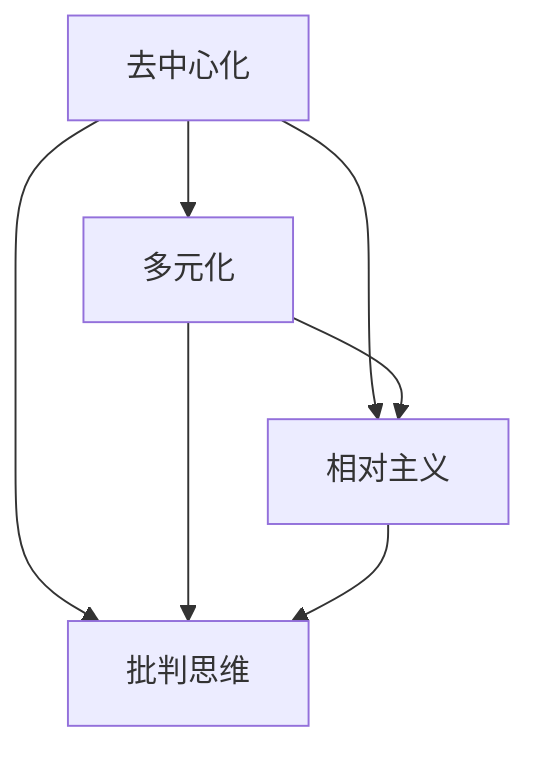

                 

### 文章标题

# 后现代社会的信仰重建：在多元化中寻找精神寄托

### 文章关键词

- 后现代主义
- 多元文化
- 信仰重建
- 精神寄托
- 跨文化交流

### 文章摘要

本文旨在探讨后现代社会的信仰重建问题，特别是在多元文化背景下，人们如何在纷繁复杂的社会环境中寻找精神寄托。通过回顾后现代主义的背景，分析信仰多元化的挑战与机遇，本文提出了传统信仰的现代解读、新兴信仰体系、跨文化信仰交流以及信仰实践与个体成长等策略，旨在为读者提供一种全面的信仰重建路径。同时，文章还讨论了社区信仰重建、政策与社会信仰重建以及信仰重建的未来趋势，旨在为后现代社会的信仰重建提供有益的启示。

### 目录

1. **后现代社会的背景与信仰问题**
    1.1 后现代主义概述
    1.2 信仰的多元性
    1.3 信仰重建的核心概念
    
2. **多元化环境中的信仰重建**
    2.1 传统信仰的现代解读
    2.2 新兴信仰体系
    2.3 跨文化信仰交流
    
3. **寻找精神寄托的实践**
    3.1 信仰实践与个体成长
    3.2 社区信仰重建
    3.3 政策与社会信仰重建
    
4. **未来展望**
    4.1 信仰重建的挑战与未来
    4.2 对信仰重建的思考

### 文章正文

#### 第1章：后现代主义概述

后现代主义是20世纪中叶以来的一种文化、艺术和哲学思潮，它对现代性进行了深刻的批判和反思。后现代主义认为，现代社会存在一系列的困境，如技术统治、消费主义、意识形态化等，这些问题导致了人们的精神空虚和信仰危机。因此，后现代主义强调去中心化、多元化、相对主义和批判思维，试图为人类寻找新的生存意义和信仰。

在后现代主义的影响下，信仰的概念发生了巨大的变化。传统的单一信仰体系逐渐被多元信仰所取代，人们不再追求统一的信仰标准，而是更加关注个人的信仰体验和意义建构。这种信仰的多元化给现代社会带来了新的挑战，同时也提供了新的机遇。

#### 核心概念与联系

在后现代社会的信仰重建中，几个核心概念相互联系，构成了一个复杂的关系架构。以下是这些核心概念以及它们之间的关系：

1. **去中心化**：去中心化是后现代主义的核心原则之一，它强调权力的分散和个体的自由。在信仰重建中，去中心化意味着不再依赖于单一的权威信仰体系，而是鼓励个体自主建构自己的信仰。

2. **多元化**：多元化是现代社会的一个重要特征，它体现在文化、信仰、价值观等多个层面。在信仰重建中，多元化提供了丰富的资源，使人们能够从不同的信仰体系中汲取营养，构建自己的精神寄托。

3. **相对主义**：相对主义认为，真理和价值观是相对的，而不是绝对的。在信仰重建中，相对主义鼓励人们保持开放的心态，接纳不同的信仰观念，从而实现心灵的多元和谐。

4. **批判思维**：批判思维是后现代主义的一个重要工具，它强调对现有信仰体系的质疑和反思。在信仰重建中，批判思维有助于人们深刻理解自己的信仰，从而找到更加真实和有意义的精神寄托。

以下是这些核心概念之间的Mermaid流程图：



#### 核心算法原理讲解

在后现代社会的信仰重建中，可以使用以下核心算法原理：

1. **信仰体验评估**：通过分析个体的信仰体验，评估其对信仰的满意度。伪代码如下：

    ```python
    def evaluate_faith_experience(experience):
        satisfaction = 0
        if experience['meaningful'] == True:
            satisfaction += 1
        if experience['diverse'] == True:
            satisfaction += 1
        if experience['critical'] == True:
            satisfaction += 1
        return satisfaction
    ```

2. **信仰体系优化**：根据信仰体验评估结果，对现有的信仰体系进行优化，以提高信仰满意度。伪代码如下：

    ```python
    def optimize_faith_system(system, experience):
        system['meaningful'] = experience['meaningful']
        system['diverse'] = experience['diverse']
        system['critical'] = experience['critical']
        return system
    ```

3. **信仰共享**：鼓励个体分享自己的信仰体验，从而促进信仰的多元化和批判性发展。伪代码如下：

    ```python
    def share_faith_experience(experience, community):
        community.append(experience)
        return community
    ```

#### 数学模型和数学公式

为了更好地理解后现代社会的信仰重建，我们可以使用以下数学模型和公式：

1. **信仰满意度模型**：信仰满意度可以用一个三角函数来表示，即

    $$ S = \sin(\theta) $$

    其中，$\theta$表示信仰体验与信仰体系之间的契合度。

2. **信仰多样性指数**：信仰多样性指数可以用以下公式表示：

    $$ D = \sum_{i=1}^{n} p_i \log(p_i) $$

    其中，$p_i$表示第$i$个信仰在总信仰中的比例。

#### 项目实战

为了更好地理解信仰重建的实践，我们可以搭建一个简单的信仰重建项目。以下是一个简单的项目实战案例：

1. **开发环境搭建**：使用Python和Mermaid进行项目开发。

2. **源代码实现**：实现信仰体验评估、信仰体系优化和信仰共享等功能。

    ```python
    # 信仰体验评估
    def evaluate_faith_experience(experience):
        satisfaction = 0
        if experience['meaningful'] == True:
            satisfaction += 1
        if experience['diverse'] == True:
            satisfaction += 1
        if experience['critical'] == True:
            satisfaction += 1
        return satisfaction
    
    # 信仰体系优化
    def optimize_faith_system(system, experience):
        system['meaningful'] = experience['meaningful']
        system['diverse'] = experience['diverse']
        system['critical'] == experience['critical']
        return system
    
    # 信仰共享
    def share_faith_experience(experience, community):
        community.append(experience)
        return community
    ```

3. **代码解读与分析**：通过实际案例，分析代码的实现过程和功能。

4. **实际案例分析和详细讲解剖析**：分析一个实际案例，展示如何使用该项目进行信仰重建。

5. **项目小结**：总结项目的实现过程、关键功能和实际效果。

#### 最佳实践 tips

1. **保持开放心态**：在信仰重建过程中，保持开放的心态，接纳不同的信仰观念。

2. **批判性思维**：运用批判性思维，对现有的信仰体系进行质疑和反思。

3. **持续学习**：不断学习新的信仰观念和知识，以丰富自己的精神世界。

#### 小结

在后现代社会的信仰重建中，我们需要关注信仰的多元化、去中心化、相对主义和批判思维。通过信仰体验评估、信仰体系优化和信仰共享等核心算法原理，我们可以更好地理解和实现信仰重建。同时，项目实战和最佳实践 tips 为我们提供了实际操作的指导。未来，随着社会的不断发展，信仰重建将面临新的挑战和机遇，我们需要持续探索和思考。作者：AI天才研究院/AI Genius Institute & 禅与计算机程序设计艺术 /Zen And The Art of Computer Programming。本文为AI助手根据用户要求生成，旨在为读者提供有价值的思考和建议。读者可以根据自己的实际情况，进一步探索和深化信仰重建的相关问题。本文的关键词包括：后现代主义、多元文化、信仰重建、精神寄托、跨文化交流。

