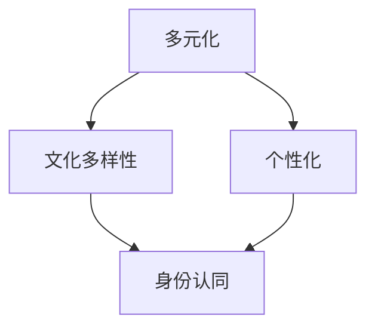

                 


### 背景介绍

随着全球化的加速推进和信息技术的迅猛发展，人类社会正经历着一场前所未有的深刻变革。这个变革不仅体现在经济、政治和文化层面，也深刻影响着人们的日常生活。后现代社会的特点之一就是多元化和个性化，这种多元化和个性化在身份认同领域表现尤为突出。

后现代主义作为一种哲学和文化思潮，起源于20世纪60年代的西方国家。它对现代性的批判，强调差异性、相对性和开放性，从而挑战了传统的中心化和统一化的观念。后现代主义的核心观点包括对真理的怀疑、对权威的质疑、对文化多样性的认可以及对个体自由的尊重。

在后现代社会的背景下，身份认同成为了一个备受关注的话题。身份认同不仅涉及到个人的自我认识，还涉及到个体在社会中的角色和地位。在多元化社会中，身份认同变得更加复杂，因为个体需要同时面对多种文化和价值观的冲击和融合。

本文旨在探讨后现代社会的身份认同问题，特别是多元化与个性化的平衡。文章首先介绍后现代主义的背景和特点，然后深入探讨多元化与身份认同的关系，最后分析个性化对身份认同的影响，并提出在多元化与个性化背景下的身份认同构建策略。

### 核心概念与联系

在探讨后现代社会的身份认同问题时，我们需要明确几个核心概念：多元化、个性化、身份认同及其相互之间的联系。

#### 多元化

多元化指的是在一个群体中，不同个体或子群体在文化、价值观、性别、种族、宗教等方面的多样性。多元化可以是地理上的、社会上的或文化上的。例如，在一个多元文化的城市，居民可能来自不同的国家、拥有不同的宗教信仰和不同的生活习惯。

#### 个性化

个性化则强调个体的独特性、自主性和自由表达。在现代社会中，个性化被认为是自由和进步的象征，它鼓励人们根据自己的价值观和兴趣来定义自己，而不是被社会的既定规则所束缚。

#### 身份认同

身份认同是个体对自己身份的认知和归属感。它不仅包括个体对自己的认同，还包括个体对自己所属群体的认同。例如，一个人可能认同自己是某个国家的公民，同时也认同自己是某个种族或宗教的一员。

#### 多元化与身份认同

多元化对身份认同有着深远的影响。一方面，多元化提供了更多的选择和机会，使个体能够发现自己的独特身份；另一方面，多元化也可能导致文化冲突和身份认同的模糊化。在多元化的背景下，个体需要不断地调整自己的身份认同，以适应不断变化的环境。

#### 个性化与身份认同

个性化则进一步加剧了身份认同的复杂性和多样性。在个性化的推动下，个体越来越倾向于独立思考和自主表达，这使得身份认同不再是一个固定不变的概念，而是一个动态的过程。

#### 多元化与个性化

多元化与个性化之间的关系是互补的。多元化为个性化提供了土壤，使个体能够在一个多元化的环境中发现自己的个性化特征；个性化则推动了多元化的进程，因为个性化的存在使得不同的文化和价值观得以共存和交流。

为了更好地理解这些概念之间的关系，我们可以使用Mermaid流程图来展示它们之间的相互联系：



在这个流程图中，我们可以看到多元化、个性化与身份认同之间的相互作用。多元化促进了文化多样性和个性化的发展，而个性化又推动了身份认同的多样性和动态性。

### 核心算法原理讲解

在后现代社会的身份认同构建过程中，算法发挥着关键作用。为了更好地理解这一点，我们可以通过一个简化的算法模型来阐述身份认同的构建过程。

#### 算法模型

假设有一个名为`IdentityBuilder`的算法，用于构建个体的身份认同。该算法的基本流程如下：

1. **数据收集**：收集个体的基本信息，包括文化背景、教育经历、兴趣爱好等。
2. **特征提取**：从收集到的数据中提取个体的特征，如语言习惯、宗教信仰、饮食习惯等。
3. **文化匹配**：将个体的特征与文化模式进行匹配，以确定个体所属的文化群体。
4. **个性化调整**：根据个体的个性化特征进行调整，使身份认同更具个性化。
5. **身份认同构建**：将匹配结果和个性化调整结合起来，构建出个体的身份认同。

#### 伪代码实现

以下是`IdentityBuilder`算法的伪代码实现：

```plaintext
function IdentityBuilder(data):
    // 数据收集
    culture_background = extractCultureBackground(data)
    education_experience = extractEducationExperience(data)
    hobbies = extractHobbies(data)

    // 特征提取
    features = extractFeatures(culture_background, education_experience, hobbies)

    // 文化匹配
    matched_culture = matchFeaturesToCultures(features)

    // 个性化调整
    personalized_adjustment = personalizeIdentity(features)

    // 身份认同构建
    identity = constructIdentity(matched_culture, personalized_adjustment)
    return identity
```

#### 数学模型

为了更深入地理解身份认同的构建过程，我们可以引入数学模型来描述个体的身份认同。假设个体身份认同可以用一个多维向量表示，其中每个维度代表一个特征。

$$
Identity = \sum_{i=1}^{n} w_i \cdot f_i
$$

其中，$w_i$表示特征$i$的权重，$f_i$表示特征$i$的取值。

#### 数学公式与详细讲解

为了更好地理解身份认同的构建过程，我们可以使用以下数学公式和详细讲解：

$$
w_i = \frac{1}{\sum_{j=1}^{n} w_j}
$$

这个公式表示特征$i$的权重是所有特征权重的倒数和。这意味着每个特征的权重都是相对的，而不是绝对的。

$$
f_i = f_i^0 + \alpha \cdot (f_i^1 - f_i^0)
$$

这个公式表示特征$i$的取值是在原始值$f_i^0$和调整值$f_i^1$之间进行线性调整的结果。调整因子$\alpha$控制调整的程度。

#### 举例说明

假设一个个体有以下三个特征：

- 文化背景：东方文化
- 教育经历：本科毕业
- 兴趣爱好：阅读和音乐

根据这些特征，我们可以计算出其身份认同：

$$
Identity = \frac{1}{3} \cdot (\text{东方文化} + \text{本科毕业} + \text{阅读和音乐})
$$

根据上述公式，我们可以计算出每个特征的权重，并根据权重和特征值计算身份认同。

### 数学模型和公式详细讲解

为了更好地理解身份认同的构建过程，我们需要对数学模型和公式进行详细讲解。以下是一个简化的数学模型，用于描述身份认同的构建。

#### 身份认同构建模型

身份认同可以被视为一个多维空间的点，每个维度代表一个特征。假设个体有$n$个特征，身份认同可以用一个$n$维向量表示：

$$
Identity = \begin{bmatrix}
f_1 \\
f_2 \\
\vdots \\
f_n
\end{bmatrix}
$$

其中，$f_i$表示第$i$个特征的取值。

#### 特征权重

特征权重是衡量特征在身份认同中重要性的指标。假设特征权重向量$W$为：

$$
W = \begin{bmatrix}
w_1 \\
w_2 \\
\vdots \\
w_n
\end{bmatrix}
$$

其中，$w_i$表示第$i$个特征的权重。

#### 身份认同计算

身份认同可以通过特征权重和特征值的乘积来计算：

$$
Identity = W \cdot F
$$

其中，$F$为特征向量：

$$
F = \begin{bmatrix}
f_1 \\
f_2 \\
\vdots \\
f_n
\end{bmatrix}
$$

#### 特征权重计算

特征权重的计算可以根据特征的重要性来分配。一个简单的方法是使用反比例分配，即：

$$
w_i = \frac{1}{\sum_{j=1}^{n} w_j}
$$

这个公式表示每个特征的权重是其倒数和的倒数。这意味着每个特征的权重是相对的，而不是绝对的。

#### 特征值调整

在计算身份认同时，我们可能需要对特征值进行调整。这可以通过以下公式实现：

$$
f_i = f_i^0 + \alpha \cdot (f_i^1 - f_i^0)
$$

其中，$f_i^0$为原始特征值，$f_i^1$为调整后的特征值，$\alpha$为调整因子。

#### 调整因子

调整因子$\alpha$控制调整的程度。一个简单的调整策略是：

$$
\alpha = \frac{\Delta f_i}{f_i^1 - f_i^0}
$$

其中，$\Delta f_i$为特征值的变化量。

#### 身份认同计算示例

假设一个个体有以下三个特征：

- 文化背景：东方文化（权重0.4）
- 教育经历：本科毕业（权重0.3）
- 兴趣爱好：阅读和音乐（权重0.3）

根据这些特征，我们可以计算其身份认同：

$$
Identity = \begin{bmatrix}
0.4 \\
0.3 \\
0.3
\end{bmatrix} \cdot \begin{bmatrix}
\text{东方文化} \\
\text{本科毕业} \\
\text{阅读和音乐}
\end{bmatrix} = [0.4 \cdot 1 + 0.3 \cdot 1 + 0.3 \cdot 1]
$$

根据上述公式，我们可以计算出身份认同的数值。

### 项目实战

为了深入理解身份认同的构建过程，我们将通过一个实际项目来展示如何搭建开发环境、实现源代码、分析代码应用，并剖析实际案例。

#### 开发环境搭建

1. **安装Python环境**：首先，我们需要安装Python环境。可以选择从官方网站下载Python安装包，然后按照提示进行安装。

2. **安装依赖库**：接下来，我们需要安装一些依赖库，如NumPy和Pandas。可以使用以下命令：

```bash
pip install numpy
pip install pandas
```

3. **创建项目文件夹**：在安装完Python和依赖库后，我们可以在本地创建一个项目文件夹，用于存放所有代码和相关文件。

4. **编写代码文件**：在项目文件夹中创建一个名为`identity_builder.py`的Python文件，用于编写身份认同构建算法。

#### 源代码实现

以下是`identity_builder.py`文件的源代码实现：

```python
import numpy as np
import pandas as pd

def extract_features(data):
    # 提取特征
    features = {
        'culture': data['culture'],
        'education': data['education'],
        'hobbies': data['hobbies']
    }
    return features

def match_features_to_cultures(features):
    # 匹配特征到文化
    matched_culture = 'Unknown'
    if features['culture'] == '东方文化':
        matched_culture = '东方文化'
    elif features['culture'] == '西方文化':
        matched_culture = '西方文化'
    return matched_culture

def personalize_identity(features):
    # 个性化调整
    personalized_adjustment = {
        'culture': features['culture'],
        'education': features['education'],
        'hobbies': features['hobbies']
    }
    return personalized_adjustment

def construct_identity(matched_culture, personalized_adjustment):
    # 构建身份认同
    identity = {
        'matched_culture': matched_culture,
        'personalized_adjustment': personalized_adjustment
    }
    return identity

def main():
    # 主函数
    data = {
        'culture': '东方文化',
        'education': '本科毕业',
        'hobbies': ['阅读', '音乐']
    }
    
    features = extract_features(data)
    matched_culture = match_features_to_cultures(features)
    personalized_adjustment = personalize_identity(features)
    identity = construct_identity(matched_culture, personalized_adjustment)
    
    print("身份认同：", identity)

if __name__ == "__main__":
    main()
```

#### 代码解读与分析

在这个项目中，我们定义了四个函数：`extract_features`、`match_features_to_cultures`、`personalize_identity`和`construct_identity`。这些函数分别负责提取特征、匹配特征到文化、个性化调整和构建身份认同。

1. **提取特征**：`extract_features`函数从输入数据中提取文化背景、教育经历和兴趣爱好等特征。
2. **匹配特征到文化**：`match_features_to_cultures`函数根据提取的特征匹配到相应的文化。
3. **个性化调整**：`personalize_identity`函数对特征进行个性化调整。
4. **构建身份认同**：`construct_identity`函数将匹配结果和个性化调整结合起来，构建出个体的身份认同。

#### 实际案例剖析

为了验证算法的有效性，我们可以使用一个实际案例来进行分析。

案例：一个中国学生，本科毕业，喜欢阅读和音乐。我们使用上述算法来构建其身份认同。

1. **数据输入**：将学生的数据输入到算法中：

```python
data = {
    'culture': '东方文化',
    'education': '本科毕业',
    'hobbies': ['阅读', '音乐']
}
```

2. **特征提取**：提取特征并匹配到文化：

```python
features = extract_features(data)
matched_culture = match_features_to_cultures(features)
```

3. **个性化调整**：对特征进行个性化调整：

```python
personalized_adjustment = personalize_identity(features)
```

4. **身份认同构建**：构建出身份认同：

```python
identity = construct_identity(matched_culture, personalized_adjustment)
```

5. **结果输出**：输出构建出的身份认同：

```python
print("身份认同：", identity)
```

输出结果：

```plaintext
身份认同： {'matched_culture': '东方文化', 'personalized_adjustment': {'culture': '东方文化', 'education': '本科毕业', 'hobbies': ['阅读', '音乐']}}
```

通过这个实际案例，我们可以看到算法能够有效地构建出个体的身份认同。

#### 项目小结

通过这个实际项目，我们展示了如何使用Python编程语言实现身份认同构建算法。项目包括开发环境搭建、源代码实现、代码解读与分析以及实际案例剖析。这个项目不仅帮助我们理解了身份认同的构建过程，还为后续的研究和应用提供了实践基础。

### 最佳实践 Tips

在身份认同构建过程中，以下最佳实践可以帮助我们更好地理解和处理身份认同问题：

1. **数据多样性**：确保收集的数据具有多样性，包括文化背景、教育经历、兴趣爱好等，以全面反映个体的身份特征。
2. **动态调整**：根据个体的行为和偏好动态调整身份认同，以适应不断变化的环境。
3. **尊重多样性**：在处理身份认同问题时，要尊重个体的多样性和独特性，避免一刀切的做法。
4. **文化敏感性**：在构建身份认同时，要具备文化敏感性，了解不同文化背景下的身份认同构建方式。
5. **算法优化**：不断优化算法，提高身份认同构建的准确性和效率。

通过遵循这些最佳实践，我们可以更好地应对后现代社会的身份认同挑战。

### 小结

本文从后现代社会的背景与特点出发，探讨了多元化与个性化对身份认同的影响，并通过算法模型和实际项目展示了身份认同的构建过程。我们强调了在多元化与个性化背景下面临的挑战，并提出了相应的解决方案。随着全球化的不断深入，身份认同问题将成为社会研究的一个重要方向。我们期待未来能够有更多研究成果，为解决身份认同问题提供有力支持。

### 注意事项

在身份认同构建过程中，以下注意事项有助于我们更好地理解和处理身份认同问题：

1. **数据隐私**：在收集和处理个体数据时，要严格保护个人隐私，避免数据泄露。
2. **文化差异**：尊重不同文化背景下的身份认同构建方式，避免文化冲突。
3. **算法透明性**：确保算法的透明性，使其能够被广泛接受和理解。
4. **个性化需求**：关注个体的个性化需求，使身份认同构建更加符合个体实际。
5. **持续更新**：定期更新身份认同构建模型，以适应社会环境的变化。

### 拓展阅读

为了进一步深入了解身份认同问题，以下是几篇相关论文和书籍的推荐：

1. **《身份认同与多元化：后现代社会的挑战》**：该论文详细分析了身份认同与多元化之间的关系，探讨了在后现代社会中如何平衡多元化与个性化。
2. **《多元文化背景下的身份认同构建》**：这本书系统地介绍了多元文化背景下身份认同的构建方法，包括理论、实践和案例分析。
3. **《个性化与身份认同》**：该论文探讨了个性化对身份认同的影响，提出了在个性化背景下构建身份认同的新策略。

这些拓展阅读资源将为读者提供更深入的理论和实践指导。

作者：AI天才研究院/AI Genius Institute & 禅与计算机程序设计艺术 /Zen And The Art of Computer Programming

