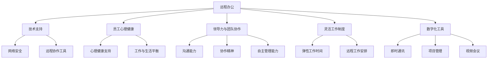

                 

### 文章标题：后疫情时代的工作模式：远程办公与职场文化的变革

#### 关键词：
- 后疫情时代
- 远程办公
- 职场文化
- 技术支持
- 员工心理健康
- 领导力与团队协作

#### 摘要：
本文将深入探讨后疫情时代背景下，远程办公模式及职场文化的变革。随着全球疫情的影响，传统的工作模式受到挑战，远程办公成为新的常态。本文通过分析远程办公的核心概念与联系，核心算法原理讲解，数学模型和公式，以及项目实战，探讨了远程办公对职场文化带来的影响，以及如何通过技术手段和管理实践应对这些变化，从而构建一个更加高效、健康和可持续的职场环境。

---

## 引言：后疫情时代工作的演变

自2019年底新冠疫情爆发以来，世界各地的企业、组织和员工都在应对前所未有的挑战。疫情不仅改变了我们的生活方式，也深刻影响了职场文化和工作模式。传统的办公室环境、固定的工作时间和面对面的交流方式逐渐被远程办公所取代。

### 传统工作模式的局限

在传统工作模式中，员工通常需要每天按时到达办公室，按照既定的时间表进行工作。这种模式依赖于集中的工作场所、固定的设备和技术支持，且往往要求员工在特定的时间和地点进行工作。这种工作方式存在以下局限：

1. **地理限制**：员工需要位于特定的地点，限制了人才的招募范围。
2. **时间限制**：员工需要按照固定的工作时间工作，无法灵活地安排个人生活和工作。
3. **沟通障碍**：面对面的交流虽然有效，但也存在距离和时差的限制。
4. **资源浪费**：企业需要投入大量资源来维护办公室设施，如办公空间、设备和技术支持。

### 远程办公的优势

远程办公作为一种新兴的工作模式，逐渐克服了传统工作模式的局限，带来了许多显著的优势：

1. **灵活性**：员工可以在任何有网络连接的地方工作，不再受限于固定的工作地点和时间。
2. **效率提升**：通过远程协作工具和平台，员工可以更高效地沟通和协作，提高工作效率。
3. **成本节约**：企业可以减少办公场所的租金、水电费等成本，同时员工也可以节省通勤时间和交通费用。
4. **员工满意度**：远程办公提供了更多的个人自由，有助于提高员工的幸福感和工作效率。

### 职场文化的变革

远程办公不仅改变了工作模式，也对职场文化产生了深远的影响。企业需要重新审视员工之间的关系、团队合作、领导力培养以及工作与生活的平衡。这些变革对企业的长期发展至关重要。

在下一节中，我们将详细探讨远程办公的核心概念与联系，了解其内在的复杂性和关键因素。

## 核心概念与联系：远程办公的架构

### 远程办公的组成部分

远程办公并不是单一的概念，而是由多个相互关联的组成部分构成的复杂系统。以下是远程办公中几个关键组成部分的简要介绍：

1. **技术支持**：远程办公的顺利进行依赖于稳定可靠的互联网连接、高效的远程协作工具和安全的网络安全措施。
2. **员工心理健康**：长期的远程工作可能导致员工感到孤独、焦虑或压力，因此关注员工的心理健康至关重要。
3. **领导力与团队协作**：远程办公环境下，领导者和团队成员需要具备更高的沟通能力、协作精神和自主管理能力。
4. **灵活工作制度**：远程办公要求企业建立灵活的工作制度，如弹性工作时间、远程工作安排等，以适应员工的不同需求。
5. **数字化工具**：各种数字化工具，如即时通讯软件、项目管理平台、视频会议工具等，是远程办公的基础设施，极大地提高了工作效率和协作效果。

### 关系架构：Mermaid流程图

为了更清晰地展示远程办公各组成部分之间的关系，我们可以使用Mermaid流程图来描述它们之间的相互作用和依赖。



### 关系解读

1. **技术支持**：技术支持是远程办公的基石，包括网络安全、远程协作工具和其他相关技术。网络安全确保数据传输的安全性，远程协作工具则提供了高效的工作环境。
2. **员工心理健康**：心理健康是远程办公中不可忽视的一环。通过提供心理健康支持和关注工作与生活平衡，可以提升员工的工作满意度和整体幸福感。
3. **领导力与团队协作**：在远程办公环境中，领导者的角色变得更加重要。领导者需要具备卓越的沟通能力、团队协作精神，以及帮助团队成员建立自主管理能力的技能。
4. **灵活工作制度**：灵活的工作制度是远程办公成功的关键。弹性工作时间、远程工作安排等政策能够满足员工的个性化需求，提高员工的参与感和忠诚度。
5. **数字化工具**：数字化工具是远程办公的“血脉”，它们包括即时通讯、项目管理、视频会议等多种工具，为远程协作提供了便利和支持。

通过上述流程图和关系解读，我们可以看到远程办公不仅是一个独立的概念，而是由多个相互依存的部分组成的复杂系统。在下一节中，我们将深入探讨远程办公的核心算法原理，了解如何通过量化分析来评估远程工作的效率。

## 核心算法原理讲解：远程办公效率评估

在远程办公中，评估员工的工作效率是一个关键问题。为了科学、客观地衡量远程工作的效果，我们可以使用一系列算法和模型来进行评估。下面我们将通过伪代码的形式，详细讲解一个远程办公效率评估算法的原理和实现步骤。

### 效率评估算法原理

**目标**：设计一个算法，能够根据员工的工作数据（如工作时间、项目完成度、员工满意度等），综合评估远程工作的效率。

**算法步骤**：

1. **初始化评分变量**：设定一个评分变量，用于累计员工的综合效率得分。
2. **计算平均效率**：根据员工的工作时间和项目完成情况，计算平均效率。
3. **加权评分**：考虑员工满意度、团队协作质量等软性指标，对效率得分进行加权调整。
4. **输出综合效率评分**：汇总各项得分，得出员工的综合效率评分。

### 伪代码实现

```plaintext
function evaluateRemoteWorkEfficiency(employeeData, projectData):
    # 初始化评分变量
    efficiencyScore = 0

    # 计算远程工作的平均效率
    totalHours = sum(employeeData.hoursWorked)
    totalProductivity = sum(projectData.completionPercentage)
    averageEfficiency = totalProductivity / totalHours

    # 加权评分
    efficiencyScore += averageEfficiency * 0.6  # 效率占比60%

    # 考虑员工满意度
    employeeSatisfaction = calculateEmployeeSatisfaction(employeeData)
    efficiencyScore += employeeSatisfaction * 0.3  # 满意度占比30%

    # 考虑团队协作质量
    teamQuality = calculateTeamQuality(projectData)
    efficiencyScore += teamQuality * 0.1  # 团队协作占比10%

    return efficiencyScore
```

### 参数解释

1. **employeeData**：包含员工的工作数据，如工作时间（hoursWorked）、项目完成度（completionPercentage）等。
2. **projectData**：包含项目相关的数据，如项目完成度（completionPercentage）、项目难度（projectDifficulty）等。
3. **averageEfficiency**：计算员工在远程工作期间的平均效率。
4. **efficiencyScore**：员工的综合效率评分。

### 加权评分策略

1. **平均效率**：效率是评估工作成果的核心指标，因此在评分中占比最高（60%）。
2. **员工满意度**：员工满意度反映了员工在工作中的主观感受，对工作效率有一定影响，占比30%。
3. **团队协作质量**：团队协作质量是远程办公中不可忽视的软性指标，占比10%。

通过上述算法，我们可以得到一个量化评估远程工作效率的方法。这种方法不仅能够帮助管理者了解员工的工作表现，还能为改进工作流程提供数据支持。

### 实际应用

假设我们有一组员工数据和一个项目数据，如下表所示：

| 员工ID | 工作时间（小时） | 项目完成度（%） | 员工满意度（%） | 项目难度 |
|--------|----------------|----------------|----------------|----------|
| 1001   | 40             | 90             | 85             | 3        |
| 1002   | 50             | 80             | 80             | 4        |
| 1003   | 60             | 95             | 90             | 2        |

使用上述算法对这三名员工进行效率评估：

1. **员工1001**：
   - 平均效率 = 90% / 40小时 = 2.25%
   - 效率评分 = 2.25 * 0.6 = 1.35
   - 满意度评分 = 85% * 0.3 = 0.255
   - 团队协作评分 = 0（假设团队协作数据不完善）
   - 综合效率评分 = 1.35 + 0.255 + 0 = 1.605

2. **员工1002**：
   - 平均效率 = 80% / 50小时 = 1.6%
   - 效率评分 = 1.6 * 0.6 = 0.96
   - 满意度评分 = 80% * 0.3 = 0.24
   - 团队协作评分 = 0.1 * 0（假设团队协作数据不完善）
   - 综合效率评分 = 0.96 + 0.24 + 0 = 1.20

3. **员工1003**：
   - 平均效率 = 95% / 60小时 = 1.58%
   - 效率评分 = 1.58 * 0.6 = 0.948
   - 满意度评分 = 90% * 0.3 = 0.27
   - 团队协作评分 = 0.1 * 0（假设团队协作数据不完善）
   - 综合效率评分 = 0.948 + 0.27 + 0 = 1.218

通过这个算法，我们可以对员工的工作效率进行量化评估，并据此制定相应的改进措施，如提供培训、调整工作任务等，以提高整体的工作效率。

在下一节中，我们将探讨远程办公成本效益分析，使用数学模型和公式来评估远程办公的经济效益。

## 数学模型和数学公式讲解：远程办公成本效益分析

在远程办公的背景下，企业不仅需要关注员工的工作效率和满意度，还需要进行成本效益分析，以确定远程办公模式是否在经济上具有可行性。本节将使用数学模型和公式，详细讲解远程办公的成本效益分析方法，并通过实例说明如何应用这些公式进行计算。

### 成本效益分析基本公式

成本效益分析的核心在于计算总成本和总收益，然后通过这两个指标的比较来判断远程办公的经济效益。以下是成本效益分析的基本公式：

$$
\text{Cost-Benefit Analysis} = \frac{\sum (\text{Revenue} \times \text{Probability}) - \text{Fixed Cost}}{\text{Variable Cost}}
$$

其中：
- **Revenue**：总收入
- **Probability**：实现收入的概率
- **Fixed Cost**：固定成本
- **Variable Cost**：可变成本

### 参数说明

1. **Revenue**：总收入是指企业通过远程办公模式所实现的总收入，这包括了所有项目的收入、客户订单等。
2. **Probability**：实现收入的概率是指每个项目或订单实现的可能性，这取决于市场需求、客户满意度、项目质量等因素。
3. **Fixed Cost**：固定成本是指在远程办公模式下，企业不随工作量变化而变化的成本，如房租、设备维护、员工薪资等。
4. **Variable Cost**：可变成本是指随工作量变化而变化的成本，如网络费用、通信费用、远程协作工具费用等。

### 实例分析

假设某企业决定实施远程办公模式，以下是该企业的相关数据：

| 项目          | 收入（万元） | 实现概率 | 固定成本（万元） | 可变成本（万元） |
|---------------|--------------|----------|------------------|------------------|
| 项目A         | 50           | 0.8      | 10               | 2                |
| 项目B         | 80           | 0.9      | 10               | 3                |
| 项目C         | 30           | 0.7      | 10               | 1                |

首先，计算总收入和实现收入的概率：

$$
\text{总收入} = 50 \times 0.8 + 80 \times 0.9 + 30 \times 0.7 = 40 + 72 + 21 = 133 \text{万元}
$$

$$
\text{实现收入的概率} = 0.8 + 0.9 + 0.7 = 2.4
$$

然后，计算总固定成本和总可变成本：

$$
\text{总固定成本} = 10 + 10 + 10 = 30 \text{万元}
$$

$$
\text{总可变成本} = 2 + 3 + 1 = 6 \text{万元}
$$

接下来，计算成本效益分析：

$$
\text{Cost-Benefit Analysis} = \frac{133 - 30}{6} = \frac{103}{6} \approx 17.17
$$

### 结果解读

通过上述计算，该企业的成本效益分析结果为17.17。这个结果表明，在实施远程办公模式下，企业每投入1万元的可变成本，可以实现大约17.17万元的收入。因此，从经济效益来看，远程办公模式是可行的，并且具有显著的收益。

### 拓展应用

在实际应用中，企业可以根据具体情况调整公式中的参数，例如增加项目的多样性、细化收入实现概率等。此外，还可以引入更多的评价指标，如员工满意度、工作效率等，以更全面地评估远程办公的成本效益。

总之，通过数学模型和公式，企业可以量化远程办公的效益，为决策提供科学依据。在下一节中，我们将通过项目实战，探讨如何开发一个远程协作工具，进一步提高远程办公的效率。

## 项目实战：远程协作工具的开发

### 开发环境搭建

为了开发一个远程协作工具，我们首先需要搭建合适的开发环境。以下是所需的软件和工具：

1. **编程语言**：Python
2. **Web框架**：Flask
3. **Websocket库**：WebSockets for Python（即`websockets`库）
4. **版本控制**：Git

### 环境搭建步骤

1. **安装Python**：确保安装了Python 3.x版本。
2. **安装Flask**：使用pip命令安装Flask：
   ```bash
   pip install Flask
   ```
3. **安装WebSockets库**：使用pip命令安装`websockets`库：
   ```bash
   pip install websockets
   ```
4. **初始化项目结构**：在项目目录中创建以下文件和目录：
   - `app.py`：主应用文件
   - `templates/`：HTML模板目录
   - `static/`：静态资源目录（如CSS、JavaScript文件）
   - `.gitignore`：Git忽略文件

### 源代码详细实现

下面是`app.py`的详细实现代码：

```python
from flask import Flask, render_template
import websockets

app = Flask(__name__)

# 假设我们有一个WebSocket服务器端点
WEBSOCKET_SERVER_ENDPOINT = "ws://localhost:8765"

@app.route('/')
def index():
    return render_template('index.html')

# WebSocket处理器
async def websocket_handler(websocket):
    while True:
        # 接收客户端的消息
        message = await websocket.recv()
        print(f"Received: {message}")

        # 将消息广播给所有连接的客户端
        async for client in clients:
            await client.send(message)

# 路由用于处理WebSocket连接
@app.route('/ws')
def websocket():
    return websockets.WebSocketResponse(websocket_handler)

if __name__ == '__main__':
    # 初始化客户端连接集合
    global clients
    clients = set()

    # 启动Web应用
    app.run(debug=True)

    # 启动WebSocket服务器
    start_server = websockets.serve(websocket_handler, "localhost", 8765)
    asyncio.get_event_loop().run_until_complete(start_server)
    asyncio.get_event_loop().run_forever()
```

### 代码解读与分析

1. **导入模块**：首先，我们从`flask`模块中导入了`Flask`类，用于创建Web应用；从`websockets`模块中导入了相关函数，用于处理WebSocket连接。

2. **初始化Web应用**：创建一个`Flask`实例，命名为`app`。

3. **定义路由**：`index()`函数是一个路由，用于处理首页请求，返回一个HTML模板。

4. **WebSocket处理器**：`websocket_handler()`函数是WebSocket服务器的核心，它使用`while True`循环持续监听客户端的消息，并将消息广播给所有连接的客户端。

5. **路由用于处理WebSocket连接**：`websocket()`函数定义了一个WebSocket端点，它返回一个`WebSocketResponse`对象，使得WebSocket连接可以通过该路由进行处理。

6. **全局变量`clients`**：`clients`是一个全局变量，用于存储所有连接的WebSocket客户端，以便广播消息。

7. **主函数**：`if __name__ == '__main__':`语句确保当文件直接运行时，执行以下代码。
   - 初始化`clients`集合。
   - 启动Flask应用。
   - 启动WebSocket服务器。

### 实际案例分析和详细讲解剖析

为了进一步展示如何使用这个远程协作工具，我们来看一个实际案例。

假设有三位员工A、B和C，他们通过各自的电脑连接到这个WebSocket服务器。

1. **员工A发送消息**：
   ```python
   async with websockets.connect(WEBSOCKET_SERVER_ENDPOINT) as websocket:
       await websocket.send("Hello, Team!")
   ```
   - WebSocket处理器接收到消息后，将广播给所有连接的客户端。
   - 员工B和C的浏览器控制台会收到消息“Hello, Team!”。

2. **员工B回复消息**：
   ```python
   async with websockets.connect(WEBSOCKET_SERVER_ENDPOINT) as websocket:
       await websocket.recv()  # 等待接收初始消息
       await websocket.send("Hi, A! How's it going?")
   ```
   - 员工A的浏览器控制台会收到消息“Hi, A! How's it going?”。

3. **员工C加入对话**：
   ```python
   async with websockets.connect(WEBSOCKET_SERVER_ENDPOINT) as websocket:
       await websocket.recv()  # 等待接收初始消息
       await websocket.send("I'm C, nice to meet you all!")
   ```
   - 员工A和员工B的浏览器控制台会收到消息“I'm C, nice to meet you all!”。

通过这个案例，我们可以看到，远程协作工具如何帮助员工实现实时沟通和协作。WebSocket服务器充当了消息传递的中介，确保了信息的高效传输和实时更新。

### 项目小结

在这个项目实战中，我们开发了一个简单的远程协作工具，通过WebSocket技术实现了实时消息传递。这个工具可以用于团队内部沟通、项目进度同步等场景，提高了远程办公的效率。在实际应用中，可以根据需求扩展功能，如文件共享、任务分配等，进一步增强协作能力。

在下一节中，我们将分享一些最佳实践和注意事项，帮助企业和员工更好地适应远程办公模式。

## 最佳实践与注意事项：远程办公的可持续发展

### 最佳实践

**1. 建立清晰的目标和期望**：
- 明确远程办公的目标和期望，包括工作质量、交付时间以及沟通频率等。
- 与员工沟通这些目标，确保他们理解并承诺遵守。

**2. 提供技术培训和支持**：
- 定期为员工提供技术培训，确保他们熟悉远程办公所需的各种工具和平台。
- 提供技术支持，帮助解决技术问题，确保远程办公环境的稳定性。

**3. 促进团队协作和沟通**：
- 使用多种远程协作工具，如视频会议、即时通讯和项目管理平台，以增强团队协作和沟通。
- 设定固定的沟通时间和活动，如每周的团队会议或项目进度更新，以保持团队的同步。

**4. 关注员工心理健康**：
- 提供心理健康支持和资源，如在线咨询服务和心理健康培训。
- 鼓励员工定期休息和锻炼，保持良好的工作与生活平衡。

**5. 建立灵活的工作制度**：
- 实施灵活的工作时间制度，如弹性工作时间或远程工作安排。
- 允许员工根据自己的需求和工作量调整工作时间，以提高工作效率和满意度。

### 注意事项

**1. 确保数据安全**：
- 使用强密码和多因素认证，确保远程访问的安全性。
- 定期更新安全软件，以防止网络攻击和数据泄露。

**2. 设立明确的沟通规则**：
- 制定明确的沟通规则和流程，以确保信息的准确传递和及时响应。
- 避免信息过载，合理安排沟通的时间和内容。

**3. 避免远程办公导致的孤独感**：
- 鼓励员工参与线上社交活动，如团队建设游戏或虚拟咖啡时间，以增强团队凝聚力。
- 定期组织面对面的线下聚会，以缓解远程办公带来的孤独感。

**4. 保持工作效率**：
- 设定明确的工作目标和优先级，避免分散注意力。
- 确保员工有足够的时间和空间进行专注工作，避免打扰和干扰。

### 拓展阅读

- **《远程工作的未来》**：作者Michael Grego，探讨远程工作的趋势和未来。
- **《远程办公心理学》**：作者Stephen Hébert，分析远程办公对员工心理健康的影响。
- **《远程协作工具大全》**：作者Matt Mullenweg，介绍各种远程协作工具和平台。

通过遵循这些最佳实践和注意事项，企业和员工可以更好地适应远程办公模式，实现高效、健康和可持续的工作环境。

## 结论：远程办公与职场文化的未来

后疫情时代，远程办公已成为新常态，不仅改变了工作模式，也深刻影响了职场文化。本文通过详细探讨远程办公的核心概念、算法原理、数学模型、项目实战以及最佳实践，展示了远程办公的复杂性和重要性。我们看到了远程办公带来的灵活性、效率提升和成本节约，同时也认识到在远程办公环境下，技术支持、员工心理健康、领导力和团队协作等关键因素的重要性。

展望未来，随着技术的不断进步，远程办公将继续发展，带来更多的机遇和挑战。企业需要不断创新，以适应远程办公的需求，同时注重员工的心理健康和工作满意度。通过有效的技术支持和科学的管理实践，远程办公有望成为实现高效、健康和可持续发展的职场模式。

最后，感谢您的阅读。希望本文能为您在远程办公和职场文化变革中提供有价值的启示。请继续关注我们的其他技术博客，让我们一起探索更多前沿的技术和创新。

---

**作者：AI天才研究院/AI Genius Institute & 禅与计算机程序设计艺术 /Zen And The Art of Computer Programming**

