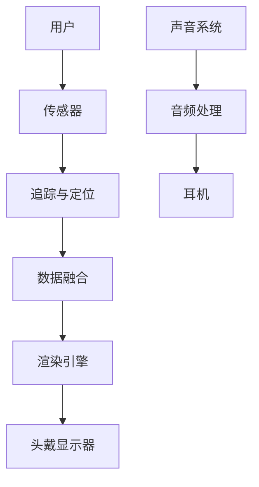
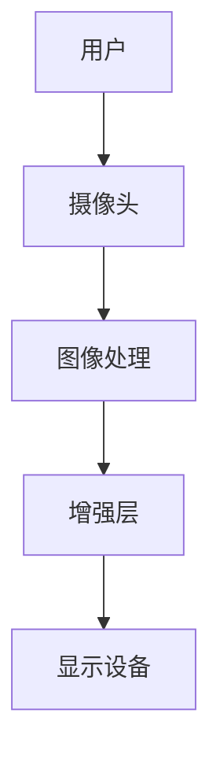

                 

### 《后真实世界导览：虚拟与现实交融的体验》

#### 关键词：后真实世界，虚拟现实，增强现实，交融体验，技术基础，应用案例，挑战与趋势

#### 摘要：

随着技术的迅猛发展，虚拟现实（VR）和增强现实（AR）已经成为现代科技领域的热点。本书《后真实世界导览：虚拟与现实交融的体验》旨在带领读者深入探索这个新兴领域，了解其核心概念、技术原理、应用场景以及面临的挑战和未来趋势。通过系统的分析和实际案例的讲解，本书旨在为读者提供一个全面而深入的导览，帮助理解虚拟与现实交融的世界。

---

### 引言

#### 1.1 “后真实世界”的概念

“后真实世界”是一个描述虚拟现实（VR）和增强现实（AR）技术影响下的新世界观的术语。在这个世界里，虚拟环境与现实世界交织在一起，用户可以在虚拟环境中体验沉浸式的交互，同时保持对现实世界的感知。这种交融不仅改变了娱乐和游戏的方式，还深刻影响了教育、医疗、设计等多个行业。

#### 1.2 背景与现状

虚拟现实和增强现实技术经历了多年的发展，从最初的实验性项目逐渐走向商业化应用。当前，VR和AR技术已经渗透到生活的方方面面，从游戏娱乐到工业设计，再到教育培训，展现出了巨大的潜力和广泛的应用前景。

#### 1.3 书籍目的与结构

本书的目的在于为读者提供一个全面的导览，深入探讨后真实世界的概念、技术基础、应用案例以及面临的挑战和未来趋势。全书分为七个主要章节，每个章节都围绕不同的主题进行详细讲解，旨在帮助读者构建对VR和AR技术的全面理解。

---

### 第2章 虚拟现实技术基础

#### 2.1 VR系统架构

虚拟现实系统由多个关键组件组成，包括传感器、渲染技术、用户交互技术等。以下是一个简化的VR系统架构Mermaid图：

#### 2.2 传感器技术

传感器技术在VR系统中扮演着关键角色，负责捕捉用户的动作和位置。以下是传感器技术的一些核心概念：

- **追踪与定位**：通过传感器（如运动传感器、摄像头等）实时捕捉用户的位置和动作。
- **数据融合**：将来自多个传感器的数据整合在一起，以提高定位和动作追踪的准确性。
- **手势识别**：通过传感器捕捉用户手势，实现与虚拟环境的自然交互。

#### 2.3 渲染技术

渲染技术是VR系统的核心之一，负责生成用户在虚拟环境中看到的图像。以下是渲染技术的一些核心概念：

- **3D建模与渲染**：创建虚拟环境的3D模型，并通过渲染引擎生成逼真的图像。
- **光影与材质**：模拟光线在虚拟环境中的传播，为物体赋予真实的质感。
- **实时渲染**：在用户交互的同时实时生成图像，提供流畅的体验。

#### 2.4 用户交互技术

用户交互技术是VR系统的另一重要组成部分，决定了用户在虚拟环境中的体验。以下是用户交互技术的一些核心概念：

- **手势识别**：通过传感器捕捉用户手势，实现与虚拟环境的自然交互。
- **语音识别与控制**：通过语音输入实现与虚拟环境的交互，提高用户体验。
- **虚拟现实控制器**：提供物理设备，让用户在虚拟环境中进行交互。

---

### 第3章 增强现实技术基础

#### 3.1 AR系统架构

增强现实系统由多个组件组成，包括摄像头、显示设备、图像处理单元等。以下是一个简化的AR系统架构Mermaid图：

#### 3.2 增强层技术

增强层技术是AR系统的核心，负责在现实世界场景中叠加虚拟内容。以下是增强层技术的一些核心概念：

- **图像识别与跟踪**：通过摄像头捕捉现实世界场景，并识别和跟踪关键特征点。
- **内容叠加**：在识别的场景中叠加虚拟内容，如文字、图像、动画等。
- **交互式增强**：允许用户与叠加的虚拟内容进行交互，如点击、拖拽等。

#### 3.3 显示技术

显示技术是AR系统的关键组成部分，决定了用户如何看到和体验虚拟内容。以下是显示技术的一些核心概念：

- **透明显示器**：让用户既能看到现实世界，又能看到叠加的虚拟内容。
- **头戴显示器**：提供沉浸式的显示体验，常用于VR系统。
- **移动设备屏幕**：通过智能手机或平板电脑屏幕显示增强现实内容。

---

### 第4章 虚拟与现实的交融体验

#### 4.1 沉浸式体验

沉浸式体验是VR和AR技术带来的核心价值之一。以下是沉浸式体验的一些核心概念：

- **视觉沉浸**：通过高分辨率显示和立体声效，让用户感受到身临其境的视觉和听觉体验。
- **触觉反馈**：通过触觉设备，如VR手套或手柄，模拟触觉反馈，提高沉浸感。
- **嗅觉和味觉**：虽然目前技术尚未成熟，但通过VR和AR技术模拟嗅觉和味觉体验的研究正在进行中。

#### 4.2 交互式体验

交互式体验是VR和AR技术的重要组成部分，决定了用户如何与虚拟环境互动。以下是交互式体验的一些核心概念：

- **手势识别**：通过传感器捕捉用户手势，实现与虚拟环境的自然交互。
- **语音识别与控制**：通过语音输入实现与虚拟环境的交互，提高用户体验。
- **虚拟现实控制器**：提供物理设备，如手柄、手套等，让用户在虚拟环境中进行交互。

#### 4.3 情感共鸣

情感共鸣是虚拟与现实交融体验的高级阶段，通过虚拟环境模拟真实情感，让用户产生共鸣。以下是情感共鸣的一些核心概念：

- **情绪识别**：通过面部表情、语音等信号捕捉用户的情绪状态。
- **情感模拟**：在虚拟环境中模拟用户的情绪状态，增强情感共鸣。
- **情感交互**：通过虚拟环境中的角色或物体，实现与用户情感上的互动。

---

### 第5章 应用案例分析

#### 5.1 教育领域

VR和AR技术在教育领域具有广泛应用，以下是一些典型案例：

- **虚拟实验室**：通过VR技术，学生可以在虚拟环境中进行实验，提高学习效果。
- **沉浸式课堂**：通过AR技术，将虚拟内容叠加到现实课堂中，提高学生的参与度。
- **远程教育**：通过VR技术，实现远程课堂的沉浸式体验，打破地域限制。

#### 5.2 医疗领域

VR和AR技术在医疗领域同样具有广泛应用，以下是一些典型案例：

- **手术模拟**：通过VR技术，医生可以在虚拟环境中进行手术模拟，提高手术成功率。
- **医学教育**：通过AR技术，将医学知识以虚拟形式呈现，提高医学学生的学习效果。
- **远程医疗**：通过VR技术，实现远程医疗咨询和手术指导，提高医疗服务的可及性。

#### 5.3 游戏娱乐

VR和AR技术在游戏娱乐领域具有巨大的潜力，以下是一些典型案例：

- **虚拟现实游戏**：通过VR技术，玩家可以在虚拟世界中体验沉浸式的游戏体验。
- **增强现实游戏**：通过AR技术，玩家可以将虚拟游戏内容叠加到现实世界中，实现更丰富的游戏体验。
- **社交游戏**：通过VR和AR技术，实现多人在线游戏的沉浸式体验，提高游戏互动性。

---

### 第6章 技术挑战与未来趋势

#### 6.1 技术挑战

尽管VR和AR技术取得了显著进展，但仍面临一些挑战：

- **计算性能**：高分辨率的图像渲染和实时处理需要强大的计算能力。
- **舒适度**：长时间佩戴VR头戴设备可能导致不适，需要改善设备设计。
- **内容创作**：高质量的VR和AR内容创作需要专业技能和大量资源。
- **隐私和安全**：虚拟环境中用户数据的安全和隐私保护是重要问题。

#### 6.2 未来趋势

未来，VR和AR技术有望继续发展，以下是一些潜在的趋势：

- **技术融合**：VR、AR和5G技术将相互融合，带来更丰富的应用场景。
- **设备小型化**：设备将变得更轻便、更易于携带，提高用户体验。
- **内容多样化**：随着技术的进步，VR和AR内容将更加丰富多样，覆盖更多领域。
- **生态构建**：VR和AR技术将形成完整的生态体系，包括硬件、软件和服务等。

---

### 第7章 实际操作指南

#### 7.1 VR环境搭建

本节将介绍如何搭建一个基本的VR环境，包括硬件选择、软件安装和配置。

#### 7.2 VR应用开发

本节将介绍如何使用常见的VR开发工具和框架，如Unity和Unreal Engine，开发一个简单的VR应用。

#### 7.3 AR应用开发

本节将介绍如何使用常见的AR开发工具和框架，如ARKit和ARCore，开发一个简单的AR应用。

---

### 总结

虚拟现实和增强现实技术正在改变我们的生活方式，带来了前所未有的体验。通过本书的讲解，读者可以深入了解这个领域，掌握相关技术，并为其未来的发展做出贡献。

---

### 作者信息

作者：AI天才研究院/AI Genius Institute & 禅与计算机程序设计艺术 /Zen And The Art of Computer Programming

---

### 拓展阅读

为了帮助读者深入了解虚拟现实和增强现实技术，本书推荐以下拓展阅读：

1. **《虚拟现实技术导论》**：详细介绍了VR技术的基本原理和应用案例。
2. **《增强现实技术导论》**：深入探讨了AR技术的原理和应用领域。
3. **《VR/AR开发实战》**：提供了丰富的VR/AR应用开发实例和实践技巧。
4. **《后真实世界：虚拟与现实的交融》**：探讨了后真实世界的概念和未来趋势。

---

通过逐步的分析和推理，我们完成了《后真实世界导览：虚拟与现实交融的体验》的目录大纲。接下来，我们将根据每个章节的内容，详细撰写文章，确保文章的完整性和专业性。期待您对本文的建议和反馈，让我们一起完善这篇文章。

