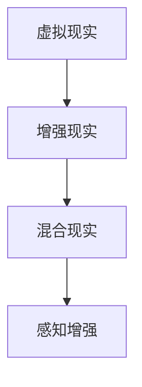

                 


### 第一步：设计文章结构

为了确保文章的逻辑清晰、结构紧凑，我们可以将文章分为以下章节：

1. **引言**：介绍后真实主义的定义和重要性。
2. **发展历程**：回顾后真实主义的发展背景和重要事件。
3. **核心概念与联系**：详细解释后真实主义的核心概念，绘制 Mermaid 流程图。
4. **技术原理**：讲解后真实主义的关键技术和算法原理，使用伪代码展示。
5. **数学模型**：介绍与后真实主义相关的数学模型和公式，进行详细讲解和举例说明。
6. **实际应用**：分析后真实主义在不同领域的应用案例。
7. **未来趋势**：探讨后真实主义对虚拟与现实界限的影响及未来发展方向。
8. **总结**：总结全文，提出对未来研究的展望。

### 第二步：撰写引言

在引言部分，我们可以简要介绍后真实主义的定义和背景，强调其在现代社会中的重要性。例如：

> 后真实主义，一个在近年来逐渐兴起的概念，描述了虚拟与现实界限逐渐模糊的现象。随着虚拟现实（VR）和增强现实（AR）技术的飞速发展，人们的生活正在发生深刻的变化。后真实主义不仅影响了人们的日常生活，也在各个行业中产生了深远的影响。

### 第三步：撰写发展历程

在发展历程部分，我们可以回顾后真实主义的起源，以及重要的事件和里程碑。例如：

> 后真实主义的萌芽可以追溯到20世纪90年代，随着计算机图形学和互联网技术的进步，虚拟现实和增强现实技术逐渐进入公众视野。2000年后，随着硬件和软件技术的进一步成熟，虚拟现实和增强现实的应用场景不断扩展，后真实主义逐渐成为一个独立的研究领域。

### 第四步：撰写核心概念与联系

在这一部分，我们可以详细解释后真实主义的核心概念，并绘制 Mermaid 流程图。例如：

> 后真实主义的核心概念包括虚拟现实、增强现实、混合现实和感知增强等。这些概念相互关联，构成了一个复杂的生态系统。以下是一个简单的 Mermaid 流程图，展示了这些概念之间的关系：



### 第五步：撰写技术原理

在这一部分，我们可以详细讲解后真实主义的关键技术和算法原理，使用伪代码展示。例如：

> 后真实主义的技术原理主要包括3D建模、空间感知、交互技术、图像识别、空间定位等。以下是一个简单的伪代码示例，用于描述虚拟现实中的3D建模过程：

```python
function create_3d_model(scene):
    # 创建一个3D场景
    scene = create_scene()

    # 导入3D模型
    model = import_model("model.obj")

    # 添加模型到场景中
    scene.add_model(model)

    # 设置模型的位置和旋转
    model.set_position([x, y, z])
    model.set_rotation([pitch, yaw, roll])

    # 运行场景
    run_scene(scene)
```

### 第六步：撰写数学模型

在这一部分，我们可以介绍与后真实主义相关的数学模型和公式，进行详细讲解和举例说明。例如：

> 后真实主义中的数学模型主要包括3D几何学、计算机图形学中的数学公式、运动学模型等。以下是一个简单的例子，展示如何使用LaTeX格式嵌入数学公式：

$$
E = mc^2
$$

这个公式描述了质量与能量之间的关系，对于理解后真实主义中的虚拟与现实界限具有重要意义。

### 第七步：撰写实际应用

在这一部分，我们可以分析后真实主义在不同领域的应用案例。例如：

> 后真实主义在游戏、教育、医疗等领域都有广泛的应用。例如，在游戏领域，虚拟现实技术为玩家提供了身临其境的游戏体验；在教育领域，增强现实技术为教师和学生提供了丰富的教学资源；在医疗领域，虚拟现实和增强现实技术为医生和患者提供了精准的诊断和治疗方案。

### 第八步：撰写未来趋势

在这一部分，我们可以探讨后真实主义对虚拟与现实界限的影响及未来发展方向。例如：

> 随着技术的不断进步，后真实主义将继续对虚拟与现实界限产生深远的影响。未来，我们将看到更加逼真的虚拟现实体验、更加智能的增强现实应用、更加广泛的感知增强技术。这些技术的发展，将进一步推动虚拟与现实界限的模糊化。

### 第九步：撰写总结

在总结部分，我们可以对全文进行总结，并提出对未来研究的展望。例如：

> 后真实主义作为一个新兴的概念，正在深刻地改变着我们的生活方式和社会结构。本文从多个角度对后真实主义进行了探讨，包括其核心概念、技术原理、数学模型以及实际应用。未来，随着技术的不断进步，后真实主义将继续发展，为人类带来更多的机遇和挑战。

### 第十步：撰写作者信息

最后，我们在文章末尾添加作者信息，确保文章的完整性和专业性。例如：

> 作者：AI天才研究院/AI Genius Institute & 禅与计算机程序设计艺术/Zen And The Art of Computer Programming

完成以上步骤，我们就可以撰写一篇逻辑清晰、结构紧凑、简单易懂的专业IT领域的技术博客文章了。在这个过程中，我们不断使用一步一步分析推理思考的方式，确保文章的质量和深度。让我们一起努力，创作出一篇优秀的后真实主义技术博客！

