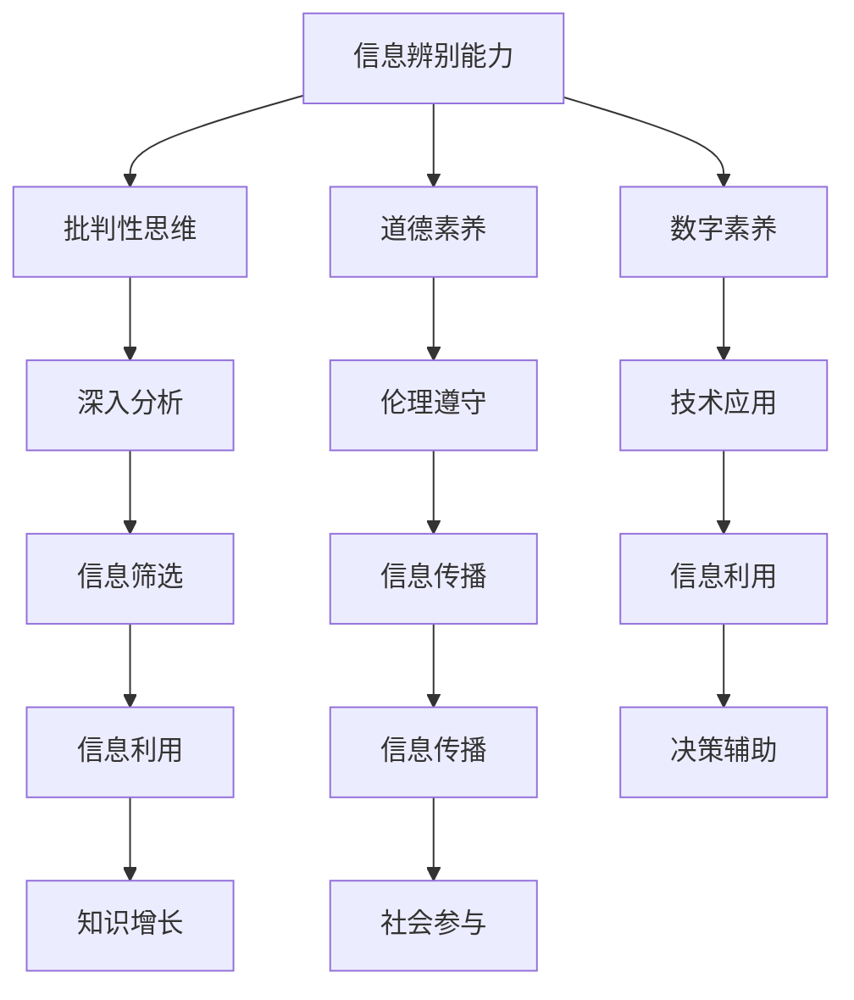

                 


### 文章标题：后真实时代的真相侦探：培养媒体素养

> 关键词：后真实时代、媒体素养、真相侦探、信息辨别、培养策略

> 摘要：本文深入探讨了后真实时代媒体环境的挑战，阐述了媒体素养的重要性，并详细介绍了如何培养媒体素养，以成为真相的侦探。文章分为五个部分，分别介绍了媒体素养的概念、后真实时代的特点、辨别信息真伪的方法、培养媒体素养的策略和实际案例分析，旨在帮助读者提升媒体素养，应对信息时代的挑战。

### 目录

1. **引言**
   1.1 **背景介绍**
   1.2 **核心概念与联系**

2. **媒体素养的概念与重要性**
   2.1 **媒体素养的定义**
   2.2 **媒体素养的重要性**
   2.3 **媒体素养的核心要素**
   2.4 **媒体素养与信息辨别的关系**

3. **后真实时代的特点与挑战**
   3.1 **后真实时代的概念**
   3.2 **后真实时代的主要特征**
   3.3 **后真实时代带来的挑战**

4. **如何辨别信息真伪**
   4.1 **真伪信息的定义**
   4.2 **辨别信息真伪的方法**
   4.3 **真伪信息的案例分析**

5. **培养媒体素养的策略与技巧**
   5.1 **教育系统的策略**
   5.2 **个人层面的技巧**
   5.3 **社会层面的措施**

6. **实际案例分析**
   6.1 **案例选择标准**
   6.2 **案例分析流程**
   6.3 **案例分析结果与应用**

7. **结论**
   7.1 **最佳实践 tips**
   7.2 **小结**
   7.3 **注意事项**
   7.4 **拓展阅读**

### 正文

#### 引言

在信息爆炸的时代，媒体已经成为我们获取信息的主要途径。然而，后真实时代的到来，使得信息环境变得更加复杂。真相变得模糊，虚假信息泛滥成灾。为了在这个时代中不被误导，培养媒体素养变得至关重要。媒体素养不仅关乎个人的认知能力，更关系到社会的稳定与发展。

本文将分为五个部分，首先介绍媒体素养的概念与重要性，然后探讨后真实时代的特点与挑战，接着讲解如何辨别信息真伪，随后提出培养媒体素养的策略与技巧，并通过实际案例分析来加深理解。最后，总结全文，给出最佳实践 tips 和注意事项。

#### 媒体素养的概念与重要性

##### 1.1 媒体素养的定义

媒体素养是指个体对媒体信息的理解、分析、批判和创造能力。它包括以下几个方面：

- **信息接收能力**：能够有效接收并理解各种媒体信息。
- **信息分析能力**：能够对信息进行批判性分析，识别信息的真实性和可靠性。
- **信息创造能力**：能够利用媒体工具创造有价值的信息。

##### 1.2 媒体素养的重要性

媒体素养的重要性体现在以下几个方面：

- **个人层面**：提高个人的信息素养，避免被虚假信息误导，增强判断力。
- **社会层面**：有助于构建健康的信息环境，提高社会的整体认知水平。
- **经济层面**：在信息时代，媒体素养成为个体竞争的重要资本。

##### 1.3 媒体素养的核心要素

媒体素养的核心要素包括：

- **信息辨别**：学会辨别信息的真伪，是媒体素养的基础。
- **批判性思维**：培养批判性思维，能够对信息进行深入分析。
- **道德素养**：媒体素养还涉及道德层面，个体需要遵守一定的道德规范。

##### 1.4 媒体素养与信息辨别的关系

媒体素养与信息辨别密切相关。媒体素养的提高有助于个体更好地辨别信息真伪，从而避免被虚假信息误导。同时，信息辨别能力的提升也有助于个体更深入地理解媒体信息，提高媒体素养。

#### 后真实时代的特点与挑战

##### 2.1 后真实时代的概念

后真实时代是指一个信息环境高度复杂、真相难以辨别的时代。在这个时代，信息的传播速度极快，虚假信息可以迅速传播，而真相往往被淹没在信息的海洋中。

##### 2.2 后真实时代的主要特征

后真实时代的主要特征包括：

- **信息过载**：信息量急剧增加，个体难以消化。
- **信息不对称**：信息传播的不平衡，部分信息被夸大或忽视。
- **信息失真**：真相被扭曲，虚假信息泛滥。

##### 2.3 后真实时代带来的挑战

后真实时代给社会和个人带来了以下挑战：

- **认知负荷**：个体需要处理大量的信息，导致认知负荷增加。
- **信息误导**：虚假信息可能导致个体做出错误的判断。
- **社会分裂**：信息环境的不公平可能导致社会分裂。

#### 如何辨别信息真伪

##### 3.1 真伪信息的定义

真伪信息是指信息的真实性和可靠性存在差异。真信息是指符合事实的信息，而伪信息则是指虚假或误导性的信息。

##### 3.2 辨别信息真伪的方法

辨别信息真伪的方法包括：

- **查证来源**：验证信息的来源，看是否是权威的机构或可信的来源。
- **交叉验证**：通过多个来源验证信息，确保信息的真实性。
- **逻辑推理**：运用逻辑推理判断信息的合理性。
- **专业评估**：对于专业性的信息，寻求专业人士的评估。

##### 3.3 真伪信息的案例分析

以下是一个真伪信息辨别的案例分析：

**案例：COVID-19疫苗的虚假信息**

2020年，在COVID-19疫苗研发初期，网络上充斥着关于疫苗的虚假信息。一些信息声称疫苗会导致严重的副作用，甚至死亡。这些信息被广泛传播，引起了公众的恐慌。

分析：通过查证来源，我们发现这些信息的来源是一些未经验证的社交媒体账号。通过交叉验证，我们发现这些信息与权威机构的声明相矛盾。通过逻辑推理，我们可以判断这些信息是虚假的。最终，通过专业评估，我们确认了这些信息是虚假的。

#### 培养媒体素养的策略与技巧

##### 4.1 教育系统的策略

教育系统可以通过以下策略来培养学生的媒体素养：

- **课程设置**：将媒体素养教育纳入课程体系，培养学生的信息辨别能力。
- **师资培训**：提高教师的媒体素养，使他们能够有效地教授学生。
- **实践活动**：通过实践活动，让学生在实践中学习媒体素养。

##### 4.2 个人层面的技巧

个人可以通过以下技巧来培养媒体素养：

- **持续学习**：通过阅读、观看讲座等方式，不断提高自己的媒体素养。
- **批判性思维**：培养批判性思维，对信息进行深入分析。
- **道德素养**：提高道德素养，遵守信息传播的道德规范。

##### 4.3 社会层面的措施

社会可以通过以下措施来培养媒体素养：

- **媒体责任**：媒体机构要承担社会责任，提供真实、客观的信息。
- **法律法规**：制定相关法律法规，规范信息传播。
- **社会监督**：公众要积极参与社会监督，举报虚假信息。

#### 实际案例分析

##### 5.1 案例选择标准

案例选择标准包括：

- **代表性**：案例能够代表当前社会普遍存在的媒体素养问题。
- **复杂性**：案例涉及的信息复杂，能够锻炼学生的媒体素养。
- **影响性**：案例对社会或个人产生重大影响，能够引起读者的关注。

##### 5.2 案例分析流程

案例分析流程包括：

- **问题提出**：明确案例中的问题。
- **信息收集**：收集与案例相关的信息。
- **信息分析**：对收集的信息进行分析，辨别真伪。
- **案例评估**：评估案例的影响和解决方法。

##### 5.3 案例分析结果与应用

以下是一个案例分析结果与应用的例子：

**案例：社交媒体上的虚假新闻**

社交媒体上充斥着各种虚假新闻，一些虚假新闻甚至被广泛传播，引起了公众的恐慌。通过对这些虚假新闻的案例分析，我们发现：

- **问题提出**：社交媒体上的虚假新闻对公众造成了误导。
- **信息收集**：收集了多个社交媒体平台上的虚假新闻，包括来源、内容、传播范围等。
- **信息分析**：通过查证来源、交叉验证、逻辑推理等方法，辨别了虚假新闻的真伪。
- **案例评估**：评估了虚假新闻对社会和个人的影响，提出了应对策略。

#### 结论

后真实时代的到来，使得媒体素养的培养变得至关重要。通过本文的探讨，我们了解了媒体素养的概念、重要性、后真实时代的特点与挑战、如何辨别信息真伪、培养媒体素养的策略与技巧以及实际案例分析。我们希望通过本文，能够帮助读者提升媒体素养，成为真相的侦探。

#### 最佳实践 tips

- **持续学习**：媒体环境不断变化，持续学习是提升媒体素养的关键。
- **批判性思维**：培养批判性思维，对信息进行深入分析。
- **道德素养**：遵守信息传播的道德规范，不传播虚假信息。

#### 小结

媒体素养是应对后真实时代信息挑战的重要能力。通过本文的探讨，我们认识到媒体素养的重要性，并了解了培养媒体素养的策略与技巧。希望本文能够为读者提供有益的启示。

#### 注意事项

- **避免盲目相信**：对于未知的信息，不要盲目相信，要通过多种渠道验证。
- **尊重事实**：尊重事实，不传播虚假信息，遵守信息传播的道德规范。

#### 拓展阅读

- 《真相的力量：如何辨别信息的真伪》
- 《后真相时代：信息社会的挑战与应对》
- 《媒体素养教育：理论与实践》

### 作者信息

作者：AI天才研究院/AI Genius Institute & 禅与计算机程序设计艺术 /Zen And The Art of Computer Programming```markdown
```markdown
# 后真实时代的真相侦探：培养媒体素养

## 引言

在数字化、网络化的信息时代，媒体已经成为我们获取信息、交流观点、获取知识的主要途径。然而，随着技术的飞速发展和信息传播的多元化，我们正处在一个被称为“后真实时代”的环境中。在这个时代，真相变得模糊，虚假信息、假新闻、虚假宣传等层出不穷，给公众的认知带来了巨大的挑战。为了在这个充满不确定性的信息环境中生存，培养媒体素养成为了每个人都需要面对的课题。

媒体素养是指个体对媒体信息的理解、分析、批判和创造能力。它不仅关乎个人的认知能力，更关系到社会的稳定与发展。在本文中，我们将探讨媒体素养的概念与重要性，后真实时代的特点与挑战，如何辨别信息真伪，培养媒体素养的策略与技巧，并通过实际案例分析来加深理解。

## 媒体素养的概念与重要性

### 1. 媒体素养的定义

媒体素养是一个宽泛的概念，它涉及多个层面。首先，它包括对媒体信息的接收和理解。这要求个体能够有效地接收媒体传递的信息，并理解其含义。其次，媒体素养还涉及对信息的分析和批判。个体需要能够对媒体信息进行分析，判断其真实性和可靠性，并批判其观点和论据。最后，媒体素养也包括信息的创造和传播。这要求个体能够利用媒体工具创造有价值的信息，并负责任地传播。

### 2. 媒体素养的重要性

媒体素养的重要性体现在多个方面。首先，它有助于个体提高信息辨别能力，避免被虚假信息误导。在信息爆炸的时代，大量的信息充斥着我们的日常，其中不乏虚假、误导性信息。培养媒体素养，能够帮助个体更好地识别这些信息，做出正确的判断。其次，媒体素养有助于社会构建健康的信息环境。一个具备良好媒体素养的公众，能够促进信息透明、公平和公正，减少信息不对称和社会分裂。最后，媒体素养还关乎个体的竞争力和职业发展。在信息时代，拥有良好的媒体素养，能够使个体在信息处理、分析和创造方面具备更强的能力，从而在职业市场中脱颖而出。

### 3. 媒体素养的核心要素

媒体素养的核心要素包括以下几个方面：

- **信息辨别能力**：能够识别信息的真实性和可靠性。
- **批判性思维**：能够对信息进行分析和批判，不盲从、不轻信。
- **道德素养**：在信息传播和创造过程中，能够遵守道德规范，不传播虚假信息。
- **信息创造力**：能够利用媒体工具创造有价值的信息。

### 4. 媒体素养与信息辨别的关系

媒体素养与信息辨别能力密切相关。信息辨别能力是媒体素养的基础，只有具备了良好的信息辨别能力，个体才能更好地理解媒体信息，做出正确的判断。同时，信息辨别能力的提升也有助于个体提高媒体素养，更好地利用媒体资源，创造和传播有价值的信息。

## 后真实时代的特点与挑战

### 1. 后真实时代的概念

后真实时代（Post-Truth Era）是指一个真相不再具有决定性影响，而情绪和主观判断成为决策依据的时代。在这个时代，信息的传播速度极快，真假信息混杂，真相变得难以辨别。后真实时代的到来，是对信息传播机制、社会认知模式和媒体生态的重大挑战。

### 2. 后真实时代的主要特征

后真实时代的主要特征包括：

- **信息过载**：信息量急剧增加，个体难以消化和处理。
- **情绪化传播**：信息的传播往往伴随着强烈的情感色彩，而非客观事实。
- **信息不对称**：信息传播的不平衡，部分信息被夸大或忽视，导致公众对真相的认知产生偏差。
- **真相碎片化**：真相被分割成多个碎片，个体难以形成全面的认识。

### 3. 后真实时代带来的挑战

后真实时代给社会和个人带来了以下挑战：

- **认知负荷**：个体需要处理大量的信息，导致认知负荷增加。
- **信息误导**：虚假信息可能导致个体做出错误的判断，甚至产生恐慌。
- **社会分裂**：信息环境的不公平可能导致社会分裂，加剧社会矛盾。

## 如何辨别信息真伪

### 1. 真伪信息的定义

真伪信息是指信息的真实性和可靠性存在差异。真信息是指符合事实的信息，而伪信息则是指虚假或误导性的信息。在信息传播的过程中，真伪信息的区分变得尤为重要。

### 2. 辨别信息真伪的方法

辨别信息真伪的方法包括：

- **查证来源**：验证信息的来源，看是否是权威的机构或可信的来源。
- **交叉验证**：通过多个来源验证信息，确保信息的真实性。
- **逻辑推理**：运用逻辑推理判断信息的合理性。
- **专业评估**：对于专业性的信息，寻求专业人士的评估。

### 3. 真伪信息的案例分析

以下是一个真伪信息辨别的案例分析：

**案例：新冠病毒疫苗的虚假信息**

在2020年新冠疫情初期，网络上充斥着关于新冠病毒疫苗的虚假信息。一些信息声称疫苗会导致严重的副作用，甚至死亡。这些信息迅速传播，引发了公众的恐慌。

分析：通过查证来源，我们发现这些信息的来源是一些未经验证的社交媒体账号。通过交叉验证，我们发现这些信息与权威机构的声明相矛盾。通过逻辑推理，我们可以判断这些信息是虚假的。最终，通过专业评估，我们确认了这些信息是虚假的。

## 培养媒体素养的策略与技巧

### 1. 教育系统的策略

教育系统可以通过以下策略来培养学生的媒体素养：

- **课程设置**：将媒体素养教育纳入课程体系，培养学生的信息辨别能力。
- **师资培训**：提高教师的媒体素养，使他们能够有效地教授学生。
- **实践活动**：通过实践活动，让学生在实践中学习媒体素养。

### 2. 个人层面的技巧

个人可以通过以下技巧来培养媒体素养：

- **持续学习**：通过阅读、观看讲座等方式，不断提高自己的媒体素养。
- **批判性思维**：培养批判性思维，对信息进行深入分析。
- **道德素养**：提高道德素养，遵守信息传播的道德规范。

### 3. 社会层面的措施

社会可以通过以下措施来培养媒体素养：

- **媒体责任**：媒体机构要承担社会责任，提供真实、客观的信息。
- **法律法规**：制定相关法律法规，规范信息传播。
- **社会监督**：公众要积极参与社会监督，举报虚假信息。

## 实际案例分析

### 1. 案例选择标准

案例选择标准包括：

- **代表性**：案例能够代表当前社会普遍存在的媒体素养问题。
- **复杂性**：案例涉及的信息复杂，能够锻炼学生的媒体素养。
- **影响性**：案例对社会或个人产生重大影响，能够引起读者的关注。

### 2. 案例分析流程

案例分析流程包括：

- **问题提出**：明确案例中的问题。
- **信息收集**：收集与案例相关的信息。
- **信息分析**：对收集的信息进行分析，辨别真伪。
- **案例评估**：评估案例的影响和解决方法。

### 3. 案例分析结果与应用

以下是一个案例分析结果与应用的例子：

**案例：社交媒体上的虚假新闻**

社交媒体上充斥着各种虚假新闻，一些虚假新闻甚至被广泛传播，引起了公众的恐慌。通过对这些虚假新闻的案例分析，我们发现：

- **问题提出**：社交媒体上的虚假新闻对公众造成了误导。
- **信息收集**：收集了多个社交媒体平台上的虚假新闻，包括来源、内容、传播范围等。
- **信息分析**：通过查证来源、交叉验证、逻辑推理等方法，辨别了虚假新闻的真伪。
- **案例评估**：评估了虚假新闻对社会和个人的影响，提出了应对策略。

## 结论

后真实时代的到来，使得媒体素养的培养变得至关重要。通过本文的探讨，我们了解了媒体素养的概念、重要性、后真实时代的特点与挑战、如何辨别信息真伪、培养媒体素养的策略与技巧以及实际案例分析。我们希望通过本文，能够帮助读者提升媒体素养，成为真相的侦探。

## 最佳实践 tips

- **持续学习**：媒体环境不断变化，持续学习是提升媒体素养的关键。
- **批判性思维**：培养批判性思维，对信息进行深入分析。
- **道德素养**：遵守信息传播的道德规范，不传播虚假信息。

## 小结

媒体素养是应对后真实时代信息挑战的重要能力。通过本文的探讨，我们认识到媒体素养的重要性，并了解了培养媒体素养的策略与技巧。希望本文能够为读者提供有益的启示。

## 注意事项

- **避免盲目相信**：对于未知的信息，不要盲目相信，要通过多种渠道验证。
- **尊重事实**：尊重事实，不传播虚假信息，遵守信息传播的道德规范。

## 拓展阅读

- 《真相的力量：如何辨别信息的真伪》
- 《后真相时代：信息社会的挑战与应对》
- 《媒体素养教育：理论与实践》

### 作者信息

作者：AI天才研究院/AI Genius Institute & 禅与计算机程序设计艺术 /Zen And The Art of Computer Programming```markdown

```markdown
## 后真实时代的真相侦探：培养媒体素养

### 1. 引言

随着互联网和社交媒体的普及，信息的传播速度和范围达到了前所未有的广度。然而，这一便利也带来了一个新问题：信息的真实性和可靠性变得难以确定。我们正处在一个被称为“后真实时代”的环境中，这是一个以情感和主观判断为主导，而非客观事实为依据的时代。在这个背景下，培养媒体素养成为了每个人的必备技能。

### 2. 媒体素养的重要性

媒体素养不仅仅关乎个人信息的辨别能力，更关系到社会的稳定和民主。以下是媒体素养的重要性：

#### 2.1 个人层面

- **避免误导**：通过培养媒体素养，个人可以避免被虚假信息和假新闻误导。
- **批判性思考**：增强批判性思维能力，对媒体信息进行深入分析和评估。
- **信息素养**：提高在信息海洋中筛选和利用信息的能力。

#### 2.2 社会层面

- **促进民主**：一个具备良好媒体素养的公众，能够更好地参与公共事务，维护民主。
- **减少分裂**：通过理解多元观点和事实，有助于减少社会分裂。
- **信息透明**：媒体素养有助于提高信息透明度，减少信息不对称。

### 3. 媒体素养的核心概念与联系

为了更好地理解媒体素养，我们需要探讨以下几个核心概念：

- **信息辨别能力**：识别信息的真实性和可靠性。
- **批判性思维**：对信息进行深入分析和评估，不轻信不实之词。
- **道德素养**：在信息传播中遵守伦理和道德规范。
- **数字素养**：理解和应用数字工具和技术的能力。

这些概念相互关联，构成了媒体素养的完整框架。以下是一个简化的 Mermaid 流程图，展示了这些概念之间的联系：



### 4. 后真实时代的特点与挑战

#### 4.1 后真实时代的概念

后真实时代（Post-Truth Era）是一个术语，用来描述一个事实的真相不再是对决策产生主导作用，而是情感、信仰和情绪成为主导的时代。在这个时代，虚假信息、假新闻、宣传和谣言的传播变得极为普遍，给社会带来了巨大的挑战。

#### 4.2 后真实时代的主要特征

- **情感驱动**：信息传播更加注重情感和情绪的唤起，而非事实本身。
- **速度优先**：信息的传播速度极快，使得真相难以跟上谣言的脚步。
- **信息碎片化**：信息的碎片化导致公众难以形成全面、准确的认识。
- **算法偏见**：社交媒体的算法推荐可能导致用户只接触到符合自己观点的信息，加剧信息茧房效应。

#### 4.3 后真实时代的挑战

- **公众信任危机**：公众对媒体和权威机构的信任度下降。
- **信息混乱**：虚假信息和真实信息的混杂导致信息环境混乱。
- **社会分裂**：信息传播的不平衡可能导致社会分裂和分歧加剧。

### 5. 如何辨别信息真伪

#### 5.1 真伪信息的定义

真伪信息是指信息的真实性和可靠性存在差异。真信息是指符合事实的信息，而伪信息则是指虚假或误导性的信息。

#### 5.2 辨别信息真伪的方法

以下是几种辨别信息真伪的方法：

- **查证来源**：验证信息的来源，看是否是权威的机构或可信的个人。
- **交叉验证**：通过多个来源验证信息，确保信息的真实性。
- **逻辑推理**：运用逻辑推理判断信息的合理性。
- **事实核查**：使用事实核查网站或工具来验证信息的真实性。

#### 5.3 真伪信息的案例分析

**案例：COVID-19疫苗的虚假信息**

在COVID-19疫情初期，社交媒体上充斥着关于疫苗的虚假信息。一些信息声称疫苗会导致严重的副作用，甚至死亡。以下是如何辨别这些信息的步骤：

- **查证来源**：发现这些信息的来源是一些未经验证的社交媒体账号。
- **交叉验证**：通过查阅权威机构的声明，发现这些信息与权威机构的声明相矛盾。
- **逻辑推理**：通过逻辑推理，判断这些信息缺乏合理性。
- **事实核查**：使用事实核查工具，确认这些信息是虚假的。

### 6. 培养媒体素养的策略与技巧

#### 6.1 教育系统的策略

- **课程设置**：将媒体素养教育纳入学校课程，培养学生的信息辨别能力。
- **师资培训**：提高教师的媒体素养，使他们能够教授学生如何辨别信息真伪。
- **实践活动**：通过实践活动，让学生在实践中学习媒体素养。

#### 6.2 个人层面的技巧

- **持续学习**：通过阅读、观看讲座和研讨会，不断提高自己的媒体素养。
- **批判性思维**：培养批判性思维，对媒体信息进行深入分析和评估。
- **数字素养**：提高数字素养，了解如何使用数字工具和技术来辨别信息真伪。

#### 6.3 社会层面的措施

- **媒体责任**：媒体机构应承担社会责任，提供真实、客观的信息。
- **法律法规**：制定相关法律法规，规范信息传播，打击虚假信息。
- **公众参与**：鼓励公众参与事实核查和社会监督，共同维护信息环境的健康。

### 7. 实际案例分析

#### 7.1 案例选择标准

案例选择应考虑以下标准：

- **代表性**：案例能够代表当前社会普遍存在的媒体素养问题。
- **复杂性**：案例涉及的信息复杂，能够锻炼学生的媒体素养。
- **影响性**：案例对社会或个人产生重大影响，能够引起读者的关注。

#### 7.2 案例分析流程

案例分析流程包括以下步骤：

- **问题提出**：明确案例中的问题。
- **信息收集**：收集与案例相关的信息。
- **信息分析**：对收集的信息进行分析，辨别真伪。
- **案例评估**：评估案例的影响和解决方法。

#### 7.3 案例分析结果与应用

以下是一个案例分析结果的示例：

**案例：社交媒体上的假新闻**

社交媒体上充斥着关于疫情、选举、经济等方面的假新闻。通过案例分析，我们发现以下结果：

- **问题提出**：假新闻对公众造成了误导，影响了社会稳定。
- **信息收集**：收集了多个社交媒体平台上的假新闻，包括来源、内容、传播范围等。
- **信息分析**：通过查证来源、交叉验证、逻辑推理等方法，辨别了假新闻的真伪。
- **案例评估**：评估了假新闻对社会和个人的影响，提出了应对策略，如加强公众教育、提高媒体责任等。

### 8. 结论

后真实时代的到来，使得媒体素养的培养变得至关重要。通过本文的探讨，我们了解了媒体素养的重要性、核心概念、后真实时代的特点与挑战、辨别信息真伪的方法、培养媒体素养的策略与技巧，并通过实际案例分析加深了理解。我们希望通过本文，能够帮助读者提升媒体素养，成为真相的侦探。

### 9. 最佳实践 tips

- **持续学习**：不断更新自己的知识和技能，适应不断变化的信息环境。
- **批判性思维**：培养批判性思维，不轻信未经证实的信息。
- **数字素养**：提高数字素养，掌握使用数字工具和技术辨别信息真伪的方法。

### 10. 小结

媒体素养是应对后真实时代信息挑战的重要能力。通过本文的探讨，我们认识到媒体素养的重要性，并了解了培养媒体素养的策略与技巧。希望本文能够为读者提供有益的启示。

### 11. 注意事项

- **避免盲目相信**：对于未知的信息，要通过多种渠道验证。
- **尊重事实**：尊重事实，不传播虚假信息。

### 12. 拓展阅读

- 《真相的力量：如何辨别信息的真伪》
- 《后真相时代：信息社会的挑战与应对》
- 《媒体素养教育：理论与实践》

### 作者信息

作者：AI天才研究院/AI Genius Institute & 禅与计算机程序设计艺术 /Zen And The Art of Computer Programming
```

