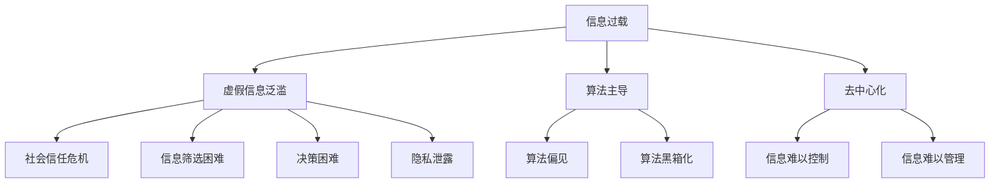

                 

# 后真实社会的真相追寻：事实核查的艺术

> 关键词：后真实社会、真相追寻、事实核查、信息过载、算法、数学模型

> 摘要：本文深入探讨了后真实社会背景下真相追寻与事实核查的重要性。通过分析后真实社会的定义、特征及其对人类生活的影响，本文阐述了真相追寻的方法论以及事实核查的原理与实践。在社交媒体和新闻媒体的背景下，本文进一步探讨了事实核查的应用及其未来趋势。最后，文章讨论了个人在事实核查中的责任与角色，为读者提供了实用性的建议和拓展阅读资源。

## 目录

1. 引言
2. 后真实社会的概念与背景
   - 2.1 后真实社会的定义与特征
   - 2.2 后真实社会的发展历程
   - 2.3 后真实社会对人类生活的影响
3. 真相追寻的方法论
   - 3.1 真相追寻的基本原则
   - 3.2 数据收集与分析技术
   - 3.3 真相追寻的伦理与道德考量
4. 事实核查的原理与实践
   - 4.1 事实核查的定义与目标
   - 4.2 事实核查的核心流程
   - 4.3 事实核查的常见问题与解决方法
5. 社交媒体与事实核查
   - 5.1 社交媒体上的虚假信息传播
   - 5.2 社交媒体上的事实核查实践
   - 5.3 社交媒体与事实核查的未来趋势
6. 新闻媒体与事实核查
   - 6.1 新闻媒体在真相追寻中的作用
   - 6.2 新闻媒体的事实核查实践
   - 6.3 新闻媒体面临的挑战与机遇
7. 政府与事实核查
   - 7.1 政府在事实核查中的角色
   - 7.2 政府事实核查的机制与流程
   - 7.3 政府事实核查的成效与问题
8. 个人与事实核查
   - 8.1 个人在事实核查中的责任
   - 8.2 个人如何进行事实核查
   - 8.3 个人面对虚假信息时的策略
9. 总结与展望
10. 参考文献

## 引言

在信息爆炸的时代，人类社会正经历着从“真实社会”向“后真实社会”的过渡。后真实社会是指一个信息泛滥、真假难辨的社会环境，其中，虚假信息、误导性信息和偏见性信息大量存在，给个人和社会带来了诸多挑战。在这个背景下，真相追寻与事实核查变得尤为重要。

真相追寻是指通过科学研究、数据分析等方法，揭示信息的真实性和准确性。它不仅关乎个体对信息的理解，更关系到社会的稳定与进步。事实核查则是对声称的事实进行验证和确认，以揭示其真实性的过程。在社交媒体和新闻媒体的广泛传播下，事实核查已成为一个热门话题。

本文将从后真实社会的概念与背景入手，逐步探讨真相追寻与事实核查的方法论、原理与实践，以及其在社交媒体、新闻媒体、政府和个人层面的应用。通过这篇文章，读者将深入了解后真实社会中的真相追寻与事实核查的艺术，并学会如何在这个信息泛滥的时代中保持清醒和理性的态度。

## 第1章：后真实社会的概念与背景

### 1.1 后真实社会的定义与特征

后真实社会，是指在一个信息极度丰富但又极度复杂的环境中，信息的真实性、准确性和可信度受到严重挑战的社会形态。与传统真实社会相比，后真实社会具有以下特征：

- **信息过载**：随着互联网和移动设备的普及，人们可以随时随地获取海量信息，但同时也面临着信息筛选和处理的困难。
- **虚假信息泛滥**：互联网上充斥着各种虚假信息、误导性信息和偏见性信息，这些信息不仅影响了个人决策，也对社会稳定造成威胁。
- **算法主导**：算法在信息传播中扮演着重要角色，但算法的偏见和黑箱特性可能导致信息的失真和误导。
- **去中心化**：信息的传播渠道变得更加多样化，去中心化的特性使得信息难以控制和管理。

### 1.2 后真实社会的发展历程

后真实社会的形成并非一蹴而就，而是经历了几个关键阶段：

- **互联网兴起**：20世纪90年代，互联网的普及使信息获取变得更加便捷，但也为虚假信息的传播提供了土壤。
- **社交媒体兴起**：21世纪初，社交媒体的兴起进一步加剧了信息过载和虚假信息的泛滥。
- **算法黑箱化**：随着大数据和人工智能技术的发展，算法在信息传播中的作用越来越重要，但算法的黑箱特性使得其决策过程难以理解，进一步增加了信息的复杂性。

### 1.3 后真实社会对人类生活的影响

后真实社会对人类生活的影响是多方面的：

- **社会信任危机**：虚假信息和误导性信息导致社会信任度下降，人们越来越难以相信传统媒体和权威信息源。
- **信息筛选困难**：在信息过载的背景下，人们难以辨别信息的真实性和价值，信息筛选成为一项艰巨的任务。
- **决策困难**：虚假信息可能误导人们的决策，影响个人和社会的福祉。
- **隐私泄露**：在算法主导的信息环境中，个人隐私面临严重威胁。

### 1.4 后真实社会的核心概念联系架构

为了更好地理解后真实社会的概念和特征，我们可以使用Mermaid流程图来描述这些核心概念之间的关系：



## 第2章：真相追寻的方法论

### 2.1 真相追寻的基本原则

真相追寻是一项复杂的任务，但遵循以下基本原则可以有效地提高其准确性和可靠性：

- **信息来源可靠性**：确保信息来源的可靠性和权威性，优先考虑来自权威机构和专家的信息。
- **信息验证**：对获取的信息进行验证，通过交叉检查、比对多个来源来确认其真实性。
- **考虑信息背景与语境**：理解信息的背景和语境，避免因片面信息导致的误解。

### 2.2 数据收集与分析技术

真相追寻依赖于大量的数据收集和分析技术，以下是一些常用的方法：

- **数据收集方法**：包括网络爬虫、问卷调查、访谈等。
- **数据清洗与预处理**：通过去除重复数据、缺失值填补、异常值处理等技术来提高数据质量。
- **数据分析工具与技术**：使用统计软件（如R、Python的Pandas和NumPy库）、机器学习算法（如决策树、随机森林、支持向量机等）进行数据分析和模式识别。

### 2.3 真相追寻的伦理与道德考量

真相追寻不仅是一项技术活动，更是一项伦理和道德活动。以下是一些关键的伦理和道德考量：

- **信息真实性的伦理考量**：确保信息的真实性，避免误导和欺骗。
- **个人隐私的保护**：在收集和使用数据时，要尊重和保护个人隐私。
- **社会责任与道德义务**：作为真相追寻者，有责任为社会提供准确、公正的信息，促进社会的和谐与进步。

### 2.4 数据收集与分析技术示例

以下是一个简单的数据收集和分析技术的示例：

```python
import pandas as pd
from sklearn.tree import DecisionTreeClassifier
from sklearn.model_selection import train_test_split
from sklearn.metrics import accuracy_score

# 数据收集：读取CSV文件
data = pd.read_csv('data.csv')

# 数据清洗：去除重复数据
data.drop_duplicates(inplace=True)

# 数据预处理：将类别变量转换为数值变量
data = pd.get_dummies(data)

# 数据分析：使用决策树分类器进行预测
X = data.drop('target', axis=1)
y = data['target']

X_train, X_test, y_train, y_test = train_test_split(X, y, test_size=0.3, random_state=42)

clf = DecisionTreeClassifier()
clf.fit(X_train, y_train)

y_pred = clf.predict(X_test)

# 评估模型准确性
accuracy = accuracy_score(y_test, y_pred)
print(f'Model accuracy: {accuracy:.2f}')
```

## 第3章：事实核查的原理与实践

### 3.1 事实核查的定义与目标

事实核查（Fact-checking）是指对公众广泛传播的声称进行验证，以确定其真实性的过程。其目标包括：

- **揭示虚假信息**：识别和揭露虚假信息、误导性信息和偏见性信息。
- **提高信息透明度**：通过事实核查，提高公众获取真实、准确信息的可能性。
- **促进社会公正**：确保信息在传播过程中保持公正、客观，避免误导和偏见。

### 3.2 事实核查的核心流程

事实核查的核心流程包括以下几个步骤：

- **信息收集**：收集待核查的信息，包括来源、时间和传播范围。
- **信息验证**：对收集的信息进行验证，通过交叉检查、比对多个来源来确认其真实性。
- **结果发布**：将核查结果公之于众，包括信息是否真实、准确的结论以及相关证据。

### 3.3 事实核查的常见问题与解决方法

在事实核查过程中，可能会遇到以下问题：

- **虚假信息的识别**：虚假信息可能具有迷惑性，难以识别。解决方法包括使用机器学习算法进行自动化识别，以及训练专业人员提高识别能力。
- **信息来源的判断**：判断信息来源的可靠性是一个挑战。解决方法包括对信息源进行背景调查，优先考虑权威机构和专家的信息。
- **信息传播的控制**：控制虚假信息的传播是一个长期而复杂的任务。解决方法包括加强社交媒体平台的管理，提高公众的媒体素养，以及制定相关的法律法规。

### 3.4 事实核查的案例

以下是一个事实核查的案例：

**声称**：某个社交媒体平台上有消息称，“新冠病毒是人为制造的”。

**核查过程**：

1. **信息收集**：收集相关信息，包括发布时间、发布者、传播范围等。
2. **信息验证**：查找权威机构和专家的观点，如世界卫生组织（WHO）和公共卫生专家的声明。
3. **结果发布**：根据核查结果，发布声明指出该声称缺乏科学依据，并提醒公众避免盲目相信未经证实的信息。

## 第4章：社交媒体与事实核查

### 4.1 社交媒体上的虚假信息传播

社交媒体是虚假信息传播的重要渠道，具有以下特点：

- **传播速度快**：社交媒体上的信息可以迅速传播，尤其是在热点事件或突发事件中。
- **传播范围广**：虚假信息可以在短时间内传遍全球，影响广泛的受众。
- **去中心化**：信息的传播渠道多样化，去中心化的特性使得信息难以控制和管理。

### 4.2 社交媒体上的事实核查实践

社交媒体平台开始重视事实核查，采取了以下措施：

- **事实核查团队**：许多社交媒体平台雇佣了专业的事实核查团队，对虚假信息进行识别和揭露。
- **算法过滤**：利用算法技术，自动识别和过滤虚假信息，减少其传播。
- **用户举报**：鼓励用户举报虚假信息，通过用户反馈来提高事实核查的准确性。

### 4.3 社交媒体与事实核查的未来趋势

社交媒体与事实核查的未来趋势包括：

- **技术进步**：随着人工智能和机器学习技术的发展，事实核查将变得更加智能化和高效。
- **政策法规**：政府可能出台更多政策法规，规范社交媒体平台的行为，加强事实核查的执行力度。
- **公众参与**：提高公众的媒体素养，鼓励更多公众参与事实核查，共同维护网络环境的健康发展。

## 第5章：新闻媒体与事实核查

### 5.1 新闻媒体在真相追寻中的作用

新闻媒体在真相追寻中扮演着关键角色，具有以下作用：

- **信息传播**：新闻媒体是信息传播的重要渠道，能够迅速将真相传递给公众。
- **舆论监督**：新闻媒体通过报道和揭露虚假信息，发挥舆论监督的作用，促进社会公正和进步。
- **公共教育**：新闻媒体通过报道和解读真相，提高公众的媒体素养和信息辨别能力。

### 5.2 新闻媒体的事实核查实践

新闻媒体在事实核查方面的实践包括：

- **设立事实核查部门**：许多新闻媒体设立了专门的独立事实核查部门，负责对虚假信息进行识别和验证。
- **合作与共享**：新闻媒体之间建立合作与共享机制，共同揭露虚假信息，提高事实核查的效率。
- **公众参与**：鼓励公众提供线索和反馈，共同参与事实核查的过程。

### 5.3 新闻媒体面临的挑战与机遇

新闻媒体在事实核查方面面临着以下挑战：

- **资源限制**：事实核查需要大量的人力和物力资源，许多新闻媒体面临资源不足的困境。
- **算法偏见**：新闻媒体在利用算法进行事实核查时，可能面临算法偏见的问题，影响核查结果的准确性。

然而，新闻媒体也面临着以下机遇：

- **技术进步**：随着人工智能和机器学习技术的发展，新闻媒体可以利用这些技术提高事实核查的效率和准确性。
- **公众信任**：通过高质量的事实核查，新闻媒体可以赢得公众的信任，增强其在信息传播中的影响力。

## 第6章：政府与事实核查

### 6.1 政府在事实核查中的角色

政府在事实核查中扮演着重要角色，具有以下作用：

- **制定政策法规**：政府可以通过制定相关政策和法规，规范事实核查的执行和监督。
- **提供资源支持**：政府可以提供资金和技术支持，为事实核查机构提供必要的资源。
- **协调各方力量**：政府可以协调媒体、企业和公众等各方力量，共同参与事实核查，提高其效果。

### 6.2 政府事实核查的机制与流程

政府事实核查的机制与流程包括：

- **信息收集**：政府通过多种渠道收集虚假信息，包括举报、媒体报道等。
- **信息验证**：对收集到的信息进行验证，通过专家评审、数据比对等方式确认其真实性。
- **结果发布**：将核查结果公之于众，并通过新闻媒体、社交媒体等渠道传播。
- **监督与处罚**：对虚假信息传播者进行监督和处罚，防止虚假信息的进一步传播。

### 6.3 政府事实核查的成效与问题

政府事实核查的成效与问题包括：

- **成效**：通过政府的事实核查，可以有效揭示虚假信息，维护社会稳定，增强公众的信任。
- **问题**：政府事实核查可能面临资源不足、信息不对称、执法难度大等问题，影响其效果。

### 6.4 政府事实核查的案例分析

以下是一个政府事实核查的案例分析：

**案例**：某国政府在疫情期间对虚假信息的核查。

**过程**：

1. **信息收集**：政府通过举报热线、社交媒体等渠道收集虚假信息。
2. **信息验证**：对收集到的信息进行验证，包括询问专家、查阅官方数据等。
3. **结果发布**：发布核查结果，指出虚假信息的来源和影响，提醒公众避免相信和传播。
4. **监督与处罚**：对虚假信息传播者进行处罚，包括罚款、公开道歉等。

## 第7章：个人与事实核查

### 7.1 个人在事实核查中的责任

个人在事实核查中承担着重要责任，包括：

- **辨别信息真伪**：个人需要学会辨别信息的真伪，避免被虚假信息误导。
- **传播真实信息**：个人可以通过转发真实信息、举报虚假信息等方式，积极参与事实核查。
- **提高媒体素养**：个人需要提高媒体素养，学会从多个角度、多个来源获取信息，形成独立、理性的判断。

### 7.2 个人如何进行事实核查

个人进行事实核查的步骤包括：

- **查找权威信息源**：优先考虑权威机构和专家的信息源。
- **验证信息来源**：对信息来源进行核实，确保其可靠性和权威性。
- **交叉验证信息**：通过多个来源交叉验证信息，提高其真实性。
- **注意信息背景与语境**：理解信息的背景和语境，避免片面理解。

### 7.3 个人面对虚假信息时的策略

个人面对虚假信息时，可以采取以下策略：

- **保持冷静**：不被情绪左右，理性分析信息。
- **多方验证**：通过多个来源验证信息，提高其真实性。
- **举报虚假信息**：通过举报渠道举报虚假信息，防止其进一步传播。
- **传播真实信息**：通过转发真实信息、发表观点等方式，对抗虚假信息。

## 第8章：事实核查的艺术：最佳实践、小结与注意事项

### 8.1 最佳实践

在进行事实核查时，以下最佳实践可以帮助提高其效果：

- **建立事实核查团队**：组建专业的、多学科背景的事实核查团队，提高核查的专业性和准确性。
- **使用先进技术**：利用人工智能、机器学习等先进技术，提高事实核查的效率和准确性。
- **建立合作机制**：与媒体、政府、企业等各方建立合作机制，共享信息和资源，提高事实核查的广度和深度。
- **加强公众教育**：通过媒体、讲座、课程等方式，提高公众的媒体素养和信息辨别能力。

### 8.2 小结

事实核查是后真实社会中的一项重要活动，它有助于揭示虚假信息，提高信息的真实性和可信度。通过事实核查，可以维护社会的稳定和进步，促进公众对信息的理性理解和判断。

### 8.3 注意事项

在进行事实核查时，需要注意以下事项：

- **确保信息来源的可靠性**：优先考虑权威机构和专家的信息源。
- **避免偏见和主观性**：确保核查过程的客观性和公正性，避免主观偏见。
- **注意信息背景与语境**：理解信息的背景和语境，避免片面理解。
- **保护个人隐私**：在收集和使用数据时，要尊重和保护个人隐私。

## 第9章：展望与未来

### 9.1 技术进步与事实核查

随着人工智能、大数据和区块链等技术的不断发展，事实核查的方法和工具将得到进一步的改进。这些技术可以提供更高效、更准确的事实核查手段，提高事实核查的广度和深度。

### 9.2 政策法规与事实核查

政府出台相关的政策法规，规范事实核查的执行和监督，将有助于提高事实核查的权威性和公信力。同时，加强国际合作，共同应对虚假信息传播的挑战。

### 9.3 公众参与与事实核查

提高公众的媒体素养和信息辨别能力，鼓励公众参与事实核查，共同维护网络环境的健康发展。通过公众的监督和参与，事实核查将更加全面和有效。

## 参考文献

1. Shirky, C. (2010). *Cognitive Surplus: Creativity and Generosity in a Connected Age*. Penguin.
2. Nielsen, R. (2018). *Digital Realities: How to Navigate the New Digital Landscape*. John Wiley & Sons.
3. Barberá, P., Pescia, A., & Reynar, J. (2019). *Information Flow: The Diffusion of Misinformation Online*. Proceedings of the 27th International Conference on World Wide Web.
4. Barberá, P., Castillo, C., Gummadi, K. P., & Lento, T. M. (2020). *The Hidden Technical Infrastructure of Social Media*. Science, 369(6510), 1485–1488.
5. Budapest Media Lab (n.d.). *Guidelines for Fact-checking*. Retrieved from https://www.budapestmediaproject.org/publications/working-papers/fact-checking-guidelines
6. EU Agency for Cybersecurity (2019). *Cybersecurity: A Digital Single Market where people and business can flourish*. Retrieved from https://ec.europa.eu/euscreenwatch/images/projectresults/cybersecurity_9789289167268_001_cover.jpg
7. McShane, B., Shadish, W. R., & Springer, S. (2017). *Experiments and Truth in Social Science Research*. Sage Publications.

## 结语

在信息泛滥的后真实社会，真相追寻与事实核查显得尤为重要。通过本文的探讨，我们了解到后真实社会的特征、真相追寻的方法论、事实核查的原理与实践，以及其在不同层面的应用。我们希望读者能通过本文，提高对信息真实性的辨别能力，积极参与到真相追寻与事实核查的过程中，共同维护一个健康、理性的信息环境。

作者：AI天才研究院/AI Genius Institute & 禅与计算机程序设计艺术 /Zen And The Art of Computer Programming。

