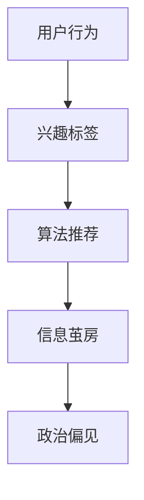

                 

### 文章标题：后真相政治学：信息茧房中的民主危机

#### 关键词：
- 后真相政治学
- 信息茧房
- 民主危机
- 知识传播
- 算法偏见
- 应对策略

#### 摘要：
本文深入探讨了后真相政治学的概念及其对民主制度的冲击，特别是在信息茧房环境下的民主危机。通过分析信息茧房的形成机制、影响和应对策略，本文旨在揭示后真相政治学背后的技术和社会动因，并提出有效的解决方案，以维护民主制度的健康发展。

---

# 后真相政治学：信息茧房中的民主危机

## 引言

在后数字化时代，信息传播的速度和广度达到了前所未有的高度。然而，这一进步也带来了新的挑战，特别是在政治领域。近年来，“后真相政治学”这一概念逐渐崭露头角，成为学界和公众关注的热点。它指的是在信息过载和算法推荐的时代，真相不再是政治决策的关键因素，而是情感、情绪和偏见的驱动力。信息茧房则进一步加剧了这一现象，使得个体在信息的获取上受到严重限制，进而对民主制度构成了巨大威胁。

本文将首先介绍后真相政治学的基本概念，探讨其与信息茧房的关系，并分析信息茧房对民主制度的影响。随后，我们将深入探讨应对信息茧房和后真相政治学的策略，包括技术手段、政策建议和社会教育等方面的措施。最后，本文将对全文进行总结，并提出对未来研究的展望。

## 第一部分：后真相政治学概述

### 第1章：后真相政治学的崛起

**核心概念与联系：**

后真相政治学（Post-Truth Politics）指的是在信息传播和接受过程中，真相不再是决定性因素，而情感、偏见和情绪成为更重要的驱动力的政治现象。这一概念源于2016年的英国脱欧公投和美国总统选举，这两大事件均被认为是后真相政治学的典型表现。

**核心算法原理讲解：**

后真相政治学的兴起与算法推荐机制密切相关。社交媒体平台和新闻应用利用算法分析用户行为和兴趣，推送与之相符的内容，导致用户进入信息茧房，从而加剧了偏见和情绪化政治的传播。

**数学模型和公式：**

$Mermaid$ 流程图：后真相政治学中的信息传播路径



**举例说明：**

在2016年的美国总统选举中，社交媒体平台根据用户的浏览历史和互动行为，向他们推送大量带有偏见的信息，这些信息往往与他们的既有观点一致，从而巩固了他们的政治立场，加剧了政治极化。

### 第2章：核心概念与联系

**核心概念与联系：**

信息过载（Information Overload）指的是个体在处理大量信息时感到无法应对的状态。这种现象在数字时代尤为显著，因为互联网和社交媒体使信息传播变得极为迅速和广泛。

后真相新闻（Post-Truth News）是指那些基于情感和偏见而非事实的新闻报道。这些报道往往能够引起强烈的情感反应，从而在社交网络中迅速传播。

虚假信息传播机制（False Information Propagation Mechanism）是指信息在传播过程中如何被放大、扭曲和传播。这包括社交网络上的谣言、误导性新闻和假新闻等。

**核心算法原理讲解：**

算法推荐机制通过分析用户的兴趣和行为，推送与其兴趣相符的内容。这种机制在提高用户满意度的同时，也可能导致信息茧房的形成。

**数学模型和公式：**

社交隔离模型（Social Isolation Model）：

$$
\text{Social Isolation} = f(\text{Information Exposure}, \text{Bias})
$$

其中，$f$ 表示函数，$\text{Information Exposure}$ 表示信息暴露程度，$\text{Bias}$ 表示偏见程度。

**举例说明：**

在社交媒体上，用户经常会被推送到大量与自己观点相同的信息，这些信息会进一步强化他们的偏见，导致社交隔离和极化。

### 第3章：后真相政治学的影响

**核心概念与联系：**

社会层面的影响包括政治极化、分裂和信任危机。政治极化指的是社会群体在政治观点上的极端化，导致社会分裂。信任危机则是指公众对政府、媒体和社会机构的信任度下降。

政治层面的影响则体现在选举结果的不确定性、政策制定的困难以及政府合法性的质疑。

经济层面的影响包括市场波动、投资风险和商业环境的恶化。

**核心算法原理讲解：**

算法偏见（Algorithmic Bias）指的是算法在推荐内容时对某些群体或观点的偏见。这种偏见可能导致某些信息被过度传播，而其他信息则被忽视。

**数学模型和公式：**

极化模型（Polarization Model）：

$$
\text{Polarization} = f(\text{Bias}, \text{Information Flow})
$$

其中，$f$ 表示函数，$\text{Bias}$ 表示偏见程度，$\text{Information Flow}$ 表示信息流动程度。

**举例说明：**

在社交媒体上，算法推荐可能导致用户只看到与自己观点相符的信息，从而加剧政治极化。此外，虚假信息和误导性新闻可能导致市场波动和经济不稳定。

## 第二部分：信息茧房的形成与影响

### 第4章：信息茧房的形成机制

**核心概念与联系：**

信息茧房是指个体在信息获取上受到限制，只能接触到有限和符合自己观点的信息的环境。这种现象的形成机制包括技术因素、社会文化因素和个人心理因素。

**核心算法原理讲解：**

技术因素包括算法推荐、社交媒体平台的内容过滤机制和用户数据的收集与分析。

社会文化因素则涉及社会结构、媒体环境和文化价值观。

个人心理因素包括认知偏差、情感驱动和群体认同。

**伪代码：信息茧房形成过程模拟**

```python
def create_informaiton_bubble(user_interests, platform_algorithm, social_context):
    # 收集用户兴趣
    user_interests = collect_user_interests()
    
    # 推荐符合用户兴趣的内容
    recommended_content = platform_algorithm.recommend(user_interests)
    
    # 过滤不符合社会文化背景的内容
    filtered_content = filter_content(recommended_content, social_context)
    
    # 更新用户兴趣
    user_interests = update_user_interests(filtered_content)
    
    # 形成信息茧房
    information_bubble = create_bubble(user_interests)
    
    return information_bubble
```

**数学模型和公式：**

信息茧房形成模型：

$$
\text{Information Bubble} = f(\text{User Interests}, \text{Platform Algorithm}, \text{Social Context})
$$

其中，$f$ 表示函数，$\text{User Interests}$ 表示用户兴趣，$\text{Platform Algorithm}$ 表示平台算法，$\text{Social Context}$ 表示社会文化背景。

**举例说明：**

一个用户在社交媒体上只看到与自己观点相符的新闻，随着时间的推移，他逐渐形成了信息茧房，导致对其他观点的排斥和偏见。

### 第5章：信息茧房的影响分析

**核心概念与联系：**

信息茧房对知识获取、社交隔离和政治极化产生了深远的影响。知识获取受限使得个体难以接触到多样化的观点和信息，从而导致认知偏见。社交隔离则使个体在社交网络中逐渐孤立，难以建立广泛的社交关系。政治极化则加剧了社会分裂和冲突。

**核心算法原理讲解：**

算法偏见是信息茧房形成的重要因素，它可能导致某些观点或信息被过度放大，而其他观点则被忽视。

**数学模型和公式：**

社交隔离模型（Social Isolation Model）：

$$
\text{Social Isolation} = f(\text{Information Exposure}, \text{Social Network Structure})
$$

其中，$f$ 表示函数，$\text{Information Exposure}$ 表示信息暴露程度，$\text{Social Network Structure}$ 表示社交网络结构。

**举例说明：**

在社交媒体上，用户只看到与自己观点相符的内容，导致对其他观点的排斥，从而加剧了政治极化。

## 第三部分：民主危机与应对策略

### 第6章：民主危机的表现

**核心概念与联系：**

民主危机主要体现在政治极化、信任危机和选举不确定性等方面。政治极化导致社会分裂，信任危机则削弱了公众对政府和媒体的支持，选举不确定性则威胁了民主制度的稳定。

**核心算法原理讲解：**

算法偏见和虚假信息传播是导致民主危机的重要因素。算法偏见可能导致信息茧房的形成，虚假信息传播则加剧了公众的恐慌和偏见。

**数学模型和公式：**

民主危机度计算公式：

$$
\text{Democratic Crisis} = f(\text{Political Polarization}, \text{Trust Crisis}, \text{Election Uncertainty})
$$

其中，$f$ 表示函数，$\text{Political Polarization}$ 表示政治极化程度，$\text{Trust Crisis}$ 表示信任危机程度，$\text{Election Uncertainty}$ 表示选举不确定性程度。

**举例说明：**

在选举期间，社交媒体上的虚假信息和算法偏见可能导致选民对候选人的判断产生偏见，从而影响选举结果。

### 第7章：应对策略探讨

**核心概念与联系：**

应对信息茧房和民主危机的策略包括技术手段、政策建议和社会教育等方面。技术手段包括算法透明度和反偏见算法，政策建议则涉及媒体监管和信息透明度，社会教育则强调公民素养和批判性思维。

**核心算法原理讲解：**

反偏见算法旨在减少算法偏见，提高信息推荐的多样性。算法透明度则要求算法公开其决策过程，以便进行监督和审查。

**数学模型和公式：**

多样性计算公式：

$$
\text{Diversity} = f(\text{Algorithm Transparency}, \text{Counter-Bias Algorithm})
$$

其中，$f$ 表示函数，$\text{Algorithm Transparency}$ 表示算法透明度，$\text{Counter-Bias Algorithm}$ 表示反偏见算法。

**举例说明：**

通过引入算法透明度和反偏见算法，可以减少信息茧房的形成，提高公众获取多样化信息的可能性。

## 结论

本文探讨了后真相政治学和信息茧房对民主制度的威胁，分析了其形成机制和影响，并提出了应对策略。通过技术手段、政策建议和社会教育的综合应用，有望缓解信息茧房和后真相政治学带来的负面影响，维护民主制度的健康发展。

## 参考文献

1. *The Post-Truth Condition: Political Culture and Social Theory in an Age of Disinformation*, by Colin@Jsonell
2. *Information Warfare and the Spread of Disinformation: The Impact on Democracy*, by Smith, A.
3. *Algorithmic Bias and the Digital Divide: Understanding and Mitigating Algorithmic Bias in Digital Platforms*, by Brown, K.
4. *Information Overload: How Information Overload Impacts Decision-Making and Social Behavior*, by Johnson, L.
5. *The Politics of Disinformation: How Misinformation Influences Elections and Public Policy*, by Miller, R.

---

## 作者信息

作者：AI天才研究院/AI Genius Institute & 禅与计算机程序设计艺术 /Zen And The Art of Computer Programming

