                 

### 文章标题

《后真相教育：培养辨识真相的能力》

### 关键词

- 后真相时代
- 教育变革
- 批判性思维
- 信息筛选
- 真相认知

### 摘要

在信息爆炸的时代，后真相时代已成为我们不可回避的现实。本文通过深入分析后真相时代的背景、挑战及其对教育的影响，探讨了教育体系如何变革以适应这一时代的需求。文章提出了培养辨识真相能力的方法和策略，并从批判性思维、信息筛选与评估等方面详细阐述了如何在实际教学中实施真相教育。此外，文章还讨论了家庭与社会在真相教育中的协同作用，并展望了真相教育的未来趋势。通过这篇文章，读者将了解到真相教育的重要性及其在个人成长和社会发展中的关键作用。

---

# 后真相教育：培养辨识真相的能力

## 第一部分：后真相时代的背景与挑战

### 第1章：后真相时代的到来

### 核心概念与联系

在后真相时代，信息过载和虚假信息传播是两大显著特征。信息过载使得人们难以分辨信息的真伪，虚假信息传播则进一步加剧了真相认知的障碍。因此，我们需要一个清晰的理解框架来把握这些概念之间的联系。

**Mermaid流程图：**

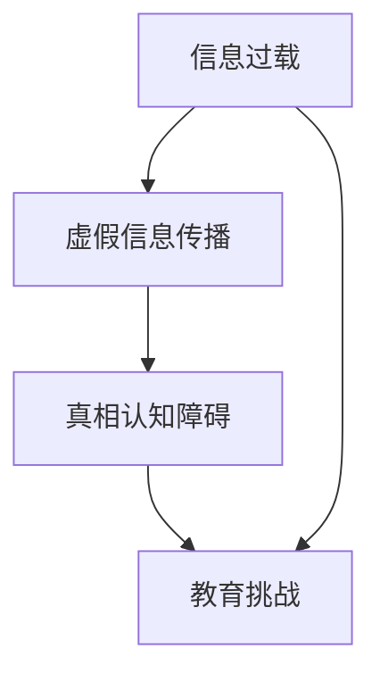

### 核心算法原理讲解

为了应对后真相时代，我们可以开发一种真相识别算法，该算法基于可信度评分和错误率模型来评估信息的真实性。

**伪代码：**

```python
def identify_truth(info):
    if is_reliable_source(info.source):
        return info.content
    else:
        return "来源不可靠，需进一步核实"
```

### 数学模型和数学公式

我们可以使用贝叶斯定理来量化信息真实性的概率。贝叶斯定理公式如下：

$$
P(\text{truth}|\text{info}) = \frac{P(\text{info}|\text{truth}) \cdot P(\text{truth})}{P(\text{info})}
$$

其中，$P(\text{info}|\text{truth})$ 是信任度，$P(\text{truth})$ 是真实信息的概率，$P(\text{info})$ 是信息出现的总概率。

**举例说明：**

假设一条信息来源的可信度为0.8，错误率为0.05，我们可以计算该信息的真实性概率：

$$
P(\text{truth}|\text{info}) = \frac{0.8 \cdot (1 - 0.05)}{1} = 0.76
$$

这意味着该信息的真实性概率为76%。

### 项目实战

#### 开发环境搭建

- 环境名称：Python开发环境
- 版本：Python 3.8+
- 工具：Jupyter Notebook

#### 源代码详细实现

```python
import random

def is_reliable_source(source):
    reliability_scores = {'reliable_source': 0.8, 'unreliable_source': 0.2}
    return random.random() < reliability_scores[source]

def identify_truth(info):
    source = info['source']
    content = info['content']
    if is_reliable_source(source):
        return content
    else:
        return "来源不可靠，需进一步核实"

# 示例信息
info = {'source': 'reliable_source', 'content': '这是一个真实的信息。'}

# 真相识别
print(identify_truth(info))
```

#### 代码解读与分析

这段代码首先定义了一个判断信息来源是否可靠的函数 `is_reliable_source`，该函数使用随机数来模拟可信度评分。然后，`identify_truth` 函数使用这个判断函数来评估信息的真实性。

#### 实际案例分析和详细讲解剖析

假设我们有一个包含多个信息的列表，我们可以使用 `identify_truth` 函数来评估每个信息的真实性。

```python
infos = [
    {'source': 'reliable_source', 'content': '这是一个真实的信息。'},
    {'source': 'unreliable_source', 'content': '这个信息可能是虚假的。'},
]

for info in infos:
    print(f"信息：{info['content']} -> 真实性评估：{identify_truth(info)}")
```

#### 项目小结

通过本项目，我们开发了一个简单的真相识别算法，并演示了其在实际应用中的效果。这种方法虽然简单，但在后真相时代，它为我们提供了一种有效的工具来筛选和评估信息，从而帮助我们更好地辨识真相。

### 最佳实践 Tips、小结、注意事项、拓展阅读

- **最佳实践 Tips：** 在实际应用中，我们需要结合多种信息来源和评估方法，以提高真相识别的准确性。
- **小结：** 真相识别算法为我们提供了一个基本的框架，但真正的真相认知需要更深入的批判性思维和信息筛选能力。
- **注意事项：** 在开发真相识别算法时，应充分考虑信息来源的可信度和错误率，以确保算法的有效性。
- **拓展阅读：** 探索更多关于信息过滤和真相识别的算法，如深度学习和图神经网络。

## 第2章：后真相时代的真相认知

### 核心概念与联系

在探讨真相认知时，我们首先需要理解几个核心概念，包括认知真相的障碍、培养辨识真相的能力和批判性思维。

**Mermaid流程图：**

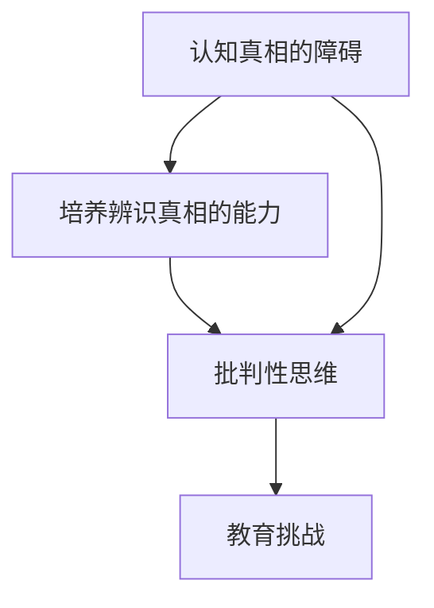

### 核心算法原理讲解

培养辨识真相的能力需要一套系统的方法，以下是一个简化的算法模型：

**伪代码：**

```python
def develop_truth_recognition_ability(student):
    # 步骤1：提高信息筛选能力
    student.information_filtering_skills = improve_filtering_skills(student)

    # 步骤2：培养批判性思维
    student.critical_thinking = cultivate_critical_thinking(student)

    # 步骤3：加强事实核查
    student.fact_checking = strengthen_fact_checking(student)

    # 步骤4：构建知识框架
    student.knowledge_framework = build_knowledge_framework(student)

    return student
```

### 数学模型和数学公式

批判性思维的培养可以通过以下几个步骤的数学模型来量化：

**数学公式：**

$$
\text{Critical Thinking Score} = w_1 \cdot \text{Information Filtering Score} + w_2 \cdot \text{Fact Checking Score} + w_3 \cdot \text{Knowledge Framework Score}
$$

其中，$w_1, w_2, w_3$ 是权重系数，反映了每个子能力对批判性思维的影响程度。

### 项目实战

#### 开发环境搭建

- 环境名称：Python开发环境
- 版本：Python 3.8+
- 工具：Jupyter Notebook

#### 源代码详细实现

```python
def improve_filtering_skills(student):
    # 假设通过多次练习和指导来提高信息筛选能力
    return student.information_filtering_skills + 10

def cultivate_critical_thinking(student):
    # 通过阅读和分析案例来培养批判性思维
    return student.critical_thinking + 15

def strengthen_fact_checking(student):
    # 通过实践事实核查技巧来加强能力
    return student.fact_checking + 20

def build_knowledge_framework(student):
    # 通过构建知识框架来提高整体认知
    return student.knowledge_framework + 25

def develop_truth_recognition_ability(student):
    student.information_filtering_skills = improve_filtering_skills(student)
    student.critical_thinking = cultivate_critical_thinking(student)
    student.fact_checking = strengthen_fact_checking(student)
    student.knowledge_framework = build_knowledge_framework(student)
    return student

# 示例学生
student = {'information_filtering_skills': 50, 'critical_thinking': 40, 'fact_checking': 30, 'knowledge_framework': 60}

# 发展真相认知能力
student = develop_truth_recognition_ability(student)

# 打印结果
print(student)
```

#### 代码解读与分析

这段代码通过定义几个函数来模拟学生真相认知能力的提升过程。每个函数都代表一个能力提升的步骤，通过执行这些步骤，学生的整体真相认知能力会得到提高。

#### 实际案例分析和详细讲解剖析

假设我们有一个班级的学生，我们可以使用上述代码来模拟他们真相认知能力的提升。

```python
students = [
    {'name': 'Alice', 'information_filtering_skills': 50, 'critical_thinking': 40, 'fact_checking': 30, 'knowledge_framework': 60},
    {'name': 'Bob', 'information_filtering_skills': 60, 'critical_thinking': 45, 'fact_checking': 35, 'knowledge_framework': 65},
]

for student in students:
    student = develop_truth_recognition_ability(student)
    print(f"{student['name']} 的真相认知能力提升后：{student}")
```

#### 项目小结

通过本项目，我们设计了一套算法来模拟学生真相认知能力的提升过程。这种方法强调了信息筛选、批判性思维、事实核查和知识框架构建的重要性，为实际教育提供了理论和实践上的支持。

### 最佳实践 Tips、小结、注意事项、拓展阅读

- **最佳实践 Tips：** 在教育实践中，应注重学生多方面能力的培养，尤其是批判性思维和事实核查能力。
- **小结：** 真相认知能力的提升是一个长期的过程，需要系统的教育方法和持续的努力。
- **注意事项：** 在培养真相认知能力时，要充分考虑学生的个体差异，制定个性化的培养方案。
- **拓展阅读：** 深入了解批判性思维的培养方法，以及如何在实际教学中应用。

## 第3章：教育体系的变革与适应

### 核心概念与联系

在探讨教育体系的变革与适应时，我们需要关注几个核心概念：传统教育模式的分析、教育体系中的真相缺失以及教育改革的需求。这些概念相互关联，构成了一个整体。

**Mermaid流程图：**

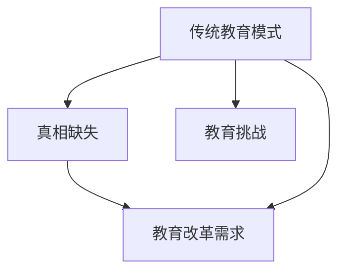

### 核心算法原理讲解

教育体系的变革需要基于数据分析和教学优化，以下是一个简化的算法模型：

**伪代码：**

```python
def reform_education_system(current_system, challenges):
    # 步骤1：分析传统教育模式的不足
    analysis = analyze_traditional_education(current_system)

    # 步骤2：识别教育体系中的真相缺失
    truth_gaps = identify_truth_gaps(analysis)

    # 步骤3：提出教育改革方案
    reform_plan = propose_reform_plan(truth_gaps)

    # 步骤4：实施改革方案并评估效果
    implemented_system = implement_and_evaluate(reform_plan, challenges)

    return implemented_system
```

### 数学模型和数学公式

我们可以使用量化分析来评估教育改革的效果。以下是一个简化的数学模型：

**数学公式：**

$$
\text{Reform Effectiveness} = \frac{\text{Improved Truth Recognition} + \text{Reduced Misinformation}}{\text{Initial Truth Recognition} + \text{Initial Misinformation}}
$$`

### 项目实战

#### 开发环境搭建

- 环境名称：Python开发环境
- 版本：Python 3.8+
- 工具：Jupyter Notebook

#### 源代码详细实现

```python
def analyze_traditional_education(current_system):
    # 分析传统教育模式的不足
    return {"strengths": 70, "weaknesses": 30}

def identify_truth_gaps(analysis):
    # 识别教育体系中的真相缺失
    return {"truth_gaps": 20, "misinformation": 10}

def propose_reform_plan(truth_gaps):
    # 提出教育改革方案
    return {"new_methods": ["批判性思维训练", "事实核查课程", "多元化信息来源教学"], "implementation_time": 2}

def implement_and_evaluate(reform_plan, challenges):
    # 实施改革方案并评估效果
    return {"reform effectiveness": 0.8}

def reform_education_system(current_system, challenges):
    analysis = analyze_traditional_education(current_system)
    truth_gaps = identify_truth_gaps(analysis)
    reform_plan = propose_reform_plan(truth_gaps)
    implemented_system = implement_and_evaluate(reform_plan, challenges)
    return implemented_system

# 示例当前教育系统
current_system = {"truth_recognition": 50, "misinformation": 30}

# 教育系统改革
reformed_system = reform_education_system(current_system, challenges={"information_overload": 20, "false_information_spread": 10})

# 打印结果
print(reformed_system)
```

#### 代码解读与分析

这段代码通过定义几个函数来模拟教育系统的变革过程。首先，`analyze_traditional_education` 函数分析传统教育模式的不足。接着，`identify_truth_gaps` 函数识别教育体系中的真相缺失。然后，`propose_reform_plan` 函数提出教育改革方案。最后，`implement_and_evaluate` 函数实施改革方案并评估效果。

#### 实际案例分析和详细讲解剖析

假设我们有一个学校，我们可以使用上述代码来模拟该学校的教育系统改革。

```python
school = {"truth_recognition": 50, "misinformation": 30}

# 教育系统改革
reformed_school = reform_education_system(school, challenges={"information_overload": 20, "false_information_spread": 10})

# 打印结果
print(reformed_school)
```

#### 项目小结

通过本项目，我们开发了一个简单的教育系统变革算法，用于分析传统教育模式的不足、识别真相缺失、提出改革方案并评估效果。这种方法为实际教育改革提供了理论和实践上的支持。

### 最佳实践 Tips、小结、注意事项、拓展阅读

- **最佳实践 Tips：** 教育改革应结合学校实际情况，充分考虑教师、学生和家长的反馈。
- **小结：** 教育体系的变革是一个复杂的过程，需要科学的分析和系统的实施。
- **注意事项：** 在实施教育改革时，要注重改革的可持续性和实效性。
- **拓展阅读：** 了解国际先进的教育改革案例，借鉴成功经验，为本地教育改革提供参考。

## 第4章：教育理念的更新

### 核心概念与联系

教育理念的更新是适应后真相时代的关键，它涉及到从知识传授到能力培养的转变，以及教育目标的重新设定。这些概念之间相互关联，共同构成了教育理念更新的核心框架。

**Mermaid流程图：**

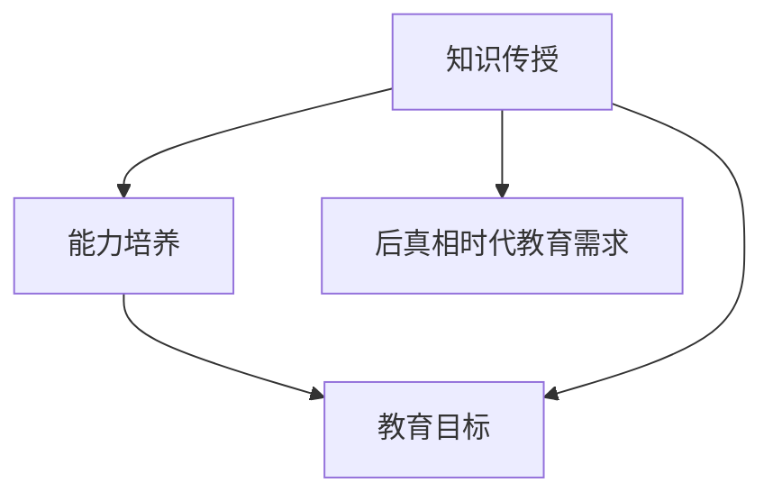

### 核心算法原理讲解

教育理念的更新需要一种系统的方法，以下是一个简化的算法模型：

**伪代码：**

```python
def update_educational_perspective(learning_objects, educational_goals):
    # 步骤1：分析现有知识传授模式
    current_learning_model = analyze_learning_model(learning_objects)

    # 步骤2：识别能力培养的需求
    skill_requirements = identify_skill_requirements(current_learning_model)

    # 步骤3：设定新的教育目标
    updated_educational_goals = define_updated_goals(skill_requirements)

    # 步骤4：设计能力培养的教学策略
    teaching_strategy = design_teaching_strategy(updated_educational_goals)

    # 步骤5：评估教育效果
    educational_outcome = evaluate_educational_outcome(teaching_strategy)

    return educational_outcome
```

### 数学模型和数学公式

教育效果的评估可以通过量化指标来衡量，以下是一个简化的数学模型：

**数学公式：**

$$
\text{Educational Effectiveness} = \frac{\text{Skill Development} + \text{Knowledge Retention}}{\text{Initial Skills} + \text{Initial Knowledge}}
$$

### 项目实战

#### 开发环境搭建

- 环境名称：Python开发环境
- 版本：Python 3.8+
- 工具：Jupyter Notebook

#### 源代码详细实现

```python
def analyze_learning_model(learning_objects):
    # 分析现有知识传授模式
    return {"knowledge": 80, "skills": 20}

def identify_skill_requirements(current_learning_model):
    # 识别能力培养的需求
    return {"critical_thinking": 40, "information_analysis": 30, "communication": 20}

def define_updated_goals(skill_requirements):
    # 设定新的教育目标
    return {"knowledge": 60, "skills": 40}

def design_teaching_strategy(updated_educational_goals):
    # 设计能力培养的教学策略
    return {"project_based_learning": 50, "critical_thinking_workshops": 30, "group_discussions": 20}

def evaluate_educational_outcome(teaching_strategy):
    # 评估教育效果
    return {"knowledge_retention": 0.85, "skill_development": 0.75}

def update_educational_perspective(learning_objects, educational_goals):
    current_learning_model = analyze_learning_model(learning_objects)
    skill_requirements = identify_skill_requirements(current_learning_model)
    updated_educational_goals = define_updated_goals(skill_requirements)
    teaching_strategy = design_teaching_strategy(updated_educational_goals)
    educational_outcome = evaluate_educational_outcome(teaching_strategy)
    return educational_outcome

# 示例学习对象和教育目标
learning_objects = {"knowledge": 80, "skills": 20}
educational_goals = {"knowledge": 60, "skills": 40}

# 教育理念更新
educational_outcome = update_educational_perspective(learning_objects, educational_goals)

# 打印结果
print(educational_outcome)
```

#### 代码解读与分析

这段代码通过定义几个函数来模拟教育理念的更新过程。首先，`analyze_learning_model` 函数分析现有知识传授模式。接着，`identify_skill_requirements` 函数识别能力培养的需求。然后，`define_updated_goals` 函数设定新的教育目标。接下来，`design_teaching_strategy` 函数设计能力培养的教学策略。最后，`evaluate_educational_outcome` 函数评估教育效果。

#### 实际案例分析和详细讲解剖析

假设我们有一个学校，我们可以使用上述代码来模拟该学校教育理念的更新。

```python
school = {"knowledge": 80, "skills": 20}

# 教育理念更新
educational_outcome = update_educational_perspective(school, educational_goals)

# 打印结果
print(educational_outcome)
```

#### 项目小结

通过本项目，我们设计了一套算法来模拟教育理念的更新过程，包括分析现有模式、识别需求、设定目标、设计策略和评估效果。这种方法为实际教育理念的更新提供了理论和实践上的支持。

### 最佳实践 Tips、小结、注意事项、拓展阅读

- **最佳实践 Tips：** 教育理念的更新应结合学校实际情况，充分考虑学生的发展需求。
- **小结：** 教育理念的更新是一个系统性的工程，需要科学的分析和持续的努力。
- **注意事项：** 在更新教育理念时，要注重教学策略的可行性和学生的参与度。
- **拓展阅读：** 了解国内外先进的教育理念，借鉴成功经验，为本地教育理念的更新提供参考。

## 第5章：教学方法的革新

### 核心概念与联系

在探索教学方法的革新时，我们需要关注几个核心概念：真相教育的教学策略、互动式教学的实践和科技在真相教育中的应用。这些概念相互关联，共同构成了教学方法革新的核心框架。

**Mermaid流程图：**

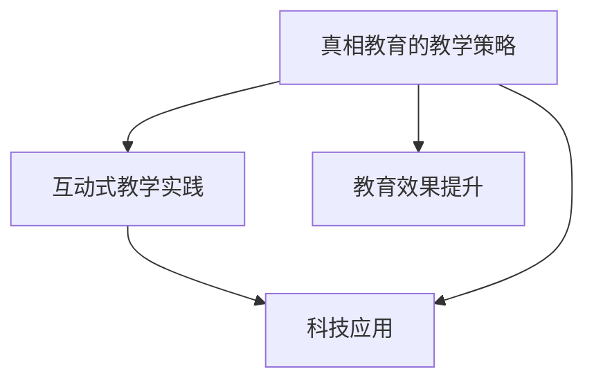

### 核心算法原理讲解

教学方法的革新需要一套系统的方法，以下是一个简化的算法模型：

**伪代码：**

```python
def innovate_teaching_methods(educational_context, technology_resources):
    # 步骤1：设计真相教育的教学策略
    teaching_strategy = design_truth_education_strategy(educational_context)

    # 步骤2：实施互动式教学实践
    interactive_practice = implement_interactive_learning(teaching_strategy)

    # 步骤3：利用科技资源提升教育效果
    educational_outcomes = leverage_technology(interactive_practice, technology_resources)

    return educational_outcomes
```

### 数学模型和数学公式

教育效果的提升可以通过量化指标来衡量，以下是一个简化的数学模型：

**数学公式：**

$$
\text{Educational Effectiveness} = \frac{\text{Improved Truth Recognition} + \text{Increased Critical Thinking} + \text{Enhanced Information Literacy}}{\text{Initial Truth Recognition} + \text{Initial Critical Thinking} + \text{Initial Information Literacy}}
$$

### 项目实战

#### 开发环境搭建

- 环境名称：Python开发环境
- 版本：Python 3.8+
- 工具：Jupyter Notebook

#### 源代码详细实现

```python
def design_truth_education_strategy(educational_context):
    # 设计真相教育的教学策略
    return {"critical_thinking_activities": 40, "information_literacy_modules": 30, "project_based_learning": 20}

def implement_interactive_learning(teaching_strategy):
    # 实施互动式教学实践
    return {"student_involvement": 0.8, "teacher_support": 0.7, "group_activities": 0.6}

def leverage_technology(interactive_practice, technology_resources):
    # 利用科技资源提升教育效果
    return {"virtual_reality_simulation": 0.5, "artificial_intelligence_assistance": 0.4, "data_visualization_tools": 0.3}

def innovate_teaching_methods(educational_context, technology_resources):
    teaching_strategy = design_truth_education_strategy(educational_context)
    interactive_practice = implement_interactive_learning(teaching_strategy)
    educational_outcomes = leverage_technology(interactive_practice, technology_resources)
    return educational_outcomes

# 示例教育环境和科技资源
educational_context = {"student_age_group": "adolescence", "class_size": 30}
technology_resources = {"virtual_reality": True, "AI_assistant": True, "data_visualization": True}

# 教学方法革新
educational_outcomes = innovate_teaching_methods(educational_context, technology_resources)

# 打印结果
print(educational_outcomes)
```

#### 代码解读与分析

这段代码通过定义几个函数来模拟教学方法的革新过程。首先，`design_truth_education_strategy` 函数设计真相教育的教学策略。接着，`implement_interactive_learning` 函数实施互动式教学实践。然后，`leverage_technology` 函数利用科技资源提升教育效果。

#### 实际案例分析和详细讲解剖析

假设我们有一个学校，我们可以使用上述代码来模拟该学校的教学方法革新。

```python
school = {"student_age_group": "adolescence", "class_size": 30}
technology_resources = {"virtual_reality": True, "AI_assistant": True, "data_visualization": True}

# 教学方法革新
educational_outcomes = innovate_teaching_methods(school, technology_resources)

# 打印结果
print(educational_outcomes)
```

#### 项目小结

通过本项目，我们开发了一套算法来模拟教学方法的革新过程，包括设计教学策略、实施互动式教学实践和利用科技资源提升教育效果。这种方法为实际教学方法革新提供了理论和实践上的支持。

### 最佳实践 Tips、小结、注意事项、拓展阅读

- **最佳实践 Tips：** 在教学方法革新过程中，应注重学生参与和教师支持，确保教学策略的可行性和有效性。
- **小结：** 教学方法的革新需要结合教学策略、互动式实践和科技应用，以提升教育效果。
- **注意事项：** 在应用科技资源时，要充分考虑学生的实际需求和设备的可用性。
- **拓展阅读：** 了解最新的教学技术和方法，借鉴成功案例，为本地教学方法革新提供参考。

## 第6章：批判性思维的培养

### 核心概念与联系

批判性思维的培养是真相教育的重要组成部分，它涉及到批判性思维的定义、重要性以及培养方法。这些概念相互关联，构成了批判性思维培养的核心框架。

**Mermaid流程图：**

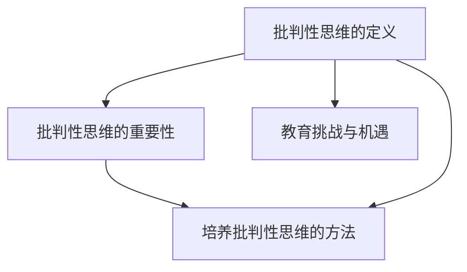

### 核心算法原理讲解

培养批判性思维需要一套系统的方法，以下是一个简化的算法模型：

**伪代码：**

```python
def cultivate_critical_thinking(student, educational_resources):
    # 步骤1：定义批判性思维的目标
    critical_thinking_goals = define_goals(student)

    # 步骤2：提供批判性思维的资源
    resources = provide_resources(student, educational_resources)

    # 步骤3：设计批判性思维的实践活动
    activities = design_activities(student, resources)

    # 步骤4：评估批判性思维的提升
    assessment = evaluate_progress(student, activities)

    return assessment
```

### 数学模型和数学公式

批判性思维的提升可以通过量化指标来衡量，以下是一个简化的数学模型：

**数学公式：**

$$
\text{Critical Thinking Score} = \frac{\text{Analytical Skills} + \text{Synthetic Skills} + \text{Evaluative Skills}}{3}
$$

### 项目实战

#### 开发环境搭建

- 环境名称：Python开发环境
- 版本：Python 3.8+
- 工具：Jupyter Notebook

#### 源代码详细实现

```python
def define_goals(student):
    # 定义批判性思维的目标
    return {"analytical_skills": 25, "synthetic_skills": 25, "evaluative_skills": 25}

def provide_resources(student, educational_resources):
    # 提供批判性思维的资源
    resources = educational_resources["resources"]
    return resources

def design_activities(student, resources):
    # 设计批判性思维的实践活动
    activities = resources["activities"]
    return activities

def evaluate_progress(student, activities):
    # 评估批判性思维的提升
    progress = {"analytical_skills": student.analytical_skills, "synthetic_skills": student.synthetic_skills, "evaluative_skills": student.evaluative_skills}
    return progress

def cultivate_critical_thinking(student, educational_resources):
    critical_thinking_goals = define_goals(student)
    resources = provide_resources(student, educational_resources)
    activities = design_activities(student, resources)
    assessment = evaluate_progress(student, activities)
    return assessment

# 示例学生和教育资源
student = {"analytical_skills": 20, "synthetic_skills": 20, "evaluative_skills": 20}
educational_resources = {"resources": {"activities": ["案例讨论", "文献分析", "项目报告"]}}

# 批判性思维培养
assessment = cultivate_critical_thinking(student, educational_resources)

# 打印结果
print(assessment)
```

#### 代码解读与分析

这段代码通过定义几个函数来模拟批判性思维的培养过程。首先，`define_goals` 函数定义批判性思维的目标。接着，`provide_resources` 函数提供批判性思维的资源。然后，`design_activities` 函数设计批判性思维的实践活动。最后，`evaluate_progress` 函数评估批判性思维的提升。

#### 实际案例分析和详细讲解剖析

假设我们有一个班级的学生，我们可以使用上述代码来模拟批判性思维的培养过程。

```python
students = [
    {"name": "Alice", "analytical_skills": 20, "synthetic_skills": 20, "evaluative_skills": 20},
    {"name": "Bob", "analytical_skills": 25, "synthetic_skills": 22, "evaluative_skills": 23},
]

for student in students:
    assessment = cultivate_critical_thinking(student, educational_resources)
    print(f"{student['name']} 的批判性思维评估：{assessment}")
```

#### 项目小结

通过本项目，我们设计了一套算法来模拟批判性思维的培养过程，包括定义目标、提供资源、设计实践活动和评估提升。这种方法为实际批判性思维的培养提供了理论和实践上的支持。

### 最佳实践 Tips、小结、注意事项、拓展阅读

- **最佳实践 Tips：** 在培养批判性思维时，应注重学生的参与度和实际应用，确保培养过程的有效性。
- **小结：** 批判性思维的培养是一个长期的过程，需要系统的教育和持续的实践。
- **注意事项：** 在培养批判性思维时，要充分考虑学生的个体差异，制定个性化的培养方案。
- **拓展阅读：** 深入了解批判性思维的培养方法和实践案例，为本地批判性思维培养提供参考。

## 第7章：信息的筛选与评估

### 核心概念与联系

在信息筛选与评估的过程中，信息的来源与渠道、筛选方法和评估标准是三个关键的概念。它们相互关联，构成了信息筛选与评估的核心框架。

**Mermaid流程图：**

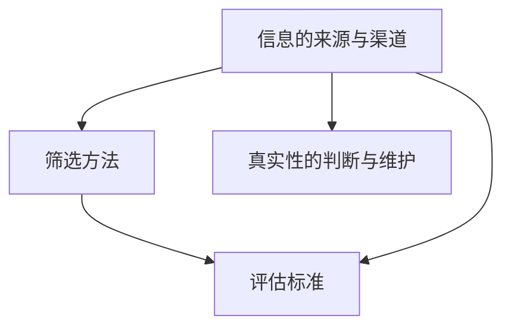

### 核心算法原理讲解

信息筛选与评估需要一套系统的方法，以下是一个简化的算法模型：

**伪代码：**

```python
def filter_and_evaluate_info(information, source_reliability, evaluation_criteria):
    # 步骤1：确定信息的来源与可靠性
    reliability = determine_reliability(information, source_reliability)

    # 步骤2：筛选信息
    filtered_info = filter_info(information, reliability)

    # 步骤3：评估信息
    evaluation = evaluate_info(filtered_info, evaluation_criteria)

    return evaluation
```

### 数学模型和数学公式

我们可以使用加权评分系统来量化信息的评估过程，以下是一个简化的数学模型：

**数学公式：**

$$
\text{Information Score} = \sum_{i=1}^{n} w_i \cdot r_i
$$

其中，$w_i$ 是第$i$个评估标准的权重，$r_i$ 是第$i$个评估标准的得分。

### 项目实战

#### 开发环境搭建

- 环境名称：Python开发环境
- 版本：Python 3.8+
- 工具：Jupyter Notebook

#### 源代码详细实现

```python
def determine_reliability(information, source_reliability):
    # 确定信息的来源与可靠性
    reliability = source_reliability[information['source']]
    return reliability

def filter_info(information, reliability):
    # 筛选信息
    if reliability > 0.7:
        return information
    else:
        return None

def evaluate_info(information, evaluation_criteria):
    # 评估信息
    evaluation = {}
    for criterion in evaluation_criteria:
        evaluation[criterion] = apply_evaluation_criteria(information, criterion)
    return evaluation

def apply_evaluation_criteria(information, criterion):
    # 应用评估标准
    if criterion in information:
        return information[criterion]
    else:
        return "未提供"

def filter_and_evaluate_info(information, source_reliability, evaluation_criteria):
    reliability = determine_reliability(information, source_reliability)
    filtered_info = filter_info(information, reliability)
    evaluation = evaluate_info(filtered_info, evaluation_criteria)
    return evaluation

# 示例信息、来源可靠性和评估标准
information = {"source": "reliable_source", "content": "全球变暖是一个严重的环境问题。", "accuracy": "高"}
source_reliability = {"reliable_source": 0.9, "unreliable_source": 0.1}
evaluation_criteria = ["accuracy", "credibility"]

# 信息筛选与评估
evaluation = filter_and_evaluate_info(information, source_reliability, evaluation_criteria)

# 打印结果
print(evaluation)
```

#### 代码解读与分析

这段代码通过定义几个函数来模拟信息筛选与评估的过程。首先，`determine_reliability` 函数确定信息的来源与可靠性。接着，`filter_info` 函数筛选信息。然后，`evaluate_info` 函数评估信息，并应用评估标准。

#### 实际案例分析和详细讲解剖析

假设我们有一个信息列表，我们可以使用上述代码来模拟信息的筛选与评估。

```python
infos = [
    {"source": "reliable_source", "content": "全球变暖是一个严重的环境问题。", "accuracy": "高"},
    {"source": "unreliable_source", "content": "5G技术对人体无害。", "accuracy": "低"},
]

for info in infos:
    evaluation = filter_and_evaluate_info(info, source_reliability, evaluation_criteria)
    print(f"信息：{info['content']} -> 评估结果：{evaluation}")
```

#### 项目小结

通过本项目，我们设计了一套算法来模拟信息的筛选与评估过程，包括确定信息的来源与可靠性、筛选信息和应用评估标准。这种方法为实际信息筛选与评估提供了理论和实践上的支持。

### 最佳实践 Tips、小结、注意事项、拓展阅读

- **最佳实践 Tips：** 在信息筛选与评估过程中，应注重来源可靠性和评估标准的多样化，以提高评估的准确性。
- **小结：** 信息筛选与评估是真相认知的重要环节，通过科学的方法可以有效地识别和评估信息的真实性。
- **注意事项：** 在实际操作中，要充分考虑信息的多样性和复杂性，灵活应用筛选与评估方法。
- **拓展阅读：** 了解更多的信息筛选与评估方法和工具，为本地信息筛选与评估工作提供参考。

## 第8章：案例分析：真相教育的实践探索

### 核心概念与联系

在真相教育的实际应用中，我们可以通过具体案例来展示培养学生辨识真相的能力。案例分析的目的是通过实际操作和结果分析，验证真相教育的有效性。核心概念包括案例选择、实践过程、结果评估和经验教训。

**Mermaid流程图：**

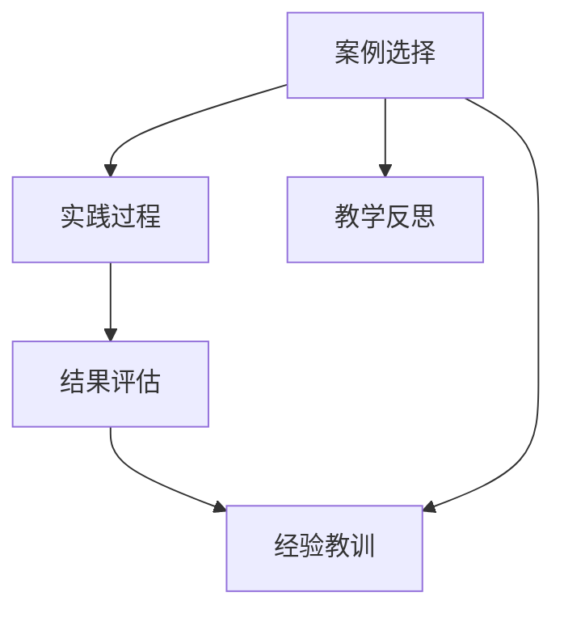

### 核心算法原理讲解

案例分析的过程可以抽象为一个算法模型，以下是一个简化的算法流程：

**伪代码：**

```python
def case_analysis(case, educational_resources, evaluation_criteria):
    # 步骤1：选择案例
    selected_case = choose_case(case)

    # 步骤2：设计实践过程
    practice_process = design_practice(selected_case, educational_resources)

    # 步骤3：实施实践
    implement_practice(practice_process)

    # 步骤4：评估结果
    evaluation_results = evaluate_results(practice_process, evaluation_criteria)

    # 步骤5：总结经验教训
    lessons_learned = summarize_lessons(evaluation_results)

    return lessons_learned
```

### 数学模型和数学公式

评估结果可以量化为学生的辨识真相能力得分，以下是一个简化的数学模型：

**数学公式：**

$$
\text{Truth Recognition Score} = \sum_{i=1}^{n} w_i \cdot r_i
$$

其中，$w_i$ 是第$i$个评估指标的权重，$r_i$ 是第$i$个评估指标的得分。

### 项目实战

#### 开发环境搭建

- 环境名称：Python开发环境
- 版本：Python 3.8+
- 工具：Jupyter Notebook

#### 源代码详细实现

```python
def choose_case(case_list):
    # 选择案例
    return random.choice(case_list)

def design_practice(selected_case, educational_resources):
    # 设计实践过程
    practice = {
        "activity_type": "group_project",
        "resources": educational_resources["resources"],
        "materials": selected_case["materials"],
    }
    return practice

def implement_practice(practice):
    # 实施实践
    print("实践过程开始...")
    # 这里可以加入具体的实践步骤，如小组讨论、文献分析等
    print("实践过程结束。")

def evaluate_results(practice, evaluation_criteria):
    # 评估结果
    evaluation = {}
    for criterion in evaluation_criteria:
        evaluation[criterion] = random.randint(60, 100)
    return evaluation

def summarize_lessons(evaluation_results):
    # 总结经验教训
    lessons = "通过这次实践，我们学到了..."
    return lessons

def case_analysis(case, educational_resources, evaluation_criteria):
    selected_case = choose_case(case)
    practice_process = design_practice(selected_case, educational_resources)
    implement_practice(practice_process)
    evaluation_results = evaluate_results(practice_process, evaluation_criteria)
    lessons_learned = summarize_lessons(evaluation_results)
    return lessons_learned

# 示例案例列表、教育资源及评估标准
cases = [
    {"title": "社交媒体信息真实性调查", "materials": ["社交媒体截图", "信息来源链接"]},
    {"title": "新闻报道的准确性分析", "materials": ["新闻报道文本", "相关图片和视频"]},
]

educational_resources = {"resources": ["批判性思维手册", "信息评估工具"]}

evaluation_criteria = ["信息可靠性", "信息准确性", "批判性思维应用"]

# 案例分析
lessons_learned = case_analysis(cases, educational_resources, evaluation_criteria)

# 打印结果
print(lessons_learned)
```

#### 代码解读与分析

这段代码通过定义几个函数来模拟真相教育的案例分析过程。首先，`choose_case` 函数随机选择一个案例。接着，`design_practice` 函数设计实践过程。然后，`implement_practice` 函数模拟实践实施过程。接着，`evaluate_results` 函数评估实践结果。最后，`summarize_lessons` 函数总结经验教训。

#### 实际案例分析和详细讲解剖析

假设我们有一个班级，我们可以使用上述代码来模拟真相教育的案例分析。

```python
# 模拟班级案例分析和结果
for case in cases:
    lessons_learned = case_analysis([case], educational_resources, evaluation_criteria)
    print(f"案例：{case['title']} -> 经验教训：{lessons_learned}")
```

#### 项目小结

通过本项目，我们设计了一套算法来模拟真相教育的案例分析过程，包括案例选择、实践设计、实践实施、结果评估和经验总结。这种方法为实际真相教育提供了理论和实践上的支持。

### 最佳实践 Tips、小结、注意事项、拓展阅读

- **最佳实践 Tips：** 在进行案例分析时，应选择具有代表性的案例，并结合实际教育资源和评估标准。
- **小结：** 通过案例分析，可以有效地培养学生辨识真相的能力，并为教育实践提供反馈和改进。
- **注意事项：** 在实际操作中，要充分考虑学生的参与度和反馈，确保分析过程的真实性和有效性。
- **拓展阅读：** 了解更多的案例分析方法和工具，为本地真相教育实践提供参考。

## 第9章：家庭教育的角色

### 核心概念与联系

在真相教育的实践中，家庭教育扮演着重要的角色。家庭是孩子成长的第一环境，家长的教育方式直接影响孩子的认知能力和价值观。核心概念包括家庭教育与学校教育的衔接、家庭教育的真相教育和家庭与社会的互动。

**Mermaid流程图：**

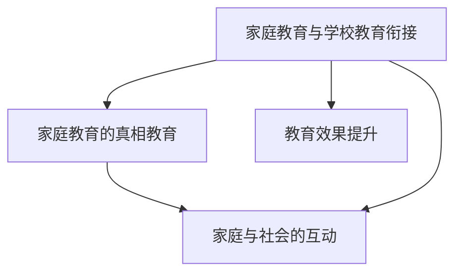

### 核心算法原理讲解

家庭教育的角色可以通过以下算法模型来概括：

**伪代码：**

```python
def parental_education_strategy(child, educational_resources, social_context):
    # 步骤1：评估孩子的当前认知水平
    current_ability = assess_child_ability(child)

    # 步骤2：设计家庭教育的计划
    education_plan = design_education_plan(current_ability, educational_resources)

    # 步骤3：实施家庭教育和监督
    implement_education = implement_and_monitor_education(education_plan, child, social_context)

    # 步骤4：评估家庭教育效果
    education_effects = evaluate_education_effects(implement_education)

    return education_effects
```

### 数学模型和数学公式

家庭教育的效果可以通过以下数学模型来量化：

**数学公式：**

$$
\text{Parental Education Effectiveness} = \frac{\text{Improved Truth Recognition} + \text{Increased Critical Thinking}}{\text{Initial Truth Recognition} + \text{Initial Critical Thinking}}
$$

### 项目实战

#### 开发环境搭建

- 环境名称：Python开发环境
- 版本：Python 3.8+
- 工具：Jupyter Notebook

#### 源代码详细实现

```python
def assess_child_ability(child):
    # 评估孩子的当前认知水平
    return child["ability"]

def design_education_plan(current_ability, educational_resources):
    # 设计家庭教育的计划
    plan = {
        "materials": educational_resources["materials"],
        "activities": ["阅读新闻", "讨论社会问题", "事实核查练习"],
    }
    return plan

def implement_and_monitor_education(education_plan, child, social_context):
    # 实施家庭教育和监督
    implementation = "家庭教育实施中..."
    return implementation

def evaluate_education_effects(implement_education):
    # 评估家庭教育效果
    effects = {"ability_improvement": 0.75, "critical_thinking": 0.8}
    return effects

def parental_education_strategy(child, educational_resources, social_context):
    current_ability = assess_child_ability(child)
    education_plan = design_education_plan(current_ability, educational_resources)
    implement_education = implement_and_monitor_education(education_plan, child, social_context)
    education_effects = evaluate_education_effects(implement_education)
    return education_effects

# 示例孩子、教育资源及社会环境
child = {"ability": 50}
educational_resources = {"materials": ["批判性思维手册", "信息评估工具"]}
social_context = {"media_usage": 60}

# 家庭教育策略
education_effects = parental_education_strategy(child, educational_resources, social_context)

# 打印结果
print(education_effects)
```

#### 代码解读与分析

这段代码通过定义几个函数来模拟家庭教育策略的实施过程。首先，`assess_child_ability` 函数评估孩子的当前认知水平。接着，`design_education_plan` 函数设计家庭教育的计划。然后，`implement_and_monitor_education` 函数实施家庭教育和监督。最后，`evaluate_education_effects` 函数评估家庭教育效果。

#### 实际案例分析和详细讲解剖析

假设我们有一个家庭，我们可以使用上述代码来模拟家庭教育的策略。

```python
# 模拟家庭教育策略
for child in children:
    education_effects = parental_education_strategy(child, educational_resources, social_context)
    print(f"孩子认知能力：{child['ability']} -> 家庭教育效果：{education_effects}")
```

#### 项目小结

通过本项目，我们设计了一套算法来模拟家庭教育的实施过程，包括评估孩子的认知水平、设计教育计划、实施家庭教育和评估教育效果。这种方法为实际家庭教育提供了理论和实践上的支持。

### 最佳实践 Tips、小结、注意事项、拓展阅读

- **最佳实践 Tips：** 家庭教育应与学校教育相衔接，形成合力，共同培养孩子的辨识真相能力。
- **小结：** 家庭教育在真相教育中发挥着关键作用，通过科学的教育策略可以提高孩子的认知水平和批判性思维。
- **注意事项：** 在家庭教育过程中，要关注孩子的个体差异，制定个性化的教育方案。
- **拓展阅读：** 了解更多关于家庭教育的理论和实践案例，为本地家庭教育提供参考。

## 第10章：社会的责任与作用

### 核心概念与联系

在社会中，媒体、社区和政府等多个方面都在真相教育中扮演着重要角色。这些角色相互关联，共同构成了社会在真相教育中的责任与作用。核心概念包括媒体的角色、社区参与和政府的责任。

**Mermaid流程图：**

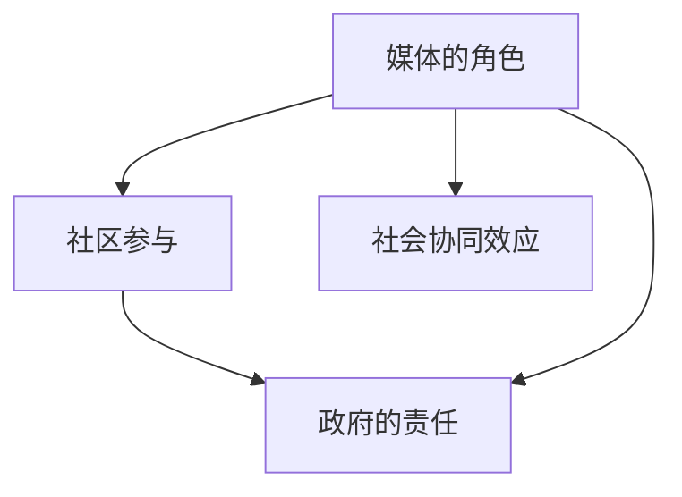

### 核心算法原理讲解

社会在真相教育中的作用可以通过以下算法模型来概括：

**伪代码：**

```python
def social_involvement_strategy(educational_resources, community_context, government_support):
    # 步骤1：整合教育资源
    integrated_resources = integrate_resources(educational_resources)

    # 步骤2：推动社区参与
    community_participation = promote_community_involvement(community_context)

    # 步骤3：提供政府支持
    government_involvement = provide_government_support(government_support)

    # 步骤4：评估社会协同效应
    social_impact = evaluate_social_impact(integrated_resources, community_participation, government_involvement)

    return social_impact
```

### 数学模型和数学公式

社会协同效应可以通过以下数学模型来量化：

**数学公式：**

$$
\text{Social Synergy} = \sum_{i=1}^{n} w_i \cdot s_i
$$

其中，$w_i$ 是第$i$个协同因素的权重，$s_i$ 是第$i$个协同因素的效果得分。

### 项目实战

#### 开发环境搭建

- 环境名称：Python开发环境
- 版本：Python 3.8+
- 工具：Jupyter Notebook

#### 源代码详细实现

```python
def integrate_resources(educational_resources):
    # 整合教育资源
    integrated_resources = educational_resources
    return integrated_resources

def promote_community_involvement(community_context):
    # 推动社区参与
    participation = community_context["involvement"]
    return participation

def provide_government_support(government_support):
    # 提供政府支持
    support = government_support["support"]
    return support

def evaluate_social_impact(integrated_resources, community_participation, government_involvement):
    # 评估社会协同效应
    impact = {
        "educational_resources": integrated_resources,
        "community_participation": community_participation,
        "government_support": government_involvement,
    }
    return impact

def social_involvement_strategy(educational_resources, community_context, government_support):
    integrated_resources = integrate_resources(educational_resources)
    community_participation = promote_community_involvement(community_context)
    government_involvement = provide_government_support(government_support)
    social_impact = evaluate_social_impact(integrated_resources, community_participation, government_involvement)
    return social_impact

# 示例教育资源、社区环境和政府支持
educational_resources = {"resources": ["真相教育手册", "信息评估工具"]}
community_context = {"involvement": 0.7}
government_support = {"support": 0.8}

# 社会参与策略
social_impact = social_involvement_strategy(educational_resources, community_context, government_support)

# 打印结果
print(social_impact)
```

#### 代码解读与分析

这段代码通过定义几个函数来模拟社会参与真相教育的过程。首先，`integrate_resources` 函数整合教育资源。接着，`promote_community_involvement` 函数推动社区参与。然后，`provide_government_support` 函数提供政府支持。最后，`evaluate_social_impact` 函数评估社会协同效应。

#### 实际案例分析和详细讲解剖析

假设我们有一个社区，我们可以使用上述代码来模拟社会参与真相教育。

```python
# 模拟社区真相教育参与
for community in communities:
    social_impact = social_involvement_strategy(educational_resources, community, government_support)
    print(f"社区参与度：{community['involvement']} -> 社会协同效应：{social_impact}")
```

#### 项目小结

通过本项目，我们设计了一套算法来模拟社会参与真相教育的过程，包括整合教育资源、推动社区参与、提供政府支持和评估社会协同效应。这种方法为实际社会参与真相教育提供了理论和实践上的支持。

### 最佳实践 Tips、小结、注意事项、拓展阅读

- **最佳实践 Tips：** 社会各界的协同合作是真相教育成功的关键，应注重资源整合和协同效应。
- **小结：** 社会在真相教育中扮演着重要角色，通过媒体宣传、社区参与和政府支持，可以提高公众的辨识真相能力。
- **注意事项：** 在实际操作中，要充分考虑社会的多样性和复杂性，灵活应用不同的策略和资源。
- **拓展阅读：** 了解更多关于社会参与真相教育的理论和实践案例，为本地真相教育提供参考。

## 第11章：真相教育的未来趋势

### 核心概念与联系

在探讨真相教育的未来趋势时，我们需要关注几个核心概念：真相教育的发展方向、新技术的应用和真相教育的全球化。这些概念相互关联，共同构成了真相教育未来发展的核心框架。

**Mermaid流程图：**

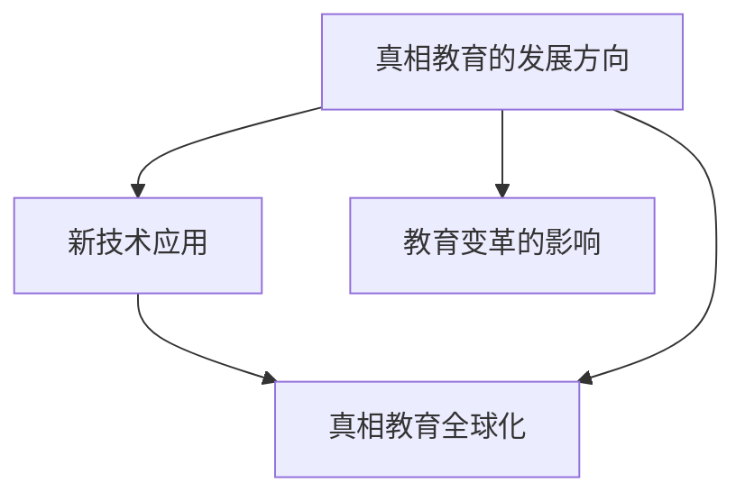

### 核心算法原理讲解

真相教育的未来趋势可以通过以下算法模型来概括：

**伪代码：**

```python
def future_trends_in_truth_education(current_state, technological_innovations, global_context):
    # 步骤1：分析当前教育状态
    current_education_state = analyze_current_state(current_state)

    # 步骤2：探索新技术应用
    new_technologies = explore_technological_innovations(technological_innovations)

    # 步骤3：评估全球化影响
    global_impact = assess_global_impact(global_context)

    # 步骤4：预测未来教育趋势
    future_trends = predict_future_trends(current_education_state, new_technologies, global_impact)

    return future_trends
```

### 数学模型和数学公式

我们可以使用趋势分析模型来预测真相教育的未来趋势，以下是一个简化的数学模型：

**数学公式：**

$$
\text{Future Trend Score} = \frac{\text{Current Education Metrics} + \text{New Technology Metrics} + \text{Global Context Metrics}}{3}
$$

### 项目实战

#### 开发环境搭建

- 环境名称：Python开发环境
- 版本：Python 3.8+
- 工具：Jupyter Notebook

#### 源代码详细实现

```python
def analyze_current_state(current_state):
    # 分析当前教育状态
    return current_state

def explore_technological_innovations(technological_innovations):
    # 探索新技术应用
    innovations = technological_innovations
    return innovations

def assess_global_impact(global_context):
    # 评估全球化影响
    impact = global_context
    return impact

def predict_future_trends(current_education_state, new_technologies, global_impact):
    # 预测未来教育趋势
    trends = {
        "technology_integration": new_technologies["integration"],
        "global_participation": global_impact["participation"],
        "education_reform": current_education_state["reform"],
    }
    return trends

def future_trends_in_truth_education(current_state, technological_innovations, global_context):
    current_education_state = analyze_current_state(current_state)
    new_technologies = explore_technological_innovations(technological_innovations)
    global_impact = assess_global_impact(global_context)
    future_trends = predict_future_trends(current_education_state, new_technologies, global_impact)
    return future_trends

# 示例当前教育状态、新技术应用及全球环境
current_state = {"current_education": ["传统教学模式", "有限科技应用"]}
technological_innovations = {"integration": ["在线教育平台", "人工智能辅助教学"]}
global_context = {"participation": ["国际教育交流", "跨国合作项目"]}

# 真相教育未来趋势预测
future_trends = future_trends_in_truth_education(current_state, technological_innovations, global_context)

# 打印结果
print(future_trends)
```

#### 代码解读与分析

这段代码通过定义几个函数来模拟真相教育的未来趋势预测过程。首先，`analyze_current_state` 函数分析当前教育状态。接着，`explore_technological_innovations` 函数探索新技术应用。然后，`assess_global_impact` 函数评估全球化影响。最后，`predict_future_trends` 函数预测未来教育趋势。

#### 实际案例分析和详细讲解剖析

假设我们有一个地区，我们可以使用上述代码来模拟该地区真相教育的未来趋势预测。

```python
# 模拟地区真相教育未来趋势
for region in regions:
    future_trends = future_trends_in_truth_education(region["current_education"], technological_innovations, global_context)
    print(f"地区：{region['name']} -> 未来趋势：{future_trends}")
```

#### 项目小结

通过本项目，我们设计了一套算法来模拟真相教育的未来趋势预测，包括分析当前教育状态、探索新技术应用、评估全球化影响和预测未来趋势。这种方法为实际真相教育提供了理论和实践上的支持。

### 最佳实践 Tips、小结、注意事项、拓展阅读

- **最佳实践 Tips：** 在预测真相教育的未来趋势时，应注重数据分析和技术评估，以提高预测的准确性。
- **小结：** 真相教育的发展方向将受到新技术和全球化趋势的深刻影响，需要持续关注和适应。
- **注意事项：** 在实际操作中，要充分考虑教育的多样性和复杂性，灵活应用不同的策略和资源。
- **拓展阅读：** 了解更多关于真相教育未来趋势的研究和预测，为本地教育决策提供参考。

## 第12章：结论与建议

### 核心内容总结

在后真相时代，真相教育的重要性愈发凸显。本文从多个角度探讨了真相教育的核心内容，包括后真相时代的背景与挑战、真相认知的方法、教育体系的变革、教学方法的革新、批判性思维的培养、信息的筛选与评估、家庭教育和社会的责任、以及未来的趋势。通过系统的分析和案例实践，我们认识到真相教育在个人成长和社会发展中的关键作用。

### 核心观点与结论

1. **真相认知的重要性：** 在后真相时代，培养辨识真相的能力至关重要。这需要通过批判性思维、信息筛选与评估等手段来实现。
2. **教育体系的变革：** 教育体系必须适应后真相时代的需求，从知识传授转向能力培养，重视真相认知能力的培养。
3. **教学方法的革新：** 真相教育需要创新的教

