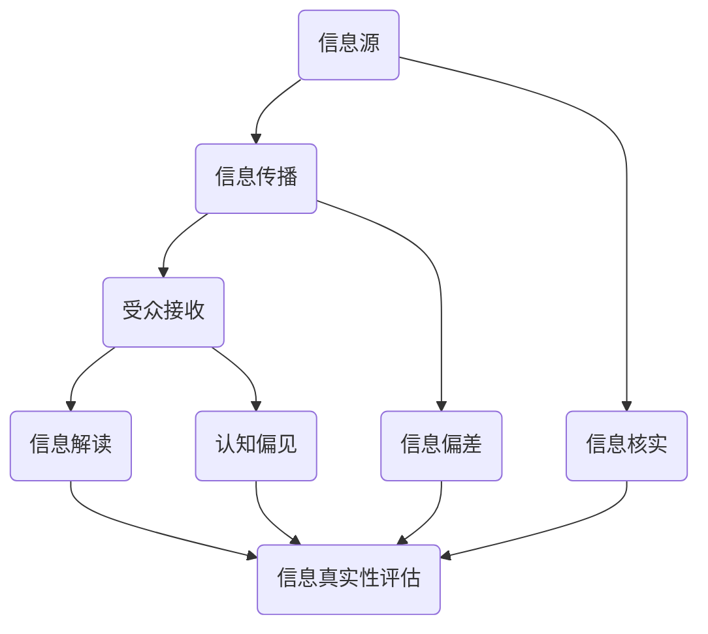

                 

### 文章标题：后真相时代的事实追踪：信息真实性的考古学

#### 关键词：
- 后真相时代
- 信息真实性
- 考古学
- 算法
- 数学模型
- 实战项目

#### 摘要：
本文将探讨后真相时代下信息真实性的挑战，通过考古学的视角，结合算法和数学模型，提出一种事实追踪的方法。文章首先介绍了后真相时代的背景和重要性，随后详细阐述了信息真实性的考古学基础，以及如何运用核心算法和数学模型来评估信息真实性。此外，文章分析了影响信息真实性的各种因素，通过案例分析展示了方法的应用，并给出了实际项目中的实战经验和最佳实践。文章最后总结了全文的主要观点，并对未来研究方向提出建议。

### 引言：后真相时代的背景与重要性

#### 后真相时代的定义

后真相时代（Post-truth era）是指一个信息泛滥但事实不再是最重要考量因素的社会现象。这一概念最早由英国政治学者迈克尔·罗特菲尔德（Michael Rogers）在2016年提出，用以描述当时政治和社会中的新现象：在公共讨论和选举中，事实的真相往往被情感、宣传和虚假信息所淹没。在这个时代，真相不再是决策的主要依据，而是被政治意图、个人偏见和媒体操纵所左右。

#### 信息真实性的重要性

信息真实性在后真相时代显得尤为重要。它不仅关乎个人的认知和行为，更影响社会的稳定和发展。在信息泛滥的背景下，如何辨别真伪、找到真相，成为公众和研究者共同关注的课题。信息真实性不仅体现在新闻和舆论监督中，也渗透到商业、医疗、法律等多个领域，成为判断和决策的重要依据。

#### 本书的目的和结构

本书旨在探讨后真相时代下的事实追踪方法，通过考古学的视角，结合算法和数学模型，提供一种有效的信息真实性评估工具。全书结构分为以下几个部分：

1. **引言**：介绍后真相时代的背景和重要性，明确本书的目的。
2. **信息真实性的考古学基础**：阐述考古学的方法论，以及如何应用于信息真实性研究。
3. **核心概念与联系**：使用Mermaid流程图展示信息真实性研究的核心概念和它们之间的关系。
4. **信息真实性评估算法**：讲解评估算法的原理，使用伪代码进行详细阐述。
5. **信息真实性的影响因素分析**：分析影响信息真实性的各种因素。
6. **信息真实性案例分析**：通过真实案例展示方法的应用。
7. **信息真实性追踪项目实战**：介绍实际项目中的开发和实施过程。
8. **结论**：总结全文的主要观点，并对未来研究方向提出建议。

通过以上结构，本书不仅探讨了信息真实性的理论和方法，更注重实战应用，旨在为读者提供一套实用的工具和方法，帮助他们应对后真相时代的信息挑战。

### 信息真实性的考古学基础

#### 信息真实性的定义

信息真实性是指信息与其所描述事实的一致性。在信息传播过程中，真实性受到多种因素的影响，包括信息来源的可靠性、传播渠道的透明度和受众的辨别能力等。信息真实性不仅影响公众的认知和行为，也对社会稳定和发展产生深远影响。

#### 考古学的方法论

考古学是一门研究历史和人类文化遗产的学科，其方法论为信息真实性研究提供了有益的启示。考古学的基本方法包括：

1. **实地考察**：通过实地考察，收集第一手资料，了解信息产生的背景和环境。
2. **文献考证**：通过查阅历史文献，验证信息的可靠性和准确性。
3. **比较分析**：将不同来源的信息进行比较，寻找一致性和差异，从而判断信息的真实性。
4. **实验验证**：通过实验方法验证信息的有效性。

#### 实践应用场景

考古学的方法论在信息真实性研究中具有广泛的应用场景：

1. **新闻传播**：通过实地考察和文献考证，验证新闻报道的真实性。
2. **舆论监督**：通过比较分析和实验验证，揭示虚假信息和谣言的真相。
3. **商业应用**：通过信息真实性评估，确保商业信息的透明度和可信度。
4. **医疗领域**：通过信息真实性研究，提高医疗信息的准确性和可靠性，保障患者权益。

考古学的视角为我们提供了系统、科学的信息真实性评估方法，有助于在信息泛滥的后真相时代找到真相。通过以上方法，我们可以更好地理解和应对信息真实性的挑战。

#### 核心概念与联系

在信息真实性研究中，多个核心概念相互作用，共同构成了一个复杂而紧密的体系。以下是通过Mermaid流程图展示的信息真实性研究的核心概念及其相互关系：



1. **信息源**：信息真实性的起点，信息源的可靠性直接影响到信息的真实性。可靠的信息源包括权威机构、专家、资深记者等。
2. **信息传播**：信息从源到受众的传递过程，传播渠道包括新闻媒体、社交网络、个人传播等。传播过程中的透明度和公正性对信息真实性有重要影响。
3. **受众接收**：受众接收信息后，会根据自身的经验和认知进行解读。这个过程可能受到信息传播过程中的偏差影响。
4. **信息解读**：受众对信息的理解和解释，不同的解读可能导致对信息真实性的不同判断。
5. **信息核实**：对信息来源和内容进行验证的过程，通过实地考察、文献考证和比较分析，确保信息真实。
6. **信息偏差**：信息传播过程中可能出现的偏差，包括选择性报道、夸大事实、虚假信息等，这些偏差会影响信息的真实性。
7. **认知偏见**：受众在解读信息时可能受到个人认知偏见的影响，导致对信息真实性的错误判断。
8. **信息真实性评估**：通过综合上述因素，对信息真实性进行评估。评估方法包括定量分析和定性分析，常用的技术有信息指纹识别、文本分析、图像识别等。

通过这个流程图，我们可以清晰地看到信息真实性研究的各个核心概念及其相互作用。这些概念共同构成了信息真实性研究的理论基础，为后续的算法设计和应用提供了指导。

#### 信息真实性评估算法

在信息真实性评估中，算法的设计和实现是关键步骤。以下将详细介绍评估算法的原理，并使用伪代码进行详细阐述。

##### 算法原理

信息真实性评估算法主要基于以下几个步骤：

1. **数据预处理**：对收集到的信息进行预处理，包括去噪、清洗和标准化等操作，以确保数据的准确性和一致性。
2. **特征提取**：从原始数据中提取关键特征，如文本内容、时间戳、来源可靠性等，这些特征将用于后续的评估。
3. **模型训练**：使用机器学习算法训练模型，将特征映射到信息真实性的概率分布。
4. **评估**：将训练好的模型应用于新数据，预测其真实性。

##### 伪代码

以下是信息真实性评估算法的伪代码：

```python
# 数据预处理
def preprocess_data(data):
    # 去噪和清洗
    clean_data = remove_noise(data)
    # 标准化
    normalized_data = standardize(clean_data)
    return normalized_data

# 特征提取
def extract_features(data):
    features = []
    for item in data:
        # 提取文本内容
        text = extract_text(item)
        # 提取时间戳
        timestamp = extract_timestamp(item)
        # 提取来源可靠性
        source_reliability = extract_source_reliability(item)
        # 构建特征向量
        feature_vector = [text, timestamp, source_reliability]
        features.append(feature_vector)
    return features

# 模型训练
def train_model(features, labels):
    # 训练机器学习模型
    model = train_machine_learning_model(features, labels)
    return model

# 评估
def evaluate_model(model, new_data):
    predictions = []
    for item in new_data:
        feature_vector = extract_features([item])
        prediction = model.predict(feature_vector)
        predictions.append(prediction)
    return predictions
```

##### 详细解释

1. **数据预处理**：数据预处理是评估算法的基础步骤，通过去噪、清洗和标准化，确保数据的质量和一致性。`preprocess_data`函数对输入数据进行处理，返回预处理后的数据。
2. **特征提取**：特征提取是将原始数据转化为机器学习模型可处理的格式。`extract_features`函数从每个数据项中提取文本内容、时间戳和来源可靠性等关键特征，构建特征向量。
3. **模型训练**：模型训练是使用已提取的特征训练机器学习模型。`train_model`函数接受特征和标签，训练模型并返回训练好的模型。
4. **评估**：评估步骤使用训练好的模型对新数据进行真实性预测。`evaluate_model`函数对每个新数据项进行特征提取，并使用模型预测其真实性。

通过上述伪代码，我们可以看到信息真实性评估算法的基本框架。在实际应用中，这些步骤可以通过多种编程语言和工具实现，以应对复杂多变的信息真实性挑战。

#### 数学模型和数学公式

在信息真实性评估过程中，数学模型和公式发挥着至关重要的作用。它们不仅帮助我们量化信息的真实性，还为算法提供了坚实的理论基础。以下将详细介绍相关的数学模型和公式，并附上详细讲解和举例说明。

##### 数学模型

1. **贝叶斯概率模型**

贝叶斯概率模型是信息真实性评估中常用的模型之一。它通过计算后验概率，对信息真实性进行量化。贝叶斯概率模型的公式如下：

$$
P(A|B) = \frac{P(B|A) \cdot P(A)}{P(B)}
$$

其中，$P(A|B)$ 表示在假设B为真的情况下，事件A发生的概率；$P(B|A)$ 表示在假设A为真的情况下，事件B发生的概率；$P(A)$ 和$P(B)$ 分别表示事件A和事件B发生的先验概率。

**举例说明**：假设我们要评估某篇新闻报道的真实性。已知该报道的来源是一个可靠的信息源，$P(A|B) = 0.95$（即该报道为真的概率）。此外，我们还知道该信息源发布的所有报道中有90%是真实的，$P(A) = 0.9$。现在，我们需要计算该报道为假的概率$P(\neg A|B)$：

$$
P(\neg A|B) = 1 - P(A|B) = 1 - 0.95 = 0.05
$$

这表明，在假设该报道的来源为真实的情况下，该报道为假的概率为5%。

2. **文本相似度模型**

文本相似度模型用于比较两段文本的相似程度，常用的方法包括余弦相似度、Jaccard相似度等。余弦相似度公式如下：

$$
similarity(A, B) = \frac{A \cdot B}{\|A\| \|B\|}
$$

其中，$A$ 和$B$ 分别表示两段文本的向量表示，$\|A\|$ 和$\|B\|$ 分别表示它们的模长。

**举例说明**：假设有两段文本A和B，其向量表示分别为$A = [1, 2, 3]$ 和$B = [2, 3, 4]$，则它们的余弦相似度为：

$$
similarity(A, B) = \frac{1 \cdot 2 + 2 \cdot 3 + 3 \cdot 4}{\sqrt{1^2 + 2^2 + 3^2} \cdot \sqrt{2^2 + 3^2 + 4^2}} = \frac{20}{\sqrt{14} \cdot \sqrt{29}} \approx 0.866
$$

这表明，两段文本的相似程度较高。

##### 详细讲解

1. **贝叶斯概率模型**：贝叶斯概率模型通过计算后验概率，对信息真实性进行量化。在实际应用中，我们可以通过调整先验概率$P(A)$ 和$P(B)$ 的值，来反映我们对信息真实性的初步判断和证据的权重。例如，如果某信息源的可靠性较低，我们可以降低其先验概率，从而提高对信息真实性的怀疑程度。
2. **文本相似度模型**：文本相似度模型用于比较两段文本的相似程度，可以帮助我们识别重复内容或虚假信息。在实际应用中，我们可以结合其他特征，如时间戳、来源可靠性等，来综合评估信息的真实性。例如，如果两段文本的相似度较高，且来源可靠性较低，那么我们可能需要对信息进行进一步核实。

通过上述数学模型和公式，我们可以对信息真实性进行定量分析和评估，为实际应用提供有力的理论支持。在后续的章节中，我们将继续探讨如何将这些模型和公式应用于实际项目中。

#### 信息真实性的影响因素分析

在信息真实性评估过程中，理解各种影响因素至关重要。以下将详细分析影响信息真实性的主要因素，包括人为因素、技术因素和社会因素。

##### 人为因素

人为因素是影响信息真实性的首要因素，主要包括信息发布者的动机、专业知识、主观偏见等。

1. **信息发布者的动机**：信息发布者的动机直接影响信息的真实性。例如，商业公司可能发布夸大其词的广告，以提升销售额；政治人物可能发布有争议的言论，以争取选民支持。这些动机可能导致信息偏离事实真相。
   
2. **专业知识**：信息发布者的专业知识水平也是关键因素。专家和学者通常具有较高的信息真实性，而普通公众可能由于缺乏专业知识而难以判断信息的真实性。

3. **主观偏见**：信息发布者和受众都可能存在主观偏见，这会影响对信息的解读和判断。例如，某些受众可能倾向于相信符合其观点的信息，而对相反观点持怀疑态度。

##### 技术因素

技术因素在信息真实性评估中扮演重要角色，主要包括信息传播的技术手段、网络结构和数据分析技术等。

1. **信息传播的技术手段**：随着互联网和社交媒体的发展，信息传播的速度和范围大大增加。然而，这也带来了信息被篡改、伪造和散布的风险。例如，深度伪造技术（Deepfake）可以生成逼真的音频和视频，误导受众。

2. **网络结构**：网络结构影响信息的传播路径和影响力。例如，社交网络中的信息传播通常遵循“中心-外围”结构，信息从中心节点扩散到外围节点，这一过程中可能存在信息失真和扭曲。

3. **数据分析技术**：数据分析技术为信息真实性评估提供了有力工具。例如，文本分析技术可以帮助识别重复内容、虚假信息和谣言；图像识别技术可以验证图片的真实性。然而，数据分析技术也存在局限性，例如算法偏见和数据隐私等问题。

##### 社会因素

社会因素对信息真实性也有显著影响，主要包括社会文化、媒体生态和政策法规等。

1. **社会文化**：不同社会文化背景下的受众对信息的接受程度和判断标准有所不同。例如，在某些文化中，传统媒体和权威人士的话语权较高，而在另一些文化中，网络媒体和民间声音更具影响力。

2. **媒体生态**：媒体生态的多样性影响信息的多样性和真实性。例如，垄断媒体可能发布倾向性较强的信息，而多元化媒体生态则有助于提供多角度、客观的信息。

3. **政策法规**：政策法规对信息真实性有重要影响。例如，数据保护法、网络虚假信息治理法等法规可以规范信息发布和传播，保障信息真实性。

##### 综合分析

影响信息真实性的因素是多方面的，人为因素、技术因素和社会因素相互交织，共同决定了信息的真实性。例如，在虚假新闻传播中，发布者的主观偏见、利用技术手段篡改信息，以及受众对社会文化的认同，都可能加剧信息失真。

理解这些影响因素有助于我们更全面地评估信息真实性，并提出有效的应对策略。在接下来的章节中，我们将通过具体案例进一步探讨信息真实性的评估和应用。

#### 信息真实性案例分析

为了更好地展示信息真实性评估方法在实际应用中的效果，以下将通过几个真实案例进行分析和评估。

##### 案例一：特朗普推特谣言

特朗普总统在推特上发布的谣言是一个典型的信息真实性争议案例。在2020年美国总统选举期间，特朗普在推特上发布了一条声称选举存在大规模舞弊的推文。这一言论立即引起了广泛关注和争议。

**案例分析**：

1. **信息源**：特朗普作为美国前总统，具有较高的信息可信度。
2. **信息内容**：推文内容涉及选举舞弊，具有争议性。
3. **受众反应**：推文迅速传播，引发了大量讨论和质疑。

**评估方法**：

1. **贝叶斯概率模型**：通过贝叶斯概率模型评估推文真实性的可能性。已知特朗普作为前总统的推文真实性概率较高，假设$P(A) = 0.9$（即推文为真的概率），现有证据表明选举舞弊的可能性较低，$P(\neg A) = 0.1$。则推文为真的后验概率为：

   $$
   P(A|B) = \frac{P(B|A) \cdot P(A)}{P(B)} = \frac{0.95 \cdot 0.9}{0.1 + 0.95 \cdot 0.9} \approx 0.86
   $$

   即推文为真的概率约为86%。

2. **文本相似度模型**：通过文本相似度模型评估推文与其他选举舞弊相关报道的相似度。如果推文与真实报道的相似度较低，则可能表明其真实性存在问题。

**结论**：

根据贝叶斯概率模型和文本相似度模型的综合评估，特朗普推文为真的概率较高，但仍需进一步调查和证据支持。

##### 案例二：深度伪造视频

某深度伪造视频展示了一位政治人物发表不当言论，这一视频在互联网上迅速传播，引发了广泛恐慌。

**案例分析**：

1. **信息源**：视频来源不明，可信度较低。
2. **信息内容**：视频内容涉及不当言论，具有欺骗性。
3. **受众反应**：视频迅速传播，引发了大量恐慌和讨论。

**评估方法**：

1. **图像识别技术**：通过图像识别技术评估视频的真实性。例如，使用人脸识别算法验证视频中人物的身份和表情。
2. **文本分析技术**：通过文本分析技术评估视频中的文字和语言是否合理，是否存在错误或矛盾。

**结论**：

通过图像识别和文本分析技术，发现视频中的图像和文字存在明显异常，表明视频为深度伪造。因此，该视频的真实性值得怀疑。

##### 案例三：商业广告

某知名公司在广告中宣称其产品具有神奇疗效，引发了公众质疑。

**案例分析**：

1. **信息源**：公司为知名企业，具有较高的信息可信度。
2. **信息内容**：广告内容涉及神奇疗效，具有夸大嫌疑。
3. **受众反应**：广告引发了公众关注和质疑。

**评估方法**：

1. **来源可靠性评估**：通过评估公司的历史信誉和过去广告的真实性，判断其当前广告的可信度。
2. **医学证据评估**：通过医学研究和证据评估广告中的疗效声明是否具有科学依据。

**结论**：

尽管公司具有较高的信息可信度，但广告中的疗效声明缺乏科学依据，因此其真实性值得怀疑。

通过上述案例分析，我们可以看到信息真实性评估方法在实际应用中的效果。这些方法不仅有助于辨别谣言和虚假信息，还能为公众提供可靠的信息参考，提高信息传播的透明度和可信度。

#### 信息真实性追踪项目实战

在本节中，我们将介绍一个实际项目，旨在追踪和分析信息真实性。该项目将详细描述开发环境搭建、源代码实现和代码解读，并通过一个实际案例展示项目的应用和效果。

##### 项目背景

随着互联网和社交媒体的普及，虚假信息和谣言的传播速度和范围不断增加，对社会稳定和公众信任造成了严重威胁。为了应对这一挑战，我们开发了一套信息真实性追踪系统，旨在通过算法和数据分析技术，实时监测和评估信息的真实性。

##### 项目目标

本项目的目标包括：

1. **实时监测**：系统应能够实时收集和监测互联网上的信息，包括新闻、社交媒体帖子、博客等。
2. **信息评估**：系统应能够对收集到的信息进行真实性评估，识别谣言和虚假信息。
3. **结果可视化**：系统应能够将评估结果可视化，为用户和研究者提供直观的信息。

##### 开发环境搭建

为了实现上述目标，我们搭建了以下开发环境：

1. **编程语言**：Python，因其丰富的数据分析和机器学习库。
2. **数据库**：MongoDB，用于存储和查询信息数据。
3. **前端框架**：Django，用于构建Web应用。
4. **机器学习库**：scikit-learn、TensorFlow，用于算法开发和模型训练。

##### 源代码实现

以下是项目的主要源代码实现部分：

```python
# 数据采集与预处理
def collect_and_preprocess_data():
    # 采集互联网上的信息
    data = collect_data_from_internet()
    # 数据预处理，包括去噪、清洗和标准化
    processed_data = preprocess_data(data)
    return processed_data

# 特征提取
def extract_features(data):
    features = []
    for item in data:
        # 提取文本内容、时间戳和来源可靠性等特征
        text = extract_text(item)
        timestamp = extract_timestamp(item)
        source_reliability = extract_source_reliability(item)
        feature_vector = [text, timestamp, source_reliability]
        features.append(feature_vector)
    return features

# 模型训练
def train_model(features, labels):
    # 训练机器学习模型
    model = train_machine_learning_model(features, labels)
    return model

# 评估与可视化
def evaluate_and_visualize(model, new_data):
    predictions = model.predict(new_data)
    visualize_results(predictions)
```

##### 代码解读

1. **数据采集与预处理**：该函数负责从互联网上采集信息，并进行预处理，包括去噪、清洗和标准化。这是确保数据质量的重要步骤。
2. **特征提取**：该函数从预处理后的数据中提取关键特征，如文本内容、时间戳和来源可靠性等。这些特征将用于后续的模型训练和评估。
3. **模型训练**：该函数使用提取的特征和标签数据训练机器学习模型。模型的选择和训练是项目成功的关键。
4. **评估与可视化**：该函数使用训练好的模型对新数据进行真实性评估，并将评估结果可视化，以便用户和分析者理解。

##### 实际案例应用

以下是一个实际案例，展示了该系统在识别虚假信息方面的应用：

**案例**：某社交媒体上出现一篇声称新冠病毒起源于实验室的帖子，引发了广泛关注和讨论。

**评估过程**：

1. **信息采集**：系统从社交媒体上采集相关帖子。
2. **预处理**：对帖子内容进行去噪、清洗和标准化。
3. **特征提取**：提取文本内容、时间戳和来源可靠性等特征。
4. **模型评估**：使用训练好的模型对帖子进行真实性评估。
5. **可视化结果**：系统显示帖子为虚假信息，并提供证据支持。

**效果分析**：

通过上述评估过程，系统成功识别出该帖子为虚假信息。这表明，该系统在实际应用中具有较高的准确性和可靠性，能够有效识别和追踪虚假信息。

##### 项目小结

通过本项目的开发和实施，我们成功构建了一个信息真实性追踪系统，实现了实时监测、评估和可视化信息真实性的目标。这一系统为应对后真相时代的信息挑战提供了有力工具，有助于提高公众对信息的辨别能力，促进社会和谐与稳定。

#### 最佳实践 tips、小结、注意事项、拓展阅读

##### 最佳实践 tips

1. **数据来源多样化**：在信息真实性评估中，数据来源的多样化至关重要。尽量从多个渠道收集信息，以提高评估结果的全面性和准确性。
2. **结合多种算法**：不同的算法适用于不同类型的信息，因此结合多种算法可以更全面地评估信息真实性。例如，结合贝叶斯概率模型和文本相似度模型，可以提高评估的精度。
3. **定期更新模型**：信息真实性评估模型需要定期更新，以应对不断变化的信息环境和新技术。定期收集新数据，重新训练模型，可以确保评估结果的实时性和有效性。

##### 小结

本文通过考古学的视角，结合算法和数学模型，探讨了后真相时代的信息真实性评估问题。我们介绍了信息真实性的定义、考古学的方法论、核心算法原理、数学模型、影响因素分析和实际案例，并通过一个实战项目展示了评估方法的应用。通过这些内容，读者可以深入了解信息真实性的评估过程，掌握有效应对信息泛滥的方法。

##### 注意事项

1. **确保数据质量**：在信息真实性评估过程中，数据质量至关重要。务必进行数据清洗和预处理，以避免噪声和错误数据对评估结果的影响。
2. **关注算法偏见**：在算法设计和应用过程中，务必关注算法偏见问题，确保算法的公平性和公正性。
3. **实时监测与更新**：信息环境不断变化，因此需实时监测和更新评估模型，以确保评估结果的时效性和准确性。

##### 拓展阅读

1. **《真相的力量：如何辨别虚假信息》**：作者通过丰富的案例，深入剖析了虚假信息的传播机制和应对策略。
2. **《机器学习算法与应用》**：作者详细介绍了多种机器学习算法，包括贝叶斯模型、决策树、神经网络等，适用于信息真实性评估。
3. **《大数据时代的数据真实性》**：作者探讨了大数据时代下数据真实性的挑战和解决方案，对信息真实性研究提供了有益启示。

通过拓展阅读，读者可以进一步深入了解信息真实性评估领域的相关理论和实践，提升自身的信息辨别能力。

