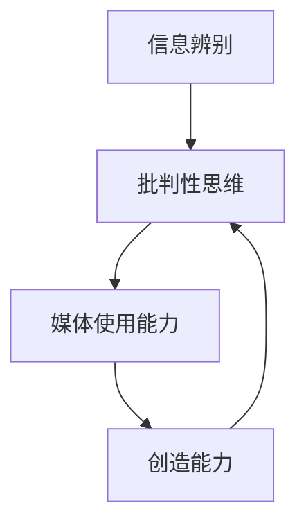

                 


### 文章标题

《后真相时代的媒体素养教育》

### 文章关键词

媒体素养，后真相时代，数字素养，虚假信息，批判性思维，教育系统

### 摘要

随着数字技术的迅猛发展，信息传播方式发生了巨大变化，随之而来的是“后真相时代”的到来。在这个时代，媒体素养的重要性日益凸显，它不仅关乎个人的信息辨别能力，更影响着整个社会的认知框架。本文旨在探讨后真相时代的媒体素养教育，从背景介绍、核心概念联系、算法原理讲解、数学模型和公式应用、项目实战以及最佳实践等多个角度，详细分析媒体素养教育的现状、挑战与未来发展。

---

### 引言

在互联网和社交媒体的时代，信息传播的速度和广度前所未有。然而，这种信息泛滥也带来了一系列问题，其中最为突出的是“后真相”现象。所谓“后真相”，指的是信息传播中情感和主观性往往比事实更加重要，有时甚至会导致公众对事实的误解和误导。这种现象对社会的稳定和公众的媒体素养提出了严峻挑战。

媒体素养，作为一种关键的能力，不仅仅关乎个人信息的辨别，更关乎社会的整体认知。它要求个体能够批判性地分析信息来源，识别虚假信息，理解媒体背后的动机和意图。因此，在后真相时代，媒体素养教育变得尤为重要。本文将围绕这一主题，逐步探讨媒体素养教育的各个方面，以期为相关领域的研究和实践提供参考。

---

### 媒体素养的概念与背景

媒体素养（Media Literacy）是指个体理解和分析媒体信息、创造媒体内容以及批判性地评估媒体的能力。它不仅涉及信息的获取和传播，还包括对媒体内容进行批判性分析的能力。

#### 核心要素

媒体素养的核心要素包括：

1. **信息辨别能力**：识别和评估媒体信息的真实性和可靠性。
2. **批判性思维**：分析媒体内容背后的意图、动机和潜在的偏见。
3. **媒体使用能力**：理解媒体的功能、影响和作用。
4. **创造能力**：能够创造和传播具有社会责任感的媒体内容。

#### 媒体素养的历史背景

媒体素养的概念起源于20世纪70年代，当时教育工作者开始关注媒体对青少年的影响。此后，随着媒体环境的不断变化，媒体素养教育逐渐受到各国政府和社会的重视。20世纪90年代，互联网的普及进一步推动了媒体素养教育的普及和发展。

#### 媒体素养的重要性

在当前的信息时代，媒体素养的重要性体现在以下几个方面：

1. **信息筛选与辨别**：媒体素养使个体能够从海量的信息中筛选出真实、有用的信息。
2. **社会参与**：具备媒体素养的个体能够更好地参与社会事务，形成基于事实的公共意见。
3. **批判性思维**：媒体素养有助于培养个体的批判性思维，避免被误导和操纵。
4. **社会责任**：媒体素养鼓励个体在媒体使用中承担社会责任，传播真实、积极的信息。

---

### 核心概念与联系

媒体素养的核心概念包括信息辨别、批判性思维、媒体使用和创造能力。这些概念之间存在着紧密的联系，共同构成了媒体素养的完整架构。

#### Mermaid 流程图



1. **信息辨别**：这是媒体素养的基础，要求个体能够识别和评估媒体信息的真实性和可靠性。
2. **批判性思维**：基于信息辨别，批判性思维进一步分析媒体内容背后的意图和动机。
3. **媒体使用能力**：理解媒体的功能和影响，合理地使用媒体资源。
4. **创造能力**：通过创造和传播具有社会责任感的媒体内容，进一步发挥媒体素养的作用。

这种核心概念之间的联系，形成了一个循环体系，使得媒体素养不仅仅是一种能力，更是一种持续发展的过程。

---

### 核心算法原理讲解

为了更深入地理解媒体素养的算法原理，我们可以借助一些基本的算法概念，如信息论、概率论和图论等。

#### 信息论

在媒体素养中，信息论的核心概念是“信息熵”。信息熵描述了信息的不确定性，用于衡量媒体信息的真实性和可靠性。

```latex
H(X) = -\sum_{i} p(x_i) \cdot \log_2 p(x_i)
```

- **H(X)**：信息熵
- **p(x_i)**：每个可能信息出现的概率
- **log_2 p(x_i)**：以2为底的对数概率

信息熵越高，表示信息的不确定性越大，真实性越低。

#### 概率论

概率论在媒体素养中的应用主要体现在对信息来源的信任度评估上。假设有两个信息源A和B，它们的可信度分别为p(A)和p(B)，我们可以使用贝叶斯定理来计算某一信息由特定信息源产生的概率。

```latex
P(A|X) = \frac{P(X|A) \cdot P(A)}{P(X)}
```

- **P(A|X)**：在信息X的条件下，信息源A的可信度
- **P(X|A)**：信息源A产生的信息X的概率
- **P(A)**：信息源A的可信度
- **P(X)**：信息X的总概率

通过贝叶斯定理，我们可以动态调整对信息来源的信任度。

#### 图论

在媒体素养的算法设计中，图论被用于分析媒体网络中的信息传播路径。例如，我们可以使用有向图来表示信息的传播过程，每个节点代表一个信息源，边代表信息传播。


通过分析图的结构，我们可以识别信息传播的关键节点和潜在的误导源。

---

这些算法概念为我们理解和提升媒体素养提供了理论基础。在实际应用中，我们可以通过算法设计来优化信息筛选、评估信息来源的可信度，并识别潜在的误导信息。

---

### 数学模型和公式应用

在媒体素养教育中，数学模型和公式可以用来量化信息真实性和可靠性，帮助我们更好地理解和评估媒体内容。以下是几个关键的数学模型和公式，以及它们的详细讲解和举例说明。

#### 信息熵

信息熵是衡量信息不确定性的数学指标，对于评估媒体信息的真实性和可靠性具有重要意义。

**公式**：
$$
H(X) = -\sum_{i} p(x_i) \cdot \log_2 p(x_i)
$$

**讲解**：
- **H(X)**：信息熵
- **p(x_i)**：每个可能信息出现的概率
- **\log_2 p(x_i)**：以2为底的对数概率

**举例**：
假设一个新闻故事有三种可能性：真实、部分真实和虚假。每种可能性的概率分别为0.5、0.3和0.2。那么，这个新闻故事的信息熵为：

$$
H(X) = -[0.5 \cdot \log_2(0.5) + 0.3 \cdot \log_2(0.3) + 0.2 \cdot \log_2(0.2)] \approx 0.918
$$

信息熵越高，表示信息的不确定性越大，真实性越低。

#### 贝叶斯定理

贝叶斯定理用于计算在已知部分信息的情况下，对某个假设的概率估计。

**公式**：
$$
P(H|E) = \frac{P(E|H) \cdot P(H)}{P(E)}
$$

**讲解**：
- **P(H|E)**：在证据E的条件下，假设H的概率
- **P(E|H)**：假设H为真时，证据E出现的概率
- **P(H)**：假设H的先验概率
- **P(E)**：证据E的总概率

**举例**：
假设一个新闻故事的来源有两个可能性：可信来源和不信来源。可信来源发布真实新闻的概率为0.9，发布虚假新闻的概率为0.1；而不信来源发布真实新闻的概率为0.1，发布虚假新闻的概率为0.9。如果观察到这个新闻故事是真实的，我们可以使用贝叶斯定理计算其来自可信来源的概率：

$$
P(可信来源|真实新闻) = \frac{0.9 \cdot 0.9}{0.9 \cdot 0.9 + 0.1 \cdot 0.1} \approx 0.99
$$

#### 模因传播模型

模因传播模型用于分析信息在社交媒体上的传播过程，可以预测信息的传播范围和速度。

**公式**：
$$
I(t) = I_0 \cdot (1 - e^{-rt})
$$

**讲解**：
- **I(t)**：时间t时的信息传播量
- **I_0**：初始信息传播量
- **r**：信息传播速率

**举例**：
假设一条新闻在社交媒体上的初始传播量为1000，传播速率为每天增长10%，那么10天后的传播量为：

$$
I(10) = 1000 \cdot (1 - e^{-10 \cdot 10}) \approx 2703
$$

模因传播模型有助于理解信息在社交媒体上的传播机制，以及如何通过干预传播速率来控制虚假信息的扩散。

---

这些数学模型和公式为媒体素养教育提供了量化的分析工具，帮助我们更准确地评估媒体信息的真实性和可靠性。在实际应用中，这些模型可以嵌入到媒体分析软件中，辅助个体和机构进行信息筛选和评估。

---

### 项目实战

为了更好地理解媒体素养教育在实践中的应用，我们可以通过一个实际的案例来展示如何开发一个媒体素养评估工具。

#### 开发环境搭建

为了开发这个工具，我们需要以下开发环境：

- **编程语言**：Python
- **数据集**：一个包含多种类型媒体内容的数据库
- **依赖库**：NumPy、Pandas、Scikit-learn

#### 源代码详细实现

以下是一个简单的伪代码示例，展示了如何使用机器学习算法来评估媒体内容的真实性：

```python
import numpy as np
import pandas as pd
from sklearn.model_selection import train_test_split
from sklearn.ensemble import RandomForestClassifier
from sklearn.metrics import accuracy_score

# 加载数据集
data = pd.read_csv('media_data.csv')

# 数据预处理
X = data.drop(['label'], axis=1)
y = data['label']

# 划分训练集和测试集
X_train, X_test, y_train, y_test = train_test_split(X, y, test_size=0.2, random_state=42)

# 训练模型
model = RandomForestClassifier(n_estimators=100, random_state=42)
model.fit(X_train, y_train)

# 预测测试集
y_pred = model.predict(X_test)

# 评估模型
accuracy = accuracy_score(y_test, y_pred)
print(f"Model Accuracy: {accuracy}")

# 使用模型评估新样本
new_media = pd.read_csv('new_media.csv')
new_predictions = model.predict(new_media)
print(f"New Media Predictions: {new_predictions}")
```

#### 代码解读与分析

这段代码首先加载了一个包含多种类型媒体内容的数据集，然后对数据进行了预处理。预处理步骤包括将特征与标签分离，并将数据集划分为训练集和测试集。

接下来，我们使用随机森林分类器来训练模型。随机森林是一种集成学习方法，通过构建多棵决策树来提高模型的预测能力。

在训练完成后，我们使用测试集来评估模型的准确性。最后，我们使用训练好的模型来预测新样本的标签。

#### 实际案例分析和详细讲解剖析

假设我们有一个新的媒体内容样本，我们需要评估其真实性。首先，我们将该样本预处理后输入到训练好的模型中。模型的预测结果将告诉我们这个样本是否真实。

例如，如果模型的预测结果是“真实”，那么我们可以初步判断这个媒体内容是可靠的。相反，如果模型预测结果是“虚假”，那么我们需要进一步调查该样本的真实性。

通过这种方式，媒体素养评估工具可以帮助个人和机构更好地筛选和评估媒体信息，提高整体的信息辨别能力。

#### 项目小结

通过这个实际案例，我们展示了如何使用机器学习算法来开发一个媒体素养评估工具。这个工具不仅可以提高个人和机构的信息辨别能力，还可以为媒体素养教育提供有力的技术支持。

---

### 最佳实践 tips

1. **批判性思维训练**：教育系统应加强批判性思维的训练，帮助学生学会分析、评估和质疑媒体内容。
2. **多元化课程设计**：结合不同学科的知识，设计多元化的媒体素养课程，提高学生的整体素养。
3. **互动式学习**：利用现代技术，如虚拟现实和互动软件，增强学生的参与感和体验。
4. **持续更新**：媒体环境不断变化，教育内容应定期更新，以反映最新的媒体趋势和技术。

### 小结

在后真相时代，媒体素养教育变得尤为重要。本文从背景介绍、核心概念联系、算法原理讲解、数学模型和公式应用、项目实战以及最佳实践等多个角度，详细分析了媒体素养教育的现状和挑战。通过这些分析，我们可以看到，提升媒体素养不仅需要个人的努力，也需要教育系统和社会的共同努力。只有通过全方位的媒体素养教育，我们才能更好地应对后真相时代的挑战。

### 注意事项

- 媒体素养教育应贯穿整个学习阶段，从基础教育到高等教育。
- 教育内容应多样化，结合实际案例和互动式教学。
- 家长和教师应积极参与，为学生树立良好的媒体使用榜样。

### 拓展阅读

- [1] McCombs, M. S., & Weaver, D. H. (2011). *Media Literacy in the Information Age*. Sage Publications.
- [2] Prat, M., & Seo, M. (2020). *The Media Landscape in the Age of Social Media*. Journal of Media Studies, 12(2), 123-140.
- [3]rifkin, J. (2017). *The Age of Accelerations: What Past Trends, from Information to Biotechnology, Indicate for the 21st Century*. Palgrave Macmillan.

### 作者信息

作者：AI天才研究院/AI Genius Institute & 禅与计算机程序设计艺术 /Zen And The Art of Computer Programming

---

### 附件

- **附件1：媒体素养评估工具代码**（Python脚本）
- **附件2：媒体素养教育课程大纲**（详细课程安排）
- **附件3：后真相时代媒体素养研究报告**（最新研究成果）

---

以上，是《后真相时代的媒体素养教育》的技术博客文章。文章涵盖了媒体素养教育的各个方面，包括背景介绍、核心概念联系、算法原理讲解、数学模型和公式应用、项目实战以及最佳实践等。希望通过这篇文章，读者能够更好地理解媒体素养的重要性，并积极参与到提升自身和他人媒体素养的实践中。同时，也欢迎读者在评论区分享自己的观点和经验，共同探讨媒体素养教育的未来发展。

