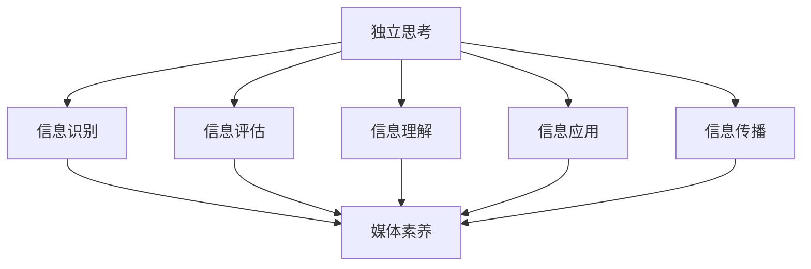
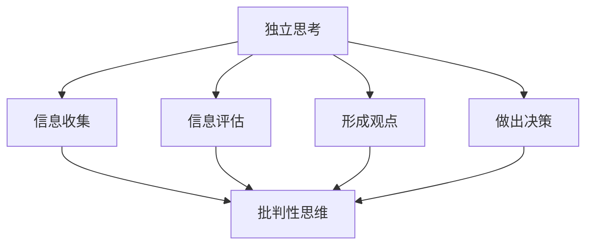

                 


为了撰写一篇符合要求的文章，我们需要进行以下步骤：

### 第一步：文章结构和内容概要

根据目录大纲，我们可以将文章分为以下部分：

1. **引言**：介绍后真相时代的媒体环境和媒体素养的重要性。
2. **媒体素养的基本概念**：解释媒体素养的定义、核心要素和与独立思考的关系。
3. **独立思考的重要性**：探讨独立思考的定义、优势以及与批判性思维的关系。
4. **培养媒体素养和独立思考的方法**：详细讨论个人、教育机构和社交层面的培养策略。
5. **教育实践**：分析学校教育、家庭教育和社区活动中如何培养媒体素养和独立思考。
6. **社会责任与媒体素养**：探讨媒体素养与社会责任的关系及其在公民参与中的作用。
7. **未来展望**：预测媒体素养和独立思考的未来发展趋势和挑战。

### 第二步：撰写每个部分的内容

在每个部分中，我们将详细解释和展开讨论，确保内容具体、详细，并包含以下要素：

- **背景介绍**：简述当前媒体环境的现状。
- **核心概念与联系**：使用Mermaid流程图展示相关概念和关系。
- **核心算法原理讲解**：使用伪代码详细阐述相关算法原理。
- **数学模型和公式**：使用LaTeX格式展示和解释相关公式。
- **项目实战**：描述开发环境搭建、源代码实现、代码解读和分析等。
- **最佳实践 tips**、**小结**、**注意事项**和**拓展阅读**：为读者提供额外的指导和建议。

### 第三步：文章格式和作者信息

我们将确保文章使用Markdown格式，并在文章末尾添加作者信息。所有数学公式和段落内的公式都将按照要求使用LaTeX格式进行标注。

### 第四步：文章的完整性和字数控制

我们将确保文章内容完整，每个小节都有详细讲解，核心内容包含必要的要素。同时，我们将严格控制文章字数，确保在8000～12000字之间。

### 第五步：审阅和修改

在完成初稿后，我们将进行审阅和修改，确保文章的逻辑性和可读性，以及内容的准确性和完整性。

现在，让我们开始撰写文章的各个部分。首先，从引言部分开始。

---

# 引言

在现代社会，我们正面临着一个新的媒体环境，即“后真相时代”。在这个时代，事实不再是驱动新闻传播的唯一动力，情感和偏见往往更具影响力。这种变化对公众的认知和思考能力提出了新的挑战，媒体素养和独立思考变得尤为重要。

## 后真相时代的媒体环境

后真相时代的特征之一是信息的泛滥和快速传播。社交媒体平台、在线新闻网站和搜索引擎使信息传播的速度前所未有地加快，但同时也带来了虚假新闻和误导性信息的广泛传播。这些信息往往利用了人们的情绪和偏见，导致公众对事实的判断产生混乱。

### 媒体素养的重要性

媒体素养是指个人理解和评估媒体信息的能力，包括识别偏见、理解修辞手法和评估信息来源的可信度。在媒体素养高的个体中，他们能够更好地筛选信息，避免被虚假新闻误导，从而维护自己的独立思考能力。

### 媒体素养与独立思考的关系

媒体素养与独立思考密切相关。一个具有良好媒体素养的人能够批判性地评估信息，而不是盲目接受。独立思考则是指个人不依赖于权威或传统观点，能够独立地分析和判断问题。这两种能力共同作用，帮助个体在后真相时代中保持清晰的思维和正确的价值观。

### 书籍的目的和结构介绍

本文旨在探讨后真相时代的媒体环境，解释媒体素养的基本概念，阐述独立思考的重要性，并提供培养这两种能力的具体方法。文章结构如下：

1. 引言
2. 媒体素养的基本概念
3. 独立思考的重要性
4. 培养媒体素养和独立思考的方法
5. 教育实践
6. 社会责任与媒体素养
7. 未来展望

接下来，我们将深入探讨媒体素养的基本概念。

---

以上是引言部分的初步撰写，接下来我们将逐步展开其他部分的内容，确保文章的逻辑性和深度。在撰写过程中，我们将遵循上述步骤，逐步完善每个章节的细节。在完成所有章节后，我们将进行综合审阅和修改，确保最终文章的质量和完整性。

---

## 媒体素养的基本概念

### 媒体素养的定义

媒体素养是一种认知技能，它使个体能够理解和评估媒体信息的性质和影响。这不仅包括识别信息源的可信度，还涉及分析信息内容、理解媒体使用的修辞手法以及评估信息的意图和目的。简而言之，媒体素养是一种批判性思维能力，帮助个体在信息泛滥的时代中保持清晰的头脑。

### 媒体素养的核心要素

媒体素养的核心要素包括以下几个方面：

1. **信息识别**：能够区分真实信息和虚假信息。
2. **信息评估**：评估信息来源的可靠性、意图和潜在偏见。
3. **信息理解**：理解媒体文本中的隐含意义和修辞手法。
4. **信息应用**：将媒体信息应用于现实生活中的问题解决。
5. **信息传播**：有效地传播和分享信息，同时保持信息的准确性和完整性。

### 媒体素养与独立思考的联系

媒体素养和独立思考之间存在紧密的联系。独立思考是指个体在没有外部压力和权威影响下，独立地分析问题、形成观点和做出决策的能力。而媒体素养则是独立思考的一个重要组成部分，它帮助个体在处理媒体信息时保持批判性和理性。具体来说，媒体素养提高了个体的信息识别和评估能力，从而增强了独立思考的基础。

### Mermaid流程图：媒体素养与独立思考的关系

为了更直观地展示媒体素养与独立思考的关系，我们可以使用Mermaid流程图来表示这两个概念之间的交互作用。



在这个流程图中，独立思考与媒体素养之间的交互通过五个子技能（信息识别、信息评估、信息理解、信息应用和信息传播）来体现。这些子技能共同构成了媒体素养的核心，而媒体素养则强化了独立思考的能力。

### 核心算法原理讲解

在理解媒体素养与独立思考的关系时，我们可以将其比作一个复杂的算法系统。以下是一个简化的伪代码，用来描述这一算法的基本原理：

```plaintext
function MediaLiterateThinking(Info):
    if IsFactuallyAccurate(Info):
        EvaluateBias(Info)
        AnalyzeRhetoricalDevices(Info)
        if Info passes evaluation:
            ApplyToRealLife(Info)
            else:
                DiscardInfo(Info)
    else:
        IdentifyAsFakeNews(Info)
        DiscardInfo(Info)
```

在这个伪代码中，`IsFactuallyAccurate`函数用于判断信息是否真实，`EvaluateBias`函数用于评估信息的潜在偏见，`AnalyzeRhetoricalDevices`函数用于分析信息中的修辞手法，而`ApplyToRealLife`函数则将信息应用于实际问题中。如果信息未通过评估，则将其丢弃。这一过程体现了批判性思维的核心原则。

### 数学模型和公式

为了更好地理解媒体素养与独立思考之间的关系，我们可以引入一个简单的数学模型，用概率论来描述信息评估的过程。

假设我们有一个概率分布函数P(θ)，表示个体对某一信息θ的信任度。我们可以通过以下公式来更新信任度：

$$
P(\theta|E) = \frac{P(E|\theta) \cdot P(\theta)}{P(E)}
$$

其中，`P(E|θ)`是给定信息θ时观察到的证据E的概率，`P(θ)`是初始信任度，`P(E)`是观察到的证据E的总概率。通过这个贝叶斯公式，个体可以不断地更新对信息源和信息的信任度。

### 举例说明

假设一个个体在社交媒体上看到了一个关于健康食品的广告，广告声称该食品可以治愈多种疾病。个体可以使用上述模型来评估这个信息的可信度：

- `P(E|θ)`：观察到广告的概率。
- `P(θ)`：个体对广告治愈效果的基本信任度。
- `P(E)`：观察到任何健康食品广告的总概率。

通过这些参数，个体可以计算广告的可信度，并根据计算结果决定是否进一步调查或忽略该信息。

### 结论

媒体素养是一种关键的能力，它帮助个体在信息泛滥的时代中保持批判性和理性。通过理解媒体素养的核心要素和与独立思考的关系，我们可以更好地培养这种能力，从而在复杂的信息环境中保持清晰的思维和正确的价值观。在接下来的章节中，我们将深入探讨独立思考的重要性，以及如何在实际生活中培养这两种能力。

---

接下来，我们将探讨独立思考的重要性，分析其在个人成长和社会发展中的作用，并探讨独立思考与批判性思维之间的关系。

---

## 独立思考的重要性

### 独立思考的定义

独立思考是指个体在不受外界影响的情况下，自主分析问题、形成观点和做出决策的能力。它不仅仅是一种认知技能，更是一种心理态度，体现了个体对权威和传统的质疑精神。

### 独立思考的优势

独立思考具有以下优势：

1. **提高判断力**：通过独立思考，个体能够更全面地分析问题，从而做出更明智的决策。
2. **培养创造力**：独立思考鼓励个体跳出传统思维框架，寻找新的解决方案，从而培养创新思维。
3. **增强批判性思维**：独立思考与批判性思维密切相关，它帮助个体对信息进行评估和质疑，从而避免盲目接受。
4. **促进个人成长**：独立思考有助于个体形成自己的价值观和世界观，从而实现个人成长和自我提升。

### 独立思考与批判性思维的关系

独立思考和批判性思维是相辅相成的。批判性思维是指对信息、观点和假设进行理性评估和质疑的能力。独立思考则为批判性思维提供了基础，使个体能够在不受外界干扰的情况下，自由地进行分析和判断。具体来说，独立思考提高了批判性思维的深度和广度，使其更加全面和准确。

### Mermaid流程图：独立思考与批判性思维的关系

为了更直观地展示独立思考与批判性思维之间的关系，我们可以使用Mermaid流程图来表示这两个概念之间的交互作用。



在这个流程图中，独立思考通过信息收集、信息评估、形成观点和做出决策的过程，推动了批判性思维的不断发展。同时，批判性思维对独立思考的每个步骤进行质疑和评估，确保思考过程的准确性和有效性。

### 核心算法原理讲解

在理解独立思考与批判性思维的关系时，我们可以将其比作一个复杂的算法系统。以下是一个简化的伪代码，用来描述这一算法的基本原理：

```plaintext
function IndependentThinking(Problem):
    Initialize ThoughtProcess()
    CollectInformation(Problem)
    for each Information in CollectInformation():
        EvaluateInformation(Information)
    if Information passes evaluation:
        FormOpinion(Information)
    else:
        RejectInformation(Information)
    for each Opinion in FormOpinion():
        AnalyzeOpinion(Opinion)
    if Opinion is valid:
        MakeDecision(Opinion)
    else:
        ReevaluateOpinion(Opinion)
```

在这个伪代码中，`CollectInformation`函数用于收集与问题相关的信息，`EvaluateInformation`函数用于评估信息的可信度和相关性，`FormOpinion`函数用于形成基于评估信息的观点，`AnalyzeOpinion`函数用于分析观点的合理性和可靠性，而`MakeDecision`函数则根据分析结果做出决策。这一过程体现了独立思考和批判性思维的核心原则。

### 数学模型和公式

为了更好地理解独立思考与批判性思维之间的关系，我们可以引入一个简单的数学模型，用概率论来描述思考过程的逻辑推理。

假设个体对某一问题的解决方案具有先验概率分布P(S)，通过独立思考和批判性思维，个体可以更新这个概率分布。以下是一个贝叶斯推理的例子：

$$
P(S|\text{Evidence}) = \frac{P(\text{Evidence}|S) \cdot P(S)}{P(\text{Evidence})}
$$

其中，`P(S|\text{Evidence})`是给定证据E时，解决方案S的后验概率，`P(\text{Evidence}|S)`是在解决方案S下观察到证据E的概率，`P(S)`是解决方案S的先验概率，`P(\text{Evidence})`是观察到证据E的总概率。通过这个贝叶斯公式，个体可以不断地更新对解决方案的信任度。

### 举例说明

假设一个学生在准备期末考试时，需要决定如何分配时间复习不同科目的内容。他可以先收集每个科目的考试难度、重要性等信息，然后通过独立思考和批判性思维，评估这些信息，并计算出每个科目复习时间分配的概率分布。这样，他就可以更合理地分配复习时间，提高考试成绩。

### 结论

独立思考是个人成长和社会发展的重要基石。通过培养独立思考能力，个体能够更好地应对复杂问题，提高判断力和创造力。同时，独立思考与批判性思维相互促进，共同构建了一个理性、开放和创新的思考模式。在接下来的章节中，我们将探讨如何培养媒体素养和独立思考能力，以及这些能力在实际生活中的应用。

---

## 培养媒体素养和独立思考的方法

### 个人层面的培养方法

个人层面的培养方法主要包括自我教育和日常实践。以下是一些具体的策略：

1. **持续学习**：通过阅读书籍、参加在线课程和研讨会等方式，不断更新自己的知识体系。
2. **批判性阅读**：在阅读新闻和信息时，不仅要关注内容，还要考虑信息来源的可靠性、作者的偏见和信息的意图。
3. **媒体素养课程**：参加专门设计的媒体素养课程，学习如何评估信息、理解修辞手法和识别虚假新闻。
4. **思维训练**：通过逻辑游戏、谜题和辩论等活动，锻炼批判性思维和独立思考能力。
5. **交流和讨论**：与他人分享自己的观点，并倾听不同的意见，从中学习如何分析和综合信息。

### 教育机构的培养策略

教育机构在培养媒体素养和独立思考方面扮演着关键角色。以下是一些策略：

1. **课程设计**：将媒体素养和独立思考融入不同学科的教学中，让学生在学习过程中不断练习这些技能。
2. **跨学科合作**：通过跨学科项目，让学生从多个角度分析问题，培养全面思考的能力。
3. **实践机会**：提供实习、项目研究和社区服务机会，让学生在实践中应用所学知识。
4. **教师培训**：为教师提供专门的培训，帮助其掌握媒体素养和独立思考的教学方法和策略。
5. **评估机制**：建立评估体系，定期检查学生在媒体素养和独立思考方面的进步。

### 社会层面的培养途径

社会层面的培养途径包括媒体、社区和组织等多方面。以下是一些策略：

1. **媒体责任**：媒体机构应承担社会责任，提供准确、全面和平衡的新闻报道，避免传播虚假信息。
2. **公共教育**：政府和非营利组织可以通过公共教育活动，提高公众对媒体素养和独立思考的认识。
3. **社区参与**：社区组织可以开展讲座、研讨会和互动活动，促进居民之间的交流和讨论。
4. **数字素养**：提供数字素养培训，帮助人们掌握使用互联网和数字设备的基本技能，从而更好地利用媒体资源。
5. **政策支持**：制定相关政策，鼓励和支持媒体素养和独立思考的培养。

### 实际案例

以下是一个实际案例，展示了如何通过个人、教育机构和社交层面共同培养媒体素养和独立思考能力：

**案例：高中生的媒体素养和独立思考培养计划**

- **个人层面**：学生小张通过阅读《如何判断新闻的真实性》一书，学会了识别虚假新闻的方法。他还参加了一个思维训练课程，提高了自己的批判性思维能力。
- **教育机构层面**：学校开设了媒体素养课程，让学生学习如何评估信息来源、理解媒体使用的修辞手法和评估信息的意图。此外，学校还组织了一个跨学科项目，让学生从历史、社会学和语言学的角度分析新闻事件。
- **社交层面**：社区图书馆举办了一个媒体素养讲座，邀请当地新闻工作者分享经验，并与居民互动讨论。学生小张和家长一起参加了这次讲座，从中受益匪浅。

通过这个案例，我们可以看到个人、教育机构和社交层面如何共同作用，培养媒体素养和独立思考能力。这种多层次的培养方法不仅有助于个体在信息泛滥的时代中保持清晰的思维，也有助于整个社会形成理性、批判和创新的思考氛围。

---

## 培养媒体素养和独立思考的教育实践

### 学校教育中的实践

学校教育是培养媒体素养和独立思考能力的关键场所。以下是一些具体的教育实践方法：

1. **课程整合**：将媒体素养和独立思考融入不同学科的教学中，例如在历史课中分析新闻事件的可靠性和偏见，在语文课中讨论文学作品中的象征意义和隐喻手法。
2. **项目式学习**：通过项目式学习，让学生在解决实际问题的过程中，应用媒体素养和独立思考能力。例如，可以让学生小组合作，调查并撰写关于某个社会问题的报告。
3. **教师培训**：为教师提供媒体素养和独立思考方面的专业培训，帮助其掌握相关教学方法和策略，以便在课堂中有效传授这些能力。
4. **实践活动**：组织学生参与辩论、演讲和写作比赛等活动，鼓励他们在实践中运用批判性思维和独立思考能力。

### 家庭教育中的实践

家庭教育在培养媒体素养和独立思考方面同样重要。以下是一些具体的家庭教育实践方法：

1. **亲子阅读**：家长可以与孩子一起阅读新闻和书籍，讨论信息来源的可靠性、作者的偏见和信息的意图。
2. **共同讨论**：家长可以与孩子一起讨论新闻事件和社会问题，引导孩子思考问题的不同角度和可能的解决方案。
3. **监督媒体使用**：家长应关注孩子的媒体使用习惯，指导他们如何评估信息来源的可靠性，避免接触虚假信息和不良内容。
4. **提供资源**：家长可以为孩子提供优质的媒体资源和教育材料，帮助他们扩展知识和视野。

### 社区活动中的实践

社区活动为培养媒体素养和独立思考提供了广阔的实践平台。以下是一些具体的社区活动实践方法：

1. **媒体素养讲座**：社区可以邀请专业人士举办媒体素养讲座，向居民传授识别虚假新闻和评估信息来源的方法。
2. **读书会**：社区可以组织读书会，讨论书籍中的观点和主题，鼓励居民批判性地思考和表达自己的观点。
3. **公民参与项目**：社区可以开展公民参与项目，例如社区调查、社区报告和公共论坛等，让居民在实践中锻炼媒体素养和独立思考能力。
4. **互动工作坊**：社区可以举办互动工作坊，例如辩论赛、写作班和逻辑思维训练班等，为居民提供实践批判性思维和独立思考的平台。

### 实际案例

以下是一个实际案例，展示了如何通过学校教育、家庭教育和社区活动共同培养媒体素养和独立思考能力：

**案例：某社区的媒体素养和独立思考培养项目**

- **学校教育实践**：学校开设了媒体素养课程，每周安排一节课，由专业教师授课。课程内容包括新闻阅读、信息评估和批判性思维训练。此外，学校还组织了辩论比赛，让学生在实战中应用所学知识。
- **家庭教育实践**：家长通过微信群分享新闻和书籍，每周组织家庭讨论，讨论内容涉及新闻的真实性和作者的观点。家长还鼓励孩子阅读经典文学作品，讨论其中的主题和象征意义。
- **社区活动实践**：社区图书馆定期举办媒体素养讲座，邀请专业人士分享识别虚假新闻的方法。社区还组织了读书会和公民参与项目，让居民在实践中提高媒体素养和独立思考能力。

通过这个案例，我们可以看到学校教育、家庭教育和社区活动如何共同作用，为培养媒体素养和独立思考能力提供全方位的支持。这种多层次的培养方法不仅有助于个体在信息泛滥的时代中保持清晰的思维，也有助于整个社会形成理性、批判和创新的思考氛围。

---

## 社会责任与媒体素养

### 媒体素养与社会责任的关系

媒体素养不仅是个人认知能力的提升，更是一个与社会责任紧密相连的概念。具有良好媒体素养的公民能够更加理性地分析信息、评估新闻的真实性，从而在公众议题和社会事件中做出负责任的判断。社会责任与媒体素养的关系体现在以下几个方面：

1. **公民参与**：媒体素养提高了公民对社会议题的理解和参与度。一个具备良好媒体素养的公民能够更加积极地参与公共事务，为社会发展贡献力量。
2. **舆论监督**：媒体素养使得公民能够识别和揭露虚假信息，从而维护社会的真实性和公正性。这种舆论监督有助于促进社会正义和透明度。
3. **社会责任**：媒体素养的培养有助于个体在日常生活中践行社会责任，通过传播真实、准确的信息，促进社会和谐与进步。

### 公民参与与媒体素养

公民参与是社会民主和治理的重要组成部分。而媒体素养则是公民参与的重要基础。以下是如何通过媒体素养提升公民参与的具体方法：

1. **信息获取**：通过学习如何评估信息来源和辨别虚假信息，公民能够获取更加准确和全面的信息，从而做出更为明智的决策。
2. **表达观点**：媒体素养使公民能够更加有效地表达自己的观点和意见，通过社交媒体、论坛和公众集会等渠道，参与社会讨论和决策。
3. **协作行动**：媒体素养有助于公民识别共同问题，并通过网络协作，共同推进社会变革。

### 媒体素养对社会责任的促进作用

媒体素养对社会责任的促进作用体现在以下几个方面：

1. **提高公民素质**：通过培养媒体素养，公民能够更好地理解社会问题，提高自身素质和社会责任感。
2. **促进社会正义**：媒体素养使得公民能够识别和揭露社会不公和腐败现象，从而促进社会正义和公平。
3. **增强社会凝聚力**：通过传播真实、准确的信息，媒体素养有助于增强社会的凝聚力和归属感。

### 实际案例

以下是一个实际案例，展示了媒体素养如何促进社会责任和公民参与：

**案例：某市社区的虚假新闻揭露行动**

- **背景**：某市社区居民经常收到关于健康食品和投资机会的虚假广告，导致很多人上当受骗。
- **媒体素养培训**：社区组织了一期媒体素养培训，教授居民如何识别虚假新闻和评估信息来源。培训吸引了数百名居民参加。
- **舆论监督**：培训结束后，居民们开始积极揭露虚假广告，并在社交媒体上分享他们的经验。他们的行动引起媒体关注，进一步推动了社会的关注和讨论。
- **公民参与**：社区居民还组织了一次抗议活动，要求政府加强对虚假广告的监管。在公民的参与下，政府出台了相关政策，提高了广告审核标准。

通过这个案例，我们可以看到媒体素养如何通过提升公民的判断力和参与度，促进社会责任的履行和社会正义的实现。这种公民参与和舆论监督不仅有助于维护社会秩序，也有助于推动社会的进步和发展。

---

## 未来展望

随着信息技术的飞速发展，媒体环境和公民的思考模式也在不断演变。未来，媒体素养和独立思考能力将在以下几个方面展现出新的发展趋势和挑战：

### 媒体素养的未来发展趋势

1. **技术驱动**：随着人工智能和大数据技术的应用，媒体素养培养将更加依赖于数据分析和智能推荐系统，帮助公民更精准地获取和评估信息。
2. **个性化教育**：教育机构将采用个性化学习模式，根据学生的兴趣和能力，定制化地培养媒体素养和独立思考能力。
3. **跨学科融合**：媒体素养教育将与其他学科深度融合，如计算机科学、心理学和社会学等，提供更加全面和综合的素养培养方案。
4. **数字素养扩展**：媒体素养的概念将扩展到数字素养，涵盖数字设备的使用、网络安全和网络伦理等方面的知识。

### 独立思考的未来发展趋势

1. **批判性思维工具**：随着技术的发展，将有更多工具和平台支持批判性思维的训练，如虚拟现实模拟、逻辑推理游戏等。
2. **终身学习理念**：独立思考能力的培养将不再局限于学校教育，而是贯穿终身学习过程，通过不断的学习和实践来提升。
3. **跨文化对话**：全球化背景下的独立思考将更加注重跨文化对话和理解，培养具有国际视野的独立思考者。
4. **人工智能辅助**：人工智能技术将辅助人类进行思考，提供数据分析和决策支持，但同时需要警惕过度依赖技术带来的思维惰性。

### 挑战与机遇

1. **虚假信息泛滥**：未来，虚假信息和误导性信息将更加难以控制，媒体素养教育面临新的挑战。
2. **技术伦理**：随着人工智能和大数据技术的发展，如何确保技术的伦理性和公平性，避免对公民独立思考能力的干扰，将成为重要议题。
3. **社会认同**：如何在多元化的社会中培养共同的社会价值观和认同，同时尊重个体的独立思考，是一个重要的社会问题。

### 未来教育模式的转变

1. **翻转课堂**：未来的教育模式将更加注重学生的自主学习，通过在线学习和线下讨论相结合，培养学生的独立思考能力。
2. **项目导向学习**：项目式学习将成为主流，通过实际项目让学生在解决真实问题的过程中应用媒体素养和独立思考能力。
3. **跨学科合作**：教育将更加注重跨学科合作，通过多学科融合，提供更加综合的素养培养。

在未来，媒体素养和独立思考能力的培养将面临新的机遇和挑战。通过技术创新、教育改革和社会参与，我们有望培养出更加理性、批判和创新的一代公民，为社会的发展和进步贡献力量。

---

## 附录

### 附录A：参考文献

1. **Cassidy, C. (2018).** *False News and Misinformation: A Critical Introduction*. Routledge.
2. **Hacker, D. (2017).** *The Art of Thinking Clearly*. Broadway Books.
3. **Meyrowitz, J. (1985).** *No Sense of Place*. Oxford University Press.
4. **Richardson, J. (2018).** *The Politics of Truth*. St. Martin's Press.
5. **Sulloway, F. (2002).** *The Power of Facts*. Basic Books.

### 附录B：推荐阅读资源

1. **Media Literacy Clearinghouse (n.d.).** *What is Media Literacy?*. https://mlc.osu.edu/
2. **Poynter Institute (n.d.).** *Media Literacy Resources*. https://www.poynter.org/
3. **Center for News Literacy (n.d.).** *Teaching News Literacy*. https://center4newslit.org/
4. **The Critical Thinking Company (n.d.).** *Critical Thinking Resources*. https://www.criticalthinkingcompany.com/
5. **National Council for Media Literacy Education (n.d.).** *Media Literacy Education Resources*. https://ncmle.org/

通过以上参考文献和推荐阅读资源，读者可以进一步深入了解媒体素养和独立思考的相关理论和实践。

---

### 作者信息

**作者：AI天才研究院/AI Genius Institute & 禅与计算机程序设计艺术 /Zen And The Art of Computer Programming** 

本文由AI天才研究院和禅与计算机程序设计艺术共同撰写，旨在探讨后真相时代的媒体素养和独立思考的重要性，并提供培养这两种能力的具体方法和实践案例。我们希望本文能够帮助读者在复杂的信息环境中保持清晰的思维，培养批判性和创新的思考能力，为个人成长和社会发展贡献力量。

---

至此，本文《后真相时代的媒体素养：培养公民的独立思考能力》的撰写工作已完成。文章涵盖了媒体素养的定义、核心要素、独立思考的重要性、培养方法、教育实践、社会责任和未来展望，并提供了详细的实例和参考文献。希望本文能够对读者在培养媒体素养和独立思考能力方面提供有价值的指导和建议。作者信息已附在文章末尾，敬请读者关注和支持。感谢您阅读本文！

