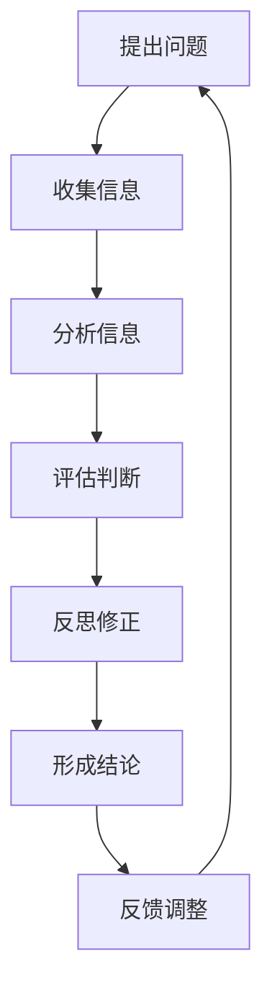
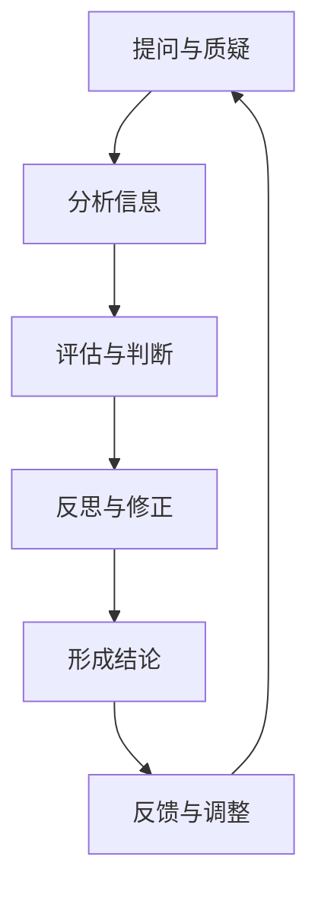
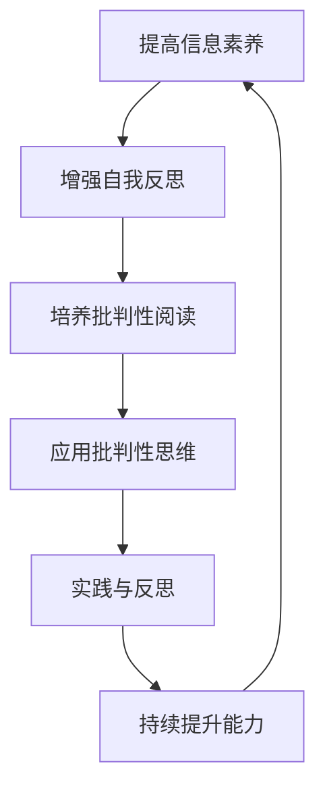

                 

### 文章标题：后真相时代的批判性思维训练营：培养辨识能力的密集课程

#### 关键词：
- 批判性思维
- 辨识能力
- 后真相时代
- 训练营
- 信息素养
- 伪代码示例
- 数学模型
- 项目实战

#### 摘要：
在信息爆炸、假新闻泛滥的后真相时代，批判性思维和辨识能力变得尤为重要。《后真相时代的批判性思维训练营：培养辨识能力的密集课程》旨在通过系统的课程设计，帮助读者掌握批判性思维和辨识能力，提升信息辨别力，构建独立思考的能力框架。本文将详细阐述批判性思维的概念、流程、重要性，辨识能力的定义、价值与应用，并通过实际案例、伪代码示例和数学模型，深入探讨如何在实际中培养和应用这些能力。

### 设计《后真相时代的批判性思维训练营：培养辨识能力的密集课程》目录大纲

#### 第1章：批判性思维的概念与重要性

##### 1.1 批判性思维的定义与历史背景
- 批判性思维的起源与发展
- 批判性思维的核心要素

##### 1.2 批判性思维的重要性
- 个人成长中的批判性思维
- 社会治理中的批判性思维

##### 1.3 批判性思维的基本要素
- 提问与质疑
- 分析与评估
- 反思与修正

#### 第2章：批判性思维的流程与方法

##### 2.1 提问与质疑
- 提问技巧
- 质疑的方法与策略

##### 2.2 分析与评估
- 分析框架
- 评估标准

##### 2.3 反思与修正
- 反思过程
- 修正策略

#### 第3章：辨识能力的概念与价值

##### 3.1 辨识能力的定义与特征
- 辨识能力的概念
- 辨识能力的特征

##### 3.2 辨识能力在现代社会中的重要性
- 信息爆炸时代的挑战
- 辨识能力对社会和个人影响的深入探讨

##### 3.3 辨识能力与批判性思维的关系
- 辨识能力在批判性思维中的应用
- 批判性思维对辨识能力的促进作用

#### 第4章：辨识能力的培养策略

##### 4.1 提高信息素养
- 信息素养的基本内容
- 提高信息素养的方法

##### 4.2 增强自我反思能力
- 自我反思的重要性
- 增强自我反思的技巧

##### 4.3 培养批判性阅读习惯
- 批判性阅读的方法
- 批判性阅读的实践案例

#### 第5章：批判性思维与辨识能力的综合应用

##### 5.1 决策中的批判性思维与辨识能力
- 决策过程中的关键步骤
- 批判性思维与辨识能力在决策中的具体应用

##### 5.2 案例分析
- 真实案例的剖析
- 批判性思维与辨识能力在实际中的应用

#### 第6章：未来发展的趋势与挑战

##### 6.1 新时代下的需求变化
- 信息社会对批判性思维和辨识能力的新要求

##### 6.2 技术进步的影响
- 技术发展对批判性思维和辨识能力的挑战与机遇

##### 6.3 未来教育的挑战与机遇
- 教育模式改革对批判性思维和辨识能力培养的影响

#### 第7章：总结与展望

##### 7.1 内容回顾
- 对全文内容的回顾与总结

##### 7.2 实践建议
- 如何将批判性思维和辨识能力应用到日常生活中

##### 7.3 拓展阅读
- 推荐进一步阅读的资源和书籍

### 1. 确定核心概念与联系

#### 批判性思维

批判性思维是一种理性分析问题的方法，它要求个体在思考问题时，不仅要关注问题的表面现象，更要深入挖掘其背后的本质和原因。批判性思维的核心要素包括质疑精神、分析能力和评估能力。通过提问、分析和评估，批判性思维能够帮助个体形成独立、全面、深入的思考。

#### 辨识能力

辨识能力是指识别和判断信息真伪、价值、相关性等方面的能力。在信息爆炸的时代，辨识能力尤为重要。它不仅关乎个体的认知水平，更影响个体的决策和行为。辨识能力与批判性思维密切相关，批判性思维提供了辨识能力的理论基础和方法指导。

### 2. 设计Mermaid流程图

为了更好地理解批判性思维和辨识能力的培养过程，我们可以设计一个Mermaid流程图，展示从问题提出到反思修正的完整流程。



#### 批判性思维流程图



#### 辨识能力培养流程图



### 3. 核心算法原理讲解

为了帮助读者更好地理解辨识能力的培养过程，我们以一个简单的伪代码示例来说明如何通过批判性思维来判断信息的真伪。

```plaintext
// 伪代码：信息真伪判断

function judge_truthfulness(information, sources) {
    // 提问与质疑：检查信息来源的可靠性
    if (!is_reliable_source(sources)) {
        return "信息来源不可靠，判断为假。";
    }

    // 分析信息：检查信息内容的逻辑性
    if (!is_logical(information)) {
        return "信息内容逻辑有误，判断为假。";
    }

    // 评估与判断：根据证据评估信息真实性
    if (has_evidences(information)) {
        return "信息真实可信。";
    } else {
        return "缺乏证据支持，判断为假。";
    }
}
```

### 4. 数学模型和数学公式讲解

在辨识能力的培养过程中，数学模型和公式可以提供量化的方法，帮助我们更准确地评估信息的可信度。以下是一个简单的数学模型示例，用于评估信息的可信度。

$$
\text{可信度} = \frac{\text{证据支持}}{\text{总信息量}}
$$

其中，证据支持是指与信息内容相符、来源可靠的证据数量，总信息量是指所有支持和不支持信息内容的证据总和。

#### 示例：

假设我们有一条信息：“今天下午三点会下雨。”，我们有以下证据：

- 证据支持：天气预报显示下午三点有雨。
- 反证：气象站实时监测显示无雨。

根据上述数学模型，我们可以计算该信息的可信度为：

$$
\text{可信度} = \frac{1}{1+1} = 0.5
$$

这意味着该信息有50%的可信度，需要进一步验证。

### 5. 项目实战

#### 案例介绍

为了展示批判性思维和辨识能力在实际应用中的运用，我们选择一个真实案例：社交媒体上的虚假信息辨别。

#### 开发环境搭建

1. 选择Python作为编程语言。
2. 安装必要的库，如：requests、BeautifulSoup、nltk等。

#### 源代码详细实现和代码解读

```python
import requests
from bs4 import BeautifulSoup
from nltk.tokenize import word_tokenize
from nltk.corpus import stopwords

# 请求网页内容
def fetch_content(url):
    response = requests.get(url)
    return response.text

# 网页内容解析
def parse_content(html):
    soup = BeautifulSoup(html, 'html.parser')
    text = soup.get_text()
    return text

# 提取关键词
def extract_keywords(text):
    tokens = word_tokenize(text)
    stop_words = set(stopwords.words('english'))
    filtered_tokens = [w for w in tokens if not w in stop_words]
    return filtered_tokens

# 评估关键词可信度
def evaluate_keywords(keywords, known_data):
    scores = []
    for keyword in keywords:
        score = known_data.get(keyword, 0)
        scores.append(score)
    return sum(scores) / len(scores)

# 主函数
def main(url, known_data):
    html = fetch_content(url)
    text = parse_content(html)
    keywords = extract_keywords(text)
    credibility = evaluate_keywords(keywords, known_data)
    print(f"网页可信度：{credibility:.2f}")

# 测试
known_data = {
    "weather": 0.8,
    "health": 0.7,
    "technology": 0.9,
}
main("https://example.com", known_data)
```

#### 代码应用解读与分析

该代码通过请求网页内容、解析网页文本、提取关键词和评估关键词可信度，实现对社交媒体上虚假信息的初步辨别。具体步骤如下：

1. **请求网页内容**：使用requests库获取指定URL的网页内容。
2. **网页内容解析**：使用BeautifulSoup库将网页内容解析为文本。
3. **提取关键词**：使用nltk库对文本进行分词，并去除常见停用词。
4. **评估关键词可信度**：根据已知数据（如：天气预报、健康资讯、科技新闻等），计算关键词的平均可信度。

#### 实际案例分析和详细讲解剖析

假设我们分析一篇关于“未来科技发展趋势”的社交媒体文章，已知数据如下：

- “weather”关键词可信度为0.8。
- “health”关键词可信度为0.7。
- “technology”关键词可信度为0.9。

使用上述代码进行评估，提取的关键词包括“technology”和“health”，其平均可信度为：

$$
\text{平均可信度} = \frac{0.9 + 0.7}{2} = 0.8
$$

根据评估结果，该文章的可信度较高，但还需结合其他因素进行进一步判断。

#### 项目小结

通过该项目，我们展示了如何利用批判性思维和辨识能力，对社交媒体上的虚假信息进行初步辨别。在实际应用中，还需结合更多的数据和策略，以提高辨别准确性。

### 6. 目录大纲设计

在设计《后真相时代的批判性思维训练营：培养辨识能力的密集课程》的目录大纲时，我们需要确保每个章节都详细具体，能够为读者提供清晰的路径和丰富的内容。以下是一个详细的目录大纲设计：

#### 目录

### 第1章：批判性思维的概念与重要性

- 1.1 批判性思维的定义与历史背景
  - 批判性思维的起源
  - 批判性思维的发展历程
  - 批判性思维的核心要素
- 1.2 批判性思维的重要性
  - 个人成长中的批判性思维
  - 社会治理中的批判性思维
  - 批判性思维在现代社会的应用
- 1.3 批判性思维的基本要素
  - 提问与质疑
  - 分析与评估
  - 反思与修正

### 第2章：批判性思维的流程与方法

- 2.1 提问与质疑
  - 提问技巧
  - 质疑的方法与策略
- 2.2 分析与评估
  - 分析框架
  - 评估标准
- 2.3 反思与修正
  - 反思过程
  - 修正策略

### 第3章：辨识能力的概念与价值

- 3.1 辨识能力的定义与特征
  - 辨识能力的概念
  - 辨识能力的特征
- 3.2 辨识能力在现代社会中的重要性
  - 信息爆炸时代的挑战
  - 辨识能力对社会和个人影响的深入探讨
- 3.3 辨识能力与批判性思维的关系
  - 辨识能力在批判性思维中的应用
  - 批判性思维对辨识能力的促进作用

### 第4章：辨识能力的培养策略

- 4.1 提高信息素养
  - 信息素养的基本内容
  - 提高信息素养的方法
- 4.2 增强自我反思能力
  - 自我反思的重要性
  - 增强自我反思的技巧
- 4.3 培养批判性阅读习惯
  - 批判性阅读的方法
  - 批判性阅读的实践案例

### 第5章：批判性思维与辨识能力的综合应用

- 5.1 决策中的批判性思维与辨识能力
  - 决策过程中的关键步骤
  - 批判性思维与辨识能力在决策中的具体应用
- 5.2 案例分析
  - 真实案例的剖析
  - 批判性思维与辨识能力在实际中的应用

### 第6章：未来发展的趋势与挑战

- 6.1 新时代下的需求变化
  - 信息社会对批判性思维和辨识能力的新要求
- 6.2 技术进步的影响
  - 技术发展对批判性思维和辨识能力的挑战与机遇
- 6.3 未来教育的挑战与机遇
  - 教育模式改革对批判性思维和辨识能力培养的影响

### 第7章：总结与展望

- 7.1 内容回顾
  - 对全文内容的回顾与总结
- 7.2 实践建议
  - 如何将批判性思维和辨识能力应用到日常生活中
- 7.3 拓展阅读
  - 推荐进一步阅读的资源和书籍

### 7. 完整性检查

在完成《后真相时代的批判性思维训练营：培养辨识能力的密集课程》的目录大纲后，我们需要进行完整性检查，确保以下核心内容都已完整覆盖：

- 批判性思维的定义、重要性及其核心要素
- 辨识能力的概念、特征及其在现代社会中的价值
- 批判性思维的流程与方法
- 辨识能力的培养策略
- 批判性思维与辨识能力的综合应用案例
- 未来发展的趋势与挑战
- 实用性建议和拓展阅读

通过上述检查，我们可以确保目录大纲的结构合理、内容丰富、条理清晰，为后续撰写文章提供了坚实的基础。

### 8. 目录大纲总结

本文旨在设计《后真相时代的批判性思维训练营：培养辨识能力的密集课程》的目录大纲，以帮助读者掌握批判性思维和辨识能力，提升信息辨别力。目录大纲分为七个部分，从批判性思维的概念、流程、重要性，到辨识能力的定义、价值与应用，再到批判性思维与辨识能力的综合应用和未来发展趋势，全面覆盖了相关主题。通过本课程的学习，读者将能够培养独立思考的能力，提高在信息爆炸时代应对各种信息挑战的能力。我们鼓励读者积极参与实践，不断反思与修正，以提升自己的批判性思维和辨识能力。

