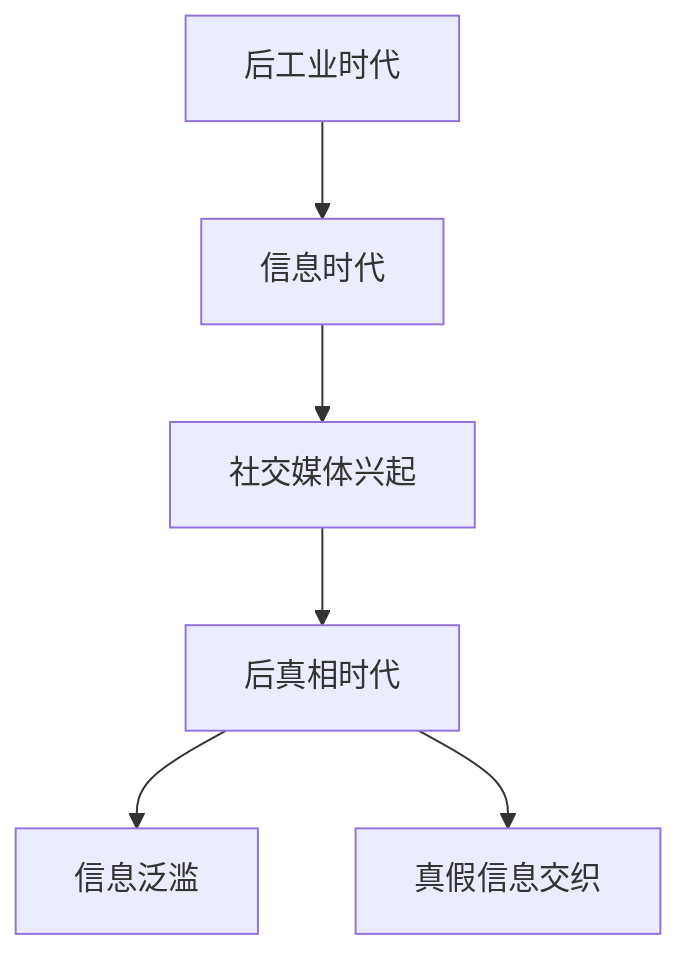
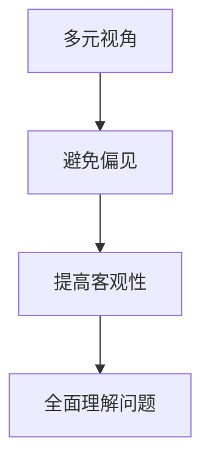

                 

# 后真相时代的批判性思维道场：锻炼辨识能力的空间

> 关键词：后真相时代、批判性思维、辨识能力、社交媒体、信息验证

> 摘要：本文深入探讨了后真相时代的社会背景及其对信息真实性的挑战。通过阐述批判性思维的重要性，文章提出了提升辨识能力的策略，并详细介绍了批判性思维的基本原则和实际应用。文章旨在为读者提供一个锻炼批判性思维的空间，以应对信息化社会中的信息泛滥和虚假信息的困扰。

## 引言

### 后真相时代的特征

后真相时代，一个以情感和主观观点为主导的时代，已经悄然而至。在这一时代，事实与虚构、真相与虚假信息的界限变得模糊，而社交媒体的广泛传播更使得这种模糊性愈发显著。什么是后真相时代？它起源于何处？为何会对信息真实性造成如此巨大的影响？

后真相时代的起源可以追溯到20世纪末，随着互联网的普及和社交媒体的兴起，信息传播的速度和范围得到了前所未有的扩展。传统的新闻媒体逐渐被去中心化的信息平台所取代，个体成为信息的生产者和传播者。然而，这种去中心化的信息传播方式也带来了信息质量的不确定性，使得真相与虚假信息的区分变得更加困难。

在后真相时代，情感和观点往往比事实更能激发公众的共鸣。一个事件的真实情况可能被主观的观点和情感所掩盖，甚至被完全扭曲。这种情况下，真相不再是公共讨论的中心，而是一种工具，被不同利益集团用来争取支持、影响舆论。

### 社交媒体对真相的影响

社交媒体的广泛使用是后真相时代的重要特征之一。社交媒体平台如Facebook、Twitter和Reddit等，使得信息可以在瞬间传播到全球各地。然而，这种快速传播也带来了信息失真和虚假信息的泛滥。以下是社交媒体对真相影响的几个方面：

1. **信息的去中心化**：社交媒体的去中心化特点使得信息来源变得多样，但同时也使得真相的核实变得更加困难。任何人都可以发布信息，而无需经过专业的验证。

2. **情感和观点的传播**：在社交媒体上，情感和观点比事实更容易引起共鸣。一个激动人心的标题或一段煽情的内容往往能够迅速传播，而事实的准确性则常常被忽视。

3. **信息的“回声室效应”**：社交媒体用户往往倾向于关注和分享与自己观点相符的信息，这导致信息的传播呈现出一种“回声室效应”，即用户在信息获取和观点形成上变得越来越封闭，对于不同观点的接受度降低。

4. **虚假信息的传播**：虚假信息在社交媒体上传播的速度和广度往往超过真实信息。一些虚假信息甚至被设计成专业的假新闻，难以被普通用户分辨。

### 信息真实性的挑战

在这样一个信息泛滥和虚假信息充斥的时代，如何辨识真相成为一个严峻的挑战。虚假信息不仅会误导公众，还可能对社会稳定产生负面影响。例如，政治假新闻可能影响选举结果，经济假消息可能引发市场波动，而健康假信息则可能危害公众的健康。

面对这些挑战，批判性思维成为了应对后真相时代的重要工具。批判性思维不仅可以帮助我们分析和评估信息的真实性，还可以培养我们辨识能力，从而更好地应对信息化社会中的各种信息干扰。

## 第1章: 后真相时代的特征与挑战

### 1.1 后真相时代的起源与影响

#### 后真相时代的定义与背景

后真相时代（post-truth era）是一个被广泛讨论的社会现象，它标志着真相与虚假信息之间界限的模糊化。与传统基于事实和证据的社会不同，后真相时代强调的是情感、主观观点和个人信念在信息传播和决策过程中的主导地位。这个时代的到来，既与技术的发展密切相关，也与社会的深刻变革紧密相连。

后真相时代的背景可以追溯到几个关键因素：

1. **信息技术的快速发展**：互联网的普及和社交媒体的兴起，使得信息传播的速度和范围大大增加。任何人都可以成为信息的发布者和传播者，而不需要经过传统媒体的审查和验证。

2. **政治和社会的极化**：政治和社会的极化加剧了公众对真相的怀疑。不同政治派别和利益集团利用虚假信息来争夺公众的支持，进一步模糊了真相与虚假信息的界限。

3. **大众心理的变化**：在信息爆炸的时代，人们往往更倾向于接受那些符合自己观点和情感的信息，而不是客观的事实。这种心理上的选择性接受，使得真相更容易被扭曲和误解。

#### 后真相时代的演变过程

为了更好地理解后真相时代的演变过程，我们可以使用Mermaid流程图来描述这一过程的关键节点：

- **后工业时代**：随着工业革命的兴起，人类社会进入了后工业时代，技术和社会结构发生了重大变革。

- **信息时代**：随着计算机和互联网的普及，信息成为了社会的重要资源，信息传播的速度和范围大大增加。

- **社交媒体兴起**：社交媒体平台的兴起，使得信息传播的去中心化特征更加明显，任何人都可以成为信息的发布者和传播者。

- **后真相时代**：在这个阶段，信息的真实性和可靠性受到严重挑战，情感和主观观点在信息传播中占据主导地位。

- **信息泛滥**：随着信息的急剧增加，人们面临的信息过载问题愈发严重，真假信息交织在一起，使得真相的辨识变得更加困难。

- **真假信息交织**：在信息泛滥的背景下，虚假信息与真相相互交织，导致公众对信息的真实性和可靠性产生怀疑。

#### 后真相时代的起源与影响

后真相时代的起源可以追溯到2000年代初期，随着互联网的普及和社交媒体的兴起，信息传播的模式发生了根本性的变化。社交媒体平台如Facebook、Twitter和Reddit等，使得信息可以在瞬间传播到全球各地。这些平台不仅改变了信息传播的速度和范围，还改变了信息的生产和消费方式。

后真相时代的影响是深远而广泛的：

1. **公众对真相的怀疑**：由于虚假信息的泛滥，公众对信息的真实性和可靠性产生了怀疑，这种怀疑情绪进一步加剧了社会的分裂和极化。

2. **政治和社会的极化**：虚假信息和操纵性信息的传播，使得政治和社会的极化现象更加严重，不同政治派别和利益集团之间的对立愈发明显。

3. **信息传播的去中心化**：传统媒体的权威性受到挑战，信息传播的去中心化趋势加剧，个体成为信息的主要发布者和传播者。

4. **商业和社会风险**：虚假信息不仅对社会稳定构成威胁，还对商业活动产生了负面影响。例如，假新闻可能引发市场波动，误导投资者。

5. **教育和认知挑战**：在信息泛滥的时代，如何培养公众的辨识能力成为一个重要课题。教育系统需要重新思考如何培养学生的批判性思维和媒体素养。

### 1.2 真相与虚假信息的交织

#### 虚假信息与真相的区分

在信息爆炸和社交媒体广泛传播的背景下，如何区分虚假信息与真相成为一个巨大的挑战。虚假信息通常具有以下特点：

1. **缺乏证据支持**：虚假信息往往缺乏可靠的事实依据，其内容可能是完全编造的，或者是经过刻意加工和扭曲的。

2. **煽动性和情感化**：虚假信息往往通过煽动性的语言和情感化的内容来吸引公众的注意，而不是通过逻辑和证据来说服读者。

3. **来源不明**：虚假信息的来源往往难以追溯，许多假新闻网站和账号通过模仿正规媒体的样式和语言来迷惑读者。

4. **目的性**：虚假信息往往具有明确的目的性，可能是为了政治、经济或个人利益而编造和传播的。

相比之下，真相具有以下特点：

1. **证据支持**：真相通常基于可靠的事实和证据，可以通过多种渠道进行验证。

2. **逻辑性**：真相的信息内容通常具有逻辑性和一致性，而不是通过煽动和情感化的语言来吸引读者。

3. **透明性**：真相的来源通常是透明的，可以追溯到具体的出处。

4. **公正性**：真相旨在提供客观、全面的信息，而不是为了特定的目的或利益而操纵信息。

#### 信息验证与核实

为了准确辨识真相和虚假信息，我们需要掌握一定的信息验证和核实技巧。以下是一些常用的方法：

1. **检查来源**：验证信息的来源是否可靠，是否来自权威的机构和媒体。

2. **交叉验证**：通过多个来源验证信息的内容，确保其真实性和准确性。

3. **证据分析**：仔细分析信息中所提供的证据，判断其是否充分、可靠。

4. **专家意见**：咨询相关领域的专家，了解他们的观点和评价。

5. **逻辑推理**：运用逻辑思维，分析信息内容的逻辑性和一致性。

#### 虚假信息的识别技巧

以下是一些识别虚假信息的技巧：

1. **检查语言**：虚假信息往往使用夸张、绝对化和模糊的语言。

2. **注意图片和视频**：在社交媒体上，虚假信息经常使用伪造的图片和视频。可以使用图片识别工具来验证图片的真实性。

3. **搜索信息**：在搜索引擎中搜索相关信息，了解其他人的看法和评论。

4. **使用验证工具**：使用专门的虚假信息验证工具和网站，如Snopes和FactCheck.org。

5. **怀疑一切**：对于来源不明、缺乏证据支持的信息，要持怀疑态度，不要轻易相信。

### 1.3 社交媒体对真相的影响

#### 社交媒体在传播真相与虚假信息中的作用

社交媒体在真相与虚假信息的传播中起着双重作用：

1. **传播真相**：社交媒体是信息快速传播的重要渠道，许多重要新闻和事件都是通过社交媒体平台首先曝光的。同时，社交媒体平台也为公众提供了一个交流和讨论的平台，促进了真相的传播。

2. **传播虚假信息**：社交媒体的广泛传播特性也使得虚假信息能够迅速传播。虚假信息通过社交媒体平台可以迅速扩散到全球各地，甚至可能造成重大的社会影响。

#### 社交媒体信息筛选与解读技巧

为了应对社交媒体上的虚假信息，我们需要掌握一定的信息筛选和解读技巧：

1. **识别信息来源**：了解信息的来源是否可靠，是否经过权威的验证。

2. **分析内容结构**：仔细分析信息的内容结构，判断其是否逻辑严谨、证据充分。

3. **多渠道验证**：通过多个来源验证信息的内容，确保其真实性和准确性。

4. **注意评论和反馈**：在社交媒体上，评论和反馈往往能揭示信息是否真实。注意查看评论中的观点和评论者的背景。

5. **保持怀疑态度**：对于来源不明、证据不足的信息，要持怀疑态度，不要轻易相信。

#### 社交媒体时代的新闻批判

在社交媒体时代，新闻传播的模式发生了根本性的变化。传统媒体的权威性受到挑战，个体和自媒体的影响力逐渐增加。以下是社交媒体时代新闻批判的几个关键点：

1. **去中心化的新闻传播**：社交媒体平台使得信息传播的去中心化趋势更加明显，个体成为信息的主要发布者和传播者。

2. **新闻的真实性与可信度**：在去中心化的新闻传播环境中，如何确保新闻的真实性和可信度成为一个重要问题。社交媒体平台需要加强对信息来源和内容的审核，提高新闻的透明度。

3. **新闻筛选与解读技巧**：公众需要掌握一定的新闻筛选和解读技巧，以识别虚假信息和误导性报道。通过多渠道验证、交叉验证和逻辑分析，可以提高对新闻真实性的判断。

4. **社交媒体的新闻责任**：社交媒体平台在新闻传播中扮演着重要角色，需要承担一定的社会责任。平台应加强对虚假信息的打击，提高新闻的准确性和可信度。

## 第2章: 批判性思维的必要性

### 2.1 批判性思维的定义与作用

#### 批判性思维的概念

批判性思维（critical thinking）是指个体在接收、评估和运用信息时，运用逻辑推理和理性分析的能力。它不仅仅是简单地接受或拒绝信息，而是通过深入的思考和分析，评估信息的真实性、合理性和有效性。

#### 批判性思维的作用

批判性思维在信息辨识中起着至关重要的作用，其作用主要体现在以下几个方面：

1. **评估信息的真实性**：批判性思维可以帮助我们判断信息的来源是否可靠、证据是否充分，从而评估信息的真实性。

2. **分析信息的逻辑性**：通过逻辑分析，我们可以识别信息中的逻辑错误、矛盾和不一致之处，从而评估其合理性。

3. **提升辨识能力**：批判性思维训练可以增强我们的辨识能力，使我们能够更准确地识别真假信息。

4. **促进理性决策**：批判性思维可以帮助我们基于事实和证据做出理性决策，而不是受到情感和偏见的影响。

### 2.2 批判性思维与辨识能力的关系

#### 批判性思维如何增强辨识能力

批判性思维与辨识能力密切相关，通过以下方式可以增强辨识能力：

1. **多角度分析**：批判性思维要求我们从多个角度分析信息，而不是单一视角。这种多角度分析可以帮助我们更全面地理解信息，提高辨识能力。

2. **逻辑推理**：批判性思维强调逻辑推理的重要性，通过逻辑分析可以识别信息中的逻辑错误和矛盾，从而提高辨识能力。

3. **证据评估**：批判性思维要求我们对信息的证据进行评估，判断其是否充分和可靠。这种证据评估能力可以增强我们的辨识能力。

4. **理性分析**：批判性思维强调理性分析，通过理性分析可以消除情感和偏见的影响，从而提高辨识能力。

#### 批判性思维与辨识能力的提升公式

为了更清晰地表达批判性思维与辨识能力之间的关系，我们可以使用以下公式：

$$
提升辨识能力 = f(批判性思维训练, 信息处理能力)
$$

其中：

- **批判性思维训练**：指通过系统的训练和练习，提高个体的批判性思维能力。
- **信息处理能力**：指个体在接收、评估和运用信息的能力。

通过批判性思维训练和信息处理能力的提升，我们可以有效地提高辨识能力，更好地应对后真相时代的信息挑战。

### 2.3 培养批判性思维的重要性

#### 批判性思维在现代社会的重要性

在现代社会，批判性思维的重要性愈发凸显。以下原因说明了为什么批判性思维在现代社会中至关重要：

1. **信息泛滥**：在信息爆炸的时代，如何准确辨识真假信息成为一个重要问题。批判性思维可以帮助我们评估信息的真实性，从而避免被虚假信息误导。

2. **决策复杂**：现代社会中的决策越来越复杂，涉及多个因素和变量。批判性思维可以帮助我们基于事实和证据做出理性决策，而不是受到情感和偏见的影响。

3. **社会问题**：现代社会面临着各种复杂的社会问题，如政治极化、经济不平等和环境污染等。批判性思维可以帮助我们更客观地分析这些问题，找到合理的解决方案。

4. **教育需求**：教育系统需要培养学生的批判性思维，以应对未来社会的挑战。批判性思维不仅有助于学术成就，还有助于培养学生的创新能力和问题解决能力。

#### 批判性思维在信息化社会中的必要性

在信息化社会中，批判性思维的必要性体现在以下几个方面：

1. **信息甄别**：在信息泛滥的背景下，我们需要批判性思维来甄别真假信息，避免被虚假信息误导。

2. **知识运用**：批判性思维可以帮助我们更好地运用知识，解决实际问题。

3. **理性决策**：在面对复杂决策时，批判性思维可以帮助我们基于事实和证据做出理性决策，而不是受到情感和偏见的影响。

4. **创新能力**：批判性思维可以激发我们的创新能力，推动社会进步。

5. **社会稳定**：批判性思维有助于社会成员更好地理解社会问题，从而促进社会稳定和谐。

#### 批判性思维培养路径

为了培养批判性思维，我们需要遵循以下路径：

1. **教育体系**：教育系统应加强批判性思维的培养，设置相关的课程和实践活动。

2. **媒体素养**：公众应提高媒体素养，学会识别真假信息，避免被虚假信息误导。

3. **社会实践**：通过参与社会实践活动，培养批判性思维的实际运用能力。

4. **自我反思**：个体应培养自我反思的习惯，不断审视自己的思维方式和决策过程。

5. **多角度分析**：在分析问题时，要养成多角度分析的习惯，避免片面思维。

## 第3章: 批判性思维的基本原则

### 3.1 理性思考与逻辑分析

#### 理性思考的重要性

理性思考（rational thinking）是批判性思维的核心要素之一。它强调在接收和处理信息时，运用逻辑和理性进行分析，而不是受到情感和偏见的驱使。理性思考的重要性体现在以下几个方面：

1. **决策依据**：理性思考可以帮助我们基于事实和证据做出决策，而不是受到主观偏见的影响。

2. **问题解决**：在面对问题时，理性思考可以帮助我们找到有效的解决方案，而不是陷入无休止的争论。

3. **避免谬误**：通过理性思考，我们可以识别和避免逻辑谬误，从而提高思维的严谨性。

#### 逻辑分析的方法

逻辑分析（logical analysis）是批判性思维的重要组成部分。以下是一些常用的逻辑分析方法：

1. **归纳推理**：从具体案例中归纳出一般性结论。例如，通过观察多个实例，得出“所有猫都有四条腿”的结论。

2. **演绎推理**：从一般性原则推导出具体结论。例如，从“所有人都会死亡”的原则，推导出“苏格拉底会死亡”的结论。

3. **比较分析**：通过比较不同案例或观点，找出它们之间的相似点和差异点，从而更好地理解问题。

4. **因果分析**：分析事物之间的因果关系，找出事件发生的原因和结果。

#### 逻辑分析的例子

以下是一个简单的逻辑分析例子：

- **问题**：为什么天气变暖会导致海平面上升？

- **分析**：

  - **归纳推理**：根据大量观测数据，我们可以归纳出“全球气温上升导致冰川融化”的结论。

  - **演绎推理**：根据“冰川融化导致海水量增加”的原则，我们可以推导出“海平面上升”的结论。

  - **因果分析**：分析气温上升和海平面上升之间的因果关系，发现气温上升导致冰川融化，进而导致海平面上升。

### 3.2 信息验证与核实

#### 信息验证的重要性

信息验证（information verification）是批判性思维中不可或缺的环节。它强调在接收和处理信息时，对信息的真实性和可靠性进行评估。信息验证的重要性体现在以下几个方面：

1. **确保信息真实性**：通过信息验证，我们可以确保接收到的信息是真实的，而不是虚假的。

2. **提高决策质量**：基于真实和可靠的信息做出的决策，往往比基于虚假信息的决策更为准确和有效。

3. **避免误导**：信息验证可以帮助我们避免受到虚假信息的误导，防止因信息错误导致的错误决策。

#### 信息核实的方法

以下是一些常用的信息核实方法：

1. **查证来源**：确认信息的来源是否可靠，是否来自权威的机构和媒体。

2. **交叉验证**：通过多个独立来源验证信息的内容，确保其真实性和准确性。

3. **专家意见**：咨询相关领域的专家，了解他们的观点和评价。

4. **逻辑推理**：运用逻辑推理分析信息的内容，识别其中的逻辑错误和矛盾。

5. **证据评估**：评估信息中所提供的证据是否充分、可靠。

#### 信息核实的过程

信息核实的过程可以分为以下几个步骤：

1. **初步筛选**：对信息进行初步筛选，排除明显虚假或来源不明的信息。

2. **查证来源**：对剩余的信息进行来源核实，确认其来源是否可靠。

3. **交叉验证**：通过多个独立来源验证信息的内容，确保其真实性和准确性。

4. **逻辑分析**：运用逻辑分析，评估信息的逻辑性和一致性。

5. **证据评估**：评估信息中所提供的证据是否充分、可靠。

6. **综合判断**：综合以上分析结果，对信息进行综合判断，确定其真实性和可靠性。

### 3.3 多元视角与客观性

#### 多元视角的重要性

多元视角（multi-perspective）是批判性思维的重要组成部分。它强调在分析问题时，要从多个角度和立场进行思考，而不是单一视角。多元视角的重要性体现在以下几个方面：

1. **全面理解问题**：通过多元视角，我们可以更全面地理解问题，发现问题的不同方面和潜在矛盾。

2. **避免偏见**：多元视角可以帮助我们避免陷入偏见，从而做出更为客观和公正的判断。

3. **提高创造力**：多元视角可以激发我们的创造力，从不同的角度和立场出发，找到创新的解决方案。

#### 客观性的追求

客观性（objectivity）是批判性思维追求的目标之一。它强调在分析问题时，要尽量排除主观偏见和情感的影响，以事实为基础，进行客观分析。以下是如何追求客观性的几个建议：

1. **保持中立立场**：在分析问题时，要保持中立立场，避免受到个人情感和偏见的影响。

2. **多角度分析**：从多个角度和立场出发，分析问题的各个方面，以获得更全面的理解。

3. **证据支持**：以事实和证据为基础，进行客观分析，避免仅凭主观观点或猜测做出判断。

4. **逻辑推理**：运用逻辑推理，分析问题的内在逻辑和因果关系，避免逻辑错误和主观偏见。

#### 多元视角与客观性的关系

多元视角和客观性密切相关。多元视角可以帮助我们避免陷入偏见，从而提高客观性。而客观性则是多元视角追求的目标之一，通过追求客观性，我们可以更全面、准确地理解问题。

为了更好地理解多元视角与客观性的关系，我们可以使用以下Mermaid流程图：

其中：

- **多元视角**：指从多个角度和立场进行思考。
- **避免偏见**：通过多元视角，我们可以避免陷入单一视角的偏见。
- **提高客观性**：多元视角有助于我们进行客观分析，提高客观性。
- **全面理解问题**：通过多元视角和客观性，我们可以更全面地理解问题。

通过这个流程图，我们可以更清晰地看到多元视角和客观性之间的关系，以及它们在批判性思维中的作用。

### 3.4 批判性思维的应用

#### 批判性思维在不同领域的应用

批判性思维不仅在理论层面上具有重要意义，也在实际应用中发挥着重要作用。以下是在不同领域应用批判性思维的一些例子：

1. **科学领域**：科学家在研究过程中，需要运用批判性思维来评估假设、设计实验和解释结果。例如，在医学研究中，批判性思维可以帮助研究人员识别和排除潜在的错误，确保研究的可靠性和有效性。

2. **商业领域**：在商业决策中，批判性思维可以帮助企业主和管理者分析市场趋势、评估风险和制定策略。例如，在产品开发过程中，批判性思维可以帮助团队识别潜在的问题，优化产品设计，提高市场竞争力。

3. **法律领域**：在法律实践中，批判性思维对于法官、律师和律师助理至关重要。他们需要运用批判性思维分析案件的事实和法律条款，为案件提供合理的判决和辩护。

4. **教育领域**：在教学中，批判性思维可以帮助教师设计教学策略，引导学生思考和分析问题。例如，在课程讨论中，教师可以运用批判性思维引导学生质疑现有观点，提出新的问题和解决方案。

5. **日常生活中**：在日常生活中，批判性思维可以帮助我们做出更明智的决策，应对各种挑战。例如，在购物时，我们可以运用批判性思维评估产品的质量和价格，避免被虚假广告误导。

#### 批判性思维在不同领域的具体应用

以下是一个在商业领域应用批判性思维的例子：

**案例：新产品开发**

假设某公司计划开发一款新型手机，以下是运用批判性思维的具体步骤：

1. **明确目标**：首先，公司需要明确新产品的目标市场、功能和特点。例如，目标市场是年轻用户，功能包括高清晰度摄像头和快速充电。

2. **市场调研**：通过市场调研，收集关于目标市场的需求和竞争对手的信息。例如，通过问卷调查、焦点小组讨论和在线调查，了解年轻用户对手机的需求和偏好。

3. **分析需求**：运用批判性思维分析调研结果，识别潜在的市场机会和风险。例如，通过比较竞争对手的产品特点，发现新产品的优势和潜在的改进空间。

4. **设计产品**：根据分析结果，设计新产品。例如，基于用户需求和市场竞争，确定新手机的功能、设计和价格策略。

5. **测试和优化**：在新产品开发过程中，进行多次测试和优化，确保产品符合用户需求和期望。例如，通过用户测试和反馈，改进产品的功能和用户体验。

6. **评估效果**：在产品上市后，评估新产品的市场表现和用户反馈，分析成功的原因和改进的方向。例如，通过销售数据和用户评价，了解新产品的市场接受度和改进点。

通过这个案例，我们可以看到批判性思维在商业决策中的应用过程。通过系统的分析和评估，公司可以更好地开发新产品，满足市场需求，提高市场竞争力。

### 3.5 批判性思维的实践步骤

为了培养批判性思维，我们需要遵循以下实践步骤：

1. **明确问题**：首先，明确需要分析和解决的问题。这可以是任何领域的问题，如科学研究、商业决策或日常生活中的挑战。

2. **收集信息**：收集与问题相关的信息，包括数据、文献、报告和专家意见。确保信息的来源可靠，避免被误导。

3. **分析信息**：运用批判性思维工具，如归纳推理、演绎推理、比较分析和因果分析，对信息进行深入分析。识别信息中的逻辑错误、矛盾和不一致之处。

4. **评估信息**：评估信息的真实性和可靠性。通过查证来源、交叉验证和专家意见，确保信息的准确性和有效性。

5. **提出假设**：基于分析结果，提出可能的假设或解决方案。这可以是对现有观点的质疑，也可以是新的创新思路。

6. **论证假设**：运用逻辑推理和证据支持，论证假设的合理性和可行性。通过批判性思维，识别和反驳潜在的异议。

7. **决策和实施**：根据论证结果，做出决策并实施。这可以是科学研究中的实验设计，商业决策中的产品开发，或日常生活中的决策。

8. **评估效果**：在决策实施后，评估结果的有效性和影响。通过反馈和调整，不断优化决策和实施过程。

通过遵循这些实践步骤，我们可以逐步培养批判性思维，提高问题的分析和解决能力。

### 3.6 批判性思维的实际案例

为了更好地理解批判性思维的实际应用，以下是一个具体的案例：

**案例：评估某种健康食品的有效性**

**问题**：某种健康食品声称能够提高免疫力，我们需要评估其有效性和可靠性。

**步骤**：

1. **明确问题**：明确需要评估的问题是某种健康食品是否能够提高免疫力。

2. **收集信息**：收集与该健康食品相关的信息，包括产品宣传、科学研究论文、用户评价和专家意见。

3. **分析信息**：

   - **归纳推理**：通过分析科学研究和用户评价，归纳出该健康食品的主要成分和潜在作用。

   - **演绎推理**：基于健康食品的成分和作用，推导出其可能对免疫力的影响。

   - **比较分析**：比较该健康食品与其他提高免疫力的方法，分析其优缺点。

   - **因果分析**：分析科学研究中的因果关系，识别影响免疫力的关键因素。

4. **评估信息**：

   - **查证来源**：验证科学研究和用户评价的来源是否可靠，确保信息的准确性。

   - **交叉验证**：通过多个独立来源验证信息的真实性和可靠性。

   - **专家意见**：咨询医学专家，了解他们的观点和评价。

5. **提出假设**：基于分析结果，提出假设，例如“该健康食品可能有助于提高免疫力”。

6. **论证假设**：

   - **逻辑推理**：运用逻辑推理，论证假设的合理性和可行性。

   - **证据支持**：提供科学研究数据和用户评价作为证据支持假设。

7. **决策和实施**：如果论证结果支持假设，考虑是否购买该健康食品，并观察其效果。

8. **评估效果**：在购买后，观察该健康食品对免疫力的影响，并进行反馈和调整。

通过这个案例，我们可以看到批判性思维在评估健康食品有效性中的应用过程。通过系统的分析和评估，我们可以更准确地判断健康食品的有效性和可靠性。

### 第4章: 批判性思维在新闻传播中的应用

#### 新闻的真实性与可信度

在信息爆炸的时代，新闻的真实性和可信度受到了前所未有的挑战。新闻传播的快速性和广泛性，使得虚假新闻（fake news）和误导性信息（misinformation）得以迅速传播，对公众和社会产生了深远的影响。以下是对新闻真实性和可信度的分析：

1. **虚假新闻的来源**：虚假新闻的来源多种多样，包括恶意黑客、虚假新闻网站、政治宣传机构等。这些来源往往利用煽动性的标题、夸张的描述和伪造的图片、视频来吸引读者的注意。

2. **虚假新闻的传播方式**：社交媒体是虚假新闻传播的主要渠道。由于社交媒体的匿名性和去中心化特性，虚假新闻可以在短时间内迅速传播，并引发公众的恐慌和误解。

3. **虚假新闻的影响**：虚假新闻不仅误导公众，还可能对社会产生负面影响。例如，政治假新闻可能影响选举结果，健康假新闻可能导致公众采取错误的健康措施，经济假新闻可能引发市场波动。

#### 新闻筛选与解读技巧

为了应对虚假新闻的挑战，公众需要掌握一定的新闻筛选与解读技巧。以下是一些实用的技巧：

1. **检查信息来源**：在接收新闻时，首先要检查信息来源是否可靠。权威的新闻机构、政府官方网站和学术机构发布的信息往往具有较高的可信度。

2. **交叉验证**：通过多个来源验证新闻的真实性。如果多个可靠来源都报道了同一事件，那么该事件的可信度通常会更高。

3. **注意标题和描述**：虚假新闻往往使用夸张的标题和描述来吸引读者的注意。在阅读新闻时，要注意标题和描述是否与正文内容相符。

4. **查看图片和视频**：在社交媒体上，虚假新闻经常使用伪造的图片和视频。可以使用图片识别工具或视频分析软件来验证图片和视频的真实性。

5. **关注评论和反馈**：在社交媒体上，评论和反馈往往能揭示新闻的真实性。注意查看评论中的观点和评论者的背景，避免被误导。

6. **培养批判性思维**：通过批判性思维训练，提高对新闻信息的辨识能力。学会运用逻辑分析和证据评估，识别虚假信息和误导性报道。

#### 社交媒体时代的新闻批判

在社交媒体时代，新闻批判（media critique）变得尤为重要。以下是对社交媒体时代新闻批判的几个关键点：

1. **去中心化的新闻传播**：社交媒体平台使得新闻传播的去中心化趋势更加明显。个体和自媒体成为新闻的主要发布者和传播者，传统的新闻机构和权威性受到了挑战。

2. **新闻的真实性与可信度**：在去中心化的新闻传播环境中，如何确保新闻的真实性和可信度成为一个重要问题。社交媒体平台需要加强对信息来源和内容的审核，提高新闻的透明度。

3. **新闻筛选与解读技巧**：公众需要掌握一定的新闻筛选和解读技巧，以识别虚假信息和误导性报道。通过多渠道验证、交叉验证和逻辑分析，可以提高对新闻真实性的判断。

4. **社交媒体的新闻责任**：社交媒体平台在新闻传播中扮演着重要角色，需要承担一定的社会责任。平台应加强对虚假信息的打击，提高新闻的准确性和可信度。

5. **新闻批判与公众参与**：新闻批判不仅需要专业人士的参与，还需要公众的积极参与。公众可以通过关注新闻批判、提出质疑和参与讨论，共同维护新闻的真实性和可信度。

通过以上分析，我们可以看到批判性思维在新闻传播中的应用具有重要意义。在面对虚假新闻和误导性信息的挑战时，批判性思维可以帮助我们提高辨识能力，确保新闻的真实性和可信度，从而为公众提供准确、可靠的信息。

### 第5章: 批判性思维在教育领域的实践

#### 教育中的批判性思维培养

在教育领域，批判性思维的培养变得尤为重要。批判性思维不仅是学术成功的关键，也是培养学生综合素质和应对未来挑战的重要工具。以下是如何在教育中培养批判性思维的一些方法：

1. **课程设计**：教育者应在课程设计中融入批判性思维的元素。例如，在历史课程中，教师可以引导学生分析历史事件的不同观点，培养他们的批判性思维能力。

2. **问题导向学习**：问题导向学习（problem-based learning, PBL）是一种有效的培养批判性思维的方法。通过让学生解决实际问题，他们可以学会如何分析和评估信息，并形成自己的观点。

3. **案例分析**：教师可以通过案例分析来培养学生的批判性思维。例如，在商业课程中，教师可以提供真实的商业案例，让学生分析企业面临的问题和挑战，并提出解决方案。

4. **讨论和辩论**：讨论和辩论是培养批判性思维的有效途径。通过小组讨论和辩论，学生可以学会如何表达自己的观点，并倾听和理解他人的观点。

5. **跨学科学习**：跨学科学习可以帮助学生从不同角度理解问题，培养批判性思维。例如，在科学、技术和社会科学之间建立联系，可以让学生更全面地看待问题。

#### 学生批判性思维的引导

为了有效地引导学生的批判性思维，教师可以采取以下策略：

1. **提问技巧**：教师应学会使用开放性问题，鼓励学生思考和讨论。例如，“你如何解释这个现象？”或“这个观点有哪些证据支持？”

2. **提供反馈**：教师应给予学生及时的反馈，帮助他们识别和纠正思维中的错误。例如，当学生提出不合理或偏颇的观点时，教师可以引导他们重新思考。

3. **鼓励质疑**：教师应鼓励学生质疑权威和现有的观点。例如，教师可以提出问题，让学生思考为什么某些观点被认为是正确的，以及是否有其他可能的角度。

4. **培养阅读理解能力**：批判性思维与阅读理解密切相关。教师应培养学生的阅读理解能力，帮助他们理解文本中的逻辑关系和论点。

5. **使用批判性思维工具**：教师可以教授学生一些批判性思维工具，如归纳推理、演绎推理、比较分析和因果分析，帮助他们更系统地分析问题。

#### 教育评价与批判性思维的关系

教育评价（assessment）与批判性思维培养密切相关。以下是如何通过教育评价促进批判性思维的一些方法：

1. **项目评估**：通过项目评估，教师可以评估学生在解决问题和进行批判性分析方面的能力。例如，在完成一个项目后，教师可以要求学生提交项目报告，分析他们的思考过程和结论。

2. **论文和报告**：通过论文和报告的评估，教师可以评估学生的批判性思维能力。例如，教师可以要求学生在论文中提出自己的观点，并提供充分的证据支持。

3. **模拟考试**：模拟考试是一种有效的评估方法，可以评估学生在实际情境中应用批判性思维的能力。例如，教师可以设计一些模拟问题，让学生在限定时间内进行分析和解答。

4. **反馈和改进**：教育评价不仅仅是评估学生的表现，更重要的是提供反馈和改进的机会。教师应在评价过程中给予学生具体的反馈，帮助他们识别和改进思维中的不足。

5. **持续评估**：批判性思维的培养是一个持续的过程，教师应通过持续的评估和反馈，帮助学生不断提高批判性思维能力。

#### 批判性思维在课堂教学中的应用

以下是一个批判性思维在课堂教学中的应用案例：

**案例：历史课中的批判性思维训练**

**课程内容**：在历史课上，教师讲解了一个关于第二次世界大战的重要事件——诺曼底登陆。

**教学目标**：通过分析诺曼底登陆的历史背景、过程和影响，培养学生的批判性思维能力。

**教学步骤**：

1. **导入**：教师通过播放一段关于诺曼底登陆的视频，激发学生的兴趣。

2. **讲解历史背景**：教师简要介绍诺曼底登陆的历史背景，包括盟军为何选择诺曼底作为登陆地点，以及德国在当地的防御部署。

3. **分析过程**：教师引导学生分析诺曼底登陆的过程，包括盟军的作战计划、战斗中的关键节点和盟军的胜利原因。

4. **讨论影响**：教师与学生一起讨论诺曼底登陆对第二次世界大战的进程和结果的影响。

5. **批判性思考**：教师提出一系列问题，引导学生进行批判性思考：

   - **逻辑分析**：为什么盟军选择诺曼底登陆？这个决定是否合理？

   - **证据评估**：盟军在战斗中使用了哪些策略？这些策略是否有效？

   - **多元视角**：不同历史学者对诺曼底登陆的评价有何不同？

6. **总结**：教师总结课堂讨论，强调批判性思维在理解历史事件中的重要性。

通过这个案例，我们可以看到批判性思维在课堂教学中的应用。通过引导学生的批判性思考，教师可以培养学生的逻辑分析、证据评估和多元视角能力，从而提高他们的批判性思维能力。

### 第6章: 批判性思维在日常生活中的应用

#### 购物与消费批判性思维

在购物和消费过程中，批判性思维可以帮助我们做出更加明智的决策，避免被广告和营销手段误导。以下是如何在日常购物中运用批判性思维的一些方法：

1. **评估广告的真实性**：广告往往是营销策略的一部分，为了吸引消费者购买产品。我们需要运用批判性思维，评估广告的真实性。例如，查看广告中的证据是否可靠，广告中的比较是否公平。

2. **比较不同品牌和产品**：在购物时，我们应该比较不同品牌和产品，分析它们的优缺点。例如，查看产品的价格、功能、性能和用户评价，以便做出更合理的决策。

3. **避免冲动购物**：冲动购物往往基于情感，而不是理性分析。我们需要运用批判性思维，评估自己的购买需求，避免因为广告或情绪的影响而做出非理性的消费决策。

4. **制定购物清单**：在购物前，制定一个详细的购物清单，并按照清单进行购买。这有助于我们集中注意力，避免被无关的商品分散注意力。

5. **关注售后服务**：在购买重要商品时，我们需要关注售后服务。例如，查看产品的保修期限、退换货政策等，以确保我们的权益。

#### 人际关系中的批判性思维

在人际关系中，批判性思维可以帮助我们更好地理解和处理复杂的人际关系，避免误解和冲突。以下是如何在日常人际交往中运用批判性思维的一些方法：

1. **理解对方观点**：在沟通时，我们需要运用批判性思维，试图理解对方的观点和立场。这有助于建立有效的沟通，避免误解和冲突。

2. **避免情感偏见**：在处理人际关系时，我们往往受到情感的影响。我们需要运用批判性思维，识别和避免情感偏见，保持客观和理性。

3. **评估沟通效果**：在沟通后，我们需要反思和评估沟通的效果。例如，思考对方的反应是否积极，我们的表达方式是否恰当。

4. **寻求第三方意见**：在处理复杂的人际关系时，我们可以寻求第三方的意见。例如，咨询亲朋好友或专业人士，以获得不同的视角和建议。

5. **解决冲突**：当出现冲突时，我们需要运用批判性思维，分析冲突的原因和解决方法。例如，通过对话和妥协，找到双方都能接受的解决方案。

#### 社会问题中的批判性思维

在面对社会问题时，批判性思维可以帮助我们更客观地分析问题，并提出有效的解决方案。以下是如何在社会问题中运用批判性思维的一些方法：

1. **分析问题的根源**：我们需要运用批判性思维，分析社会问题的根源。例如，探讨问题的历史背景、社会经济因素和政治影响。

2. **评估解决方案的可行性**：在提出解决方案时，我们需要运用批判性思维，评估这些解决方案的可行性。例如，考虑解决方案的成本、实施难度和预期效果。

3. **多元视角**：在分析社会问题时，我们需要从多个角度进行思考。例如，考虑不同社会群体的利益和观点，以获得更全面的理解。

4. **证据支持**：在提出解决方案时，我们需要基于事实和证据。例如，参考相关的调查研究、统计数据和专家意见。

5. **持续反思**：在实施解决方案后，我们需要持续反思和评估其效果。例如，通过反馈和调整，不断优化解决方案。

通过以上方法，我们可以更好地运用批判性思维，解决日常生活中的各种问题，提高决策质量，促进个人和社会的进步。

### 第7章: 案例分析与批判性思维实践

#### 案例背景与问题分析

为了更好地理解批判性思维的实际应用，以下是一个具体的案例：

**案例背景**：某城市近日发生了一起关于垃圾分类问题的争议。市政府推出了一项新的垃圾分类政策，要求居民将垃圾分为四类：可回收物、有害垃圾、湿垃圾和干垃圾。然而，许多居民对这项政策表示不满，认为垃圾分类过于复杂，且在实际操作中难以实施。

**问题分析**：

1. **政策合理性**：政策制定的初衷是什么？是否经过科学的评估和论证？

2. **居民接受度**：居民对政策的接受程度如何？是否存在沟通和执行上的问题？

3. **政策实施效果**：垃圾分类政策在实际执行中是否达到了预期效果？是否存在改进的空间？

#### 批判性思维应用分析

为了解决上述问题，我们可以运用批判性思维进行以下分析：

1. **政策评估**：

   - **初衷评估**：市政府推出垃圾分类政策的初衷是改善城市环境、减少垃圾处理压力和保护自然资源。这一点符合环保和社会可持续发展的目标。

   - **科学评估**：市政府是否进行了科学评估和论证？例如，是否进行了民意调查、环境影响评估和成本效益分析？

2. **居民接受度**：

   - **沟通与宣传**：市政府是否进行了充分的沟通和宣传，让居民了解政策的背景、目的和具体操作方法？

   - **居民反馈**：居民对政策的反馈如何？是否存在误解和抵触情绪？

3. **政策实施效果**：

   - **实际执行**：垃圾分类政策在实际执行中是否遇到困难？例如，居民是否愿意改变生活习惯，垃圾分类设施是否完备？

   - **效果评估**：垃圾分类政策是否达到了预期效果？例如，垃圾处理效率是否提高，环境质量是否改善？

#### 批判性思维实践过程

以下是运用批判性思维解决垃圾分类问题的一个具体实践过程：

1. **问题定义**：明确垃圾分类问题的主要矛盾和关键点，例如政策制定、居民接受度、政策实施效果等。

2. **信息收集**：

   - **政策文件**：收集市政府发布的垃圾分类政策文件和相关报告。

   - **居民意见**：通过问卷调查、座谈会和媒体报道等方式，收集居民对政策的看法和意见。

   - **实际案例**：了解其他城市在垃圾分类政策实施中的经验和教训。

3. **逻辑分析**：

   - **政策初衷**：分析市政府推出垃圾分类政策的初衷，评估其合理性和必要性。

   - **居民接受度**：评估市政府在沟通和宣传方面的效果，分析居民对政策的接受程度。

   - **政策实施效果**：评估垃圾分类政策在实际执行中的效果，识别存在的问题和改进的方向。

4. **证据评估**：

   - **政策文件**：验证政策文件中的数据和信息是否真实可靠。

   - **居民意见**：分析居民意见的合理性和代表性，区分事实和偏见。

   - **实际案例**：借鉴其他城市的成功经验和教训，为本地政策提供参考。

5. **解决方案**：

   - **政策调整**：根据分析结果，提出政策调整建议，例如简化分类标准、加强宣传和指导等。

   - **执行改进**：制定详细的执行计划，确保政策能够得到有效实施。

6. **持续评估**：

   - **效果监测**：建立政策实施效果的监测机制，定期评估政策效果。

   - **反馈调整**：根据评估结果，及时调整政策内容和执行方式。

#### 案例总结与启示

通过上述案例分析，我们可以得出以下总结和启示：

1. **政策制定需科学评估**：政策制定者需要基于科学评估和实证研究，制定合理、可行的政策。

2. **沟通宣传至关重要**：政策制定者需加强与居民的沟通和宣传，确保政策得到公众的理解和支持。

3. **持续评估和改进**：政策实施过程中，需建立持续评估和反馈机制，及时发现问题并加以改进。

4. **借鉴成功经验**：学习其他城市的成功经验，为本地的政策实施提供有益的参考。

5. **批判性思维的应用**：批判性思维在政策制定、执行和评估中具有重要作用，有助于提高政策的科学性和有效性。

通过这个案例，我们可以看到批判性思维在实际问题解决中的应用过程。通过系统的分析和评估，我们可以更好地理解问题，提出有效的解决方案，从而推动社会的进步和发展。

### 第8章: 未来展望与批判性思维的重要性

#### 批判性思维在信息化社会中的作用

在信息化社会，批判性思维的作用愈发重要。信息化社会意味着信息传播速度极快，信息量巨大，真假信息交织，这对个体的信息辨识能力提出了严峻挑战。批判性思维可以帮助我们：

1. **准确辨识信息**：在面对大量信息时，批判性思维可以帮助我们区分真假信息，避免被虚假信息误导。

2. **理性决策**：在复杂的社会环境中，批判性思维可以帮助我们基于事实和证据做出理性决策，而不是受到情感和偏见的影响。

3. **创新思考**：批判性思维可以激发我们的创新能力，推动社会进步和科技创新。

#### 新时代批判性思维的挑战与机遇

新时代的批判性思维面临着新的挑战和机遇：

**挑战**：

1. **信息泛滥**：随着互联网和社交媒体的普及，信息量呈爆炸式增长，这使得信息筛选和辨识变得更加困难。

2. **技术变革**：人工智能和自动化技术的发展，改变了信息的生产和传播方式，这对传统批判性思维提出了挑战。

3. **信息污染**：虚假信息和误导性信息的泛滥，使得社会对信息的信任度降低，这需要我们更加重视批判性思维的培养。

**机遇**：

1. **教育普及**：随着教育水平的提高，公众对批判性思维的认知和接受度逐渐提高，这为批判性思维的普及提供了良好的基础。

2. **技术支持**：大数据和人工智能技术的发展，为批判性思维的实践提供了新的工具和方法，有助于我们更高效地分析和评估信息。

3. **社会需求**：在信息化社会中，公众对高质量信息的需求日益增长，这为批判性思维的应用提供了广阔的市场和机遇。

#### 构建批判性思维社会的重要性

构建一个批判性思维社会，对于应对信息化社会的挑战具有重要意义：

1. **提高社会整体素养**：通过批判性思维的普及，提高公众的信息辨识能力和理性思维能力，有助于构建一个更加理性、包容和进步的社会。

2. **促进科技创新**：批判性思维可以激发创新思维，推动科技创新和社会进步。

3. **增强社会稳定**：通过批判性思维，公众可以更好地理解社会问题，增强对社会发展的信心，有助于社会稳定和和谐。

4. **培养下一代**：在教育系统中融入批判性思维培养，有助于培养具有批判精神和创新能力的新一代，为未来社会的发展奠定基础。

总之，批判性思维在信息化社会中具有不可替代的作用。通过构建批判性思维社会，我们可以更好地应对信息时代的挑战，推动社会进步和发展。呼吁社会各界共同努力，提高批判性思维的意识和能力，共同构建一个理性、包容和进步的社会。作者：AI天才研究院/AI Genius Institute & 禅与计算机程序设计艺术 /Zen And The Art of Computer Programming。

