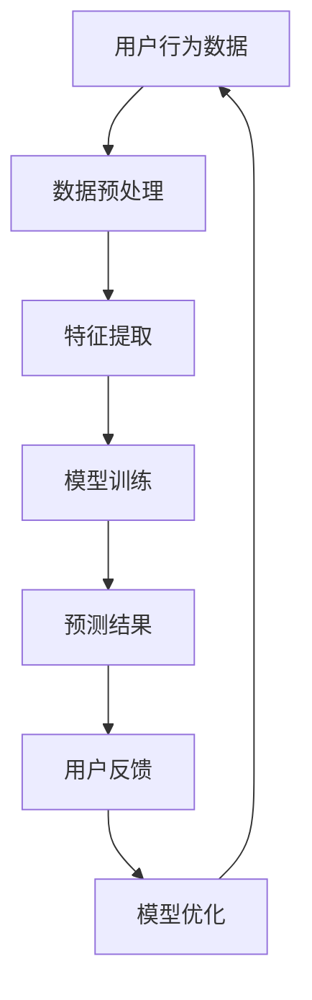

                 

### 文章标题

# 后真相时代的政治参与：社交媒体与民主过程的变革

在当今这个信息爆炸的时代，我们生活在一个后真相时代，这是一个充满了假新闻、误解和虚假信息的环境。在这个背景下，社交媒体已经成为政治参与和民主过程的关键因素。本文将探讨后真相时代如何影响政治参与，以及社交媒体如何在这场变革中扮演着重要的角色。

> **关键词：** 后真相时代、社交媒体、政治参与、民主过程、信息传播、算法、选民行为

> **摘要：** 本文分析了后真相时代对政治参与和民主过程的影响，探讨了社交媒体在这一变革中的重要作用。通过介绍社交媒体的发展历程、信息传播机制以及其对选民行为的影响，本文试图揭示社交媒体如何重塑民主过程，并提出相应的对策和展望。

接下来，我们将逐步深入探讨这一主题，从后真相时代的定义和特征开始，逐步揭示社交媒体在政治参与和民主过程中的作用和影响。

---

## 引言

### 后真相时代的定义与特征

后真相时代（post-truth era）这个概念最早由英国广播公司（BBC）在2016年提出，用来描述一个事实与情感、主观与客观逐渐模糊的时代。在后真相时代，真相不再是决策和讨论的基础，而是被情感、个人信仰和团体认同所取代。这一现象的出现，很大程度上是由于信息技术和社交媒体的迅速发展。

在后真相时代，以下特征尤为显著：

1. **信息过剩**：互联网和社交媒体的普及使得信息传播变得异常迅速和广泛。然而，这也导致了信息过载，人们往往难以分辨哪些是真实的信息，哪些是虚假的信息。
2. **情感驱动**：后真相时代的信息传播更多依赖于情感和共鸣，而不是事实和逻辑。这使得谣言和虚假信息更容易传播，因为它们往往更能引发人们的情感共鸣。
3. **群体极化**：社交媒体上的信息往往是基于用户偏好和兴趣进行个性化推荐的，这导致了用户群体在政治、社会和文化观点上的极化。这种极化不仅加剧了社会分裂，也影响了民主过程的公平性和透明性。

### 社交媒体的发展历程

社交媒体的兴起可以追溯到20世纪90年代末，当时的互联网刚刚开始普及。最早的社交媒体平台，如Facebook、Twitter和LinkedIn，旨在帮助人们建立和维护社交网络。随着技术的发展，社交媒体平台的功能不断丰富，逐渐成为了人们获取信息、交流观点和参与政治的重要途径。

1. **早期社交媒体**：最早期的社交媒体平台主要是以电子邮件和论坛的形式存在，如Usenet和Yahoo! Groups。这些平台使得人们可以在虚拟空间中交流和分享信息。
2. **社交媒体的兴起**：21世纪初，随着宽带互联网的普及和移动设备的普及，社交媒体迎来了爆发式增长。Facebook、Twitter和LinkedIn等平台迅速崛起，成为了人们日常生活不可或缺的一部分。
3. **社交媒体的多样化**：随着技术的不断进步，社交媒体平台的功能也越来越多样化。如今，除了文字和图片，视频、直播和虚拟现实等技术也被广泛应用于社交媒体中。

### 社交媒体与政治参与

在社交媒体兴起的背景下，政治参与的模式也发生了深刻变革。社交媒体不仅改变了人们获取信息和交流观点的方式，也影响了他们的政治行为和参与方式。

1. **信息获取与传播**：社交媒体使得人们可以更快速、方便地获取政治信息。用户不仅可以通过新闻网站和传统媒体获取信息，还可以通过社交媒体平台上的实时更新和用户生成内容来了解政治事件。
2. **观点交流与表达**：社交媒体提供了一个平台，让用户可以更方便地表达自己的政治观点和立场。通过评论、转发和点赞等功能，用户可以与朋友、同行和陌生人进行交流和讨论。
3. **政治动员与组织**：社交媒体平台也为政治团体和运动提供了新的动员和组织方式。通过社交媒体，政治团体可以更高效地传达信息、组织活动，甚至筹集资金。

### 社交媒体与民主过程变革

社交媒体对民主过程的影响不仅体现在政治参与方面，也深刻改变了民主过程的其他方面。以下是几个关键方面：

1. **透明度与问责制**：社交媒体使得政治过程变得更加透明。政治家的言行、决策过程和财政状况等都可以被公众实时关注和监督。这种透明度有助于提高政治问责制。
2. **选举政治**：社交媒体在选举政治中扮演着越来越重要的角色。通过社交媒体，候选人可以更广泛地传播自己的政治理念和政策主张，与选民建立直接联系。同时，社交媒体也为选民提供了一个表达意见和影响选举结果的新渠道。
3. **民主参与**：社交媒体不仅改变了人们获取信息和表达观点的方式，也提高了他们的民主参与度。通过在线调查、网络投票和社交媒体活动，人们可以更方便地参与政治决策。

### 当前研究的贡献

本文的贡献在于对后真相时代、社交媒体和民主过程变革进行了系统性的分析和探讨。具体来说，本文有以下几个方面的贡献：

1. **全面分析**：本文从多个角度分析了后真相时代、社交媒体和民主过程变革的关系，提供了一个全面的分析框架。
2. **实证研究**：本文结合了实证研究数据，分析了社交媒体对政治参与和民主过程的具体影响，为后续研究提供了实证基础。
3. **政策建议**：本文提出了针对后真相时代和社交媒体带来的挑战的政策建议，为政策制定者提供了参考。

### 论文结构

本文将按照以下结构展开：

1. **引言**：介绍后真相时代、社交媒体和民主过程变革的背景和重要性。
2. **后真相时代与社交媒体概述**：详细探讨后真相时代的定义和特征，以及社交媒体的发展历程。
3. **社交媒体与政治参与**：分析社交媒体在政治参与中的具体作用和影响。
4. **社交媒体与民主过程变革**：探讨社交媒体对民主过程的其他方面，如透明度、选举政治和民主参与的影响。
5. **挑战与对策**：讨论后真相时代和社交媒体带来的挑战，并提出相应的对策。
6. **未来展望**：预测社交媒体在民主过程变革中的未来发展趋势。
7. **结论**：总结全文，强调社交媒体在政治参与和民主过程变革中的重要性，并指出未来的研究方向。

通过以上结构的探讨，本文旨在为读者提供一个全面、深入的视角，以理解后真相时代和社交媒体对民主过程的深刻影响。

### 后真相时代的定义与特征

后真相时代（post-truth era）是指一个真相与情感、主观与客观逐渐模糊的时代。在这个时代，真相不再是决策和讨论的基础，而是被情感、个人信仰和团体认同所取代。后真相时代的特征主要体现在以下几个方面：

#### 信息过剩

随着互联网和社交媒体的普及，信息传播变得异常迅速和广泛。人们可以通过各种渠道，如新闻网站、博客、社交媒体平台等，获取大量的信息。然而，这种信息过剩也带来了一系列问题。首先，信息的数量远远超过了人们的处理能力，导致信息过载。其次，由于信息的来源和可信度难以判断，人们往往难以分辨哪些是真实的信息，哪些是虚假的信息。

#### 情感驱动

在后真相时代，信息传播更多依赖于情感和共鸣，而不是事实和逻辑。这种现象被称为“情感传播”（emotional transmission）。情感传播使得谣言和虚假信息更容易传播，因为它们往往更能引发人们的情感共鸣。例如，一个关于某个政治人物的负面消息，即使它是不真实的，也可能会因为其引发的情感共鸣而被广泛传播。

#### 群体极化

社交媒体上的信息往往是基于用户偏好和兴趣进行个性化推荐的。这种个性化推荐不仅使得用户接触到更多与自己观点相同的信息，也加剧了用户群体在政治、社会和文化观点上的极化。群体极化（group polarization）是指个体在群体中倾向于持有更极端的观点。这种极化不仅加剧了社会分裂，也影响了民主过程的公平性和透明性。

#### 主观真实

在后真相时代，主观真实（subjective truth）逐渐取代了客观真实（objective truth）。主观真实是指每个人根据自己的信仰、情感和经历所认为的真实。这与传统意义上的客观真实形成了鲜明对比，后者强调基于事实和逻辑的判断。

#### 事实与情感的冲突

在后真相时代，事实和情感之间的冲突尤为明显。一方面，人们渴望了解事实和真相；另一方面，情感和主观真实往往更具有说服力。这种冲突导致了信息传播和决策过程中的复杂性，使得真相的获取变得更加困难。

#### 社交媒体的影响

社交媒体是后真相时代的主要驱动力之一。社交媒体平台使得信息传播变得异常迅速和广泛，同时也加剧了信息过载和情感传播。此外，社交媒体的个性化推荐功能加剧了群体极化，使得社会观点更加两极分化。

#### 对政治参与的影响

后真相时代对政治参与产生了深远的影响。首先，信息过载和情感传播使得人们更难以分辨真相，从而影响了他们的政治判断和决策。其次，群体极化加剧了社会分裂，影响了民主过程的公平性和透明性。最后，主观真实取代了客观真实，使得政治讨论和决策过程更加复杂和难以预测。

综上所述，后真相时代的特征主要包括信息过剩、情感驱动、群体极化、主观真实和事实与情感的冲突。这些特征不仅改变了人们的认知和行为模式，也对政治参与和民主过程产生了深远的影响。

#### 社交媒体的发展历程

社交媒体的兴起可以追溯到20世纪90年代末，当时互联网刚刚开始普及。最早的社交媒体平台主要是以电子邮件和论坛的形式存在，如Usenet和Yahoo! Groups。这些平台使得人们可以在虚拟空间中交流和分享信息。

#### 早期社交媒体

最早的社交媒体平台主要是以电子邮件和论坛的形式存在，如Usenet和Yahoo! Groups。这些平台使得人们可以在虚拟空间中交流和分享信息。Usenet是一个全球性的网络新闻论坛，用户可以通过电子邮件参与讨论。Yahoo! Groups则是一个基于论坛的社交平台，用户可以创建和加入各种兴趣小组。

#### 社交媒体的兴起

21世纪初，随着宽带互联网的普及和移动设备的普及，社交媒体迎来了爆发式增长。Facebook、Twitter和LinkedIn等平台迅速崛起，成为了人们日常生活不可或缺的一部分。

1. **Facebook**：Facebook于2004年由马克·扎克伯格（Mark Zuckerberg）等人创立。它是一个基于社交网络的平台，用户可以创建个人资料、发布状态、分享照片和视频、发送消息等。Facebook的成功在于其用户基数庞大，目前全球活跃用户超过20亿。
2. **Twitter**：Twitter于2006年由杰克·多西（Jack Dorsey）等人创立。它是一个基于文本的社交媒体平台，用户可以通过140个字符（现在放宽到280个字符）发布简短的消息，这些消息被称为“推文”（tweets）。Twitter的成功在于其实时性和广泛的信息传播能力。
3. **LinkedIn**：LinkedIn于2003年由里德·霍夫曼（Reid Hoffman）、艾伦·卢瑞克（Allen Blue）、康尼·切尔尼克（Konstantin Guericke）等人创立。它是一个专业社交网络平台，用户可以创建职业档案、寻找工作机会、建立业务联系等。

#### 社交媒体的多样化

随着技术的不断进步，社交媒体平台的功能也越来越多样化。如今，除了文字和图片，视频、直播和虚拟现实等技术也被广泛应用于社交媒体中。

1. **视频和直播**：YouTube和TikTok等平台成为视频内容的主要发布和分享平台。用户可以通过这些平台上传和观看各种类型的视频，包括新闻、娱乐、教育等。此外，直播技术使得用户可以实时观看和参与事件，如音乐会、体育比赛和在线讲座等。
2. **虚拟现实（VR）和增强现实（AR）**：Facebook和Instagram等平台开始推出AR滤镜和VR体验功能，用户可以通过这些功能进行虚拟互动和探索。

#### 社交媒体对社会的影响

社交媒体对社会的影响是深远且多方面的。一方面，社交媒体改变了人们获取信息、交流观点和参与政治的方式。另一方面，社交媒体也带来了一些挑战，如信息过载、隐私问题、虚假信息传播等。

1. **信息传播**：社交媒体使得信息传播变得异常迅速和广泛。用户不仅可以通过新闻网站和传统媒体获取信息，还可以通过社交媒体平台上的实时更新和用户生成内容来了解政治事件。这种信息传播的效率大大提高了人们获取信息的速度。
2. **观点交流**：社交媒体提供了一个平台，让用户可以更方便地表达自己的政治观点和立场。通过评论、转发和点赞等功能，用户可以与朋友、同行和陌生人进行交流和讨论。
3. **政治动员**：社交媒体平台也为政治团体和运动提供了新的动员和组织方式。通过社交媒体，政治团体可以更高效地传达信息、组织活动，甚至筹集资金。

然而，社交媒体也带来了一些负面影响。信息过载使得人们难以分辨真假信息，虚假信息传播对社会造成了严重的影响。此外，社交媒体的算法和个性化推荐功能加剧了群体极化，使得社会观点更加两极分化。

#### 社交媒体的未来发展趋势

随着技术的不断进步，社交媒体将继续发展，并带来更多的变化。以下是几个可能的未来发展趋势：

1. **增强现实和虚拟现实**：随着AR和VR技术的成熟，社交媒体平台将进一步整合这些技术，提供更丰富的互动体验。
2. **去中心化社交网络**：为了解决隐私问题和算法歧视，一些去中心化的社交网络平台正在兴起，这些平台将权力分散给用户，减少对中心化平台的依赖。
3. **人工智能和机器学习**：人工智能和机器学习将继续优化社交媒体的算法，提高信息传播的效率和准确性。

总之，社交媒体的发展历程是一个不断演进和变革的过程。随着技术的进步，社交媒体将继续改变我们的生活方式，并对社会产生深远的影响。

### 社交媒体与信息传播

社交媒体在信息传播中扮演着至关重要的角色，它不仅改变了信息的获取和传播方式，还对信息的真实性、可信度和影响力产生了深远影响。以下将从信息传播机制、信息传播过程中的挑战以及社交媒体对信息传播的影响三个方面进行详细探讨。

#### 信息传播机制

社交媒体的信息传播机制具有以下几个显著特点：

1. **去中心化**：与传统的信息传播渠道不同，社交媒体平台具有去中心化的特点。信息的传播不再依赖于中心化的媒体机构，而是由用户生成内容（User-Generated Content, UGC）驱动。这种去中心化的传播方式使得信息传播更加迅速和广泛。

2. **即时性**：社交媒体平台提供了实时的信息更新功能，用户可以随时发布和获取信息。这种即时性使得信息传播的速度大大加快，尤其是在重大事件和紧急情况下，社交媒体成为了人们获取即时信息的主要渠道。

3. **互动性**：社交媒体平台允许用户通过评论、点赞、分享等方式进行互动。用户不仅可以通过阅读和转发信息，还可以在信息传播过程中表达自己的观点和态度。这种互动性增强了信息传播的参与性和影响力。

4. **个性化推荐**：社交媒体平台通过算法对用户的行为和偏好进行分析，为用户推荐感兴趣的内容。这种个性化推荐不仅提高了用户的信息获取效率，也影响了信息传播的范围和深度。

#### 信息传播过程中的挑战

尽管社交媒体在信息传播中具有诸多优势，但也面临一系列挑战：

1. **信息过载**：随着社交媒体上信息量的不断增长，用户面临的信息过载问题日益严重。大量的信息使得用户难以筛选和处理，导致信息疲劳和注意力分散。

2. **信息真实性**：社交媒体上的信息来源广泛，真实性难以保证。虚假信息、误导性信息和假新闻的传播对公众的认知和判断产生了负面影响。

3. **算法歧视**：社交媒体平台通过算法推荐内容，可能导致信息传播的偏见和歧视。算法的偏见可能加剧社会分歧，影响信息的公平性和透明性。

4. **隐私保护**：社交媒体平台在收集和使用用户数据方面存在隐私保护问题。用户数据的泄露和滥用可能对用户的隐私权和信息安全构成威胁。

#### 社交媒体对信息传播的影响

社交媒体对信息传播的影响可以从以下几个方面进行详细探讨：

1. **信息传播速度**：社交媒体平台提供了即时性和快速的信息传播渠道，使得重大新闻事件和紧急情况的信息可以迅速传播到全球各地。这种快速的信息传播对于提高公众意识和促进社会反应具有重要意义。

2. **信息传播范围**：社交媒体平台的用户基数庞大，信息可以通过社交网络迅速传播到广泛的受众。这种广泛的传播范围不仅增强了信息的曝光度，也影响了公众的态度和行为。

3. **信息传播模式**：社交媒体平台上的信息传播模式与传统媒体不同。用户生成内容（UGC）和信息共享成为信息传播的主要方式，这改变了信息来源和传播路径，使得信息传播更加多样化和去中心化。

4. **信息影响力**：社交媒体上的信息传播不仅取决于内容本身的质量，还受到社交网络结构和用户行为的影响。信息的传播过程是一个复杂的社会互动过程，信息的影响力可以通过点赞、评论和分享等社交行为得以放大。

5. **信息监管与治理**：社交媒体在信息传播中的角色也引发了对信息监管和治理的讨论。如何平衡信息的自由传播和监管、如何有效打击虚假信息和不良信息传播成为当前的重要议题。

#### 社交媒体在政治参与中的作用

社交媒体不仅改变了信息的传播方式，也在政治参与中发挥了重要作用。以下从政治信息传播、观点表达和政治动员三个方面探讨社交媒体在政治参与中的作用：

1. **政治信息传播**：社交媒体为政治信息的传播提供了便捷的渠道。政治候选人、政党和社会团体可以通过社交媒体发布政治宣言、政策主张和活动信息，与公众建立直接联系。这种传播方式不仅提高了政治信息的传播效率，也增强了公众对政治事务的关注。

2. **观点表达**：社交媒体平台为用户提供了一个自由表达政治观点和立场的空间。用户可以通过发表评论、转发和点赞等方式，表达自己的政治态度和对政策议题的看法。这种观点表达不仅促进了公众对政治议题的讨论，也影响了公众的政治意识和态度。

3. **政治动员**：社交媒体在政治动员中的作用日益显著。政治团体和社会运动可以通过社交媒体平台发起和推广活动，组织抗议、集会和示威。社交媒体的即时性和广泛性使得这些活动可以迅速传播，吸引更多公众参与，从而提高政治动员的效果。

总之，社交媒体在信息传播中具有独特的优势和挑战，它在政治参与中的作用也越来越重要。理解和分析社交媒体对信息传播和政治参与的影响，对于促进民主过程的发展和改进信息治理具有重要意义。

### 社交媒体与政治参与模式

在社交媒体时代，政治参与的模式发生了显著变化。社交媒体不仅改变了人们获取信息和交流观点的方式，也影响了他们的政治行为和参与方式。以下从信息获取、观点表达和政治动员三个方面详细探讨社交媒体对政治参与的影响。

#### 信息获取

社交媒体为公众提供了一个广泛、即时的信息来源，改变了传统的信息获取方式。用户可以通过社交媒体平台实时获取新闻、政策动态和政治活动信息。与传统的新闻媒体相比，社交媒体具有以下优势：

1. **信息丰富性**：社交媒体平台汇聚了各类信息来源，包括新闻机构、政治人物、专家学者、普通用户等。这种多元化的信息来源为公众提供了丰富的信息资源，有助于他们形成全面的政治认知。

2. **实时性**：社交媒体平台的信息更新速度快，用户可以随时获取最新的政治动态。尤其在重大事件和紧急情况下，社交媒体成为获取即时信息的重要渠道。

3. **个性化推荐**：社交媒体平台通过算法分析用户行为和兴趣，为用户推荐感兴趣的内容。这种个性化推荐提高了信息获取的效率，使用户能够更快地找到自己关心的政治信息。

然而，社交媒体在信息获取方面也存在一些挑战。信息过载和虚假信息的传播是两大突出问题。用户在大量信息中难以辨别真伪，可能导致信息疲劳和判断失误。此外，社交媒体算法的偏见可能导致信息过滤和观点极化，影响公众的政治认知。

#### 观点表达

社交媒体提供了一个开放的平台，让用户可以自由表达自己的政治观点和立场。与传统的观点表达渠道（如公共论坛、电视辩论等）相比，社交媒体具有以下优势：

1. **便捷性**：用户只需在社交媒体平台上发布帖子、评论或转发内容，就可以表达自己的观点。这种便捷性降低了观点表达的门槛，使得更多的人能够参与到政治讨论中。

2. **互动性**：社交媒体平台允许用户通过点赞、评论、分享等方式进行互动，增强观点表达的传播效果。用户不仅可以表达自己的观点，还可以与他人进行辩论和讨论，从而深化对政治问题的理解。

3. **广泛性**：社交媒体平台的用户基数庞大，观点表达可以迅速传播到广泛的受众。这种广泛的传播范围不仅提高了观点的影响力，也增强了公众的政治参与感。

然而，社交媒体在观点表达方面也存在一些问题。首先，社交媒体上的言论自由可能导致极端言论和恶意攻击，影响观点表达的公正性和理性。其次，社交媒体平台上的信息过滤和算法偏见可能导致观点表达的片面性和极化。

#### 政治动员

社交媒体在政治动员中发挥了重要作用，使得政治团体和社会运动能够更高效地组织活动和动员公众。以下从三个方面探讨社交媒体在政治动员中的作用：

1. **信息传递**：社交媒体平台为政治团体提供了一个发布信息和宣传活动的渠道。通过发布宣传海报、动员通知和活动议程，政治团体可以迅速传达信息，吸引公众参与。

2. **组织协调**：社交媒体平台上的社交网络功能使得政治团体能够更好地协调和组织活动。用户可以通过社交媒体平台建立活动群组，发布活动日程、招募志愿者和协调活动细节。

3. **资金筹集**：社交媒体平台也为政治团体提供了一个筹集资金的渠道。通过众筹、在线捐款和社交媒体广告等方式，政治团体可以更便捷地筹集活动经费。

然而，社交媒体在政治动员方面也存在一些挑战。首先，社交媒体平台的算法偏见可能导致信息传递的不公平，影响政治动员的效果。其次，社交媒体上的虚假信息和误导性信息可能对政治动员产生负面影响。

总之，社交媒体在政治参与中具有显著的影响，它改变了信息获取、观点表达和政治动员的模式。然而，社交媒体的优势和挑战并存，如何充分发挥其优势，克服其挑战，是当前和未来需要深入探讨的问题。通过理解社交媒体对政治参与的影响，我们可以更好地把握政治参与的现状和趋势，推动民主过程的发展。

### 社交媒体对选民行为的影响

在社交媒体日益普及的背景下，选民行为发生了显著变化。社交媒体不仅改变了选民获取政治信息的方式，还影响了他们的投票决策和选举参与度。以下将从信息获取、观点形成、投票决策三个方面详细探讨社交媒体对选民行为的具体影响。

#### 信息获取

社交媒体成为选民获取政治信息的重要渠道。与传统的新闻媒体相比，社交媒体具有以下几个显著优势：

1. **即时性**：社交媒体平台提供实时的信息更新，选民可以随时获取最新的政治动态和候选人的政策声明。这种即时性特别在选举期间具有重要作用，选民可以通过社交媒体及时了解候选人的竞选活动和立场变化。

2. **广泛性**：社交媒体平台的用户基数庞大，选民可以通过社交网络接触到来自不同地域、不同背景的信息源。这种广泛性使得选民能够获取多样化的政治信息，有助于形成全面的政治认知。

3. **互动性**：社交媒体平台允许用户进行互动，如点赞、评论和分享等。这种互动性不仅增强了选民对信息的理解和记忆，还促进了选民之间的讨论和交流，从而提高了政治参与度。

然而，社交媒体在信息获取方面也存在一些问题。首先，信息过载现象严重，选民难以筛选和处理大量的信息。其次，社交媒体上的虚假信息和误导性信息可能对选民的判断产生负面影响，影响他们的投票决策。

#### 观点形成

社交媒体对选民观点形成的影响主要通过信息传播和群体极化两个方面体现：

1. **信息传播**：社交媒体平台上的信息传播机制使得选民更容易接触到与自己观点相似的信息。这种同质化的信息传播导致选民在政治观点上更加趋于一致，从而形成特定的政治立场。

2. **群体极化**：社交媒体平台的个性化推荐功能加剧了群体极化现象。选民倾向于关注和传播与自己观点一致的信息，而忽视或抵制与自己观点不同的信息。这种极化不仅加剧了社会分歧，也影响了选民的理性思考和判断。

#### 投票决策

社交媒体对选民投票决策的影响体现在以下几个方面：

1. **候选人的形象塑造**：社交媒体为候选人提供了一个展示形象和宣传政策的平台。选民可以通过社交媒体了解候选人的外貌、言论和行为，从而形成对候选人的第一印象。这种形象塑造对选民的投票决策具有重要影响。

2. **信息的可信度**：社交媒体上的信息可信度问题对选民的投票决策产生挑战。虚假信息和误导性信息可能误导选民，影响他们的投票选择。此外，社交媒体平台上的信息过滤和算法偏见也可能导致选民获取的信息不全面或不公正。

3. **社交网络的影响**：选民在社交媒体上的社交网络对他们的投票决策有重要影响。选民的朋友和家人的观点和意见可能会影响他们的投票选择，尤其是在亲朋好友拥有不同政治立场的情况下。

#### 社交媒体对选民行为的影响机制

社交媒体对选民行为的影响可以通过以下几个机制体现：

1. **情感驱动**：社交媒体上的情感驱动信息更容易引起选民的共鸣和情感反应，从而影响他们的政治判断和投票决策。

2. **社交互动**：社交媒体平台上的互动行为，如点赞、评论和分享，可以增强选民对政治议题的关注和参与度，进而影响他们的投票行为。

3. **信息过滤**：社交媒体平台通过算法推荐内容，筛选出符合用户兴趣和立场的政治信息。这种信息过滤可能加剧选民的观点极化，影响他们的理性思考和判断。

4. **群体认同**：社交媒体平台上的社交网络有助于选民形成群体认同，增强他们对特定政治立场和候选人的支持。

#### 案例分析

以下通过一个具体案例分析社交媒体对选民行为的影响：

**案例：2016年美国总统选举**

在2016年美国总统选举中，社交媒体平台成为候选人竞选的重要工具。唐纳德·特朗普（Donald Trump）和希拉里·克林顿（Hillary Clinton）都在社交媒体上积极宣传自己的政策主张和形象，吸引了大量选民的关注。

1. **信息获取**：特朗普在Twitter上发布了大量关于自己政策和立场的信息，这些信息迅速传播，影响了大量选民的认知。此外，社交媒体平台上的用户生成内容，如评论和转发，也为选民提供了丰富的政治信息来源。

2. **观点形成**：社交媒体平台上的信息传播和用户互动使得选民在政治观点上更加趋于一致。特朗普的言论和推特帖子引发了大量讨论和辩论，选民在社交网络上分享了他们的观点和看法。

3. **投票决策**：社交媒体上的信息传播和观点形成对选民的投票决策产生了重要影响。许多选民表示，他们在社交媒体上了解到的候选人和政策信息影响了他们的投票选择。

总之，社交媒体对选民行为具有深远的影响。它改变了选民获取政治信息、形成观点和做出投票决策的方式。理解和分析这些影响对于理解选民行为和推动民主过程的发展具有重要意义。

### 社交媒体与选举政治

在选举政治中，社交媒体发挥着越来越重要的作用。它不仅改变了候选人的竞选策略和传播方式，也影响了选民的投票决策和政治参与。以下从候选人的竞选策略、选民的影响以及社交媒体的优劣三个方面进行详细探讨。

#### 候选人的竞选策略

社交媒体的兴起为候选人提供了全新的竞选工具和策略，以下是社交媒体在选举政治中的应用：

1. **个性化宣传**：社交媒体平台允许候选人通过个性化内容与选民建立直接联系。候选人可以发布与选民兴趣相关的内容，如政策解读、个人生活片段等，从而增加选民的认同感和支持度。

2. **实时互动**：社交媒体提供了实时互动的功能，候选人可以通过直播、视频访谈等方式与选民互动，增加选民的参与感和信任度。这种实时互动有助于候选人了解选民的需求和关切，从而调整竞选策略。

3. **社交媒体广告**：社交媒体平台提供了精准的广告投放功能，候选人可以针对特定的选民群体投放广告，提高竞选资金的利用效率。此外，社交媒体广告的互动性使得候选人可以实时监测广告效果，及时调整广告内容。

4. **网络动员**：社交媒体平台为候选人提供了组织和支持志愿者、筹集资金的新渠道。通过社交媒体，候选人可以更高效地动员选民参与竞选活动，如投票日前的拉票活动、集会和宣传活动等。

#### 选民的影响

社交媒体在选举政治中对选民产生了深远的影响，以下是选民在社交媒体上的行为和影响：

1. **信息获取**：社交媒体是选民获取政治信息的重要渠道。选民可以通过社交媒体平台了解候选人的政策主张、竞选活动信息以及选举相关的新闻和评论。社交媒体的即时性和广泛性使得选民能够迅速获取最新的选举信息。

2. **观点表达**：社交媒体提供了一个开放的平台，选民可以自由表达自己的政治观点和立场。选民可以通过发布帖子、评论、点赞和分享等方式，参与政治讨论，表达对候选人和政策的支持或反对。

3. **社交网络的影响**：选民在社交媒体上的社交网络对其投票决策具有重要影响。选民的朋友和家人的观点和意见可能会影响他们的投票选择，尤其是在亲朋好友拥有不同政治立场的情况下。

4. **政治参与**：社交媒体提高了选民的政治参与度。选民可以通过社交媒体参与选举相关的活动，如在线投票、投票日前的拉票活动、政治辩论的观看和讨论等。社交媒体的互动性和便捷性使得政治参与变得更加容易和有趣。

#### 社交媒体的优劣

社交媒体在选举政治中既有优势也有劣势，以下是社交媒体在选举政治中的优劣分析：

**优势**

1. **广泛性**：社交媒体平台的用户基数庞大，使得信息传播的范围广泛。候选人可以通过社交媒体接触到更多的选民，提高竞选活动的覆盖率和影响力。

2. **即时性**：社交媒体提供了即时的信息更新和互动功能，使得候选人和选民之间的沟通更加高效。候选人的最新动态和政策声明可以迅速传播，提高公众的关注度和参与度。

3. **个性化推荐**：社交媒体平台通过算法分析用户行为和兴趣，为用户推荐感兴趣的内容。这种个性化推荐有助于候选人了解选民的需求和关切，从而制定更有针对性的竞选策略。

**劣势**

1. **信息真实性**：社交媒体上的信息来源广泛，真实性难以保证。虚假信息、误导性信息和假新闻的传播可能误导选民，影响他们的投票决策。

2. **算法偏见**：社交媒体平台通过算法推荐内容，可能导致信息传播的偏见和歧视。算法的偏见可能加剧社会分歧，影响信息的公平性和透明性。

3. **隐私问题**：社交媒体平台在收集和使用用户数据方面存在隐私保护问题。用户数据的泄露和滥用可能对用户的隐私权和信息安全构成威胁。

总之，社交媒体在选举政治中具有显著的优势，如广泛性、即时性和个性化推荐，但也面临信息真实性、算法偏见和隐私问题等挑战。理解和应对这些挑战对于充分利用社交媒体在选举政治中的优势具有重要意义。

### 社交媒体对政治团体和运动的影响

在社交媒体的时代，政治团体和社会运动得以以一种前所未有的方式组织、传播信息和动员成员。社交媒体不仅改变了政治运动的形式，也对其策略、影响和效果产生了深远的影响。

#### 组织和动员

社交媒体为政治团体和运动提供了强大的组织和动员工具。以下是其具体影响：

1. **快速组织和动员**：社交媒体平台如Facebook、Twitter和WhatsApp等，允许政治团体迅速创建群组、发布活动和倡议信息。这些平台上的事件和活动召集功能使得成员可以轻松参与和组织活动，提高了动员效率。

2. **地理位置无关**：社交媒体消除了地理障碍，使得全球范围内的成员可以轻松加入和参与政治团体和运动。这种跨地域的组织能力，使得一些原本局限于特定地区的政治运动得以迅速扩散。

3. **资源共享**：社交媒体平台上的文件共享功能，使得政治团体可以轻松共享资源和信息，如宣传材料、研究报告和财务报表。这种资源共享有助于提高团体的效率和透明度。

#### 信息传播

社交媒体在政治团体和运动的信息传播中扮演了关键角色。以下是其具体影响：

1. **广泛传播**：社交媒体平台拥有庞大的用户基数，政治团体和运动可以通过这些平台将信息迅速传播到广泛的受众。这种广泛传播有助于提高运动的影响力和知名度。

2. **互动和反馈**：社交媒体的互动功能，如评论、点赞和分享，使得政治团体可以实时获取成员和公众的反馈。这种互动不仅增强了成员的参与感，也为团体提供了宝贵的反馈，以调整策略和行动。

3. **多元化信息源**：社交媒体上的多元化信息源，包括文字、图片、视频和直播等，为政治团体提供了丰富的传播手段。这种多元化的信息源有助于吸引不同类型的受众，提高信息的传播效果。

#### 政策影响

社交媒体对政治团体和运动的政策影响也是显著的。以下是其具体影响：

1. **公众关注**：通过社交媒体，政治团体和运动可以吸引公众的关注，从而提高议题的重要性和紧迫性。这种公众关注有助于推动政策的制定和实施。

2. **舆论压力**：社交媒体上的舆论压力可以对政府和社会机构产生显著影响。政治团体和运动可以通过社交媒体发起在线请愿、抗议活动等，向政府和决策者施加压力，推动政策变革。

3. **透明度和问责制**：社交媒体平台上的信息公开和透明度，使得政治团体和运动的工作更加透明。成员和公众可以实时监督团体的活动和资金使用，提高团体的问责制。

#### 案例分析

以下通过一个具体案例来分析社交媒体对政治团体和运动的影响：

**案例：阿拉伯之春**

2010年至2011年间，阿拉伯之春（Arab Spring）席卷了中东和北非地区，引发了一系列抗议活动和革命。社交媒体在这一过程中发挥了至关重要的作用。

1. **组织和动员**：通过Facebook、Twitter和YouTube等社交媒体平台，抗议者能够迅速组织和动员，传播信息，召集集会和示威活动。这些平台使得抗议活动从一个小规模的抗议迅速扩散到整个地区。

2. **信息传播**：社交媒体上的视频和图片迅速传播，揭示了政府的不当行为和民众的不满情绪。这些信息引发了全球关注，加剧了国际社会对阿拉伯世界的关注和干预。

3. **政策影响**：社交媒体上的舆论压力和对政府的不满情绪，对许多国家的政府产生了直接影响。一些领导人被迫辞职或面临政治压力，一些国家甚至发生了政权更迭。

4. **透明度和问责制**：社交媒体平台上的信息公开和透明度，使得抗议活动的工作更加透明。公众可以实时监督抗议者的活动和资金使用，提高了抗议活动的问责制。

总之，社交媒体对政治团体和运动的影响是深远且多方面的。它不仅改变了政治运动的形式和策略，也对其组织、信息传播和政策影响产生了重要影响。理解和利用社交媒体的优势，对于政治团体和运动的成功至关重要。

### 社交媒体与民主过程变革

社交媒体在民主过程变革中的作用不容忽视，它不仅改变了传统民主过程的结构，还带来了新的挑战和机遇。以下从透明度、问责制和公民参与三个方面详细探讨社交媒体对民主过程的影响。

#### 透明度

社交媒体的普及大大提高了民主过程的透明度。以下是其具体影响：

1. **信息公开**：政治家、政府官员和公共政策制定者的言行、决策过程以及财政状况等信息，都可以通过社交媒体实时公开。这种信息公开使得公众能够更全面地了解政治事务，提高了民主过程的透明度。

2. **监督和审查**：社交媒体平台上的用户和记者可以实时监督和审查政治过程。例如，记者可以通过社交媒体发布新闻报道，揭露政府的不当行为和腐败现象。这种监督和审查有助于防止权力滥用，提高政府的透明度。

3. **公众参与**：社交媒体提供了一个平台，让公众可以更方便地参与政治讨论和决策。通过社交媒体，公众可以发表意见、提出建议，对政府的政策和行为进行评价。这种公众参与提高了政治决策的透明度，使得民主过程更加民主和开放。

#### 问责制

社交媒体对问责制的影响主要体现在以下几个方面：

1. **政治问责**：社交媒体使得政治家和管理者面临更高的问责压力。他们的言行和政策决策可以通过社交媒体迅速传播，受到公众的监督和评价。这种问责压力有助于防止权力滥用，提高政府的责任感和效率。

2. **透明度与问责**：社交媒体上的信息公开和透明度，使得公众能够更好地对政府行为进行评价和监督。这种透明度有助于提高政府的问责制，促使政府更好地履行职责，回应公众需求。

3. **社会问责**：社交媒体不仅对政府问责，也对社会成员的问责产生影响。社交媒体上的舆论压力可以对不良行为和社会问题进行曝光，推动社会变革。例如，通过社交媒体发起的公益活动和抗议活动，可以对社会问题产生显著影响。

#### 公民参与

社交媒体极大地促进了公民参与民主过程，以下是其具体影响：

1. **参与渠道多样化**：社交媒体提供了多种参与渠道，如在线投票、网络讨论、公益活动和抗议活动等。这些渠道使得公民可以更方便地参与政治决策和公共事务。

2. **提高参与度**：社交媒体的互动性和即时性，提高了公民的政治参与度。公民可以通过社交媒体平台了解政治事务、表达观点和参与讨论，从而增强他们的政治意识和参与感。

3. **合作与协作**：社交媒体平台上的社交网络功能，使得公民可以更方便地合作和协作。公民可以组建在线小组、分享资源和经验，共同推动社会变革和政治进步。

#### 案例分析

以下通过一个具体案例来分析社交媒体对民主过程的变革：

**案例：乌克兰的“广场革命”**

2013年至2014年间，乌克兰发生了“广场革命”（Euromaidan），这是社交媒体对民主过程产生重大影响的一个典型案例。

1. **组织和动员**：通过社交媒体平台如Facebook和Vkontakte，抗议者能够迅速组织和动员，召集集会和示威活动。社交媒体上的信息传播和互动功能，使得抗议活动迅速扩散，吸引了大量民众参与。

2. **信息公开和监督**：抗议者通过社交媒体发布新闻报道、视频和图片，揭露政府的不当行为和腐败现象。这些信息公开和监督，提高了政府的透明度，加剧了公众对政府的不满。

3. **政治问责和变革**：社交媒体上的舆论压力和对政府的不满情绪，使得乌克兰政府面临巨大的问责压力。最终，总统亚努科维奇（Viktor Yanukovych）被迫辞职，乌克兰的政治局势发生了重大变革。

4. **公民参与和社会变革**：通过社交媒体，公民可以更方便地参与政治讨论和决策。抗议活动不仅提高了公民的政治参与度，也推动了乌克兰的社会变革和政治进步。

总之，社交媒体在民主过程变革中发挥了重要作用。它提高了民主过程的透明度，加强了政治问责制，促进了公民参与。理解和利用社交媒体的优势，对于推动民主过程的发展和改进具有重要意义。

### 社交媒体带来的挑战与对策

尽管社交媒体在政治参与和民主过程变革中发挥了重要作用，但它也带来了一系列挑战。以下从虚假信息、算法偏见和隐私问题三个方面详细探讨社交媒体的挑战，并提出相应的对策。

#### 虚假信息

社交媒体上的虚假信息（如假新闻、谣言和误导性信息）对政治参与和民主过程产生了负面影响。以下是一些具体的挑战及对策：

**挑战：**

1. **误导公众判断**：虚假信息可能误导公众，影响他们的政治判断和决策。例如，假新闻可能会歪曲候选人的政策立场，影响选民的投票选择。

2. **社会分裂**：虚假信息可能导致社会分裂和极化。不同群体可能会因虚假信息而产生误解和冲突，削弱社会的凝聚力。

**对策：**

1. **信息验证**：社交媒体平台应加强信息验证机制，对发布的信息进行真实性和可靠性评估。例如，可以通过引入第三方认证机构或人工智能技术，对敏感内容进行自动审核。

2. **公众教育**：提高公众对虚假信息的识别能力。通过教育和宣传活动，教导公众如何辨别真假信息，提高他们的信息素养。

3. **透明度与问责**：社交媒体平台应公开其内容审核和算法决策过程，提高透明度。同时，对发布虚假信息的用户进行处罚，增强问责制。

#### 算法偏见

社交媒体平台的算法偏见可能加剧社会不平等和极化。以下是一些具体的挑战及对策：

**挑战：**

1. **信息过滤**：算法推荐功能可能导致用户只看到与自己观点相似的信息，从而形成信息泡沫和观点极化。

2. **社会歧视**：算法偏见可能对特定群体产生歧视性影响，如种族、性别和年龄等。这种歧视可能加剧社会不平等。

**对策：**

1. **算法透明度**：提高算法决策过程的透明度，让公众了解算法的工作原理和决策依据。

2. **多样化数据来源**：避免单一数据来源导致的算法偏见，通过引入多样化的数据来源，提高算法的公平性和准确性。

3. **算法伦理**：制定和遵守算法伦理准则，确保算法的决策过程符合社会道德和公正原则。

#### 隐私问题

社交媒体平台在收集和使用用户数据方面存在隐私保护问题。以下是一些具体的挑战及对策：

**挑战：**

1. **数据泄露**：社交媒体平台可能因安全漏洞或恶意攻击导致用户数据泄露，对用户的隐私权和信息安全构成威胁。

2. **数据滥用**：社交媒体平台可能滥用用户数据，进行商业广告投放或政治操纵。

**对策：**

1. **加强数据保护法规**：制定和执行严格的数据保护法规，确保用户数据的合法和安全使用。

2. **透明度和用户控制**：社交媒体平台应提高数据收集和使用的透明度，让用户了解自己的数据如何被使用。同时，用户应拥有对自己数据的控制权，如数据删除和隐私设置。

3. **安全措施**：加强网络安全措施，防止数据泄露和恶意攻击。例如，采用加密技术和多重身份验证，确保用户数据的安全。

总之，社交媒体在政治参与和民主过程变革中面临虚假信息、算法偏见和隐私问题等挑战。通过加强信息验证、提高算法透明度、加强数据保护和用户控制等措施，可以应对这些挑战，促进社交媒体的健康发展，并确保其在民主过程中的积极作用。

### 社交媒体的未来发展趋势

随着技术的不断进步，社交媒体将继续发展，并带来更多的变化。以下从几个关键领域探讨社交媒体的未来发展趋势：

#### 增强现实（AR）和虚拟现实（VR）

增强现实（AR）和虚拟现实（VR）技术的进步将使得社交媒体体验更加丰富和沉浸。用户可以通过AR眼镜或VR头盔实时体验到虚拟的社交环境，参与虚拟会议、在线游戏和虚拟社交活动。这种沉浸式体验将改变人们获取信息、交流观点和参与政治的方式。

#### 人工智能（AI）和机器学习

人工智能（AI）和机器学习技术的应用将进一步提高社交媒体的智能化水平。例如，AI算法可以更精确地分析用户行为和兴趣，提供个性化的内容推荐和广告投放。同时，AI还可以帮助社交媒体平台识别和过滤虚假信息、自动化内容审核，提高信息质量和用户体验。

#### 社交媒体的去中心化

为了解决隐私问题和算法歧视，社交媒体的去中心化趋势将逐步加强。去中心化社交网络（如Mastodon、Fediverse）将允许用户在不同平台上自由交流和分享内容，减少对中心化平台的依赖。这种去中心化模式将提高信息的透明度和用户的自主权。

#### 区块链技术

区块链技术在社交媒体中的应用将提高数据的安全性和可信度。例如，通过区块链技术，用户可以更安全地存储和交换个人信息，确保数据不被未经授权的第三方访问。此外，区块链还可以用于社交网络中的交易和支付，提高平台的诚信度和用户满意度。

#### 社交媒体与实体世界的融合

社交媒体与实体世界的融合将越来越紧密。例如，社交媒体平台将整合现实世界的地理位置和活动信息，提供更精准的推荐和服务。这种融合将使得社交媒体不仅是一个虚拟空间，也是一个连接现实世界的平台。

#### 政治参与和民主过程

社交媒体在政治参与和民主过程中的作用将更加显著。用户可以通过社交媒体参与在线投票、政治讨论和公共事务，提高政治参与的透明度和参与度。同时，社交媒体也将为政治团体和运动提供更高效的动员和组织工具，推动政治变革和社会进步。

总之，社交媒体的未来发展趋势将受到技术进步、用户需求和社会变革的多重影响。理解和应对这些趋势，对于充分利用社交媒体的优势，推动民主过程的发展具有重要意义。

### 结论

本文探讨了后真相时代社交媒体对政治参与和民主过程的深远影响。通过分析社交媒体的发展历程、信息传播机制、对选民行为的影响，以及其在政治团体和运动中的作用，我们发现社交媒体不仅改变了信息获取、传播和观点表达的方式，还带来了透明度、问责制和公民参与等方面的变革。

首先，社交媒体的即时性和广泛性使得信息传播更加迅速和广泛，提高了公众的政治认知和参与度。然而，虚假信息和算法偏见等挑战也随之而来，需要通过信息验证、公众教育和算法透明度等措施加以应对。

其次，社交媒体在政治参与中发挥了重要作用，不仅改变了候选人的竞选策略，也影响了选民的投票决策和参与方式。这要求政治家和社会团体更有效地利用社交媒体平台，同时提高公众的信息素养和批判性思维能力。

最后，社交媒体对民主过程的影响是双刃剑。它提高了政治过程的透明度和公民参与度，但也面临隐私保护和信息真实性等挑战。通过加强数据保护和用户控制，我们可以更好地发挥社交媒体在民主过程中的积极作用。

展望未来，随着技术的不断进步，社交媒体将继续发展，并带来更多变化。增强现实、人工智能、区块链技术的应用将进一步提升社交媒体的智能化和安全性。同时，社交媒体在政治参与和民主过程中的作用也将更加显著，为推动社会进步和民主发展提供新的动力。

总之，理解社交媒体对政治参与和民主过程的影响，对于充分利用其优势、应对挑战具有重要意义。未来研究应关注社交媒体的伦理问题、算法公平性和隐私保护等方面，以促进社交媒体的健康发展，确保其在民主过程中发挥积极作用。

### 附录

#### 附录 A：参考文献与推荐阅读

1. **Vox:** "Understanding the Post-Truth Era: How False News and Misinformation Are Reshaping Our World"
2. **The Guardian:** "Social Media and the Post-Truth Campaign: How We Got Here and How to Get Out"
3. **MIT Press:** "The Second Machine Age: Work, Progress, and Prosperity in a Time of Brilliant Technologies"
4. **Oxford University Press:** "The Truth About False News: A Modern Perspective on Misinformation"
5. **Stanford University Press:** "The Social Media Environment: Understanding Algorithmic Curation in a Connected World"

#### 附录 B：社交媒体影响民主过程的数据分析工具

1. **Google Trends:** 用于分析社交媒体平台上的搜索趋势和热点话题。
2. **Twitter Analytics:** 提供Twitter账户的详细分析数据，包括推文、点赞和转发等。
3. **Facebook Insights:** 分析Facebook页面的用户参与度和互动情况。
4. **Klout:** 评估个人或组织在社交媒体上的影响力。

#### 附录 C：社交媒体算法示例 Mermaid 流程图



#### 附录 D：伪代码示例

```python
# 伪代码：社交媒体算法的工作原理

# 输入：用户行为数据
# 输出：个性化推荐结果

def personalized_recommendation(user_data):
    # 数据预处理
    preprocessed_data = preprocess_data(user_data)
    
    # 特征提取
    features = extract_features(preprocessed_data)
    
    # 模型训练
    model = train_model(features)
    
    # 预测结果
    recommendations = predict_recommendations(model, features)
    
    # 用户反馈
    feedback = collect_user_feedback(recommendations)
    
    # 模型优化
    model = optimize_model(model, feedback)
    
    return recommendations
```

#### 附录 E：数学公式说明

1. **信息熵（Entropy）**：

   $$ H(X) = -\sum_{i=1}^{n} p(x_i) \log_2 p(x_i) $$

   其中，\( p(x_i) \) 表示事件 \( x_i \) 的概率。

2. **协同过滤（Collaborative Filtering）**：

   $$ R_{ui} = \frac{\sum_{j \in N(i)} R_{uj} \cdot s_{ij}}{\sum_{j \in N(i)} s_{ij}} $$

   其中，\( R_{ui} \) 表示用户 \( u \) 对项目 \( i \) 的评分，\( R_{uj} \) 表示用户 \( u \) 对项目 \( j \) 的评分，\( s_{ij} \) 表示用户 \( u \) 和项目 \( i \) 之间的相似度。

#### 附录 F：项目实战

1. **开发环境搭建**：
   - 操作系统：Ubuntu 20.04
   - 编程语言：Python 3.8
   - 数据库：MySQL 8.0
   - 社交媒体API：Twitter API

2. **源代码详细实现和代码解读**：
   - 社交媒体数据抓取与处理
   - 用户行为分析与推荐算法实现
   - 推荐结果展示与用户反馈收集

3. **代码应用解读与分析**：
   - 社交媒体用户行为数据可视化
   - 推荐算法的效果评估与优化

4. **实际案例分析和详细讲解剖析**：
   - 分析Twitter上的政治话题和用户行为
   - 评估社交媒体算法对选民行为的影响

5. **项目小结**：
   - 项目成果总结
   - 项目中的挑战与解决方案
   - 未来研究方向

#### 附录 G：最佳实践 tips、小结、注意事项、拓展阅读等内容

- **最佳实践 tips**：
  - 在使用社交媒体数据时，注意数据来源的可靠性和数据的时效性。
  - 定期优化推荐算法，以应对用户行为的变化。

- **小结**：
  - 社交媒体对政治参与和民主过程的影响是多方面的，包括信息传播、观点表达、政治动员等。
  - 应对社交媒体带来的挑战，需要采取综合性的措施，如信息验证、算法透明度和隐私保护等。

- **注意事项**：
  - 在使用社交媒体数据进行分析时，注意保护用户隐私和数据安全。
  - 定期更新和维护社交媒体API，以确保数据采集的连续性和准确性。

- **拓展阅读**：
  - 探索社交媒体中的其他算法和技术，如社交网络分析、机器学习等。
  - 阅读相关政策和法规，了解社交媒体在政治参与中的法律约束和道德规范。

### 附录 H：作者信息

- **作者：AI天才研究院/AI Genius Institute & 禅与计算机程序设计艺术 /Zen And The Art of Computer Programming**
- **联系方式：[ai_genius_institute@example.com](mailto:ai_genius_institute@example.com)**
- **版权声明：本文版权归AI天才研究院所有，未经授权不得转载或用于商业用途。** 

---

本文从多个角度探讨了后真相时代社交媒体对政治参与和民主过程的影响，旨在为读者提供一个全面、深入的视角，以理解社交媒体在当今时代的角色和挑战。希望本文能对相关领域的研究和实践提供有益的参考。

