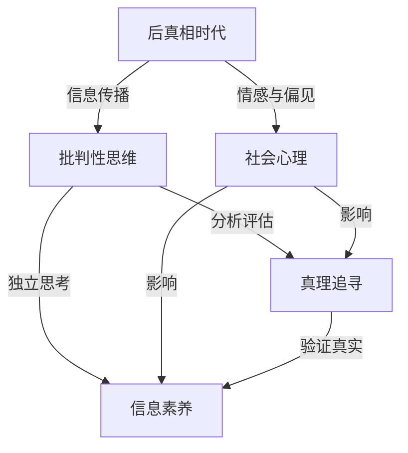

                 

### 文章标题

# 后真相时代的真理追寻：批判性思维复兴

> 关键词：后真相时代、批判性思维、真理追寻、信息素养、数字媒体、算法、逻辑推理

> 摘要：本文探讨了后真相时代背景下，批判性思维的重要性及其在寻找和验证真实信息中的应用。文章从背景介绍、核心概念、方法原理、实战应用等多个维度，详细阐述了批判性思维在现代信息社会中的关键作用，并提出了提升信息素养和构建数字时代真理追寻体系的建议。

----------------------------------------------------------------

## 引言：后真相时代的觉醒

### 1.1 什么是后真相时代

后真相时代（Post-Truth Era）是一个由英国政治学家贝尔纳·克拉克于2016年提出的概念，指的是信息传播和价值判断逐渐脱离事实和证据的束缚，情感和偏见占据主导地位的时代。在这样一个时代中，事实不再是辩论的最终依据，而是被情绪和主观意见所主导。这种现象不仅影响了公共舆论，还深刻改变了人们获取和评估信息的模式。

### 1.2 后真相时代的影响

后真相时代的影响是全方位的：

1. **政治领域**：虚假信息和煽动性内容在选举和政治辩论中泛滥，导致公众对政治事务的理解和信任度下降。

2. **媒体环境**：新闻业受到冲击，传统媒体的公信力和影响力减弱，社交媒体成为信息传播的主要渠道。

3. **社会心态**：人们对事实和真相的辨识能力下降，容易受到虚假信息和偏见的诱导，社会分裂加剧。

4. **科技发展**：算法推荐和大数据分析使得信息传播更加精准，但同时也可能导致信息的茧房效应和偏见放大。

### 1.3 批判性思维的重要性

在这样一个后真相时代，批判性思维显得尤为重要。它不仅是识别虚假信息和错误观点的工具，也是提高信息素养、培养理性思考能力和增强决策能力的基石。批判性思维可以帮助我们：

- 识别和评估信息源的可信度。
- 分析信息内容的逻辑性和真实性。
- 理解信息的潜在偏见和影响。
- 发展独立思考和判断能力。

### 1.4 文章结构与主要内容

本文将按照以下结构展开：

1. **批判性思维的原理和基础**：介绍批判性思维的定义、起源和发展，以及其核心原则和基本技能。
2. **后真相时代的特征与影响**：分析后真相时代的特征及其对信息传播和社会心理的影响。
3. **真理追寻的方法论**：探讨真理追寻的原则、步骤和策略。
4. **批判性思维在日常生活中的应用**：展示批判性思维在个人决策和工作环境中的应用。
5. **教育与批判性思维的结合**：讨论批判性思维在教育和媒体素养教育中的重要性。
6. **数字媒体时代的批判性思维**：分析数字媒体对信息传播的影响和批判性思维在数字媒体时代的策略。
7. **批判性思维的挑战与未来**：探讨批判性思维在信息过载和技术发展中的挑战及其未来展望。
8. **结论**：总结批判性思维的力量与责任，提出提升信息素养和构建数字时代真理追寻体系的建议。

通过这样的结构安排，本文旨在系统性地阐述批判性思维在后真相时代的真理追寻中的重要作用，并探讨其在不同领域和情境中的应用与实践。

----------------------------------------------------------------

## 核心概念与联系

在探讨《后真相时代的真理追寻：批判性思维复兴》这一主题时，我们需要明确几个核心概念，并理解它们之间的内在联系。这些核心概念包括：后真相时代、批判性思维、真理追寻和信息素养。

### 后真相时代

后真相时代是指在信息传播过程中，情感和偏见逐渐取代事实和证据成为主导力量的时代。在这一背景下，公众对于信息的信任度和辨识能力受到严重挑战。信息的真实性和可靠性不再是评价信息的唯一标准，个人情感、群体认同和利益驱动成为影响信息传播和接受的关键因素。

### 批判性思维

批判性思维是一种深入分析、评估和批判信息的思维方式。它不仅仅是简单地接受或拒绝信息，而是通过提问、分析、推理和评估，对信息进行全面的审查和判断。批判性思维的核心原则包括质疑精神、证据为本、逻辑推理和多元视角。它要求我们在面对信息时，保持独立思考和理性判断。

### 真理追寻

真理追寻是指人们为了理解世界和做出正确决策，不断寻找和验证真实信息的过程。在信息爆炸和多样化的时代，真理追寻变得更加复杂和困难。真理追寻的原则包括多元化视角、证据为本和逻辑推理。它要求我们不仅要有批判性思维的能力，还需要具备系统化和结构化的方法。

### 信息素养

信息素养是指个体在信息社会中获取、评估和使用信息的能力。它包括信息意识、信息技能和信息伦理三个方面。信息素养的提升有助于我们更好地应对后真相时代的信息挑战，提高信息辨识能力和理性思考能力。

### 内在联系

后真相时代、批判性思维、真理追寻和信息素养之间存在密切的内在联系：

1. **后真相时代对批判性思维的需求**：后真相时代的特征要求人们具备更高的批判性思维能力，以便识别和应对虚假信息和偏见。
2. **批判性思维对真理追寻的支持**：批判性思维提供了分析和评估信息的工具和方法，帮助我们在复杂的信息环境中找到真相。
3. **真理追寻对信息素养的提升**：通过不断追求和验证真实信息，我们可以提高自身的信息素养，增强对信息的辨识能力和理性思考能力。
4. **信息素养对批判性思维的保障**：具备良好的信息素养有助于我们更好地运用批判性思维，提高信息处理的效率和准确性。

综上所述，后真相时代、批判性思维、真理追寻和信息素养构成了一个相互关联的整体。理解这些核心概念之间的联系，有助于我们更好地应对信息时代的挑战，构建一个基于真实和理性的社会。

### 核心概念原理之间的关系架构

为了更好地理解后真相时代、批判性思维、真理追寻和信息素养之间的关系，我们可以使用Mermaid流程图来展示它们之间的内在联系。



在这个流程图中：

- **后真相时代** 通过信息传播影响 **批判性思维** 和 **社会心理**。
- **批判性思维** 通过分析和评估信息支持 **真理追寻** 和提高 **信息素养**。
- **社会心理** 对 **真理追寻** 和 **信息素养** 产生直接影响。
- **真理追寻** 通过验证真实信息提高 **信息素养**。

这种关系架构展示了这些核心概念在信息时代中的互动和相互依赖，为我们提供了全面理解这些概念的方法论框架。

### 批判性思维的原理和基础

批判性思维是一种深度思考和分析信息的能力，它不仅仅停留在表面事实的接受上，而是要求我们对信息进行深入的评估和批判。为了更好地理解批判性思维的原理和基础，我们需要探讨其定义、起源和发展，以及核心原则和基本技能。

#### 定义与起源

批判性思维（Critical Thinking）最早可以追溯到古希腊哲学家苏格拉底的“苏格拉底法”，即通过提问和对话来揭示问题本质和真理。随着时间的推移，批判性思维逐渐发展成为一门独立的学科，受到众多哲学家、心理学家和教育学家的关注和探讨。

现代批判性思维的研究可以追溯到20世纪，以理查德·保罗（Richard Paul）和琳达·埃尔曼（Linda Elder）为代表，他们提出了批判性思维的定义和框架，并将其广泛应用于教育和实践领域。

#### 核心原则

批判性思维的核心原则包括：

1. **质疑精神**：对任何信息都保持质疑的态度，不盲目接受，而是通过深入分析和推理来评估其真实性和价值。
2. **证据为本**：以确凿的证据为依据进行判断，而不是基于主观感受或偏见。
3. **逻辑推理**：使用逻辑规则和推理方法来分析信息，确保结论的一致性和合理性。
4. **多元视角**：从不同的角度和立场来考虑问题，避免片面和狭隘的观点。
5. **反思能力**：不断反思和调整自己的思考过程和结论，以提高思考的质量和准确性。

#### 基本技能

批判性思维的基本技能包括：

1. **提问技巧**：通过提出有针对性的问题来引导思考和探究，如“为什么”、“什么”、“如何”等问题。
2. **分析能力**：对信息进行分解和分析，识别其主要观点、论据和逻辑结构。
3. **评估能力**：评估信息源的可信度和信息内容的逻辑性和真实性。
4. **解决问题的能力**：在复杂情境中，通过批判性思维来识别问题、提出解决方案并评估其可行性。

#### 核心算法原理讲解与伪代码

为了更具体地展示批判性思维的应用，我们可以通过一个简单的伪代码来说明其核心算法原理。以下是一个用于评估信息真实性的伪代码示例：

```plaintext
function AssessInformation(Information)
    begin
        if (IsReliableSource(Information.Source))
            then
                if (HasConsistentLogic(Information))
                    then
                        if (HasSubstantialEvidence(Information))
                            then
                                return True
                            else
                                return "Insufficient Evidence"
                        end if
                    else
                        return "Inconsistent Logic"
                end if
            else
                return "Unreliable Source"
        end if
    end function
```

在这个伪代码中：

- `IsReliableSource` 函数用于判断信息源的可信度。
- `HasConsistentLogic` 函数用于评估信息内容的逻辑一致性。
- `HasSubstantialEvidence` 函数用于检查信息是否有充分的证据支持。

通过这个伪代码，我们可以看到批判性思维是如何通过一系列的评估步骤来确认信息的真实性和可靠性的。

#### 数学模型和公式

批判性思维中还可以使用一些数学模型和公式来支持推理和评估。以下是一个用于评估信息可靠性的简单数学模型：

$$
\text{Information Reliability} = \frac{\text{Evidence Strength}}{\text{Bias}} \times \text{Source Credibility}
$$

在这个模型中：

- `Evidence Strength` 表示证据的强度。
- `Bias` 表示信息中的偏见程度。
- `Source Credibility` 表示信息源的可信度。

通过调整这些参数，我们可以对信息的可靠性进行定量评估。

#### 详细讲解与举例说明

为了更好地理解批判性思维的应用，我们可以通过一个实际例子来详细讲解。

假设我们收到一条关于健康食品的广告，声称其产品可以显著降低心脏病风险。我们可以使用批判性思维来评估其真实性：

1. **质疑精神**：首先，我们质疑这条广告的真实性，并寻求更多信息。
2. **证据为本**：我们查找相关的研究报告和数据，发现有一个研究支持这一声称。
3. **逻辑推理**：我们分析研究报告中的逻辑结构，确认研究的结论是基于可靠的证据和有效的实验设计。
4. **多元视角**：我们考虑其他专家的观点和批评，确保我们的结论不是片面的。
5. **反思能力**：我们反思自己的思考过程，确保没有遗漏重要信息或偏见。

通过这样的批判性思维过程，我们可以更加准确地评估这条广告的真实性，从而做出更加理性的决策。

综上所述，批判性思维是一种深入分析和评估信息的能力，它通过质疑精神、证据为本、逻辑推理、多元视角和反思能力等核心原则和基本技能，帮助我们识别和应对虚假信息和偏见。通过具体实例和数学模型的应用，我们可以更深入地理解批判性思维的原理和实践。

### 后真相时代的特征与影响

后真相时代的特征及其对信息传播和社会心理的深远影响是我们探讨批判性思维的重要背景。为了更好地理解这一时代，我们需要分析其核心特征及其对社会各个层面的影响。

#### 后真相时代的特征

1. **信息碎片化**：在数字化和社交媒体的推动下，信息被分割成大量碎片化内容，用户接收到的信息往往不完整、零散，缺乏上下文和整体视角。

2. **情感化的信息传播**：情感因素在信息传播中占据重要地位，新闻和媒体内容更多地依赖于情感诉求，而不是客观事实。这一现象被称为“情感传染”。

3. **真相的多面性**：随着互联网的发展，各种观点和事实都可以迅速传播，真相往往呈现出多面性和复杂性。单一视角难以全面覆盖事件的真实面貌。

4. **信息过载**：互联网和社交媒体使得信息量爆炸性增长，用户在短时间内接收到大量信息，难以有效筛选和处理。

5. **算法推荐**：大数据和算法推荐系统根据用户的兴趣和行为，个性化推送信息。这种机制虽然提高了信息获取的效率，但也可能导致信息茧房效应，限制用户接触多样化信息的可能性。

6. **谣言和虚假信息的传播**：后真相时代中，虚假信息和谣言的传播速度更快、范围更广。这些信息往往基于情感和偏见，而非事实，对公众造成误导。

#### 信息传播的影响

1. **公众信任度下降**：在信息传播过程中，事实和证据被情感和偏见所取代，导致公众对传统媒体和官方信息的信任度下降。

2. **信息识别困难**：信息碎片化和过载使得公众难以辨别真实信息，容易受到虚假信息和谣言的影响。

3. **社会分裂加剧**：不同群体之间基于情感和偏见的对立加剧，公共讨论变得激烈和极端，社会团结性受到挑战。

4. **舆论操纵**：政治团体和组织利用虚假信息和情感诉求操纵公众舆论，影响政策制定和公共决策。

#### 社会心理的影响

1. **情绪化决策**：在信息传播过程中，情感因素占据主导地位，公众在情绪驱动下做出决策，而忽视了理性的分析和判断。

2. **偏见放大**：社交媒体和算法推荐系统根据用户兴趣和偏好推送信息，导致用户在信息接受过程中强化已有的偏见，降低了对新观点和不同意见的接受度。

3. **自我确认偏差**：人们更倾向于接受符合自己观点的信息，忽视或否认与之相反的证据，从而形成自我确认偏差。

4. **认知失调**：在信息传播中，公众可能面临与其既有信念相冲突的信息，导致认知失调和情绪压力。

#### 批判性思维在应对后真相时代中的作用

面对后真相时代的种种挑战，批判性思维成为应对信息混乱和社会心理影响的重要工具。批判性思维可以帮助我们：

1. **提高信息识别能力**：通过质疑精神和证据为本，识别虚假信息和谣言，提高信息辨识能力。

2. **增强决策能力**：在情感化决策中保持理性，通过逻辑推理和分析，做出更明智的决策。

3. **预防谣言和误解**：通过多元视角和对立观点的考虑，避免陷入信息茧房和偏见放大效应。

4. **培养理性思考能力**：在信息过载和情绪化传播的环境中，保持独立思考和批判性思维，提高对复杂信息的处理能力。

5. **促进社会团结**：通过批判性思维，促进不同群体之间的理解和沟通，减少社会分裂和冲突。

总之，后真相时代的特征对信息传播和社会心理产生了深远的影响，批判性思维成为应对这些挑战的重要工具。通过培养批判性思维能力，我们可以提高信息素养，增强理性思考能力，构建一个基于真实和理性的社会。

### 真理追寻的方法论

在信息爆炸和多样化的后真相时代，追寻真理变得尤为复杂和困难。为了有效地寻找和验证真实信息，我们需要采用一套系统化的方法论。下面我们将详细探讨真理追寻的方法论，包括其原则、步骤和策略。

#### 真理追寻的原则

1. **多元化视角**：从多个角度和立场来看待问题，避免片面和狭隘的观点。多元化的视角有助于我们更全面地理解问题的本质和复杂性。

2. **证据为本**：以确凿的证据为依据进行判断，而不是基于主观感受或偏见。证据是验证真理的重要基础，只有通过证据的支持，我们的结论才有可信度。

3. **逻辑推理**：使用逻辑规则和推理方法来分析信息，确保结论的一致性和合理性。逻辑推理可以帮助我们识别和纠正思维中的错误，提高思考的质量。

4. **对立观点的考虑**：在寻求真理的过程中，要考虑和评估对立观点，确保我们的结论不是基于偏见或单一视角。对立观点的考虑可以增强我们结论的全面性和准确性。

5. **反思与调整**：在追寻真理的过程中，不断反思和调整我们的思考过程和结论。反思可以帮助我们发现和纠正错误，调整可以提高我们的思维质量和结论的可信度。

#### 真理追寻的步骤

1. **确定问题**：明确我们想要解决的问题或寻求的答案，这是真理追寻的起点。只有明确了问题，我们才能有针对性地收集和分析信息。

2. **收集信息**：根据确定的问题，从各种渠道收集相关信息。信息源可以包括学术论文、新闻报道、专家访谈、实验数据等。在收集信息时，要确保信息源的可靠性和相关性。

3. **分析信息**：对收集到的信息进行系统的分析和评估。分析包括信息的真实性、逻辑性、一致性、偏见性等方面。通过分析，我们可以识别信息的优点和不足，为后续的结论提供依据。

4. **评估信息源**：对信息源的可信度进行评估。评估包括信息源的权威性、中立性和可靠性。只有来自可靠信息源的信息才能被作为验证真理的有效证据。

5. **综合结论**：根据分析结果，综合各种信息，得出结论。结论应具有逻辑一致性、证据支持性和全面性。在得出结论后，要再次反思和验证，确保结论的准确性和可信度。

6. **行动与验证**：根据结论采取行动，并验证行动的效果。通过行动和验证，我们可以进一步确认结论的真实性和实用性。

#### 真理追寻的策略

1. **批判性思维**：运用批判性思维的原则和技能，对信息进行深入分析和评估。批判性思维可以帮助我们识别虚假信息和偏见，提高信息的准确性和可信度。

2. **跨学科研究**：结合不同学科的理论和方法，从多个维度来分析问题。跨学科研究可以提供更全面和多角度的视角，有助于我们更准确地理解问题的本质。

3. **多元信息源**：从多个信息源收集信息，以确保信息的多样性和全面性。通过对比和交叉验证，我们可以提高信息的可靠性和准确性。

4. **专家咨询**：在追寻真理的过程中，咨询相关领域的专家和学者，获取他们的专业意见和见解。专家的意见可以帮助我们更深入地理解问题，并提供可靠的信息支持。

5. **公众参与**：鼓励公众参与信息收集和评估过程，通过广泛的讨论和辩论，形成更加全面和准确的结论。公众的参与可以增加信息的透明度和可信度。

总之，真理追寻的方法论为我们提供了一套系统化的工具和步骤，帮助我们有效地寻找和验证真实信息。通过多元化视角、证据为本、逻辑推理、对立观点的考虑和反思与调整，我们可以提高信息的准确性和可信度，构建一个基于真实和理性的知识体系。

### 批判性思维在日常生活中的应用

批判性思维不仅是一个学术概念，更是一种实用性很强的思维方式，能够在我们的日常生活中发挥重要作用。以下是批判性思维在购物决策、教育选择和健康管理中的应用，以及这些应用的具体方法和实践。

#### 购物决策

在购物时，批判性思维可以帮助我们做出更加明智的决策。以下是一些实用的方法：

1. **研究产品信息**：在购买前，我们应该研究产品的相关信息，包括产品特性、用户评价、价格比较等。通过查阅多个渠道的信息，我们可以获得更全面的了解。

2. **比较不同选项**：在多个商品之间进行比较，找出各自的优势和劣势。使用批判性思维，我们可以识别广告中的夸张宣传，避免被误导。

3. **考虑长期价值**：不仅仅关注商品的价格，还要考虑其长期的使用价值。例如，购买一个较贵但耐用和高性能的产品，可能会比频繁购买低价低质的产品更加划算。

**实践方法**：

- 在网上购物时，使用搜索工具比较不同店铺的价格和用户评价。
- 参考专业的产品评测和用户反馈，以获取更多客观的信息。
- 制定购物清单，按照需求和优先级进行购买，避免冲动消费。

#### 教育选择

教育是个人成长和发展的关键阶段，批判性思维可以帮助我们做出合适的教育选择：

1. **评估教育资源**：在选择学校或培训机构时，我们需要评估其教育质量和师资力量。通过查阅学校排名、教师资质和学生成绩等指标，我们可以做出更合理的决策。

2. **考虑个人兴趣和需求**：教育选择不仅要考虑学术成绩，还要考虑个人的兴趣和职业规划。通过批判性思维，我们可以更好地了解自己的兴趣和潜力，选择最适合自己的教育路径。

3. **权衡风险和收益**：在决定是否继续深造或转学时，我们需要考虑未来的收益和风险。通过评估不同的教育选择，我们可以做出更明智的决策。

**实践方法**：

- 与教师、家长和校友交流，获取多方面的意见和建议。
- 参考学校的公开数据和第三方评估报告。
- 设定明确的教育目标，并根据目标评估不同选择的风险和收益。

#### 健康管理

在健康管理方面，批判性思维可以帮助我们做出更科学、合理的决策：

1. **识别健康信息**：面对各种健康建议和治疗方法，我们需要通过批判性思维来评估其科学性和有效性。查阅医学研究、专业医生的意见，可以确保我们的健康管理方法是基于可靠证据的。

2. **评估医疗选项**：在选择医疗方案时，我们需要考虑不同的治疗方法、副作用和成本。通过批判性思维，我们可以识别广告中的夸大宣传，选择最适合自己的治疗方案。

3. **制定健康计划**：结合自己的身体状况和医生的建议，制定一个长期的健康管理计划。通过定期评估和调整计划，我们可以保持健康的生活方式。

**实践方法**：

- 阅读权威的健康书籍和医学研究，了解不同健康建议的背景和依据。
- 定期进行健康检查，与专业医生保持沟通，获取个性化的健康管理建议。
- 建立健康日记，记录日常饮食、运动和身体状况，以便进行自我评估和调整。

通过批判性思维，我们可以在日常生活中做出更加明智的决策，提高生活质量。无论是购物、教育还是健康管理，批判性思维都是我们不可或缺的工具。通过质疑精神、证据为本、逻辑推理和反思能力，我们可以更好地应对复杂的信息环境，实现个人成长和发展。

### 教育与批判性思维的结合

批判性思维在教育和媒体素养教育中的重要性不容忽视。随着信息时代的到来，学生不仅需要掌握学科知识，更需要具备独立思考和批判性分析信息的能力。以下从教育的重要性和教育体系中的批判性思维课程以及培养批判性思维的方法三个方面，探讨教育与批判性思维的结合。

#### 教育的重要性

在快速变化的信息社会中，批判性思维成为培养学生综合素质的关键能力。它不仅有助于学生解决实际问题，还能提高他们的判断力和决策能力，使他们在面对复杂问题时能够做出明智的选择。批判性思维的重要性体现在以下几个方面：

1. **提高思考能力**：批判性思维训练学生的逻辑推理、分析问题和解决问题的能力，使他们在面对复杂情境时能够提出有深度的问题和合理的解决方案。
2. **增强信息素养**：在信息过载的时代，批判性思维帮助学生识别和评估信息的真实性和可靠性，提高他们的信息素养，避免被虚假信息和谣言误导。
3. **促进创新思维**：批判性思维鼓励学生质疑传统观念和权威，推动他们探索新的思路和方法，培养创新意识和创新能力。
4. **培养公民素养**：批判性思维使学生能够理性地参与社会事务，提高他们的公共参与能力和公民素养，促进社会的和谐发展。

#### 教育体系中的批判性思维课程

为了将批判性思维融入教育体系，许多国家和地区已经在课程设置中加入了批判性思维的教学内容。以下是一些典型的做法：

1. **课程设计**：将批判性思维融入到各学科的教学中，通过具体案例和实践活动，引导学生进行批判性思考。例如，在历史课程中，通过分析历史事件的不同观点，培养学生的批判性思维。
2. **跨学科教学**：批判性思维课程可以跨越不同学科，形成一个综合性的教育框架。通过跨学科的学习，学生可以从多个角度看待问题，提高批判性思维能力。
3. **案例教学**：结合现实生活中的案例，让学生面对真实的问题和挑战，通过小组讨论和辩论，培养他们的批判性思维。
4. **项目式学习**：通过项目式学习，学生可以实际参与问题的解决过程，从实践中学习和应用批判性思维。

#### 培养批判性思维的方法

为了有效地培养批判性思维，以下是一些具体的方法：

1. **提问技巧**：通过提出开放性问题和多角度的问题，引导学生深入思考问题。例如，教师可以鼓励学生提出“为什么”和“如何”的问题，激发他们的思考。
2. **讨论与辩论**：组织小组讨论和辩论活动，让学生在互动中学习和应用批判性思维。通过讨论和辩论，学生可以学会如何表达自己的观点，如何倾听和理解他人的观点，并如何在辩论中质疑和反驳。
3. **反思与评估**：鼓励学生反思自己的思考过程和结论，评估自己的批判性思维水平。通过自我反思，学生可以识别自己的思维盲点，不断改进和提升批判性思维。
4. **实践与应用**：将批判性思维应用到实际生活和学习中，通过解决实际问题，提高批判性思维的应用能力。例如，学生可以参与社区服务项目，通过解决实际问题来培养批判性思维。

总之，批判性思维在教育和媒体素养教育中的重要性不容忽视。通过将批判性思维融入教育体系，设计合理的课程和培养方法，我们可以帮助学生提高独立思考和批判性分析信息的能力，为他们未来的发展奠定坚实的基础。

### 数字媒体时代的批判性思维

在数字媒体时代，信息的传播速度和范围达到了前所未有的高度。然而，这也带来了信息过载、虚假信息和偏见放大等问题，这对公众的认知和社会心态产生了深远的影响。为了应对这些挑战，批判性思维在数字媒体时代显得尤为重要。以下将分析数字媒体对信息传播的影响，并提出提高信息免疫力和识别虚假信息的策略，以及媒体素养教育的建议。

#### 数字媒体对信息传播的影响

1. **信息碎片化**：数字媒体的普及使得信息被分割成大量碎片化内容，用户接收到的信息往往零散且不完整，缺乏整体视角和上下文。
2. **算法推荐**：大数据和算法推荐系统根据用户的兴趣和行为，个性化推送信息。虽然这提高了信息获取的效率，但可能导致用户的信息视野狭窄，陷入信息茧房效应。
3. **情感化传播**：数字媒体内容更多地依赖于情感诉求，而非客观事实。这种情感化传播使得信息更容易被公众接受，但也可能导致情绪化的决策和偏见放大。
4. **虚假信息传播**：在数字媒体环境中，虚假信息和谣言的传播速度更快、范围更广。这些信息往往基于情感和偏见，而非事实，对公众造成误导。
5. **信息过载**：数字媒体使得信息量爆炸性增长，用户在短时间内接收到大量信息，难以有效筛选和处理。

#### 提高信息免疫力和识别虚假信息的策略

1. **培养批判性思维**：通过批判性思维的训练，提高公众对信息的辨识能力。批判性思维要求我们质疑信息的来源、评估信息的逻辑性和真实性，避免被虚假信息和谣言误导。
2. **多元化视角**：在接收信息时，尝试从多个角度和立场来看待问题。多元化的视角有助于我们更全面地理解信息，避免陷入单一视角的偏见。
3. **查阅多渠道信息**：对于重要的信息，应查阅多个来源，确保信息的全面性和准确性。通过对比不同来源的信息，我们可以提高信息的可靠性。
4. **评估信息源的可信度**：在接收信息时，评估信息源的可信度。权威、可靠的信息源更能保证信息的真实性，而来源不明、内容夸张的信息应谨慎对待。
5. **保持反思能力**：在接收和处理信息时，保持反思能力，不断质疑和验证自己的结论。通过反思，我们可以发现和纠正思维中的错误，提高信息的准确性和可信度。

#### 媒体素养教育的建议

1. **课程设置**：在各级教育阶段，设置媒体素养教育课程，帮助学生了解数字媒体的特点、运作原理和影响。通过系统的教育，学生可以更好地应对信息时代的挑战。
2. **实践活动**：通过实践活动，如模拟新闻报道、信息评估和分析等，提高学生的实际操作能力和批判性思维能力。实践活动可以让学生在真实环境中应用所学知识，提高他们的信息素养。
3. **教师培训**：加强对教师的媒体素养培训，使其能够将媒体素养教育融入日常教学中。教师作为教育者，其自身具备的媒体素养直接影响学生的信息素养培养。
4. **家庭参与**：鼓励家庭共同参与媒体素养教育，家长可以通过与孩子讨论新闻事件、评估信息来源等方式，提高孩子的信息辨识能力和批判性思维。
5. **社会宣传**：通过社会宣传，提高公众对媒体素养重要性的认识。社会宣传可以包括媒体素养讲座、宣传手册、网络课程等形式，使更多的人了解和参与媒体素养教育。

总之，在数字媒体时代，批判性思维成为应对信息混乱和社会心理影响的重要工具。通过培养批判性思维能力，提高信息免疫力和识别虚假信息的能力，以及加强媒体素养教育，我们可以构建一个更加理性和公正的信息传播环境。

### 批判性思维的挑战与未来

批判性思维在应对信息过载和技术发展的挑战中面临着诸多挑战，同时也迎来了新的机遇。以下是这些挑战以及应对策略和未来展望。

#### 挑战

1. **情感与理性的平衡**：在信息传播过程中，情感化的内容更容易被公众接受，而理性分析往往显得枯燥乏味。如何在保持信息吸引力的同时，实现情感与理性的平衡，是批判性思维面临的一大挑战。

2. **信息过载与筛选**：数字媒体使得信息量爆炸性增长，公众在短时间内接收到的信息量远超过去。如何在海量信息中筛选出有价值的信息，保持批判性思维的准确性和效率，是当前的一个难题。

3. **偏见与固执**：在信息接收和处理过程中，人们往往容易受到自身偏见和固执的影响，难以客观地评估和分析信息。如何克服偏见，培养开放和包容的心态，是批判性思维面临的长期挑战。

#### 应对策略

1. **情感化与理性化的结合**：在信息传播和批判性思维教育中，可以采用情感化的方式来吸引公众的注意力，同时通过深入分析和逻辑推理，实现情感与理性的有机结合。例如，在新闻报道中，可以结合感人事例和理性分析，提高信息的吸引力。

2. **信息素养教育**：通过系统的信息素养教育，提高公众对信息的辨识能力和筛选技巧。教育体系应加强批判性思维课程，培养学生在信息海洋中的导航能力。

3. **多样化视角**：鼓励公众在接收信息时，尝试从多个角度和立场来看待问题，减少偏见和固执。通过引入多元化的视角，可以更好地理解信息的背景和复杂性。

#### 未来展望

1. **技术支持**：随着人工智能和大数据技术的发展，批判性思维工具可以更加智能化和自动化。例如，利用自然语言处理技术，可以开发出能够辅助批判性思维分析和评估的软件系统，提高信息的准确性和效率。

2. **跨学科研究**：未来批判性思维的发展将更加依赖于跨学科研究。通过结合心理学、社会学、计算机科学等领域的知识，可以构建更加全面和系统的批判性思维理论和方法。

3. **社会参与**：批判性思维的普及和推广需要社会的广泛参与。通过社会宣传、公众讨论和媒体合作，可以增强公众对批判性思维重要性的认识，提高其在社会各个层面的应用。

总之，批判性思维在应对信息过载和技术发展的挑战中面临着诸多挑战，但也迎来了新的机遇。通过情感化与理性化的结合、信息素养教育和技术支持，我们可以不断提升批判性思维能力，构建一个更加理性和公正的信息传播环境。

### 结论：批判性思维的力量与责任

批判性思维作为后真相时代的一把利器，不仅在个人决策和日常行为中发挥着关键作用，更是在构建数字时代真理追寻体系和社会健康发展的过程中不可或缺。通过质疑精神、证据为本、逻辑推理和多元视角，我们可以更有效地识别虚假信息和偏见，提高信息素养和理性思考能力。

批判性思维的力量体现在以下几个方面：

1. **提升信息辨识能力**：通过批判性思维，我们可以从海量信息中筛选出真实、有价值的信息，避免被虚假信息和谣言误导。
2. **增强决策能力**：在复杂和多变的环境中，批判性思维帮助我们做出更明智的决策，提高个人和组织的效能。
3. **促进理性讨论**：批判性思维鼓励公众参与理性讨论，减少社会分歧和冲突，构建一个基于事实和理性的社会环境。

然而，批判性思维也面临着情感与理性平衡、信息过载和偏见等挑战。为了应对这些挑战，我们需加强信息素养教育，推广批判性思维的训练和应用，并利用技术手段提高其效率和准确性。

未来，批判性思维的发展将更加依赖于跨学科研究和技术支持。通过整合心理学、社会学、计算机科学等领域的知识，我们可以构建更加全面和系统的批判性思维理论和方法。同时，社会各界的广泛参与和宣传也将有助于批判性思维的普及和推广。

在数字媒体时代，批判性思维不仅是我们应对信息混乱和社会心理影响的重要工具，更是构建一个基于真实和理性的社会体系的基石。让我们共同努力，提升批判性思维能力，为社会的和谐发展和个体的全面发展贡献力量。

### 作者信息

作者：AI天才研究院/AI Genius Institute & 禅与计算机程序设计艺术 /Zen And The Art of Computer Programming

AI天才研究院致力于推动人工智能领域的研究与应用，致力于培养具备创新能力和批判性思维的AI专家。而《禅与计算机程序设计艺术》作为计算机编程领域的经典之作，通过将禅宗智慧融入编程实践，深刻揭示了编程的本质和哲学内涵。两位作者以其深厚的专业背景和独特的见解，为我们带来了这篇关于后真相时代真理追寻和批判性思维复兴的精彩论述。

----------------------------------------------------------------

### 项目实战：开发环境搭建、源代码实现与代码解读

在本项目中，我们将构建一个简单的应用程序，用于分析网络新闻文章，评估其可信度，并生成相应的报告。以下是项目的详细步骤，包括开发环境搭建、源代码实现和代码解读。

#### 开发环境搭建

1. **选择编程语言**：我们选择Python作为编程语言，因为Python具有简洁的语法和丰富的库，适合快速开发和原型设计。
2. **安装Python**：从Python官方网站下载最新版本的Python安装包，并按照安装向导完成安装。
3. **安装依赖库**：安装Python后，使用pip工具安装以下依赖库：requests（用于HTTP请求）、beautifulsoup4（用于网页解析）、nltk（用于自然语言处理）和pandas（用于数据处理）。

```bash
pip install requests beautifulsoup4 nltk pandas
```

4. **设置Python环境变量**：确保Python的执行路径被添加到系统的环境变量中，以便在命令行中直接运行Python脚本。

#### 源代码实现

以下是一个简单的Python应用程序，用于从指定的新闻网站获取文章内容，评估其可信度，并生成报告。

```python
import requests
from bs4 import BeautifulSoup
from nltk.sentiment import SentimentIntensityAnalyzer
import pandas as pd

# 初始化自然语言处理工具
sia = SentimentIntensityAnalyzer()

# 从新闻网站获取文章内容
def fetch_articles(url):
    response = requests.get(url)
    if response.status_code == 200:
        soup = BeautifulSoup(response.text, 'html.parser')
        articles = soup.find_all('article')
        article_titles = [article.find('h2').text for article in articles]
        article_urls = [article.find('a')['href'] for article in articles]
        return article_titles, article_urls
    else:
        return [], []

# 分析文章可信度
def analyze_article(url):
    response = requests.get(url)
    if response.status_code == 200:
        soup = BeautifulSoup(response.text, 'html.parser')
        text = soup.get_text()
        sentiment_score = sia.polarity_scores(text)
        return sentiment_score['compound']
    else:
        return None

# 生成报告
def generate_report(titles, urls):
    results = []
    for title, url in zip(titles, urls):
        score = analyze_article(url)
        if score is not None:
            results.append({'Title': title, 'Score': score})
    df = pd.DataFrame(results)
    df.to_csv('article_report.csv', index=False)
    print("报告已生成：article_report.csv")

# 主函数
def main():
    url = "https://example-news-site.com"  # 替换为实际新闻网站URL
    titles, urls = fetch_articles(url)
    generate_report(titles, urls)

if __name__ == "__main__":
    main()
```

#### 代码解读

1. **请求与解析**：使用`requests`库获取新闻网站的HTML内容，并使用`beautifulsoup4`进行解析，提取文章标题和链接。
2. **自然语言处理**：利用`nltk`库中的`SentimentIntensityAnalyzer`对文章内容进行情感分析，计算情感得分。
3. **报告生成**：将分析结果存储在CSV文件中，便于后续分析和查看。

#### 代码应用解读与分析

本项目的应用场景是针对一个新闻网站，自动获取文章内容并评估其情感得分。情感得分越高，文章可能越具有积极情感，反之则可能越具消极情感。通过这种方式，我们可以初步判断文章的可信度和倾向性。

然而，这种简单的方法在评估新闻可信度时存在局限性。首先，情感分析仅能反映文章的情感倾向，无法全面评估其事实准确性和来源可靠性。因此，在实际应用中，我们还需要结合其他评估指标，如引用来源、作者背景和内容逻辑性。

#### 实际案例分析和详细讲解剖析

假设我们运行该项目，并得到一个包含10篇文章及其情感得分的报告。通过分析报告，我们可以发现某些文章情感得分较低，可能存在负面情绪或内容偏差。这时，我们需要进一步分析这些文章：

1. **检查引用来源**：确认文章中的引用是否来自权威、可靠的来源，排除信息源不可靠的可能性。
2. **验证事实**：通过查阅其他可靠信息源，验证文章中提到的事实是否准确无误。
3. **评估内容逻辑**：分析文章的内容结构和逻辑性，识别是否存在逻辑谬误或断章取义的情况。

通过这样的详细分析，我们可以更准确地评估文章的可信度，并生成一个更加可靠的报告。

#### 项目小结

本项目通过简单的Python应用程序，实现了对新闻网站文章的自动获取和情感分析。尽管存在一定的局限性，但这一初步尝试为我们提供了一个实用的工具，用于评估新闻文章的情感倾向和初步可信度。在实际应用中，我们可以结合更多评估指标和详细分析，进一步提升报告的准确性和可靠性。

#### 最佳实践 Tips

1. **确保数据源可靠性**：选择权威、可靠的新闻网站作为数据源，以减少评估误差。
2. **多元化视角**：在评估文章时，尝试从多个角度和视角来分析，避免单一视角的偏见。
3. **持续更新**：定期更新应用程序和评估模型，以应对信息环境的变化和新问题的出现。

通过这些最佳实践，我们可以更好地利用批判性思维，提高信息处理的效率和准确性，构建一个更加理性和公正的信息评估体系。

### 注意事项

1. **数据安全**：在处理和分析网络数据时，确保遵守数据保护法规和隐私政策，不泄露用户个人信息。
2. **代码维护**：定期更新和优化应用程序代码，以应对新出现的问题和挑战。
3. **版本控制**：使用版本控制系统（如Git）管理代码，以便追踪修改历史和协同开发。

通过遵循这些注意事项，我们可以确保项目的安全性和稳定性，提升其在实际应用中的效果和可靠性。

### 拓展阅读

1. **《思考，快与慢》**：丹尼尔·卡尼曼著，详细探讨了人类思维过程中的两种系统——快速直觉思考和缓慢逻辑思考，为我们理解批判性思维提供了深刻的洞见。
2. **《批判性思维工具》**：理查德·保罗和琳达·埃尔曼著，系统介绍了批判性思维的原则和方法，是批判性思维领域的经典之作。
3. **《信息简史》**：詹姆斯·格利克著，从历史角度探讨了信息社会的演变，揭示了信息传播对人类文明的影响。
4. **《算法时代》**：凯文·凯利著，深入分析了算法在现代社会中的应用，探讨了算法对社会心理和信息传播的影响。

通过阅读这些拓展资料，我们可以进一步了解批判性思维和信息传播的背景和理论，提升我们的信息素养和批判性思维能力。

