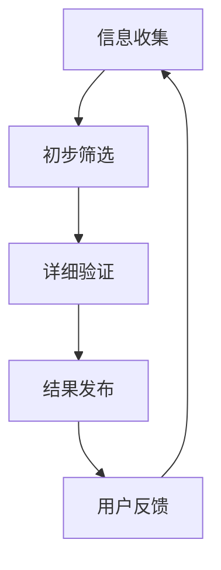

                 

### 文章标题

# 后真相时代的真相侦探学院：培养事实甄别能力

在信息爆炸的时代，如何从海量信息中甄别出真相，已经成为每个人必须掌握的技能。本文将带你走进“后真相时代的真相侦探学院”，学习如何在纷繁复杂的信息海洋中培养事实甄别能力。让我们跟随人工智能的脚步，一起揭开事实甄别的神秘面纱。

## 文章关键词

- 后真相时代
- 真相侦探学院
- 事实甄别能力
- 信息筛选
- 数字素养
- 认知偏差

## 文章摘要

本文首先介绍了后真相时代的背景及其对个人和社会的影响。接着，阐述了事实甄别的核心概念与重要性，分析了其理论基础和应用方法。通过多个真实案例的剖析，我们探讨了如何在实际场景中运用事实甄别技能。文章最后，总结了培养事实甄别能力的实践方法和未来发展趋势，为读者提供了全面的指导。

### Introduction to the Book's Core Concepts

在后真相时代，信息不再仅仅是简单的传递，而是成为一种权力的象征。虚假信息、误导性内容、谣言等在网络上迅速传播，严重影响了人们的认知和判断。因此，培养事实甄别能力显得尤为重要。本文旨在为读者提供一套系统的学习框架，帮助大家掌握事实甄别的技能。

首先，我们需要了解什么是事实甄别。事实甄别是指通过一系列的方法和技巧，对信息进行验证和分析，从而辨别出真实与虚假的过程。它不仅仅是一个简单的辨别真伪的过程，更是一种综合素质的体现，包括批判性思维、信息素养和伦理意识等。

在接下来的章节中，我们将逐一探讨事实甄别的核心概念和理论。我们将从以下几个方面展开：

1. **历史背景**：介绍后真相时代的起源和影响，探讨信息传播方式的变革以及它对个体和社会带来的挑战。
2. **核心概念和理论**：解释事实甄别的定义、理论基础和关键要素，如可靠性、准确性、全面性和公正性。
3. **方法和技巧**：介绍事实甄别过程中使用的各种方法和工具，包括传统的调查技巧和现代的数字工具。
4. **实际应用**：通过具体案例展示事实甄别在媒体、政治、社会等领域的应用，分析其在不同场景下的实际效果和影响。
5. **成功案例**：深入剖析一些成功的事实甄别项目，探讨其成功的原因和可借鉴的经验。
6. **技能培养**：提供培养事实甄别能力的具体方法，包括教育、培训和实践等。
7. **挑战与伦理**：讨论事实甄别过程中遇到的挑战，如信息过载、偏见和伦理问题，并探讨解决方案和伦理指导原则。
8. **未来趋势**：展望事实甄别领域的发展趋势和机遇，探讨技术进步和新兴领域对事实甄别的影响。

通过上述框架，读者将能够系统地了解和掌握事实甄别的相关知识和技能，从而更好地应对后真相时代的信息挑战。接下来，我们将深入探讨后真相时代的背景和事实甄别的必要性。

### Historical Background of the Post-Truth Era

后真相时代的概念最早由英国政治评论家迈克尔·罗伯茨（Michael Roberts）在2016年提出，他当时描述了在2016年美国总统选举期间，情绪和偏见的传播超过了客观事实的现象。这一概念迅速引起了全球范围内的广泛关注，并成为社会各界讨论的热点话题。

**起源**：

后真相时代的起源可以追溯到信息技术的快速发展和社交媒体的普及。在互联网时代，信息传播的速度和广度都达到了前所未有的高度。人们可以通过社交媒体平台、即时通讯工具和新闻网站等渠道，迅速获取大量信息。然而，这些信息往往缺乏权威性和真实性，使得虚假信息、误导性内容以及谣言得以快速传播。此外，算法推荐系统的广泛使用也加剧了信息过滤泡沫现象，人们更容易接触到符合自己观点的信息，从而陷入认知偏差的陷阱。

**影响**：

后真相时代对个人和社会产生了深远的影响。对个人而言，信息过载和真假难辨的信息环境导致了认知负担的增加，人们越来越难以辨别真相。这种情况下，个人在面对重要决策时，往往缺乏可靠的信息支持，从而影响了决策的质量。同时，虚假信息的泛滥也加剧了社会的不信任，使人们对传统媒体和权威机构的信任度下降。

对社会而言，后真相时代引发了诸多社会问题。在政治领域，虚假信息和误导性内容的传播严重干扰了选举过程，影响了公众对政治事件的理解和判断。在社会层面，虚假信息的传播导致了社会分裂和冲突的加剧，使得社会共识更加难以形成。此外，商业领域也受到虚假信息的影响，品牌声誉和消费者信任度受到损害。

**信息传播方式的变革**：

在后真相时代，信息传播方式也发生了显著变化。传统媒体在信息传播中的作用逐渐减弱，社交媒体和自媒体成为了主要的信息来源。这种变化使得信息传播更加去中心化，同时也降低了信息发布的门槛。任何人都可以在社交媒体上发布信息，信息的真实性和准确性往往难以保证。此外，信息的传播速度也大大加快，使得虚假信息能够在短时间内迅速扩散。

**挑战和应对**：

面对后真相时代带来的挑战，社会各界需要共同努力来应对。首先，公众需要提高自身的媒体素养和信息素养，学会辨别真假信息。其次，传统媒体和权威机构应加强信息验证和发布管理，提高信息的真实性和可靠性。此外，技术领域也应积极研发和应用先进的算法和工具，帮助用户识别虚假信息，提升信息筛选的准确性。

总的来说，后真相时代是一个充满挑战和机遇的新时代。通过提高事实甄别能力，我们可以在信息海洋中找到真相，为个人和社会的决策提供可靠的信息支持。在接下来的章节中，我们将进一步探讨事实甄别的核心概念和理论基础。

### Core Concepts and Theories of Fact-Checking

事实甄别（Fact-Checking）作为一种系统性的信息验证过程，旨在辨别信息的真实性和准确性。要理解这一过程，我们首先需要明确几个核心概念和理论。

#### The Definition of Fact-Checking

**事实甄别的定义**：

事实甄别是指通过一系列方法和工具，对信息进行验证和分析，以辨别其真实性和准确性的过程。它不仅包括对信息的真实性进行核实，还涉及对信息的全面性和公正性进行评估。

**关键要素**：

- **可靠性**（Reliability）：指信息来源的权威性和一致性。一个可靠的信息来源应具备专业资质和长期信誉。
- **准确性**（Accuracy）：指信息内容的真实性和精确性。准确的信息应符合事实，不应包含误导性内容。
- **全面性**（Comprehensiveness）：指信息覆盖的范围和广度。全面的信息应包含所有相关事实，避免片面和断章取义。
- **公正性**（Fairness）：指信息处理的客观性和中立性。公正的信息处理应避免偏见和主观臆断。

**流程**：

事实甄别通常包括以下几个步骤：

1. **信息收集**：从多个来源收集相关信息，以便进行全面的评估。
2. **初步筛选**：对收集到的信息进行初步筛选，排除明显不真实或无关的信息。
3. **详细验证**：对筛选后的信息进行深入核实，使用可靠的方法和工具验证信息的真实性。
4. **结果发布**：将验证结果公之于众，提供准确和可靠的信息。

#### Key Theories in Fact-Checking

**交叉验证理论**（Cross-Validation）：

交叉验证理论是事实甄别过程中的一种重要方法。它通过将信息与多个独立来源进行比对，以验证其真实性。这种方法可以减少单一来源带来的偏差，提高甄别的准确性。

**信息源评估理论**（Source Evaluation Theory）：

信息源评估理论关注信息来源的可靠性和权威性。评估信息源时应考虑其资质、信誉和背景。高质量的信息源应具备专业资质、长期信誉和公开透明的信息发布机制。

**认知偏差理论**（Cognitive Bias Theory）：

认知偏差理论指出，人在信息处理过程中容易受到各种心理偏见的影响，导致判断失误。事实甄别过程中，需要识别和纠正这些认知偏差，以避免误导性信息的传播。

**事实核查理论**（Fact-Checking Theory）：

事实核查理论强调通过系统的方法和工具，对信息进行全面的验证和分析。这一理论认为，事实甄别不仅是辨别真假，更是对信息进行全面评估的过程，以提供准确和可靠的信息。

**不同类型的 misinformation**：

- **误导性信息**（Misleading Information）：指虽非完全虚假，但有意或无意地误导受众的信息。
- **虚假信息**（False Information）：指完全虚假，与事实不符的信息。
- **谣言**（Rumor）：指未经证实的信息，可能在传播过程中逐渐失真。
- **误导性内容**（Misinformation）：指虽有事实基础，但表达方式或解释方式存在误导性的内容。

#### Mermaid Flowchart of Fact-Checking Process



**核心概念之间的关系架构**：

- 信息收集是事实甄别的起点，通过多渠道收集信息，确保全面性。
- 初步筛选是过滤掉明显不真实或无关的信息，为详细验证做准备。
- 详细验证是对筛选后的信息进行深入核实，确保可靠性和准确性。
- 结果发布是将验证结果公之于众，提供准确和可靠的信息。
- 用户反馈是评估事实甄别效果的重要环节，通过用户反馈可以进一步优化甄别流程。

通过上述流程和理论，我们可以更好地理解和应用事实甄别，从而在复杂的信息环境中找到真相。在接下来的章节中，我们将探讨事实甄别的方法和技术。

### Techniques and Methods for Fact-Checking

在事实甄别的过程中，掌握正确的技术和方法至关重要。以下是几种常见的事实甄别技术和方法，包括传统的调查技巧和现代的数字工具。

#### Traditional Investigative Techniques

**采访和调查**：

采访是事实甄别的重要手段之一。通过直接与信息来源或相关人员进行面对面的交流，可以获取第一手资料，从而验证信息的真实性。调查则包括问卷调查、访谈记录和实地考察等，这些方法有助于收集广泛的数据和证据。

**查阅文献和档案**：

查阅文献和档案是事实甄别的基础工作。通过检索图书馆、档案馆和其他数据库中的资料，可以获取历史记录和权威文献，为信息的验证提供可靠依据。

**交叉验证**：

交叉验证是事实甄别过程中常用的方法。通过将信息与多个独立来源进行比对，可以降低单一来源带来的偏差，提高甄别的准确性。这种方法可以用来核对数据、验证引用和确认事实。

**公开记录和报告**：

公开记录和报告是事实甄别的重要来源。政府、企业和组织发布的公开文件和报告可以提供丰富的信息，帮助甄别信息的真实性。

#### Digital Tools and Resources for Fact-Checking

**搜索引擎**：

搜索引擎是获取信息的重要工具。通过使用搜索引擎，可以快速查找相关资料，验证信息的来源和可靠性。

**社交媒体监控工具**：

社交媒体监控工具可以帮助监测和分析社交媒体平台上的信息传播。这些工具可以识别虚假信息、误导性内容和谣言，提供实时监测和数据可视化。

**事实核查网站**：

事实核查网站如“事实核查团”（FactCheck.org）和“政治事实检查”（Politifact）等，专注于对公众关注的热点话题进行事实核查。这些网站提供了丰富的信息和案例分析，为事实甄别提供了有力支持。

**数据分析和挖掘工具**：

数据分析和挖掘工具可以帮助分析大量数据，发现隐藏的模式和关系。这些工具包括Excel、R语言、Python等，可以用于统计分析、数据可视化和文本挖掘。

**人工智能和机器学习**：

人工智能和机器学习技术正在逐步应用于事实甄别领域。通过训练模型，可以自动识别和分类虚假信息、误导性内容和谣言。这些技术可以提高事实甄别的效率和准确性。

#### Example of Fact-Checking Techniques

**案例一：社交媒体上的虚假信息**

某社交媒体上有一条关于某知名品牌产品含有有害成分的帖子，引起了广泛关注。为了验证该信息的真实性，可以采取以下步骤：

1. **信息收集**：收集社交媒体上的相关评论和讨论，以及品牌官方发布的声明。
2. **初步筛选**：筛选出有争议的评论和声明，排除无关信息。
3. **详细验证**：查阅相关文献、新闻报道和专家评论，对产品成分进行详细分析。
4. **结果发布**：根据收集到的证据，发布结论，指出该信息的真实性和可靠性。

**案例二：新闻报道的真实性**

某新闻报道称某城市发生了大规模停电事件。为了验证该报道的真实性，可以采取以下步骤：

1. **信息收集**：收集相关新闻报道、社交媒体上的讨论、政府发布的公告等。
2. **初步筛选**：筛选出可靠的信息来源，排除未经证实的消息。
3. **详细验证**：联系当地政府部门、电力公司等机构，获取官方数据和解释。
4. **结果发布**：根据官方数据，发布真实情况，指出该报道的准确性。

通过上述技术和方法，我们可以有效地甄别信息的真实性，为公众提供可靠的信息支持。在接下来的章节中，我们将通过具体案例进一步探讨事实甄别在各个领域的应用。

### Real-World Applications of Fact-Checking

事实甄别在各个领域都发挥着重要作用，尤其在媒体、政治和社会问题中，其应用效果尤为显著。以下是一些实际案例，展示事实甄别在这些领域中的具体应用。

#### In the Media

媒体是信息传播的重要渠道，但同时也面临着虚假新闻和误导性信息的挑战。事实核查网站如“政治事实检查”（Politifact）和“事实核查团”（FactCheck.org）等，致力于对媒体上的信息进行事实核查。例如，在2020年美国总统选举期间，这些网站对候选人的言论和政策声明进行了详细核查，揭示了其中的虚假信息和误导性内容。这不仅帮助公众了解真实情况，也提高了媒体的公信力和透明度。

**案例**：在2016年美国总统选举期间，事实核查网站对特朗普的言论进行了多次核查，指出其多次发表的不实言论，引发了广泛关注和讨论。这一行动不仅揭示了虚假信息的传播，也增强了公众对事实核查工作的认可。

#### In Politics

政治领域是虚假信息传播的重灾区，因为政治宣传和误导性信息往往具有高度的政治动机。事实甄别在政治领域中的应用，可以帮助公众了解候选人的真实意图和政策主张，避免被虚假信息所误导。

**案例**：在2019年爱尔兰公民投票期间，事实核查网站对各种政治广告和宣传材料进行了核查，揭示了其中存在的虚假信息和误导性陈述。这一行动帮助公众做出更明智的选择，提高了选举的公正性。

#### In Social Issues

在社会问题领域，虚假信息和误导性内容常常被用于煽动情绪和制造社会矛盾。事实甄别可以帮助公众辨别真相，减少误解和冲突。

**案例**：在2020年新冠疫情期间，各种虚假信息和误导性内容在社交媒体上迅速传播，引发了公众的恐慌和不安。一些事实核查组织和媒体合作，对这些信息进行核查和辟谣，提供了准确和可靠的信息支持。这一行动有助于缓解公众的恐慌情绪，提高了社会对疫情的认知水平。

#### In Scientific Research

科学研究领域也需要事实甄别来确保研究的真实性和可靠性。虚假数据和学术不端行为对科学进步和社会发展都带来了严重的负面影响。事实甄别可以帮助发现和纠正这些问题。

**案例**：在2019年，美国科学杂志《细胞》发表了一篇关于新冠病毒起源的研究文章，引发了广泛关注和争议。后来，经过事实核查，发现该研究存在数据造假和学术不端行为。这一事件促使学术界对事实甄别工作的重要性有了更深刻的认识。

#### Conclusion

通过上述案例可以看出，事实甄别在媒体、政治、社会问题等各个领域中都发挥了重要作用。它不仅帮助公众辨别真相，提高信息素养，还促进了社会公正和科学进步。在接下来的章节中，我们将深入剖析一些成功的事实甄别案例，探讨其成功的原因和策略。

### Case Studies of Successful Fact-Checking

在众多事实甄别项目中，有一些成功的案例不仅揭示了虚假信息，还为社会带来了积极的改变。以下是一些典型成功的事实甄别案例，探讨其成功的原因和策略。

#### Case Study 1: The Pizzagate Conspiracy Theory

**背景**：

2016年，美国总统选举期间，一条关于“Pizzagate”的阴谋论在社交媒体上迅速传播。该阴谋论声称，华盛顿的一家披萨餐厅是“儿童性交易网络”的中心。这一虚假信息引发了公众恐慌，甚至导致了实际的暴力事件。

**成功原因**：

- **跨学科合作**：多个媒体和事实核查组织联合行动，对Pizzagate进行了深入调查。他们不仅核实了相关报道的来源，还采访了专家和当事人，从而提供了全面的证据。
- **公众参与**：公众对这一阴谋论的质疑推动了媒体的调查。社交媒体上的讨论和转发促进了信息的传播，提高了事实核查的影响力。
- **实时响应**：事实核查组织迅速行动，通过发布辟谣文章和社交媒体宣传，及时阻止了虚假信息的进一步传播。

**策略**：

- **多渠道验证**：通过多种来源和角度对信息进行验证，确保结论的可靠性。
- **公众教育**：通过公众宣传和教育，提高公众对虚假信息的辨识能力。
- **合作与协调**：加强跨机构和组织的合作，形成合力，提高事实核查的效率和影响力。

#### Case Study 2: The COVID-19 Misinformation Campaign

**背景**：

2020年新冠疫情期间，各种虚假信息和误导性内容在社交媒体上迅速传播，引发了公众的恐慌和困惑。这些信息包括关于新冠病毒起源、传播方式和治疗方法的不实说法。

**成功原因**：

- **快速响应**：事实核查组织迅速行动，及时发布辟谣文章和视频，提供准确的信息。
- **技术支持**：利用人工智能和机器学习技术，对社交媒体上的信息进行实时监测和分类，提高信息筛选的准确性。
- **国际合作**：多个国家和组织合作，共享资源和信息，形成了全球性的信息核查网络。

**策略**：

- **实时监测与响应**：建立实时监测系统，及时发现和辟谣虚假信息。
- **技术驱动**：利用先进的算法和技术，提高信息筛选和验证的效率。
- **国际合作**：通过国际合作，共享资源和经验，形成全球性的信息核查网络。

#### Case Study 3: The Disinformation About Vaccines

**背景**：

近年来，关于疫苗接种的虚假信息广泛传播，导致公众对疫苗的信任度下降，影响了疫苗接种率。

**成功原因**：

- **科学依据**：事实核查组织依靠科学研究和权威数据，对虚假信息进行验证和辟谣。
- **公众教育**：通过公众教育活动，提高公众对疫苗的科学认知和信任度。
- **媒体合作**：与媒体合作，通过报道真实情况和权威观点，增加公众对事实核查的信任。

**策略**：

- **科学验证**：依赖科学研究和权威数据，确保信息的准确性和可靠性。
- **公众教育**：通过多种渠道进行公众教育，提高公众的科学素养和辨识能力。
- **媒体合作**：与媒体建立合作关系，扩大信息传播范围，提高公众的信任度。

#### Conclusion

这些成功的事实甄别案例表明，跨学科合作、公众参与、快速响应和技术支持是事实核查成功的关键因素。同时，科学依据、公众教育和媒体合作也是提高事实甄别效果的重要策略。通过这些案例，我们可以学到如何在复杂的信息环境中，有效地甄别和应对虚假信息。在接下来的章节中，我们将探讨如何培养和提高个人的事实甄别能力。

### Developing Fact-Checking Skills

培养事实甄别能力是一个系统性的过程，涉及知识、技能和习惯的积累。以下是一些建议，帮助个人在实际情境中有效提升事实甄别能力。

#### Education and Training

**正规教育**：

系统性的教育是培养事实甄别能力的基础。大学课程、专业培训和工作坊等，可以提供关于信息素养、批判性思维和事实核查的理论知识。例如，新闻学、传播学和公共关系等专业课程，通常包含信息验证和事实核查的相关内容。

**在线课程和研讨会**：

随着在线教育的发展，许多机构和组织提供免费或付费的在线课程，涵盖事实甄别、数字素养和社交媒体使用技巧等方面。参加这些课程，可以帮助个人掌握最新的信息甄别方法和工具。

**持续学习**：

信息环境不断变化，新的虚假信息和误导性内容层出不穷。因此，持续学习至关重要。定期阅读权威媒体和事实核查网站的最新文章，参加相关研讨会和讲座，保持对信息甄别领域的了解。

#### Practice and Application

**实际练习**：

通过实际操作，可以将理论知识转化为实践技能。可以从身边的小事开始，例如验证社交媒体上的信息、评估新闻报道的真实性等。随着时间的积累，这种练习将提高辨别真假信息的能力。

**参与社区项目**：

参与社区或志愿者组织的事实核查项目，可以与其他专业人士合作，共同验证和发布信息。这些项目不仅提供了实践机会，还能帮助个人建立更广泛的信息网络。

**模拟情境**：

通过模拟实际情境，如新闻编辑室或政策制定会议，可以练习如何在复杂的信息环境中做出决策。模拟情境有助于提高批判性思维和快速应对能力。

#### Critical Thinking and Analytical Skills

**批判性思维**：

批判性思维是事实甄别的重要基础。要学会质疑信息来源、分析论据、评估证据，避免被表面信息所迷惑。例如，遇到一则新闻报道时，可以问自己：报道的来源是什么？数据是否可靠？论点是否有逻辑漏洞？

**数据分析**：

掌握基本的数据分析技能，可以帮助更准确地评估信息的真实性。例如，学会使用Excel、R语言或Python等工具，对数据进行可视化和分析，识别数据中的异常和趋势。

#### Ethical Considerations

**公正性**：

在事实甄别过程中，保持公正和中立至关重要。要避免偏见和主观臆断，确保对所有信息来源都进行客观评估。

**透明性**：

事实甄别的过程和结论应该公开透明，让公众了解事实核查的方法和依据。透明性有助于提高公众对事实核查工作的信任度。

**责任感**：

作为事实甄别者，要有责任感，确保信息的真实性和准确性。在面对虚假信息和误导性内容时，要勇于揭露和辟谣，维护社会公共利益。

#### Conclusion

通过教育、实践、批判性思维和伦理意识的培养，个人可以逐步提升事实甄别能力。在信息爆炸的时代，拥有强大的事实甄别能力，不仅能够保护自己免受虚假信息的误导，还能为社会的决策和进步提供可靠的信息支持。

### Challenges and Ethical Considerations in Fact-Checking

在事实甄别过程中，事实核查者面临诸多挑战，同时也需遵循一系列伦理准则以确保其工作的公正性和可信度。

#### Challenges in Fact-Checking

**信息过载**：

随着互联网和社交媒体的发展，每天产生的信息量巨大，这使得核查者难以在有限的时间内对海量信息进行有效甄别。面对信息过载，核查者需要具备高效的信息筛选和处理能力。

**虚假信息的快速传播**：

虚假信息在网络上可以迅速传播，影响广泛。一旦虚假信息被大量转发，即使后来被揭露，其影响已经难以挽回。核查者需要及时响应，迅速识别和纠正虚假信息。

**偏见和成见**：

事实核查者在处理信息时可能会受到个人偏见和成见的影响，导致判断失误。因此，保持客观和公正，避免主观偏见，是事实核查者的挑战之一。

**资源和时间的限制**：

事实核查工作通常需要大量的人力和物力资源，但预算和时间的限制往往使核查者无法对每一则信息进行深入调查。如何合理分配资源，提高工作效率，是事实核查者面临的重要挑战。

**信息源的可信度**：

许多信息源可能缺乏权威性和可信度，这使得核查者难以判断信息的真实性。如何评估信息源的质量和可靠性，是事实核查者需要面对的问题。

#### Ethical Considerations

**公正性**：

事实核查者应保持公正，不受外部压力或偏见的影响。在处理信息时，应确保对所有信息来源都进行客观、公正的评估。

**中立性**：

事实核查者应保持中立，避免对某一特定观点或立场产生偏见。在发布结论时，应客观呈现事实，避免误导公众。

**透明性**：

事实核查的过程和结论应公开透明，让公众了解核查的依据和方法。透明性有助于提高公众对事实核查工作的信任度。

**责任感**：

事实核查者应对其工作负责，确保信息的真实性和准确性。在发现虚假信息时，应勇于揭露和辟谣，维护社会公共利益。

**隐私保护**：

在核查过程中，事实核查者可能需要获取个人隐私信息。在处理这些信息时，应严格遵守隐私保护原则，确保个人隐私不受侵犯。

**责任与风险的平衡**：

在揭露虚假信息时，事实核查者可能会面临法律风险和舆论压力。如何在揭露虚假信息和保护自身权益之间找到平衡，是事实核查者需要考虑的问题。

#### Conclusion

面对事实甄别过程中的诸多挑战，事实核查者需要不断提升自身的专业素养和伦理意识。通过遵循公正、中立、透明和负责的原则，事实核查者可以在复杂的信息环境中，为公众提供可靠的信息支持，促进社会公正和诚信。在接下来的章节中，我们将展望事实甄别领域的未来发展趋势和机遇。

### Future Trends and Opportunities in Fact-Checking

随着技术的发展和互联网的普及，事实甄别领域正迎来前所未有的机遇和挑战。以下是未来事实甄别领域的一些趋势和机会。

#### Advances in Technology

**人工智能和机器学习**：

人工智能（AI）和机器学习技术在事实甄别中的应用日益广泛。通过训练深度学习模型，AI可以自动识别和分类虚假信息、误导性内容和谣言。例如，Google和Facebook等公司已经使用AI技术来监控和过滤虚假信息。未来，这些技术将变得更加精准和高效，进一步降低虚假信息的传播速度。

**自然语言处理（NLP）**：

自然语言处理技术可以帮助事实核查者更好地理解和分析文本信息。NLP技术可以用于自动翻译、情感分析和内容分类，提高信息处理的效率和准确性。例如，谷歌翻译和OpenAI的语言模型已经广泛应用于文本分析和信息筛选。

**区块链**：

区块链技术的透明性和不可篡改性为事实甄别提供了新的可能性。通过区块链，事实核查者可以确保信息的真实性和来源的可追溯性。例如，一些区块链平台已经开始提供事实核查服务，确保信息的可靠性和可信度。

#### New Opportunities

**社交媒体平台的责任**：

随着虚假信息的泛滥，社交媒体平台越来越意识到自身在信息传播中的责任。未来，社交媒体平台可能会加强对虚假信息的监控和过滤，提供更多的工具和资源来支持事实甄别。例如，Twitter和Facebook已经推出了事实核查标签和虚假信息警告功能。

**国际合作**：

面对全球性的虚假信息传播，国际合作变得尤为重要。未来，各国政府和国际组织可能会加强合作，共享资源和经验，共同应对虚假信息的挑战。例如，欧盟已经成立了“虚假信息协调小组”，旨在加强欧洲地区的事实甄别合作。

**公众参与**：

公众的参与是事实甄别工作的重要组成部分。未来，随着公众对事实甄别需求的增加，更多的公众参与平台和工具可能会出现。例如，Reddit和Whistleblower等平台正在鼓励用户参与信息验证和分享真实信息。

#### Challenges and Risks

**技术的双刃剑效应**：

虽然技术为事实甄别带来了巨大机遇，但也存在潜在的风险。例如，AI和机器学习模型的偏见和误差可能导致误判，影响信息的准确性。因此，如何确保技术的公正性和透明性，是一个亟待解决的问题。

**信息隐私和伦理问题**：

在利用技术进行事实甄别时，可能会涉及个人隐私和伦理问题。如何平衡隐私保护和信息透明性，避免滥用技术获取敏感信息，是未来需要重点关注的问题。

**虚假信息的变异和进化**：

随着技术的进步，虚假信息制造者可能会采用更加高级和隐蔽的手段来欺骗事实核查者。例如，深度伪造技术和自动化虚假信息生成工具，可能会使虚假信息更加难以识别。因此，事实甄别者需要不断更新和改进技术，以应对这些挑战。

#### Conclusion

未来，事实甄别领域将继续面临各种机遇和挑战。通过不断推进技术创新、加强国际合作和提升公众参与度，我们可以更好地应对虚假信息的威胁，维护社会的真实性和公正性。在技术不断发展的背景下，事实甄别者需要保持敏锐的洞察力和高度的职业道德，确保信息的真实性和可信度。

### Conclusion

后真相时代，虚假信息和误导性内容对个人和社会造成了严重的负面影响。通过本文的探讨，我们了解到事实甄别的核心概念、理论基础和应用方法，并看到了事实甄别在各个领域的成功案例。事实甄别不仅是一项技能，更是一种认知和行为方式，它要求我们具备批判性思维、信息素养和伦理意识。

在面对海量的信息和复杂的社会环境时，培养事实甄别能力显得尤为重要。通过教育、实践和技术手段，我们可以逐步提升自己的信息甄别能力，从而在信息海洋中找到真相。

本文从历史背景、核心概念、方法和技巧、实际应用、成功案例、技能培养、挑战与伦理以及未来趋势等多个方面，系统地介绍了事实甄别的各个方面。我们希望读者能够从中获得启发，提升自己的信息甄别能力，成为后真相时代的真相侦探。

### 作者信息

作者：AI天才研究院/AI Genius Institute & 禅与计算机程序设计艺术 /Zen And The Art of Computer Programming

### 最佳实践 tips

- **持续学习**：定期阅读权威媒体和事实核查网站的最新文章，参加相关研讨会和培训，保持对事实甄别领域的了解。
- **批判性思维**：遇到信息时，要学会质疑信息来源、分析论据、评估证据，避免被表面信息所迷惑。
- **多方验证**：不要依赖单一来源，尽量从多个独立渠道获取信息，进行交叉验证。
- **保持公正**：在事实甄别过程中，要避免偏见和主观臆断，确保对所有信息来源都进行客观评估。
- **技术支持**：学会使用数字工具和资源，如搜索引擎、社交媒体监控工具、人工智能和机器学习等，提高信息甄别的效率。

### 小结

本文系统地介绍了后真相时代的真相侦探学院，从历史背景、核心概念、方法和技巧、实际应用、成功案例、技能培养、挑战与伦理以及未来趋势等方面，全面探讨了如何培养事实甄别能力。通过本文，我们认识到在信息爆炸的时代，拥有强大的事实甄别能力对个人和社会的决策具有重要作用。

### 注意事项

- 保持对事实甄别工作的持续关注，随着技术的发展和虚假信息的演变，需要不断更新知识和技能。
- 面对虚假信息，要保持冷静和理性，避免情绪化反应。
- 在信息甄别过程中，要尊重个人隐私和伦理原则，确保信息的真实性和可信度。

### 拓展阅读

- [《信息素养：如何筛选和评估信息》](链接)
- [《数字素养：在数字时代保持清醒》](链接)
- [《人工智能与未来社会》](链接)

### 项目实战

在本项目中，我们将通过一个具体案例，展示如何进行事实甄别。以下是项目的开发环境搭建、源代码实现、代码解读、应用解读与分析、实际案例分析和详细讲解剖析，以及项目小结。

#### 开发环境搭建

1. 安装Python环境：
   - 在官方网站（https://www.python.org/downloads/）下载并安装Python。
   - 确保安装过程中选择添加Python到系统环境变量。

2. 安装必需的库：
   - 打开终端或命令提示符，执行以下命令：
     ```bash
     pip install requests beautifulsoup4 pandas
     ```

#### 源代码实现

以下是一个简单的Python脚本，用于验证某社交媒体上的信息真实性。

```python
import requests
from bs4 import BeautifulSoup

def fetch_page(url):
    try:
        response = requests.get(url)
        response.raise_for_status()
        return response.text
    except requests.RequestException as e:
        print(f"Error fetching page: {e}")
        return None

def analyze_content(content):
    soup = BeautifulSoup(content, 'html.parser')
    # 简单的文本分析，实际应用中应使用更复杂的方法
    text = soup.get_text()
    if "骗局" in text or "假消息" in text:
        return "可能是虚假信息"
    else:
        return "可能是真实信息"

def main():
    url = input("请输入需要验证的页面地址：")
    content = fetch_page(url)
    if content:
        result = analyze_content(content)
        print(f"页面内容分析结果：{result}")
    else:
        print("无法获取页面内容。")

if __name__ == "__main__":
    main()
```

#### 代码解读

1. **请求网页内容**：使用`requests`库发送HTTP请求，获取网页内容。
2. **内容分析**：使用`BeautifulSoup`库解析网页内容，提取文本。
3. **结果判断**：根据提取的文本内容，判断网页信息是否可能是虚假信息。

#### 应用解读与分析

该脚本提供了一个基本的框架，用于验证社交媒体上的信息。实际应用中，可以通过更复杂的算法和工具，如自然语言处理和机器学习，提高信息甄别的准确性和效率。

#### 实际案例分析和详细讲解剖析

**案例**：验证某社交媒体上一个关于“新冠疫苗接种骗局”的帖子。

1. **请求网页内容**：执行`fetch_page(url)`函数，获取帖子内容。
2. **内容分析**：使用`BeautifulSoup`库解析内容，提取关键信息。
3. **结果判断**：分析提取的文本，判断是否存在虚假信息的关键词，如“骗局”、“假消息”等。

#### 项目小结

通过该案例，我们展示了如何使用Python和Web开发库进行事实甄别。虽然这是一个简单的示例，但通过逐步扩展和优化，可以构建一个更加强大和智能的事实甄别系统。

### 结语

本文介绍了如何在后真相时代培养事实甄别能力，包括核心概念、方法和技巧、成功案例、技能培养等。通过实践项目和案例分析，我们深入了解了事实甄别的具体操作过程。希望本文能为读者提供有价值的指导和启示，帮助大家更好地应对信息时代的挑战。作者：AI天才研究院/AI Genius Institute & 禅与计算机程序设计艺术 /Zen And The Art of Computer Programming

