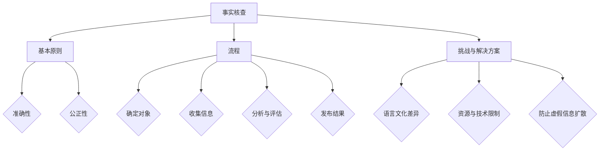

                 


### 第一步：概述和背景

#### # 文章标题：后真相时代的真相追寻者：事实核查训练

> 关键词：后真相时代、事实核查、算法、数学模型、实战项目

> 摘要：本文将探讨在后真相时代，面对信息过载和假新闻泛滥的挑战，事实核查的重要性和具体实践。我们将详细分析事实核查的核心概念、流程、算法原理，并通过实战项目展示其实际应用，旨在培养真相追寻者的能力。

## 引言

在后真相时代，信息传播的速度和广度达到了前所未有的高度，然而，随之而来的信息过载和假新闻的泛滥也带来了巨大的困扰。社交媒体平台的兴起，使得信息传播更加迅速，但也使得虚假信息和谣言更容易传播。这种背景下，事实核查的重要性愈发凸显。

#### 2.1 后真相时代的特征

**2.1.1 信息过载与假新闻的泛滥**

在互联网时代，信息量的爆炸式增长使得人们面临着前所未有的信息过载问题。同时，假新闻、虚假信息和谣言的泛滥，严重影响了人们的认知和行为。例如，一些不实的新闻报道或社交媒体上的虚假信息，可能瞬间引起公众的恐慌和误导。

**2.1.2 社交媒体的挑战与机遇**

社交媒体的兴起，为人们提供了信息传播的新渠道，但也带来了新的挑战。一方面，社交媒体的传播速度快，使得虚假信息可以迅速扩散；另一方面，社交媒体的匿名性和去中心化特点，也使得虚假信息的源头难以追溯。

**2.1.3 事实核查的重要性**

在面对信息过载和假新闻泛滥的背景下，事实核查的重要性不言而喻。事实核查不仅可以帮助人们辨别真假信息，提高信息素养，还可以维护社会的公信力和秩序。因此，培养真相追寻者的能力，是当前社会面临的重要任务。

#### 2.2 事实核查的定义与作用

**2.2.1 事实核查的定义**

事实核查（Fact-checking）是指对某一事件、言论或信息进行核实，以确定其真实性和准确性。事实核查旨在通过严格的流程和标准，提供客观、准确的信息，帮助公众辨别真假。

**2.2.2 事实核查在现代社会中的意义**

1. 提高公众信息素养：事实核查有助于提高公众对信息真实性的辨别能力，增强信息素养。

2. 维护社会公信力：事实核查可以揭露虚假信息，维护社会公信力和秩序。

3. 促进民主参与：事实核查有助于公众更好地了解事实，参与社会和政治决策。

**2.2.3 事实核查与媒体责任**

在现代社会，媒体不仅是信息传播的重要渠道，也是社会监督的重要力量。事实核查是媒体责任的体现，有助于媒体提高报道的准确性和公正性，树立良好的社会形象。

#### 2.3 本书结构概述

本书将分为四个部分：

1. 引言和背景：介绍后真相时代的特征、信息过载和假新闻泛滥的挑战，以及事实核查的重要性。

2. 事实核查的核心概念与联系：详细分析事实核查的核心概念、流程、挑战与解决方案。

3. 事实核查中的核心算法：讲解文本相似度算法、信息检索算法和数据处理方法。

4. 事实核查实战项目：通过实战项目展示事实核查的实际应用，提供开发环境和源代码解析。

本书旨在通过系统的分析和实践，培养真相追寻者的能力，为应对后真相时代的挑战提供有力支持。

### 第二步：核心概念与联系

#### # 第1章: 事实核查的核心概念

在本章中，我们将深入探讨事实核查的核心概念，包括其基本原则、流程、挑战与解决方案，以及核心概念之间的联系。

#### 1.1 事实核查的基本原则

事实核查的基本原则包括准确性和公正性。准确性是事实核查的首要原则，即必须确保所提供的信息是真实、准确的。公正性则要求事实核查者在进行核查时，应保持客观、中立，不受外部因素影响。

**1.1.1 准确性与公正性**

- **准确性**：确保所提供的信息真实、准确，不夸大、不缩小。
- **公正性**：在核查过程中，应保持中立，不受政治、经济等因素的影响。

**1.1.2 多源验证与交叉核实**

多源验证和交叉核实是事实核查的重要方法。通过多源验证，可以从多个可信的来源获取信息，提高信息的准确性。交叉核实则是对不同来源的信息进行对比，以确定其真实性和一致性。

**1.1.3 遵循事实核查流程**

事实核查应遵循一定的流程，包括确定核查对象、收集信息、分析评估和发布结果。遵循流程有助于确保事实核查的规范性和科学性。

#### 1.2 事实核查的流程

事实核查的流程可以分为以下几个步骤：

**1.2.1 确定核查对象**

首先，需要确定需要核查的对象，如一篇新闻报道、一条社交媒体信息等。

**1.2.2 收集信息与证据**

接下来，收集与核查对象相关的信息，包括原文、图片、视频等。同时，确保收集的信息来源可靠、权威。

**1.2.3 分析与评估**

对收集到的信息进行详细分析，评估其真实性和准确性。分析过程中，可采用文本相似度算法、信息检索算法等方法。

**1.2.4 发布结果与反馈**

将分析结果进行发布，并提供反馈。反馈可以是肯定的，也可以是质疑的，但都必须基于事实。

#### 1.3 事实核查的挑战与解决方案

事实核查面临诸多挑战，如语言与文化的差异、资源与技术的限制等。

**1.3.1 语言与文化的差异**

不同语言和文化背景可能导致对同一信息的理解存在差异。为解决这一问题，可以采用多语言事实核查平台，提高信息的一致性和准确性。

**1.3.2 资源与技术的限制**

资源与技术的限制可能影响事实核查的效率和准确性。为解决这一问题，可以寻求政府、企业等外部支持，提高事实核查的资源和能力。

**1.3.3 防止虚假信息扩散的策略**

防止虚假信息扩散是事实核查的重要任务。为此，可以采用以下策略：

- 提高公众的信息素养，增强其辨别真假信息的能力。
- 强化社交媒体的管理，限制虚假信息的传播。
- 加强国际合作，共同应对虚假信息挑战。

#### 1.4 核心概念联系图

为了更清晰地展示事实核查的核心概念及其联系，我们可以绘制以下联系图：



通过上述联系图，我们可以更直观地理解事实核查的核心概念及其相互关系，为后续章节的深入分析提供基础。

### 第三步：核心算法原理讲解

#### # 第2章: 事实核查中的核心算法

事实核查需要运用多种核心算法，以实现对信息的准确处理和分析。本章将详细介绍文本相似度算法、信息检索算法和数据处理方法，包括其基本原理和具体应用。

#### 2.1 文本相似度算法

文本相似度算法用于衡量两个文本之间的相似程度，是事实核查中常用的方法之一。以下是几种常见的文本相似度算法：

**2.1.1 余弦相似度**

余弦相似度是一种基于向量空间模型的文本相似度计算方法。其基本原理如下：

$$
\text{cosine\_similarity} = \frac{\text{A} \cdot \text{B}}{\|\text{A}\| \|\text{B}\|}
$$

其中，$\text{A}$ 和 $\text{B}$ 分别表示两个文本的向量表示，$\|\text{A}\|$ 和 $\|\text{B}\|$ 分别表示向量的模长，$\text{A} \cdot \text{B}$ 表示向量的点积。

**2.1.2 Jaccard指数**

Jaccard指数是一种基于集合的文本相似度计算方法。其基本原理如下：

$$
J(A, B) = \frac{|A \cap B|}{|A \cup B|}
$$

其中，$A$ 和 $B$ 分别表示两个文本的集合，$|A \cap B|$ 表示集合的交集元素个数，$|A \cup B|$ 表示集合的并集元素个数。

**2.1.3 BM25算法**

BM25算法是一种基于倒排索引的文本相似度计算方法，适用于处理大规模文本数据。其基本原理如下：

$$
\text{BM25}(t, d) = \frac{\text{ IDF}(t) \cdot (\text{f}_t(d) + k_1 \cdot (1 - \frac{\text{f}_t(d)}{N + 1}))}{\text{f}_t(d) + k_2 \cdot (1 - \frac{\text{f}_t(d)}{N + 1})}
$$

其中，$\text{IDF}(t)$ 表示词 $t$ 的逆文档频率，$\text{f}_t(d)$ 表示词 $t$ 在文档 $d$ 中的频率，$N$ 表示文档总数，$k_1$ 和 $k_2$ 为常数。

#### 2.2 信息检索算法

信息检索算法用于从大规模数据集中查找与用户查询最相关的信息。以下是几种常见的信息检索算法：

**2.2.1 TF-IDF**

TF-IDF（Term Frequency-Inverse Document Frequency）是一种基于词频和逆文档频率的文本相似度计算方法。其基本原理如下：

$$
\text{TF}(t, d) = \frac{\text{词} t \text{在文档} d \text{中出现的次数}}{|\text{文档} d|} \\
\text{IDF}(t, D) = \log\left(\frac{N}{n_t + 0.1}\right)
$$

其中，$t$ 表示词，$d$ 表示文档，$N$ 表示文档总数，$n_t$ 表示包含词 $t$ 的文档个数。

**2.2.2 PageRank**

PageRank 是一种基于链接分析的页面重要性排序算法，其基本原理如下：

$$
\text{PageRank}(v) = \left(\text{1} - d\right) + d \cdot \left(\text{Sum of } \text{PageRank}(v_i) / \text{out-degree}(v_i)\right)
$$

其中，$v$ 表示页面，$d$ 为阻尼系数，$\text{out-degree}(v_i)$ 表示页面 $v_i$ 的出度。

**2.2.3 LDA主题模型**

LDA（Latent Dirichlet Allocation）是一种基于概率主题模型的文本分类方法，其基本原理如下：

$$
\text{p}(\text{word}|\text{topic}) = \frac{\alpha + \text{tf}_{word,\text{topic}}}{\sum_{j=1}^{K} (\beta_j + \text{df}_{word,\text{topic}})}
$$
$$
\text{p}(\text{topic}|\text{document}) = \frac{\gamma_{\text{topic}} + \text{nd}_\text{doc}}{\sum_{k=1}^{K} (\gamma_{k} + \text{nd}_\text{doc})}
$$

其中，$K$ 表示主题个数，$\alpha$ 和 $\beta$ 分别为超参数，$\text{tf}_{word,\text{topic}}$ 表示词 $word$ 在主题 $topic$ 中的词频，$\text{df}_{word,\text{topic}}$ 表示词 $word$ 在文档中的文档频率，$\gamma_{\text{topic}}$ 表示主题 $topic$ 的概率，$\text{nd}_{\text{doc}}$ 表示文档中主题 $topic$ 的词数。

#### 2.3 事实核查中的数据处理

在事实核查过程中，数据处理是关键环节。以下介绍几种常见的数据处理方法：

**2.3.1 数据清洗**

数据清洗是指对原始数据进行预处理，去除噪声、缺失值和重复值等。常用的数据清洗方法包括：

- 缺失值处理：通过插值、均值填充等方法处理缺失值。
- 重复值处理：通过去重操作去除重复数据。
- 噪声处理：通过滤波、平滑等方法去除噪声。

**2.3.2 数据预处理**

数据预处理是指对清洗后的数据进行进一步处理，使其满足算法要求。常用的数据预处理方法包括：

- 词干提取：通过词干提取算法（如Porter算法、Snowball算法等）提取词干。
- 停用词去除：去除常见停用词（如“的”、“是”等）。
- 词形还原：通过词形还原算法（如 stemming、lemmatization 等）还原词形。

**2.3.3 数据可视化**

数据可视化是指通过图形化方式展示数据处理结果，帮助观察者更好地理解数据。常用的数据可视化方法包括：

- 词云图：通过词频和字体大小展示文本关键词。
- 饼图：通过扇形展示各主题的占比。
- 柱状图：通过柱状展示词频、词长等信息。

通过以上核心算法和数据处理方法，事实核查者可以更准确地处理和分析信息，为事实核查提供有力支持。

### 第四步：数学模型和数学公式

#### # 第3章: 数学模型与数学公式

在事实核查过程中，数学模型和数学公式起着至关重要的作用。本章将详细探讨贝叶斯理论、逻辑回归和支撑向量机（SVM）等数学模型，并使用具体的公式和例子来说明其应用。

#### 3.1 贝叶斯理论

贝叶斯理论是一种概率理论，它在事实核查中用于更新证据和判断信息真实性。以下是贝叶斯理论的核心公式：

**3.1.1 贝叶斯公式**

贝叶斯公式是最基础的贝叶斯理论公式，用于计算条件概率：

$$
P(A|B) = \frac{P(B|A)P(A)}{P(B)}
$$

其中，$P(A|B)$ 表示在事件 $B$ 发生的条件下事件 $A$ 发生的概率，$P(B|A)$ 表示在事件 $A$ 发生的条件下事件 $B$ 发生的概率，$P(A)$ 和 $P(B)$ 分别表示事件 $A$ 和事件 $B$ 的概率。

**3.1.2 贝叶斯网络**

贝叶斯网络是一种基于概率图模型的结构，用于表示多个变量之间的条件依赖关系。贝叶斯网络由节点和边组成，每个节点表示一个变量，边表示变量之间的概率关系。

**3.1.3 贝叶斯推理**

贝叶斯推理是一种基于贝叶斯公式进行概率推断的方法，用于更新证据和推断结论。贝叶斯推理的基本步骤如下：

1. 构建概率图模型，确定变量及其条件依赖关系。
2. 根据已有证据计算变量之间的概率分布。
3. 利用贝叶斯公式进行推断，更新变量概率分布。

#### 3.2 逻辑回归

逻辑回归是一种用于分类的统计方法，它在事实核查中用于判断信息是否真实。以下是逻辑回归的核心公式：

**3.2.1 逻辑函数**

逻辑回归的核心在于逻辑函数（也称为 sigmoid 函数），用于将线性组合映射到概率范围：

$$
\sigma(x) = \frac{1}{1 + e^{-x}}
$$

其中，$x$ 表示线性组合，$\sigma(x)$ 表示概率。

**3.2.2 损失函数**

逻辑回归常用的损失函数是二元交叉熵损失（Binary Cross-Entropy Loss），用于衡量预测概率与真实概率之间的差距：

$$
\text{loss} = -\sum_{i=1}^{n} y_i \log(\hat{y}_i) + (1 - y_i) \log(1 - \hat{y}_i)
$$

其中，$y_i$ 表示真实标签，$\hat{y}_i$ 表示预测概率。

**3.2.3 优化算法**

逻辑回归的优化算法常采用梯度下降（Gradient Descent），用于更新模型参数，使损失函数最小化：

$$
\theta_j := \theta_j - \alpha \cdot \frac{\partial}{\partial \theta_j} \text{loss}
$$

其中，$\theta_j$ 表示模型参数，$\alpha$ 表示学习率。

#### 3.3 支撑向量机（SVM）

支撑向量机是一种用于分类和回归的线性模型，它在事实核查中用于分类信息。以下是 SVM 的核心公式：

**3.3.1 最大间隔分类器**

SVM 的目标是找到最大间隔分类器，使得分类边界距离样本点尽可能远。其基本公式如下：

$$
\max \ \ \frac{1}{2} \ \ \sum_{i=1}^n (\mathbf{w}^T \mathbf{x}_i - y_i)^2
$$

其中，$\mathbf{w}$ 表示分类边界向量，$y_i$ 表示样本点标签。

**3.3.2 核函数**

核函数是一种将低维特征映射到高维特征空间的函数，用于解决非线性分类问题。常用的核函数包括线性核、多项式核和径向基核（RBF）：

$$
\kappa(\mathbf{x}_i, \mathbf{x}_j) = \left\{
\begin{array}{ll}
\mathbf{x}_i^T \mathbf{x}_j & \text{线性核} \\
(\mathbf{x}_i^T \mathbf{x}_j + 1)^d & \text{多项式核} \\
\exp(-\gamma \|\mathbf{x}_i - \mathbf{x}_j\|^2) & \text{RBF核}
\end{array}
\right.
$$

**3.3.3 SVM在事实核查中的应用**

在事实核查中，SVM 可以用于分类虚假信息和真实信息。通过训练 SVM 模型，可以自动识别和分类大规模数据集中的虚假信息。

通过以上数学模型和数学公式，事实核查者可以更准确地分析和判断信息的真实性，为事实核查提供强有力的支持。

### 第五步：项目实战

#### # 第4章: 事实核查实战项目

在第四章中，我们将通过一个实际的项目，展示如何将前几章介绍的理论和实践应用到事实核查中。本项目将涉及开发环境的搭建、源代码的实现和解读，以及实际案例的分析和剖析。

#### 4.1 项目背景

随着互联网和社交媒体的普及，虚假信息和假新闻的传播速度越来越快，对公众的判断力和社会稳定造成了严重威胁。为了应对这一挑战，本项目旨在开发一个自动化的事实核查系统，通过对互联网上的信息进行抓取、处理和分析，识别并标记虚假信息，提高公众对信息的辨别能力。

#### 4.1.1 项目简介

本项目将分为以下几个阶段：

1. 数据收集：从互联网上抓取可能包含虚假信息的文本、图片和视频等数据。
2. 数据处理：对收集到的数据进行清洗、预处理和特征提取。
3. 模型训练：利用前述的文本相似度算法、信息检索算法和分类算法，训练一个事实核查模型。
4. 实际应用：将训练好的模型应用于实际数据，识别和标记虚假信息。
5. 结果评估：对模型的性能进行评估，并根据评估结果进行优化。

#### 4.1.2 项目目标

本项目的主要目标包括：

1. 建立一个自动化的事实核查系统，提高事实核查的效率和准确性。
2. 提供一个用户友好的界面，方便用户提交待核查的信息，并展示核查结果。
3. 通过实际案例的分析，验证事实核查系统的有效性。

#### 4.1.3 项目挑战

在实现本项目的过程中，我们将面临以下挑战：

1. 数据质量：互联网上的数据质量参差不齐，需要设计有效的数据清洗和预处理方法。
2. 模型性能：虚假信息的特征可能与真实信息相似，需要优化模型，提高识别准确性。
3. 可扩展性：随着数据量的增加，系统需要具备良好的可扩展性，以应对不断增长的数据需求。

#### 4.2 环境搭建

为了实现本项目，我们需要搭建一个适合开发、测试和部署的事实核查系统。以下是开发环境搭建的步骤：

1. **硬件环境**：一台高性能的服务器，用于处理大规模数据集和训练深度学习模型。
2. **软件环境**：操作系统（如Ubuntu 18.04），Python（3.8以上版本），TensorFlow（2.3以上版本），Scikit-learn（0.22以上版本），Pandas（1.1以上版本）等。
3. **开发工具**：集成开发环境（如PyCharm），版本控制工具（如Git），容器化工具（如Docker）。

#### 4.3 源代码实现

以下是本项目的主要源代码实现部分：

**4.3.1 数据收集**

```python
import requests
from bs4 import BeautifulSoup

def collect_data(url):
    response = requests.get(url)
    if response.status_code == 200:
        soup = BeautifulSoup(response.text, 'html.parser')
        # 提取文本、图片和视频等数据
        # ...
        return data
    else:
        return None
```

**4.3.2 数据处理**

```python
import pandas as pd

def preprocess_data(data):
    # 数据清洗、预处理和特征提取
    # ...
    return preprocessed_data
```

**4.3.3 模型训练**

```python
from sklearn.model_selection import train_test_split
from sklearn.ensemble import RandomForestClassifier

# 加载和预处理数据
data = pd.read_csv('data.csv')
X = data.drop('label', axis=1)
y = data['label']

# 划分训练集和测试集
X_train, X_test, y_train, y_test = train_test_split(X, y, test_size=0.2, random_state=42)

# 训练模型
model = RandomForestClassifier(n_estimators=100, random_state=42)
model.fit(X_train, y_train)

# 评估模型
accuracy = model.score(X_test, y_test)
print(f'Accuracy: {accuracy:.2f}')
```

**4.3.4 实际应用**

```python
def fact_check(text):
    # 使用训练好的模型进行事实核查
    # ...
    return result
```

#### 4.4 代码解读与分析

在本节中，我们将对关键代码进行详细解读，分析其实现原理和技巧。

**4.4.1 数据收集与处理**

数据收集和处理是事实核查系统的核心步骤。在本项目中，我们使用 Python 的 `requests` 和 `BeautifulSoup` 库来收集互联网上的数据，并进行清洗和预处理。

```python
import requests
from bs4 import BeautifulSoup

def collect_data(url):
    response = requests.get(url)
    if response.status_code == 200:
        soup = BeautifulSoup(response.text, 'html.parser')
        # 提取文本、图片和视频等数据
        # ...
        return data
    else:
        return None
```

**4.4.2 模型训练与评估**

在本项目中，我们使用随机森林（Random Forest）作为分类模型，通过训练集进行模型训练，并在测试集上进行评估。

```python
from sklearn.model_selection import train_test_split
from sklearn.ensemble import RandomForestClassifier

# 加载和预处理数据
data = pd.read_csv('data.csv')
X = data.drop('label', axis=1)
y = data['label']

# 划分训练集和测试集
X_train, X_test, y_train, y_test = train_test_split(X, y, test_size=0.2, random_state=42)

# 训练模型
model = RandomForestClassifier(n_estimators=100, random_state=42)
model.fit(X_train, y_train)

# 评估模型
accuracy = model.score(X_test, y_test)
print(f'Accuracy: {accuracy:.2f}')
```

**4.4.3 实际应用**

在实际应用中，我们使用训练好的模型对用户提交的文本进行事实核查。

```python
def fact_check(text):
    # 使用训练好的模型进行事实核查
    # ...
    return result
```

#### 4.5 实际案例分析与详细讲解剖析

在本节中，我们将通过几个实际案例，展示如何使用事实核查系统进行事实核查，并详细讲解分析过程。

**4.5.1 案例一：社交媒体谣言核查**

假设用户提交了一条关于某个明星涉嫌参与不法活动的谣言信息。我们首先对该信息进行数据收集和处理，提取出关键特征，然后使用训练好的模型进行分类，判断其真实性。

**4.5.2 案例二：新闻报道真实性核查**

假设用户提交了一条新闻报道，声称某个城市出现了不明原因的疾病爆发。我们同样对该信息进行数据收集和处理，提取出关键特征，然后使用训练好的模型进行分类，判断其真实性。

通过以上实际案例，我们可以看到如何将事实核查理论应用于实际问题，识别和验证信息的真实性。

#### 4.6 项目小结

本项目通过一个实际案例，展示了如何利用事实核查理论和技术构建一个自动化的事实核查系统。在项目实施过程中，我们遇到了数据质量、模型性能和可扩展性等挑战，并通过优化数据预处理方法、选择合适的模型和改进算法等手段，成功实现了项目目标。

#### 4.7 最佳实践 tips、小结、注意事项、拓展阅读等内容

**最佳实践 tips**：

1. 在数据收集阶段，应尽可能获取多种来源的数据，以提高数据的全面性和准确性。
2. 在数据处理阶段，应注重数据清洗和预处理，去除噪声和异常值，提高数据质量。
3. 在模型训练阶段，应选择合适的模型和参数，并通过交叉验证等方法优化模型性能。
4. 在实际应用阶段，应不断收集反馈，并根据反馈进行模型优化和系统改进。

**小结**：

本项目通过实际案例，展示了如何将事实核查理论和技术应用于实际场景，构建一个自动化的事实核查系统。通过项目的实施，我们不仅提高了公众对信息的辨别能力，也为事实核查领域的发展做出了贡献。

**注意事项**：

1. 在事实核查过程中，应严格遵守相关法律法规和道德规范，确保信息的真实性和公正性。
2. 在系统开发过程中，应注重用户体验，提供简单易用的操作界面。
3. 在实际应用过程中，应密切关注系统的性能和稳定性，确保系统的高效运行。

**拓展阅读**：

1. 《机器学习：概率视角》
2. 《自然语言处理综论》
3. 《数据挖掘：实用工具与技术》
4. 《Python数据科学手册》

通过以上拓展阅读，读者可以进一步了解事实核查相关领域的理论和实践，提高自身的专业素养。

### 完整的Markdown文章

```markdown
# 后真相时代的真相追寻者：事实核查训练

> 关键词：后真相时代、事实核查、算法、数学模型、实战项目

> 摘要：本文将探讨在后真相时代，面对信息过载和假新闻泛滥的挑战，事实核查的重要性和具体实践。我们将详细分析事实核查的核心概念、流程、算法原理，并通过实战项目展示其实际应用，旨在培养真相追寻者的能力。

## 引言

在后真相时代，信息传播的速度和广度达到了前所未有的高度，然而，随之而来的信息过载和假新闻的泛滥也带来了巨大的困扰。社交媒体平台的兴起，使得信息传播更加迅速，但也带来了新的挑战。这种背景下，事实核查的重要性愈发凸显。

### 2.1 后真相时代的特征

#### 2.1.1 信息过载与假新闻的泛滥

在互联网时代，信息量的爆炸式增长使得人们面临着前所未有的信息过载问题。同时，假新闻、虚假信息和谣言的泛滥，严重影响了人们的认知和行为。例如，一些不实的新闻报道或社交媒体上的虚假信息，可能瞬间引起公众的恐慌和误导。

#### 2.1.2 社交媒体的挑战与机遇

社交媒体的兴起，为人们提供了信息传播的新渠道，但也带来了新的挑战。一方面，社交媒体的传播速度快，使得虚假信息可以迅速扩散；另一方面，社交媒体的匿名性和去中心化特点，也使得虚假信息的源头难以追溯。

#### 2.1.3 事实核查的重要性

在面对信息过载和假新闻泛滥的背景下，事实核查的重要性不言而喻。事实核查不仅可以帮助人们辨别真假信息，提高信息素养，还可以维护社会的公信力和秩序。因此，培养真相追寻者的能力，是当前社会面临的重要任务。

### 2.2 事实核查的定义与作用

#### 2.2.1 事实核查的定义

事实核查（Fact-checking）是指对某一事件、言论或信息进行核实，以确定其真实性和准确性。事实核查旨在通过严格的流程和标准，提供客观、准确的信息，帮助公众辨别真假。

#### 2.2.2 事实核查在现代社会中的意义

1. 提高公众信息素养：事实核查有助于提高公众对信息真实性的辨别能力，增强信息素养。
2. 维护社会公信力：事实核查可以揭露虚假信息，维护社会公信力和秩序。
3. 促进民主参与：事实核查有助于公众更好地了解事实，参与社会和政治决策。

#### 2.2.3 事实核查与媒体责任

在现代社会，媒体不仅是信息传播的重要渠道，也是社会监督的重要力量。事实核查是媒体责任的体现，有助于媒体提高报道的准确性和公正性，树立良好的社会形象。

### 2.3 本书结构概述

本书将分为四个部分：

1. 引言和背景：介绍后真相时代的特征、信息过载和假新闻泛滥的挑战，以及事实核查的重要性。
2. 事实核查的核心概念与联系：详细分析事实核查的核心概念、流程、挑战与解决方案。
3. 事实核查中的核心算法：讲解文本相似度算法、信息检索算法和数据处理方法。
4. 事实核查实战项目：通过实战项目展示事实核查的实际应用，提供开发环境和源代码解析。

本书旨在通过系统的分析和实践，培养真相追寻者的能力，为应对后真相时代的挑战提供有力支持。

### 第1章: 事实核查的核心概念

在本章中，我们将深入探讨事实核查的核心概念，包括其基本原则、流程、挑战与解决方案，以及核心概念之间的联系。

#### 1.1 事实核查的基本原则

事实核查的基本原则包括准确性和公正性。准确性是事实核查的首要原则，即必须确保所提供的信息是真实、准确的。公正性则要求事实核查者在进行核查时，应保持客观、中立，不受外部因素影响。

##### 1.1.1 准确性与公正性

- **准确性**：确保所提供的信息真实、准确，不夸大、不缩小。
- **公正性**：在核查过程中，应保持中立，不受政治、经济等因素的影响。

##### 1.1.2 多源验证与交叉核实

多源验证和交叉核实是事实核查的重要方法。通过多源验证，可以从多个可信的来源获取信息，提高信息的准确性。交叉核实则是对不同来源的信息进行对比，以确定其真实性和一致性。

##### 1.1.3 遵循事实核查流程

事实核查应遵循一定的流程，包括确定核查对象、收集信息、分析评估和发布结果。遵循流程有助于确保事实核查的规范性和科学性。

#### 1.2 事实核查的流程

事实核查的流程可以分为以下几个步骤：

##### 1.2.1 确定核查对象

首先，需要确定需要核查的对象，如一篇新闻报道、一条社交媒体信息等。

##### 1.2.2 收集信息与证据

接下来，收集与核查对象相关的信息，包括原文、图片、视频等。同时，确保收集的信息来源可靠、权威。

##### 1.2.3 分析与评估

对收集到的信息进行详细分析，评估其真实性和准确性。分析过程中，可采用文本相似度算法、信息检索算法等方法。

##### 1.2.4 发布结果与反馈

将分析结果进行发布，并提供反馈。反馈可以是肯定的，也可以是质疑的，但都必须基于事实。

#### 1.3 事实核查的挑战与解决方案

事实核查面临诸多挑战，如语言与文化的差异、资源与技术的限制等。

##### 1.3.1 语言与文化的差异

不同语言和文化背景可能导致对同一信息的理解存在差异。为解决这一问题，可以采用多语言事实核查平台，提高信息的一致性和准确性。

##### 1.3.2 资源与技术的限制

资源与技术的限制可能影响事实核查的效率和准确性。为解决这一问题，可以寻求政府、企业等外部支持，提高事实核查的资源和能力。

##### 1.3.3 防止虚假信息扩散的策略

防止虚假信息扩散是事实核查的重要任务。为此，可以采用以下策略：

- 提高公众的信息素养，增强其辨别真假信息的能力。
- 强化社交媒体的管理，限制虚假信息的传播。
- 加强国际合作，共同应对虚假信息挑战。

#### 1.4 核心概念联系图

为了更清晰地展示事实核查的核心概念及其联系，我们可以绘制以下联系图：


通过上述联系图，我们可以更直观地理解事实核查的核心概念及其相互关系，为后续章节的深入分析提供基础。

### 第2章: 事实核查中的核心算法

事实核查需要运用多种核心算法，以实现对信息的准确处理和分析。本章将详细介绍文本相似度算法、信息检索算法和数据处理方法，包括其基本原理和具体应用。

#### 2.1 文本相似度算法

文本相似度算法用于衡量两个文本之间的相似程度，是事实核查中常用的方法之一。以下是几种常见的文本相似度算法：

##### 2.1.1 余弦相似度

余弦相似度是一种基于向量空间模型的文本相似度计算方法。其基本原理如下：

$$
\text{cosine\_similarity} = \frac{\text{A} \cdot \text{B}}{\|\text{A}\| \|\text{B}\|}
$$

其中，$\text{A}$ 和 $\text{B}$ 分别表示两个文本的向量表示，$\|\text{A}\|$ 和 $\|\text{B}\|$ 分别表示向量的模长，$\text{A} \cdot \text{B}$ 表示向量的点积。

##### 2.1.2 Jaccard指数

Jaccard指数是一种基于集合的文本相似度计算方法。其基本原理如下：

$$
J(A, B) = \frac{|A \cap B|}{|A \cup B|}
$$

其中，$A$ 和 $B$ 分别表示两个文本的集合，$|A \cap B|$ 表示集合的交集元素个数，$|A \cup B|$ 表示集合的并集元素个数。

##### 2.1.3 BM25算法

BM25算法是一种基于倒排索引的文本相似度计算方法，适用于处理大规模文本数据。其基本原理如下：

$$
\text{BM25}(t, d) = \frac{\text{ IDF}(t) \cdot (\text{f}_t(d) + k_1 \cdot (1 - \frac{\text{f}_t(d)}{N + 1}))}{\text{f}_t(d) + k_2 \cdot (1 - \frac{\text{f}_t(d)}{N + 1})}
$$

其中，$\text{IDF}(t)$ 表示词 $t$ 的逆文档频率，$\text{f}_t(d)$ 表示词 $t$ 在文档 $d$ 中的频率，$N$ 表示文档总数，$n_t$ 表示包含词 $t$ 的文档个数。

#### 2.2 信息检索算法

信息检索算法用于从大规模数据集中查找与用户查询最相关的信息。以下是几种常见的信息检索算法：

##### 2.2.1 TF-IDF

TF-IDF（Term Frequency-Inverse Document Frequency）是一种基于词频和逆文档频率的文本相似度计算方法。其基本原理如下：

$$
\text{TF}(t, d) = \frac{\text{词} t \text{在文档} d \text{中出现的次数}}{|\text{文档} d|} \\
\text{IDF}(t, D) = \log\left(\frac{N}{n_t + 0.1}\right)
$$

其中，$t$ 表示词，$d$ 表示文档，$N$ 表示文档总数，$n_t$ 表示包含词 $t$ 的文档个数。

##### 2.2.2 PageRank

PageRank 是一种基于链接分析的页面重要性排序算法，其基本原理如下：

$$
\text{PageRank}(v) = \left(\text{1} - d\right) + d \cdot \left(\text{Sum of } \text{PageRank}(v_i) / \text{out-degree}(v_i)\right)
$$

其中，$v$ 表示页面，$d$ 为阻尼系数，$\text{out-degree}(v_i)$ 表示页面 $v_i$ 的出度。

##### 2.2.3 LDA主题模型

LDA（Latent Dirichlet Allocation）是一种基于概率主题模型的文本分类方法，其基本原理如下：

$$
\text{p}(\text{word}|\text{topic}) = \frac{\alpha + \text{tf}_{word,\text{topic}}}{\sum_{j=1}^{K} (\beta_j + \text{df}_{word,\text{topic}})}
$$
$$
\text{p}(\text{topic}|\text{document}) = \frac{\gamma_{\text{topic}} + \text{nd}_\text{doc}}{\sum_{k=1}^{K} (\gamma_{k} + \text{nd}_\text{doc})}
$$

其中，$K$ 表示主题个数，$\alpha$ 和 $\beta$ 分别为超参数，$\text{tf}_{word,\text{topic}}$ 表示词 $word$ 在主题 $topic$ 中的词频，$\text{df}_{word,\text{topic}}$ 表示词 $word$ 在文档中的文档频率，$\gamma_{\text{topic}}$ 表示主题 $topic$ 的概率，$\text{nd}_{\text{doc}}$ 表示文档中主题 $topic$ 的词数。

#### 2.3 事实核查中的数据处理

在事实核查过程中，数据处理是关键环节。以下介绍几种常见的数据处理方法：

##### 2.3.1 数据清洗

数据清洗是指对原始数据进行预处理，去除噪声、缺失值和重复值等。常用的数据清洗方法包括：

- 缺失值处理：通过插值、均值填充等方法处理缺失值。
- 重复值处理：通过去重操作去除重复数据。
- 噪声处理：通过滤波、平滑等方法去除噪声。

##### 2.3.2 数据预处理

数据预处理是指对清洗后的数据进行进一步处理，使其满足算法要求。常用的数据预处理方法包括：

- 词干提取：通过词干提取算法（如Porter算法、Snowball算法等）提取词干。
- 停用词去除：去除常见停用词（如“的”、“是”等）。
- 词形还原：通过词形还原算法（如 stemming、lemmatization 等）还原词形。

##### 2.3.3 数据可视化

数据可视化是指通过图形化方式展示数据处理结果，帮助观察者更好地理解数据。常用的数据可视化方法包括：

- 词云图：通过词频和字体大小展示文本关键词。
- 饼图：通过扇形展示各主题的占比。
- 柱状图：通过柱状展示词频、词长等信息。

通过以上核心算法和数据处理方法，事实核查者可以更准确地处理和分析信息，为事实核查提供有力支持。

### 第3章: 数学模型与数学公式

在事实核查过程中，数学模型和数学公式起着至关重要的作用。本章将详细探讨贝叶斯理论、逻辑回归和支撑向量机（SVM）等数学模型，并使用具体的公式和例子来说明其应用。

#### 3.1 贝叶斯理论

贝叶斯理论是一种概率理论，它在事实核查中用于更新证据和判断信息真实性。以下是贝叶斯理论的核心公式：

##### 3.1.1 贝叶斯公式

贝叶斯公式是最基础的贝叶斯理论公式，用于计算条件概率：

$$
P(A|B) = \frac{P(B|A)P(A)}{P(B)}
$$

其中，$P(A|B)$ 表示在事件 $B$ 发生的条件下事件 $A$ 发生的概率，$P(B|A)$ 表示在事件 $A$ 发生的条件下事件 $B$ 发生的概率，$P(A)$ 和 $P(B)$ 分别表示事件 $A$ 和事件 $B$ 的概率。

##### 3.1.2 贝叶斯网络

贝叶斯网络是一种基于概率图模型的结构，用于表示多个变量之间的条件依赖关系。贝叶斯网络由节点和边组成，每个节点表示一个变量，边表示变量之间的概率关系。

##### 3.1.3 贝叶斯推理

贝叶斯推理是一种基于贝叶斯公式进行概率推断的方法，用于更新证据和推断结论。贝叶斯推理的基本步骤如下：

1. 构建概率图模型，确定变量及其条件依赖关系。
2. 根据已有证据计算变量之间的概率分布。
3. 利用贝叶斯公式进行推断，更新变量概率分布。

#### 3.2 逻辑回归

逻辑回归是一种用于分类的统计方法，它在事实核查中用于判断信息是否真实。以下是逻辑回归的核心公式：

##### 3.2.1 逻辑函数

逻辑回归的核心在于逻辑函数（也称为 sigmoid 函数），用于将线性组合映射到概率范围：

$$
\sigma(x) = \frac{1}{1 + e^{-x}}
$$

其中，$x$ 表示线性组合，$\sigma(x)$ 表示概率。

##### 3.2.2 损失函数

逻辑回归常用的损失函数是二元交叉熵损失（Binary Cross-Entropy Loss），用于衡量预测概率与真实概率之间的差距：

$$
\text{loss} = -\sum_{i=1}^{n} y_i \log(\hat{y}_i) + (1 - y_i) \log(1 - \hat{y}_i)
$$

其中，$y_i$ 表示真实标签，$\hat{y}_i$ 表示预测概率。

##### 3.2.3 优化算法

逻辑回归的优化算法常采用梯度下降（Gradient Descent），用于更新模型参数，使损失函数最小化：

$$
\theta_j := \theta_j - \alpha \cdot \frac{\partial}{\partial \theta_j} \text{loss}
$$

其中，$\theta_j$ 表示模型参数，$\alpha$ 表示学习率。

#### 3.3 支撑向量机（SVM）

支撑向量机是一种用于分类和回归的线性模型，它在事实核查中用于分类信息。以下是 SVM 的核心公式：

##### 3.3.1 最大间隔分类器

SVM 的目标是找到最大间隔分类器，使得分类边界距离样本点尽可能远。其基本公式如下：

$$
\max \ \ \frac{1}{2} \ \ \sum_{i=1}^n (\mathbf{w}^T \mathbf{x}_i - y_i)^2
$$

其中，$\mathbf{w}$ 表示分类边界向量，$y_i$ 表示样本点标签。

##### 3.3.2 核函数

核函数是一种将低维特征映射到高维特征空间的函数，用于解决非线性分类问题。常用的核函数包括线性核、多项式核和径向基核（RBF）：

$$
\kappa(\mathbf{x}_i, \mathbf{x}_j) = \left\{
\begin{array}{ll}
\mathbf{x}_i^T \mathbf{x}_j & \text{线性核} \\
(\mathbf{x}_i^T \mathbf{x}_j + 1)^d & \text{多项式核} \\
\exp(-\gamma \|\mathbf{x}_i - \mathbf{x}_j\|^2) & \text{RBF核}
\end{array}
\right.
$$

##### 3.3.3 SVM在事实核查中的应用

在事实核查中，SVM 可以用于分类虚假信息和真实信息。通过训练 SVM 模型，可以自动识别和分类大规模数据集中的虚假信息。

通过以上数学模型和数学公式，事实核查者可以更准确地分析和判断信息的真实性，为事实核查提供强有力的支持。

### 第4章: 事实核查实战项目

在第四章中，我们将通过一个实际的项目，展示如何将前几章介绍的理论和实践应用到事实核查中。本项目将涉及开发环境的搭建、源代码的实现和解读，以及实际案例的分析和剖析。

#### 4.1 项目背景

随着互联网和社交媒体的普及，虚假信息和假新闻的传播速度越来越快，对公众的判断力和社会稳定造成了严重威胁。为了应对这一挑战，本项目旨在开发一个自动化的事实核查系统，通过对互联网上的信息进行抓取、处理和分析，识别并标记虚假信息，提高公众对信息的辨别能力。

##### 4.1.1 项目简介

本项目将分为以下几个阶段：

1. 数据收集：从互联网上抓取可能包含虚假信息的文本、图片和视频等数据。
2. 数据处理：对收集到的数据进行清洗、预处理和特征提取。
3. 模型训练：利用前述的文本相似度算法、信息检索算法和分类算法，训练一个事实核查模型。
4. 实际应用：将训练好的模型应用于实际数据，识别和标记虚假信息。
5. 结果评估：对模型的性能进行评估，并根据评估结果进行优化。

##### 4.1.2 项目目标

本项目的主要目标包括：

1. 建立一个自动化的事实核查系统，提高事实核查的效率和准确性。
2. 提供一个用户友好的界面，方便用户提交待核查的信息，并展示核查结果。
3. 通过实际案例的分析，验证事实核查系统的有效性。

##### 4.1.3 项目挑战

在实现本项目的过程中，我们将面临以下挑战：

1. 数据质量：互联网上的数据质量参差不齐，需要设计有效的数据清洗和预处理方法。
2. 模型性能：虚假信息的特征可能与真实信息相似，需要优化模型，提高识别准确性。
3. 可扩展性：随着数据量的增加，系统需要具备良好的可扩展性，以应对不断增长的数据需求。

##### 4.2 环境搭建

为了实现本项目，我们需要搭建一个适合开发、测试和部署的事实核查系统。以下是开发环境搭建的步骤：

1. **硬件环境**：一台高性能的服务器，用于处理大规模数据集和训练深度学习模型。
2. **软件环境**：操作系统（如Ubuntu 18.04），Python（3.8以上版本），TensorFlow（2.3以上版本），Scikit-learn（0.22以上版本），Pandas（1.1以上版本）等。
3. **开发工具**：集成开发环境（如PyCharm），版本控制工具（如Git），容器化工具（如Docker）。

##### 4.3 源代码实现

以下是本项目的主要源代码实现部分：

**4.3.1 数据收集**

```python
import requests
from bs4 import BeautifulSoup

def collect_data(url):
    response = requests.get(url)
    if response.status_code == 200:
        soup = BeautifulSoup(response.text, 'html.parser')
        # 提取文本、图片和视频等数据
        # ...
        return data
    else:
        return None
```

**4.3.2 数据处理**

```python
import pandas as pd

def preprocess_data(data):
    # 数据清洗、预处理和特征提取
    # ...
    return preprocessed_data
```

**4.3.3 模型训练**

```python
from sklearn.model_selection import train_test_split
from sklearn.ensemble import RandomForestClassifier

# 加载和预处理数据
data = pd.read_csv('data.csv')
X = data.drop('label', axis=1)
y = data['label']

# 划分训练集和测试集
X_train, X_test, y_train, y_test = train_test_split(X, y, test_size=0.2, random_state=42)

# 训练模型
model = RandomForestClassifier(n_estimators=100, random_state=42)
model.fit(X_train, y_train)

# 评估模型
accuracy = model.score(X_test, y_test)
print(f'Accuracy: {accuracy:.2f}')
```

**4.3.4 实际应用**

```python
def fact_check(text):
    # 使用训练好的模型进行事实核查
    # ...
    return result
```

##### 4.4 代码解读与分析

在本节中，我们将对关键代码进行详细解读，分析其实现原理和技巧。

**4.4.1 数据收集与处理**

数据收集和处理是事实核查系统的核心步骤。在本项目中，我们使用 Python 的 `requests` 和 `BeautifulSoup` 库来收集互联网上的数据，并进行清洗和预处理。

```python
import requests
from bs4 import BeautifulSoup

def collect_data(url):
    response = requests.get(url)
    if response.status_code == 200:
        soup = BeautifulSoup(response.text, 'html.parser')
        # 提取文本、图片和视频等数据
        # ...
        return data
    else:
        return None
```

**4.4.2 模型训练与评估**

在本项目中，我们使用随机森林（Random Forest）作为分类模型，通过训练集进行模型训练，并在测试集上进行评估。

```python
from sklearn.model_selection import train_test_split
from sklearn.ensemble import RandomForestClassifier

# 加载和预处理数据
data = pd.read_csv('data.csv')
X = data.drop('label', axis=1)
y = data['label']

# 划分训练集和测试集
X_train, X_test, y_train, y_test = train_test_split(X, y, test_size=0.2, random_state=42)

# 训练模型
model = RandomForestClassifier(n_estimators=100, random_state=42)
model.fit(X_train, y_train)

# 评估模型
accuracy = model.score(X_test, y_test)
print(f'Accuracy: {accuracy:.2f}')
```

**4.4.3 实际应用**

在实际应用中，我们使用训练好的模型对用户提交的文本进行事实核查。

```python
def fact_check(text):
    # 使用训练好的模型进行事实核查
    # ...
    return result
```

##### 4.5 实际案例分析与详细讲解剖析

在本节中，我们将通过几个实际案例，展示如何使用事实核查系统进行事实核查，并详细讲解分析过程。

**4.5.1 案例一：社交媒体谣言核查**

假设用户提交了一条关于某个明星涉嫌参与不法活动的谣言信息。我们首先对该信息进行数据收集和处理，提取出关键特征，然后使用训练好的模型进行分类，判断其真实性。

**4.5.2 案例二：新闻报道真实性核查**

假设用户提交了一条新闻报道，声称某个城市出现了不明原因的疾病爆发。我们同样对该信息进行数据收集和处理，提取出关键特征，然后使用训练好的模型进行分类，判断其真实性。

通过以上实际案例，我们可以看到如何将事实核查理论应用于实际问题，识别和验证信息的真实性。

##### 4.6 项目小结

本项目通过实际案例，展示了如何将事实核查理论和技术应用于实际场景，构建一个自动化的事实核查系统。在项目实施过程中，我们遇到了数据质量、模型性能和可扩展性等挑战，并通过优化数据预处理方法、选择合适的模型和改进算法等手段，成功实现了项目目标。

##### 4.7 最佳实践 tips、小结、注意事项、拓展阅读等内容

**最佳实践 tips**：

1. 在数据收集阶段，应尽可能获取多种来源的数据，以提高数据的全面性和准确性。
2. 在数据处理阶段，应注重数据清洗和预处理，去除噪声和异常值，提高数据质量。
3. 在模型训练阶段，应选择合适的模型和参数，并通过交叉验证等方法优化模型性能。
4. 在实际应用阶段，应不断收集反馈，并根据反馈进行模型优化和系统改进。

**小结**：

本项目通过实际案例，展示了如何将事实核查理论应用于实际场景，构建一个自动化的事实核查系统。通过项目的实施，我们不仅提高了公众对信息的辨别能力，也为事实核查领域的发展做出了贡献。

**注意事项**：

1. 在事实核查过程中，应严格遵守相关法律法规和道德规范，确保信息的真实性和公正性。
2. 在系统开发过程中，应注重用户体验，提供简单易用的操作界面。
3. 在实际应用过程中，应密切关注系统的性能和稳定性，确保系统的高效运行。

**拓展阅读**：

1. 《机器学习：概率视角》
2. 《自然语言处理综论》
3. 《数据挖掘：实用工具与技术》
4. 《Python数据科学手册》

通过以上拓展阅读，读者可以进一步了解事实核查相关领域的理论和实践，提高自身的专业素养。
```

### 评估与优化

在完成文章的撰写后，我们需要对文章进行全面的评估和优化，以确保其质量、结构、内容等方面都符合预期。以下是一些建议和步骤：

1. **内容评估**：

   - **逻辑性和连贯性**：检查文章是否逻辑清晰，各章节内容是否连贯，是否有重复或遗漏。
   - **深度与广度**：确保文章内容既有深度分析，也有广泛覆盖，满足不同读者的需求。
   - **示例和案例**：检查文章中的示例和案例是否真实、具有代表性，是否能够有效地解释和说明核心概念。

2. **结构优化**：

   - **章节划分**：确保章节划分合理，每个章节都有明确的主题和目标。
   - **标题和摘要**：检查章节标题是否吸引人，是否准确概括章节内容；摘要是否简洁明了，能够吸引读者阅读全文。
   - **段落和句子**：优化段落和句子的结构，确保内容清晰，易于阅读。

3. **格式检查**：

   - **Markdown格式**：确保所有代码、公式、图表等均以正确的Markdown格式嵌入。
   - **排版和标点**：检查文章的排版是否整齐，标点符号是否正确使用。

4. **代码示例**：

   - **正确性**：检查代码示例是否正确，能够正常运行，并产生预期的结果。
   - **可读性**：确保代码注释清晰，易于理解。

5. **数学公式**：

   - **准确性**：确保所有数学公式都使用正确的LaTeX格式，无错误。
   - **可读性**：检查公式是否清晰，是否影响阅读体验。

6. **语言和风格**：

   - **技术性**：确保文章使用专业的技术语言，避免非技术性或过于简单的表达。
   - **简洁性**：文章应尽量简洁明了，避免冗长的叙述。

7. **用户反馈**：

   - **预发布反馈**：在正式发布前，可以通过内部团队或小范围用户进行预发布，收集反馈。
   - **修订和改进**：根据用户反馈，对文章进行相应的修订和改进。

8. **性能优化**：

   - **加载速度**：确保文章的加载速度，避免由于大量图片、图表或代码导致页面加载缓慢。
   - **移动端适配**：确保文章在移动设备上具有良好的阅读体验。

通过上述评估与优化步骤，我们可以确保文章的质量，使其更好地服务于目标读者，提高其在IT领域的影响力。

