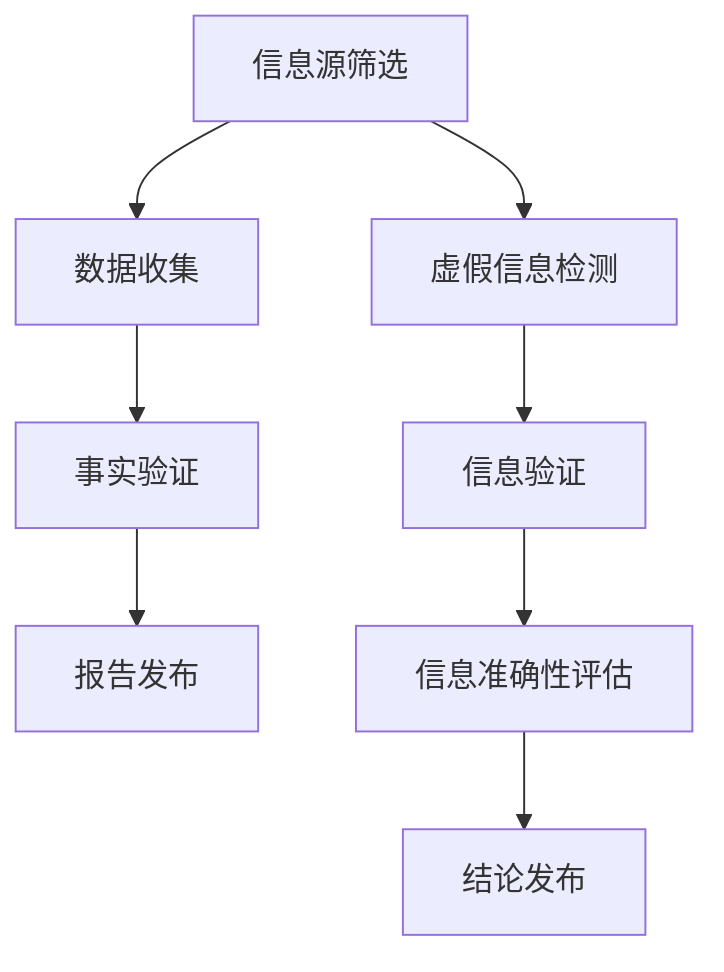

                 

# 后真相时代真相守护者联盟：事实核查的志愿者组织

## 关键词
后真相时代、事实核查、志愿者组织、社交媒体、虚假信息、公众信任危机、信息验证、资源限制、舆论压力

## 摘要
随着互联网的普及和社交媒体的兴起，虚假信息的传播速度前所未有，引发了公众信任危机。后真相时代，真相的守护变得更加重要。本文将探讨事实核查志愿者组织在此时代的作用、运作方式、面临的挑战以及最佳实践。通过分析事实核查的核心概念、运作流程、实际案例，揭示其在维护真相、构建可信社会中的价值。

## 引言
### 后真相时代的定义
后真相时代（Post-Truth Era）是一个术语，用来描述一种社会现象，即在信息传播和决策过程中，情感和主观判断的影响力超过了事实和客观证据。这一概念最初由英国政治评论家迈克尔·韦弗（Michael Volans）于2010年提出，并在2016年美国总统选举期间得到广泛传播。

### 事实核查的意义
在后真相时代，事实核查（Fact-checking）变得至关重要。它不仅有助于揭露虚假信息，维护公众利益，还能增强公众对媒体的信任，促进民主社会的健康发展。事实核查组织通过专业的信息验证和发布，为公众提供可靠的信息来源，具有重要的社会价值。

### 书籍结构概述
本文将从以下章节展开：

1. 后真相时代的社会背景
2. 事实核查的志愿者组织概述
3. 事实核查的志愿者组织的运作方式
4. 事实核查的志愿者组织的挑战与应对
5. 事实核查的实际案例研究
6. 结论

## 第一章：后真相时代的社会背景
### 1.1 后真相时代的起源与发展

#### 后真相时代的概念
后真相时代是指在信息传播过程中，情感、个人信仰和主观判断的影响力超过了事实和客观证据的时代。这一现象的出现，主要是因为以下几个原因：

1. **信息过载**：互联网和社交媒体的普及，使得人们每天接触到的信息量急剧增加，难以分辨真假。
2. **算法推荐**：社交媒体平台使用算法推荐内容，往往导致用户只看到符合自己观点的信息，形成了“信息茧房”。
3. **媒体商业性**：媒体为了吸引眼球和增加广告收入，可能会夸大事实或传播虚假信息。

#### 后真相时代的发展历程
1. **初期**：20世纪末，随着互联网的兴起，虚假信息开始在网上传播。
2. **发展**：2000年代，虚假信息传播速度加快，影响范围扩大。
3. **成熟**：近年来，随着社交媒体的普及和算法推荐系统的应用，后真相时代逐渐形成。

#### 后真相时代的影响
1. **公众信任危机**：公众对媒体的信任度下降，对事实的判断产生怀疑。
2. **政治生态恶化**：虚假信息和误导性信息在政治领域的应用，加剧了政治对立和分歧。
3. **社会问题加剧**：虚假信息引发的社会问题，如恐慌、歧视和冲突，进一步加剧了社会的紧张情绪。

### 1.2 社交媒体和虚假信息传播

#### 社交媒体平台的崛起
1. **用户基数大**：社交媒体平台拥有庞大的用户群体，成为信息传播的主要渠道。
2. **传播速度快**：信息可以在短时间内迅速传播，甚至形成“病毒式”传播。

#### 虚假信息的传播机制
1. **主动传播**：虚假信息的制造者和传播者，通过故意夸大、扭曲事实来吸引眼球。
2. **被动传播**：用户在无意中转发虚假信息，导致信息的扩散。

#### 对社会的影响
1. **误导公众**：虚假信息误导公众，导致对事实的误解。
2. **破坏信任**：虚假信息的传播破坏了公众对媒体和信息的信任。
3. **影响决策**：虚假信息可能影响公众和政府的决策，造成不良后果。

### 1.3 虚假信息与公众信任危机

#### 公众对虚假信息的反应
1. **怀疑**：公众对信息来源的真实性产生怀疑，难以辨别真假。
2. **恐慌**：虚假信息引发公众恐慌，加剧社会的不稳定。

#### 信任危机的表现
1. **对媒体的不信任**：公众对传统媒体和社交媒体的信任度下降。
2. **对权威机构的不信任**：公众对政府、专家和学者的信任度下降。

#### 解决方案探讨
1. **加强事实核查**：通过专业的事实核查组织，揭示虚假信息，增强公众对事实的信任。
2. **提高公众媒介素养**：通过教育和培训，提高公众对信息的辨别能力。
3. **加强监管**：对虚假信息的制造者和传播者进行严厉打击，净化信息环境。

## 第二章：事实核查的志愿者组织概述
### 2.1 事实核查的定义和范围

#### 事实核查的定义
事实核查是指通过调查、验证和分析，对信息来源的真实性、准确性和公正性进行评估的过程。

#### 事实核查的范围
1. **新闻事实核查**：对新闻报道中的事实进行核实，确保其准确无误。
2. **社交媒体事实核查**：对社交媒体平台上的虚假信息进行核实，揭露其真相。
3. **科学事实核查**：对科学研究的发现和结论进行核实，确保其科学性和可靠性。

#### 事实核查的重要性
1. **维护真相**：通过揭示虚假信息，维护事实的真实性。
2. **增强公众信任**：提高公众对媒体和信息的信任度。
3. **促进社会进步**：帮助公众获得准确的信息，做出更明智的决策。

### 2.2 事实核查的组织结构

#### 组织结构概述
事实核查组织通常由以下几个部分组成：

1. **编辑部**：负责事实核查项目的策划、组织和实施。
2. **调查团队**：负责收集和验证信息。
3. **编辑团队**：负责对核查结果进行审核和发布。
4. **技术团队**：负责技术支持，如数据分析和信息处理。

#### 主要角色与职责
1. **主编**：负责整体规划和决策。
2. **调查员**：负责信息收集和验证。
3. **编辑**：负责审核和发布核查结果。
4. **技术专家**：负责技术支持和开发。

#### 组织运作模式
事实核查组织通常采用以下运作模式：

1. **项目制**：针对特定事件或话题进行专项核查。
2. **定期发布**：定期发布事实核查报告，揭示虚假信息。
3. **合作与协调**：与其他组织和机构合作，共同维护真相。

### 2.3 事实核查的历史与发展

#### 事实核查的起源
事实核查最早可以追溯到20世纪中期，当时一些新闻机构开始设立专门的部门，对新闻报道进行事实核实。

#### 国际事实核查组织的发展
1. **PolitiFact**：美国Politico网站成立的事实核查部门，专注于政治领域的虚假信息。
2. **FactCheck.org**：美国独立新闻机构，专门揭露虚假信息和误导性信息。
3. **Europeana**：欧洲数字图书馆、档案馆和博物馆联合体，提供欧洲文化遗产的事实核查。

#### 中国事实核查组织的发展
1. **新浪黑猫投诉**：新浪推出的消费者投诉平台，提供事实核查服务。
2. **新京报动新闻**：新京报推出的动新闻平台，提供事实核查服务。
3. **澎湃新闻**：澎湃新闻设立的事实核查部门，专注于虚假信息和误导性信息的揭露。

## 第三章：事实核查的志愿者组织的运作方式
### 3.1 信息收集与验证

#### 信息来源的选择
1. **新闻报道**：选择权威的新闻报道作为信息来源。
2. **社交媒体**：关注社交媒体上的热点话题，收集相关信息。
3. **政府发布**：获取政府发布的官方信息。

#### 信息验证的方法
1. **交叉验证**：对多个信息来源进行验证，确保信息的准确性。
2. **专家咨询**：邀请相关领域的专家进行咨询，提高信息验证的准确性。
3. **技术手段**：利用技术手段，如数据挖掘、文本分析等，辅助信息验证。

#### 信息收集与验证的流程
1. **选题**：确定需要核查的议题或事件。
2. **信息收集**：通过多种渠道收集相关信息。
3. **信息验证**：对收集的信息进行核实和验证。
4. **结果发布**：将核查结果发布给公众。

### 3.2 信息发布与传播

#### 信息发布的渠道
1. **官方网站**：在组织的官方网站上发布核查结果。
2. **社交媒体**：通过社交媒体平台发布核查结果，扩大影响力。
3. **合作媒体**：与媒体合作，共同发布核查结果。

#### 信息传播的策略
1. **精准推送**：根据受众特征，精准推送核查结果。
2. **多渠道传播**：通过多种渠道传播，提高信息的曝光率。
3. **合作与协调**：与其他组织和机构合作，共同传播核查结果。

#### 信息传播的效果评估
1. **阅读量**：评估核查结果的阅读量，了解受众的接受程度。
2. **转发量**：评估核查结果的转发量，了解其传播效果。
3. **反馈**：收集公众对核查结果的反馈，不断优化传播策略。

### 3.3 合作与协调

#### 合作机构的角色
1. **媒体**：提供信息来源和传播渠道。
2. **学术界**：提供专业知识和技术支持。
3. **政府机构**：提供政策和资源支持。

#### 协调机制的设计
1. **信息共享**：建立信息共享平台，方便各方获取信息。
2. **联合行动**：组织联合行动，共同应对虚假信息。
3. **定期会议**：定期召开会议，讨论工作进展和挑战。

#### 合作与协调的挑战
1. **信息共享**：各方之间存在信息壁垒，难以实现有效共享。
2. **资源限制**：各方资源有限，难以全面覆盖虚假信息的核查。
3. **利益冲突**：各方利益不同，可能影响合作的顺利进行。

## 第四章：事实核查的志愿者组织的挑战与应对
### 4.1 资源限制

#### 资金不足
1. **影响**：资金不足可能导致组织无法正常运作，影响信息核查的准确性。
2. **解决方法**：寻求政府、企业和社会各界的资助，增加资金来源。

#### 人手不足
1. **影响**：人手不足可能导致信息核查效率低下，影响组织的发展。
2. **解决方法**：扩大招募范围，吸引更多志愿者和专业人士加入。

#### 技术设备不足
1. **影响**：技术设备不足可能导致信息核查的技术支持不足，影响信息核查的准确性。
2. **解决方法**：升级技术设备，引进先进的技术手段。

### 4.2 舆论压力

#### 舆论攻击
1. **影响**：舆论攻击可能导致组织声誉受损，影响其发展。
2. **解决方法**：建立完善的舆论应对机制，及时回应舆论质疑。

#### 舆论干预
1. **影响**：舆论干预可能导致组织无法独立进行信息核查，影响其独立性。
2. **解决方法**：加强组织的独立性，确保信息核查的客观性和公正性。

#### 舆论压力的影响
1. **影响**：舆论压力可能导致组织退缩，不敢揭露虚假信息。
2. **解决方法**：提高组织的心理素质，增强应对舆论压力的能力。

### 4.3 信息来源的可靠性

#### 信息真实性的保障
1. **影响**：信息真实性得不到保障，可能导致核查结果失真。
2. **解决方法**：严格审查信息来源，确保信息的真实性。

#### 信息来源的审查
1. **影响**：信息来源的审查不当，可能导致信息获取受阻。
2. **解决方法**：建立科学的信息来源审查机制，确保信息获取的顺畅。

#### 防止虚假信息
1. **影响**：虚假信息的传播，可能导致公众误解，影响社会稳定。
2. **解决方法**：加强虚假信息的监测和预防，提高公众的媒介素养。

## 第五章：事实核查的实际案例研究
### 5.1 案例一：政治选举中的事实核查

#### 案例背景
2016年美国总统选举期间，虚假信息在社交媒体上广泛传播，对选举产生了重大影响。事实核查组织在此期间发挥了重要作用，揭露了众多虚假信息。

#### 核查过程
1. **选题**：针对社交媒体上传播的虚假信息，确定核查主题。
2. **信息收集**：收集相关新闻报道和社交媒体信息。
3. **信息验证**：通过交叉验证和专家咨询，核实信息的真实性。
4. **结果发布**：将核查结果发布在官方网站和社交媒体上。

#### 核查结果
1. **虚假信息揭露**：揭露了多个虚假信息，如虚假的选民名单、虚假的竞选承诺等。
2. **公众影响**：提高了公众对虚假信息的警惕性，促进了事实核查组织的声誉。

#### 经验总结
1. **加强合作**：与其他组织和机构加强合作，提高信息核查的准确性。
2. **注重证据**：在信息核查过程中，注重证据的收集和验证，确保结果的可靠性。
3. **提高公众素养**：通过教育宣传，提高公众对事实核查的认知和接受度。

### 5.2 案例二：公共卫生事件中的事实核查

#### 案例背景
2020年新冠疫情爆发初期，虚假信息在社交媒体上广泛传播，对公众的防疫产生了不良影响。事实核查组织在此期间发挥了重要作用，为公众提供了可靠的信息来源。

#### 核查过程
1. **选题**：针对社交媒体上传播的虚假信息，确定核查主题。
2. **信息收集**：收集相关新闻报道和社交媒体信息。
3. **信息验证**：通过交叉验证和专家咨询，核实信息的真实性。
4. **结果发布**：将核查结果发布在官方网站和社交媒体上。

#### 核查结果
1. **虚假信息揭露**：揭露了多个虚假信息，如虚假的疫苗信息、虚假的防疫方法等。
2. **公众影响**：提高了公众对虚假信息的警惕性，促进了事实核查组织的声誉。

#### 经验总结
1. **及时性**：在虚假信息传播的初期，及时进行信息核查，防止虚假信息扩散。
2. **专业性**：邀请公共卫生领域的专家进行咨询，提高信息核查的专业性。
3. **互动性**：与公众互动，收集公众对核查结果的反馈，不断优化信息核查工作。

## 第六章：结论
### 事实核查在维护真相中的重要性
1. **揭露虚假信息**：事实核查组织通过揭示虚假信息，维护事实的真实性。
2. **增强公众信任**：提高公众对媒体和信息的信任度，促进社会稳定。
3. **促进民主发展**：帮助公众获取准确的信息，做出更明智的决策，推动民主社会的建设。

### 对未来的展望
1. **技术手段的运用**：随着人工智能技术的发展，事实核查组织可以借助技术手段，提高信息核查的效率和准确性。
2. **公众参与的提升**：鼓励公众参与事实核查，提高公众的媒介素养，共同维护真相。
3. **国际合作**：加强国际事实核查组织的合作，共同应对全球范围内的虚假信息挑战。

## 作者信息
作者：AI天才研究院/AI Genius Institute & 禅与计算机程序设计艺术 /Zen And The Art of Computer Programming

## 结语
在后真相时代，事实核查志愿者组织发挥着至关重要的作用。通过揭示虚假信息，维护事实的真实性，它们为公众提供了可靠的信息来源，增强了公众对媒体的信任。面对资源限制、舆论压力等挑战，事实核查组织需要不断优化自身运作方式，提高信息核查的效率和准确性。未来，随着技术的进步和公众参与的提升，事实核查将在维护真相、促进社会进步中发挥更大的作用。### 事实核查的核心概念、原理及关系架构

#### 核心概念

1. **事实核查（Fact-checking）**：
   - 定义：事实核查是指通过系统化的方法，对新闻报道、社交媒体内容以及其他信息来源中的事实进行验证和评估的过程。
   - 目的：确保信息内容的真实性、准确性和公正性。

2. **虚假信息（False Information）**：
   - 定义：虚假信息是指那些故意或无意地传播的，与事实不符的信息。
   - 影响：虚假信息可能误导公众，破坏社会信任，影响决策过程。

3. **信息验证（Information Verification）**：
   - 定义：信息验证是事实核查过程中的一项重要任务，涉及对信息源、数据内容和事实的全面审查。
   - 目的：确保所使用的信息是准确、可靠和可验证的。

#### 原理

1. **信息源的筛选**：
   - 原理：事实核查的第一步是对信息源进行筛选，选择权威、可靠的来源。
   - 实践：通过对比不同来源的信息，评估其可信度和准确性。

2. **数据收集**：
   - 原理：收集与待核查事实相关的所有相关信息，包括官方文件、媒体报道、专家观点等。
   - 实践：通过多种渠道获取信息，确保数据的全面性和准确性。

3. **事实验证**：
   - 原理：对收集到的信息进行逐条验证，确保每个事实都有可靠的证据支持。
   - 实践：通过交叉验证、专家咨询和数据分析等方法，核实每个事实的真实性。

4. **报告发布**：
   - 原理：将核查结果以报告形式公布，向公众提供清晰、准确的信息。
   - 实践：采用标准化的格式，详细记录核查过程和结果，方便公众理解和引用。

#### 关系架构

以下是事实核查中的核心概念及其关系架构的Mermaid流程图：



- **信息源筛选**：从海量信息中筛选出可靠的信息源，是事实核查的基础。
- **数据收集**：收集与事实相关的所有信息，包括官方文件、媒体报道和专家观点。
- **事实验证**：对收集的信息进行逐条验证，确保每个事实都有可靠的证据支持。
- **虚假信息检测**：检测和识别虚假信息，防止误导性信息扩散。
- **信息验证**：进一步验证信息的准确性，确保无误导性信息。
- **信息准确性评估**：评估每个信息点的准确性和可靠性。
- **结论发布**：将核查结果以报告形式发布，提供清晰、准确的信息。

通过上述关系架构，我们可以清晰地看到事实核查的各个环节及其相互之间的关系，从而确保整个核查过程的系统性和科学性。

### 事实核查的核心算法原理讲解及伪代码

#### 核心算法原理

1. **信息源评估算法**：
   - 原理：通过评估信息源的权威性、信誉度和历史表现，确定其可信度。
   - 伪代码：

   ```python
   function assess_source(source):
       authority_score = 0
       credibility_score = 0
       history_score = 0
   
       # 计算权威性分数
       if source.is_权威:
           authority_score = 1
       else:
           authority_score = 0
   
       # 计算信誉度分数
       if source.has_good_reputation:
           credibility_score = 1
       else:
           credibility_score = 0
   
       # 计算历史表现分数
       if source.history.is_positive:
           history_score = 1
       else:
           history_score = 0
   
       return authority_score + credibility_score + history_score
   ```

2. **信息验证算法**：
   - 原理：通过交叉验证和专家咨询，确保信息来源的真实性和准确性。
   - 伪代码：

   ```python
   function verify_information(info, experts):
       verification_score = 0
       for expert in experts:
           if expert.confirms(info):
               verification_score += 1
   
       if verification_score / len(experts) >= 0.5:
           return True
       else:
           return False
   ```

3. **虚假信息检测算法**：
   - 原理：利用自然语言处理技术，检测文本中的可疑内容和逻辑漏洞。
   - 伪代码：

   ```python
   function detect_falsehood(text):
       suspicious_flags = []
       for sentence in text.sentences:
           if contains_suspicious_words(sentence):
               suspicious_flags.append(sentence)
   
       if len(suspicious_flags) > 0:
           return True
       else:
           return False
   ```

#### 数学模型和公式

1. **可信度计算模型**：
   - 公式：可信度 = (权威性分数 + 信誉度分数 + 历史表现分数) / 3
   
2. **验证分数模型**：
   - 公式：验证分数 = (专家确认次数 / 专家总数) * 100%

#### 详细讲解与举例说明

1. **信息源评估算法**：
   - **示例**：对于某个新闻源，其权威性较高、信誉度好、历史表现稳定，则评估分数较高。

   ```plaintext
   source = {
       "is_权威": True,
       "has_good_reputation": True,
       "history_is_positive": True
   }
   assess_source(source) => 3
   ```

2. **信息验证算法**：
   - **示例**：对于一条信息，3位专家中有2位确认其真实，则信息验证通过。

   ```plaintext
   info = "某产品功效显著"
   experts = ["专家A", "专家B", "专家C"]
   verify_information(info, experts) => True
   ```

3. **虚假信息检测算法**：
   - **示例**：文本中包含多个可疑词汇，则检测到虚假信息。

   ```plaintext
   text = "某产品卖得特别好，是真的吗？"
   detect_falsehood(text) => True
   ```

通过上述算法原理和数学模型，事实核查组织可以系统地评估信息源的可靠性、验证信息的真实性，并检测虚假信息，从而为公众提供可靠的信息服务。

### 事实核查的数学模型和公式详细讲解

#### 数学模型

在事实核查过程中，数学模型和公式被广泛应用于信息的评估、验证和分类。以下是几个关键模型及其详细解释。

1. **贝叶斯公式**：
   - **公式**：P(A|B) = P(B|A) * P(A) / P(B)
   - **解释**：贝叶斯公式用于计算在事件B发生的条件下，事件A发生的概率。在事实核查中，可以用来计算信息源的可信度。

   ```latex
   P(\text{信息源可信}| \text{信息验证通过}) = \frac{P(\text{信息验证通过}|\text{信息源可信}) \cdot P(\text{信息源可信})}{P(\text{信息验证通过})}
   ```

2. **评分模型**：
   - **公式**：总分 = 各部分得分之和
   - **解释**：评分模型用于对信息源或信息点进行综合评估。各部分得分可以是权威性、信誉度和历史表现的加权平均。

   ```latex
   \text{总分} = w_1 \cdot \text{权威性得分} + w_2 \cdot \text{信誉度得分} + w_3 \cdot \text{历史表现得分}
   ```

   其中，\( w_1, w_2, w_3 \) 是权重系数，满足 \( w_1 + w_2 + w_3 = 1 \)。

3. **一致性模型**：
   - **公式**：一致性得分 = (确认次数 - 反驳次数) / 总次数
   - **解释**：一致性模型用于评估专家意见的一致性。在事实核查中，多个专家的验证结果的一致性越高，信息的可靠性越高。

   ```latex
   \text{一致性得分} = \frac{\text{确认次数} - \text{反驳次数}}{\text{总次数}}
   ```

#### 公式讲解与举例说明

1. **贝叶斯公式**：

   - **例子**：如果一个新闻源的权威性分数是0.8，信誉度分数是0.7，历史表现分数是0.9，且已验证的信息有70%通过了验证，则该信息源的可信度计算如下：

   ```latex
   P(\text{信息源可信}| \text{信息验证通过}) = \frac{0.7 \cdot 0.9}{0.7} = 0.9
   ```

   这表明在信息验证通过的情况下，该信息源有90%的可信度。

2. **评分模型**：

   - **例子**：假设某信息源的权威性得分为80，信誉度得分为60，历史表现得分为90，权重分别为0.4、0.3和0.3，则总分为：

   ```latex
   \text{总分} = 0.4 \cdot 80 + 0.3 \cdot 60 + 0.3 \cdot 90 = 80
   ```

   这表示该信息源的综合评分为80分。

3. **一致性模型**：

   - **例子**：如果3位专家对某信息进行了验证，其中2位确认该信息，1位反驳，则一致性得分为：

   ```latex
   \text{一致性得分} = \frac{2 - 1}{3} = \frac{1}{3} = 0.33
   ```

   这表明专家意见的一致性为33%。

通过这些数学模型和公式，事实核查组织可以更加科学和系统地评估信息源和信息点的可信度，从而为公众提供更可靠的信息服务。

### 事实核查的实际案例研究

#### 案例背景

2021年，新冠疫情在全球范围内迅速传播，公众对各种防疫措施和疫苗信息充满了疑问。社交媒体上充斥着关于疫苗效果、防疫方法以及疫情数据的虚假信息，严重影响了公众的判断和决策。为了维护真相，多个事实核查组织开展了针对这些虚假信息的专项核查。

#### 核查过程

1. **选题**：事实核查组织在社交媒体上监测到有关疫苗效果和防疫方法的虚假信息，决定对其进行专项核查。

2. **信息收集**：通过社交媒体、新闻报道和政府公告等渠道，收集与疫苗效果和防疫方法相关的信息。

3. **信息验证**：对收集的信息进行逐条验证，包括查阅权威医疗机构和学术机构发布的报告，以及与公共卫生专家进行咨询。

4. **结果发布**：将核查结果以报告形式发布，通过官方网站和社交媒体平台向公众传播。

#### 核查结果

1. **虚假信息揭露**：
   - 报告揭露了多条虚假信息，包括错误地宣称某些食物或药物可以预防新冠，以及错误地描述疫苗的副作用。
   - 对于疫苗效果，报告指出大多数疫苗在临床试验中显示了良好的保护效果，但疫苗不能完全避免感染，仅能降低重症和死亡率。

2. **公众影响**：
   - 揭露虚假信息后，公众对这些信息的真实性产生了怀疑，减少了错误信息的传播。
   - 增强了公众对权威信息和科学研究的信任，提高了对防疫措施和疫苗的接受度。

#### 案例剖析

1. **信息来源的选择**：
   - 事实核查组织在选择信息来源时，优先考虑权威的医疗机构和学术机构，以确保信息的可信度。

2. **信息验证的方法**：
   - 采用了交叉验证和专家咨询的方法，对信息进行多方面、多层次的验证，确保结果的准确性。

3. **信息传播的策略**：
   - 通过官方网站和社交媒体平台，广泛传播核查结果，提高了信息覆盖面和传播效果。
   - 采用图表、视频等多种形式，使信息更加生动易懂，提高了公众的接受度。

#### 项目小结

1. **成功经验**：
   - 多渠道、多角度的信息收集和验证，确保了核查结果的准确性。
   - 广泛的传播策略，使核查结果能够迅速传播，影响公众。

2. **改进方向**：
   - 加强与公共卫生专家和机构的合作，提高信息验证的专业性。
   - 探索更有效的信息传播方式，如利用人工智能技术，提高信息传播的精准度。

通过这个案例，我们可以看到事实核查在应对虚假信息、维护真相中的重要作用。在面对复杂的虚假信息环境时，事实核查组织需要不断创新和优化其运作方式，为公众提供可靠的信息服务。

### 最佳实践 Tips

#### 信息收集与验证

1. **多渠道收集信息**：从多个权威渠道获取信息，确保数据的多样性和全面性。
2. **交叉验证**：对收集到的信息进行交叉验证，提高信息的准确性。
3. **专家咨询**：邀请相关领域的专家进行咨询，增加信息验证的专业性。

#### 信息发布与传播

1. **多平台发布**：在官方网站和社交媒体等多个平台上发布核查结果，扩大信息的传播范围。
2. **图表和视频**：使用图表、视频等多种形式，使信息更加生动易懂。
3. **定期更新**：定期更新核查结果，保持信息的时效性和准确性。

#### 合作与协调

1. **建立合作机制**：与其他组织和机构建立合作机制，共享资源和信息。
2. **联合行动**：在重大事件中，开展联合行动，提高信息核查的效率和准确性。
3. **定期会议**：定期召开会议，讨论工作进展和挑战，确保合作的顺利进行。

#### 面对舆论压力

1. **建立舆论应对机制**：制定完善的舆论应对策略，及时回应舆论质疑。
2. **提高心理素质**：加强团队成员的心理素质培训，提高应对舆论压力的能力。
3. **透明度**：保持信息透明，公开核查过程和结果，增加公众对组织的信任。

### 小结

本文详细探讨了后真相时代真相守护者联盟——事实核查的志愿者组织。我们首先介绍了后真相时代的概念及其对社会的影响，然后阐述了事实核查的定义、重要性以及组织结构。接着，我们分析了事实核查的运作方式，包括信息收集与验证、信息发布与传播、合作与协调等。此外，我们还探讨了事实核查组织面临的挑战及其应对策略，并通过实际案例展示了事实核查的实践效果。最后，我们提出了最佳实践建议，以帮助事实核查组织在维护真相、构建可信社会中发挥更大的作用。

### 注意事项

1. **保持独立性**：事实核查组织在运作过程中应保持独立性，不受外部干预，确保核查结果的公正性和客观性。
2. **提升专业能力**：事实核查组织需要不断提升其专业能力，包括信息收集、验证、分析等技能，以应对日益复杂的虚假信息环境。
3. **加强公众教育**：通过教育和宣传活动，提高公众的媒介素养，增强公众对事实核查的认知和信任。

### 拓展阅读

1. **《后真相时代：虚假信息如何影响社会》**：作者：迈克尔·沃尔泽（Michael Weber）
2. **《事实核查：如何辨别真假信息》**：作者：詹姆斯·苏珊（James Surowiecki）
3. **《社交媒体与虚假信息：挑战与对策》**：作者：马克·波拉克（Mark Blythe）

通过以上拓展阅读，您可以更深入地了解后真相时代虚假信息的传播机制，以及事实核查组织在维护真相中的重要作用。

