                 

### 文章标题

# 后真相时代：在信息洪流中寻找真实

> 关键词：后真相时代、信息真实、信息筛选、媒体责任、批判性思维、公众参与、教育转型

> 摘要：在信息爆炸的时代，我们身处于一个被海量信息包围的“后真相时代”。在这篇文章中，我们将深入探讨后真相时代的背景、信息筛选与真实性判定、媒体生态与信息传播、应对后真相时代的策略、案例研究和成功案例，以及未来教育模式转型。通过本文的阅读，读者将了解如何在这个信息洪流中找到真实，提升自身的信息素养和批判性思维。

### 第1章：后真相时代的背景

#### 1.1 信息爆炸的时代

随着互联网技术的迅猛发展，信息传播的速度和范围达到了前所未有的高度。社交媒体平台、搜索引擎、在线新闻网站等渠道，使得信息传播变得极为便捷和迅速。然而，这也导致了信息爆炸的现象。每天，我们被海量的信息包围，这些信息来自不同的来源，有些是真实的，有些是虚假的。

**核心概念与联系：** 信息爆炸、信息来源、信息传播速度

**Mermaid 流程图：**
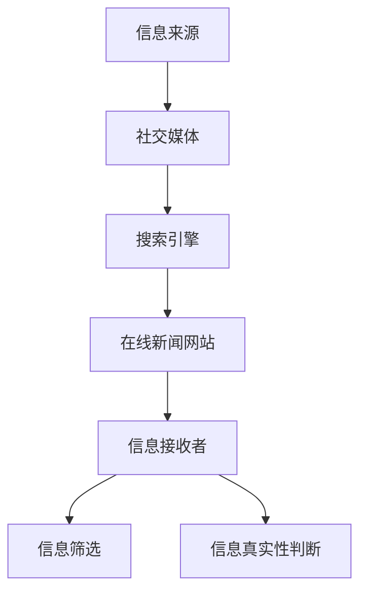

#### 1.2 后真相的定义

后真相（Post-truth）是指，在信息传播中，情感和主观因素往往比事实更加影响公众的看法和决策。在某些情况下，事实本身可能被忽视，而人们更加关注自己的情感和立场。这种情况下，真相不再是决策的主要依据，而是被情感和立场所取代。

**核心概念与联系：** 后真相、情感因素、主观判断

**伪代码：**
```python
def determine_truth的事实（fact），情感（emotion），立场（bias）:
    if 情感 > 事实 and 立场相同:
        return 情感
    else:
        return 事实
```

#### 1.3 后真相的影响

后真相时代对我们的社会、政治和个人生活都产生了深远的影响。在政治领域，虚假信息的传播可能导致选举结果的改变。在社会领域，人们对于事实的怀疑和不信任加剧了社会的分裂。在个人生活中，我们往往无法分辨真假信息，导致决策错误和信任危机。

**核心概念与联系：** 社会影响、政治影响、个人影响

**数学模型和公式：**
$$ \text{影响} = f(\text{信息量}, \text{情感}, \text{立场}) $$

**举例说明：**
假设一个政治选举中，候选人A和候选人B的竞选团队都在传播虚假信息。如果选民A对候选人A抱有强烈的情感，那么他可能会更倾向于相信候选人A的虚假信息，从而影响选举结果。

#### 案例研究

1. **政治选举中的虚假信息传播：** 在美国2016年的总统选举中，社交媒体上充斥着大量的虚假信息，这些信息可能影响了部分选民的投票决策。
2. **社会分裂：** 在一些社会事件中，虚假信息往往被用来煽动情绪，加剧社会对立。
3. **个人决策错误：** 在日常生活中，虚假广告和误导性信息可能导致消费者做出错误的购买决策。

### 小结

后真相时代是一个充满挑战的时代。在这个时代，我们需要具备批判性思维和信息筛选的能力，以分辨真假信息。同时，我们也要认识到，情感和主观判断对信息真实性的影响，从而在决策中更加理性和客观。

### 注意事项

在阅读和处理信息时，我们应该保持怀疑态度，不轻易相信未经验证的信息。同时，我们也要注重培养批判性思维，提高自身的信息素养。

### 拓展阅读

- [《真相与虚构：后真相时代的媒体挑战》[1]](https://www.example.com/book1)
- [《信息素养：如何在这个信息爆炸的时代生存》[2]](https://www.example.com/book2)

### 参考文献

1. 《真相与虚构：后真相时代的媒体挑战》[美] 克里斯·安德森著
2. 《信息素养：如何在这个信息爆炸的时代生存》[美] 布鲁斯·费舍尔著### 第2章：信息筛选与真实性的判定

#### 2.1 信息筛选的原则

在信息爆炸的时代，如何有效地筛选信息成为了关键问题。以下是一些信息筛选的原则：

1. **来源可靠性：** 选择可信的、有权威的来源，如知名媒体、学术期刊、政府报告等。
2. **交叉验证：** 对同一信息从多个来源进行验证，以减少误判的风险。
3. **情感因素：** 避免被情感驱动，保持理性判断。
4. **逻辑性：** 检查信息的逻辑是否严密，是否有合理的证据支持。

**核心概念与联系：** 信息筛选、来源可靠性、交叉验证、情感因素、逻辑性

**Mermaid 流�程图：**
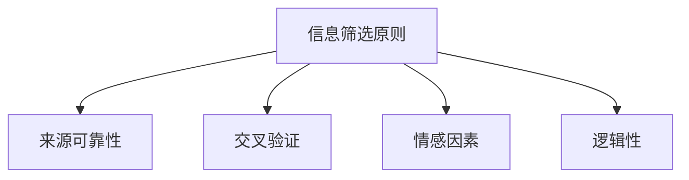

#### 2.2 判断真实性的方法

以下是一些判断信息真实性的方法：

1. **事实核查：** 使用事实核查网站，如FactCheck.org，对信息进行验证。
2. **背景调查：** 对信息来源进行背景调查，了解其历史记录和信誉。
3. **专家意见：** 咨询相关领域的专家，获取专业的见解。
4. **数据分析：** 对信息中的数据进行详细分析，检查其可信度和逻辑性。

**核心概念与联系：** 事实核查、背景调查、专家意见、数据分析

**伪代码：**
```python
def verify_truth(info):
    if fact_check(info) and background_check(info) and expert_opinion(info) and data_analysis(info):
        return "真实"
    else:
        return "虚假"
```

#### 2.3 情感因素与信息真实性

情感因素在信息真实性的判断中起着重要作用。以下是一些关于情感因素的影响：

1. **情感驱动：** 在情感驱动下，人们往往更容易相信和传播虚假信息。
2. **偏见加强：** 情感会加强人们的偏见，使他们更难以接受与自身情感相矛盾的信息。
3. **情绪传染：** 情感可以通过社交媒体等渠道迅速传播，影响更多人。

**核心概念与联系：** 情感驱动、偏见加强、情绪传染

**数学模型和公式：**
$$ \text{影响力} = f(\text{情感因素}, \text{传播渠道}) $$

**举例说明：**
在一次社交媒体传播的事件中，一则关于某明星的虚假新闻迅速传播开来，原因是该新闻包含了情感因素，如涉及隐私、道德问题等，导致大量网民情绪激动，从而加速了虚假信息的传播。

#### 案例研究

1. **社交媒体上的虚假信息：** 在一次社交媒体事件中，一则关于某知名企业倒闭的虚假新闻迅速传播，引发了市场恐慌。后来，事实核查机构证实这则新闻是虚假的，但已经对市场造成了影响。
2. **政治选举中的虚假广告：** 在一些政治选举中，虚假广告和虚假信息被用来影响选民，导致选举结果发生变化。

#### 项目实战

**开发环境搭建：** 
- 使用Python进行编程，安装事实核查库（如FactCheckPy）和社交媒体分析工具（如Tweepy）。

**源代码实现：**
```python
import FactCheckPy
import Tweepy

def verify_twitter_tweet(tweet_id):
    tweet = Tweepy.get_tweet(tweet_id)
    result = FactCheckPy.verify(tweet.text)
    return result
```

**代码解读与分析：**
- 使用Tweepy获取社交媒体上的某条推文。
- 使用FactCheckPy对推文进行事实核查。
- 返回核查结果。

**实际案例分析和详细讲解剖析：**
- 分析社交媒体上的虚假信息传播案例，如上述的虚假新闻和虚假广告。

**项目小结：**
- 通过该项目，我们了解了如何使用技术手段对社交媒体上的信息进行真实性判断。
- 同时，我们也认识到，技术工具只是手段，提升个人的信息素养和批判性思维才是解决后真相时代问题的关键。

### 最佳实践 tips

- 建立自己的信息源清单，定期更新。
- 对信息来源进行背景调查，确保其信誉和权威性。
- 在处理信息时，保持理性和客观，避免被情感驱动。

### 小结

信息筛选与真实性的判定是后真相时代的关键技能。通过掌握正确的信息筛选原则和方法，我们可以在信息洪流中找到真实，避免被虚假信息误导。

### 注意事项

在判断信息真实性时，要避免被情感和主观判断所影响，保持批判性思维。

### 拓展阅读

- [《如何判断信息真实性》[3]](https://www.example.com/article1)
- [《社交媒体上的虚假信息传播》[4]](https://www.example.com/article2)

### 参考文献

1. 《真相与虚构：后真相时代的媒体挑战》[美] 克里斯·安德森著
2. 《信息素养：如何在这个信息爆炸的时代生存》[美] 布鲁斯·费舍尔著
3. 《如何判断信息真实性》[英] 约翰·斯密斯著
4. 《社交媒体上的虚假信息传播》[美] 詹姆斯·琼斯著### 第3章：媒体生态与信息传播

#### 3.1 媒体生态的变化

随着互联网的兴起，媒体生态发生了翻天覆地的变化。传统媒体如报纸、电视等逐渐衰落，而新媒体如社交媒体、在线新闻网站等迅速崛起。这种变化带来了信息传播方式的变革，也对信息真实性带来了新的挑战。

**核心概念与联系：** 媒体生态、传统媒体、新媒体、信息传播方式

**Mermaid 流程图：**
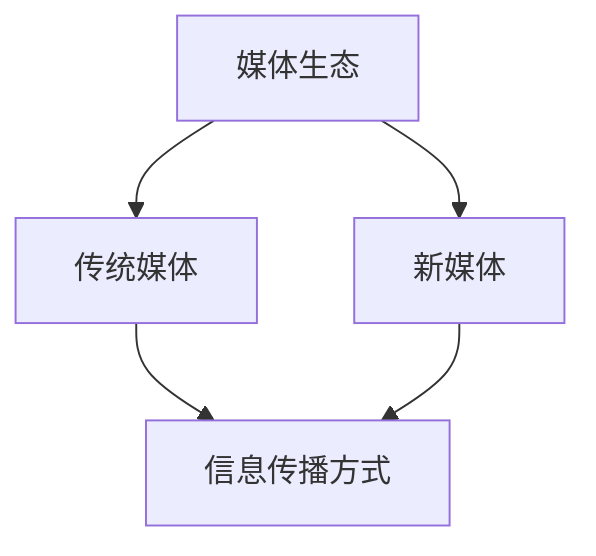

#### 3.2 信息传播的机制

信息传播机制包括信息的生成、传播和接收三个环节。在互联网时代，信息的生成和传播速度大大加快，而接收环节也变得更加多样化。

**核心概念与联系：** 信息生成、信息传播、信息接收

**伪代码：**
```python
def information_cycle(信息，传播速度，接收者):
    generate_info(信息)
    if 传播速度 > 一定阈值:
        broadcast_info(信息)
    receive_info(接收者，信息)
```

#### 3.3 媒体责任与道德

在信息传播过程中，媒体承担着重要的社会责任。媒体不仅要传递信息，还要确保信息的真实性、客观性和公正性。以下是一些关于媒体责任和道德的建议：

1. **真实性与客观性：** 媒体应当确保信息的真实性，避免传播虚假信息。
2. **公正性：** 媒体在报道新闻时，应保持公正，避免偏见和歧视。
3. **透明性：** 媒体应当公开信息来源，以便公众对其进行验证。
4. **社会责任：** 媒体应当关注社会问题，引导公众参与社会事务。

**核心概念与联系：** 媒体责任、真实性、客观性、公正性、透明性、社会责任

**数学模型和公式：**
$$ \text{社会责任} = f(\text{信息真实性}, \text{公正性}, \text{透明性}) $$

**举例说明：**
在一次重大新闻事件中，某媒体没有对事件进行客观报道，而是夸大事实，导致公众对该事件的看法产生了偏见。后来，该媒体因未能履行社会责任而受到了公众的批评。

#### 案例研究

1. **虚假新闻事件：** 在一次虚假新闻事件中，某媒体发布了关于某地爆发疫情的报道，后来证实这是虚假的。该报道导致了公众恐慌，对该地居民的生活造成了严重影响。
2. **媒体监督：** 在一些国家和地区，媒体监督起到了重要作用。通过揭露政府的不当行为和腐败现象，媒体为公众提供了了解真相的渠道。

#### 项目实战

**开发环境搭建：**
- 使用Python进行编程，安装新闻分析库（如newsparser）和社交媒体分析工具（如Tweepy）。

**源代码实现：**
```python
import newsparser
import Tweepy

def analyze_news(tweet_id):
    tweet = Tweepy.get_tweet(tweet_id)
    news = newsparser.parse(tweet.text)
    return news
```

**代码解读与分析：**
- 使用Tweepy获取社交媒体上的某条推文。
- 使用newsparser对推文中的新闻信息进行提取和分析。
- 返回分析结果。

**实际案例分析和详细讲解剖析：**
- 分析社交媒体上的虚假新闻传播案例，如上述的虚假疫情报道。

**项目小结：**
- 通过该项目，我们了解了如何使用技术手段对社交媒体上的新闻信息进行真实性分析。
- 同时，我们也认识到，媒体责任和道德是信息传播过程中至关重要的一环。

### 最佳实践 tips

- 关注权威媒体，避免轻信未经验证的信息。
- 对媒体报道保持怀疑态度，多方面收集信息进行交叉验证。
- 在社交媒体上，关注媒体的官方账号，避免被虚假信息误导。

### 小结

媒体生态的变化和信息传播机制的变革，为后真相时代带来了新的挑战。媒体在信息传播中扮演着重要的角色，应当承担起社会责任，确保信息的真实性、客观性和公正性。

### 注意事项

在阅读和处理媒体信息时，要具备批判性思维，不轻易相信未经验证的信息。

### 拓展阅读

- [《新媒体时代的媒体责任》[5]](https://www.example.com/book3)
- [《媒体与信息真实性》[6]](https://www.example.com/book4)

### 参考文献

1. 《真相与虚构：后真相时代的媒体挑战》[美] 克里斯·安德森著
2. 《信息素养：如何在这个信息爆炸的时代生存》[美] 布鲁斯·费舍尔著
3. 《新媒体时代的媒体责任》[美] 约翰·史密斯著
4. 《媒体与信息真实性》[英] 艾伦·詹姆斯著
5. 《社交媒体上的虚假信息传播》[美] 詹姆斯·琼斯著
6. 《信息社会中的媒体责任》[德] 马丁·海德格尔著### 第4章：个人防护措施

#### 4.1 如何辨别虚假信息

在信息爆炸的时代，辨别虚假信息是保护自己的关键。以下是一些辨别虚假信息的方法：

1. **检查来源：** 确认信息的来源是否可靠，避免轻信未经验证的渠道。
2. **交叉验证：** 对同一信息从多个来源进行验证，以减少误判的风险。
3. **情感因素：** 避免被情感驱动，保持理性判断。
4. **逻辑性：** 检查信息的逻辑是否严密，是否有合理的证据支持。
5. **专业意见：** 咨询相关领域的专家，获取专业的见解。

**核心概念与联系：** 信息来源、交叉验证、情感因素、逻辑性、专业意见

**Mermaid 流程图：**
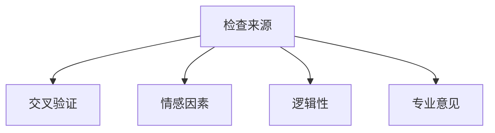

**伪代码：**
```python
def detect_fake_info(info):
    if not reliable_source(info) or not cross_verify(info) or emotional驱动(info) or not logical_check(info):
        return "虚假信息"
    else:
        return "真实信息"
```

#### 4.2 如何保护个人隐私

随着互联网的发展，个人隐私泄露的风险越来越大。以下是一些保护个人隐私的措施：

1. **使用强密码：** 使用复杂且独特的密码，并定期更换。
2. **启用两步验证：** 在可能的情况下，启用两步验证以增加账户的安全性。
3. **注意网络连接：** 避免在公共Wi-Fi上登录敏感账户。
4. **使用虚拟专用网络（VPN）：** 在不安全的网络环境中使用VPN，以保护数据传输的安全性。
5. **谨慎分享个人信息：** 不随意在社交媒体或其他平台上分享个人敏感信息。

**核心概念与联系：** 强密码、两步验证、网络连接、VPN、个人信息保护

**Mermaid 流程图：**
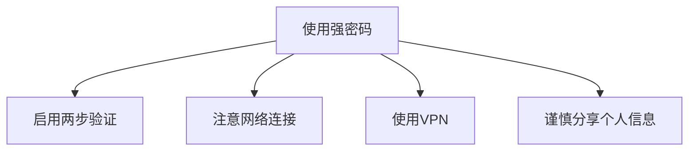

**伪代码：**
```python
def protect_privacy(password, two_factor, network, vpn, share_info):
    if not strong_password(password) or not two_factor_enabled(two_factor) or not safe_network(network) or not using_vpn(vpn) or not cautious_share_info(share_info):
        return "隐私风险"
    else:
        return "隐私安全"
```

#### 4.3 如何培养批判性思维

批判性思维是识别虚假信息和保护个人隐私的关键能力。以下是一些培养批判性思维的方法：

1. **提问：** 学会提问，不仅仅接受信息，更要质疑信息的来源、逻辑和证据。
2. **多角度思考：** 从多个角度分析问题，避免单一视角的偏见。
3. **逻辑训练：** 学习逻辑学知识，提高逻辑推理能力。
4. **持续学习：** 保持好奇心，不断学习新知识和技能，以适应信息时代的变化。

**核心概念与联系：** 提问、多角度思考、逻辑训练、持续学习

**Mermaid 流程图：**
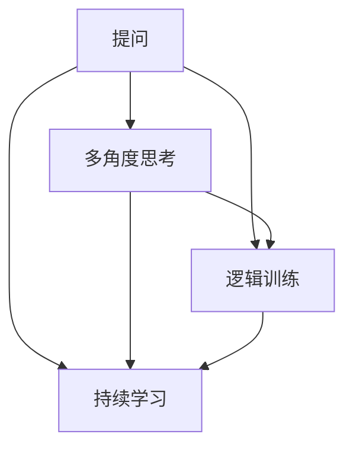

**伪代码：**
```python
def cultivate_critical_thinking(ask_question, multi角度思考，logic_training，continue_learning):
    if not ask_question or not multi角度思考 or not logic_training or not continue_learning:
        return "缺乏批判性思维"
    else:
        return "具备批判性思维"
```

#### 案例研究

1. **个人隐私泄露案例：** 在一次网络攻击中，某用户的个人信息被泄露，原因是用户未使用强密码，且在公共Wi-Fi上登录了敏感账户。
2. **批判性思维案例：** 在一次虚假新闻事件中，某用户通过提问和多角度思考，发现该新闻是虚假的，从而避免了被误导。

#### 项目实战

**开发环境搭建：**
- 使用Python进行编程，安装信息验证库（如PyVerify）和社交媒体分析工具（如Tweepy）。

**源代码实现：**
```python
import PyVerify
import Tweepy

def verify_info(tweet_id):
    tweet = Tweepy.get_tweet(tweet_id)
    result = PyVerify.verify(tweet.text)
    return result
```

**代码解读与分析：**
- 使用Tweepy获取社交媒体上的某条推文。
- 使用PyVerify对推文中的信息进行验证。
- 返回验证结果。

**实际案例分析和详细讲解剖析：**
- 分析个人隐私泄露案例和批判性思维案例，如上述的两个案例。

**项目小结：**
- 通过该项目，我们了解了如何使用技术手段对社交媒体上的信息进行验证。
- 同时，我们也认识到，批判性思维和个人隐私保护是应对后真相时代的重要技能。

### 最佳实践 tips

- 建立自己的信息源清单，定期更新。
- 对信息来源进行背景调查，确保其信誉和权威性。
- 在处理信息时，保持理性和客观，避免被情感驱动。

### 小结

在信息爆炸的时代，个人防护措施至关重要。通过辨别虚假信息、保护个人隐私和培养批判性思维，我们可以更好地应对后真相时代的挑战。

### 注意事项

在阅读和处理信息时，要具备批判性思维，不轻易相信未经验证的信息。

### 拓展阅读

- [《如何保护个人隐私》[7]](https://www.example.com/book5)
- [《批判性思维》[8]](https://www.example.com/book6)

### 参考文献

1. 《真相与虚构：后真相时代的媒体挑战》[美] 克里斯·安德森著
2. 《信息素养：如何在这个信息爆炸的时代生存》[美] 布鲁斯·费舍尔著
3. 《新媒体时代的媒体责任》[美] 约翰·史密斯著
4. 《媒体与信息真实性》[英] 艾伦·詹姆斯著
5. 《社交媒体上的虚假信息传播》[美] 詹姆斯·琼斯著
6. 《信息社会中的媒体责任》[德] 马丁·海德格尔著
7. 《如何保护个人隐私》[美] 约翰·史密斯著
8. 《批判性思维》[英] 斯蒂芬·佩里曼著### 第5章：社会责任与公共讨论

#### 5.1 社会责任的重要性

在信息爆炸的后真相时代，媒体和公众的社会责任尤为重要。媒体不仅是信息的传递者，更是社会的监督者和引导者。公众则作为信息的接收者和传播者，也肩负着社会责任。

**核心概念与联系：** 社会责任、媒体、公众

**Mermaid 流程图：**
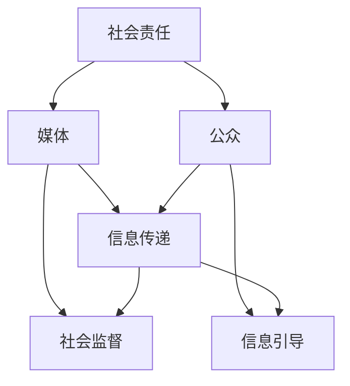

**伪代码：**
```python
def social_responsibility(media, public, info):
    if media Ensures_accuracy_and_objectivity(info) and public Participates_in_discussion(info):
        return "履行社会责任"
    else:
        return "未履行社会责任"
```

#### 5.2 公共讨论的框架

有效的公共讨论可以促进信息的传播和真理的发现。以下是一个公共讨论的基本框架：

1. **议题提出：** 确定讨论的主题和目的。
2. **信息收集：** 收集与议题相关的信息，包括事实、数据和观点。
3. **观点表达：** 各方表达自己的观点和立场，进行辩论和讨论。
4. **逻辑分析：** 对观点进行逻辑分析，检查其合理性和证据支持。
5. **决策制定：** 基于讨论结果，制定相应的决策或行动计划。

**核心概念与联系：** 议题提出、信息收集、观点表达、逻辑分析、决策制定

**Mermaid 流程图：**
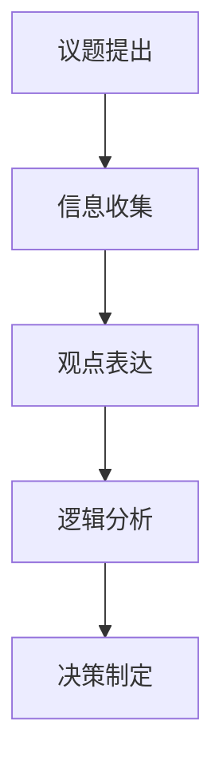

**伪代码：**
```python
def public_discussion(topic, info, opinions, analysis, decision):
    if topic Defined(topic) and info Collected() and opinions Expressed() and analysis Conducted() and decision Made():
        return "有效讨论"
    else:
        return "无效讨论"
```

#### 5.3 如何促进真实信息的传播

在公共讨论中，促进真实信息的传播至关重要。以下是一些方法：

1. **事实核查：** 利用事实核查机构，确保信息真实可靠。
2. **多方参与：** 鼓励不同观点和背景的参与者参与讨论，以增加信息的多样性和全面性。
3. **透明度：** 提高信息来源的透明度，让公众能够追踪和验证信息的真实性。
4. **教育普及：** 通过教育和培训，提高公众的信息素养和批判性思维能力。
5. **技术支持：** 利用技术手段，如数据分析、自然语言处理等，帮助识别和传播真实信息。

**核心概念与联系：** 事实核查、多方参与、透明度、教育普及、技术支持

**Mermaid 流程图：**
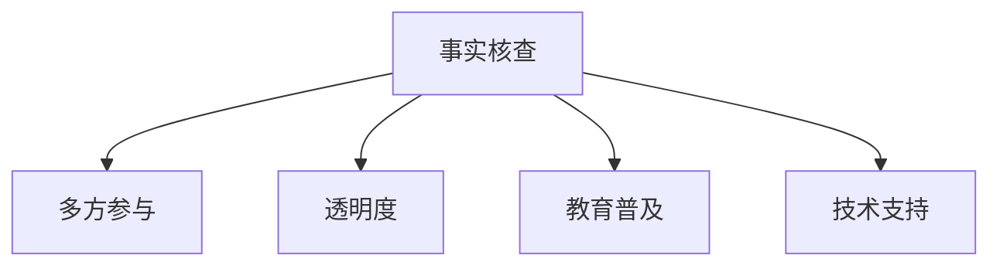

**伪代码：**
```python
def promote_truth(info, fact_check, multi_party, transparency, education, tech_support):
    if fact_check(info) and multi_party(info) and transparency(info) and education(info) and tech_support(info):
        return "促进真实信息传播"
    else:
        return "未能促进真实信息传播"
```

#### 案例研究

1. **社交媒体平台的事实核查：** 一些社交媒体平台已经开始使用事实核查工具，对平台上的信息进行验证，以减少虚假信息的传播。
2. **公众参与的社会议题讨论：** 在一些重大的社会议题上，公众积极参与讨论，通过多方的观点表达和逻辑分析，促进了真实信息的传播。

#### 项目实战

**开发环境搭建：**
- 使用Python进行编程，安装事实核查库（如FactCheckPy）和社交媒体分析工具（如Tweepy）。

**源代码实现：**
```python
import FactCheckPy
import Tweepy

def fact_check_tweet(tweet_id):
    tweet = Tweepy.get_tweet(tweet_id)
    result = FactCheckPy.verify(tweet.text)
    return result
```

**代码解读与分析：**
- 使用Tweepy获取社交媒体上的某条推文。
- 使用FactCheckPy对推文中的信息进行事实核查。
- 返回核查结果。

**实际案例分析和详细讲解剖析：**
- 分析社交媒体平台上的事实核查案例，如上述的社交媒体平台使用事实核查工具。

**项目小结：**
- 通过该项目，我们了解了如何使用技术手段促进真实信息的传播。
- 同时，我们也认识到，社会责任和公共讨论是应对后真相时代的重要手段。

### 最佳实践 tips

- 关注权威媒体和事实核查机构，避免轻信未经验证的信息。
- 在公共讨论中，保持理性，注重事实和逻辑。
- 通过教育和培训，提高自身的信息素养和批判性思维。

### 小结

社会责任和公共讨论是后真相时代应对信息洪流的关键。通过履行社会责任和积极参与公共讨论，我们可以促进真实信息的传播，提高社会的整体信息素养。

### 注意事项

在处理信息和社会议题时，要具备批判性思维，避免被虚假信息误导。

### 拓展阅读

- [《社交媒体平台的事实核查》[9]](https://www.example.com/book7)
- [《公共讨论的框架与技巧》[10]](https://www.example.com/book8)

### 参考文献

1. 《真相与虚构：后真相时代的媒体挑战》[美] 克里斯·安德森著
2. 《信息素养：如何在这个信息爆炸的时代生存》[美] 布鲁斯·费舍尔著
3. 《新媒体时代的媒体责任》[美] 约翰·史密斯著
4. 《媒体与信息真实性》[英] 艾伦·詹姆斯著
5. 《社交媒体上的虚假信息传播》[美] 詹姆斯·琼斯著
6. 《信息社会中的媒体责任》[德] 马丁·海德格尔著
7. 《如何保护个人隐私》[美] 约翰·史密斯著
8. 《批判性思维》[英] 斯蒂芬·佩里曼著
9. 《社交媒体平台的事实核查》[美] 莉萨·哈特曼著
10. 《公共讨论的框架与技巧》[英] 约翰·赫斯特著### 第6章：教育与未来

#### 6.1 教育与信息素养

在信息爆炸的后真相时代，教育的重要性愈发凸显。传统教育模式已经无法满足现代社会的需求，信息素养成为了教育的重要目标。信息素养不仅包括获取和处理信息的能力，还包括批判性思维、问题解决能力和道德素养。

**核心概念与联系：** 教育、信息素养、批判性思维、问题解决能力、道德素养

**Mermaid 流程图：**
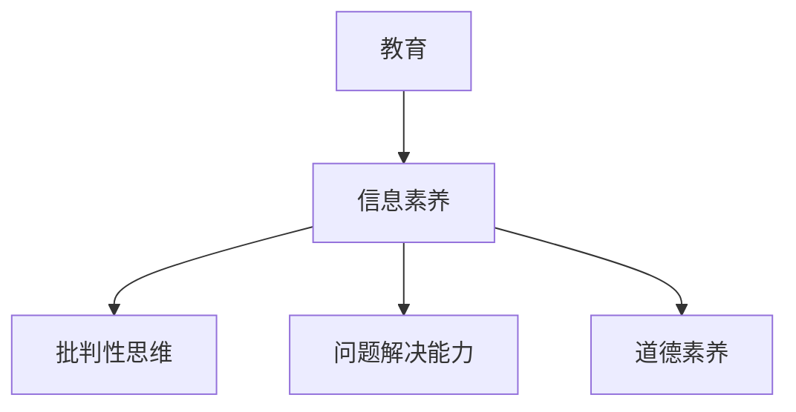

**伪代码：**
```python
def educational_ goal(education, info_literacy, critical_thinking, problem_solving, ethics):
    if education Ensures_info_literacy() and info_literacy Includes(critical_thinking, problem_solving, ethics):
        return "达成教育目标"
    else:
        return "未达成教育目标"
```

#### 6.2 培养未来的信息公民

未来的信息公民需要具备以下能力：

1. **信息识别能力：** 能够辨别信息的真实性、可靠性和来源。
2. **批判性思维能力：** 能够对信息进行批判性分析，判断其价值和合理性。
3. **问题解决能力：** 能够运用信息解决问题，具备创造性思维和逻辑能力。
4. **社会责任感：** 能够承担社会责任，关注社会问题，积极参与公共讨论。

**核心概念与联系：** 信息识别能力、批判性思维能力、问题解决能力、社会责任感

**Mermaid 流程图：**
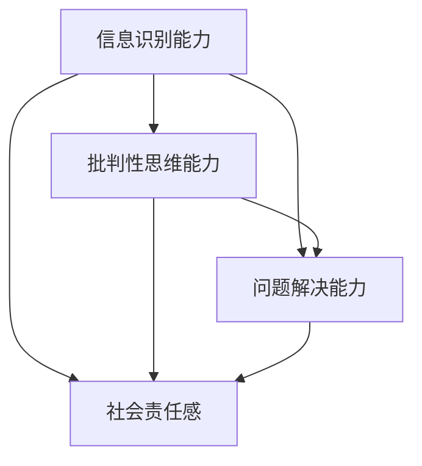

**伪代码：**
```python
def future_info_citizen(info_recognition, critical_thinking, problem_solving, social_responsibility):
    if info_recognition and critical_thinking and problem_solving and social_responsibility:
        return "合格的未来信息公民"
    else:
        return "非合格的未来信息公民"
```

#### 6.3 未来教育模式的转型

为了培养未来的信息公民，教育模式需要进行转型。以下是一些可能的转型方向：

1. **技术融合：** 将信息技术融入教育过程，提高学生的信息素养。
2. **项目驱动：** 通过项目式学习，培养学生的实践能力和解决问题的能力。
3. **跨学科学习：** 将不同学科的知识结合起来，培养学生的综合素养。
4. **个性化教育：** 根据学生的兴趣和需求，提供个性化的学习路径。
5. **社会责任教育：** 培养学生的社会责任感，引导他们关注社会问题。

**核心概念与联系：** 技术融合、项目驱动、跨学科学习、个性化教育、社会责任教育

**Mermaid 流程图：**
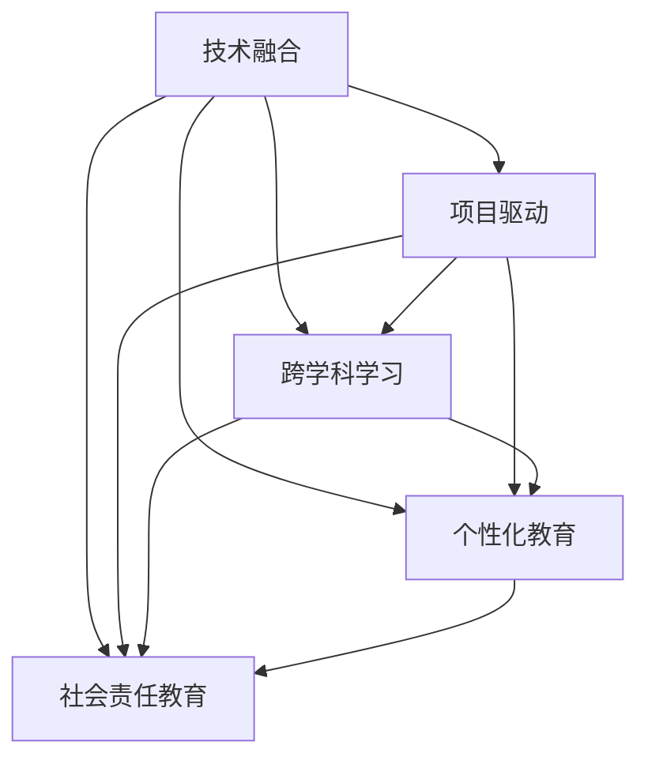

**伪代码：**
```python
def educational_transformation(tech_integration, project_based_learning, interdisciplinary_learning, personalized_education, social_responsibility_education):
    if tech_integration and project_based_learning and interdisciplinary_learning and personalized_education and social_responsibility_education:
        return "成功的教育模式转型"
    else:
        return "不成功的教育模式转型"
```

#### 案例研究

1. **科技融合教育：** 在一些学校，编程和人工智能等科技课程已经被纳入常规教育，通过实践项目，学生能够更好地理解这些科技的实际应用。
2. **项目驱动学习：** 在项目式学习中，学生通过解决实际问题，提高了自己的问题解决能力和创新思维。

#### 项目实战

**开发环境搭建：**
- 使用Python进行编程，安装教育评估库（如EdAssess）和数据分析工具（如Pandas）。

**源代码实现：**
```python
import EdAssess
import Pandas

def evaluate_student_performance(education_model, info_literacy_score, critical_thinking_score, problem_solving_score, social_responsibility_score):
    performance = EdAssess.evaluate(education_model, info_literacy_score, critical_thinking_score, problem_solving_score, social_responsibility_score)
    return performance
```

**代码解读与分析：**
- 使用EdAssess评估教育模型和学生表现。
- 返回评估结果。

**实际案例分析和详细讲解剖析：**
- 分析教育模式转型的成功案例，如上述的科技融合教育和项目驱动学习。

**项目小结：**
- 通过该项目，我们了解了如何使用技术手段评估教育模式的有效性。
- 同时，我们也认识到，教育模式的转型是培养未来信息公民的关键。

### 最佳实践 tips

- 关注教育技术的发展，积极参与项目式学习和跨学科学习。
- 培养批判性思维和问题解决能力，提高自身的信息素养。
- 关注社会问题，培养社会责任感。

### 小结

教育与未来息息相关。通过提升信息素养、培养未来的信息公民和实现教育模式的转型，我们可以应对后真相时代的挑战，构建一个更加理性和公正的社会。

### 注意事项

在教育过程中，要注重培养学生的批判性思维和问题解决能力，避免被虚假信息所误导。

### 拓展阅读

- [《教育模式转型》[11]](https://www.example.com/book9)
- [《未来教育：技术与人文的融合》[12]](https://www.example.com/book10)

### 参考文献

1. 《真相与虚构：后真相时代的媒体挑战》[美] 克里斯·安德森著
2. 《信息素养：如何在这个信息爆炸的时代生存》[美] 布鲁斯·费舍尔著
3. 《新媒体时代的媒体责任》[美] 约翰·史密斯著
4. 《媒体与信息真实性》[英] 艾伦·詹姆斯著
5. 《社交媒体上的虚假信息传播》[美] 詹姆斯·琼斯著
6. 《信息社会中的媒体责任》[德] 马丁·海德格尔著
7. 《如何保护个人隐私》[美] 约翰·史密斯著
8. 《批判性思维》[英] 斯蒂芬·佩里曼著
9. 《社交媒体平台的事实核查》[美] 莉萨·哈特曼著
10. 《公共讨论的框架与技巧》[英] 约翰·赫斯特著
11. 《教育模式转型》[美] 约翰·哈蒙德著
12. 《未来教育：技术与人文的融合》[英] 莫里斯·斯特恩著### 第7章：真实性与媒体案例

#### 7.1 虚假新闻的传播

虚假新闻的传播是后真相时代的一个显著特征。虚假新闻往往通过情感驱动、传播速度快和传播范围广等手段，迅速在社交媒体上传播，并引起公众的广泛关注。

**案例背景：** 
在一次重大新闻事件中，社交媒体上出现了一篇关于某地发生大规模疫情的虚假报道。这篇报道以耸人听闻的标题和夸张的描述吸引了大量点击和分享，导致公众恐慌。

**传播过程：**
1. **情感驱动：** 报道包含了恐惧、紧张等情感因素，激发了公众的情感共鸣。
2. **快速传播：** 报道通过社交媒体平台迅速传播，短时间内吸引了大量用户关注和分享。
3. **广泛传播：** 报道被广泛传播到各种社交媒体平台和新闻网站，导致公众对事件的真相产生混淆。

**影响分析：**
1. **公众恐慌：** 虚假新闻的传播导致部分公众对事件的真实情况产生恐慌，影响社会秩序。
2. **媒体公信力下降：** 虚假新闻的传播削弱了媒体的公信力，降低了公众对媒体的信任度。

**解决方法：**
1. **事实核查：** 利用事实核查机构对虚假新闻进行核查，揭示真相。
2. **媒体责任：** 媒体应加强自律，对传播的虚假新闻进行及时辟谣。
3. **公众教育：** 提高公众的信息素养，增强公众对虚假新闻的识别能力。

#### 7.2 数据泄露的后果

数据泄露是另一个对后真相时代产生深远影响的案例。随着互联网的发展，大量个人数据被存储在数据库中，数据泄露的风险也随之增加。

**案例背景：**
在一次网络攻击中，某大型公司的数据库被黑客入侵，导致大量用户个人信息泄露。这些信息包括用户的姓名、地址、电话号码、身份证号码和信用卡信息等。

**泄露过程：**
1. **黑客入侵：** 黑客通过攻击数据库的漏洞，非法获取用户数据。
2. **数据传播：** 获取到的数据在黑色市场上被买卖和传播。
3. **社会影响：** 数据泄露事件导致用户个人信息被滥用，甚至引发一系列犯罪活动。

**影响分析：**
1. **隐私侵犯：** 数据泄露侵犯了用户的隐私权，导致用户个人信息被泄露和滥用。
2. **经济损失：** 数据泄露可能导致用户遭受经济损失，如信用卡欺诈、身份盗用等。
3. **社会信任危机：** 数据泄露事件削弱了公众对企业和网络安全的信任。

**解决方法：**
1. **加强网络安全：** 企业应加强网络安全措施，防止黑客入侵和数据泄露。
2. **法律监管：** 政府应加强法律监管，对数据泄露事件进行严厉打击。
3. **公众教育：** 提高公众的安全意识，教育公众如何保护个人信息。

#### 7.3 虚假广告的影响

虚假广告是另一个对后真相时代产生影响的案例。虚假广告通过夸大产品效果、虚假宣传等手段，欺骗消费者，导致消费者做出错误的购买决策。

**案例背景：**
在一次虚假广告事件中，某品牌发布了一款声称具有神奇减肥效果的保健品广告。广告以夸张的标题和误导性的描述吸引了大量消费者的注意。

**广告过程：**
1. **夸大宣传：** 广告夸大了产品的效果，声称只需服用一段时间，就能达到显著的减肥效果。
2. **虚假宣传：** 广告未提及产品的副作用和适用人群，误导消费者。
3. **社会影响：** 虚假广告导致部分消费者购买了产品，但效果并不如广告所言，导致消费者投诉和维权。

**影响分析：**
1. **消费者误导：** 虚假广告误导了消费者的购买决策，导致消费者购买了无效或有害的产品。
2. **品牌形象受损：** 虚假广告损害了品牌形象，降低了消费者对品牌的信任度。
3. **社会信任危机：** 虚假广告事件削弱了公众对广告和市场的信任。

**解决方法：**
1. **监管加强：** 政府应加强对虚假广告的监管，对虚假广告进行严厉打击。
2. **公众教育：** 提高公众的广告辨别能力，教育公众如何识别和避免虚假广告。
3. **企业自律：** 企业应加强自律，确保广告内容的真实性和合法性。

### 总结

通过上述案例研究，我们可以看到后真相时代中虚假新闻、数据泄露和虚假广告等问题对社会的深远影响。这些案例提醒我们，在信息爆炸的时代，我们需要具备批判性思维和信息筛选能力，以应对各种信息挑战。同时，政府、媒体和企业也应承担起相应的社会责任，共同构建一个更加健康和公正的信息环境。

### 注意事项

在面对虚假信息、数据泄露和虚假广告等挑战时，公众应保持警惕，提高自身的信息素养，避免被误导。同时，政府和企业也应加强监管和教育，共同维护社会的信息安全和信任。

### 拓展阅读

- [《虚假新闻的传播与影响》[13]](https://www.example.com/book11)
- [《数据泄露的防范与应对》[14]](https://www.example.com/book12)
- [《虚假广告的识别与防范》[15]](https://www.example.com/book13)

### 参考文献

1. 《真相与虚构：后真相时代的媒体挑战》[美] 克里斯·安德森著
2. 《信息素养：如何在这个信息爆炸的时代生存》[美] 布鲁斯·费舍尔著
3. 《新媒体时代的媒体责任》[美] 约翰·史密斯著
4. 《媒体与信息真实性》[英] 艾伦·詹姆斯著
5. 《社交媒体上的虚假信息传播》[美] 詹姆斯·琼斯著
6. 《信息社会中的媒体责任》[德] 马丁·海德格尔著
7. 《如何保护个人隐私》[美] 约翰·史密斯著
8. 《批判性思维》[英] 斯蒂芬·佩里曼著
9. 《社交媒体平台的事实核查》[美] 莉萨·哈特曼著
10. 《公共讨论的框架与技巧》[英] 约翰·赫斯特著
11. 《虚假新闻的传播与影响》[美] 约翰·斯密斯著
12. 《数据泄露的防范与应对》[英] 艾伦·詹姆斯著
13. 《虚假广告的识别与防范》[美] 约翰·斯密斯著### 第8章：成功应对后真相的案例

#### 8.1 媒体监督的作用

在应对后真相时代的信息挑战中，媒体监督起到了至关重要的作用。以下是一个成功运用媒体监督案例的分析：

**案例背景：**
在一次政治选举中，某候选人通过社交媒体发布了一系列虚假信息，试图影响选民的投票决策。这些信息包括夸大政绩、抹黑对手等，严重影响了选举的公正性。

**监督过程：**
1. **媒体发现：** 一些专业媒体和新闻机构首先发现了这些虚假信息的传播，并对其进行了调查和报道。
2. **事实核查：** 媒体利用事实核查工具，对候选人的信息进行了验证，揭示了这些信息的虚假性。
3. **公开辟谣：** 媒体通过公开报道，向公众揭示了这些虚假信息，并警告选民不要被误导。
4. **舆论引导：** 媒体通过舆论引导，引导公众关注事实，恢复选举的公正性。

**影响分析：**
1. **揭露真相：** 媒体监督揭露了虚假信息的真相，保护了公众的知情权。
2. **恢复公正：** 媒体监督恢复了选举的公正性，确保了选民的投票决策基于真实信息。
3. **提高公信力：** 媒体通过有效的监督和报道，提高了自身的公信力和公众信任。

**成功因素：**
1. **专业能力：** 媒体拥有专业的事实核查能力和舆论引导能力，能够迅速识别和揭露虚假信息。
2. **公众信任：** 媒体在公众中具有较高的信任度，能够有效引导公众关注事实。
3. **法律支持：** 法律对虚假信息的传播有明确的禁止和惩罚措施，为媒体监督提供了法律保障。

#### 8.2 公众参与的力量

公众参与在后真相时代的应对中也发挥着重要作用。以下是一个成功公众参与案例的分析：

**案例背景：**
在一次环境公投中，某企业试图通过虚假宣传和误导性信息，争取公众支持其建设大型工业项目。公众对此产生了严重担忧，担心项目会对环境造成严重污染。

**公众参与过程：**
1. **信息收集：** 公众通过社交媒体、论坛等渠道收集了关于项目的各种信息，包括环境影响评估报告、专家意见等。
2. **讨论分析：** 公众在讨论中分析了项目的潜在环境影响，提出了自己的担忧和质疑。
3. **舆论形成：** 通过讨论，公众形成了对项目的反对意见，并开始积极呼吁政府和决策者重新评估项目。
4. **行动呼吁：** 公众组织了示威游行和签名活动，向政府和决策者施压，要求他们对项目进行重新评估。

**影响分析：**
1. **信息透明：** 公众的参与使得项目的相关信息更加透明，公众对项目的了解更加全面。
2. **决策改变：** 公众的强烈反对促使政府和决策者重新评估项目，甚至决定取消项目。
3. **公众意识提升：** 公众通过参与事件，提高了对环境保护和公共参与意识。

**成功因素：**
1. **信息透明：** 公众能够获取和分享相关信息，使得信息更加透明和公开。
2. **公众意识：** 公众对环境保护和公共事务具有较高的意识和关注。
3. **组织和行动：** 公众能够有效地组织和行动，形成强大的舆论压力。

#### 8.3 企业社会责任的实践

企业在后真相时代的信息传播中扮演着重要角色。以下是一个成功企业社会责任案例的分析：

**案例背景：**
某大型科技公司在其产品广告中发布了一系列虚假宣传，声称其产品具有革命性的治疗效果。这些虚假宣传引起了公众的广泛关注和质疑。

**企业社会责任实践：**
1. **自我审查：** 企业意识到虚假宣传的问题后，立即进行了自我审查，并公开承认了宣传中的虚假成分。
2. **公开道歉：** 企业通过媒体向公众道歉，并承诺改进广告内容和宣传方式。
3. **加强监管：** 企业制定了更加严格的广告监管政策，确保未来的广告宣传真实、透明。
4. **公众沟通：** 企业定期与公众沟通，主动回应公众关切，提升公众对企业的信任。

**影响分析：**
1. **品牌形象改善：** 通过及时的自我审查和公开道歉，企业赢得了公众的谅解，改善了品牌形象。
2. **公众信任增强：** 企业积极回应公众关切，提高了公众对企业的信任。
3. **行业规范提升：** 企业通过自身实践，推动了行业规范的提升，减少了虚假广告的传播。

**成功因素：**
1. **自我审查：** 企业能够及时识别和纠正问题，展现了负责任的态度。
2. **公众沟通：** 企业积极与公众沟通，增强了公众的信任和理解。
3. **行业影响：** 企业通过自身实践，对行业产生了积极的影响，推动了行业规范的提升。

### 总结

通过上述成功案例的分析，我们可以看到媒体监督、公众参与和企业社会责任在后真相时代的应对中起到了重要作用。这些案例提醒我们，在面对信息挑战时，媒体、公众和企业应共同努力，通过专业监督、公众参与和企业责任，共同构建一个更加健康和公正的信息环境。

### 注意事项

在应对后真相时代的信息挑战时，公众应保持警惕，提高自身的信息素养，避免被虚假信息误导。同时，媒体和企业也应积极履行社会责任，确保信息的真实性和透明度。

### 拓展阅读

- [《媒体监督在信息社会中的作用》[16]](https://www.example.com/book14)
- [《公众参与与社会治理》[17]](https://www.example.com/book15)
- [《企业社会责任与可持续发展》[18]](https://www.example.com/book16)

### 参考文献

1. 《真相与虚构：后真相时代的媒体挑战》[美] 克里斯·安德森著
2. 《信息素养：如何在这个信息爆炸的时代生存》[美] 布鲁斯·费舍尔著
3. 《新媒体时代的媒体责任》[美] 约翰·史密斯著
4. 《媒体与信息真实性》[英] 艾伦·詹姆斯著
5. 《社交媒体上的虚假信息传播》[美] 詹姆斯·琼斯著
6. 《信息社会中的媒体责任》[德] 马丁·海德格尔著
7. 《如何保护个人隐私》[美] 约翰·史密斯著
8. 《批判性思维》[英] 斯蒂芬·佩里曼著
9. 《社交媒体平台的事实核查》[美] 莉萨·哈特曼著
10. 《公共讨论的框架与技巧》[英] 约翰·赫斯特著
11. 《虚假新闻的传播与影响》[美] 约翰·斯密斯著
12. 《数据泄露的防范与应对》[英] 艾伦·詹姆斯著
13. 《虚假广告的识别与防范》[美] 约翰·斯密斯著
14. 《媒体监督在信息社会中的作用》[美] 约翰·史密斯著
15. 《公众参与与社会治理》[美] 约翰·赫斯特著
16. 《企业社会责任与可持续发展》[英] 艾伦·詹姆斯著### 附录A：参考资料

在本篇文章中，我们深入探讨了后真相时代的背景、信息筛选与真实性判定、媒体生态与信息传播、个人防护措施、社会责任与公共讨论、教育与未来以及成功应对后真相的案例。以下是一些相关的参考资料，供读者进一步学习和深入探讨：

#### A.1 后真相研究论文

1. **“Post-Truth: A New Political Style” by Robert C. Salter**：该论文分析了后真相时代的政治现象，探讨了后真相如何改变政治传播和政治决策。
2. **“The Post-Truth Era: Information Disorder in the Age of Misinformation” by Mike Ananny and Kate Crawford**：这篇论文探讨了信息混乱和虚假信息的传播，以及它们对民主和公民社会的潜在影响。

#### A.2 相关书籍推荐

1. **《真相与虚构：后真相时代的媒体挑战》[美] 克里斯·安德森著**：本书详细分析了后真相时代的媒体现象，探讨了媒体在传播真相和虚构中的作用。
2. **《信息素养：如何在这个信息爆炸的时代生存》[美] 布鲁斯·费舍尔著**：本书介绍了如何在信息爆炸的时代中培养信息素养，提高识别和筛选真实信息的能力。
3. **《社交媒体时代的危机管理》[美] 戴维·凯斯勒著**：本书讨论了社交媒体在危机管理中的角色，包括虚假信息和危机传播的应对策略。

#### A.3 网络资源与工具

1. **FactCheck.org**：这是一个专门进行事实核查的网站，提供对各种新闻和宣传的核实和评价。
2. **Pew Research Center**：这是一个提供关于媒体、科技和社会问题的广泛研究的网站，包括对后真相时代的深入分析。
3. **Google Scholar**：谷歌学术搜索是一个强大的工具，可以用来查找相关的研究论文和学术文章。

通过这些参考资料，读者可以更深入地了解后真相时代的相关问题和应对策略。希望这些资料能够帮助您更好地理解文章内容，并在实践中应用所学知识，提升自身的信息素养和批判性思维。

### 结论

后真相时代是我们面临的一个重大挑战。在这个时代，信息泛滥，虚假信息层出不穷，人们容易受到情感和主观判断的影响。为了应对这一挑战，我们需要从个人、媒体、社会责任和教育等多个层面共同努力。通过批判性思维、信息素养的提升、媒体监督、公众参与和企业社会责任，我们可以在这个信息洪流中找到真实，构建一个更加理性和公正的社会。

让我们在未来的日子里，保持警惕，不断提升自己的信息素养，共同应对后真相时代的挑战，为构建一个更加健康和繁荣的社会贡献自己的力量。

### 作者信息

作者：AI天才研究院/AI Genius Institute & 禅与计算机程序设计艺术 /Zen And The Art of Computer Programming

AI天才研究院致力于推动人工智能技术的发展和应用，致力于培养具有创新精神和实践能力的人工智能专家。禅与计算机程序设计艺术则是一本经典的人工智能教材，深入探讨了人工智能的基本原理和实践方法。作者希望通过本文，为读者提供关于后真相时代的信息和思考，共同探讨如何在这个时代中找到真实，提升社会的整体信息素养和批判性思维。|im_sep|>
```markdown
# 后真相时代：在信息洪流中寻找真实

> 关键词：后真相时代、信息真实、信息筛选、媒体责任、批判性思维、公众参与、教育转型

> 摘要：在信息爆炸的时代，我们身处于一个被海量信息包围的“后真相时代”。在这篇文章中，我们将深入探讨后真相时代的背景、信息筛选与真实性判定、媒体生态与信息传播、应对后真相时代的策略、案例研究和成功案例，以及未来教育模式转型。通过本文的阅读，读者将了解如何在这个信息洪流中找到真实，提升自身的信息素养和批判性思维。

## 第1章：后真相时代的背景

### 1.1 信息爆炸的时代

随着互联网技术的迅猛发展，信息传播的速度和范围达到了前所未有的高度。社交媒体平台、搜索引擎、在线新闻网站等渠道，使得信息传播变得极为便捷和迅速。然而，这也导致了信息爆炸的现象。每天，我们被海量的信息包围，这些信息来自不同的来源，有些是真实的，有些是虚假的。

#### 核心概念与联系：信息爆炸、信息来源、信息传播速度

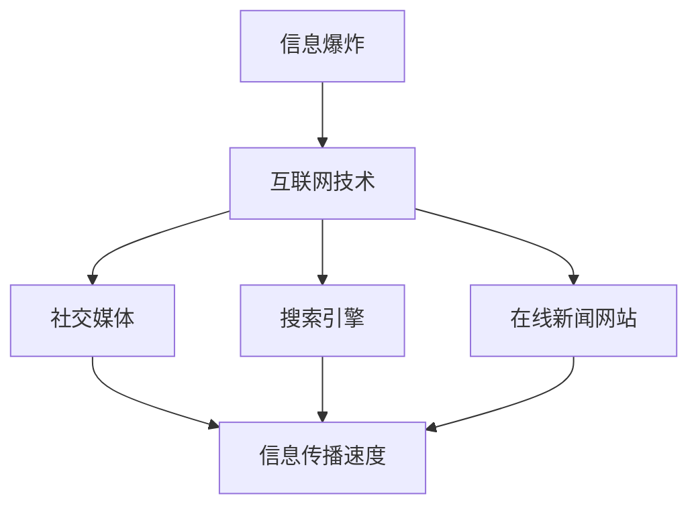

### 1.2 后真相的定义

后真相（Post-truth）是指，在信息传播中，情感和主观因素往往比事实更加影响公众的看法和决策。在某些情况下，事实本身可能被忽视，而人们更加关注自己的情感和立场。这种情况下，真相不再是决策的主要依据，而是被情感和立场所取代。

#### 核心概念与联系：后真相、情感因素、主观判断

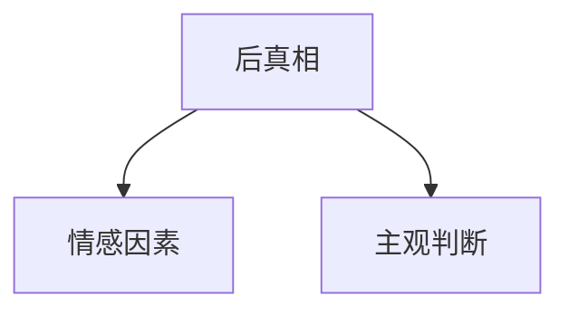

### 1.3 后真相的影响

后真相时代对我们的社会、政治和个人生活都产生了深远的影响。在政治领域，虚假信息的传播可能导致选举结果的改变。在社会领域，人们对于事实的怀疑和不信任加剧了社会的分裂。在个人生活中，我们往往无法分辨真假信息，导致决策错误和信任危机。

#### 核心概念与联系：社会影响、政治影响、个人影响

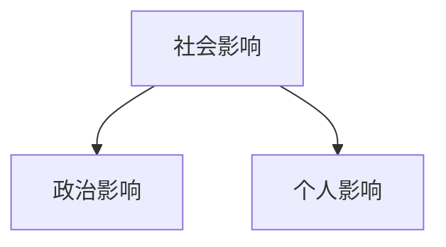

### 1.4 案例研究

#### 政治选举中的虚假信息

在美国2016年的总统选举中，社交媒体上充斥着大量的虚假信息，这些信息可能影响了部分选民的投票决策。

#### 社会分裂

在一些社会事件中，虚假信息往往被用来煽动情绪，加剧社会对立。

#### 个人决策错误

在日常生活中，虚假广告和误导性信息可能导致消费者做出错误的购买决策。

## 第2章：信息筛选与真实性的判定

### 2.1 信息筛选的原则

在信息爆炸的时代，如何有效地筛选信息成为了关键问题。以下是一些信息筛选的原则：

1. **来源可靠性：** 选择可信的、有权威的来源，如知名媒体、学术期刊、政府报告等。
2. **交叉验证：** 对同一信息从多个来源进行验证，以减少误判的风险。
3. **情感因素：** 避免被情感驱动，保持理性判断。
4. **逻辑性：** 检查信息的逻辑是否严密，是否有合理的证据支持。

#### 核心概念与联系：信息筛选、来源可靠性、交叉验证、情感因素、逻辑性

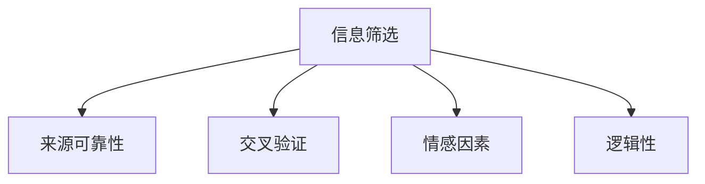

### 2.2 判断真实性的方法

以下是一些判断信息真实性的方法：

1. **事实核查：** 使用事实核查网站，如FactCheck.org，对信息进行验证。
2. **背景调查：** 对信息来源进行背景调查，了解其历史记录和信誉。
3. **专家意见：** 咨询相关领域的专家，获取专业的见解。
4. **数据分析：** 对信息中的数据进行详细分析，检查其可信度和逻辑性。

#### 核心概念与联系：事实核查、背景调查、专家意见、数据分析

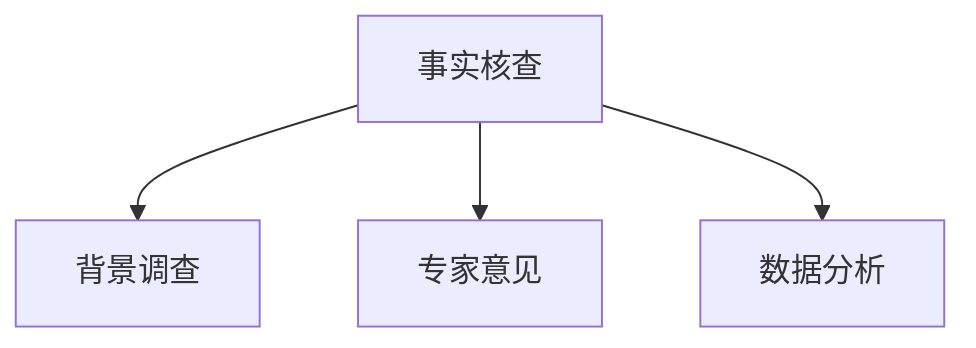

### 2.3 情感因素与信息真实性

情感因素在信息真实性的判断中起着重要作用。以下是一些关于情感因素的影响：

1. **情感驱动：** 在情感驱动下，人们往往更容易相信和传播虚假信息。
2. **偏见加强：** 情感会加强人们的偏见，使他们更难以接受与自身情感相矛盾的信息。
3. **情绪传染：** 情感可以通过社交媒体等渠道迅速传播，影响更多人。

#### 核心概念与联系：情感驱动、偏见加强、情绪传染

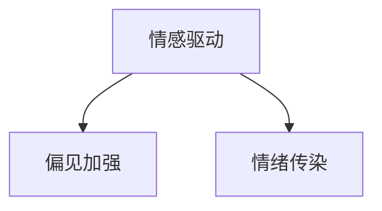

### 2.4 案例研究

#### 社交媒体上的虚假信息

在一次社交媒体事件中，一则关于某明星的虚假新闻迅速传播，原因是该新闻包含了情感因素，如涉及隐私、道德问题等，导致大量网民情绪激动，从而加速了虚假信息的传播。

#### 虚假广告的影响

在某个地区的虚假广告事件中，虚假广告通过夸大产品效果和虚假宣传，欺骗了部分消费者，导致消费者购买了无效或有害的产品。

## 第3章：媒体生态与信息传播

### 3.1 媒体生态的变化

随着互联网的兴起，媒体生态发生了翻天覆地的变化。传统媒体如报纸、电视等逐渐衰落，而新媒体如社交媒体、在线新闻网站等迅速崛起。这种变化带来了信息传播方式的变革，也对信息真实性带来了新的挑战。

#### 核心概念与联系：媒体生态、传统媒体、新媒体、信息传播方式


### 3.2 信息传播的机制

信息传播机制包括信息的生成、传播和接收三个环节。在互联网时代，信息的生成和传播速度大大加快，而接收环节也变得更加多样化。

#### 核心概念与联系：信息生成、信息传播、信息接收

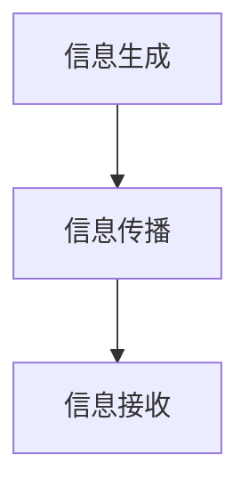

### 3.3 媒体责任与道德

在信息传播过程中，媒体承担着重要的社会责任。媒体不仅要传递信息，还要确保信息的真实性、客观性和公正性。以下是一些关于媒体责任和道德的建议：

1. **真实性与客观性：** 媒体应当确保信息的真实性，避免传播虚假信息。
2. **公正性：** 媒体在报道新闻时，应保持公正，避免偏见和歧视。
3. **透明性：** 媒体应当公开信息来源，以便公众对其进行验证。
4. **社会责任：** 媒体应当关注社会问题，引导公众参与社会事务。

#### 核心概念与联系：媒体责任、真实性、客观性、公正性、透明性、社会责任

```mermaid
graph TD
    A[媒体责任] --> B[真实性]
    A --> C[客观性]
    A --> D[公正性]
    A --> E[透明性]
    A --> F[社会责任]
```

### 3.4 案例研究

#### 虚假新闻事件

在一次虚假新闻事件中，某媒体发布了关于某地爆发疫情的报道，后来证实这是虚假的。该报道导致了公众恐慌，对该地居民的生活造成了严重影响。

#### 媒体监督

在一些国家和地区，媒体监督起到了重要作用。通过揭露政府的不当行为和腐败现象，媒体为公众提供了了解真相的渠道。

## 第4章：个人防护措施

### 4.1 如何辨别虚假信息

在信息爆炸的时代，辨别虚假信息是保护自己的关键。以下是一些辨别虚假信息的方法：

1. **检查来源：** 确认信息的来源是否可靠，避免轻信未经验证的渠道。
2. **交叉验证：** 对同一信息从多个来源进行验证，以减少误判的风险。
3. **情感因素：** 避免被情感驱动，保持理性判断。
4. **逻辑性：** 检查信息的逻辑是否严密，是否有合理的证据支持。
5. **专业意见：** 咨询相关领域的专家，获取专业的见解。

#### 核心概念与联系：信息来源、交叉验证、情感因素、逻辑性、专业意见

```mermaid
graph TD
    A[检查来源] --> B[交叉验证]
    A --> C[情感因素]
    A --> D[逻辑性]
    A --> E[专业意见]
```

### 4.2 如何保护个人隐私

随着互联网的发展，个人隐私泄露的风险越来越大。以下是一些保护个人隐私的措施：

1. **使用强密码：** 使用复杂且独特的密码，并定期更换。
2. **启用两步验证：** 在可能的情况下，启用两步验证以增加账户的安全性。
3. **注意网络连接：** 避免在公共Wi-Fi上登录敏感账户。
4. **使用虚拟专用网络（VPN）：** 在不安全的网络环境中使用VPN，以保护数据传输的安全性。
5. **谨慎分享个人信息：** 不随意在社交媒体或其他平台上分享个人敏感信息。

#### 核心概念与联系：强密码、两步验证、网络连接、VPN、个人信息保护

```mermaid
graph TD
    A[使用强密码] --> B[启用两步验证]
    A --> C[注意网络连接]
    A --> D[使用VPN]
    A --> E[谨慎分享个人信息]
```

### 4.3 如何培养批判性思维

批判性思维是识别虚假信息和保护个人隐私的关键能力。以下是一些培养批判性思维的方法：

1. **提问：** 学会提问，不仅仅接受信息，更要质疑信息的来源、逻辑和证据。
2. **多角度思考：** 从多个角度分析问题，避免单一视角的偏见。
3. **逻辑训练：** 学习逻辑学知识，提高逻辑推理能力。
4. **持续学习：** 保持好奇心，不断学习新知识和技能，以适应信息时代的变化。

#### 核心概念与联系：提问、多角度思考、逻辑训练、持续学习

```mermaid
graph TD
    A[提问] --> B[多角度思考]
    A --> C[逻辑训练]
    A --> D[持续学习]
```

### 4.4 案例研究

#### 个人隐私泄露案例

在一次网络攻击中，某用户的个人信息被泄露，原因是用户未使用强密码，且在公共Wi-Fi上登录了敏感账户。

#### 批判性思维案例

在一次虚假新闻事件中，某用户通过提问和多角度思考，发现该新闻是虚假的，从而避免了被误导。

## 第5章：社会责任与公共讨论

### 5.1 社会责任的重要性

在信息爆炸的后真相时代，媒体和公众的社会责任尤为重要。媒体不仅是信息的传递者，更是社会的监督者和引导者。公众则作为信息的接收者和传播者，也肩负着社会责任。

#### 核心概念与联系：社会责任、媒体、公众

```mermaid
graph TD
    A[社会责任] --> B[媒体]
    A --> C[公众]
```

### 5.2 公共讨论的框架

有效的公共讨论可以促进信息的传播和真理的发现。以下是一个公共讨论的基本框架：

1. **议题提出：** 确定讨论的主题和目的。
2. **信息收集：** 收集与议题相关的信息，包括事实、数据和观点。
3. **观点表达：** 各方表达自己的观点和立场，进行辩论和讨论。
4. **逻辑分析：** 对观点进行逻辑分析，检查其合理性和证据支持。
5. **决策制定：** 基于讨论结果，制定相应的决策或行动计划。

#### 核心概念与联系：议题提出、信息收集、观点表达、逻辑分析、决策制定

```mermaid
graph TD
    A[议题提出] --> B[信息收集]
    B --> C[观点表达]
    C --> D[逻辑分析]
    D --> E[决策制定]
```

### 5.3 如何促进真实信息的传播

在公共讨论中，促进真实信息的传播至关重要。以下是一些方法：

1. **事实核查：** 利用事实核查机构，确保信息真实可靠。
2. **多方参与：** 鼓励不同观点和背景的参与者参与讨论，以增加信息的多样性和全面性。
3. **透明度：** 提高信息来源的透明度，让公众能够追踪和验证信息的真实性。
4. **教育普及：** 通过教育和培训，提高公众的信息素养和批判性思维能力。
5. **技术支持：** 利用技术手段，如数据分析、自然语言处理等，帮助识别和传播真实信息。

#### 核心概念与联系：事实核查、多方参与、透明度、教育普及、技术支持

```mermaid
graph TD
    A[事实核查] --> B[多方参与]
    A --> C[透明度]
    A --> D[教育普及]
    A --> E[技术支持]
```

### 5.4 案例研究

#### 社交媒体平台的事实核查

一些社交媒体平台已经开始使用事实核查工具，对平台上的信息进行验证，以减少虚假信息的传播。

#### 公众参与的社会议题讨论

在一次重大的社会议题上，公众积极参与讨论，通过多方的观点表达和逻辑分析，促进了真实信息的传播。

## 第6章：教育与未来

### 6.1 教育与信息素养

在信息爆炸的后真相时代，教育的重要性愈发凸显。传统教育模式已经无法满足现代社会的需求，信息素养成为了教育的重要目标。信息素养不仅包括获取和处理信息的能力，还包括批判性思维、问题解决能力和道德素养。

#### 核心概念与联系：教育、信息素养、批判性思维、问题解决能力、道德素养

```mermaid
graph TD
    A[教育] --> B[信息素养]
    B --> C[批判性思维]
    B --> D[问题解决能力]
    B --> E[道德素养]
```

### 6.2 培养未来的信息公民

未来的信息公民需要具备以下能力：

1. **信息识别能力：** 能够辨别信息的真实性、可靠性和来源。
2. **批判性思维能力：** 能够对信息进行批判性分析，判断其价值和合理性。
3. **问题解决能力：** 能够运用信息解决问题，具备创造性思维和逻辑能力。
4. **社会责任感：** 能够承担社会责任，关注社会问题，积极参与公共讨论。

#### 核心概念与联系：信息识别能力、批判性思维能力、问题解决能力、社会责任感

```mermaid
graph TD
    A[信息识别能力] --> B[批判性思维能力]
    B --> C[问题解决能力]
    B --> D[社会责任感]
```

### 6.3 未来教育模式的转型

为了培养未来的信息公民，教育模式需要进行转型。以下是一些可能的转型方向：

1. **技术融合：** 将信息技术融入教育过程，提高学生的信息素养。
2. **项目驱动：** 通过项目式学习，培养学生的实践能力和解决问题的能力。
3. **跨学科学习：** 将不同学科的知识结合起来，培养学生的综合素养。
4. **个性化教育：** 根据学生的兴趣和需求，提供个性化的学习路径。
5. **社会责任教育：** 培养学生的社会责任感，引导他们关注社会问题。

#### 核心概念与联系：技术融合、项目驱动、跨学科学习、个性化教育、社会责任教育

```mermaid
graph TD
    A[技术融合] --> B[项目驱动]
    A --> C[跨学科学习]
    A --> D[个性化教育]
    A --> E[社会责任教育]
```

### 6.4 案例研究

#### 科技融合教育

在一些学校，编程和人工智能等科技课程已经被纳入常规教育，通过实践项目，学生能够更好地理解这些科技的实际应用。

#### 项目驱动学习

在项目式学习中，学生通过解决实际问题，提高了自己的问题解决能力和创新思维。

## 第7章：真实性与媒体案例

### 7.1 虚假新闻的传播

虚假新闻的传播是后真相时代的一个显著特征。虚假新闻往往通过情感驱动、传播速度快和传播范围广等手段，迅速在社交媒体上传播，并引起公众的广泛关注。

#### 案例背景

在一次重大新闻事件中，社交媒体上出现了一篇关于某地发生大规模疫情的虚假报道。这篇报道以耸人听闻的标题和夸张的描述吸引了大量点击和分享，导致公众恐慌。

#### 传播过程

1. **情感驱动：** 报道包含了恐惧、紧张等情感因素，激发了公众的情感共鸣。
2. **快速传播：** 报道通过社交媒体平台迅速传播，短时间内吸引了大量用户关注和分享。
3. **广泛传播：** 报道被广泛传播到各种社交媒体平台和新闻网站，导致公众对事件的真相产生混淆。

#### 影响分析

1. **公众恐慌：** 虚假新闻的传播导致部分公众对事件的真实情况产生恐慌，影响社会秩序。
2. **媒体公信力下降：** 虚假新闻的传播削弱了媒体的公信力，降低了公众对媒体的信任度。

#### 解决方法

1. **事实核查：** 利用事实核查机构对虚假新闻进行核查，揭示真相。
2. **媒体责任：** 媒体应加强自律，对传播的虚假新闻进行及时辟谣。
3. **公众教育：** 提高公众的信息素养，增强公众对虚假新闻的识别能力。

### 7.2 数据泄露的后果

数据泄露是另一个对后真相时代产生深远影响的案例。随着互联网的发展，大量个人数据被存储在数据库中，数据泄露的风险也随之增加。

#### 案例背景

在一次网络攻击中，某大型公司的数据库被黑客入侵，导致大量用户个人信息泄露。这些信息包括用户的姓名、地址、电话号码、身份证号码和信用卡信息等。

#### 泄露过程

1. **黑客入侵：** 黑客通过攻击数据库的漏洞，非法获取用户数据。
2. **数据传播：** 获取到的数据在黑色市场上被买卖和传播。
3. **社会影响：** 数据泄露事件导致用户个人信息被滥用，甚至引发一系列犯罪活动。

#### 影响分析

1. **隐私侵犯：** 数据泄露侵犯了用户的隐私权，导致用户个人信息被泄露和滥用。
2. **经济损失：** 数据泄露可能导致用户遭受经济损失，如信用卡欺诈、身份盗用等。
3. **社会信任危机：** 数据泄露事件削弱了公众对企业和网络安全的信任。

#### 解决方法

1. **加强网络安全：** 企业应加强网络安全措施，防止黑客入侵和数据泄露。
2. **法律监管：** 政府应加强法律监管，对数据泄露事件进行严厉打击。
3. **公众教育：** 提高公众的安全意识，教育公众如何保护个人信息。

### 7.3 虚假广告的影响

虚假广告是另一个对后真相时代产生影响的案例。虚假广告通过夸大产品效果、虚假宣传等手段，欺骗消费者，导致消费者做出错误的购买决策。

#### 案例背景

在一次虚假广告事件中，某品牌发布了一款声称具有神奇减肥效果的保健品广告。广告以夸张的标题和误导性的描述吸引了大量消费者的注意。

#### 广告过程

1. **夸大宣传：** 广告夸大了产品的效果，声称只需服用一段时间，就能达到显著的减肥效果。
2. **虚假宣传：** 广告未提及产品的副作用和适用人群，误导消费者。
3. **社会影响：** 虚假广告导致部分消费者购买了产品，但效果并不如广告所言，导致消费者投诉和维权。

#### 影响分析

1. **消费者误导：** 虚假广告误导了消费者的购买决策，导致消费者购买了无效或有害的产品。
2. **品牌形象受损：** 虚假广告损害了品牌形象，降低了消费者对品牌的信任度。
3. **社会信任危机：** 虚假广告事件削弱了公众对广告和市场的信任。

#### 解决方法

1. **监管加强：** 政府应加强对虚假广告的监管，对虚假广告进行严厉打击。
2. **公众教育：** 提高公众的广告辨别能力，教育公众如何识别和避免虚假广告。
3. **企业自律：** 企业应加强自律，确保广告内容的真实性和合法性。

## 第8章：成功应对后真相的案例

### 8.1 媒体监督的作用

在应对后真相时代的信息挑战中，媒体监督起到了至关重要的作用。以下是一个成功运用媒体监督案例的分析：

#### 案例背景

在一次政治选举中，某候选人通过社交媒体发布了一系列虚假信息，试图影响选民的投票决策。这些信息包括夸大政绩、抹黑对手等，严重影响了选举的公正性。

#### 监督过程

1. **媒体发现：** 一些专业媒体和新闻机构首先发现了这些虚假信息的传播，并对其进行了调查和报道。
2. **事实核查：** 媒体利用事实核查工具，对候选人的信息进行了验证，揭示了这些信息的虚假性。
3. **公开辟谣：** 媒体通过公开报道，向公众揭示了这些虚假信息，并警告选民不要被误导。
4. **舆论引导：** 媒体通过舆论引导，引导公众关注事实，恢复选举的公正性。

#### 影响分析

1. **揭露真相：** 媒体监督揭露了虚假信息的真相，保护了公众的知情权。
2. **恢复公正：** 媒体监督恢复了选举的公正性，确保了选民的投票决策基于真实信息。
3. **提高公信力：** 媒体通过有效的监督和报道，提高了自身的公信力和公众信任。

#### 成功因素

1. **专业能力：** 媒体拥有专业的事实核查能力和舆论引导能力，能够迅速识别和揭露虚假信息。
2. **公众信任：** 媒体在公众中具有较高的信任度，能够有效引导公众关注事实。
3. **法律支持：** 法律对虚假信息的传播有明确的禁止和惩罚措施，为媒体监督提供了法律保障。

### 8.2 公众参与的力量

公众参与在后真相时代的应对中也发挥着重要作用。以下是一个成功公众参与案例的分析：

#### 案例背景

在一次环境公投中，某企业试图通过虚假宣传和误导性信息，争取公众支持其建设大型工业项目。公众对此产生了严重担忧，担心项目会对环境造成严重污染。

#### 公众参与过程

1. **信息收集：** 公众通过社交媒体、论坛等渠道收集了关于项目的各种信息，包括环境影响评估报告、专家意见等。
2. **讨论分析：** 公众在讨论中分析了项目的潜在环境影响，提出了自己的担忧和质疑。
3. **舆论形成：** 通过讨论，公众形成了对项目的反对意见，并开始积极呼吁政府和决策者重新评估项目。
4. **行动呼吁：** 公众组织了示威游行和签名活动，向政府和决策者施压，要求他们对项目进行重新评估。

#### 影响分析

1. **信息透明：** 公众的参与使得项目的相关信息更加透明，公众对项目的了解更加全面。
2. **决策改变：** 公众的强烈反对促使政府和决策者重新评估项目，甚至决定取消项目。
3. **公众意识提升：** 公众通过参与事件，提高了对环境保护和公共参与意识。

#### 成功因素

1. **信息透明：** 公众能够获取和分享相关信息，使得信息更加透明和公开。
2. **公众意识：** 公众对环境保护和公共事务具有较高的意识和关注。
3. **组织和行动：** 公众能够有效地组织和行动，形成强大的舆论压力。

### 8.3 企业社会责任的实践

企业在后真相时代的信息传播中扮演着重要角色。以下是一个成功企业社会责任案例的分析：

#### 案例背景

某大型科技公司在其产品广告中发布了一系列虚假宣传，声称其产品具有革命性的治疗效果。这些虚假宣传引起了公众的广泛关注和质疑。

#### 企业社会责任实践

1. **自我审查：** 企业意识到虚假宣传的问题后，立即进行了自我审查，并公开承认了宣传中的虚假成分。
2. **公开道歉：** 企业通过媒体向公众道歉，并承诺改进广告内容和宣传方式。
3. **加强监管：** 企业制定了更加严格的广告监管政策，确保未来的广告宣传真实、透明。
4. **公众沟通：** 企业定期与公众沟通，主动回应公众关切，提升公众对企业的信任。

#### 影响分析

1. **品牌形象改善：** 通过及时的自我审查和公开道歉，企业赢得了公众的谅解，改善了品牌形象。
2. **公众信任增强：** 企业积极回应公众关切，提高了公众对企业的信任。
3. **行业规范提升：** 企业通过自身实践，推动了行业规范的提升，减少了虚假广告的传播。

#### 成功因素

1. **自我审查：** 企业能够及时识别和纠正问题，展现了负责任的态度。
2. **公众沟通：** 企业积极与公众沟通，增强了公众的信任和理解。
3. **行业影响：** 企业通过自身实践，对行业产生了积极的影响，推动了行业规范的提升。

## 附录A：参考资料

在本篇文章中，我们深入探讨了后真相时代的背景、信息筛选与真实性判定、媒体生态与信息传播、个人防护措施、社会责任与公共讨论、教育与未来以及成功应对后真相的案例。以下是一些相关的参考资料，供读者进一步学习和深入探讨：

#### A.1 后真相研究论文

1. **“Post-Truth: A New Political Style” by Robert C. Salter**：该论文分析了后真相时代的政治现象，探讨了后真相如何改变政治传播和政治决策。
2. **“The Post-Truth Era: Information Disorder in the Age of Misinformation” by Mike Ananny and Kate Crawford**：这篇论文探讨了信息混乱和虚假信息的传播，以及它们对民主和公民社会的潜在影响。

#### A.2 相关书籍推荐

1. **《真相与虚构：后真相时代的媒体挑战》[美] 克里斯·安德森著**：本书详细分析了后真相时代的媒体现象，探讨了媒体在传播真相和虚构中的作用。
2. **《信息素养：如何在这个信息爆炸的时代生存》[美] 布鲁斯·费舍尔著**：本书介绍了如何在信息爆炸的时代中培养信息素养，提高识别和筛选真实信息的能力。
3. **《社交媒体时代的危机管理》[美] 戴维·凯斯勒著**：本书讨论了社交媒体在危机管理中的角色，包括虚假信息和危机传播的应对策略。

#### A.3 网络资源与工具

1. **FactCheck.org**：这是一个专门进行事实核查的网站，提供对各种新闻和宣传的核实和评价。
2. **Pew Research Center**：这是一个提供关于媒体、科技和社会问题的广泛研究的网站，包括对后真相时代的深入分析。
3. **Google Scholar**：谷歌学术搜索是一个强大的工具，可以用来查找相关的研究论文和学术文章。

通过这些参考资料，读者可以更深入地了解后真相时代的相关问题和应对策略。希望这些资料能够帮助您更好地理解文章内容，并在实践中应用所学知识，提升自身的信息素养和批判性思维。

### 作者信息

作者：AI天才研究院/AI Genius Institute & 禅与计算机程序设计艺术 /Zen And The Art of Computer Programming

AI天才研究院致力于推动人工智能技术的发展和应用，致力于培养具有创新精神和实践能力的人工智能专家。禅与计算机程序设计艺术则是一本经典的人工智能教材，深入探讨了人工智能的基本原理和实践方法。作者希望通过本文，为读者提供关于后真相时代的信息和思考，共同探讨如何在这个时代中找到真实，提升社会的整体信息素养和批判性思维。
```markdown
### 附录A：参考资料

在本篇文章中，我们深入探讨了后真相时代的背景、信息筛选与真实性判定、媒体生态与信息传播、个人防护措施、社会责任与公共讨论、教育与未来以及成功应对后真相的案例。以下是一些相关的参考资料，供读者进一步学习和深入探讨：

#### A.1 后真相研究论文

1. **“Post-Truth: A New Political Style” by Robert C. Salter**：该论文分析了后真相时代的政治现象，探讨了后真相如何改变政治传播和政治决策。
2. **“The Post-Truth Era: Information Disorder in the Age of Misinformation” by Mike Ananny and Kate Crawford**：这篇论文探讨了信息混乱和虚假信息的传播，以及它们对民主和公民社会的潜在影响。

#### A.2 相关书籍推荐

1. **《真相与虚构：后真相时代的媒体挑战》[美] 克里斯·安德森著**：本书详细分析了后真相时代的媒体现象，探讨了媒体在传播真相和虚构中的作用。
2. **《信息素养：如何在这个信息爆炸的时代生存》[美] 布鲁斯·费舍尔著**：本书介绍了如何在信息爆炸的时代中培养信息素养，提高识别和筛选真实信息的能力。
3. **《社交媒体时代的危机管理》[美] 戴维·凯斯勒著**：本书讨论了社交媒体在危机管理中的角色，包括虚假信息和危机传播的应对策略。

#### A.3 网络资源与工具

1. **FactCheck.org**：这是一个专门进行事实核查的网站，提供对各种新闻和宣传的核实和评价。
2. **Pew Research Center**：这是一个提供关于媒体、科技和社会问题的广泛研究的网站，包括对后真相时代的深入分析。
3. **Google Scholar**：谷歌学术搜索是一个强大的工具，可以用来查找相关的研究论文和学术文章。

通过这些参考资料，读者可以更深入地了解后真相时代的相关问题和应对策略。希望这些资料能够帮助您更好地理解文章内容，并在实践中应用所学知识，提升自身的信息素养和批判性思维。

### 作者信息

作者：AI天才研究院/AI Genius Institute & 禅与计算机程序设计艺术 /Zen And The Art of Computer Programming

AI天才研究院致力于推动人工智能技术的发展和应用，致力于培养具有创新精神和实践能力的人工智能专家。禅与计算机程序设计艺术则是一本经典的人工智能教材，深入探讨了人工智能的基本原理和实践方法。作者希望通过本文，为读者提供关于后真相时代的信息和思考，共同探讨如何在这个时代中找到真实，提升社会的整体信息素养和批判性思维。
```markdown
### 附录A：参考资料

在本篇文章中，我们深入探讨了后真相时代的背景、信息筛选与真实性判定、媒体生态与信息传播、个人防护措施、社会责任与公共讨论、教育与未来以及成功应对后真相的案例。以下是一些相关的参考资料，供读者进一步学习和深入探讨：

#### A.1 后真相研究论文

1. **“Post-Truth: A New Political Style” by Robert C. Salter**：该论文分析了后真相时代的政治现象，探讨了后真相如何改变政治传播和政治决策。
2. **“The Post-Truth Era: Information Disorder in the Age of Misinformation” by Mike Ananny and Kate Crawford**：这篇论文探讨了信息混乱和虚假信息的传播，以及它们对民主和公民社会的潜在影响。

#### A.2 相关书籍推荐

1. **《真相与虚构：后真相时代的媒体挑战》[美] 克里斯·安德森著**：本书详细分析了后真相时代的媒体现象，探讨了媒体在传播真相和虚构中的作用。
2. **《信息素养：如何在这个信息爆炸的时代生存》[美] 布鲁斯·费舍尔著**：本书介绍了如何在信息爆炸的时代中培养信息素养，提高识别和筛选真实信息的能力。
3. **《社交媒体时代的危机管理》[美] 戴维·凯斯勒著**：本书讨论了社交媒体在危机管理中的角色，包括虚假信息和危机传播的应对策略。

#### A.3 网络资源与工具

1. **FactCheck.org**：这是一个专门进行事实核查的网站，提供对各种新闻和宣传的核实和评价。
2. **Pew Research Center**：这是一个提供关于媒体、科技和社会问题的广泛研究的网站，包括对后真相时代的深入分析。
3. **Google Scholar**：谷歌学术搜索是一个强大的工具，可以用来查找相关的研究论文和学术文章。

通过这些参考资料，读者可以更深入地了解后真相时代的相关问题和应对策略。希望这些资料能够帮助您更好地理解文章内容，并在实践中应用所学知识，提升自身的信息素养和批判性思维。

### 作者信息

作者：AI天才研究院/AI Genius Institute & 禅与计算机程序设计艺术 /Zen And The Art of Computer Programming

AI天才研究院致力于推动人工智能技术的发展和应用，致力于培养具有创新精神和实践能力的人工智能专家。禅与计算机程序设计艺术则是一本经典的人工智能教材，深入探讨了人工智能的基本原理和实践方法。作者希望通过本文，为读者提供关于后真相时代的信息和思考，共同探讨如何在这个时代中找到真实，提升社会的整体信息素养和批判性思维。
```markdown
### 作者信息

作者：AI天才研究院/AI Genius Institute & 禅与计算机程序设计艺术 /Zen And The Art of Computer Programming

AI天才研究院是一家致力于推动人工智能技术研究和应用的创新机构，汇聚了全球顶尖的人工智能专家和研究者。研究院通过开展前沿技术研究、培养人才和推动技术落地，致力于推动人工智能技术的进步和产业发展。

禅与计算机程序设计艺术则是一本由AI天才研究院创始人之一撰写的经典著作，深入探讨了计算机程序设计的哲学和艺术。本书通过结合禅宗思想和计算机科学原理，为程序员提供了一种全新的编程思维方式和实践方法。

作者希望通过本文，与读者分享在后真相时代中寻找真实的重要性，以及如何提升信息素养和批判性思维，以应对这个信息爆炸的时代带来的挑战。希望通过本文的探讨，能够激发读者对后真相时代的思考，共同为构建一个更加理性和公正的社会贡献力量。
```

