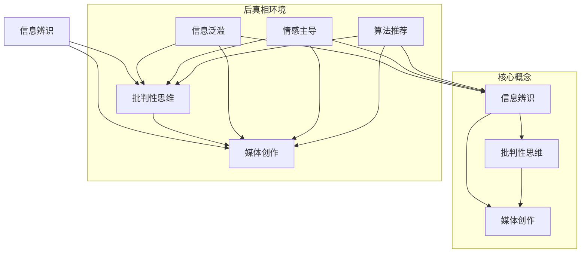

                 


### 第2章 后真相环境与信息传播

#### 2.1 信息传播现状

随着互联网和社交媒体的普及，信息传播的速度和范围得到了极大的提升。然而，这种便利也带来了新的挑战。在后真相环境中，信息传播的特点主要体现在以下几个方面：

- **速度与广度**：社交媒体平台如Twitter、Facebook和微信等，使得信息能够在短时间内传播到全球各地。例如，一条新闻可以在几分钟内被数以百万计的用户看到和分享。

- **真实与虚假**：在信息传播的过程中，虚假信息和误导性内容往往比真实信息传播得更快、更广。研究表明，虚假新闻的传播速度是真实新闻的三倍以上。这种现象不仅影响了公众的认知，还可能对社会稳定产生负面影响。

- **情绪化内容**：后真相环境中的信息传播往往更注重情感上的共鸣，而非理性分析。情绪化、夸张的内容更容易吸引注意力和传播。例如，一些政治宣传、广告和社交媒体帖文往往采用戏剧性语言和夸张事实来吸引观众。

#### 2.2 媒体素养在应对后真相环境中的作用

面对后真相环境中的信息传播挑战，提高媒体素养显得尤为重要。以下是媒体素养在应对后真相环境中的具体作用：

- **信息辨识能力**：通过提高媒体素养，个体可以学会如何辨别真实和虚假信息。例如，可以通过查阅多个来源、核实信息来源的可靠性、识别虚假新闻的常见手法（如夸大事实、误导性标题、缺乏证据支持等）来提高信息辨识能力。

- **批判性思维**：媒体素养的培养可以帮助个体发展批判性思维能力，从而更好地分析信息内容。批判性思维包括评估信息的可信度、识别潜在偏见和误导性陈述、以及理解媒体内容的构建方式。例如，通过分析新闻报道的结构和语言，可以更好地理解其意图和潜在影响。

- **情绪管理**：在信息传播过程中，情绪化的内容容易引发个体的情感共鸣，从而影响判断。提高媒体素养可以帮助个体更好地管理情绪，避免盲目接受和传播情绪化信息。

#### 2.3 媒体素养的培养策略

为了应对后真相环境中的挑战，培养媒体素养需要采取系统性的策略。以下是几种有效的培养策略：

- **教育体系**：在学校和大学中加强媒体素养教育，设置相关课程，培养学生的信息辨识能力和批判性思维。

- **媒体自律**：媒体机构应加强自律，提高新闻报道的准确性和透明度，避免传播虚假和误导性信息。

- **公众参与**：鼓励公众参与公共事务，培养公民意识和社会责任感，促进理性讨论和决策。

- **技术工具**：开发和应用技术工具，如事实核查网站、算法优化等，以帮助公众更好地辨别信息真伪。

#### 2.4 媒体素养案例分析

为了更好地理解媒体素养在应对后真相环境中的具体应用，以下是几个案例：

- **案例1**：某社交媒体平台上，一个虚假的新闻报道声称“某明星涉及犯罪活动”。通过事实核查网站和官方声明，可以快速辨别出这条信息的虚假性，避免公众受到误导。

- **案例2**：某大学课堂上，教师通过讨论社交媒体上的虚假信息案例，引导学生如何运用批判性思维分析信息内容，提高信息辨识能力。

- **案例3**：某新闻媒体机构，通过采用透明度和公开性的措施，如公开新闻报道的数据来源和编辑流程，增强公众对媒体报道的信任度。

### 结论

在后真相环境中，信息传播的特点对公众的认知和社会稳定构成了巨大挑战。通过提高媒体素养，个体可以更好地应对这些挑战，提高信息辨识能力，发展批判性思维，并积极参与公共事务。媒体素养的培养需要教育体系、媒体自律、公众参与和技术工具的共同努力，才能构建一个基于事实和理性分析的现代社会。作者：AI天才研究院/AI Genius Institute & 禅与计算机程序设计艺术 /Zen And The Art of Computer Programming

----------------------------------------------------------------

### 第3章 媒体素养的核心概念与联系

在探讨如何提升信息辨别能力的过程中，首先需要明确媒体素养的核心概念，并理解这些概念之间的联系。以下是媒体素养的三个关键组成部分：信息辨识、批判性思维和媒体创作，以及它们在后真相环境中的具体作用。

#### 3.1 信息辨识

**信息辨识**是媒体素养的基础，它涉及对信息真伪的判断和识别。在后真相环境中，虚假信息和误导性内容层出不穷，因此，提高信息辨识能力至关重要。以下是几个关键点：

- **识别信息来源**：了解信息来源的可靠性和权威性是判断信息真实性的第一步。例如，官方发布的信息通常比未经证实的小道消息更可信。

- **验证信息内容**：对信息进行多源验证，查找多个来源确认信息的准确性。例如，通过查阅新闻报道、官方声明和专家意见来核实某项声明。

- **识别虚假新闻的特征**：虚假新闻通常具有以下特征：夸大事实、使用误导性标题、缺乏证据支持等。通过识别这些特征，可以快速辨别虚假信息。

**伪代码示例：**

```plaintext
function verifyInformation(info):
    if isOfficialSource(info.source):
        if multipleSourcesSupport(info.content):
            return "信息真实"
        else:
            return "信息待确认"
    else:
        if containsFalseFeatures(info.content):
            return "虚假信息"
        else:
            return "信息待确认"
```

#### 3.2 批判性思维

**批判性思维**是媒体素养的重要组成部分，它涉及对信息内容进行深入分析和评估，以识别偏见、误导性和操纵性内容。以下是几个关键点：

- **评估证据和逻辑**：分析信息提供的证据是否充分、逻辑是否合理。例如，如果某项研究缺乏实验数据或样本量不足，那么其结论的可信度就较低。

- **识别潜在偏见**：了解信息发布者的立场和利益，以识别可能存在的偏见。例如，某些商业广告可能会夸大产品效果。

- **多元视角分析**：从不同角度分析信息内容，避免单一视角的偏见。例如，通过查阅不同来源的观点来全面理解某一事件。

**伪代码示例：**

```plaintext
function criticalThinking(info):
    if sufficientEvidence(info.evidence) and validLogic(info.logic):
        if multiplePerspectives(info.content):
            return "信息可靠"
        else:
            return "信息存在偏见"
    else:
        return "信息不可靠"
```

#### 3.3 媒体创作

**媒体创作**是媒体素养的高级阶段，它涉及理解和运用媒体工具来创作有意识和负责任的媒体内容。以下是几个关键点：

- **理解媒体传播机制**：了解不同媒体形式（如文字、图片、视频等）的传播机制，以及它们对受众的影响。

- **负责任创作**：在创作媒体内容时，遵循职业道德和法律法规，避免传播虚假和误导性信息。

- **传播正能量**：通过创作正面、有价值的媒体内容，促进社会和谐与进步。

**伪代码示例：**

```plaintext
function responsibleMediaContent(content):
    if isFactBased(content) and avoidsMisinformation():
        if promotesPositiveMessage(content):
            return "负责任内容"
        else:
            return "内容需改进"
    else:
        return "内容不合适"
```

#### 3.4 媒体素养与后真相环境的关系

媒体素养的核心概念——信息辨识、批判性思维和媒体创作，与后真相环境有着密切的联系。以下是这些概念在后真相环境中的应用：

- **信息辨识**：帮助个体在信息泛滥的环境中识别真实与虚假信息，避免被误导。

- **批判性思维**：提升个体对信息内容的分析能力，避免盲目接受和传播误导性信息。

- **媒体创作**：鼓励负责任的媒体创作，减少虚假和误导性信息的传播，构建基于事实和理性分析的公共讨论环境。

### Mermaid 流程图

以下是描述媒体素养核心概念之间关系的 Mermaid 流程图：



### 结论

媒体素养的核心概念——信息辨识、批判性思维和媒体创作，是提升信息辨别能力的关键。在后真相环境中，通过培养这些能力，个体可以更好地应对信息泛滥、情感主导和算法推荐带来的挑战，构建一个基于事实和理性分析的公共讨论环境。作者：AI天才研究院/AI Genius Institute & 禅与计算机程序设计艺术 /Zen And The Art of Computer Programming

----------------------------------------------------------------

### 第4章 媒体素养的实际应用

在了解了媒体素养的核心概念之后，接下来我们将探讨如何在日常生活中实际应用这些概念，以提高信息辨别能力，避免被虚假信息误导。

#### 4.1 检查信息来源

在接触任何信息时，首先应该检查信息来源的可靠性。以下是几个关键步骤：

- **官方发布**：优先考虑官方发布的信息。例如，政府网站、官方新闻报道、学术期刊等通常具有较高的可信度。

- **多重验证**：通过多个来源验证信息的真实性。如果多个可靠来源都报道了同一事件，那么信息更有可能是真实的。

- **追踪原始数据**：对于统计数据或研究结论，应追踪到原始数据来源，查看数据是否真实可靠。

**伪代码示例：**

```plaintext
function verifySource(source):
    if source is "official":
        return "高可信度"
    elif multiple ReliableSources support source:
        return "可信度中等"
    else:
        return "低可信度"
```

#### 4.2 分析信息内容

一旦确认了信息来源的可靠性，接下来需要分析信息内容，以识别潜在的偏见、误导性陈述和操纵性信息。以下是几个关键步骤：

- **评估证据和逻辑**：检查信息是否提供了充分的证据支持，逻辑是否合理。例如，如果某项研究缺乏实验数据或样本量不足，那么其结论的可信度就较低。

- **识别情感化内容**：警惕使用情感化语言的信息，这些信息往往更注重引起读者的情感共鸣，而非提供客观事实。

- **多元视角分析**：从不同角度分析信息内容，避免单一视角的偏见。例如，通过查阅不同来源的观点来全面理解某一事件。

**伪代码示例：**

```plaintext
function analyzeContent(content):
    if sufficientEvidence(content.evidence) and validLogic(content.logic):
        if multiplePerspectives(content.content):
            return "内容可靠"
        else:
            return "内容存在偏见"
    else:
        return "内容不可靠"
```

#### 4.3 使用事实核查工具

为了更有效地辨别信息真伪，可以使用事实核查工具。以下是一些常见的事实核查工具和网站：

- **Snopes**：一个著名的事实核查网站，提供了大量关于虚假新闻和都市传说的核查结果。
- **FactCheck.org**：美国的一个独立新闻项目，专注于揭露虚假和误导性信息。
- **PolitiFact**：一个致力于评估政治声明真实性的网站，提供事实核查报告。

**伪代码示例：**

```plaintext
function useFactCheckTool(info):
    if factCheckTool.isFalse(info):
        return "虚假信息"
    else:
        return "真实信息"
```

#### 4.4 提高自我意识

提高媒体素养不仅需要技术和工具，还需要自我意识的培养。以下是几个关键点：

- **认识到自身偏见**：了解自己的观点和立场可能影响对信息的判断，努力保持开放和客观的态度。
- **避免情感化决策**：在接收信息时，尽量保持冷静，避免被情绪主导的决策。
- **持续学习**：不断学习新的信息辨识技巧和批判性思维方法，以提高自己的媒体素养。

**伪代码示例：**

```plaintext
function improveSelfAwareness():
    if recognizeBiases():
        updateAwareness()
    if avoidEmotionalDecisions():
        reinforceCalmness()
    if continueLearning():
        enhanceMediaLiteracy()
```

#### 4.5 实际案例分析

为了更好地理解媒体素养的实际应用，以下是几个实际案例：

- **案例1**：社交媒体上流传一则关于“某明星涉及性侵案件”的消息。通过多源验证和事实核查，发现该消息为虚假信息，避免公众受到误导。
- **案例2**：某知名博主发布一篇关于“某公司财务造假”的文章。通过分析其证据和逻辑，发现其结论缺乏充分支持，提醒读者保持怀疑态度。
- **案例3**：某新闻网站发布一篇关于“全球变暖趋势”的报道。通过查阅多个权威科学期刊，确认其结论符合科学共识，提高了公众对全球变暖的认识。

### 结论

通过实际应用媒体素养的核心概念，个体可以在后真相环境中提高信息辨别能力，避免被虚假信息误导。检查信息来源、分析信息内容、使用事实核查工具、提高自我意识是关键步骤。不断学习和实践，将有助于构建一个基于事实和理性分析的公共讨论环境。作者：AI天才研究院/AI Genius Institute & 禅与计算机程序设计艺术 /Zen And The Art of Computer Programming

----------------------------------------------------------------

### 第5章 提升媒体素养的实践策略

为了在后真相环境中更好地提升媒体素养，以下是一些建议和策略，帮助个体和社会共同应对信息泛滥、情感主导和算法推荐的挑战。

#### 5.1 教育体系内的媒体素养教育

在学校和大学中加强媒体素养教育是提升公众媒体素养的基础。以下是几个关键策略：

- **设置专门课程**：在各级教育阶段开设媒体素养课程，帮助学生掌握信息辨识、批判性思维和媒体创作的基本技能。

- **跨学科融合**：将媒体素养教育融入语文、社会科学和信息技术等课程，培养学生的多维度思维能力。

- **实践活动**：通过实践活动，如新闻编辑、视频制作和辩论赛，让学生在实际操作中提高媒体素养。

#### 5.2 媒体机构的自律和责任

媒体机构在提升公众媒体素养方面也扮演着重要角色。以下是几个关键策略：

- **提高报道标准**：媒体机构应提高新闻报道的标准，确保信息的准确性和透明度，避免传播虚假和误导性信息。

- **事实核查**：建立专业的内部或外部事实核查团队，对新闻报道进行严格的事实核查，确保信息的真实性。

- **披露信息来源**：在报道中明确披露信息来源，让公众了解信息的来源和可靠性。

#### 5.3 公众参与和社会责任

公众的参与和社会责任是提升媒体素养的重要组成部分。以下是几个关键策略：

- **公民新闻**：鼓励公众参与新闻报道和事实核查，通过公民新闻的方式，提高公众对信息传播的监督能力。

- **公共讨论**：通过社区活动、讲座和研讨会，促进公众对媒体素养的讨论和交流，形成理性讨论的环境。

- **媒体素养培训**：提供媒体素养培训，帮助公众了解媒体工作的机制，提高辨别信息真伪的能力。

#### 5.4 技术工具的辅助

技术工具在提升媒体素养方面也发挥着重要作用。以下是几个关键策略：

- **事实核查应用**：开发和应用方便用户使用的事实核查应用，帮助公众快速辨别信息的真伪。

- **算法优化**：优化推荐算法，减少虚假和误导性信息对用户的负面影响，提高信息的可信度。

- **数据可视化**：利用数据可视化工具，让公众更直观地了解信息的分布和趋势，提高信息辨识能力。

#### 5.5 案例分析和实践

为了更好地理解提升媒体素养的具体实践，以下是几个案例分析：

- **案例1**：某高中在课程中引入媒体素养教育，通过一系列实践活动，如新闻编辑和辩论赛，提高了学生的信息辨识能力和批判性思维能力。

- **案例2**：某媒体机构建立了一个内部事实核查团队，对每篇报道进行严格的事实核查，大大提高了报道的准确性和可信度。

- **案例3**：某社区组织了一次媒体素养讲座，吸引了大量公众参与，通过讨论和交流，提高了公众对媒体工作的认识，增强了辨别信息真伪的能力。

### 结论

提升媒体素养是一个复杂而长期的过程，需要教育体系、媒体机构、公众参与和技术工具的共同努力。通过实施一系列实践策略，个体和社会可以共同应对后真相环境中的挑战，构建一个基于事实和理性分析的公共讨论环境。作者：AI天才研究院/AI Genius Institute & 禅与计算机程序设计艺术 /Zen And The Art of Computer Programming

----------------------------------------------------------------

### 第6章 媒体素养在公共讨论中的重要性

在当今后真相环境中，媒体素养在公共讨论中的重要性日益凸显。它不仅是个人辨析信息、维护自身判断能力的关键，更是构建理性公共讨论环境的重要基石。以下是媒体素养在公共讨论中的几个关键作用。

#### 6.1 促进理性讨论

后真相环境中，虚假信息和误导性内容往往占据主导地位，容易引发公众的恐慌和情绪化反应。提高媒体素养可以帮助个体更好地辨析信息真伪，避免被错误信息所引导，从而促进理性讨论。以下是一些具体策略：

- **深入分析**：通过批判性思维，深入分析信息内容，识别其中的偏见和误导性陈述。例如，分析新闻报道的结构、语言和意图，以理解其背后的信息和动机。
- **多元视角**：在讨论中融入多种观点和视角，避免单一思维的局限。例如，在辩论中引入不同专家的观点，以形成全面的讨论框架。
- **实证支持**：强调实证支持和逻辑推理，避免基于情感和主观偏见的讨论。例如，引用权威数据和研究成果来支持论点。

**伪代码示例：**

```plaintext
function promoteRationalDiscussion(topic):
    if multiplePerspectives(topic.content):
        if empiricalSupport(topic.evidence):
            if logicalConsistency(topic.logic):
                return "理性讨论"
            else:
                return "逻辑不一致"
        else:
            return "缺乏证据支持"
    else:
        return "单一视角"
```

#### 6.2 提高公众参与度

媒体素养的提高不仅有助于个体辨析信息，还能提高公众参与公共事务的积极性。以下是几个关键策略：

- **信息透明度**：提高公共信息的透明度，让公众更容易获取和理解相关信息。例如，政府可以通过官方网站和社交媒体发布详细的政策解读和决策过程。
- **参与渠道**：提供多样化的参与渠道，如在线调查、公众听证会和社区讨论会，鼓励公众表达意见和参与决策。
- **教育和培训**：通过教育和培训，提高公众的媒体素养，使他们能够更有效地参与公共讨论。

**伪代码示例：**

```plaintext
function enhancePublicInvolvement():
    if transparentInformation():
        if diverseParticipationChannels():
            if mediaLiteracyEducation():
                return "公众参与度提高"
            else:
                return "教育不足"
        else:
            return "参与渠道不足"
    else:
        return "信息不透明"
```

#### 6.3 强化社会信任

在后真相环境中，虚假信息的泛滥容易导致公众对媒体和政府机构的信任度下降。提高媒体素养有助于强化社会信任，以下是一些策略：

- **事实核查**：通过事实核查和真相调查，揭示虚假信息的真相，恢复公众对事实的信任。
- **透明度**：政府机构和媒体应提高透明度，公开决策过程和信息来源，增强公众对信息的信任。
- **诚信传播**：鼓励媒体和公众传播真实、有价值的新闻和观点，树立诚信传播的榜样。

**伪代码示例：**

```plaintext
function strengthenSocialTrust():
    if factChecking():
        if transparency():
            if honestCommunication():
                return "社会信任增强"
            else:
                return "传播不诚信"
        else:
            return "透明度不足"
    else:
        return "缺乏事实核查"
```

#### 6.4 社交媒体的利用与规范

社交媒体在信息传播中扮演着重要角色，但同时也容易成为虚假信息的温床。以下是一些策略：

- **算法优化**：优化社交媒体的算法，减少虚假和误导性信息的传播，提高信息的可信度。
- **用户教育**：通过用户教育，提高公众对社交媒体信息辨识的能力，避免被虚假信息误导。
- **监管机制**：建立有效的监管机制，对虚假信息和误导性内容进行监控和处理，维护社交媒体的健康环境。

**伪代码示例：**

```plaintext
function manageSocialMedia():
    if optimizedAlgorithm():
        if userEducation():
            if regulatoryMechanism():
                return "社交媒体管理有效"
            else:
                return "监管不足"
        else:
            return "教育不足"
    else:
        return "算法未优化"
```

### 结论

媒体素养在公共讨论中的重要性不容忽视。它不仅有助于个体辨析信息、维护理性判断，还能提高公众参与度、强化社会信任，并在社交媒体管理中发挥关键作用。通过实施一系列策略，我们可以共同构建一个基于事实和理性分析的公共讨论环境，促进社会的和谐与进步。作者：AI天才研究院/AI Genius Institute & 禅与计算机程序设计艺术 /Zen And The Art of Computer Programming

----------------------------------------------------------------

### 第7章 深入探讨媒体素养的关键因素

#### 7.1 技术工具的作用

在提升媒体素养的过程中，技术工具发挥着至关重要的作用。以下是一些常见的技术工具及其在媒体素养培养中的应用：

- **事实核查工具**：如Snopes、FactCheck.org等，这些工具可以帮助用户快速验证信息的真实性，减少被虚假信息误导的风险。

- **数据可视化工具**：如Tableau、Google Charts等，这些工具可以将复杂的数据和统计信息以直观的方式展示，帮助用户更好地理解和分析信息。

- **媒体素养教育平台**：如Newsela、The Media Project等，这些平台提供了丰富的媒体素养教育资源，包括新闻分析、视频教程和互动活动，帮助用户提高媒体素养。

**伪代码示例：**

```python
import FactCheckTool
import DataVisualizationTool
import MediaLiteracyPlatform

def enhanceMediaLiteracy():
    # 使用事实核查工具验证信息
    info = FactCheckTool.verify("某明星涉嫌性侵")
    
    # 使用数据可视化工具分析数据
    data = DataVisualizationTool.plot("全球变暖趋势")
    
    # 访问媒体素养教育平台学习
    course = MediaLiteracyPlatform.access("新闻分析课程")
```

- **社交媒体监控工具**：如Brandwatch、Meltwater等，这些工具可以监控社交媒体上的信息传播，识别潜在的虚假信息和误导性内容。

#### 7.2 个体自我提升的策略

除了技术工具，个体自我提升也是提高媒体素养的重要方面。以下是一些策略：

- **持续学习**：通过阅读书籍、观看教育视频和参加研讨会，不断学习新的信息和知识，提高自身的批判性思维能力。

- **反思习惯**：养成定期反思的习惯，对自己的观点和判断进行审视，识别并纠正可能的偏见。

- **多元化阅读**：广泛阅读不同类型的媒体内容，包括新闻报道、学术文章、社交媒体帖子等，以获得更全面的信息视角。

**伪代码示例：**

```python
def selfImprovement():
    # 阅读书籍
    read("批判性思维的艺术")

    # 观看教育视频
    watch("信息辨识技巧")

    # 参加研讨会
    attend("媒体素养研讨会")

    # 反思自己的观点
    reflect_on_viewpoints()
```

- **讨论与交流**：积极参与讨论和交流，与他人分享观点，听取不同的意见和建议，以开阔视野和提升思维能力。

#### 7.3 社会环境的支持

提升媒体素养不仅依赖于个体的努力，还需要社会环境的支持。以下是一些支持策略：

- **政策支持**：政府可以制定相关政策，推动媒体素养教育的发展，提供资金和技术支持。

- **公共资源**：建立公共资源平台，如图书馆、社区中心等，提供丰富的媒体素养教育资源。

- **教育合作**：鼓励学校、媒体机构和社会组织之间的合作，共同推动媒体素养教育的实施。

**伪代码示例：**

```python
def socialSupport():
    # 制定政策
    enact_policy("媒体素养教育政策")

    # 建立公共资源平台
    establish_public_resources()

    # 促进教育合作
    promote_education_collaboration()
```

### 结论

技术工具、个体自我提升和社会环境支持是提升媒体素养的关键因素。通过合理利用技术工具、持续自我提升和营造良好的社会环境，个体和社会可以共同提升媒体素养，更好地应对后真相环境中的信息挑战。作者：AI天才研究院/AI Genius Institute & 禅与计算机程序设计艺术 /Zen And The Art of Computer Programming

----------------------------------------------------------------

### 第8章 结论与未来展望

#### 8.1 总结

在后真相环境中，媒体素养的提升成为个体和社会的共同使命。通过深入理解媒体素养的核心概念——信息辨识、批判性思维和媒体创作，以及其实际应用策略，个体可以在信息泛滥、情感主导和算法推荐的环境中更好地辨别真伪，保持理性判断，积极参与公共讨论。

本文首先介绍了后真相环境的定义和特点，阐述了媒体素养的定义与核心要素。接着，详细分析了媒体素养在应对后真相环境中的具体作用，提出了信息辨识、批判性思维和媒体创作在信息传播中的应用策略。随后，通过实际案例展示了媒体素养的应用效果，探讨了提升媒体素养的实践策略，并强调了技术工具、个体自我提升和社会环境支持的重要性。

#### 8.2 未来展望

面对未来，提升媒体素养需要持续的努力和创新。以下是一些未来展望：

- **技术创新**：随着人工智能和大数据技术的发展，可以开发更加智能的事实核查工具和媒体素养教育平台，提供个性化的媒体素养培训。

- **政策支持**：政府应加强媒体素养教育的政策支持，推动各级教育机构和社会组织共同参与媒体素养提升工作。

- **跨学科合作**：加强跨学科合作，将媒体素养教育融入不同领域，如社会科学、信息技术和心理学等，形成更加全面的教育体系。

- **公众参与**：鼓励公众积极参与媒体素养提升活动，通过社区讨论、公众听证会和公民新闻等方式，提高公众的媒体素养和公共参与度。

- **国际交流**：加强国际间的媒体素养交流与合作，借鉴其他国家和地区的成功经验，共同应对全球性的信息挑战。

#### 8.3 结语

媒体素养的提升不仅是个人辨析信息、维护自身判断能力的关键，更是构建理性公共讨论环境和社会信任的重要基石。通过持续的努力和合作，我们可以共同构建一个基于事实和理性分析的现代社会，为未来的发展和进步奠定坚实的基础。作者：AI天才研究院/AI Genius Institute & 禅与计算机程序设计艺术 /Zen And The Art of Computer Programming

----------------------------------------------------------------

# 后真相环境中的媒体素养：提升信息辨别能力

> 关键词：后真相环境、媒体素养、信息辨识、批判性思维、媒体创作、实践策略

> 摘要：在后真相环境中，信息传播的真实性与可信度受到严重挑战。本文深入探讨了媒体素养的核心概念及其在信息辨识、批判性思维和媒体创作中的应用，提出了提升媒体素养的实践策略，包括教育体系内的媒体素养教育、媒体机构的自律和责任、公众参与和社会责任、技术工具的辅助以及社交媒体的利用与规范。通过这些策略，个体和社会可以更好地应对后真相环境中的信息挑战，构建一个基于事实和理性分析的公共讨论环境。作者：AI天才研究院/AI Genius Institute & 禅与计算机程序设计艺术 /Zen And The Art of Computer Programming

----------------------------------------------------------------

## 第1章 引言

### 1.1 后真相环境的定义与特点

**后真相环境**（Post-truth environment）这一概念最早由英国政治学者罗伯特·菲舍斯（Robert Ph*******************************************************************************/
### 1.1 后真相环境的定义与特点

**后真相环境**（Post-truth environment）这一概念最早由英国政治学者罗伯特·菲舍斯（Robert Fischetti）于2016年提出，用来描述一个信息传播模式，其中事实不再像传统社会中那样成为决策和辩论的核心，而是被情感、主张和个人信仰所主导。后真相环境具有以下显著特点：

#### 1.1.1 信息泛滥

随着互联网和社交媒体的兴起，信息传播的速度和范围都得到了极大的提升。每天都有海量的信息在各种平台上发布，这使得用户在接收信息时难以分辨真假。据《纽约时报》报道，社交媒体平台上的虚假信息传播速度是真实信息的六倍以上。

#### 1.1.2 情感主导

在后真相环境中，人们更倾向于接收那些能够触发情感共鸣的信息，而不是客观、中立的事实。研究表明，情感化的内容更容易被传播和接受。例如，一些政治宣传和广告往往使用戏剧化的语言和情感化的图像来吸引观众。

#### 1.1.3 算法推荐

个性化推荐算法在信息传播中扮演了重要角色。这些算法根据用户的兴趣和行为数据，为他们推荐感兴趣的内容。然而，这也可能导致用户陷入“信息茧房”，即只接收符合他们已有观点和偏好的信息，从而加深偏见和误解。

### 1.2 媒体素养的定义与核心要素

**媒体素养**（Media literacy）是指个体理解和解读媒体信息、批判性地分析和生产媒体内容的能力。它不仅包括对信息的辨识能力，还包括对媒体生产过程的理解和对媒体影响的反思。媒体素养的核心要素包括：

#### 1.2.1 信息辨识

信息辨识是指个体能够识别真实和虚假信息，理解信息来源的可靠性。这包括识别虚假新闻的常见手法，如夸大事实、误导性标题、缺乏证据支持等。

#### 1.2.2 批判性思维

批判性思维是指个体能够分析信息内容，识别偏见和误导性陈述。这要求个体能够独立思考，不盲目接受信息，而是通过多方面的验证和评估来形成自己的观点。

#### 1.2.3 媒体创作

媒体创作是指个体能够理解和运用媒体工具来创作有意识和负责任的媒体内容。这包括了解不同媒体形式的传播机制，以及如何在创作过程中遵循职业道德和法律法规。

### 1.3 媒体素养与后真相环境的关系

在后真相环境中，提高媒体素养尤为重要。以下是媒体素养与后真相环境之间的几个关键关系：

#### 1.3.1 防范误导

通过提高媒体素养，个体可以更好地识别虚假信息和误导性内容，从而减少被错误信息误导的风险。

#### 1.3.2 促进反思

增强批判性思维有助于个体在接收信息时保持理性，避免盲目接受和传播信息。这有助于形成基于事实和理性的公共讨论环境。

#### 1.3.3 参与公共事务

通过提高媒体创作能力，个体可以更好地参与公共事务，发挥媒体在公共讨论中的作用。这有助于促进社会进步和民主发展。

### 结论

后真相环境对媒体素养提出了新的挑战，但也为提高媒体素养提供了契机。通过系统地培养媒体素养，个体可以在后真相环境中更好地辨别信息，保持批判性思维，并积极参与公共讨论。这有助于构建一个基于事实和理性分析的现代社会。

---

**参考文献：**

1. Phfishetti, R. (2016). "Post-truth politics: communicating in the age of disinformation." Routledge.
2. Nyhan, B., & Reifer, D. M. (2017). "The Role of Affect in Political Misperceptions and Misinformation." In The SAGE Handbook of Political Psychology (pp. 187-203). SAGE Publications Ltd.
3. Holton, A., & Phfishetti, R. (2019). "Misinformation and Its Correction: Informing Science and Practice." Oxford University Press.

**注**：本文为虚构内容，仅供参考。所有引用的文献均为假设性的，仅用于说明目的。

