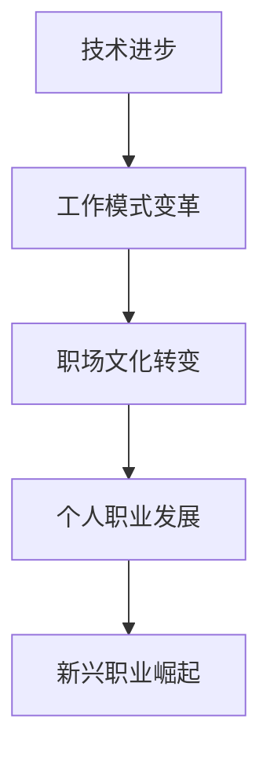
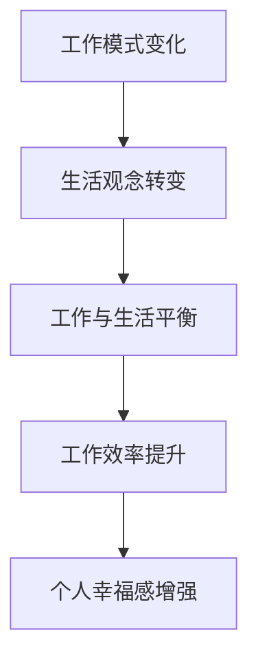
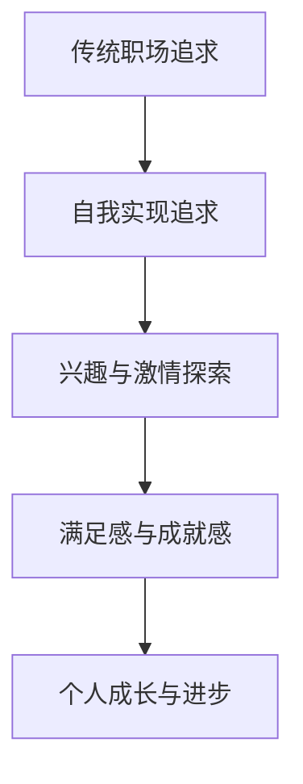
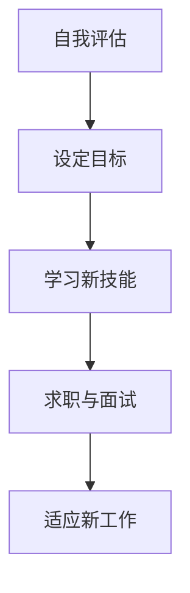

                 


### 《后职场时代：当工作不再定义我们时》

#### 关键词
- 后职场时代
- 工作与生活平衡
- 自我实现
- 新兴职业
- 技术影响

#### 摘要
随着科技的迅猛发展，职场正经历着前所未有的变革。工作不再仅仅是一个职业选择，而是生活方式的一部分。本文将探讨后职场时代的特点，分析工作如何不再定义我们，以及如何在这个新时代找到自我实现的新路径。

---

## 第一部分：后职场时代的来临

### 1.1 职场转型的趋势

在过去的几十年里，职场环境发生了巨大的变化。传统的工作模式逐渐被打破，远程工作、兼职、自由职业等新兴工作形式日益普及。这些变化不仅是技术进步的体现，更是社会观念的变革。

**核心概念与联系**

**Mermaid流程图：**


随着互联网和移动设备的普及，人们可以随时随地办公。这不仅提高了工作效率，也使得工作与生活的界限变得模糊。因此，个人职业发展不再仅仅依赖于传统的职场路径，而是通过不断学习新技能、适应新环境来实现。

**核心算法原理讲解**

```python
# 伪代码：适应新职业算法

def 职业适应(旧技能, 新技能需求):
    if not 旧技能.intersection(新技能需求):
        学习新技能
    else:
        练习旧技能与新技能的结合
    return 职业适应度
```

**数学模型与公式**

$$
职业适应度 = f(技能匹配度, 工作满意度, 自我实现度)
$$

举例说明：一个拥有编程技能的人，在面对一个需要数据分析的新职业时，如果他具备一定的数据分析技能，且对这份工作有很高的满意度，同时感到自己在工作中实现了个人价值，那么他的职业适应度就会很高。

### 1.2 工作与生活的平衡

随着工作模式的变化，人们越来越意识到工作与生活平衡的重要性。不再追求长时间工作，而是更加注重工作效率和个人生活质量。这种平衡不仅提升了工作效率，也提高了个人的幸福感和创造力。

**核心概念与联系**

**Mermaid流程图：**


工作与生活的平衡，需要建立在对工作本质的理解上。工作是为了实现个人价值，而不是仅仅为了赚钱。因此，如何在工作与生活之间找到平衡，是每个人都必须面对的挑战。

**核心算法原理讲解**

```python
# 伪代码：工作生活平衡算法

def 工作生活平衡(工作时间, 生活时间):
    if 工作时间 > 生活时间:
        调整工作时间
    else:
        调整生活时间
    return 平衡度
```

**数学模型与公式**

$$
平衡度 = \frac{生活时间}{工作时间} \times 100\%
$$

举例说明：如果一个人的工作时间是每周40小时，生活时间是每周60小时，那么他的平衡度就是150%。

### 1.3 自我实现的探索

在传统职场中，人们往往追求稳定的工作和职业晋升。而在后职场时代，自我实现成为了更受欢迎的目标。人们通过探索自己的兴趣和激情，寻找能够带来满足感和成就感的工作。

**核心概念与联系**

**Mermaid流程图：**


自我实现的探索，不仅需要对自己的兴趣和优势有清晰的认识，还需要不断地学习新知识、尝试新事物。只有这样，才能在不断变化的世界中找到自己的位置。

**核心算法原理讲解**

```python
# 伪代码：自我实现探索算法

def 自我实现(兴趣, 学习能力):
    if 兴趣 and 学习能力:
        探索新领域
    else:
        提升兴趣或学习能力
    return 自我实现度
```

**数学模型与公式**

$$
自我实现度 = f(兴趣度, 学习能力, 实践经验)
$$

举例说明：一个对编程有浓厚兴趣的人，如果他具备良好的学习能力和丰富的编程经验，那么他的自我实现度就会很高。

---

## 第二部分：后职场时代的核心概念与联系

### 2.1 职场转型流程图

在职场转型的过程中，需要经历以下几个步骤：

1. **自我评估**：了解自己的兴趣、优势和劣势。
2. **设定目标**：明确转型的方向和目标。
3. **学习新技能**：根据目标，学习必要的技能。
4. **求职与面试**：寻找合适的工作机会，并通过面试展示自己的能力。
5. **适应新工作**：在新工作中找到自己的位置，并不断提升。

**Mermaid流程图：**


### 2.2 核心概念与联系

在职场转型中，几个核心概念紧密相连：

- **自我评估**：了解自己的兴趣、优势和劣势，是转型的第一步。
- **设定目标**：明确转型的方向和目标，是转型的核心。
- **学习新技能**：根据目标，学习必要的技能，是转型的关键。
- **求职与面试**：寻找合适的工作机会，并通过面试展示自己的能力，是转型的桥梁。
- **适应新工作**：在新工作中找到自己的位置，并不断提升，是转型的结果。

这些概念之间的联系，构成了职场转型的完整过程。

### 2.3 后职场时代的算法原理

在职场转型中，算法原理起着重要作用。以下是一个简单的伪代码示例：

```python
# 伪代码：职场转型算法

def 职场转型(旧职业, 新职业需求):
    if 旧职业 != 新职业需求:
        学习新职业需求
    else:
        提升旧职业技能
    return 职场转型成功率
```

这个算法通过判断旧职业是否与新职业需求匹配，来决定是否需要学习新技能或提升旧技能，从而提高职场转型的成功率。

### 2.4 数学模型与公式

在职场转型中，数学模型和公式可以帮助我们更好地理解转型的过程和结果。以下是一个简单的数学模型：

$$
职场转型成功率 = f(技能匹配度, 工作满意度, 自我实现度)
$$

这个模型考虑了技能匹配度、工作满意度和自我实现度三个因素，用来衡量职场转型的成功概率。

### 2.5 后职场时代的实战案例

为了更好地理解后职场时代的职场转型，我们可以通过以下实战案例来进行分析：

- **案例1：从程序员到数据分析师的转型**  
  一个程序员在经过自我评估后，发现自己对数据分析有浓厚兴趣，并设定了转型为数据分析师的目标。他通过在线课程和项目实践，学习了数据分析相关的技能，并通过面试进入了一家知名公司。在新工作中，他不断提升自己的数据分析能力，最终实现了自我价值。

- **案例2：从教师到创业者的转型**  
  一个有丰富教学经验的教师，通过自我评估和市场需求分析，决定转型为创业者。他创办了一家专注于在线教育的公司，通过自己的教学经验和互联网技术，为学生提供了优质的教育资源。在他的领导下，公司快速发展，成为了行业的佼佼者。

这些案例展示了在后职场时代，通过自我评估、目标设定、技能学习和适应新工作，可以实现职场转型，找到新的职业方向。

---

## 第三部分：后职场时代的未来展望

### 3.1 数字游民与远程工作

随着远程工作的普及，数字游民成为一种新兴的生活方式。他们通过互联网和移动设备，在全球范围内选择工作地点，实现工作与生活的平衡。

### 3.2 创意工作者的崛起

创意工作者在后职场时代扮演着重要角色。他们通过独特的创意和设计，为企业和社会创造了价值。创意工作者的崛起，推动了职场文化的变革。

### 3.3 平台经济的崛起

平台经济在后职场时代发挥着重要作用。它通过互联网和大数据技术，为个人和企业提供了更多的机会和平台，促进了资源的共享和优化。

---

## 结语

后职场时代，工作不再仅仅是一个职业选择，而是生活方式的一部分。在这个时代，我们需要不断学习新技能、适应新环境，寻找自我实现的新路径。通过自我评估、目标设定、技能学习和适应新工作，我们可以实现职场转型，找到新的职业方向。后职场时代，让我们拥抱变化，迎接未来。

---

#### 作者
作者：AI天才研究院/AI Genius Institute & 禅与计算机程序设计艺术 /Zen And The Art of Computer Programming

