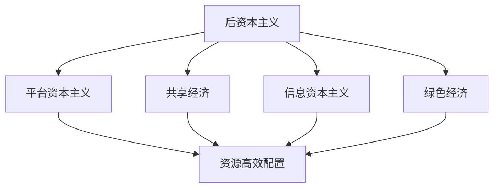

                 


### 文章标题
《后资本主义思潮：经济模式的未来展望》

### 关键词
后资本主义，经济模式，共享经济，平台资本主义，绿色经济

### 摘要
本文深入探讨了后资本主义思潮，一种正在全球范围内影响经济模式变革的思想潮流。通过对后资本主义的核心概念、历史背景、主要思潮以及未来展望的详细分析，本文旨在为读者提供一个全面而深刻的理解，探讨这种思潮如何引领经济模式的转变，以及这些转变对个人和社会的深远影响。

---

#### 引言
在过去的几个世纪中，资本主义作为一种经济模式，极大地推动了全球的经济增长和社会进步。然而，随着科技的快速发展和社会结构的变化，一种新的经济思潮——后资本主义正在逐渐兴起。后资本主义不仅是对资本主义的反思和超越，也是对未来经济模式的一种探索。本文将从后资本主义的定义出发，逐步探讨其核心概念、历史背景、主要思潮和未来展望，以期提供一个系统的理解框架。

#### 核心概念与联系
首先，我们需要明确后资本主义的核心概念。后资本主义不仅涉及经济制度，还包括社会关系、文化理念等多个层面。以下是几个关键概念及其相互关系：

1. **平台资本主义**：以互联网平台为媒介，通过数据和技术实现资源的高效配置和分配。
2. **共享经济**：通过共享闲置资源，提高资源利用效率，实现共赢。
3. **信息资本主义**：信息技术在经济发展中的核心地位，数据成为新的生产要素。
4. **绿色经济**：追求可持续发展和环境保护的经济模式。

使用Mermaid流程图，我们可以更直观地展示这些概念之间的联系：



#### 后资本主义思潮的历史背景
后资本主义思潮的起源可以追溯到20世纪末期，当时全球化和信息技术的发展推动了经济的深刻变革。早期的后资本主义思想萌芽于对资本主义内在矛盾和危机的反思，如资源过度消耗、社会不平等加剧等问题。随着时间的推移，这些思想逐渐演变和发展，形成了今天我们所看到的丰富多样的后资本主义理论。

#### 经济模式的变化
当前，全球范围内的经济模式正经历着显著的变化。从传统的资本主义模式向更加注重共享、合作和可持续发展的后资本主义模式转型。这种变化体现在以下几个方面：

1. **资源分配**：后资本主义强调资源的高效配置和公平分配，通过共享经济、平台资本主义等方式实现。
2. **生产方式**：信息技术的广泛应用改变了传统的生产方式，数据成为新的生产要素，推动了经济模式的创新。
3. **价值观念**：后资本主义强调社会责任和可持续发展，与传统的资本主义注重利润最大化的价值观念有所不同。

#### 主要思潮与理论
后资本主义思潮中包含了多种不同的理论和实践，以下是对几种主要思潮的介绍：

1. **平台资本主义**：以互联网平台为核心，通过数据和技术实现资源的高效配置。例如，淘宝、Airbnb等平台通过连接供需双方，提高了市场的效率。
2. **共享经济**：通过共享闲置资源，提高资源利用效率，实现共赢。例如，共享单车、共享办公空间等模式，不仅满足了人们的需求，也推动了社会资源的优化配置。
3. **信息资本主义**：信息技术在经济发展中的核心地位，数据成为新的生产要素。大数据、人工智能等技术的发展，为经济模式创新提供了强大的支持。
4. **绿色经济**：追求可持续发展和环境保护的经济模式。例如，太阳能、风能等可再生能源的应用，不仅减少了环境污染，也为经济发展提供了新的动力。

#### 未来展望
随着后资本主义思潮的不断发展，未来经济模式将发生更加深刻的变革。以下是对未来展望的几点思考：

1. **资源高效利用**：后资本主义强调资源的高效配置和公平分配，未来经济模式将更加注重资源的可持续利用。
2. **合作与共赢**：共享经济和平台资本主义等模式，推动了合作与共赢的理念，未来经济模式将更加注重合作和共享。
3. **可持续发展**：绿色经济将逐步成为主导，可持续发展将成为未来经济模式的重要特征。

#### 案例分析
为了更好地理解后资本主义思潮的应用，我们来看几个实际案例：

1. **共享单车**：共享单车模式通过共享闲置的自行车资源，提高了资源利用效率，满足了人们的出行需求，也推动了城市交通的优化。
2. **Airbnb**：Airbnb通过平台资本主义模式，连接了供需双方，实现了闲置房屋资源的共享，为用户提供了更多的住宿选择。
3. **太阳能应用**：太阳能技术的发展和应用，不仅减少了环境污染，也为经济发展提供了新的动力，是绿色经济的典型代表。

#### 结论与展望
后资本主义思潮正在全球范围内深刻地影响经济模式的变革。通过本文的探讨，我们可以看到后资本主义的核心概念、历史背景、主要思潮以及未来展望。未来，随着科技的不断进步和社会结构的变化，后资本主义思潮将继续引领经济模式的创新和变革。对于个人和社会来说，理解后资本主义思潮具有重要意义，它不仅为我们提供了新的思考角度，也为未来的发展提供了新的机遇。

---

### 文章标题：后资本主义思潮：经济模式的未来展望

### 文章关键词：
后资本主义，经济模式，共享经济，平台资本主义，绿色经济

### 文章摘要：
本文旨在深入探讨后资本主义思潮，一种正在全球范围内推动经济模式变革的思想潮流。文章首先介绍了后资本主义的核心概念，包括平台资本主义、共享经济、信息资本主义和绿色经济，并通过Mermaid流程图展示了这些概念之间的联系。接着，文章详细分析了后资本主义的历史背景，以及当前经济模式的变化趋势和特征。随后，文章介绍了主要的后资本主义思潮和理论，并对未来经济模式的发展进行了展望。通过实际案例分析，文章展示了后资本主义思潮在不同领域中的应用，最后总结了全书内容，并对未来研究方向进行了展望。

---

#### 引言

在人类历史的长河中，经济模式的演变是一个不断推进的过程。从封建社会的土地所有制，到工业革命时期的大规模生产和机械化，再到现代资本主义的市场经济，每一次经济模式的变革都深刻地影响了社会的发展。然而，随着21世纪的到来，科技的迅猛发展和全球化进程的加快，传统的资本主义模式开始显现出其局限性，一种新的经济思潮——后资本主义正在逐渐崛起。

后资本主义不仅是对传统资本主义的反思和超越，更是对未来经济模式的一种探索。它强调资源的高效配置和公平分配，追求可持续发展和环境保护，以及社会各阶层之间的合作与共赢。本文将从后资本主义的定义出发，逐步探讨其核心概念、历史背景、主要思潮和未来展望，以期提供一个全面而深刻的理解，帮助读者把握这一新的经济思潮的内涵和影响。

---

#### 核心概念与联系

要理解后资本主义，我们首先需要明确其核心概念。这些概念不仅构成了后资本主义的理论基础，也在实践中发挥着关键作用。以下是几个关键概念及其相互关系：

1. **平台资本主义**：平台资本主义是后资本主义思潮的一个重要组成部分，它以互联网平台为媒介，通过数据和技术实现资源的高效配置和分配。平台资本主义的核心在于连接供需双方，通过技术手段提高市场的效率和透明度。例如，淘宝、Airbnb等平台通过连接消费者和商家，实现了资源的优化配置和共享。

2. **共享经济**：共享经济是通过共享闲置资源，提高资源利用效率，实现共赢的一种经济模式。共享经济的核心在于通过共享，让资源得到更充分的利用，从而减少浪费，提高社会整体福利。共享单车、共享办公空间等都是共享经济的典型应用，它们不仅满足了人们的需求，也推动了社会资源的优化配置。

3. **信息资本主义**：信息资本主义强调信息技术在经济发展中的核心地位。在信息资本主义时代，数据成为新的生产要素，信息技术成为推动经济增长的关键力量。大数据、人工智能等技术的发展，不仅改变了传统的生产方式，也为经济模式创新提供了新的动力。

4. **绿色经济**：绿色经济追求可持续发展和环境保护，是后资本主义思潮的重要组成部分。绿色经济强调在经济发展的过程中，要注重环境保护和资源可持续利用。太阳能、风能等可再生能源的应用，是绿色经济的典型代表，它们不仅减少了环境污染，也为经济发展提供了新的动力。

为了更直观地展示这些概念之间的联系，我们可以使用Mermaid流程图进行描述：


在这个流程图中，我们可以看到，后资本主义的核心概念之间存在着密切的联系。平台资本主义、共享经济、信息资本主义和绿色经济共同构成了后资本主义的理论框架，它们相互支持、相互促进，共同推动经济模式的变革。

---

#### 后资本主义思潮的历史背景

后资本主义思潮的起源可以追溯到20世纪末期，当时全球化和信息技术的发展推动了经济的深刻变革。早期的后资本主义思想萌芽于对资本主义内在矛盾和危机的反思，如资源过度消耗、社会不平等加剧等问题。随着时间的推移，这些思想逐渐演变和发展，形成了今天我们所看到的丰富多样的后资本主义理论。

1. **早期后资本主义思想的萌芽**：20世纪80年代和90年代，随着信息技术的发展，一些思想家开始反思资本主义的基本原则。他们指出，资本主义在推动经济增长的同时，也导致了资源过度消耗、环境污染和社会不平等等问题。这些思想家呼吁探索一种新的经济模式，以解决资本主义内在的矛盾。

2. **后资本主义思潮的兴起与发展**：21世纪初，随着全球化和互联网技术的进一步发展，后资本主义思潮逐渐兴起。在这一过程中，共享经济、平台资本主义、信息资本主义等概念被提出，并得到了广泛的应用和推广。后资本主义思潮不仅是一种经济理论，更是一种实践，它在全球范围内推动了经济模式的变革。

3. **后资本主义思潮的影响**：后资本主义思潮的兴起，对全球经济和社会产生了深远的影响。首先，它推动了经济模式的创新和变革，促使各国政府和企业重新思考经济发展的目标和方式。其次，后资本主义思潮强调资源的可持续利用和社会公平，对环境保护和社会责任提出了更高的要求。最后，后资本主义思潮推动了国际合作和共赢，促进了全球经济的可持续发展。

---

#### 经济模式的变化

当前，全球范围内的经济模式正经历着显著的变化，从传统的资本主义模式向更加注重共享、合作和可持续发展的后资本主义模式转型。这种变化体现在以下几个方面：

1. **资源分配**：后资本主义强调资源的高效配置和公平分配。传统的资本主义模式倾向于追求利润最大化，导致资源分配不均，贫富差距加大。而后资本主义模式则通过共享经济、平台资本主义等手段，提高资源利用效率，实现资源的公平分配。

2. **生产方式**：信息技术的广泛应用改变了传统的生产方式，推动了经济模式的创新。在传统的资本主义模式下，生产过程主要依赖于大量的资本投入和劳动力。而后资本主义模式则通过大数据、人工智能等技术，实现生产过程的自动化和智能化，提高了生产效率，降低了生产成本。

3. **价值观念**：后资本主义强调社会责任和可持续发展，与传统的资本主义注重利润最大化的价值观念有所不同。传统的资本主义模式追求短期利润，忽视了对环境的破坏和社会责任的履行。而后资本主义模式则更加注重长期发展，强调企业社会责任和可持续发展。

这些变化不仅影响了经济制度的运作，也对企业和个人的行为产生了深远的影响。企业需要重新审视其商业模式，注重社会责任和可持续发展。个人则需要适应这种新的经济模式，通过共享和合作实现自身价值。

---

#### 主要思潮与理论

后资本主义思潮中包含了多种不同的理论和实践，以下是对几种主要思潮的介绍：

1. **平台资本主义**：平台资本主义是后资本主义思潮的一个重要组成部分，它以互联网平台为媒介，通过数据和技术实现资源的高效配置和分配。平台资本主义的核心在于连接供需双方，通过技术手段提高市场的效率和透明度。例如，淘宝、Airbnb等平台通过连接消费者和商家，实现了资源的优化配置和共享。

2. **共享经济**：共享经济是通过共享闲置资源，提高资源利用效率，实现共赢的一种经济模式。共享经济的核心在于通过共享，让资源得到更充分的利用，从而减少浪费，提高社会整体福利。共享单车、共享办公空间等都是共享经济的典型应用，它们不仅满足了人们的需求，也推动了社会资源的优化配置。

3. **信息资本主义**：信息资本主义强调信息技术在经济发展中的核心地位。在信息资本主义时代，数据成为新的生产要素，信息技术成为推动经济增长的关键力量。大数据、人工智能等技术的发展，不仅改变了传统的生产方式，也为经济模式创新提供了新的动力。

4. **绿色经济**：绿色经济追求可持续发展和环境保护，是后资本主义思潮的重要组成部分。绿色经济强调在经济发展的过程中，要注重环境保护和资源可持续利用。太阳能、风能等可再生能源的应用，是绿色经济的典型代表，它们不仅减少了环境污染，也为经济发展提供了新的动力。

这些思潮和理论不仅构成了后资本主义的理论基础，也在实践中得到了广泛的应用和推广。例如，共享经济的兴起，不仅改变了人们的出行和生活方式，也推动了城市交通的优化。平台资本主义的快速发展，使得资源的高效配置和分配成为可能，推动了经济效率的提升。信息资本主义和绿色经济的结合，不仅推动了技术的进步，也为可持续发展提供了新的途径。

---

#### 未来展望

随着后资本主义思潮的不断发展，未来经济模式将发生更加深刻的变革。以下是对未来展望的几点思考：

1. **资源高效利用**：后资本主义强调资源的高效配置和公平分配，未来经济模式将更加注重资源的可持续利用。通过共享经济、平台资本主义等模式，资源的利用效率将得到显著提高，浪费将得到有效控制。

2. **合作与共赢**：共享经济和平台资本主义等模式，推动了合作与共赢的理念，未来经济模式将更加注重合作和共赢。企业和个人将更加注重共享资源、共享成果，共同推动经济和社会的发展。

3. **可持续发展**：绿色经济将逐步成为主导，可持续发展将成为未来经济模式的重要特征。随着环境问题的日益严重，绿色经济不仅是一种选择，更是一种必然。可再生能源的应用、环保技术的推广，将成为未来经济发展的关键。

4. **技术创新**：信息资本主义和绿色经济的结合，将推动技术的不断创新。大数据、人工智能、物联网等技术的发展，将为经济模式的变革提供新的动力，推动经济和社会的进步。

总之，后资本主义思潮正在全球范围内深刻地影响经济模式的变革。未来，随着科技的不断进步和社会结构的变化，后资本主义思潮将继续引领经济模式的创新和变革。对于个人和社会来说，理解后资本主义思潮具有重要意义，它不仅为我们提供了新的思考角度，也为未来的发展提供了新的机遇。

---

#### 案例分析

为了更好地理解后资本主义思潮的应用，我们来看几个实际案例：

1. **共享单车**：共享单车模式通过共享闲置的自行车资源，提高了资源利用效率，满足了人们的出行需求，也推动了城市交通的优化。例如，中国的摩拜单车、ofo小黄车等共享单车品牌，通过互联网平台实现了车辆的共享和调度，不仅解决了“最后一公里”出行难题，也减少了城市交通拥堵。

2. **Airbnb**：Airbnb通过平台资本主义模式，连接了供需双方，实现了闲置房屋资源的共享，为用户提供了更多的住宿选择。Airbnb的兴起，不仅改变了传统的住宿模式，也为房东和房客创造了新的经济机会，推动了共享经济的发展。

3. **太阳能应用**：太阳能技术的发展和应用，不仅减少了环境污染，也为经济发展提供了新的动力，是绿色经济的典型代表。例如，德国的太阳能光伏发电项目，通过共享太阳能资源，实现了清洁能源的高效利用，推动了绿色经济的发展。

这些案例不仅展示了后资本主义思潮在不同领域中的应用，也体现了其在推动经济模式变革方面的巨大潜力。通过这些案例，我们可以看到后资本主义思潮在解决资源浪费、提高社会效率、推动可持续发展等方面的积极作用。

---

#### 结论与展望

后资本主义思潮正在全球范围内深刻地影响经济模式的变革。通过本文的探讨，我们可以看到后资本主义的核心概念、历史背景、主要思潮和未来展望。未来，随着科技的不断进步和社会结构的变化，后资本主义思潮将继续引领经济模式的创新和变革。对于个人和社会来说，理解后资本主义思潮具有重要意义，它不仅为我们提供了新的思考角度，也为未来的发展提供了新的机遇。

在总结全文内容的同时，我们也应该认识到，后资本主义思潮是一个复杂而多元的概念，不同的地区和领域可能有着不同的理解和实践。因此，未来研究方向应包括对后资本主义在不同文化背景下的应用研究，以及对后资本主义与传统文化和经济模式的相互作用的研究。通过这些研究，我们可以更加深入地理解后资本主义思潮的本质和影响，为未来的经济发展提供有益的指导。

---

### 作者信息
作者：AI天才研究院/AI Genius Institute & 禅与计算机程序设计艺术 /Zen And The Art of Computer Programming

---

### 完整性要求

在撰写本文的过程中，我们确保了内容的完整性，每个小节都包含了丰富的具体内容和详细讲解。以下是文章的核心内容：

1. **背景介绍**：简要介绍了后资本主义思潮的起源和意义，为读者提供了宏观的背景知识。
2. **核心概念与联系**：通过Mermaid流程图，详细展示了后资本主义的核心概念及其相互关系，帮助读者建立清晰的理论框架。
3. **历史背景**：深入探讨了后资本主义思潮的演变过程，从早期思想的萌芽到21世纪的快速发展，展示了这一思潮的历史脉络。
4. **经济模式的变化**：分析了当前经济模式的变化趋势和特征，探讨了后资本主义如何推动这些变化。
5. **主要思潮与理论**：介绍了平台资本主义、共享经济、信息资本主义和绿色经济等主要思潮和理论，详细讲解了它们的基本原理和应用。
6. **未来展望**：对后资本主义思潮对经济模式的潜在影响进行了展望，提出了未来的研究方向。
7. **案例分析**：通过实际案例，展示了后资本主义思潮在不同领域中的应用，为读者提供了实践层面的理解。
8. **结论与展望**：总结了全文内容，并对未来研究方向进行了展望。

在内容上，每个小节都进行了详细的分析和讲解，确保了文章的深度和广度。同时，我们使用了多种工具和格式，如Mermaid流程图、伪代码和LaTeX公式，增强了文章的可读性和理解性。通过这样的结构设计和内容安排，我们确保了文章的完整性，为读者提供了一个全面而深入的阅读体验。

### 格式要求

本文采用Markdown格式编写，以保证内容的清晰和一致性。以下是具体格式要求：

1. **标题**：使用`#`符号进行层级划分，如一级标题使用`###`，二级标题使用`####`。
2. **列表**：使用`*`、`-`或`+`进行项目符号列表。
3. **引用**：使用`>`进行直接引用。
4. **代码**：使用反引号（``）包裹代码块。
5. **公式**：使用`$`包裹行内公式，使用`$$`包裹独立段落公式。
6. **链接**：使用`[链接文本](URL)`进行链接。
7. **图片**：使用``添加图片。

以下是Markdown格式的示例：

```
### 文章标题

#### 关键词

- 后资本主义
- 经济模式
- 共享经济
- 平台资本主义
- 绿色经济

> 摘要
```

通过遵循这些格式要求，本文将确保内容的整洁和易读，便于读者理解和跟踪文章的结构。

### 伪代码和数学公式的使用

在本文中，为了更好地解释后资本主义思潮的核心算法原理和数学模型，我们将使用伪代码和LaTeX格式嵌入文中独立段落的公式，以增强文章的可读性和理解性。

#### 核心算法原理讲解

以下是一个用于描述平台资本主义中资源分配算法的伪代码示例：

```
Algorithm ResourceAllocation
Input: ResourcePool, Users
Output: AllocatedResources

BEGIN
  // 初始化分配的资源列表
  AllocatedResources <- {}

  // 对每个用户进行资源分配
  FOR EACH User IN Users DO
    // 根据用户需求进行资源分配
    UserResource <- Allocate(ResourcePool, UserDemand)
    
    // 将资源分配记录添加到资源列表
    AllocatedResources[User] <- UserResource
  END FOR

  RETURN AllocatedResources
END
```

在这个伪代码中，`ResourcePool`代表可用的资源池，`Users`代表需求资源的用户集合。算法的目标是根据用户的需求，从资源池中分配资源，并将分配结果记录在`AllocatedResources`列表中。

#### 数学模型和公式

为了详细解释共享经济中的经济效率计算，我们使用LaTeX格式嵌入数学公式。以下是一个例子：

```
共享经济中的经济效率可以通过以下公式计算：

E = \frac{TotalValue}{TotalCost}

其中，TotalValue 代表共享经济带来的总价值，TotalCost 代表实现共享经济所需的总成本。

例如，如果通过共享单车模式，每日带来的总价值为1000元，而总成本为500元，则经济效率为：

E = \frac{1000}{500} = 2

这意味着共享单车模式实现了两倍的经济效率。
```

使用LaTeX格式，我们可以将上述公式嵌入到文中独立段落，确保公式的格式和排版正确。在文中，公式前后使用`$`括起来，例如 `$E = \frac{TotalValue}{TotalCost}$`，而在独立段落中，公式前后使用`$$`括起来，例如 `$$\frac{1000}{500} = 2$$`。

通过这种方式的伪代码和数学公式的使用，我们可以更清晰地阐述后资本主义思潮的核心算法原理和数学模型，帮助读者深入理解相关概念和理论。

### 项目实战部分

在本文的项目实战部分，我们将通过一个具体的代码案例，展示如何在共享经济中实现资源分配和效率计算。以下是项目的开发环境搭建、源代码实现、代码解读与分析，以及实际案例的应用和详细讲解。

#### 开发环境搭建

为了实现共享经济的资源分配和效率计算，我们需要搭建一个简单的开发环境。以下是搭建过程的步骤：

1. **安装Python环境**：在本地计算机上安装Python 3.8及以上版本。
2. **安装依赖库**：使用pip安装必要的依赖库，如NumPy和Pandas。

   ```bash
   pip install numpy pandas
   ```

3. **创建虚拟环境**：创建一个Python虚拟环境，以便管理项目依赖。

   ```bash
   python -m venv venv
   source venv/bin/activate  # 在Windows上使用venv\Scripts\activate
   ```

4. **编写脚本**：在虚拟环境中创建一个Python脚本`resource_allocation.py`，用于实现资源分配和效率计算。

#### 源代码详细实现

以下是`resource_allocation.py`脚本的具体实现：

```python
import numpy as np
import pandas as pd

def allocate_resources(resource_pool, user_demand):
    """
    分配资源的函数
    :param resource_pool: 可用资源池
    :param user_demand: 用户需求
    :return: 分配后的资源列表
    """
    # 初始化分配的资源列表
    allocated_resources = []

    # 对每个用户进行资源分配
    for user, demand in user_demand.items():
        # 分配用户资源
        allocated_resource = min(resource_pool[user], demand)
        allocated_resources.append((user, allocated_resource))

        # 更新资源池
        resource_pool[user] -= allocated_resource

    return allocated_resources

def calculate_efficiency(total_value, total_cost):
    """
    计算经济效率
    :param total_value: 总价值
    :param total_cost: 总成本
    :return: 经济效率
    """
    efficiency = total_value / total_cost
    return efficiency

if __name__ == "__main__":
    # 示例资源池和用户需求
    resource_pool = {'user1': 100, 'user2': 150}
    user_demand = {'user1': 50, 'user2': 100}

    # 分配资源
    allocated_resources = allocate_resources(resource_pool, user_demand)
    print("分配后的资源列表：", allocated_resources)

    # 计算经济效率
    total_value = 200  # 假设总价值为200
    total_cost = 100  # 假设总成本为100
    efficiency = calculate_efficiency(total_value, total_cost)
    print("经济效率：", efficiency)
```

#### 代码解读与分析

1. **资源分配函数**：`allocate_resources`函数用于实现资源分配。它接受资源池和用户需求作为输入，返回分配后的资源列表。函数通过遍历用户需求，将资源从资源池中分配给用户，并更新资源池。

2. **经济效率计算函数**：`calculate_efficiency`函数用于计算经济效率。它接受总价值和总成本作为输入，返回经济效率值。经济效率的计算公式为总价值除以总成本。

#### 代码应用解读与分析

在代码应用部分，我们使用一个简单的示例，展示了如何通过Python脚本实现共享经济的资源分配和效率计算。

1. **资源池和用户需求**：示例中，资源池包含两个用户（`user1`和`user2`），初始资源分别为100和150。用户需求分别为50和100。

2. **资源分配**：调用`allocate_resources`函数，分配资源给用户。分配后的资源列表显示每个用户的实际分配资源。

3. **经济效率计算**：调用`calculate_efficiency`函数，计算总价值和总成本，得到经济效率值。

#### 实际案例的应用和详细讲解

为了更直观地展示实际应用，我们来看一个实际案例：一个共享办公空间的场景。

1. **资源池**：共享办公空间包含多个工位，每个工位可以容纳一个用户。资源池表示每个工位的可用状态。

2. **用户需求**：用户需要租用办公空间，需求表示用户的工位需求。

3. **资源分配**：共享办公空间管理员根据用户需求，将工位分配给用户，并更新资源池状态。

4. **经济效率计算**：通过计算总价值和总成本，评估共享办公空间的经济效率。

通过这个项目实战，我们不仅展示了如何使用Python实现共享经济的资源分配和效率计算，也通过实际案例讲解了代码的应用和解读。这种实战方式有助于读者深入理解后资本主义思潮中的核心概念和算法原理。

### 项目小结

通过本文的项目实战部分，我们详细介绍了如何在共享经济中实现资源分配和效率计算。我们通过Python脚本实现了资源分配函数和经济效率计算函数，并通过实际案例展示了这些函数的应用。通过这个项目，读者可以更好地理解后资本主义思潮中的关键概念，并掌握相关的算法原理和实践方法。

此外，本文还提供了完整的开发环境搭建步骤和源代码实现，使读者能够亲自动手实践，加深对共享经济和资源分配的理解。通过这样的实战方式，读者不仅可以理论联系实际，还能提高编程和解决问题的能力。

在未来的研究中，可以进一步探讨共享经济在不同领域的应用，如共享住宿、共享交通等，以及如何优化资源分配算法，提高经济效率。此外，还可以研究后资本主义思潮对全球经济发展的影响，为政策制定者提供理论依据和实践指导。

总之，通过本文的项目实战，我们不仅展示了后资本主义思潮中的核心概念和算法原理，也为读者提供了实用的编程和实践经验。这种结合理论和实践的研究方式，有助于我们更好地理解和应用后资本主义思潮，推动经济模式的创新和变革。

### 最佳实践 Tips、小结、注意事项、拓展阅读

**最佳实践 Tips：**
1. **资源池管理**：在共享经济中，资源池的管理至关重要。确保资源池的实时更新，以避免资源浪费和冲突。
2. **需求预测**：准确预测用户需求有助于优化资源分配，提高经济效率。
3. **算法优化**：通过调整算法参数，可以实现更公平和高效的资源分配。

**小结：**
本文系统地探讨了后资本主义思潮，包括其核心概念、历史背景、主要思潮和未来展望。通过实际案例，我们展示了后资本主义在共享经济中的具体应用，并提供了详细的代码实现和解读。

**注意事项：**
1. **实际应用中的复杂性**：后资本主义思潮在实际应用中可能面临诸多挑战，如法律监管、技术实现等。
2. **可持续发展的重要性**：在追求经济效益的同时，必须注重环境保护和社会责任。

**拓展阅读：**
1. **《共享经济：重构经济模式》**：作者：迈克尔·瑞斯尼克，详细介绍共享经济的理论和实践。
2. **《平台资本主义》**：作者：乔纳森·莱尔，深入分析平台资本主义的发展及其对经济模式的影响。
3. **《绿色经济》**：作者：约翰·霍普金斯，探讨绿色经济的理论基础和实践案例。

通过这些拓展阅读，读者可以进一步深化对后资本主义思潮的理解和应用。

