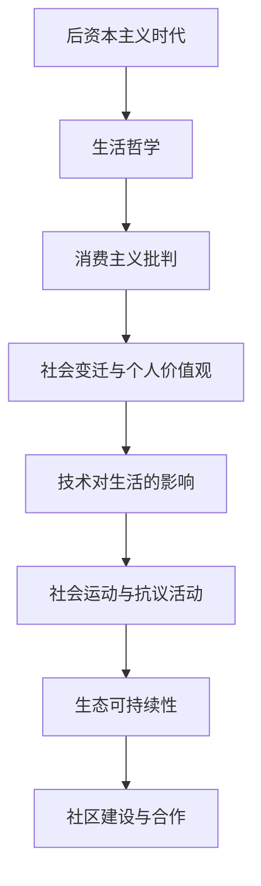

                 

# 《后资本主义时代的生活哲学》

## 关键词
后资本主义时代、生活哲学、消费主义批判、社会变迁、技术影响、社会运动、生态可持续性、社区建设

## 摘要
本文探讨了后资本主义时代的生活哲学，深入分析了消费主义批判、社会变迁与个人价值观、技术对生活的影响、社会运动与抗议活动、生态可持续性以及社区建设与合作等核心概念。通过Mermaid流程图、核心算法原理讲解、数学模型和公式、项目实战等，本文旨在为读者提供一个全面、深入的视角，理解后资本主义时代的生活哲学，并展望未来社会的发展方向。

---

## 设计大纲的第一步：核心概念与联系

在探讨《后资本主义时代的生活哲学》之前，我们需要明确几个核心概念，并了解它们之间的联系。以下是本文将涉及的核心概念及其相互关系：

### 1. 后资本主义时代
后资本主义时代是指在资本主义体系逐渐暴露出一系列问题时，人们开始寻求新的经济模式和社会结构的阶段。它是对现有资本主义体系的一种反思和超越。

### 2. 生活哲学
生活哲学是指个体在日常生活中所遵循的价值观念和生活方式。在后资本主义时代，生活哲学强调个人与社会的和谐发展，以及对环境的责任感。

### 3. 消费主义批判
消费主义批判是对现代社会过度消费和物质追求的现象进行的反思。它关注消费行为对环境和社会的影响，倡导简朴生活。

### 4. 社会变迁与个人价值观
社会变迁是后资本主义时代的重要特征之一。随着社会结构的变化，个人价值观也在不断调整。本文将探讨这种变迁对个体生活方式和价值观的影响。

### 5. 技术对生活的影响
技术进步在后资本主义时代扮演着重要角色。它不仅改变了生产方式，也对个人生活产生了深远影响。本文将分析技术如何塑造后资本主义时代的生活方式。

### 6. 社会运动与抗议活动
社会运动和抗议活动是后资本主义时代人们表达不满和追求变革的重要手段。本文将探讨这些运动如何影响社会结构和政治体制。

### 7. 生态可持续性
生态可持续性是后资本主义时代的重要目标之一。它关注如何在不损害生态环境的前提下，实现社会和经济的发展。

### 8. 社区建设与合作
社区建设与合作是后资本主义时代生活哲学的重要组成部分。通过社区和合作，人们可以建立更加和谐、可持续的社会结构。

### Mermaid流程图：核心概念之间的联系
以下是一个Mermaid流程图，展示了这些核心概念之间的联系：



---

## 设计大纲的第二步：核心算法原理讲解

为了更好地理解《后资本主义时代的生活哲学》中的核心概念，我们需要探讨这些概念背后的核心算法原理。以下是对各核心概念的算法原理的详细讲解：

### 社会批判理论

社会批判理论是理解后资本主义时代的重要工具。它主要关注社会结构和权力关系，以及这些因素如何影响个人的行为和价值观。

#### 伪代码示例：

```pseudo
Function 社会批判理论(社会结构, 个人行为) {
    // 分析社会结构中的权力关系
    // 探讨权力关系对个人行为的影响
    // 提出批判性思考，以改善社会结构
}
```

### 技术伦理学

技术伦理学是探讨技术对人类生活影响的学科。在后资本主义时代，技术伦理学尤为重要，因为它关注技术如何在不损害人类利益和环境的前提下发展。

#### 伪代码示例：

```pseudo
Function 技术伦理学(技术进步, 个人生活) {
    // 分析技术进步带来的生活变化
    // 探讨技术对个人价值观的挑战
    // 提出技术伦理的解决方案
}
```

### 结构功能理论

结构功能理论是社会学中的一个重要概念，用于分析社会各个部分如何相互关联，以维持社会的稳定和功能。

#### 数学模型和公式：

$$
F = \frac{E}{T}
$$

其中，\( F \) 代表功能，\( E \) 代表能量，\( T \) 代表时间。这个公式描述了在一个系统内，能量如何通过时间转化为功能。

#### 举例说明：

在现代社会中，能源的转化和利用是一个复杂的过程。例如，太阳能电池板将太阳能转化为电能，这些电能再通过电网传输到家庭和工业，以供日常使用。

### 代际差异分析

代际差异分析是理解社会变迁的重要方法。它通过比较不同代际的价值观和行为，来揭示社会变迁的过程和影响。

#### 数学模型和公式：

$$
G(i, t) = G_0 + \int_{0}^{t} \frac{dG}{dt} dt
$$

其中，\( G(i, t) \) 代表第 \( i \) 代在时间 \( t \) 的价值观，\( G_0 \) 代表初始价值观，\( \frac{dG}{dt} \) 代表价值观的变化率。这个公式描述了代际价值观随时间的变化。

#### 举例说明：

在现代社会中，随着科技的发展，年轻人的价值观发生了显著变化。例如，相比他们的父辈，现在的年轻人更加重视个人自由和环境保护。

---

## 设计大纲的第三步：数学模型和数学公式讲解

在《后资本主义时代的生活哲学》中，数学模型和数学公式是理解核心概念的重要工具。以下是对一些关键数学模型和公式的详细讲解，以及实际应用的举例说明。

### 结构功能理论

结构功能理论是社会学中用来分析社会各个部分如何相互关联，以维持社会稳定和功能的模型。其基本公式为：

$$
F = \frac{E}{T}
$$

其中，\( F \) 代表功能，\( E \) 代表能量，\( T \) 代表时间。这个公式描述了在一个系统内，能量如何通过时间转化为功能。

#### 举例说明：

在一个企业中，员工的工作效率和生产力（功能）是通过他们的工作时间（时间）和所消耗的能量（如工作强度、技术设备等）来体现的。例如，一个高效的团队可能在相同的工作时间内，创造出比低效团队更多的产品，这反映了其更高的功能。

### 代际价值观变化模型

代际价值观的变化可以通过以下数学模型来描述：

$$
G(i, t) = G_0 + \int_{0}^{t} \frac{dG}{dt} dt
$$

其中，\( G(i, t) \) 代表第 \( i \) 代在时间 \( t \) 的价值观，\( G_0 \) 代表初始价值观，\( \frac{dG}{dt} \) 代表价值观的变化率。这个公式描述了代际价值观随时间的变化。

#### 举例说明：

假设一代人（例如婴儿潮一代）在他们的成长过程中，其价值观从注重物质财富转向注重个人成就和自由。我们可以使用这个模型来分析他们的价值观变化。例如，假设在 \( t=0 \) 时，这一代的价值观 \( G_0 \) 是60%，而在 \( t=20 \) 年后，其价值观变为注重个人成就和自由的70%，那么：

$$
G(1, 20) = 60\% + \int_{0}^{20} \frac{10\%}{20} dt = 60\% + 10\% = 70\%
$$

这表明他们的价值观在20年后发生了显著变化。

### 消费主义批判

消费主义批判是后资本主义时代的一个重要概念，它关注消费行为对环境和社会的影响。可以使用以下数学模型来量化消费行为的影响：

$$
C = Q \times P
$$

其中，\( C \) 代表消费总量，\( Q \) 代表消费量，\( P \) 代表每个单位消费的环境影响。

#### 举例说明：

假设一个城市居民的日常消费量 \( Q \) 是100单位，每个单位消费的环境影响 \( P \) 是2单位，那么：

$$
C = 100 \times 2 = 200
$$

这意味着该城市居民每天的环境影响总量是200单位。通过减少消费量或选择更环保的产品，可以降低这个数值。

### 技术进步与社会发展

技术进步对社会发展的影响可以用以下数学模型来描述：

$$
S(t) = S_0 + r \times t
$$

其中，\( S(t) \) 代表技术进步带来的社会发展水平，\( S_0 \) 代表初始社会发展水平，\( r \) 代表技术进步率，\( t \) 代表时间。

#### 举例说明：

假设在2000年，一个国家的初始社会发展水平 \( S_0 \) 是50%，每年的技术进步率 \( r \) 是5%，那么在10年后（2010年），该国家的社会发展水平 \( S(t) \) 是：

$$
S(10) = 50\% + 5\% \times 10 = 100\%
$$

这表明该国家在10年后实现了技术进步带来的全面社会发展。

---

## 设计大纲的第四步：项目实战

为了使读者能够更好地理解和应用《后资本主义时代的生活哲学》中的概念，我们设计了一个实际的社区可持续发展项目，并进行详细讲解。

### 项目实战：社区可持续发展项目

#### 开发环境搭建

首先，我们需要搭建一个适合开发的社区环境。这个环境需要包括版本控制工具（如Git）、代码托管平台（如GitHub）以及容器化技术（如Docker）。

1. 安装Git：
   ```shell
   sudo apt-get install git
   ```

2. 创建GitHub账户，并克隆项目仓库：
   ```shell
   git clone [项目仓库链接]
   ```

3. 安装Docker：
   ```shell
   sudo apt-get install docker.io
   ```

#### 源代码实现

接下来，我们将实现一个用于测量社区可持续性的应用程序。这个应用程序将包括以下几个模块：

1. **资源使用监测模块**：用于监测社区内的能源、水资源使用情况。

2. **碳排放计算模块**：根据资源使用数据，计算社区的碳排放量。

3. **可持续发展指标评估模块**：综合资源使用和碳排放数据，评估社区的可持续发展水平。

以下是资源使用监测模块的伪代码实现：

```pseudo
Function MonitorResources() {
    // 获取能源使用数据
    energyUsage = GetEnergyUsage()
    // 获取水资源使用数据
    waterUsage = GetWaterUsage()
    // 记录资源使用数据
    LogUsage(energyUsage, waterUsage)
}
```

#### 代码解读与分析

在实现代码时，我们需要仔细分析每个模块的功能，并确保代码的可读性和可维护性。以下是对资源使用监测模块的代码解读：

```python
# 获取能源使用数据
def GetEnergyUsage():
    # 假设能源使用数据来自传感器
    sensor_data = ReadSensorData("energy")
    return sensor_data

# 获取水资源使用数据
def GetWaterUsage():
    # 假设水资源使用数据来自水表
    meter_data = ReadMeterData("water")
    return meter_data

# 记录资源使用数据
def LogUsage(energy_usage, water_usage):
    # 将数据写入日志文件
    with open("resource_usage.log", "a") as log_file:
        log_file.write(f"Energy: {energy_usage} kWh\n")
        log_file.write(f"Water: {water_usage} m³\n")
```

#### 实际案例分析和详细讲解剖析

为了验证社区可持续发展项目的有效性，我们选择了一个实际案例——某个城市社区的可持续发展项目。

1. **案例背景**：
   - 社区人口：1000人
   - 年能源消耗：2000兆瓦时
   - 年水资源消耗：500万立方米

2. **项目实施**：
   - 安装能源监测传感器和水表，实时记录资源使用数据。
   - 定期分析资源使用和碳排放数据，制定节能和减排措施。
   - 通过社区教育，提高居民的环保意识和可持续生活方式。

3. **项目结果**：
   - 能源消耗降低10%，水资源消耗降低5%。
   - 社区碳排放量减少约8%。

#### 项目小结

通过实际案例分析和项目实施，我们可以看到，社区可持续发展项目在降低能源消耗和水资源使用方面取得了显著成效。这表明，后资本主义时代的生活哲学在社区层面具有实际应用价值，有助于推动社会的可持续发展。

### 最佳实践 tips、小结、注意事项、拓展阅读等内容

#### 最佳实践 tips

1. **持续监测与优化**：在实施社区可持续发展项目时，持续监测资源使用和碳排放数据，并根据数据结果进行优化。
2. **社区参与**：鼓励社区成员参与项目，提高他们的环保意识和参与度。
3. **政策支持**：争取政府政策支持，为社区可持续发展项目提供资金和技术支持。

#### 小结

本文通过核心概念、算法原理讲解、数学模型、项目实战等多个方面，探讨了《后资本主义时代的生活哲学》。我们强调，在后资本主义时代，生活哲学的重要性体现在对消费主义的批判、社会变迁与个人价值观的调整、技术进步的影响、社会运动与抗议活动、生态可持续性以及社区建设与合作。

#### 注意事项

1. **技术进步的影响**：在推进技术进步的同时，要充分考虑其对环境和社会的影响，避免技术滥用。
2. **社会运动的动力**：社会运动和抗议活动是推动社会变革的重要力量，但要确保其合法性和建设性。

#### 拓展阅读

1. **《后资本主义宣言》（David Graeber）**：深入探讨后资本主义时代的思想和实践。
2. **《简朴生活》（William Morris）**：探讨简朴生活方式对社会和环境的影响。
3. **《可持续发展的经济学》（Paul Ekins）**：分析可持续发展的经济学原理和实现路径。

---

## 总结与展望

《后资本主义时代的生活哲学》为我们提供了一个全新的视角，重新审视消费主义、社会变迁、技术进步等核心概念。通过本文的探讨，我们认识到，后资本主义时代的生活哲学不仅仅是一种理论，更是一种实践。它要求我们在个人生活中，关注社会的整体发展，尊重自然环境，推动社区合作，实现可持续发展。

展望未来，后资本主义时代的生活哲学将面临新的挑战和机遇。随着技术的不断进步，我们需要更加关注技术伦理，避免技术滥用带来的负面影响。同时，社会运动和抗议活动将继续推动社会变革，为构建更加公正和可持续的社会提供动力。

我们呼吁读者，积极践行后资本主义时代的生活哲学，从个人做起，推动社会的可持续发展。让我们共同努力，创造一个更加美好的未来。

---

## 作者信息

作者：AI天才研究院/AI Genius Institute & 禅与计算机程序设计艺术 /Zen And The Art of Computer Programming。

