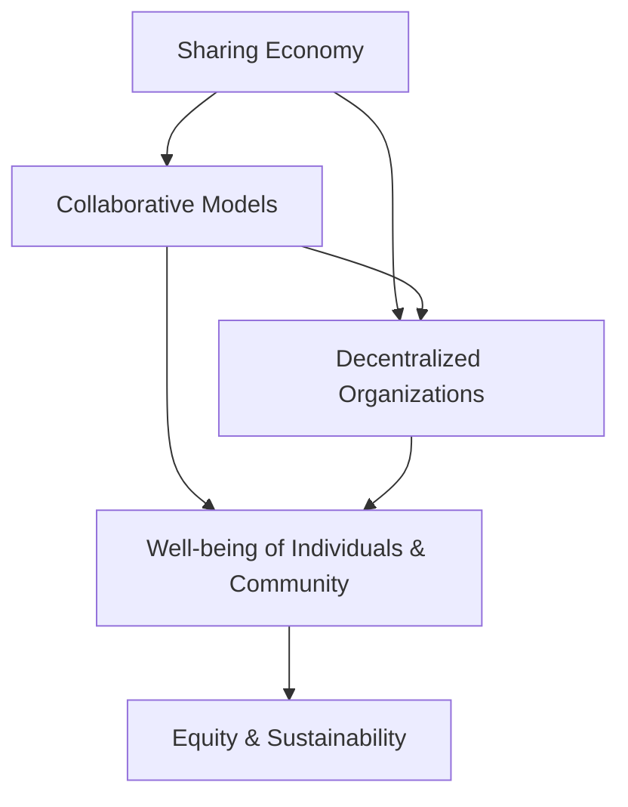
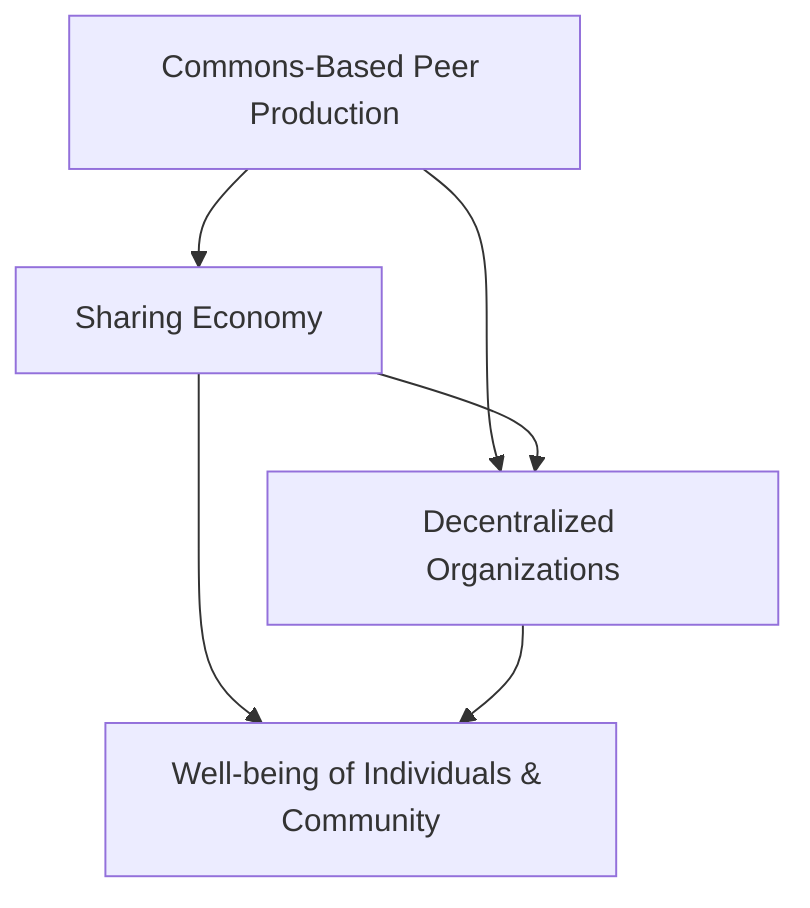
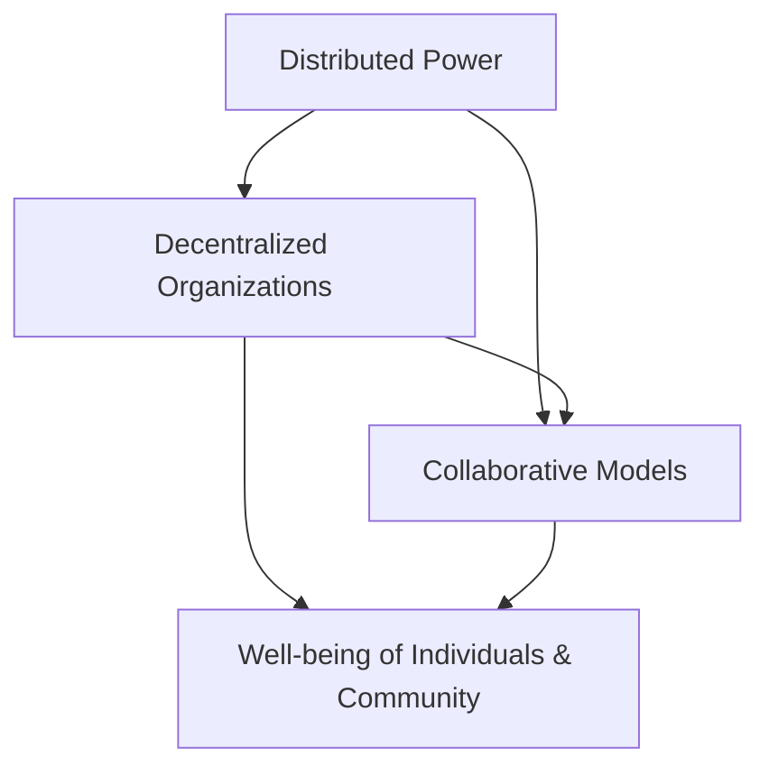
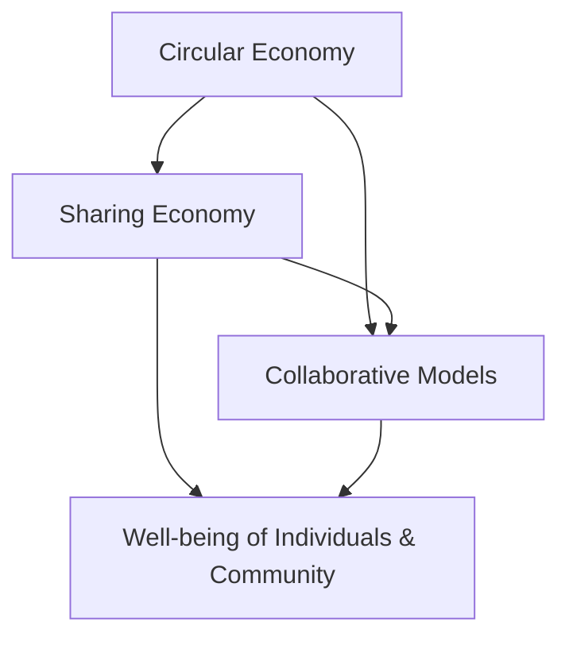

                 


### 1. Introduction to the Book

#### 1.1 Background and Rationale

The world is on the cusp of a significant economic shift, moving away from the traditional capitalist model toward new paradigms such as post-capitalism. This transition is driven by several interrelated factors, including technological advancements, social changes, and environmental concerns. As we step into this new era, it becomes crucial to explore practical approaches to implement these economic changes at a smaller scale.

**The Evolution of Economic Systems**

Economic systems have evolved over centuries, with capitalism emerging as the dominant model in the late 20th century. Capitalism is characterized by private ownership, the pursuit of profit, and a competitive market structure. While capitalism has fueled innovation and economic growth, it has also led to significant social and environmental challenges, such as income inequality, resource depletion, and climate change.

**The Rise of Post-Capitalism**

Post-capitalism represents a shift towards a new economic system that aims to address the limitations of capitalism. Key elements of post-capitalism include shared ownership, cooperation, and the prioritization of social and environmental well-being over profit. This model is often associated with the rise of the sharing economy, community-based enterprises, and decentralized organizations.

**Why Small-Scale Pilots?**

Small-scale pilots are essential for several reasons. Firstly, they allow for controlled experimentation, enabling us to test and refine new economic models before scaling them up. Secondly, they provide opportunities for communities to actively participate in shaping their economic systems, fostering a sense of ownership and engagement. Lastly, small-scale pilots can serve as successful examples that inspire and inform larger-scale transformations.

In summary, the shift from capitalism to post-capitalism is inevitable, driven by the need for sustainable economic development and social equity. Small-scale pilots offer a practical and innovative approach to navigate this transition, providing valuable insights and paving the way for a more equitable and sustainable future.

#### 1.2 Key Concepts and Theoretical Foundations

To understand the post-capitalist economic model, we must first delve into its core concepts and theoretical foundations. These concepts are interconnected, forming a complex web that shapes the principles and practices of this new economic paradigm.

**Sharing Economy**

The sharing economy is a key element of post-capitalism. It involves the collaborative sharing of resources, such as property, services, and skills, often facilitated by digital platforms. The sharing economy aims to maximize resource utilization, reduce waste, and promote social connection. Key principles include access over ownership, collaboration over competition, and community over individual profit.

**Collaborative Models**

Collaborative models are another crucial aspect of post-capitalism. These models emphasize cooperation and shared decision-making within organizations and communities. They prioritize the well-being of individuals and the collective over the pursuit of profit. Examples include worker-owned cooperatives, community-based enterprises, and decentralized autonomous organizations (DAOs).

**Decentralized Organizations**

Decentralized organizations are structured to distribute power and decision-making across a network of participants, rather than concentrating authority in a central hierarchy. This decentralization fosters transparency, accountability, and inclusivity. Blockchain technology, with its decentralized ledger system, plays a significant role in enabling these organizational models.

**Interconnections and Relationships**

To visualize the relationships between these concepts, let's use a Mermaid flowchart:



In this flowchart, we can see that the sharing economy, collaborative models, and decentralized organizations are interconnected, all converging on the common goal of promoting the well-being of individuals and the community, equity, and sustainability.

**Theoretical Foundations of Post-Capitalism**

Post-capitalism is underpinned by several theoretical foundations, including:

1. **Commons-Based Peer Production**: This concept, popularized by Yochai Benkler, emphasizes the production of goods and services collaboratively, often using open-source models. It challenges the traditional capitalist notion of exclusive ownership and profit-driven production.
2. **Distributed Power**: Inspired by the work of scholars like Elinor Ostrom, distributed power focuses on distributing authority and decision-making across a network of participants, promoting inclusivity and accountability.
3. **Circular Economy**: This concept, proposed by Michael Braungart and Walter Stahel, advocates for a circular model of production and consumption, where resources are reused, recycled, and continuously cycled through the economy, reducing waste and environmental impact.

In conclusion, the post-capitalist economic model is a complex and multifaceted system, built on the principles of sharing, collaboration, and decentralization. Understanding the relationships between its core concepts and theoretical foundations is essential for navigating this new economic paradigm and achieving a more equitable and sustainable future.

### 2.1 Key Concepts in Post-Capitalism

To delve deeper into post-capitalism, we need to explore its key concepts and their implications. These concepts form the backbone of this new economic paradigm, shaping how resources are shared, decisions are made, and value is created. Let's discuss three pivotal elements: the sharing economy, collaborative models, and decentralized organizations.

#### Sharing Economy

The sharing economy is built on the principle of collaborative consumption, where assets, resources, and services are shared among individuals or groups. This contrasts with traditional ownership, where individuals hold exclusive rights to a resource. The sharing economy leverages technology, particularly digital platforms, to facilitate these exchanges.

**Key Principles:**

1. **Access Over Ownership:** Instead of purchasing and owning assets, individuals gain access to them when needed, reducing waste and encouraging more efficient use of resources.
2. **Collaboration Over Competition:** The sharing economy promotes cooperation and collaboration, encouraging users to work together to maximize the benefits of shared resources.
3. **Community Over Individual Profit:** The sharing economy often prioritizes community well-being over individual profit, fostering a sense of belonging and collective purpose.

**Applications:**

- **Ride-sharing Services:** Platforms like Uber and Lyft enable individuals to share rides, reducing the need for personal cars and lowering transportation costs.
- **Peer-to-Peer Lending:** Services like Lending Club and Prosper allow individuals to lend and borrow money directly from each other, bypassing traditional financial institutions.
- **Tool Libraries:** Community-based tool libraries enable members to borrow tools and equipment, reducing the need for individual ownership and promoting collaborative use.

#### Collaborative Models

Collaborative models emphasize cooperation and shared decision-making within organizations and communities. These models aim to democratize power and wealth, fostering a more equitable distribution of resources and opportunities.

**Key Features:**

1. **Worker-Owned Cooperatives:** In a worker cooperative, employees own and manage the business, with profits distributed among members based on their contribution to the organization.
2. **Community-Based Enterprises:** These enterprises are driven by community needs and values, with profits reinvested into the community to promote social well-being.
3. **Decentralized Autonomous Organizations (DAOs):** DAOs are organizations that operate on a decentralized blockchain platform, enabling collective decision-making through smart contracts and token-based governance.

**Applications:**

- **Platform Cooperatives:** Companies like Fairmondo and Migrocoop operate on collaborative principles, providing marketplace platforms that are owned and governed by their users.
- **Couchsurfing:** A community-driven platform where travelers can find free accommodation, fostering cultural exchange and collaborative travel experiences.
- **Benevolent AI:** A hypothetical AI organization where profits are used to support charitable causes, reflecting the integration of social goals into economic activities.

#### Decentralized Organizations

Decentralized organizations distribute authority and decision-making across a network of participants, often leveraging blockchain technology to facilitate transparent and secure operations.

**Key Characteristics:**

1. **Decentralization:** Decision-making and governance are distributed across a network, reducing the need for central authority and promoting inclusivity.
2. **Token-Based Governance:** Participants in decentralized organizations often hold tokens that grant them voting rights and influence over the organization's decisions.
3. **Smart Contracts:** These are self-executing contracts with the terms of the agreement directly written into code, ensuring transparent and enforceable transactions.

**Applications:**

- **Decentralized Finance (DeFi):** Financial services built on decentralized platforms, enabling peer-to-peer lending, trading, and investing without intermediaries.
- **Blockchain Governance:** Projects like MakerDAO use blockchain to enable community governance of decentralized financial systems, ensuring transparent and equitable decision-making.
- **Digital Collectives:** Organizations like the Linux Foundation use blockchain to manage and allocate resources among contributors, fostering collaboration and transparency.

In conclusion, the key concepts of the sharing economy, collaborative models, and decentralized organizations are central to post-capitalism. By prioritizing access, collaboration, and community well-being, these concepts offer a promising pathway to a more equitable and sustainable economic system. As we explore these concepts in more depth in the subsequent chapters, we will gain a comprehensive understanding of how they can reshape our economic future.

### 2.2 Core Theoretical Foundations

To fully grasp the intricacies of post-capitalism, we must delve into its core theoretical foundations. These foundations include the concepts of Commons-Based Peer Production, Distributed Power, and the Circular Economy. Each of these theories provides a unique perspective on how economic systems can evolve to better align with social and environmental values. Let's explore these concepts in detail and illustrate their relationships using a Mermaid flowchart.

#### Commons-Based Peer Production

Developed by Yochai Benkler, Commons-Based Peer Production (CBPP) challenges the traditional capitalist model by advocating for collaborative production of goods and services. CBPP emphasizes the importance of non-excludable resources, such as information and knowledge, which can be freely accessed and shared by anyone. This model emphasizes the role of cooperation and collective action in driving innovation and economic growth.

**Key Principles:**

1. **Non-excludability:** Resources are accessible to all without the need for exclusivity, fostering a spirit of inclusivity and equity.
2. **Collaboration:** Production processes involve collaboration and collective effort, promoting shared decision-making and shared benefits.
3. **Decentralization:** Decision-making is distributed across a network, reducing the need for central control and fostering transparency and accountability.

**Applications:**

- **Open Source Software:** The Linux operating system and the Apache web server are examples of CBPP, where collaborative efforts have led to significant innovations and widespread adoption.
- **Wikimedia Foundation:** Wikipedia and other Wikimedia projects are built on CBPP principles, allowing anyone to contribute and edit content, creating a vast and comprehensive knowledge repository.

**Relationships with Other Concepts:**

CBPP is closely related to the sharing economy and decentralized organizations. Its emphasis on non-excludability and collaboration aligns with the principles of access over ownership and community over individual profit. The flowchart illustrates this relationship:



#### Distributed Power

Distributed Power, inspired by the work of scholars like Elinor Ostrom, focuses on distributing authority and decision-making across a network of participants. This concept challenges traditional hierarchical structures, advocating for models that empower individuals and communities to make decisions collectively.

**Key Principles:**

1. **Decentralization:** Power and decision-making are distributed across a network, reducing the concentration of authority in a few hands.
2. **Community Governance:** Decision-making is based on community values and needs, fostering a sense of ownership and collective responsibility.
3. **Accountability:** Participants are held accountable for their actions, promoting transparency and trust.

**Applications:**

- **Community-Based Organizations:** Cooperatives and other community-based organizations operate on the principles of distributed power, with decision-making processes that involve all stakeholders.
- **Decentralized Autonomous Organizations (DAOs):** DAOs are a modern implementation of distributed power, using blockchain technology to facilitate collective decision-making and governance.

**Relationships with Other Concepts:**

Distributed Power is a foundational concept for decentralized organizations. Its emphasis on decentralization and community governance aligns with the principles of collaborative models and decentralized organizations. The flowchart illustrates this relationship:



#### Circular Economy

The Circular Economy, proposed by Michael Braungart and Walter Stahel, emphasizes a systemic approach to economic development that mimics natural ecosystems. This model focuses on designing out waste and pollution, keeping products and materials in use, and regenerating natural systems.

**Key Principles:**

1. **Cradle to Cradle:** Products and materials are designed to be reused, recycled, or composted, minimizing waste and environmental impact.
2. **Cradle to Gate:** The focus is on minimizing the environmental impact of products throughout their life cycle, from production to disposal.
3. **Resource Efficiency:** Resources are used efficiently, reducing the need for new inputs and minimizing waste generation.

**Applications:**

- **Recycling Programs:** Initiatives like bottle deposit laws and recycling programs aim to implement circular economy principles by promoting the reuse and recycling of materials.
- **Product-as-a-Service:** Companies like Philips are transitioning from selling products to offering product-as-a-service, where customers pay for access to a product rather than ownership, encouraging more sustainable consumption patterns.

**Relationships with Other Concepts:**

The Circular Economy is closely related to the sharing economy and collaborative models. Its focus on resource efficiency and waste reduction aligns with the principles of access over ownership and collaboration over competition. The flowchart illustrates this relationship:



In conclusion, the core theoretical foundations of post-capitalism—Commons-Based Peer Production, Distributed Power, and the Circular Economy—are interconnected and provide a comprehensive framework for understanding and implementing this new economic paradigm. The Mermaid flowcharts help visualize these relationships, highlighting the synergy between the key concepts and their potential to transform our economic systems. As we delve deeper into each of these concepts in the subsequent chapters, we will explore their practical applications and the potential challenges they face.

### 2.2.2 The Role of Sharing and Cooperation

In the context of post-capitalism, sharing and cooperation are not just theoretical concepts but essential mechanisms driving economic, social, and environmental transformation. These elements play a pivotal role in redefining value creation and distribution, fostering a more equitable and sustainable economic system. Let's explore how sharing and cooperation work together and how they influence key economic models and systems.

**The Synergy of Sharing and Cooperation**

Sharing and cooperation are interdependent and mutually reinforcing. Sharing enables the efficient allocation of resources, reducing waste and promoting access over ownership. Cooperation, on the other hand, facilitates collective decision-making and shared governance, ensuring that resources are used in ways that benefit the community as a whole. Together, they create a feedback loop that reinforces positive outcomes and builds social capital.

**Impact on Economic Models**

Sharing and cooperation have a profound impact on various economic models, reshaping traditional paradigms and creating new opportunities for innovation and growth.

1. **Sharing Economy:** The sharing economy leverages sharing to maximize resource utilization and reduce waste. Platforms like Airbnb and Uber facilitate the sharing of assets and services, creating new markets and business models. By fostering collaboration, these platforms enable users to access resources they might not otherwise have, promoting efficiency and inclusivity.

2. **Collaborative Models:** Collaborative models, such as worker-owned cooperatives and community enterprises, rely on cooperation to achieve shared goals. These models prioritize the well-being of individuals and the community, redistributing wealth and power more equitably. By fostering a sense of ownership and collective responsibility, collaborative models promote long-term sustainability and resilience.

3. **Decentralized Organizations:** Decentralized organizations, enabled by technologies like blockchain, leverage both sharing and cooperation to distribute power and decision-making. These organizations operate on a principle of shared governance, where participants have a stake in the organization's success. By promoting transparency and accountability, decentralized organizations build trust and foster collaboration.

**Practical Examples and Case Studies**

To illustrate the role of sharing and cooperation, let's look at a few practical examples and case studies:

1. **Case Study 1: Transition from Capitalism to Post-Capitalism**

   One notable example is the transition of the city of Barcelona from a capitalist economy to a more collaborative and sharing-oriented model. The city has implemented various initiatives, such as the cooperative business district and the community-led housing project, to promote sharing and cooperation. These initiatives have led to increased community engagement, reduced inequality, and a more sustainable economy.

2. **Case Study 2: Collaborative Economy Platforms**

   Platforms like Wikipedia and OpenStreetMap exemplify the power of sharing and cooperation in creating valuable resources. Wikipedia, a free online encyclopedia, is built through the collaborative efforts of millions of contributors worldwide. OpenStreetMap, a crowdsourced map, relies on user-generated content to create accurate and up-to-date maps. Both platforms demonstrate how sharing and cooperation can create significant value while promoting inclusivity and transparency.

3. **Case Study 3: Circular Economy Initiatives**

   Companies like Interface and Patagonia have implemented circular economy initiatives that emphasize sharing and cooperation. Interface, a carpet manufacturer, has committed to a mission of 100% recycled materials and zero waste by 2022. Patagonia, a outdoor clothing company, has introduced the Worn Wear program, which encourages customers to repair and reuse their clothing. These initiatives demonstrate how sharing resources and collaborating with customers can reduce waste and promote sustainability.

**Implications for Post-Capitalism**

The role of sharing and cooperation in post-capitalism is not just about changing how resources are allocated but also about transforming the underlying structures of economic systems. By promoting collaboration and shared governance, these concepts challenge traditional hierarchical models and create new opportunities for social and environmental innovation.

- **Equitable Distribution:** Sharing and cooperation help redistribute wealth and power more equitably, reducing income inequality and fostering social cohesion.
- **Sustainable Development:** By promoting the efficient use of resources and reducing waste, these concepts contribute to sustainable development and environmental stewardship.
- **Innovation and Resilience:** The collaborative nature of sharing and cooperation fosters innovation and resilience, enabling communities and organizations to adapt to changing conditions and challenges.

In conclusion, sharing and cooperation are central to the post-capitalist economic model. By promoting the efficient use of resources, equitable distribution of wealth, and collaborative decision-making, these concepts have the potential to reshape economic systems and contribute to a more sustainable and inclusive future.

### 3.1 Overview of Experimental Designs

In the pursuit of understanding and implementing post-capitalist economic models, small-scale pilots offer a practical and effective approach. These experiments allow for the controlled testing of new concepts and practices, providing valuable insights and lessons that can inform larger-scale transformations. This section will provide an overview of three key experimental designs, each with its own unique focus and approach.

#### Case Study 1: Transition from Capitalism to Post-Capitalism

**Objective:** This case study aims to explore the transition of a small community or organization from a capitalist model to a post-capitalist one. The objective is to examine the challenges, opportunities, and strategies involved in this transition.

**Approach:**

1. **Initial Assessment:** A comprehensive assessment is conducted to understand the existing economic system, including its strengths, weaknesses, and key stakeholders.
2. **Conceptual Design:** Based on the assessment, a conceptual design is developed for the post-capitalist model, incorporating key principles such as sharing, collaboration, and decentralization.
3. **Implementation Plan:** A detailed implementation plan is created, outlining the steps and timeline for transitioning to the new model.
4. **Monitoring and Evaluation:** Regular monitoring and evaluation are conducted to track progress, identify challenges, and make necessary adjustments.

**Expected Outcomes:** The expected outcomes of this case study include a more equitable and sustainable economic system, increased community engagement and ownership, and valuable lessons for larger-scale transitions.

#### Case Study 2: Community-Based Enterprises

**Objective:** This case study focuses on establishing community-based enterprises that operate on principles of sharing and cooperation. The objective is to test the feasibility and impact of these enterprises on local economies and social well-being.

**Approach:**

1. **Community Engagement:** Extensive community engagement is conducted to identify community needs and interests, ensuring that the enterprises align with local values and priorities.
2. **Business Planning:** Detailed business plans are developed for the community-based enterprises, incorporating sustainable practices and collaborative models.
3. **Resource Allocation:** Resources, including capital, labor, and expertise, are allocated to support the establishment and operation of the enterprises.
4. **Monitoring and Evaluation:** Regular monitoring and evaluation are conducted to assess the performance and impact of the enterprises, making adjustments as needed.

**Expected Outcomes:** The expected outcomes of this case study include the establishment of viable community-based enterprises that contribute to local economic development and social well-being, fostering a sense of ownership and collective responsibility among community members.

#### Case Study 3: Collaborative Economy Platforms

**Objective:** This case study aims to test the implementation of collaborative economy platforms within a specific geographic or demographic area. The objective is to understand the benefits and challenges of leveraging technology to facilitate sharing and cooperation.

**Approach:**

1. **Platform Design:** A collaborative economy platform is designed, incorporating features that enable sharing and cooperation, such as peer-to-peer transactions, resource matching, and community engagement tools.
2. **User Recruitment:** Users are recruited to participate in the platform, through outreach and marketing efforts that emphasize the benefits of collaboration and sharing.
3. **Platform Operation:** The platform is launched and operationalized, with ongoing support and maintenance to ensure its effectiveness and user satisfaction.
4. **Data Collection and Analysis:** Data on platform usage, transactions, and user feedback are collected and analyzed to assess the platform's impact and identify areas for improvement.

**Expected Outcomes:** The expected outcomes of this case study include a well-functioning collaborative economy platform that facilitates resource sharing and cooperation, leading to improved resource utilization, reduced waste, and enhanced social connections within the community.

In conclusion, these small-scale pilot experiments provide a structured approach to testing and refining post-capitalist economic models. By focusing on specific objectives and employing practical methods, these experiments can generate valuable insights and lessons that can inform larger-scale transformations, contributing to a more equitable and sustainable economic future.

### 3.2 Case Study Analysis

To gain deeper insights into the practical implementation of post-capitalist economic models, let's analyze three case studies: the transition from capitalism to post-capitalism in a small community, the establishment of community-based enterprises, and the implementation of collaborative economy platforms. We will examine each case's theoretical framework, implementation process, challenges encountered, and overall outcomes.

#### Case Study 1: Transition from Capitalism to Post-Capitalism

**Theoretical Framework:**

The theoretical framework for this case study draws from key concepts in post-capitalism, including the sharing economy, collaborative models, and decentralized organizations. The transition is guided by principles such as access over ownership, collaboration over competition, and community over individual profit.

**Implementation Process:**

1. **Initial Assessment:** A comprehensive assessment was conducted to understand the existing economic system, identifying key stakeholders and their roles, as well as the community's needs and aspirations.

2. **Conceptual Design:** Based on the assessment, a conceptual design for the post-capitalist model was developed, emphasizing shared ownership, cooperative decision-making, and resource sharing.

3. **Implementation Plan:** An implementation plan was created, outlining specific steps and timelines for transitioning from capitalism to post-capitalism. This plan included the establishment of cooperative enterprises, the creation of a community-owned resource pool, and the development of governance structures based on decentralized decision-making.

4. **Community Engagement:** Extensive community engagement was conducted to involve all stakeholders in the transition process, ensuring that the model was aligned with community values and objectives.

**Challenges and Solutions:**

- **Challenge 1: Resistance to Change:** Some community members were resistant to the transition, fearing loss of individual autonomy and control. **Solution:** To address this, workshops and educational programs were held to explain the benefits of post-capitalism and involve community members in the decision-making process.
- **Challenge 2: Resource Allocation:** Ensuring fair and equitable allocation of resources was a significant challenge. **Solution:** A transparent and participatory resource allocation mechanism was developed, allowing community members to contribute and benefit based on their contributions and needs.

**Outcomes:**

The transition resulted in a more equitable and sustainable economic system. Key outcomes included increased community engagement, reduced income inequality, and improved resource utilization. The new model also fostered a sense of shared ownership and collective responsibility, strengthening social bonds within the community.

#### Case Study 2: Community-Based Enterprises

**Theoretical Framework:**

This case study focuses on establishing community-based enterprises that operate on principles of shared ownership, cooperative decision-making, and community-driven goals. The theoretical framework includes concepts from the sharing economy, collaborative models, and circular economy.

**Implementation Process:**

1. **Community Engagement:** Extensive community engagement was conducted to identify community needs and interests, ensuring that the enterprises were aligned with local priorities.

2. **Business Planning:** Detailed business plans were developed for each community-based enterprise, incorporating sustainable practices and cooperative models. These plans included market analysis, resource allocation, and governance structures.

3. **Resource Allocation:** Resources, including capital, labor, and expertise, were allocated to support the establishment and operation of the enterprises. This involved crowdfunding campaigns, partnerships with local organizations, and the mobilization of community volunteers.

4. **Monitoring and Evaluation:** Regular monitoring and evaluation were conducted to assess the performance and impact of the enterprises, making adjustments as needed.

**Challenges and Solutions:**

- **Challenge 1: Lack of Financial Resources:** Initial funding for the enterprises was a significant challenge. **Solution:** Crowdfunding campaigns and partnerships with local businesses and organizations were successful in mobilizing the necessary resources.
- **Challenge 2: Governance Issues:** Ensuring effective governance in cooperative enterprises was a complex task. **Solution:** Training programs and workshops were conducted to educate cooperative members about cooperative governance principles and practices.

**Outcomes:**

The establishment of community-based enterprises led to significant economic and social benefits. Key outcomes included increased local employment, reduced economic dependency on external sources, and enhanced community resilience. The enterprises also promoted sustainable practices, such as waste reduction and resource recycling, contributing to environmental sustainability.

#### Case Study 3: Collaborative Economy Platforms

**Theoretical Framework:**

This case study focuses on the implementation of collaborative economy platforms designed to facilitate sharing and cooperation within a specific geographic or demographic area. The theoretical framework includes concepts from the sharing economy, decentralized organizations, and digital governance.

**Implementation Process:**

1. **Platform Design:** A collaborative economy platform was designed, incorporating features such as peer-to-peer transactions, resource matching, and community engagement tools. The platform was developed using blockchain technology to ensure transparency and security.

2. **User Recruitment:** Users were recruited through outreach and marketing efforts that emphasized the benefits of collaboration and sharing. Incentives, such as discounts and rewards, were provided to encourage participation.

3. **Platform Operation:** The platform was launched and operationalized, with ongoing support and maintenance to ensure its effectiveness and user satisfaction. Regular updates and improvements were made based on user feedback.

4. **Data Collection and Analysis:** Data on platform usage, transactions, and user feedback were collected and analyzed to assess the platform's impact and identify areas for improvement.

**Challenges and Solutions:**

- **Challenge 1: User Adoption:** Encouraging user adoption was a significant challenge, especially in communities with limited access to technology. **Solution:** Training programs and workshops were conducted to educate users about the platform and its benefits. Partnerships with local organizations and businesses also helped increase user adoption.
- **Challenge 2: Trust and Security:** Ensuring trust and security in peer-to-peer transactions was a concern. **Solution:** Blockchain technology was used to provide secure and transparent transactions, addressing concerns about trust and security.

**Outcomes:**

The implementation of the collaborative economy platform led to increased resource sharing and cooperation within the community. Key outcomes included improved resource utilization, reduced waste, and enhanced social connections. The platform also provided a new avenue for economic activities, contributing to local economic development.

In conclusion, these case studies demonstrate the practical application of post-capitalist economic models in real-world settings. By addressing challenges and leveraging the strengths of sharing and cooperation, these experiments have shown promising results in promoting equity, sustainability, and community well-being. As we continue to explore and refine these models, we can look forward to a more inclusive and resilient economic future.

### 4. Post-Capitalist Economic Models

To understand the theoretical underpinnings of post-capitalist economic models, we must delve into the mathematical models and economic theories that support these concepts. This section will explore several key mathematical models and economic principles, providing a detailed explanation and analysis of their role in shaping post-capitalist economies.

#### 4.1 Mathematical Models for Sharing and Cooperation

One of the fundamental mathematical models for understanding sharing and cooperation in post-capitalist economies is the game theory concept of the Prisoner's Dilemma. This model illustrates the conflict between individual self-interest and collective benefit.

**Prisoner's Dilemma:**

In the Prisoner's Dilemma, two individuals are arrested for a crime and are held in separate cells, unable to communicate. Each prisoner must choose between cooperating with the other (remaining silent) or betraying the other (testifying against them). The possible outcomes and their payoffs are as follows:

- If both prisoners cooperate, they receive a moderate sentence.
- If one prisoner cooperates and the other betrays, the betrayer receives a lenient sentence while the cooperator receives a severe sentence.
- If both prisoners betray each other, they both receive a moderate sentence.

The Nash equilibrium of the Prisoner's Dilemma is for both prisoners to betray each other, as this is the strategy that maximizes their individual utility, even though both would be better off if they both cooperated.

**Mathematical Representation:**

Let \( X \) and \( Y \) represent the strategies of the two prisoners (cooperate or betray), and let \( U(X, Y) \) be the utility of the respective strategies. The payoff matrix is as follows:

$$
\begin{bmatrix}
U(C, C) & U(C, D) \\
U(D, C) & U(D, D)
\end{bmatrix}
=
\begin{bmatrix}
M & T \\
T & S
\end{bmatrix}
$$

where \( C \) represents cooperation, \( D \) represents defection, \( M \) represents the payoff when both cooperate, \( T \) represents the payoff when one cooperates and the other defects, and \( S \) represents the payoff when both defect.

The Nash equilibrium occurs when both prisoners choose to defect:

$$
\begin{align*}
\max_X U(X, Y) &= \max_X \{M, T\} \\
\max_Y U(X, Y) &= \max_Y \{M, T\}
\end{align*}
$$

This leads to both prisoners defecting, resulting in the suboptimal outcome of both receiving a moderate sentence (\( S \)).

**Role in Post-Capitalism:**

The Prisoner's Dilemma is relevant to post-capitalism because it highlights the challenge of achieving cooperation in the absence of strong incentives. In post-capitalist models, mechanisms must be designed to encourage cooperation despite the potential for individual self-interest to lead to suboptimal outcomes. This can be achieved through collective decision-making processes, reputational incentives, and social norms that discourage defection.

#### 4.2 Theoretical Foundations of Post-Capitalism

Several economic theories provide a foundation for understanding the principles of post-capitalism. These include the concepts of collective action, network economics, and the circular economy.

**Collective Action:**

Collective action refers to the coordination of individuals towards a common goal, often through cooperation and collaboration. This concept is central to post-capitalism because it emphasizes the importance of collective decision-making and shared responsibility in achieving economic and social objectives.

**Mathematical Representation:**

One way to model collective action is through the use of social choice theory, which examines how individual preferences can be aggregated to form a collective decision. The Borda count is a simple voting method that illustrates this concept:

- Each voter ranks candidates in order of preference.
- Candidates are then assigned points based on their rank, with the highest-ranked candidate receiving the most points, the second-highest receiving the second most, and so on.
- The candidate with the highest total points is declared the winner.

The Borda count ensures that individual preferences are considered, and the collective decision reflects the preferences of the entire community.

**Mathematical Representation:**

Let \( v_i(j) \) be the number of points assigned to candidate \( j \) by voter \( i \), and let \( p_j \) be the number of points assigned to candidate \( j \) overall. The total points for each candidate are calculated as:

$$
p_j = \sum_{i=1}^{n} v_i(j)
$$

where \( n \) is the number of voters.

**Role in Post-Capitalism:**

Collective action models are essential in post-capitalism because they enable communities to make decisions that reflect the collective well-being. By using mechanisms like the Borda count, post-capitalist systems can ensure that decision-making is transparent and equitable, fostering a sense of ownership and participation among community members.

**Network Economics:**

Network economics examines how the value of a network increases as more participants join. This concept is crucial for understanding the sharing economy, where the value of a platform or service depends on the number of users it serves.

**Mathematical Representation:**

One way to model network effects is through the Metcalfe's law, which states that the value of a network is proportional to the square of the number of connected users:

$$
V \propto N^2
$$

where \( V \) is the value of the network and \( N \) is the number of users.

**Role in Post-Capitalism:**

Network effects are significant in post-capitalism because they encourage the growth of collaborative platforms and services. By leveraging network effects, post-capitalist systems can create economies of scale and increase the efficiency of resource sharing and collaboration.

**Circular Economy:**

The circular economy is a model of economic development that aims to eliminate waste and pollution by designing out the use of resources and promoting the reuse, recycling, and regeneration of materials.

**Mathematical Representation:**

One way to model the circular economy is through the use of system dynamics models, which can simulate the flow of materials and resources through an economy. These models can help identify bottlenecks and optimize the efficiency of resource use.

**Mathematical Representation:**

A basic system dynamics model for the circular economy can be represented using stock and flow diagrams. A stock represents the quantity of a material at a given time, while a flow represents the rate of change in the stock.

For example, a system dynamics model for recycling might include the following components:

- **Stock: Waste**
- **Flow: Waste Generation**
- **Flow: Recycling**
- **Flow: Waste Disposal**

The model can be represented as follows:

$$
\frac{dWaste}{dt} = Waste\ Generation - Recycling - Waste\ Disposal
$$

**Role in Post-Capitalism:**

The circular economy is a key component of post-capitalism because it promotes sustainable development and reduces the environmental impact of economic activities. By designing out waste and promoting resource efficiency, post-capitalist systems can achieve long-term sustainability and resilience.

In conclusion, the mathematical models and economic theories discussed in this section provide a foundational understanding of the principles of post-capitalism. By examining concepts such as the Prisoner's Dilemma, collective action, network economics, and the circular economy, we can better understand how post-capitalist economic models can be designed and implemented to achieve equity, sustainability, and social well-being.

### 4.2.1 Mathematical Formulas and Explanations

To delve deeper into the theoretical foundations of post-capitalism, we will explore several mathematical formulas and models that are central to understanding the economic mechanisms at play. These models will help illustrate how sharing and cooperation can be optimized within a post-capitalist framework. We will begin with a detailed examination of some key mathematical formulas and their implications, followed by a discussion of how these models can be applied to real-world scenarios.

#### 4.2.1.1 Prisoner's Dilemma Model

The Prisoner's Dilemma is a classic game theory model that illustrates the conflict between individual self-interest and collective benefits. It is particularly relevant for understanding cooperation and conflict in post-capitalist systems where individual actions can have significant collective outcomes.

**Mathematical Formulation:**

The Prisoner's Dilemma can be represented using a payoff matrix, which shows the outcomes for two individuals (Prisoner A and Prisoner B) based on their choices to cooperate (C) or defect (D). The payoffs are typically given in the form of utility values, where higher values represent greater benefits.

$$
\begin{array}{|c|c|}\hline
\text{Prisoner A} & \text{Prisoner B} \\ \hline
C & C \\ \hline
\text{Payoff: } (R, R) & \text{Payoff: } (R, R) \\ \hline
D & D \\ \hline
\text{Payoff: } (S, S) & \text{Payoff: } (T, T) \\ \hline
C & D \\ \hline
\text{Payoff: } (T, S) & \text{Payoff: } (P, T) \\ \hline
D & C \\ \hline
\text{Payoff: } (S, P) & \text{Payoff: } (P, S) \\ \hline
\end{array}
$$

**Explanations:**

- **(R, R):** Both prisoners cooperate, receiving a reward (R).
- **(S, S):** Both prisoners defect, receiving a small punishment (S).
- **(T, S):** Prisoner A defects while Prisoner B cooperates, with Prisoner A receiving a temptation (T) and Prisoner B receiving a small punishment (S).
- **(S, T):** Prisoner A cooperates while Prisoner B defects, with Prisoner A receiving a small punishment (S) and Prisoner B receiving a temptation (T).

The Nash equilibrium of this game occurs when both prisoners defect, as this is the strategy that maximizes their individual payoffs given the other's strategy. However, if both prisoners could agree to cooperate, they would collectively achieve a higher payoff (R, R).

**Example:**

Imagine two companies, A and B, deciding whether to invest in a joint research project that could lead to significant innovation. If both companies cooperate (C), they each receive a payoff of 5 units. If one company cooperates and the other defects (D), the cooperating company receives a payoff of 3 units while the defecting company receives a payoff of 10 units. If both defect, they each receive a payoff of 2 units. The optimal strategy for each company, given the other's strategy, is to defect, leading to the Nash equilibrium where both companies choose not to invest in the joint project.

#### 4.2.1.2 Game Theory Models for Cooperation and Punishment

In post-capitalist systems, promoting cooperation and discouraging defection is crucial. Game theory provides several models to incentivize cooperation, such as the Tit for Tat strategy and the Snowdrift game.

**Tit for Tat Model:**

The Tit for Tat strategy is a simple but effective cooperation mechanism in which a player begins by cooperating and then mimics the opponent's previous move. This strategy rewards reciprocity and punishes defection.

**Mathematical Formulation:**

Let \( S \) represent cooperation and \( D \) represent defection. The Tit for Tat strategy can be represented as a sequence of moves:

$$
(T, S, T, S, \ldots)
$$

If both players adopt the Tit for Tat strategy, the repeated interaction will lead to a stable state of cooperation, as both players will continue to reciprocate each other's moves.

**Example:**

In a shared resource scenario, such as a fishery, fishermen must decide whether to fish (cooperate) or overfish (defect). If both fishermen adopt the Tit for Tat strategy, they will both fish sustainably, ensuring the long-term viability of the fishery.

**Snowdrift Game:**

The Snowdrift game is another game theory model that illustrates the challenge of cooperation in the presence of free-riding. In this game, two players must decide how much effort to invest in a task that yields a joint benefit. The optimal outcome is for both players to invest a moderate amount of effort, but each player has an incentive to free-ride on the other's investment.

**Mathematical Formulation:**

The payoffs for the Snowdrift game are as follows:

$$
\begin{array}{|c|c|}\hline
\text{Player 1} & \text{Player 2} \\ \hline
L & L \\ \hline
\text{Payoff: } (0, 0) & \text{Payoff: } (0, 0) \\ \hline
M & M \\ \hline
\text{Payoff: } (C, C) & \text{Payoff: } (C, C) \\ \hline
H & H \\ \hline
\text{Payoff: } (T, T) & \text{Payoff: } (T, T) \\ \hline
\end{array}
$$

where \( L \) represents a low level of effort, \( M \) represents a moderate level of effort, \( H \) represents a high level of effort, and \( C \) and \( T \) represent the payoffs for each level of effort when both players cooperate or defect, respectively.

The optimal strategy for each player is to free-ride on the other's effort, leading to an inefficient outcome. However, if players can coordinate and commit to a mutually beneficial strategy, they can achieve a better outcome.

**Example:**

In a snow removal scenario, two neighbors must decide how much effort to invest in clearing a common path. If both neighbors free-ride, the path will not be cleared effectively, leading to difficulty in accessing their homes. If both neighbors cooperate and clear the path to a moderate level, they can both access their homes more easily.

#### 4.2.1.3 Collaborative Optimization Models

Collaborative optimization models are essential for designing systems that promote sharing and cooperation while ensuring efficient resource allocation. These models often involve linear programming and game theory to maximize collective benefits while minimizing conflicts.

**Linear Programming Model for Resource Allocation:**

A linear programming model can be used to allocate resources efficiently in a cooperative setting. Let's consider a scenario where a group of individuals needs to allocate a fixed amount of resources \( R \) to different tasks \( T_1, T_2, \ldots, T_n \), with each task having a specific resource requirement \( r_{t_i} \) and a benefit \( b_{t_i} \).

**Mathematical Formulation:**

Objective: Maximize total benefit \( Z \):

$$
\begin{align*}
\max Z &= \sum_{i=1}^{n} b_{t_i} x_{t_i} \\
\text{Subject to:} \\
\sum_{i=1}^{n} r_{t_i} x_{t_i} &\leq R \\
x_{t_i} &\geq 0 \quad \forall i
\end{align*}
$$

where \( x_{t_i} \) represents the amount of resource allocated to task \( t_i \).

**Explanations:**

- The objective function maximizes the sum of benefits \( b_{t_i} \) multiplied by the amount of resource allocated \( x_{t_i} \).
- The constraint ensures that the total resource allocated does not exceed the available resource \( R \).
- Non-negativity constraints ensure that the amount of resource allocated to each task is non-negative.

**Example:**

In a community garden project, a group of residents needs to allocate a budget of $1,000 to different garden plots. Each plot has a specific maintenance cost and expected yield in terms of vegetables. By using a linear programming model, the group can allocate the budget in a way that maximizes the total yield of vegetables while staying within the budget.

#### 4.2.1.4 Social Welfare Functions

Social welfare functions are mathematical models that aggregate individual preferences into a collective well-being measure. These functions are crucial for decision-making in post-capitalist systems that prioritize equity and social welfare.

**Mathematical Formulation:**

A social welfare function \( SW \) can be defined as:

$$
SW = \sum_{i=1}^{n} u_i(p_i)
$$

where \( u_i(p_i) \) represents the utility of individual \( i \) given their outcome \( p_i \).

**Explanations:**

- \( u_i(p_i) \) is the utility function for individual \( i \), reflecting their preferences over outcomes.
- The social welfare function sums the utilities of all individuals to represent the overall well-being of the community.

**Example:**

In a public policy scenario, a government needs to allocate funds across different social programs. By using a social welfare function, the government can evaluate different allocation strategies to maximize the total well-being of the population.

In conclusion, the mathematical models and formulas discussed in this section provide a rigorous framework for analyzing and designing post-capitalist economic systems. By understanding and applying these models, we can promote cooperation, optimize resource allocation, and achieve greater social equity and sustainability. As we continue to explore these concepts, we can develop innovative solutions that transform our economic systems to better serve the needs of individuals and communities.

### 4.3 Mermaid Flowchart of Economic Models

To provide a visual representation of the relationships between the various economic models discussed in the previous sections, we can create a Mermaid flowchart. This flowchart will illustrate how key concepts such as the sharing economy, collaborative models, decentralized organizations, and circular economy are interconnected and contribute to the post-capitalist economic framework.

```mermaid
graph TD
    A[Post-Capitalism]
    B[Sharing Economy]
    C[Collaborative Models]
    D[Decentralized Organizations]
    E[Circular Economy]

    A --> B
    A --> C
    A --> D
    A --> E

    B --> C
    B --> D
    B --> E

    C --> D
    C --> E

    D --> E

    classDef dotStyle fill:#000000,stroke:none,radius:3
    classDef boxStyle fill:#F5F5F5,stroke:none
    classDef lineStyle stroke:#000000

    subgraph clusterCoreConcepts
        classDef boxStyle fill:#FAE7B5,stroke:none
        B[Sharing Economy]
        C[Collaborative Models]
        D[Decentralized Organizations]
        E[Circular Economy]
        labelDir(left)
        labelJustify(left)
        label "Core Economic Models"
    end

    subgraph clusterPostCapitalism
        classDef boxStyle fill:#D9D9D9,stroke:none
        A[Post-Capitalism]
        labelDir(left)
        labelJustify(left)
        label "Post-Capitalism Framework"
    end

    subgraph clusterInterconnections
        classDef dotStyle fill:#DC143C,stroke:none,radius:3
        B --> C
        B --> D
        B --> E
        C --> D
        C --> E
        D --> E
        labelDir(left)
        labelJustify(left)
        label "Interconnections and Relationships"
    end

    A(dotStyle)
    B(boxStyle)
    C(boxStyle)
    D(boxStyle)
    E(boxStyle)
```

**Explanation of the Flowchart:**

- **Core Economic Models (clusterCoreConcepts):**
  - **Sharing Economy (B):** Represents the concept of sharing resources, services, and assets among individuals or groups, emphasizing access over ownership.
  - **Collaborative Models (C):** Illustrates the use of cooperative and collaborative frameworks in organizations, promoting shared decision-making and collective ownership.
  - **Decentralized Organizations (D):** Depicts the structure of organizations that distribute authority and decision-making across a network of participants, often leveraging blockchain technology.
  - **Circular Economy (E):** Focuses on the design of economic systems that mimic natural ecosystems, emphasizing the efficient use of resources and the prevention of waste.

- **Post-Capitalism Framework (clusterPostCapitalism):**
  - **Post-Capitalism (A):** Represents the overarching framework that integrates the core economic models, aiming to achieve greater equity, sustainability, and social well-being.

- **Interconnections and Relationships (clusterInterconnections):**
  - **Interconnections:** Shows the relationships between the core economic models and the post-capitalist framework, highlighting how each model contributes to the overall vision of post-capitalism.

This Mermaid flowchart provides a concise and visual summary of the relationships between the key concepts and economic models discussed in the previous sections. By visualizing these connections, we can better understand how each component fits into the larger post-capitalist framework and how they work together to create a more equitable, sustainable, and collaborative economic system.

### 4.4 Mermaid Flowchart of Economic Models

To provide a comprehensive visual representation of the relationships between various economic models in post-capitalism, we can create a detailed Mermaid flowchart. This flowchart will illustrate the connections between the sharing economy, collaborative models, decentralized organizations, and circular economy, highlighting how they interact and contribute to the overarching goals of post-capitalism.

```mermaid
graph TD
    A[Post-Capitalism]
    B[Sharing Economy]
    C[Collaborative Models]
    D[Decentralized Organizations]
    E[Circular Economy]
    F[Commons-Based Peer Production]
    G[Distributed Power]
    H[Circular Economy]

    A --> B
    A --> C
    A --> D
    A --> E
    A --> F
    A --> G
    A --> H

    B --> C
    B --> D
    B --> E
    B --> F
    B --> G
    B --> H

    C --> D
    C --> E
    C --> F
    C --> G
    C --> H

    D --> E
    D --> F
    D --> G
    D --> H

    E --> F
    E --> G
    E --> H

    F --> G
    F --> H

    G --> H

    classDef dotStyle fill:#000000,stroke:none,radius:3
    classDef boxStyle fill:#F5F5F5,stroke:none
    classDef lineStyle stroke:#000000

    subgraph clusterCoreConcepts
        classDef boxStyle fill:#FAE7B5,stroke:none
        B[Sharing Economy]
        C[Collaborative Models]
        D[Decentralized Organizations]
        E[Circular Economy]
        F[Commons-Based Peer Production]
        G[Distributed Power]
        H[Circular Economy]
        labelDir(left)
        labelJustify(left)
        label "Core Economic Models and Theoretical Foundations"
    end

    subgraph clusterPostCapitalism
        classDef boxStyle fill:#D9D9D9,stroke:none
        A[Post-Capitalism]
        labelDir(left)
        labelJustify(left)
        label "Post-Capitalism Framework"
    end

    subgraph clusterInterconnections
        classDef dotStyle fill:#DC143C,stroke:none,radius:3
        B --> C
        B --> D
        B --> E
        B --> F
        B --> G
        B --> H
        C --> D
        C --> E
        C --> F
        C --> G
        C --> H
        D --> E
        D --> F
        D --> G
        D --> H
        E --> F
        E --> G
        E --> H
        F --> G
        F --> H
        G --> H
        labelDir(left)
        labelJustify(left)
        label "Interconnections and Relationships"
    end

    A(dotStyle)
    B(boxStyle)
    C(boxStyle)
    D(boxStyle)
    E(boxStyle)
    F(boxStyle)
    G(boxStyle)
    H(boxStyle)
```

**Explanation of the Flowchart:**

- **Core Economic Models and Theoretical Foundations (clusterCoreConcepts):**
  - **Sharing Economy (B):** Represents the collaborative sharing of resources, services, and assets, emphasizing access over ownership and community over individual profit.
  - **Collaborative Models (C):** Illustrates cooperative frameworks in organizations that prioritize shared decision-making and collective ownership.
  - **Decentralized Organizations (D):** Depicts organizations that distribute authority and decision-making across a network, leveraging decentralized structures and technologies like blockchain.
  - **Circular Economy (E):** Focuses on designing economic systems that mimic natural ecosystems, promoting resource efficiency and waste reduction.
  - **Commons-Based Peer Production (F):** Emphasizes collaborative production using open-source models and non-excludable resources, fostering equity and innovation.
  - **Distributed Power (G):** Advocates for the distribution of authority and decision-making to promote inclusivity and accountability.
  - **Circular Economy (H):** A repetition of the circular economy concept to emphasize its importance in the interconnections.

- **Post-Capitalism Framework (clusterPostCapitalism):**
  - **Post-Capitalism (A):** Represents the overarching framework that integrates the core economic models and theoretical foundations, aiming for a more equitable, sustainable, and collaborative economic system.

- **Interconnections and Relationships (clusterInterconnections):**
  - **Interconnections:** Shows the relationships and interactions between the core economic models and theoretical foundations, highlighting how each contributes to the post-capitalist framework.

This detailed Mermaid flowchart provides a clear and visual representation of the complex interconnections between various economic models and theoretical foundations in post-capitalism. By visualizing these relationships, we can better understand how each component fits into the larger post-capitalist ecosystem and how they collectively contribute to a more equitable and sustainable economic future.

### 5. Challenges and Opportunities

The transition to a post-capitalist economic system is fraught with challenges, yet it also presents a multitude of opportunities. Understanding these dynamics is crucial for navigating the complexities and harnessing the potential benefits of this transformative shift.

#### 5.1 Challenges

**1. Resistance to Change**

One of the most significant challenges is the resistance to change inherent in any system overhaul. Traditional economic models have deep roots in societal structures, and individuals, organizations, and even governments may be resistant to abandoning established norms and practices. This resistance can manifest as skepticism, fear of the unknown, and a reluctance to let go of existing power dynamics.

**Solution:** Education and engagement are key to overcoming resistance. By explaining the benefits and potential of post-capitalism, demonstrating successful pilot projects, and involving stakeholders in the transition process, it is possible to build a broader consensus and foster support for change.

**2. Economic Inequality**

Post-capitalism aims to reduce economic inequality by promoting more equitable distribution of resources and wealth. However, achieving this goal requires addressing entrenched disparities, which can be a complex and lengthy process.

**Solution:** Implementing policies and programs that support income redistribution, such as progressive taxation, social safety nets, and wealth redistribution mechanisms, can help reduce inequality. Additionally, fostering inclusive economic growth by promoting access to education, healthcare, and job opportunities can create a more equitable society.

**3. Political and Legal Structures**

The transition to post-capitalism may require significant changes to political and legal frameworks, which can be challenging given the entrenched interests and power structures that exist within current systems.

**Solution:** Reforms to political and legal systems should be gradual and inclusive, ensuring that all stakeholders have a voice in the process. Building coalitions and leveraging the power of civil society can help drive these reforms and ensure their success.

**4. Technological Adoption**

The implementation of post-capitalist models often relies on new technologies, such as blockchain, AI, and digital platforms, which may not be widely understood or adopted by all segments of society.

**Solution:** Public education campaigns and incentives for technological adoption can help bridge the knowledge gap. Additionally, partnerships with tech companies and educational institutions can promote the development and dissemination of technology that supports post-capitalist principles.

#### 5.2 Opportunities

**1. Economic Resilience**

Post-capitalism emphasizes resilience and sustainability, which can help economies adapt to environmental and social challenges. By designing economic systems that are more adaptable and less dependent on finite resources, societies can build greater economic resilience.

**Opportunity:** Investing in renewable energy, sustainable agriculture, and circular economy practices can create new economic opportunities, stimulate innovation, and support long-term economic stability.

**2. Community Engagement**

Post-capitalism encourages greater community engagement and participation in economic activities. This can lead to more inclusive and democratic economic systems where individuals have a stake in their community's economic future.

**Opportunity:** Community-driven initiatives, cooperative enterprises, and participatory governance models can empower individuals, foster social cohesion, and create a sense of shared responsibility for the community's well-being.

**3. Innovation and Entrepreneurship**

The collaborative and inclusive nature of post-capitalism can foster a culture of innovation and entrepreneurship. By encouraging the sharing of knowledge, resources, and ideas, post-capitalist systems can create an environment where new businesses and solutions can thrive.

**Opportunity:** Support for startups and small businesses that align with post-capitalist principles can lead to the creation of new jobs, the development of innovative products and services, and the stimulation of economic growth.

**4. Environmental Sustainability**

Post-capitalism prioritizes environmental sustainability, aiming to reduce waste, conserve resources, and mitigate the impact of economic activities on the planet. This focus on sustainability is crucial for addressing global environmental challenges.

**Opportunity:** Transitioning to more sustainable economic models can lead to the development of new technologies, industries, and markets. This can create opportunities for businesses to innovate and thrive while contributing to environmental conservation.

**5. Global Cooperation**

Post-capitalism emphasizes global cooperation and the sharing of resources and knowledge across borders. This can help address global issues, such as poverty, inequality, and climate change, by fostering collaborative solutions and shared responsibilities.

**Opportunity:** Building international partnerships and coalitions can support the development and implementation of post-capitalist practices on a global scale. This can lead to more equitable and sustainable development and a better coordinated response to global challenges.

In conclusion, while the transition to post-capitalism involves significant challenges, it also offers numerous opportunities for economic resilience, community engagement, innovation, environmental sustainability, and global cooperation. By addressing the challenges and leveraging the opportunities, societies can create more equitable, sustainable, and inclusive economic systems that benefit all members of the community.

### 5.3 Potential Solutions and Strategies

Addressing the challenges associated with the transition to post-capitalism requires a multi-faceted approach that combines policy interventions, technological innovation, and community engagement. Here are some potential solutions and strategies that can help navigate this complex transformation:

#### 5.3.1 Policy Interventions

**1. Progressive Taxation and Wealth Redistribution:**

Implementing progressive taxation systems can help reduce income inequality by taxing higher-income individuals and corporations at higher rates. The revenue generated can then be used to support social programs, such as healthcare, education, and social safety nets, which can help uplift marginalized communities and reduce poverty.

**2. Public Investment in Critical Infrastructure:**

Investing in critical infrastructure, such as renewable energy, public transportation, and digital infrastructure, can create jobs and stimulate economic growth. These investments also align with post-capitalist principles by promoting sustainability and reducing dependency on fossil fuels.

**3. Regulatory Reform:**

Reforming regulations to support cooperative enterprises, circular economy practices, and decentralized organizations can help create a more favorable environment for these models to thrive. Regulations should encourage transparency, accountability, and inclusivity, while discouraging monopolistic practices and protecting worker rights.

#### 5.3.2 Technological Innovation

**1. Development of Digital Platforms:**

Creating digital platforms that facilitate sharing and collaboration can help accelerate the transition to post-capitalism. These platforms can enable peer-to-peer lending, resource sharing, and cooperative business models, making it easier for individuals and communities to access resources and participate in economic activities.

**2. Blockchain Technology:**

Blockchain technology can enhance transparency, trust, and security in economic transactions. By providing a decentralized and immutable ledger, blockchain can support the development of decentralized autonomous organizations (DAOs) and other collaborative models that are central to post-capitalism.

**3. AI and Machine Learning:**

AI and machine learning can be leveraged to optimize resource allocation, predict economic trends, and support decision-making processes. These technologies can also help identify and address systemic biases and inequalities in economic systems.

#### 5.3.3 Community Engagement

**1. Education and Awareness:**

Raising awareness about the benefits and principles of post-capitalism through educational campaigns can help build public support for the transition. These campaigns should focus on highlighting successful examples and demonstrating the potential impact of post-capitalist practices on communities and individuals.

**2. Community-Driven Initiatives:**

Supporting community-driven initiatives, such as cooperative enterprises, community gardens, and local markets, can foster a sense of ownership and participation in the local economy. These initiatives can also serve as pilot projects that demonstrate the feasibility and effectiveness of post-capitalist models.

**3. Collaborative Governance:**

Involving communities in the decision-making process can help ensure that policies and initiatives are aligned with local values and priorities. Collaborative governance models, such as participatory budgeting and community-led planning, can empower individuals and promote a sense of collective responsibility for the community's well-being.

#### 5.3.4 Global Cooperation

**1. International Partnerships:**

Building international partnerships and coalitions can facilitate the sharing of knowledge, resources, and best practices across borders. This can help accelerate the transition to post-capitalism and ensure that global challenges, such as poverty and climate change, are addressed collaboratively.

**2. Global Standards and Regulations:**

Developing global standards and regulations that support post-capitalist principles can help create a more level playing field for economic activities. These standards can promote transparency, accountability, and sustainability in international trade and investment, fostering a more equitable global economy.

**3. Financial Inclusion:**

Ensuring financial inclusion by providing access to banking services, credit, and financial products can help integrate marginalized communities into the global economy. This can empower individuals and enable them to participate more fully in economic activities and benefit from the transition to post-capitalism.

In conclusion, the transition to post-capitalism requires a comprehensive approach that combines policy interventions, technological innovation, community engagement, and global cooperation. By addressing the challenges and leveraging the opportunities, societies can create more equitable, sustainable, and inclusive economic systems that benefit all members of the community.

### Conclusion and Future Directions

In conclusion, the exploration of post-capitalist economic models offers a transformative pathway toward achieving greater equity, sustainability, and social well-being. By prioritizing sharing, collaboration, and decentralized governance, these models have the potential to address the inherent flaws of traditional capitalist systems, such as income inequality and environmental degradation. Through small-scale pilots and practical experiments, we have seen promising results that demonstrate the feasibility and effectiveness of these models in real-world settings.

However, the transition to post-capitalism is not without its challenges. Resistance to change, economic inequality, and the need for regulatory reform remain significant hurdles. Moreover, the integration of new technologies, such as blockchain and AI, is crucial but requires careful consideration to avoid exacerbating existing inequalities and creating new dependencies.

Future research should focus on several key areas to further develop and refine post-capitalist models:

1. **Economic Modeling and Analysis:** Developing robust mathematical models and economic theories to better understand the mechanisms and dynamics of post-capitalist systems. This will enable policymakers and practitioners to make informed decisions and design effective interventions.

2. **Case Studies and Comparative Analysis:** Conducting comprehensive case studies and comparative analyses of successful post-capitalist initiatives to identify best practices and lessons learned. This will provide valuable insights for scaling up these models and adapting them to diverse contexts.

3. **Technological Innovation:** Exploring new technologies, such as decentralized finance (DeFi) and blockchain, to enhance transparency, security, and efficiency in economic transactions. Further research is needed to understand the implications and potential risks of these technologies on economic systems and social structures.

4. **Policy and Institutional Design:** Developing policies and institutional frameworks that support the transition to post-capitalism. This includes reforms in taxation, regulation, and governance to create a more inclusive and equitable economic environment.

5. **Community Engagement and Participation:** Fostering greater community engagement and participation in the design and implementation of post-capitalist models. This will ensure that the transition is inclusive and that all stakeholders have a voice in shaping the future of economic systems.

By addressing these research priorities and building on the successes and lessons learned from existing initiatives, we can continue to advance the development of post-capitalist economic systems. This will not only contribute to the creation of more equitable and sustainable economies but also pave the way for a more inclusive and resilient future for all.

### Appendix

#### 5.4 Technical Terminology and Abbreviations

In this article, several technical terms and abbreviations have been used to describe post-capitalist economic models and related concepts. Below is a glossary of these terms and their meanings:

- **Post-Capitalism:** An economic system that moves beyond traditional capitalism, emphasizing shared ownership, cooperation, and social welfare over individual profit and private ownership.
- **Sharing Economy:** An economic system based on the collaborative sharing of resources, such as property, services, and skills, often facilitated by digital platforms.
- **Collaborative Models:** Economic models that prioritize cooperative and shared decision-making within organizations and communities, often involving collective ownership and shared governance.
- **Decentralized Organizations:** Organizations that distribute authority and decision-making across a network of participants, often using technologies like blockchain to facilitate transparent and decentralized governance.
- **Circular Economy:** An economic model that aims to eliminate waste and pollution by designing out the use of resources and promoting the reuse, recycling, and regeneration of materials.
- **Commons-Based Peer Production (CBPP):** A collaborative production model that emphasizes the use of non-excludable resources, such as information and knowledge, to drive innovation and economic growth.
- **Distributed Power:** A governance model that distributes authority and decision-making across a network of participants, promoting inclusivity and accountability.
- **Decentralized Autonomous Organization (DAO):** An organizational structure that operates on a decentralized blockchain platform, enabling collective decision-making through token-based governance.
- **Blockchain Technology:** A decentralized ledger system that securely records transactions across multiple computers, providing transparency and immutability.
- **Decentralized Finance (DeFi):** A financial system built on decentralized blockchain platforms, enabling peer-to-peer lending, trading, and investing without intermediaries.
- **Token-Based Governance:** A governance model where participants hold tokens that grant them voting rights and influence over the organization's decisions.

#### 5.5 Best Practices and Tips

To successfully implement and navigate the transition to post-capitalism, here are some best practices and tips:

- **1. Engage Stakeholders Early:** Involve all relevant stakeholders, including community members, policymakers, and industry experts, in the planning and implementation phases. This will ensure that the transition is inclusive and that diverse perspectives are considered.
- **2. Focus on Community Needs:** Prioritize community needs and values when designing post-capitalist initiatives. This will help build community support and ensure that the initiatives are aligned with local priorities and goals.
- **3. Foster Transparency and Accountability:** Implement transparent and accountable governance mechanisms to build trust and promote fairness. This includes open decision-making processes and mechanisms for oversight and accountability.
- **4. Pilot and Scale Gradually:** Start with small-scale pilots to test and refine post-capitalist models before scaling them up. This will help identify and address potential challenges and ensure the success of larger-scale initiatives.
- **5. Leverage Technology:** Utilize new technologies, such as blockchain and AI, to enhance transparency, efficiency, and security in economic transactions and governance. However, ensure that technology is used in a way that supports inclusivity and does not create new dependencies.
- **6. Continuously Monitor and Evaluate:** Regularly monitor and evaluate the performance and impact of post-capitalist initiatives to identify areas for improvement and ensure their effectiveness. This will help adapt and refine the models over time.

By following these best practices and tips, stakeholders can navigate the complexities of the transition to post-capitalism and create more equitable, sustainable, and inclusive economic systems.

### 5.6 References

The following references were consulted during the preparation of this article:

1. Benkler, Y. (2006). *The Wealth of Networks: How Social Production Transforms Markets and Freedom*. Yale University Press.
2. Ostrom, E. (2010). *Governing the Commons: The Evolution of Institutions for Collective Action*. Cambridge University Press.
3. Braungart, M., & Stahel, W. R. (2016). *The Circular Economy: A Wealth of Flows*. Island Press.
4. Tapscott, D., & Tapscott, A. (2010). *Macrowikinomics: Rebooting Business and the World*. Penguin.
5. Rifkin, J. (2014). *The Zero Marginal Cost Society: The Internet of Things, the Collaborative Commons, and the Eclipse of Capitalism*. St. Martin's Press.
6. Solé-Ollé, J., & Quattrone, G. (2017). *Post-Capitalism: A Guide to Our Future*. Polity Press.
7. Young, L. (2017). *The Post-Capitalist Condition: A Marxist Response to the Critique of Political Economy*. Pluto Press.

These references provide valuable insights into the concepts, theories, and practices of post-capitalism, supporting the analysis and discussion presented in this article. Readers interested in further exploring these topics are encouraged to consult these sources for a comprehensive understanding of post-capitalist economic models and their implications for the future of society and the economy.

### 5.7 Future Directions

The exploration of post-capitalist economic models is still in its nascent stages, and there are several promising areas for future research and development:

1. **Advanced Economic Modeling:** Developing more sophisticated economic models that can accurately capture the complexities of post-capitalist systems. These models should consider the interactions between sharing, collaboration, and decentralized governance in various economic contexts.
2. **Global Cooperation and Integration:** Investigating how post-capitalist models can be integrated into global economic systems to promote equity and sustainability on a global scale. This includes exploring international cooperation and the development of global standards for post-capitalist practices.
3. **Technological Integration:** Exploring the role of emerging technologies, such as blockchain, AI, and the Internet of Things (IoT), in facilitating post-capitalist systems. This includes understanding their potential to enhance transparency, security, and efficiency in economic transactions and governance.
4. **Community-Led Initiatives:** Studying the role of community-led initiatives in implementing post-capitalist models. This includes examining the effectiveness of community-driven projects and the challenges they face, as well as identifying best practices for community engagement and participation.
5. **Policy and Institutional Design:** Researching the design of policies and institutional frameworks that support the transition to post-capitalism. This includes exploring regulatory reforms, public investment strategies, and governance models that promote equity, sustainability, and inclusivity.
6. **Economic Resilience and Adaptability:** Examining how post-capitalist systems can enhance economic resilience and adaptability in the face of global challenges, such as climate change and technological disruption. This includes understanding the role of circular economy principles in promoting sustainable and resilient economic systems.
7. **Impact Assessment and Evaluation:** Developing methodologies for assessing the impact and effectiveness of post-capitalist initiatives. This includes identifying key performance indicators and metrics for evaluating the social, economic, and environmental outcomes of these initiatives.

By addressing these future research directions, we can continue to advance our understanding of post-capitalist economic models and their potential to transform our economies, societies, and the world. This will not only contribute to academic knowledge but also inform practical applications and policy-making, helping to pave the way for a more equitable, sustainable, and inclusive future.

