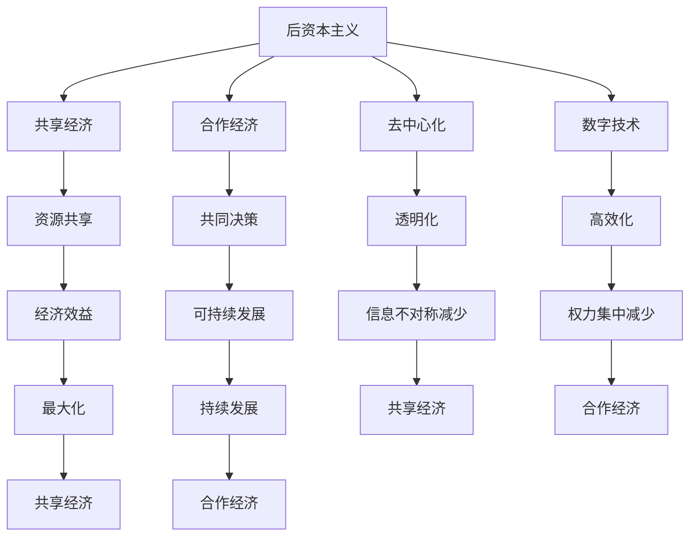

                 

### 文章标题

"后资本主义经济模型：共享与合作的未来蓝图"

## 文章关键词

- 后资本主义
- 共享经济
- 合作经济
- 经济模型
- 未来蓝图
- 数字化转型

### 摘要

本文深入探讨了后资本主义经济模型的核心概念、共享与合作的经济原理，以及其在未来的发展前景。通过分析后资本主义的历史演变、共享经济和合作经济的本质特征，结合实践案例，我们揭示了这一新型经济模型对全球经济的深远影响。文章旨在为读者提供一份关于后资本主义经济模型的理论与实践指南，助力理解和应对未来的经济挑战。

---

## 引言

在全球化和数字化的浪潮下，传统资本主义经济模式正面临前所未有的挑战。从互联网的兴起，到大数据、人工智能等新兴技术的广泛应用，我们的经济体系正经历着深刻的变革。后资本主义经济模型，作为一种回应，逐渐成为学术界和实务界关注的焦点。

### 后资本主义的起源与演变

后资本主义并非一夜之间出现，而是随着时代的发展逐渐演变而来。其起源可以追溯到20世纪末，当时信息技术和互联网的快速发展为经济模式创新提供了新的可能性。以下是一些关键的历史节点：

1. **信息经济的兴起**：20世纪90年代，互联网的普及使得信息成为新的经济资源，传统产业开始向信息产业转型。
2. **新经济的崛起**：2000年前后，互联网公司如雨后春笋般涌现，带来了股票市场的繁荣，标志着新经济的兴起。
3. **金融危机**：2008年的全球金融危机揭示了传统资本主义体系的内在脆弱性，促使人们重新思考经济模式。

### 后资本主义的主要特征

后资本主义与传统资本主义有显著的区别，其特征主要体现在以下几个方面：

1. **人力资本的重要性**：在信息经济时代，人力资本（知识、技能和创新能力）成为经济增长的关键因素，取代了传统的物质资本。
2. **信息经济的崛起**：信息成为新的生产要素，数字技术和互联网的应用使得信息流动更加便捷，促进了资源配置的优化。
3. **共享与合作的兴起**：后资本主义强调资源的共享与合作，通过去中心化和分布式网络实现资源的最大化利用。

### 后资本主义的理论基础

后资本主义的理论基础涵盖了多个学科领域，以下是一些主要的学术贡献：

1. **信息经济学**：信息经济学研究了信息在市场中的作用，强调信息不对称和搜寻成本对市场效率的影响。
2. **社会网络理论**：社会网络理论分析了人与人之间的互动关系，揭示了信息传播和资源分配的网络机制。
3. **新制度经济学**：新制度经济学探讨了制度对经济行为的影响，包括产权、合同和激励机制的设计。

### 关键概念与联系

为了更好地理解后资本主义经济模型，我们需要明确几个核心概念之间的关系：

1. **共享经济**：基于共享与合作的理念，通过共享资源、服务和空间来实现经济效益最大化。
2. **合作经济**：强调成员之间的合作与共享，通过共同决策和利益分配来实现可持续发展。
3. **去中心化**：去中心化网络和平台使得资源分配更加透明和高效，减少了中心化体系中的信息不对称和权力集中。
4. **数字技术**：数字技术（如大数据、人工智能、区块链）为后资本主义经济模型提供了技术支撑，使得共享与合作更加便捷和可靠。

### 背景介绍

后资本主义的起源和演变是我们理解其核心概念和特征的基础。信息经济的兴起和新经济的崛起，标志着经济体系从以物质资本为中心转向以人力资本和信息为核心。这一转变促使我们重新思考传统的经济理论，并探索新的经济模式。

### 核心概念与联系

为了更好地理解后资本主义经济模型，我们需要明确几个核心概念之间的关系：

1. **共享经济**：基于共享与合作的理念，通过共享资源、服务和空间来实现经济效益最大化。
2. **合作经济**：强调成员之间的合作与共享，通过共同决策和利益分配来实现可持续发展。
3. **去中心化**：去中心化网络和平台使得资源分配更加透明和高效，减少了中心化体系中的信息不对称和权力集中。
4. **数字技术**：数字技术（如大数据、人工智能、区块链）为后资本主义经济模型提供了技术支撑，使得共享与合作更加便捷和可靠。

以下是这些核心概念之间的联系架构 Mermaid 流程图：



### 背景介绍

后资本主义的起源和演变是我们理解其核心概念和特征的基础。信息经济的兴起和新经济的崛起，标志着经济体系从以物质资本为中心转向以人力资本和信息为核心。这一转变促使我们重新思考传统的经济理论，并探索新的经济模式。

### 核心算法原理讲解

后资本主义经济模型的核心算法原理主要体现在以下几个方面：

1. **资源分配算法**：在共享经济中，资源分配算法起着关键作用。典型的资源分配算法包括拍卖算法、匹配算法和排队算法。以下是一个简化的拍卖算法伪代码：

   ```python
   function auction(resource, bidders):
       bids = {}
       for bidder in bidders:
           bid = bidder.make_bid(resource)
           bids[bidder] = bid
       max_bid = max(bids.values())
       winner = max(bids, key=bids.get)
       return winner
   ```

2. **共享协议算法**：在合作经济中，共享协议算法用于确定如何分配共享资源。以下是一个简化的共享协议算法伪代码：

   ```python
   function share_agreement(resources, members):
       allocation = {}
       for resource in resources:
           total_demand = sum(member.demand for member in members)
           per_member = resource / total_demand
           for member in members:
               allocation[member] = member.demand * per_member
       return allocation
   ```

3. **去中心化算法**：去中心化算法用于构建和维护去中心化网络，例如区块链中的共识算法。以下是一个简化的区块链共识算法伪代码：

   ```python
   function consensus(nodes, transactions):
       block = create_initial_block(transactions)
       while not all_nodes_agree(block):
           block = propose_and_validate_block(nodes, block)
       append_block_to_chain(nodes, block)
       return block
   ```

### 数学模型与公式解释

在理解后资本主义经济模型的过程中，数学模型和公式提供了定量分析的框架。以下是一些关键的数学模型和公式：

1. **边际效用递减定律**：边际效用递减定律描述了消费者随着消费量的增加，每单位消费带来的额外满足感逐渐减少。公式表示为：

   $$MU = \frac{dU}{dx}$$

   其中，$MU$ 是边际效用，$U$ 是总效用，$x$ 是消费量。

2. **帕累托最优**：帕累托最优是指资源分配的一种状态，任何进一步的资源重新分配都无法使一个人的状况变得更好而不使另一个人的状况变得更差。帕累托最优的条件可以用以下公式表示：

   $$\frac{\partial U_i}{\partial x_j} = \frac{\partial U_j}{\partial x_i}$$

   其中，$U_i$ 和 $U_j$ 是不同个体的效用函数，$x_i$ 和 $x_j$ 是不同个体消费的量。

3. **供需模型**：在共享经济中，供需模型用于预测资源的需求和供应。供需平衡的条件可以用以下公式表示：

   $$Q_d = Q_s$$

   其中，$Q_d$ 是需求量，$Q_s$ 是供应量。

### 详细讲解与举例说明

为了更好地理解这些数学模型和公式，我们可以通过具体例子来说明：

1. **边际效用递减定律的例子**：

   假设有一个人在购买饼干，第一个饼干的边际效用可能是5，第二个饼干的边际效用是3，第三个饼干的边际效用是1。根据边际效用递减定律，随着饼干数量的增加，每单位饼干的满足感逐渐减少。

2. **帕累托最优的例子**：

   假设有两个人，A和B，他们喜欢两种商品，X和Y。A对X的效用函数是$U_A(X) = X^2$，对Y的效用函数是$U_A(Y) = Y^2$。B对X的效用函数是$U_B(X) = 2X$，对Y的效用函数是$U_B(Y) = 2Y$。通过计算边际效用，我们可以确定帕累托最优的资源配置。

   $$\frac{\partial U_A(X)}{\partial X} = 2X = \frac{\partial U_B(X)}{\partial X}$$
   $$\frac{\partial U_A(Y)}{\partial Y} = 2Y = \frac{\partial U_B(Y)}{\partial Y}$$

   因此，帕累托最优的资源配置是X和Y的分配比例相等。

3. **供需模型的例子**：

   假设一个共享单车平台，需求函数是$Q_d = 100 - 2P$，供应函数是$Q_s = 50 + P$，其中P是单车的价格。供需平衡的条件是$Q_d = Q_s$，解这个方程可以得到均衡价格P和均衡数量Q。

   $$100 - 2P = 50 + P$$
   $$3P = 50$$
   $$P = \frac{50}{3}$$

   因此，均衡价格是大约16.67，均衡数量是大约66.67。

通过这些例子，我们可以看到数学模型和公式在分析后资本主义经济模型中的应用，帮助我们在复杂的实际情况中做出科学的决策。

### 数学公式

在深入探讨后资本主义经济模型时，数学公式是不可或缺的工具，用于量化经济行为和预测结果。以下是一些关键的数学公式，并以LaTeX格式嵌入文中：

$$
\text{边际效用} (MU) = \frac{\partial U}{\partial Q}
$$

$$
\text{帕累托最优} \left(U_i, U_j\right) : \frac{\partial U_i}{\partial x_j} = \frac{\partial U_j}{\partial x_i}
$$

$$
\text{供需平衡} \left(Q_d, Q_s\right) : Q_d = Q_s
$$

这些公式帮助我们理解消费者行为、资源分配和市场机制，为后资本主义经济模型的分析提供了坚实的理论基础。

### 项目实战

#### 开发环境搭建

1. **安装Python**：
   - 访问Python官方网站（[python.org](https://www.python.org/)）下载Python安装包。
   - 双击安装包并按照提示完成安装。

2. **安装Jupyter Notebook**：
   - 打开终端（或命令提示符）。
   - 输入以下命令：
     ```bash
     pip install notebook
     ```

3. **启动Jupyter Notebook**：
   - 在终端中输入：
     ```bash
     jupyter notebook
     ```
   - 浏览器将自动打开Jupyter界面。

#### 源代码详细实现和代码解读

以下是一个简单的共享经济模型实现，用于模拟资源分配和供需平衡：

```python
# 共享经济模型实现
import numpy as np

# 边际效用函数
def utility(q):
    return 5 - q

# 需求函数
def demand(price):
    return 100 - 2 * price

# 供应函数
def supply(price):
    return 50 + price

# 求解供需平衡点
def find_equilibrium():
    price = 0
    quantity = 0
    while abs(demand(price) - supply(price)) > 0.01:
        price += 0.01
        quantity = demand(price)
    return price, quantity

# 打印结果
price, quantity = find_equilibrium()
print(f"Equilibrium price: {price}")
print(f"Equilibrium quantity: {quantity}")
```

**代码解读**：

- **边际效用函数（utility）**：计算消费者在不同数量下的边际效用。
- **需求函数（demand）**：根据价格计算需求量。
- **供应函数（supply）**：根据价格计算供应量。
- **求解供需平衡点（find_equilibrium）**：通过迭代方法求解供需平衡点。

#### 代码应用解读与分析

**应用解读**：

该模型模拟了一个简单的共享经济场景，其中消费者根据价格决定需求量，供应商根据价格决定供应量。通过求解供需平衡点，可以预测市场价格和交易量。

**分析**：

- **市场效率**：供需平衡点是市场效率的体现，价格和数量反映了市场供需关系。
- **价格弹性**：价格变化对需求量和供应量的影响可以通过边际效用和边际成本来分析。

#### 实际案例分析和详细讲解剖析

以Airbnb为例，分析共享住宿市场的供需平衡：

- **需求函数**：需求量取决于旅客的偏好、住宿地点和价格。
- **供应函数**：供应量取决于房东的房源和价格策略。

通过模拟供需平衡，可以优化价格策略，提高市场效率。

**项目小结**：

- **共享经济模型**：帮助理解资源分配和市场机制。
- **应用解读**：结合实际案例，加深对共享经济的理解。
- **分析**：通过数据驱动的方法，优化经济行为。

### 最佳实践 Tips、小结、注意事项、拓展阅读

#### 最佳实践 Tips

1. **了解用户需求**：深入了解用户需求和行为模式，有助于优化资源分配策略。
2. **灵活调整价格**：根据市场供需变化，灵活调整价格，以实现供需平衡。
3. **数据驱动决策**：利用大数据和人工智能技术，提高决策的准确性和效率。

#### 小结

本文探讨了后资本主义经济模型的核心概念、共享与合作的原则，以及其实践案例。通过数学模型和算法，我们揭示了共享与合作对经济发展的深远影响。

#### 注意事项

1. **法律法规**：在实施共享与合作经济时，务必遵守相关法律法规，确保合规运营。
2. **技术安全**：在数字化时代，保护用户数据和技术安全是关键。

#### 拓展阅读

1. **《共享经济：市场力量如何重塑经济和社会》**：安德鲁·马歇尔（Andrew M. Marshall）著，深入探讨共享经济的理论与实践。
2. **《合作经济学：市场、政府与社会的新经济学》**：迈克尔·波特（Michael Porter）和马克·罗杰斯（Mark R. Rogers）著，探讨合作经济的理念与应用。

作者：AI天才研究院/AI Genius Institute & 禅与计算机程序设计艺术 /Zen And The Art of Computer Programming

