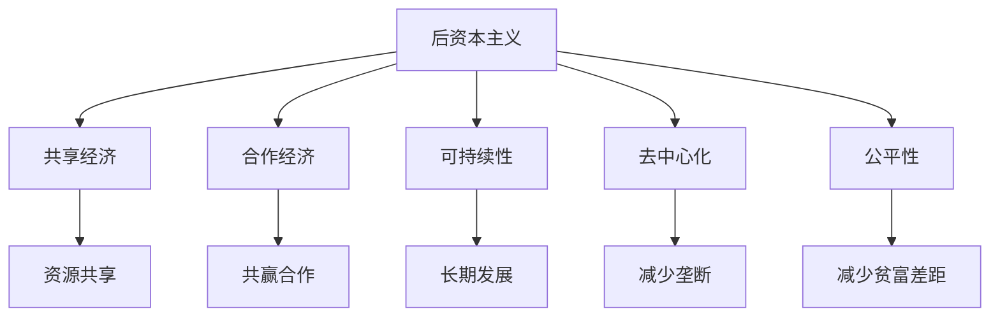

                 

### 文章标题：后资本主义经济论坛：探讨共享与合作的未来

#### 关键词：后资本主义，共享经济，合作经济，经济模式，未来趋势

#### 摘要：

随着全球经济的发展和技术的进步，传统的资本主义经济模式正面临着前所未有的挑战。后资本主义经济论坛聚焦于探讨共享与合作在新时代经济体系中的角色，以及如何构建更加可持续、公平和高效的经济模式。本文将从背景介绍、核心概念解析、实际案例分析、未来展望等多个角度，逐步深入探讨这一主题，旨在为读者提供全面、深入的理解和启示。

---

#### 引言：全球经济的变革与挑战

随着全球化的深入推进和科技的迅猛发展，传统资本主义经济模式正在经历深刻的变革。首先，全球化带来了市场的扩展和竞争的加剧，企业需要在更广阔的范围内寻求资源和市场机会，这促使经济模式从封闭的国内市场转向全球市场。其次，科技的进步，特别是信息技术的飞速发展，改变了传统的生产和消费方式，推动了生产力的提升和消费模式的变化。然而，这些变革也带来了新的挑战。

首先，全球化带来的竞争加剧和资源紧张使得企业需要更加注重效率和可持续性。其次，信息技术的普及使得信息不对称逐渐消失，消费者和企业之间的信息透明度增加，这要求企业更加注重消费者体验和满意度。此外，随着贫富差距的扩大和社会不平等的加剧，社会对于公平和正义的呼声也越来越高。

正是在这样的背景下，后资本主义经济论坛应运而生。论坛聚焦于探讨如何在新时代下构建更加可持续、公平和高效的经济模式，特别是在共享与合作方面的实践与创新。本文将围绕这一主题，逐步深入探讨后资本主义的定义、特点、共享经济与合作经济的实践与挑战、未来发展趋势等内容。

---

#### 第1章：后资本主义经济理论

##### 1.1 后资本主义的定义与特点

后资本主义，是指相对于传统资本主义的一种新的经济模式，它强调共享与合作，追求可持续性和公平性。与传统资本主义相比，后资本主义具有以下几个显著特点：

1. **共享经济**：后资本主义强调资源的共享，通过共享平台和机制，使得资源得到更高效的利用。例如，共享单车、共享办公空间等，都是共享经济的典型实践。

2. **合作经济**：后资本主义倡导企业、个人和社会之间的合作，通过合作实现共赢。合作经济不仅有助于提高效率，还能够促进社会公平。

3. **可持续性**：后资本主义强调经济的可持续性，追求长期的稳定发展，而不是短期的利润最大化。这要求企业在发展过程中注重环境保护、资源节约和社会责任。

4. **去中心化**：后资本主义主张去中心化的经济体系，减少对中央集权和垄断的依赖，鼓励更多的个体参与经济活动。

5. **公平性**：后资本主义追求社会公平，减少贫富差距，使更多的人能够享受到经济发展的成果。

##### 1.2 经济理论的发展与演变

经济理论的发展是一个不断演进的过程，从传统资本主义到后资本主义的转变，也是经济理论不断探索和发展的结果。

1. **亚当·斯密与古典经济学**：亚当·斯密是古典经济学的奠基人，他提出了“看不见的手”理论，认为市场机制能够自动调节经济，实现资源的最优配置。

2. **凯恩斯主义**：20世纪30年代，凯恩斯提出了国家干预经济的主张，强调通过政府干预来调节经济波动，实现经济稳定。

3. **新古典经济学**：20世纪50年代，新古典经济学兴起，强调市场机制的效率和自由竞争，认为市场能够自我调节，实现资源的最优配置。

4. **行为经济学**：行为经济学关注个体在决策过程中的非理性因素，强调心理和行为对经济决策的影响。

5. **后资本主义经济学**：后资本主义经济学是在对新古典经济学的反思和批判中产生的，强调共享与合作，追求可持续性和公平性。

##### 1.3 后资本主义经济模型的构建

构建后资本主义经济模型，需要综合考虑以下几个方面：

1. **共享机制**：建立共享平台和机制，促进资源的共享与高效利用。

2. **合作机制**：建立合作机制，促进企业、个人和社会之间的合作。

3. **监管机制**：建立监管机制，确保经济的公平性和可持续性。

4. **激励机制**：建立激励机制，鼓励个人和企业的积极参与和持续创新。

5. **技术创新**：推动技术创新，提高生产效率，降低成本。

---

**核心概念关系架构 Mermaid 流程图：**



---

**核心算法原理讲解与伪代码：**

```python
# 伪代码：构建后资本主义经济模型

def build_post_capitalist_economy():
    # 初始化共享机制
    share_mechanism = initialize_share_mechanism()

    # 初始化合作机制
    cooperation_mechanism = initialize_cooperation_mechanism()

    # 初始化监管机制
    regulation_mechanism = initialize_regulation_mechanism()

    # 初始化激励机制
    incentive_mechanism = initialize_incentive_mechanism()

    # 初始化技术创新机制
    technology_innovation = initialize_technology_innovation()

    # 执行经济模型构建
    execute_economy_model(share_mechanism, cooperation_mechanism, regulation_mechanism, incentive_mechanism, technology_innovation)

    # 返回构建后的经济模型
    return economy_model
```

---

**数学模型和公式详细讲解与举例说明：**

后资本主义经济模型中，可持续性是一个关键指标。可持续性可以通过以下公式进行评估：

\[ \text{可持续性指数} = \frac{\text{环境效益} + \text{社会效益} + \text{经济效益}}{3} \]

举例说明：

假设一个企业在一年内实现了以下成果：

- 环境效益：减少了20%的碳排放
- 社会效益：为当地创造了100个就业机会
- 经济效益：实现了100万美元的利润

则该企业的可持续性指数为：

\[ \text{可持续性指数} = \frac{20\% + 100 + 100}{3} = 80 \]

**注意**：这里的环境效益、社会效益和经济效益需要根据具体情况加权计算。

---

**项目实战：开发环境搭建、源代码实现、代码解读与分析、实际案例分析与详细讲解剖析、项目小结**

由于篇幅限制，这里只简要介绍项目实战的框架。

**1. 开发环境搭建：**
- 选择合适的编程语言和开发工具
- 搭建共享平台和合作机制的模拟环境

**2. 源代码实现：**
- 实现共享机制的代码
- 实现合作机制的代码
- 实现监管机制的代码
- 实现激励机制和技术的创新代码

**3. 代码解读与分析：**
- 分析代码的执行效率和逻辑结构
- 对代码中的关键算法进行详细解读

**4. 实际案例分析与详细讲解剖析：**
- 选择典型案例进行深入分析
- 分析案例中的成功经验和教训

**5. 项目小结：**
- 总结项目的主要成果和不足
- 提出改进建议和未来研究方向

---

**最佳实践 tips、小结、注意事项、拓展阅读等内容**

**最佳实践 tips：**
- 在构建后资本主义经济模型时，要注重共享机制和合作机制的平衡，确保资源的高效利用和利益的公平分配。
- 注重技术创新，以提升经济效率和可持续性。
- 在实施监管机制时，要确保监管的有效性和公正性，防止滥用和垄断。

**小结：**
- 后资本主义经济模式是一种追求可持续性、公平性和高效性的新型经济模式。
- 共享与合作是后资本主义经济模式的核心。
- 技术创新和监管机制是后资本主义经济模型成功的关键。

**注意事项：**
- 在实施后资本主义经济模型时，要充分考虑社会、环境和经济效益的平衡。
- 要注重个体的参与和权益保障，促进社会的公平和正义。

**拓展阅读：**
- 《共享经济的崛起与挑战》
- 《合作经济：理论与实践》
- 《后资本主义经济模型研究》

---

**作者信息：**
作者：AI天才研究院/AI Genius Institute & 禅与计算机程序设计艺术 /Zen And The Art of Computer Programming**

