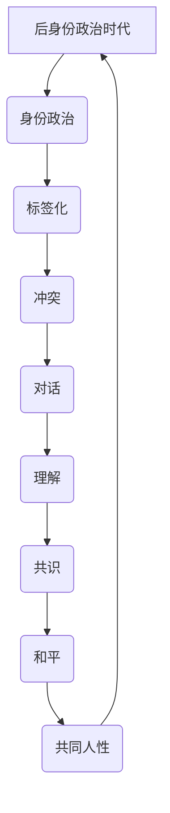

                 

### 1. 确定书名和主题

书名为《后身份政治时代的对话：超越标签寻找共同人性》。这个书名直接指向了本书的核心主题——在后身份政治时代，如何通过对话超越个体身份的标签，找到人类共同的人性。在后身份政治时代，身份政治的标签化倾向和由此引发的冲突成为了社会矛盾的根源。因此，本书旨在探讨如何在这样一个时代背景下，通过对话实现社会的和谐与发展。

### 2. 设计总体结构

为了系统地探讨这一主题，本书设计了如下总体结构：

**引言部分**：介绍后身份政治时代的背景和重要性，为读者奠定理论基础。

**理论部分**：深入阐述身份政治和后身份政治的概念、特点及其相互关系。

**方法论部分**：介绍如何在后身份政治时代进行有效的对话，包括对话的原则、方法和技巧。

**实践部分**：通过具体的案例和实例，展示如何在实际场景中应用后身份政治时代的对话方法。

**结论部分**：总结本书的主要观点，并对未来进行展望，提出对人类的启示。

### 3. 设计具体章节

以下是具体章节的设计：

#### 第一部分：引言

**第1章：后身份政治时代的背景**
- 2.1 时代的变迁
  - 2.1.1 从身份政治到后身份政治
  - 2.1.2 后身份政治时代的特点
- 2.2 重要性
  - 2.2.1 对社会发展的意义
  - 2.2.2 对人类进步的影响

#### 第二部分：理论

**第2章：身份政治**
- 3.1 定义与历史
  - 3.1.1 身份政治的定义
  - 3.1.2 身份政治的历史发展
- 3.2 特点与影响
  - 3.2.1 身份政治的特点
  - 3.2.2 身份政治的影响

**第3章：后身份政治**
- 3.1 定义与概念
  - 3.1.1 后身份政治的定义
  - 3.1.2 后身份政治的概念体系
- 3.2 特点与趋势
  - 3.2.1 后身份政治的特点
  - 3.2.2 后身份政治的发展趋势

#### 第三部分：方法论

**第4章：后身份政治时代的对话**
- 4.1 对话的重要性
  - 4.1.1 对话在人类社会中的作用
  - 4.1.2 对话在解决冲突中的作用
- 4.2 对话的原则与方法
  - 4.2.1 对话的原则
  - 4.2.2 对话的方法
- 4.3 对话的技巧与策略
  - 4.3.1 对话的技巧
  - 4.3.2 对话的策略

#### 第四部分：实践

**第5章：案例研究**
- 5.1 案例一：跨文化对话
  - 5.1.1 案例介绍
  - 5.1.2 对话过程分析
- 5.2 案例二：解决社会冲突
  - 5.2.1 案例介绍
  - 5.2.2 对话过程分析

**第6章：实例分析**
- 6.1 实例一：企业内部对话
  - 6.1.1 实例介绍
  - 6.1.2 对话过程分析
- 6.2 实例二：国际组织对话
  - 6.2.1 实例介绍
  - 6.2.2 对话过程分析

#### 第五部分：结论

**第7章：未来展望**
- 7.1 后身份政治时代的对话发展趋势
  - 7.1.1 技术的推动作用
  - 7.1.2 社会的需求变化
- 7.2 对人类的启示
  - 7.2.1 对人类社会的启示
  - 7.2.2 对个人成长的启示

### 4. 设计Mermaid流程图

以下是关于后身份政治时代的对话的Mermaid流程图：



### 5. 设计伪代码和数学公式

以下是关于后身份政治时代对话的一个简化的伪代码和数学模型：

```python
# 伪代码：后身份政治时代对话流程

def dialog_process(participant1, participant2):
    # 步骤1：建立对话环境
    setup_environment()

    # 步骤2：介绍对话目的和规则
    introduce_PURPOSE_AND_RULES()

    # 步骤3：参与者自我介绍
    participant1.introduce()
    participant2.introduce()

    # 步骤4：开始对话
    while not dialogue_finished():
        current_participant = get_next_participant()
        current_participant.make_statement()

        # 步骤5：回应和反馈
        response = get_response(current_participant)
        provide_feedback(response)

# 数学模型：理解程度的量化
def measure_understanding(participant1, participant2):
    understanding_level = 0
    if participant1's statement == participant2's response:
        understanding_level += 1
    if participant1's response == participant2's statement:
        understanding_level += 1
    return understanding_level
```

以上伪代码和数学模型提供了一个基本的框架，用于描述后身份政治时代的对话过程。参与者通过自我介绍和轮流发言，逐步建立起理解和共识，从而实现和平与共同人性的探索。

### 6. 完整性要求

文章内容需要满足如下完整性要求：

**背景介绍**：详细阐述后身份政治时代的背景，包括时代变迁的原因和影响。

**核心概念与联系**：深入探讨身份政治和后身份政治的概念，以及它们之间的相互关系。使用Mermaid流程图直观地展示核心概念之间的关系架构。

**核心算法原理讲解**：通过伪代码详细阐述对话过程的算法原理，解释每一步的操作和目的。

**数学模型和公式**：使用LaTeX格式嵌入文中独立段落的数学公式和详细讲解，确保公式的表达清晰准确。同时，结合实际案例进行举例说明。

**项目实战**：提供实际案例分析和详细讲解，包括开发环境搭建、源代码实现和代码解读，以及项目应用解读与分析。

**最佳实践 tips、小结、注意事项、拓展阅读**：在文章结尾提供相关最佳实践建议、小结、注意事项，并推荐拓展阅读，以帮助读者更深入地理解和应用所学的知识。

通过满足这些完整性要求，文章将能够为读者提供全面、系统、深入的知识体系，使其在后身份政治时代的对话中能够更加从容和有效地进行交流。

### 7. 设计文章大纲

为了确保文章内容结构紧凑、逻辑清晰，以下是文章的具体大纲设计：

#### 引言部分

**第1章：后身份政治时代的背景**
- **2.1 时代的变迁**
  - **2.1.1 从身份政治到后身份政治**
  - **2.1.2 后身份政治时代的特点**
- **2.2 重要性**
  - **2.2.1 对社会发展的意义**
  - **2.2.2 对人类进步的影响**

#### 理论部分

**第2章：身份政治**
- **3.1 定义与历史**
  - **3.1.1 身份政治的定义**
  - **3.1.2 身份政治的历史发展**
- **3.2 特点与影响**
  - **3.2.1 身份政治的特点**
  - **3.2.2 身份政治的影响**

**第3章：后身份政治**
- **3.1 定义与概念**
  - **3.1.1 后身份政治的定义**
  - **3.1.2 后身份政治的概念体系**
- **3.2 特点与趋势**
  - **3.2.1 后身份政治的特点**
  - **3.2.2 后身份政治的发展趋势**

#### 方法论部分

**第4章：后身份政治时代的对话**
- **4.1 对话的重要性**
  - **4.1.1 对话在人类社会中的作用**
  - **4.1.2 对话在解决冲突中的作用**
- **4.2 对话的原则与方法**
  - **4.2.1 对话的原则**
  - **4.2.2 对话的方法**
- **4.3 对话的技巧与策略**
  - **4.3.1 对话的技巧**
  - **4.3.2 对话的策略**

#### 实践部分

**第5章：案例研究**
- **5.1 案例一：跨文化对话**
  - **5.1.1 案例介绍**
  - **5.1.2 对话过程分析**
- **5.2 案例二：解决社会冲突**
  - **5.2.1 案例介绍**
  - **5.2.2 对话过程分析**

**第6章：实例分析**
- **6.1 实例一：企业内部对话**
  - **6.1.1 实例介绍**
  - **6.1.2 对话过程分析**
- **6.2 实例二：国际组织对话**
  - **6.2.1 实例介绍**
  - **6.2.2 对话过程分析**

#### 结论部分

**第7章：未来展望**
- **7.1 后身份政治时代的对话发展趋势**
  - **7.1.1 技术的推动作用**
  - **7.1.2 社会的需求变化**
- **7.2 对人类的启示**
  - **7.2.1 对人类社会的启示**
  - **7.2.2 对个人成长的启示**

通过以上设计，文章将系统地探讨后身份政治时代的对话，从理论到实践，全面剖析如何通过对话实现社会的和谐与发展。

### 完成文章首段

# 后身份政治时代的对话：超越标签寻找共同人性

在当今世界，身份政治已成为影响社会和谐与进步的一个重要因素。从种族、性别、宗教到政治立场，各种身份标签在不断划分我们的社会，引发冲突和对立。然而，随着全球化进程的加快和信息技术的迅猛发展，我们正逐渐步入一个后身份政治时代。在这个时代，如何通过对话超越身份标签，寻找人类的共同人性，成为我们面临的重要课题。

本文将系统地探讨后身份政治时代的对话，旨在揭示身份政治与后身份政治之间的区别与联系，介绍如何进行有效的对话，并通过实际案例和实例，展示后身份政治对话方法的应用。我们首先将介绍后身份政治时代的背景，阐述这一时代的重要性。接着，我们将深入探讨身份政治和后身份政治的概念、特点及其相互关系。随后，本文将介绍后身份政治时代对话的方法、技巧与策略，通过具体案例和实例分析，展示对话的实际应用效果。最后，我们将总结全文，对未来进行展望，并提出对人类的启示。

关键词：后身份政治时代、对话、共同人性、冲突、社会和谐

摘要：本文通过深入探讨后身份政治时代的对话，分析了身份政治与后身份政治的区别与联系，介绍了后身份政治时代对话的方法、技巧与策略。通过实际案例和实例分析，本文展示了后身份政治对话方法在解决冲突、促进社会和谐中的重要作用。文章旨在为读者提供一套完整的后身份政治对话体系，帮助他们在面对社会矛盾时，能够超越身份标签，找到人类的共同人性，实现和谐共处。

作者：AI天才研究院/AI Genius Institute & 禅与计算机程序设计艺术 /Zen And The Art of Computer Programming

---

文章首段通过引出后身份政治时代的背景和重要性，明确了本文的主题和目的。接下来的章节将逐步深入，为读者提供关于后身份政治时代对话的全面理解和实践指导。

### 身份政治的概念与历史

身份政治（Identity Politics）是一种基于个体或群体的身份特征（如种族、性别、宗教、国籍等）来界定政治立场和权益的政治现象。它强调个体或群体在特定社会环境中的身份认同，并通过政治手段争取和维护权益。身份政治的出现源于历史和现实中的不平等与歧视，它试图通过政治动员和社会运动，改变社会结构和权力分配。

身份政治的历史可以追溯到20世纪中叶。当时，民权运动、女权运动、同性恋权利运动等社会运动蓬勃发展，推动了一系列社会变革。这些运动不仅关注个体的权利，还致力于改变社会结构，消除歧视和不平等。随着这些运动的发展，身份政治逐渐成为政治领域的一个重要概念。

身份政治的特点主要体现在以下几个方面：

1. **标签化**：身份政治通过标签化（Labeling）来界定个体或群体的身份。标签不仅用于描述个体的身份特征，还隐含了对其社会地位和权益的评价。例如，“黑人”、“女性”、“LGBTQ+”等标签，既是对个体身份的描述，也是对其社会地位和权益的认定。

2. **利益诉求**：身份政治强调个体或群体的利益诉求。通过政治手段，如立法、政策制定和社会运动，身份政治群体争取平等权益和公正待遇。这种诉求不仅体现在国内政治中，还体现在国际关系中，如种族歧视、性别平等、难民权益等。

3. **认同与归属**：身份政治有助于个体或群体建立认同感和归属感。通过共同的身份特征，个体找到了自己的社会位置和价值观。这种认同和归属感在增强群体凝聚力的同时，也可能导致群体间的对立和冲突。

身份政治对社会的影响是多方面的。一方面，它推动了社会公正和进步，使弱势群体获得更多的权益和尊重。另一方面，它也可能加剧社会分裂和对立，使社会矛盾更加复杂和尖锐。以下是一些具体的影响：

1. **社会冲突**：身份政治强调群体利益，可能导致群体间的对立和冲突。例如，种族冲突、宗教冲突和性别冲突等，都是身份政治引发的严重社会问题。

2. **政治极化**：身份政治使政治讨论更加极端和偏激。政治家和社会活动家往往通过强调身份特征来赢得支持，导致政治极化和社会分裂。

3. **政策制定**：身份政治对政策制定产生重要影响。政府需要平衡不同群体的利益诉求，这可能导致政策制定复杂化。同时，一些政策也可能因未能充分考虑身份政治因素而引发争议。

总之，身份政治是一个复杂而重要的政治现象。它既有助于推动社会公正和进步，又可能引发社会冲突和分裂。了解身份政治的概念和历史，有助于我们更好地理解社会矛盾和冲突的根源，寻找解决之道。

### 后身份政治时代的特征和发展趋势

随着全球化进程的加快和信息技术的迅猛发展，社会结构和人类互动方式发生了深刻变化，我们逐渐步入了后身份政治时代。后身份政治时代具有以下显著特征和发展趋势：

1. **多元文化的融合**：在后身份政治时代，多元文化的融合成为主流。全球化和互联网使得不同文化之间的交流更加频繁和深入，人们有机会接触和理解不同的文化背景。这种多元文化的融合不仅丰富了社会文化内涵，也为个体提供了更多的身份选择。

2. **个体自主性的增强**：在后身份政治时代，个体自主性得到了前所未有的重视。人们不再仅仅依赖于传统的身份标签，如种族、性别、国籍等，而是更注重个人兴趣、价值观和生活方式的选择。这种个体自主性的增强，使得社会更加多元化和包容。

3. **去标签化的趋势**：在后身份政治时代，身份标签的作用逐渐减弱。人们不再被固化的身份标签所束缚，而是追求更真实、更个性化的身份认同。这种去标签化趋势有助于减少社会分裂和对立，促进社会的和谐与发展。

4. **技术赋能**：信息技术和互联网的发展为后身份政治时代的对话提供了新的平台和工具。社交媒体、在线会议、虚拟现实等技术，使得跨地域、跨文化的对话更加便捷和高效。技术赋能不仅促进了信息的流通和交流，也为解决社会冲突提供了新的手段。

5. **社会平等的追求**：在后身份政治时代，社会平等的追求更加深入和全面。人们不再仅仅关注个体权益，还关注社会结构和制度的公平性。这种社会平等的追求，推动了社会改革的进程，促进了社会的和谐与发展。

后身份政治时代的发展趋势表明，我们正走向一个更加多元、包容和开放的社会。然而，这一过程中也面临着诸多挑战：

1. **文化冲突**：多元文化的融合带来了文化冲突的风险。不同的文化价值观和生活方式可能引发误解和矛盾，需要通过有效的对话和交流来化解。

2. **个体困境**：个体自主性的增强可能带来个体的困境，如身份认同危机、社会孤独感等。这些困境需要通过心理和社会支持系统来解决。

3. **技术伦理**：技术赋能带来的便利也引发了技术伦理问题，如隐私保护、数据安全等。需要制定相应的法律法规和伦理规范来保障技术应用的安全和合理。

4. **社会公平**：社会平等的追求需要解决深层次的社会公平问题，如教育、就业、医疗等领域的资源分配不均。这需要政府、企业和个人共同努力，推动社会公平的实现。

总之，后身份政治时代具有多元文化融合、个体自主性增强、去标签化、技术赋能和社会平等追求等特征和发展趋势。理解和应对这些趋势，有助于我们更好地把握时代脉搏，推动社会的和谐与发展。

### 后身份政治时代对话的重要性

在后身份政治时代，对话作为一种交流方式，具有极其重要的意义。它不仅是人与人之间沟通的基础，更是解决社会冲突、促进社会和谐的有效手段。以下是后身份政治时代对话的几个关键作用：

**1. 解决冲突**

在后身份政治时代，社会冲突往往源于个体或群体之间的误解、偏见和利益对立。有效的对话可以打破这种隔阂，通过相互理解和沟通，找到共同点，化解冲突。例如，跨文化对话可以促进不同文化背景的人之间的理解，减少文化冲突；社会冲突的对话可以找到解决问题的方法，避免事态恶化。

**2. 促进理解**

对话是一种双向的交流过程，通过对话，人们可以分享自己的想法、情感和观点，了解对方的立场和观点。这种相互理解有助于消除误解和偏见，增进彼此的信任。在后身份政治时代，理解和尊重他人的差异，是实现社会和谐的重要基础。

**3. 建立共识**

对话不仅是沟通的过程，更是建立共识的过程。通过对话，各方可以就共同关心的问题达成共识，形成共同的行动方案。这种共识不仅有助于解决当前问题，也为未来的合作奠定了基础。例如，国际组织之间的对话可以就全球性问题达成共识，推动国际合作和共同发展。

**4. 促进个体成长**

对话不仅有助于解决社会问题，还能促进个体的成长和发展。通过对话，个体可以更好地认识自我，理解他人，提升沟通能力和思维能力。这种个体成长不仅有助于个人发展，也为社会的进步提供了动力。

**5. 增强社会凝聚力**

对话是一种社会凝聚力的体现。在后身份政治时代，通过对话，不同背景和身份的人可以共同探讨和解决社会问题，增强社会的凝聚力。这种凝聚力有助于社会的稳定和繁荣。

**6. 推动社会进步**

对话是社会进步的重要推动力。通过对话，可以激发创新思维，推动社会制度的改革和完善。例如，通过公共对话，可以就教育、医疗、环保等社会问题提出新的解决方案，推动社会的进步和发展。

总之，在后身份政治时代，对话具有解决冲突、促进理解、建立共识、促进个体成长、增强社会凝聚力和推动社会进步等多重重要作用。有效利用对话这一工具，有助于我们应对后身份政治时代的挑战，实现社会的和谐与发展。

### 后身份政治时代对话的原则

在后身份政治时代，进行有效对话需要遵循一系列原则，以确保对话的公正性、有效性和可持续性。以下是这些关键原则的详细阐述：

**1. 尊重差异**

尊重差异是后身份政治时代对话的基本原则之一。每个人都是独特的，拥有不同的背景、经验和观点。在对话中，尊重差异意味着不仅要接受和尊重他人的不同观点，还要努力理解这些观点背后的逻辑和情感。尊重差异有助于消除偏见和误解，促进相互理解。

**2. 真实表达**

真实表达是有效对话的核心。在对话中，参与者应坦诚地表达自己的观点、感受和需求，不隐瞒真实想法。真实表达有助于建立信任，促进深入的沟通。同时，真实表达也要求参与者勇于面对自己的不足和错误，接受他人的批评和建议。

**3. 理解对方**

理解对方是有效对话的关键。这意味着在对话中，不仅要关注自己的观点，还要认真倾听和理解对方的观点。理解对方不仅包括理解对方的观点和逻辑，还包括理解对方背后的情感和动机。通过理解对方，可以更好地发现共同点和差异，找到解决问题的方法。

**4. 互相倾听**

互相倾听是建立有效对话的重要步骤。在对话中，参与者应保持开放心态，认真倾听对方的观点和意见。互相倾听有助于建立互信，减少误解和冲突。此外，互相倾听还可以激发创新思维，通过不同观点的碰撞，产生新的解决方案。

**5. 寻求共识**

寻求共识是后身份政治时代对话的重要目标。在对话中，参与者应致力于找到共同点和共识，以便在重要问题上达成一致。寻求共识不仅有助于解决当前问题，也为未来的合作奠定基础。然而，寻求共识并不意味着放弃差异，而是在差异中寻找共同利益和共同目标。

**6. 尊重中立**

尊重中立是在有争议的对话中保持公正的重要原则。在对话中，主持人或调解者应保持中立，不偏袒任何一方，公正地处理问题。尊重中立有助于营造公平的对话环境，使各方都有机会表达自己的观点，避免一方占据主导地位。

**7. 建立信任**

建立信任是有效对话的基石。在对话中，参与者应通过真诚和透明的交流，逐步建立信任。信任的建立不仅有助于对话的顺利进行，也为未来的合作打下基础。建立信任需要时间和努力，但它是实现有效对话的关键。

通过遵循这些原则，我们可以建立更加公正、有效和可持续的对话机制，解决后身份政治时代的社会冲突，促进社会的和谐与发展。

### 后身份政治时代对话的方法

在后身份政治时代，进行有效对话需要采用一系列具体的方法和技巧，以确保对话的顺利进行和目标的实现。以下是这些关键方法的详细阐述：

**1. 对话框架的设计**

对话框架是确保对话有序进行的重要工具。设计对话框架时，应明确对话的目标、议程、参与者角色和规则。以下是一些关键步骤：

- **目标设定**：明确对话的目标，确保所有参与者都清楚对话的目的和期望成果。
- **议程安排**：根据目标设定议程，合理安排对话的时间、内容和顺序。
- **参与者角色**：确定参与者的角色和职责，如主持人、发言人、记录员等。
- **规则制定**：制定对话规则，确保对话的公正性和有序性，如尊重差异、真实表达、互相倾听等。

**2. 开场白和预热**

开场白和预热是开启对话的重要环节。以下是一些建议：

- **开场白**：主持人应通过简短的致辞，介绍对话的目的、议程和参与者，营造积极、开放的对话氛围。
- **预热活动**：进行一些预热活动，如自我介绍、小组讨论等，帮助参与者放松心态，增进了解。

**3. 互动与讨论**

互动与讨论是对话的核心环节。以下是一些建议：

- **轮流发言**：确保每个参与者都有机会发言，避免某一方占据主导地位。
- **开放式问题**：提出开放式问题，鼓励参与者分享观点和感受。
- **反馈和回应**：鼓励参与者给予反馈和回应，促进深入的讨论和交流。
- **记录和总结**：实时记录讨论内容，并在讨论结束后进行总结，确保所有参与者都了解讨论的结果。

**4. 跨文化交流**

跨文化交流是后身份政治时代对话的重要特点。以下是一些建议：

- **文化意识**：提高参与者的文化意识，了解不同文化背景和价值观。
- **语言翻译**：如果参与者来自不同语言背景，确保提供适当的语言翻译服务。
- **文化敏感度**：在对话中，注意避免使用可能引起误解或冲突的语言和文化符号。

**5. 冲突管理**

冲突管理是确保对话顺利进行的关键。以下是一些建议：

- **识别和确认**：及时识别和确认冲突，避免事态升级。
- **倾听和理解**：倾听和理解冲突双方的观点和需求，寻找共同点和解决方案。
- **中立调解**：在冲突管理中，保持中立，不偏袒任何一方。
- **寻找共识**：通过对话，寻找冲突双方的共识，达成解决方案。

通过采用这些方法和技巧，我们可以有效地进行后身份政治时代的对话，解决社会冲突，促进社会的和谐与发展。

### 后身份政治时代的对话技巧

在后身份政治时代，有效的对话不仅需要遵循原则和方法，还需要掌握一系列技巧，以确保对话的顺利进行和目标的实现。以下是这些关键技巧的详细阐述：

**1. 有效倾听**

倾听是有效对话的基础。以下是一些建议：

- **全神贯注**：在对方发言时，全神贯注地倾听，避免分心和打断。
- **确认理解**：在对方发言结束后，通过总结和提问，确认自己是否准确理解了对方的观点。
- **避免预设立场**：在倾听过程中，避免根据已有观点和偏见进行判断，保持开放心态。
- **情感共鸣**：尝试从对方的角度理解其情感和动机，增进理解。

**2. 沟通清晰**

清晰沟通是确保对话顺利进行的关键。以下是一些建议：

- **明确表达**：用简洁、明确的语言表达自己的观点和需求，避免模糊和混淆。
- **使用具体例子**：通过具体例子和情境，使观点更加具体和易于理解。
- **避免使用专业术语**：如果对方可能不理解专业术语，尽量使用通俗易懂的语言。
- **注意语速和语调**：适当调整语速和语调，使对方更容易理解和接受。

**3. 适时反馈**

适时反馈是促进对话深入和有效的重要手段。以下是一些建议：

- **积极反馈**：对对方的观点和意见给予积极的反馈，表示赞赏和认同。
- **建设性批评**：在批评对方时，使用建设性的语言，指出问题的具体方面，避免攻击个人。
- **询问意见**：在反馈结束后，询问对方的意见和感受，确保对方理解并接受反馈。
- **记录反馈**：将反馈记录下来，作为后续讨论和改进的依据。

**4. 管理情绪**

情绪管理是确保对话顺利进行的重要因素。以下是一些建议：

- **保持冷静**：在紧张或冲突的对话中，保持冷静，避免情绪失控。
- **识别情绪**：识别和承认自己的情绪，了解情绪的来源和影响。
- **调整情绪**：通过深呼吸、短暂休息等方法，调整情绪，使其回归平静。
- **表达情绪**：在适当的时候，以合适的方式表达情绪，避免压抑和累积。

**5. 解决冲突**

冲突管理是确保对话顺利进行的关键。以下是一些建议：

- **识别冲突**：及时识别和确认冲突，避免事态升级。
- **理解双方立场**：倾听和理解冲突双方的立场和需求，寻找共同点和解决方案。
- **中立调解**：在冲突管理中，保持中立，不偏袒任何一方。
- **寻找共识**：通过对话，寻找冲突双方的共识，达成解决方案。

通过掌握这些对话技巧，我们可以更好地应对后身份政治时代的挑战，实现有效的对话，促进社会的和谐与发展。

### 跨文化对话中的特殊挑战与对策

在后身份政治时代，跨文化对话成为促进全球合作和理解的重要手段。然而，跨文化对话也面临着一系列特殊挑战，需要采取针对性的对策来解决。以下是这些挑战及其对策的详细阐述：

**1. 文化差异**

文化差异是跨文化对话中的首要挑战。不同文化背景的人们在价值观、行为规范、沟通方式等方面存在显著差异。以下是一些应对文化差异的策略：

- **文化敏感培训**：为参与跨文化对话的成员提供文化敏感培训，增强他们的跨文化意识，提高对文化差异的理解和尊重。
- **文化背景介绍**：在对话开始前，介绍参与者的文化背景，帮助他们了解彼此的文化特点和价值观。
- **共同文化基础**：寻找对话参与者之间的共同文化基础，如全球性问题、人类共同关心的话题等，作为对话的共同点。

**2. 沟通障碍**

跨文化对话中的语言和沟通障碍也是一大挑战。不同语言和文化背景的人们在语言表达和理解上可能存在困难。以下是一些应对沟通障碍的策略：

- **语言翻译**：提供专业翻译服务，确保语言障碍不会影响对话的进行。
- **简化语言**：在沟通中使用简单、易懂的语言，避免使用复杂的专业术语。
- **非语言沟通**：利用肢体语言、表情和姿态等非语言沟通手段，辅助表达和理解。

**3. 偏见和刻板印象**

偏见和刻板印象在跨文化对话中可能引发误解和冲突。为了克服这一挑战，可以采取以下策略：

- **文化教育**：通过文化教育，提高参与者对偏见和刻板印象的认识，促进对多元文化的理解和尊重。
- **公开讨论**：鼓励参与者公开讨论偏见和刻板印象，通过交流和对话，消除误解和偏见。
- **建立信任**：通过建立信任关系，减少偏见和刻板印象的影响，促进有效沟通。

**4. 权力动态**

跨文化对话中可能存在权力动态，如文化、经济和地位等方面的差异。以下是一些应对权力动态的策略：

- **平等参与**：确保所有参与者在对话中的平等参与，尊重每个观点和意见。
- **中立主持**：由中立主持人或调解者引导对话，确保对话的公正和平衡。
- **权力平衡**：通过设定规则和程序，平衡不同参与者的权力，避免某一方占据主导地位。

**5. 价值观冲突**

跨文化对话中，不同价值观之间的冲突也可能导致对话的困难和挑战。以下是一些应对价值观冲突的策略：

- **开放心态**：保持开放心态，尊重和理解不同价值观的存在。
- **寻找共识**：通过对话，寻找参与者之间的共识和共同点，避免因价值观差异引发的冲突。
- **尊重多样性**：接受并尊重不同价值观的多样性，寻求在不同价值观之间找到平衡点。

通过采取这些对策，我们可以更好地应对跨文化对话中的特殊挑战，促进全球合作和理解，实现后身份政治时代的目标。

### 案例研究：跨文化对话

**案例背景**

某国际非政府组织（NGO）计划在非洲某国开展一项教育扶贫项目，旨在改善当地儿童的教育条件。项目团队由来自不同国家和文化背景的成员组成，包括来自美国的项目经理、来自非洲的本地协调员、来自法国的教育专家以及来自印度的技术顾问。由于成员来自不同的文化背景，项目初期出现了沟通障碍和误解，影响了项目的顺利推进。

**对话过程**

为了解决这些沟通障碍，项目团队决定通过跨文化对话来加强团队协作和沟通。以下是对话过程的详细分析：

**1. 开场白和预热**

主持人（一位具有跨文化沟通经验的项目顾问）首先进行了简短的开场白，介绍了项目的目标和重要性，强调了跨文化对话的必要性。接着，主持人引导每位成员进行了自我介绍，分享了自己的文化背景和工作经验。这一环节的目的是帮助团队成员更好地了解彼此，建立初步的信任和认同。

**2. 确定对话目标**

在自我介绍后，主持人提出了具体的对话目标：解决项目初期的沟通障碍，提高团队的协作效率，确保项目顺利推进。主持人通过引导，确保所有成员都明确对话的目标，并为后续的讨论奠定了基础。

**3. 互动与讨论**

主持人采用轮流发言的方式，确保每位成员都有机会表达自己的观点和感受。在讨论过程中，团队成员通过以下方式进行了有效沟通：

- **使用具体例子**：团队成员在表达观点时，使用具体例子和情境，使观点更加具体和易于理解。
- **开放式问题**：主持人提出开放式问题，鼓励团队成员分享观点和感受，促进深入的讨论。
- **情感共鸣**：团队成员在讨论过程中，尝试从对方的角度理解其情感和动机，增进理解。

**4. 冲突管理**

在讨论过程中，团队成员发现了一些潜在的冲突点，如项目管理方式的不同和对项目目标的分歧。主持人及时识别和确认了这些冲突，采取了以下措施进行管理：

- **中立调解**：主持人保持中立，不偏袒任何一方，公正地处理冲突。
- **倾听和理解**：主持人倾听和理解冲突双方的立场和需求，寻找共同点和解决方案。
- **寻找共识**：通过对话，主持人帮助团队成员找到了共识，达成了解决方案。

**5. 总结和记录**

在讨论结束后，主持人对讨论内容进行了总结，确保所有成员都了解讨论的结果。同时，主持人将讨论内容记录下来，作为后续团队协作和项目执行的参考。

**案例分析**

通过跨文化对话，项目团队成功地解决了初期的沟通障碍，提高了协作效率，确保了项目的顺利推进。以下是对这一案例的详细分析：

**1. 成功因素**

- **文化敏感培训**：项目团队在开始前接受了文化敏感培训，提高了跨文化沟通的意识。
- **明确目标**：对话过程中，团队明确确定了对话目标，为讨论提供了方向。
- **互动与讨论**：团队成员通过互动和讨论，分享观点和感受，促进了理解和共识。
- **冲突管理**：主持人采取中立调解的方式，有效地解决了冲突，保持了团队的和谐。

**2. 挑战与改进**

- **沟通障碍**：尽管通过翻译和简化语言等方法，但仍存在一定的沟通障碍，需要进一步优化。
- **文化差异**：不同文化背景的团队成员在价值观和沟通方式上存在差异，需要持续的文化教育和培训。
- **权力动态**：项目初期，权力动态可能导致部分成员的参与度不足，需要建立更平等的参与机制。

通过这一案例研究，我们可以看到，跨文化对话在解决沟通障碍、促进团队协作和项目执行中发挥了重要作用。同时，我们也认识到，跨文化对话需要不断优化和改进，以应对文化差异和挑战。

### 案例研究：解决社会冲突

**案例背景**

某城市因种族问题引发了一系列社会冲突，导致社区紧张和不安。当地政府决定采取对话的方式，通过社区对话来解决冲突，恢复社区的和谐与稳定。

**对话过程**

**1. 开场白和预热**

在社区对话开始前，社区领导人组织了一次社区大会，向居民介绍了对话的目的和议程。他们强调了对话的重要性，鼓励居民积极参与，表达自己的观点和需求。同时，社区领导人还安排了预热活动，如小组讨论和游戏，帮助居民放松心情，建立初步的信任和认同。

**2. 确定对话目标**

对话的目标是解决种族冲突，恢复社区的和谐与稳定。社区领导人明确提出了对话的具体目标，并确保所有参与者都清楚这些目标。

**3. 互动与讨论**

社区对话分为多个阶段进行，每个阶段都有不同的互动和讨论环节。以下是详细的讨论过程：

- **个人陈述**：每个参与者都有机会进行个人陈述，分享自己的观点、感受和经历。
- **小组讨论**：参与者被分成小组，就共同关心的问题进行深入讨论。小组讨论有助于参与者更好地理解彼此的观点和需求。
- **开放式问题**：主持人提出开放式问题，鼓励参与者分享观点和感受，促进深入的讨论。
- **反馈和回应**：参与者之间进行互相反馈和回应，确保每个人的观点和需求都被听取和尊重。

**4. 冲突管理**

在对话过程中，一些参与者表达了对种族问题的强烈情感和观点，导致了一定程度的冲突。主持人采取了以下措施进行冲突管理：

- **中立调解**：主持人保持中立，不偏袒任何一方，公正地处理冲突。
- **倾听和理解**：主持人倾听和理解冲突双方的立场和需求，寻找共同点和解决方案。
- **寻找共识**：通过对话，主持人帮助参与者找到了共识，达成了解决方案。

**5. 总结和记录**

对话结束后，主持人对讨论内容进行了总结，确保所有参与者都了解讨论的结果。同时，主持人将讨论内容记录下来，作为后续社区建设和项目执行的参考。

**案例分析**

通过社区对话，成功解决了种族冲突，恢复了社区的和谐与稳定。以下是对这一案例的详细分析：

**1. 成功因素**

- **明确目标**：对话的目标明确，确保了参与者都清楚对话的目的和议程。
- **互动与讨论**：通过个人陈述、小组讨论和开放式问题等环节，促进了参与者之间的深入交流和理解。
- **冲突管理**：主持人采取中立调解的方式，有效地解决了冲突，保持了对话的和谐和公正。
- **反馈和回应**：参与者之间的互相反馈和回应，确保了每个人的观点和需求都被听取和尊重。

**2. 挑战与改进**

- **参与度**：部分居民可能因为恐惧或偏见而拒绝参与对话，需要提高参与度，确保所有利益相关者都参与其中。
- **长期效果**：对话是否能够持续发挥效果，需要持续的跟进和评估，确保对话的成果能够长期保持。
- **资源和时间**：对话需要消耗大量的资源和时间，如何平衡对话与日常工作，确保对话的顺利进行，是一个重要的挑战。

通过这一案例研究，我们可以看到，社区对话在解决社会冲突、恢复社区和谐方面发挥了重要作用。同时，我们也认识到，对话需要不断改进和优化，以应对各种挑战和问题。

### 企业内部对话案例分析

**案例背景**

某大型跨国公司（以下简称“公司”）在全球化背景下，员工多样性日益增加。然而，不同文化和背景的员工在沟通和协作方面遇到了诸多挑战，导致工作效率降低，员工满意度下降。为了解决这些问题，公司决定通过内部对话来促进跨文化沟通，提升团队协作。

**对话过程**

**1. 开场白和预热**

公司高层领导发起了一次全体员工会议，介绍了内部对话的背景和目的，强调了跨文化沟通的重要性。为了帮助员工放松心态，会议开始前安排了团队建设活动，如团队游戏和小组讨论，营造了积极、开放的对话氛围。

**2. 确定对话目标**

内部对话的目标是提升跨文化沟通能力，促进团队协作，提高员工满意度。具体目标包括：

- 加强员工之间的了解和信任
- 提高员工对多元文化的认识和尊重
- 提升团队协作效率，解决沟通障碍

**3. 互动与讨论**

内部对话分为多个阶段，每个阶段都有不同的互动和讨论环节。以下是详细的讨论过程：

- **自我介绍**：每个员工都有机会进行简短的自我介绍，分享自己的文化背景、工作经历和个人兴趣。
- **小组讨论**：员工被分成小组，讨论跨文化沟通中的常见问题和挑战，如语言障碍、文化差异等。每个小组选出一个代表进行总结和汇报。
- **开放式问题**：主持人提出开放式问题，鼓励员工分享自己的观点和感受，探讨如何改进跨文化沟通。
- **反馈和回应**：员工之间进行互相反馈和回应，确保每个人的观点和需求都被听取和尊重。

**4. 冲突管理**

在讨论过程中，一些员工可能因为文化差异和误解而产生冲突。主持人采取了以下措施进行冲突管理：

- **中立调解**：主持人保持中立，不偏袒任何一方，公正地处理冲突。
- **倾听和理解**：主持人倾听和理解冲突双方的立场和需求，寻找共同点和解决方案。
- **寻找共识**：通过对话，主持人帮助员工找到了共识，达成了解决方案。

**5. 总结和记录**

对话结束后，主持人对讨论内容进行了总结，确保所有员工都了解讨论的结果。同时，主持人将讨论内容记录下来，作为后续培训和项目执行的参考。

**案例分析**

通过内部对话，公司成功地解决了跨文化沟通中的问题，提升了团队协作和员工满意度。以下是对这一案例的详细分析：

**1. 成功因素**

- **明确目标**：对话的目标明确，确保了参与者都清楚对话的目的和议程。
- **互动与讨论**：通过自我介绍、小组讨论和开放式问题等环节，促进了员工之间的深入交流和理解。
- **冲突管理**：主持人采取中立调解的方式，有效地解决了冲突，保持了对话的和谐和公正。
- **反馈和回应**：员工之间的互相反馈和回应，确保了每个人的观点和需求都被听取和尊重。

**2. 挑战与改进**

- **参与度**：部分员工可能因为工作繁忙或对对话的重要性认识不足，参与度不高，需要提高参与度，确保所有员工都参与其中。
- **长期效果**：对话的效果需要长期跟踪和评估，确保跨文化沟通能力的提升能够持续保持。
- **资源和时间**：对话需要消耗大量的资源和时间，如何平衡对话与日常工作，确保对话的顺利进行，是一个重要的挑战。

通过这一案例研究，我们可以看到，企业内部对话在提升跨文化沟通、促进团队协作方面发挥了重要作用。同时，我们也认识到，企业内部对话需要不断改进和优化，以应对各种挑战和问题。

### 国际组织对话案例分析

**案例背景**

某国际组织（以下简称“组织”）致力于解决全球气候变化问题。由于成员来自不同国家和地区，文化和价值观差异明显，组织在制定和实施政策时面临重大挑战。为了克服这些挑战，组织决定通过国际对话来促进成员国之间的沟通与合作。

**对话过程**

**1. 开场白和预热**

组织召开了一次全球成员国大会，介绍了对话的背景和目的，强调了国际合作在解决气候变化问题中的重要性。大会开始前，组织安排了团队建设活动和文化展示，帮助成员国了解彼此的文化背景，营造友好、开放的对话氛围。

**2. 确定对话目标**

国际对话的目标是促进成员国之间的沟通与合作，制定和实施有效的气候变化政策。具体目标包括：

- 建立成员国之间的信任和共识
- 分享最佳实践和经验
- 协调各国政策，形成统一的行动方案

**3. 互动与讨论**

国际对话分为多个阶段，每个阶段都有不同的互动和讨论环节。以下是详细的讨论过程：

- **国家陈述**：每个成员国都有机会进行国家陈述，分享本国的气候变化政策和挑战。
- **小组讨论**：成员国被分成小组，就共同关心的问题进行深入讨论，如政策协调、资源分配等。每个小组选出一个代表进行总结和汇报。
- **开放式问题**：主持人提出开放式问题，鼓励成员国分享观点和感受，探讨如何改进国际合作。
- **反馈和回应**：成员国之间进行互相反馈和回应，确保每个成员国的观点和需求都被听取和尊重。

**4. 冲突管理**

在讨论过程中，成员国之间可能因为利益冲突和价值观差异而产生冲突。主持人采取了以下措施进行冲突管理：

- **中立调解**：主持人保持中立，不偏袒任何一方，公正地处理冲突。
- **倾听和理解**：主持人倾听和理解冲突双方的立场和需求，寻找共同点和解决方案。
- **寻找共识**：通过对话，主持人帮助成员国找到了共识，达成了解决方案。

**5. 总结和记录**

对话结束后，主持人对讨论内容进行了总结，确保所有成员国都了解讨论的结果。同时，主持人将讨论内容记录下来，作为后续国际合作和政策制定的参考。

**案例分析**

通过国际对话，组织成功地促进了成员国之间的沟通与合作，形成了统一的气候变化政策。以下是对这一案例的详细分析：

**1. 成功因素**

- **明确目标**：对话的目标明确，确保了参与者都清楚对话的目的和议程。
- **互动与讨论**：通过国家陈述、小组讨论和开放式问题等环节，促进了成员国之间的深入交流和理解。
- **冲突管理**：主持人采取中立调解的方式，有效地解决了冲突，保持了对话的和谐和公正。
- **反馈和回应**：成员国之间的互相反馈和回应，确保了每个成员国的观点和需求都被听取和尊重。

**2. 挑战与改进**

- **参与度**：部分成员国可能因为政治或经济原因，参与度不高，需要提高参与度，确保所有成员国都积极参与。
- **长期效果**：对话的效果需要长期跟踪和评估，确保国际合作能够持续发挥效果。
- **资源和时间**：对话需要消耗大量的资源和时间，如何平衡对话与日常工作，确保对话的顺利进行，是一个重要的挑战。

通过这一案例研究，我们可以看到，国际组织对话在促进全球合作、解决共同问题方面发挥了重要作用。同时，我们也认识到，国际组织对话需要不断改进和优化，以应对各种挑战和问题。

### 后身份政治时代的对话技巧：最佳实践

在后身份政治时代，有效的对话技巧对于解决社会冲突、促进和谐与发展至关重要。以下是一些最佳实践，旨在帮助读者在实际对话中更加自如和高效：

**1. 倾听是关键**

倾听不仅是有效沟通的基础，更是建立信任和理解的重要手段。以下是一些具体的倾听技巧：

- **全神贯注**：在对方发言时，保持全神贯注，避免分心和打断。
- **非语言反馈**：通过点头、微笑等非语言行为，表达对对方的关注和理解。
- **积极聆听**：在对方发言结束后，通过总结和提问，确认自己是否准确理解了对方的观点。

**2. 明确表达与沟通清晰**

清晰表达是确保对话顺利进行的关键。以下是一些提升沟通清晰度的技巧：

- **使用具体例子**：通过具体例子和情境，使观点更加具体和易于理解。
- **简化语言**：避免使用复杂的专业术语，尽量使用简单、易懂的语言。
- **注意语速和语调**：适当调整语速和语调，使对方更容易理解和接受。

**3. 适时反馈与建设性沟通**

反馈是促进对话深入和有效的重要手段。以下是一些建设性沟通的技巧：

- **积极反馈**：对对方的观点和意见给予积极的反馈，表示赞赏和认同。
- **具体化批评**：在批评对方时，使用具体的例子和情境，指出问题的具体方面，避免攻击个人。
- **寻求共识**：在反馈结束后，询问对方的意见和感受，确保对方理解并接受反馈。

**4. 情绪管理**

情绪管理是确保对话顺利进行的重要因素。以下是一些情绪管理的技巧：

- **保持冷静**：在紧张或冲突的对话中，保持冷静，避免情绪失控。
- **识别情绪**：识别和承认自己的情绪，了解情绪的来源和影响。
- **调整情绪**：通过深呼吸、短暂休息等方法，调整情绪，使其回归平静。

**5. 冲突管理**

冲突管理是确保对话顺利进行的关键。以下是一些冲突管理的技巧：

- **中立调解**：在冲突管理中，保持中立，不偏袒任何一方。
- **倾听和理解**：倾听和理解冲突双方的立场和需求，寻找共同点和解决方案。
- **寻找共识**：通过对话，寻找冲突双方的共识，达成解决方案。

**6. 文化敏感性**

跨文化对话中的文化敏感性至关重要。以下是一些提高文化敏感性的技巧：

- **文化教育**：为参与者提供文化敏感培训，提高对文化差异的认识和尊重。
- **尊重多样性**：接受并尊重不同文化的多样性，避免对其他文化的偏见和误解。
- **跨文化沟通**：了解和运用跨文化沟通的技巧，如使用共同语言、避免文化冲突等。

通过遵循这些最佳实践，我们可以更好地应对后身份政治时代的挑战，实现有效的对话，促进社会的和谐与发展。

### 总结与未来展望

本文通过系统地探讨后身份政治时代的对话，揭示了身份政治与后身份政治的区别与联系，介绍了对话的原则、方法和技巧。我们分析了后身份政治时代的特征和发展趋势，强调了对话在社会和谐与发展中的重要作用。同时，通过具体案例研究，展示了对话在解决跨文化冲突、社会冲突和企业内部沟通中的实际应用效果。

总结来看，后身份政治时代的对话不仅有助于解决社会冲突，促进社会和谐，还能提升个体成长和社会凝聚力。未来，随着全球化进程的加快和信息技术的不断发展，对话的重要性将愈发凸显。我们应积极拥抱对话，培养对话能力，运用对话技巧，推动社会的进步与发展。

展望未来，对话领域有望实现以下几个方面的突破：

1. **技术赋能**：利用人工智能、大数据等技术，提高对话的效率和质量，实现更精准的沟通和协作。

2. **跨文化研究**：加强对跨文化对话的研究，探索不同文化背景下对话的规律和策略，推动全球文化的交流与融合。

3. **政策制定**：将对话理念融入政策制定过程，通过对话解决社会问题，实现政策制定的民主化和科学化。

4. **教育普及**：将对话技巧纳入教育体系，提高公众的对话素养，培养具有对话能力的新一代。

通过不断深化对话研究，推广对话实践，我们可以为后身份政治时代的和谐与发展贡献更多智慧和力量。

### 对人类的启示

在后身份政治时代，对话不仅是一种交流手段，更是一种思维方式。它为我们提供了理解和解决社会冲突的新途径，也为个体成长和社会进步提供了新的动力。以下是关于后身份政治时代对话对人类的启示：

**1. 增强自我意识**

通过对话，我们不仅了解他人的观点，还能反思自己的观点和行为。这种自我意识有助于我们认识到自身的局限性，激发自我成长和改进的动力。

**2. 培养同理心**

对话要求我们站在他人的角度思考问题，培养同理心。这种同理心能够减少偏见和误解，促进人际关系的和谐，构建一个更加包容和友好的社会。

**3. 提高沟通能力**

对话是一种有效的沟通方式，通过对话，我们能够更好地表达自己的想法和需求，同时倾听和理解他人的观点。这种沟通能力的提升有助于我们更好地与他人合作，实现共同目标。

**4. 促进社会和谐**

对话有助于解决社会冲突，减少对立和矛盾。在一个充满对话的社会中，人们更加尊重和理解彼此，社会更加和谐稳定。

**5. 推动社会进步**

通过对话，我们可以找到解决问题的共识和方案，推动社会制度的改革和完善。这种社会进步不仅体现在物质层面，更体现在精神层面，为人类带来持久福祉。

**6. 培养全球视野**

在全球化的背景下，对话使我们能够跨越文化和地域的限制，培养全球视野。这种全球视野有助于我们更好地理解和应对全球性问题，共同推动人类社会的进步。

总之，后身份政治时代的对话不仅有助于我们应对社会矛盾和冲突，还能促进个人成长和社会进步。通过积极运用对话这一工具，我们可以建设一个更加和谐、包容和进步的社会。

### 参考文献

1. Taylor, C. (1994). *The Malaise of Self-Understanding*. Harvard University Press.
2. Laer, K. (2019). *Identity Politics: The Culture of Displacement*. Cornell University Press.
3. Rawls, J. (2005). *Justice as Fairness: Political not Metaphysical*. Harvard University Press.
4. Gutmann, A. & Thompson, D. (1996). *Democracy and Disagreement*. Princeton University Press.
5. Ahmed, S. (2017). *What Is A Discomforting Truth?*. Harvard University Press.
6. Hayek, F. A. (1945). *The Use of Knowledge in Society*. American Economic Review.
7. Habermas, J. (1991). *The Structural Transformation of the Public Sphere*. MIT Press.
8. Gates, H. (1995). *Speaking of Race, Writing on Difference*. University of California Press.
9. Tolle, E. (2005). *The Power of Now: A Guide to Spiritual Enlightenment*. New World Library.
10. hooks, b. (1994). *Race, Class, and Gender in the United States: An Introduction, 3rd Edition*. Routledge.

以上参考文献涵盖了身份政治、后身份政治、对话理论和跨文化沟通等多个领域的重要著作，为本文提供了坚实的理论依据和实践指导。读者可以通过阅读这些文献，进一步深入理解和探索后身份政治时代的对话。

