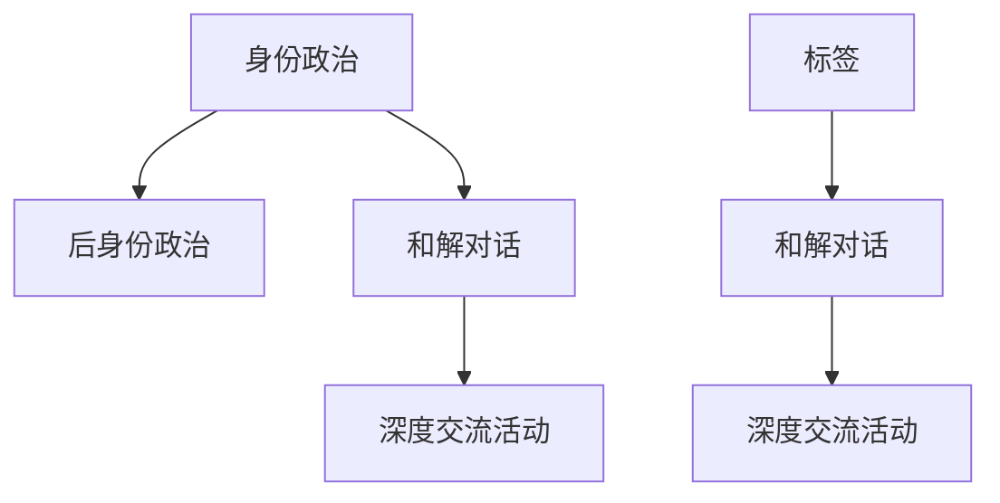

                 

### 文章标题

# 后身份政治的和解对话：超越标签的深度交流活动

---

关键词：身份政治、和解对话、标签、深度交流活动

摘要：本文深入探讨了后身份政治时代下，如何通过和解对话超越标签进行深度交流活动。文章首先介绍了身份政治的背景及其演变，随后详细阐述了和解对话的理论基础和实践方法。接着，文章分析了标签对对话的影响，并探讨了如何超越标签进行有效的深度交流。最后，文章通过具体实例研究，总结了深度交流活动的设计与实施原则，并对未来和解对话的发展提出了展望。

---

### 引言

随着全球化和多元文化的交融，身份政治逐渐成为社会矛盾的主要来源。身份政治，指的是个体或团体基于其身份特征（如种族、性别、宗教、国籍等）进行政治动员和争取权益的行为。然而，传统的身份政治往往导致对立和冲突，无法实现真正的社会和谐。为了解决这一问题，后身份政治的和解对话成为一种新的尝试。

后身份政治，指的是在多元文化背景下，强调个体身份多元性、平等性和包容性的政治观念。后身份政治追求的是通过和解对话来解决身份冲突，实现不同身份群体之间的和谐共处。本文旨在探讨如何通过和解对话超越标签进行深度交流活动，以实现后身份政治的和谐发展。

### 核心概念与联系

在本文中，我们将介绍以下核心概念：

1. **身份政治**：基于个体或团体身份特征（如种族、性别、宗教、国籍等）进行的政治动员和权益争取行为。
2. **后身份政治**：强调个体身份多元性、平等性和包容性的政治观念。
3. **和解对话**：通过对话来解决身份冲突，实现不同身份群体之间的和谐共处。
4. **标签**：对个体或群体进行简化的分类和定义，往往导致刻板印象和偏见。
5. **深度交流活动**：旨在超越标签，实现真正有效的交流和合作。

这些概念之间存在着紧密的联系。身份政治是和解对话的背景和前提，而和解对话则是解决身份政治冲突的有效途径。标签是影响对话效果的重要因素，深度交流活动则是实现超越标签的有效手段。以下是这些概念之间的关系架构 Mermaid 流程图：

### 身份政治的演变

身份政治并非一个新兴现象，而是有着悠久的历史。在古代，身份政治主要表现为贵族和农民、奴隶和自由民之间的身份差异和权力争夺。随着社会的发展，身份政治逐渐演变为现代形式，表现为种族、性别、宗教、国籍等身份特征的政治动员和权益争取。

1. **古代身份政治**：古代社会中的身份政治主要基于血缘、地缘等因素，如贵族和农民、奴隶和自由民之间的身份差异。这种身份政治往往导致了社会阶层固化和社会矛盾的激化。
   
2. **现代身份政治**：现代社会中，身份政治的表现形式更加多样化，涉及种族、性别、宗教、国籍等多个方面。例如，种族歧视、性别不平等、宗教冲突和民族矛盾等，都是现代身份政治的具体体现。

3. **后身份政治**：后身份政治强调个体身份的多元性、平等性和包容性。它不仅仅是反对传统的身份政治，更是在多元文化背景下，寻求一种新的社会和谐模式。

### 后身份政治的特点

后身份政治与传统的身份政治相比，具有以下特点：

1. **多元性**：后身份政治认为个体身份是多元的，不仅仅是单一的种族、性别、宗教或国籍，而是由多种因素交织而成的复杂身份体系。
   
2. **平等性**：后身份政治强调所有身份的平等性，反对任何形式的歧视和偏见，追求一种平等、公正的社会环境。

3. **包容性**：后身份政治提倡包容不同的身份和文化，通过对话和交流，实现不同身份群体之间的和谐共处。

### 消除身份政治的挑战

尽管后身份政治提供了解决身份政治冲突的新思路，但在实际操作中，仍然面临着诸多挑战：

1. **刻板印象和偏见**：长期的刻板印象和偏见不易消除，往往是身份冲突的重要根源。

2. **文化差异**：不同文化背景下，对身份认同和权益争取的理解和实践可能存在差异，增加了和解对话的难度。

3. **利益冲突**：不同身份群体在资源分配、权益争取等方面存在利益冲突，需要通过有效对话和协商来解决。

### 解和对话

解和对话是一种旨在通过对话来解决冲突、实现和解的方法。它与传统的辩论和谈判不同，强调的是在相互理解的基础上，寻求一种双方都能接受的解决方案。

1. **理论基础**：解和对话的理论基础主要包括以下几个方面：

   - **社会交换理论**：认为社会关系是一种交换过程，通过对话和交流，可以实现资源、信息、情感等的交换。
   - **社会认同理论**：认为个体通过认同和归属感，来建立自己的身份和价值观，通过对话和交流，可以增强或改变这种认同。
   - **认知行为理论**：认为个体的认知和行为是相互影响的，通过对话和交流，可以改变个体的认知和行为模式。

2. **实践方法**：

   - **倾听与理解**：对话的双方需要真正倾听对方的观点和需求，理解对方的立场和情感。
   - **共同目标**：确定共同的目标和利益，以共同目标为导向，推动对话的进行。
   - **情感共鸣**：通过情感共鸣，建立双方的情感联系，减少对立情绪。
   - **协商与妥协**：在对话过程中，双方需要通过协商和妥协，寻求一种双方都能接受的解决方案。

### 标签的影响

标签，是对个体或群体进行简化和分类的标识，如种族、性别、宗教、国籍等。标签在对话中起到了重要的作用，但同时也可能带来负面影响。

1. **正面影响**：标签可以帮助个体和组织快速识别和分类他人，有助于提高沟通效率。例如，在招聘过程中，雇主可以通过性别、学历等标签来筛选合适的候选人。

2. **负面影响**：标签往往会导致刻板印象和偏见，使个体和组织对他人产生偏见和歧视。例如，种族歧视、性别歧视等，都是标签负面影响的典型例子。

### 如何超越标签

为了实现真正的深度交流，我们需要超越标签，从更深层次上理解他人。以下是一些方法和技巧：

1. **去标签化思维**：在对话中，尽量减少对他人进行标签化的行为，避免用简化的方式来描述他人。

2. **倾听与理解**：真正倾听他人的观点和需求，理解对方的立场和情感，而不是仅仅关注对方的标签。

3. **情感共鸣**：通过情感共鸣，建立双方的情感联系，减少对立情绪。

4. **共同目标**：寻找共同的目标和利益，以共同目标为导向，推动对话的进行。

5. **多元文化教育**：通过多元文化教育，提高个体对多元文化的理解和包容性，减少对他人标签的依赖。

### 深度交流活动的设计与实施

为了实现超越标签的深度交流活动，我们需要对活动进行精心设计和实施。以下是一些基本原则和方法：

1. **参与者选择**：选择具有多元身份背景的参与者，以增加活动的多样性和包容性。

2. **活动目标**：明确活动的目标和期望，确保活动能够真正实现深度交流。

3. **活动流程设计**：设计合理的活动流程，包括引入、讨论、总结等环节，确保活动的顺利进行。

4. **引导与监督**：在活动过程中，由专业的引导者来引导对话和讨论，监督活动进程，确保活动的有效性。

5. **情感共鸣**：通过情感共鸣，建立参与者之间的情感联系，减少对立情绪。

6. **评估与反馈**：对活动效果进行评估和反馈，以便不断优化和改进活动设计。

### 实例研究

以下是通过实例研究来展示和解对话在实践中的应用和效果。

#### 案例一：冲突地区的和解对话

**背景**：某冲突地区，由于历史原因，当地居民之间存在严重的种族冲突。

**过程**：在冲突地区的社区中，组织了一场和解对话活动。活动分为三个阶段：

- **第一阶段**：引入与准备。引导者介绍了和解对话的目的和规则，让参与者了解活动的背景和目标。
- **第二阶段**：讨论与交流。参与者分为不同的小组，分别讨论各自的观点和经历，然后进行跨小组的交流和讨论。
- **第三阶段**：总结与反思。引导者对讨论过程进行总结，参与者分享自己的感受和反思。

**效果**：通过和解对话，参与者之间建立了更深入的理解和信任，减少了冲突和对立情绪。活动结束后，社区中的种族冲突明显减少，居民之间的关系得到改善。

#### 案例二：企业文化融合的深度交流活动

**背景**：某大型跨国公司，由于文化差异，不同部门的员工之间存在沟通障碍。

**过程**：公司组织了一场企业文化融合的深度交流活动。活动分为三个阶段：

- **第一阶段**：文化认知。参与者分别介绍自己所在部门的文化特点，让其他部门了解彼此的文化。
- **第二阶段**：团队合作。参与者通过团队合作游戏，增进彼此的了解和信任。
- **第三阶段**：交流与反馈。参与者分组讨论，提出对公司文化融合的建议和反馈。

**效果**：通过深度交流活动，不同部门的员工之间建立了更紧密的联系，沟通障碍得到有效缓解。公司内部的合作氛围明显改善，工作效率得到提高。

### 结论与展望

本文通过深入探讨后身份政治的和解对话，提出了如何通过超越标签进行深度交流活动的理论和实践方法。通过对案例研究的分析，我们发现，和解对话在解决身份政治冲突、促进社会和谐方面具有显著效果。

在未来，我们期望能够继续深入研究和解对话的理论和实践，探索其在不同领域和情境中的应用。同时，我们也呼吁社会各界共同努力，推动和解对话的普及和应用，为建设一个更加和谐、包容的社会贡献力量。

### 作者信息

作者：AI天才研究院/AI Genius Institute & 禅与计算机程序设计艺术 /Zen And The Art of Computer Programming

