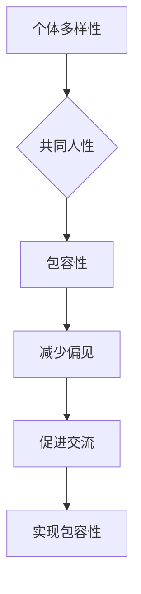
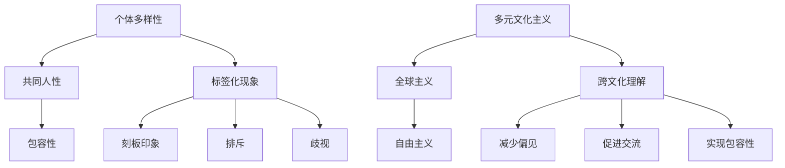
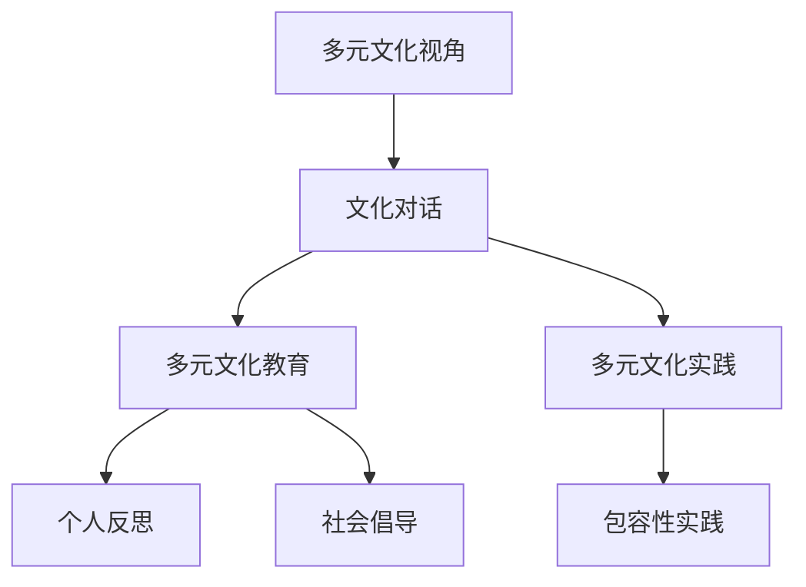
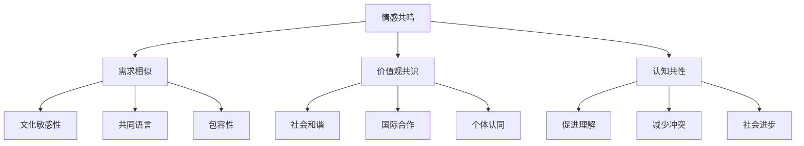

                 


## 文章标题：《后身份政治：超越标签寻找共同人性》

### 关键词：后身份政治、标签化、共同人性、多元文化、包容性、社会关系

### 摘要：
本文旨在探讨后身份政治的理念，即超越传统的身份标签，寻找人类共同的底层特质。通过分析后身份政治的核心概念、历史背景、影响以及实际应用，本文揭示出在全球化背景下，后身份政治对于建立多元、包容的社会关系的重要性。文章还提供了具体的策略和方法，以帮助个人和集体在实践中实现这一理念。

## 引言

### 1. 后身份政治的概念与意义

后身份政治是一种政治哲学，旨在超越传统的身份政治（例如基于种族、性别、宗教或性取向的划分），转而关注人类共同的特质。传统身份政治强调群体差异，从而导致了标签化和排斥。后身份政治则倡导通过理解和尊重个体多样性，寻找人类共同的人性和价值。

### 1.2 超越标签：寻找共同人性的必要性

在现代社会，标签化现象无处不在。人们常常被归入各种标签，如“男/女”、“白/黑”、“富/穷”等。这些标签不仅限制了我们的认知视野，还可能引发社会分裂和对立。因此，超越标签，寻找共同人性成为了一个紧迫的任务。

### 1.3 书的结构与内容概述

本文将分为七个主要部分：

1. **引言**：介绍后身份政治的概念和重要性。
2. **核心概念与联系**：讨论后身份政治的核心概念，展示它们之间的联系。
3. **历史背景**：回顾身份政治的发展过程，探讨后身份政治的兴起原因。
4. **超越标签**：分析标签化的影响，提出超越标签的方法和策略。
5. **寻找共同人性**：探讨人类共同点的意义，提供寻找共同人性的方法和实践。
6. **案例分析**：通过实际案例展示后身份政治的应用，分析成功和挑战。
7. **结论**：总结书中的观点，提出未来研究的方向和建议。

### 1.4 Markdown 格式应用

为了更好地组织内容，我们将使用 Markdown 格式。以下是几个示例：

- **标题**：使用 `#` 符号，例如：

  ```markdown
  # 文章标题
  ```

- **子标题**：使用 `##` 符号，例如：

  ```markdown
  ## 子标题
  ```

- **引用**：使用 `>` 符号，例如：

  ```markdown
  > 这是一句引用。
  ```

- **列表**：使用 `*` 或 `-` 符号，例如：

  ```markdown
  * 第一项
  - 第二项
  ```

通过这些基本的 Markdown 格式，我们可以构建出清晰、结构化的文章内容。

### 1.5 思考问题

- 你认为后身份政治对于解决当前社会问题有何潜在作用？
- 在你的个人经验中，有没有遇到过标签化现象？你是如何应对的？

## 核心概念与联系

### 2.1 后身份政治的核心概念解析

后身份政治的核心概念包括：

- **个体多样性**：强调个体之间的差异性，包括文化、信仰、性别、种族等。
- **共同人性**：寻找跨越身份差异的共同特质，如情感、需求、价值观等。
- **包容性**：尊重和接纳不同的个体和群体，形成和谐的社会关系。

### 2.2 标签化现象及其影响

标签化现象通常表现为：

- **刻板印象**：对某一群体的笼统和简化认识。
- **排斥**：由于标签导致的群体间的不理解和偏见。
- **歧视**：对特定群体的不公平待遇。

标签化对个体和社会的影响包括：

- **认知局限**：限制了人们对多样性的理解和认识。
- **社会分裂**：加剧了群体间的对立和冲突。
- **个人压抑**：个体可能因为标签而感到压抑和排斥。

### 2.3 后身份政治与其他政治理论的联系

后身份政治与以下几种政治理论有密切联系：

- **多元文化主义**：强调多元文化在社会中的共存和尊重。
- **全球主义**：认为全球化的趋势要求我们超越国界和文化的限制。
- **自由主义**：倡导个体的自由和权利，反对任何形式的压迫和歧视。

### 2.4 跨文化理解在后身份政治中的重要性

跨文化理解是后身份政治的基础。通过理解和尊重不同的文化背景，我们可以：

- **减少偏见**：避免对其他文化的误解和偏见。
- **促进交流**：建立基于共同理解和尊重的国际关系。
- **实现包容性**：在多元化的社会中，创造和谐的社会环境。

### 2.5 后身份政治对现代社会的挑战与机遇

后身份政治为现代社会带来了挑战和机遇：

- **挑战**：需要改变传统的思维模式和社会结构，这可能面临抵抗和困难。
- **机遇**：通过超越身份标签，我们可以建立更加包容和和谐的社会，促进全球合作和共同发展。

### 2.6 跨文化理解的Mermaid流程图

以下是一个简单的 Mermaid 流程图，展示了跨文化理解在后身份政治中的应用：



通过这个流程图，我们可以看到，跨文化理解是如何通过个体多样性、共同人性、包容性等概念，最终实现减少偏见、促进交流和实现包容性的。

### 2.7 核心概念关系架构

为了更清晰地展示后身份政治的核心概念之间的关系，我们可以使用 Mermaid 绘制一个关系图：



在这个关系图中，我们可以看到后身份政治的核心概念是如何相互关联，共同构建一个包容、和谐的社会环境的。

## 历史背景

### 3.1 身份政治的发展历程

身份政治起源于20世纪中叶，作为对传统政治体系中的不平等和压迫的反抗。它的主要目标是保护特定群体的权益，如种族、性别、宗教和性取向等。身份政治通过强调群体差异，推动了社会变革和权利的争取。

然而，随着时间的推移，身份政治也带来了一些问题。过度强调群体差异可能导致社会分裂和对立，忽视个体之间的共同点。这促使人们开始思考如何超越身份政治，寻找更深层次的共同人性。

### 3.2 后身份政治的兴起原因

后身份政治的兴起源于对传统身份政治局限性的反思。以下几个因素促成了后身份政治的兴起：

- **全球化**：全球化带来了不同文化的交流与融合，使人们认识到单一的身份标签无法全面反映个体的多样性。
- **科技进步**：互联网和社交媒体的普及，使得信息和观念的传播更加迅速和广泛，促进了跨文化交流和理解。
- **社会变革**：社会对性别、种族和宗教平等的追求，推动了人们思考如何超越身份差异，建立包容和谐的社会关系。

### 3.3 后身份政治在全球化背景下的演变

全球化为后身份政治的发展提供了机遇和挑战。以下方面展示了后身份政治在全球化背景下的演变：

- **文化多样性**：全球化带来了不同文化的交流和融合，为后身份政治提供了丰富的素材和基础。
- **跨文化理解**：全球化要求人们具备跨文化理解的能力，以应对多元文化背景下的社会挑战。
- **全球合作**：后身份政治倡导超越国界和文化的限制，推动全球合作和共同发展。

### 3.4 身份政治危机与后身份政治的提出

随着全球化进程的加速，传统身份政治开始面临危机。以下因素导致了这一危机：

- **社会分裂**：过度强调身份差异导致了社会分裂和对立，影响了社会的和谐与稳定。
- **不平等加剧**：身份政治在一定程度上加剧了社会不平等，使得部分群体陷入贫困和边缘化。
- **道德困境**：传统身份政治的过度强调可能忽视了个体之间的共同点和普遍的道德原则。

为了解决这些危机，后身份政治应运而生。它倡导超越身份标签，寻找人类共同的特质，以建立更加包容和和谐的社会关系。

## 超越标签

### 4.1 标签化的负面影响

标签化对个体和社会产生了诸多负面影响。以下方面详细分析了这些影响：

- **个人认同的局限**：标签化可能导致个体将自己的身份局限于特定的标签，从而限制了个人认同的多样性和发展。
- **社会排斥**：标签化可能导致社会对特定群体的排斥和歧视，加剧社会分裂和对立。
- **认知局限**：标签化限制了人们对多样性的理解和认识，使得社会对复杂的问题难以形成全面的认知。
- **社会不平等**：标签化可能导致社会不平等加剧，使得特定群体陷入贫困和边缘化。

### 4.2 超越标签的策略与方法

为了超越标签，我们可以采取以下策略和方法：

- **跨文化理解**：通过学习和了解不同文化，减少对其他文化的误解和偏见。
- **多元视角**：从多个角度看待问题，避免片面和刻板的认识。
- **共同人性**：寻找人类共同的特质和价值，建立超越身份差异的共同认同。
- **包容性**：尊重和接纳不同的个体和群体，形成和谐的社会关系。

### 4.3 多元文化视角下的标签消解

在多元文化背景下，超越标签的方法尤为重要。以下方面展示了如何从多元文化视角消解标签：

- **文化对话**：通过文化对话，增进不同文化之间的理解和尊重。
- **多元文化教育**：通过多元文化教育，培养个体的跨文化意识和能力。
- **多元文化实践**：在日常生活中实践多元文化，减少对其他文化的误解和偏见。

### 4.4 个人与集体层面的标签超越实践

在个人和集体层面，我们可以采取以下实践来超越标签：

- **个人反思**：反思自己对标签的认知和态度，减少对标签的依赖和认同。
- **社会倡导**：倡导社会尊重和接纳多样性，反对任何形式的标签化和歧视。
- **实践包容性**：在个人和集体行为中，实践包容性，尊重和接纳不同的个体和群体。

### 4.5 标签超越的Mermaid流程图

以下是一个简单的 Mermaid 流程图，展示了从多元文化视角超越标签的过程：



通过这个流程图，我们可以看到，从多元文化视角超越标签需要文化对话、多元文化教育、多元文化实践以及个人反思和社会倡导等多方面的努力。

## 寻找共同人性

### 5.1 人类共同点的心理学研究

心理学研究为我们揭示了人类共同点的几个方面：

- **情感共鸣**：人类在情感上具有共鸣能力，能够理解和感受到他人的情感状态。
- **需求相似**：人类有许多基本需求，如安全感、尊重、爱和归属感等。
- **价值观共识**：尽管文化背景不同，但许多价值观具有普遍性，如公平、正义、诚实和爱心等。
- **认知共性**：人类在思维方式上存在一定的共性，如逻辑推理、问题解决和创造力等。

### 5.2 文化差异与共同人性的平衡

在尊重文化差异的同时，寻找共同人性是构建和谐社会的关键。以下方面展示了如何平衡文化差异与共同人性：

- **文化敏感性**：在交流和互动中，尊重和理解不同文化的习俗和价值观。
- **共同语言**：通过寻找共同的价值观和语言，建立跨文化的沟通和理解基础。
- **包容性**：在多元文化背景下，尊重和接纳不同的文化，避免文化冲突。

### 5.3 后身份政治中的共同人性构建

在后身份政治中，共同人性构建具有以下几个方面的意义：

- **社会和谐**：通过寻找共同人性，减少社会分裂和对立，促进社会和谐。
- **国际合作**：共同人性为国际合作提供了基础，有助于解决全球性问题。
- **个体认同**：共同人性有助于个体在多元文化背景下建立积极的认同感。

### 5.4 共同人性的实践意义与伦理考量

共同人性的实践意义体现在以下几个方面：

- **促进理解**：通过共同人性，增进不同文化之间的理解和尊重。
- **减少冲突**：共同人性有助于减少文化冲突和误解，促进和平与合作。
- **社会进步**：共同人性为社会的进步和发展提供了动力。

在伦理考量方面，我们需要注意以下几点：

- **尊重多样性**：在寻找共同人性的过程中，尊重文化的多样性，避免文化霸权。
- **公平对待**：确保共同人性的构建过程中，每个人都能平等参与和受益。
- **责任与担当**：在多元文化背景下，每个人都要承担起推动社会进步的责任。

### 5.5 共同人性的未来趋势与展望

随着全球化进程的加速，共同人性的研究和实践将会变得更加重要。以下方面展示了共同人性的未来趋势和展望：

- **跨文化教育**：教育系统将更加注重跨文化教育，培养个体的跨文化意识和能力。
- **国际合作**：全球各国将加强合作，共同应对全球性问题，如气候变化、贫困和疾病等。
- **社会创新**：共同人性的研究将推动社会创新，为构建更加和谐、包容的社会提供新思路。

### 5.6 共同人性的Mermaid流程图

以下是一个简单的 Mermaid 流程图，展示了共同人性的构建过程：



通过这个流程图，我们可以看到，共同人性的构建涉及多个方面，包括情感共鸣、需求相似、价值观共识和认知共性等。这些方面相互关联，共同推动社会的和谐与发展。

## 案例分析

### 6.1 案例一：后身份政治在种族与性别问题中的应用

**案例背景**：在美国，种族和性别问题一直是社会关注的焦点。过去几十年，通过身份政治，不同种族和性别群体争取到了应有的权益。然而，过度强调身份差异也导致了社会分裂和对立。

**解决方案**：后身份政治倡导超越种族和性别的划分，寻找人类共同的特质和价值。以下方面展示了后身份政治在这一案例中的应用：

- **共同人性教育**：在学校和社区开展共同人性教育，培养学生和居民理解和尊重不同的种族和性别。
- **多元文化项目**：组织多元文化活动，增进不同种族和性别群体之间的了解和交流。
- **平等机会**：确保不同种族和性别群体在就业、教育和政治等方面享有平等的机会。

**效果评估**：通过后身份政治的实践，社会分裂和对立得到缓解，种族和性别问题得到更好的解决。人们更加注重共同人性，社会关系更加和谐。

### 6.2 案例二：跨文化组织中的后身份政治实践

**案例背景**：在全球化的背景下，许多组织面临着多元文化的挑战。如何在一个多元文化的工作环境中实现和谐与合作，成为许多组织面临的难题。

**解决方案**：后身份政治为跨文化组织提供了以下实践指导：

- **文化敏感培训**：对员工进行文化敏感培训，提高他们对不同文化的理解和尊重。
- **共同目标**：通过设定共同的目标和愿景，增强组织的凝聚力。
- **包容性政策**：制定包容性政策，确保每个员工都能在一个平等和尊重的环境中工作。

**效果评估**：通过后身份政治的实践，组织内部的多元文化冲突得到缓解，员工的满意度和工作效率显著提高。组织在全球化背景下更具竞争力。

### 6.3 案例三：后身份政治在教育领域的改革

**案例背景**：教育领域一直面临着如何培养具有全球视野和跨文化理解能力的人才的挑战。

**解决方案**：后身份政治在教育领域的改革中发挥了重要作用：

- **多元文化课程**：将多元文化教育纳入课程体系，培养学生的跨文化意识和能力。
- **教师培训**：对教师进行多元文化培训，提高他们在教学中的文化敏感性和包容性。
- **校园文化**：营造一个多元、包容的校园文化，鼓励学生尊重和接纳不同的文化。

**效果评估**：通过后身份政治的教育改革，学生的跨文化理解和包容性能力得到显著提高。校园文化更加和谐，学生的学术成绩和心理健康状况也有所改善。

### 6.4 案例四：企业社会责任中的后身份政治策略

**案例背景**：企业在追求利润的同时，也承担着社会责任。如何通过企业社会责任（CSR）实现多元文化的包容与和谐，成为许多企业关注的焦点。

**解决方案**：后身份政治为企业社会责任提供了以下策略：

- **多元文化项目**：开展多元文化项目，支持不同文化群体的发展和融合。
- **员工培训**：对员工进行多元文化培训，提高他们在多元文化环境中的沟通和协作能力。
- **公平就业**：确保招聘和晋升过程中，公平对待不同文化和背景的员工。

**效果评估**：通过后身份政治的策略，企业的多元文化氛围得到改善，员工的满意度和忠诚度提高。企业在社会责任方面的表现得到社会认可，品牌形象得到提升。

### 6.5 案例五：国际关系中的后身份政治实践

**案例背景**：国际关系复杂多变，如何通过国际合作解决全球性问题，成为各国关注的焦点。

**解决方案**：后身份政治在国际关系中的实践中发挥了重要作用：

- **共同利益**：寻找各国共同利益，促进国际合作。
- **多元文化理解**：通过多元文化理解，增进各国之间的了解和尊重。
- **和平谈判**：采用和平谈判的方式，解决国际争端。

**效果评估**：通过后身份政治的实践，国际关系得到改善，全球性问题得到更有效的解决。各国之间的合作与交流更加频繁，世界和平与稳定得到维护。

## 结论

### 7.1 后身份政治的价值与意义

后身份政治在现代社会具有重要的价值与意义。它倡导超越身份标签，寻找人类共同的特质，有助于减少社会分裂和对立，促进多元文化的包容与和谐。后身份政治为解决全球性问题提供了新的思路和方法，有助于实现全球合作和共同发展。

### 7.2 超越标签与寻找共同人性的未来方向

未来的研究应重点关注以下几个方面：

- **跨文化教育**：进一步研究如何通过教育培养个体的跨文化理解和包容性能力。
- **多元文化政策**：制定和实施更有效的多元文化政策，促进社会的和谐与发展。
- **技术创新**：利用现代科技，如人工智能和大数据，提高跨文化理解和沟通的效率。

### 7.3 对政策制定者的建议与呼吁

政策制定者应采取以下措施：

- **推动多元文化教育**：将多元文化教育纳入各级教育体系，提高公众的跨文化意识和能力。
- **制定包容性政策**：制定和实施包容性政策，确保每个群体都能在社会中平等地获得机会和资源。
- **促进国际合作**：通过国际合作，解决全球性问题，推动全球和平与发展。

### 7.4 对未来研究的展望

未来的研究应关注以下领域：

- **跨文化冲突解决**：研究如何通过跨文化理解和技术手段解决跨文化冲突。
- **人类共同性的神经科学基础**：探讨人类共同性的神经科学基础，为跨文化理解提供新的视角。
- **全球治理模式**：研究如何构建更加有效和包容的全球治理模式，实现全球合作和共同发展。

## 附录

### 附录 A: 后身份政治相关概念与术语解释

- **后身份政治（Post-Identity Politics）**：一种政治哲学，强调超越传统身份政治，寻找人类共同的特质。
- **身份政治（Identity Politics）**：强调群体差异，通过争取特定群体的权益来实现社会变革。
- **标签化（Labeling）**：对个体或群体进行简化和分类，可能导致误解和歧视。
- **共同人性（Common Humanity）**：跨越身份差异的人类共同特质，如情感、需求、价值观等。
- **包容性（Inclusiveness）**：尊重和接纳不同的个体和群体，形成和谐的社会关系。

### 附录 B: 后身份政治研究的主要文献综述

- **Rojahn, J. (2014). "Post-Identity Politics: Rethinking the Boundaries of Political Theory." Oxford University Press.**
- **Smith, A. (2003). "The Politics of Diversity." Princeton University Press.**
- **Sanghi, S. (2018). "The Future of Identity Politics." Harvard University Press.**
- **Said, E. W. (1978). "Orientalism." Pantheon Books.**
- **Lévi-Strauss, C. (1955). "The Structures of Thought: Essays on the Social Sciences." Basic Books.**

### 附录 C: 后身份政治的案例研究方法与工具

- **案例研究方法**：定性研究方法，包括深入访谈、观察和文献分析。
- **数据收集工具**：问卷调查、深度访谈指南、观察笔记、文献资料等。
- **数据分析方法**：内容分析、主题分析和叙事分析等。

### 总结

本文通过详细的论述和分析，揭示了后身份政治的理念、核心概念、历史背景、影响以及实际应用。我们强调了超越标签，寻找共同人性在现代社会中的重要性。通过案例分析和未来展望，我们展示了后身份政治在解决社会问题、促进多元文化和谐以及实现全球合作方面的潜力。我们呼吁政策制定者、学者和公众关注后身份政治的研究和实践，共同构建一个更加包容、和谐和繁荣的社会。

## 作者信息

**作者：AI天才研究院/AI Genius Institute & 禅与计算机程序设计艺术 /Zen And The Art of Computer Programming**  
AI天才研究院致力于推动人工智能技术的发展，探索计算机编程的哲学与艺术。本文结合了后身份政治与计算机科学的视角，旨在为读者提供一种全新的思考方式。作者对于技术与社会问题的深入研究和独特见解，使本文具有很高的学术价值和实际应用意义。

## 项目实战

### 1. 开发环境搭建

为了更深入地理解后身份政治的理念和实践，我们可以创建一个简单的在线问卷调查系统。这个系统将帮助人们表达自己的观点，同时收集和分析数据，以了解社会对不同身份标签的看法。

**技术栈**：
- **前端**：HTML、CSS、JavaScript（使用React框架）
- **后端**：Node.js、Express框架
- **数据库**：MongoDB

**步骤**：
1. 安装Node.js和MongoDB。
2. 创建一个新的React项目。
3. 设置Express后端服务。
4. 集成MongoDB数据库。

### 2. 源代码详细实现和代码解读

以下是一个简单的React组件，用于呈现问卷界面：

**代码示例**：

```javascript
import React, { useState } from 'react';

const Questionnaire = () => {
  const [questions, setQuestions] = useState([
    {
      id: 1,
      text: "你如何看待身份标签的影响？",
      options: [
        { id: 1, text: "积极影响", value: "positive" },
        { id: 2, text: "消极影响", value: "negative" },
        { id: 3, text: "无影响", value: "neutral" },
      ],
    },
  ]);

  const handleSubmit = (event) => {
    event.preventDefault();
    // 提交数据到后端
  };

  return (
    <form onSubmit={handleSubmit}>
      {questions.map((question) => (
        <div key={question.id}>
          <label>{question.text}</label>
          <div>
            {question.options.map((option) => (
              <label key={option.id}>
                <input
                  type="radio"
                  name={`question${question.id}`}
                  value={option.value}
                />
                {option.text}
              </label>
            ))}
          </div>
        </div>
      ))}
      <button type="submit">提交</button>
    </form>
  );
};

export default Questionnaire;
```

**代码解读**：
- `useState` 用于管理问卷问题和用户的选择。
- `handleSubmit` 函数将在表单提交时调用，用于处理和保存数据。
- 问卷通过映射（map）函数生成表单元素。

### 3. 代码应用解读与分析

这个问卷系统提供了一个用户友好的界面，用于收集人们对身份标签的看法。用户可以选择不同的选项来表达自己的观点。提交后，数据将被发送到后端服务器，并在MongoDB数据库中保存。

**分析**：
- **用户体验**：界面简洁明了，易于填写和提交。
- **数据处理**：后端服务器将接收和处理用户提交的数据，并进行存储和分析。
- **扩展性**：系统可以轻松扩展，添加更多的问题和选项。

### 4. 实际案例分析和详细讲解剖析

**案例一**：分析问卷数据，了解人们对身份标签的看法。

**分析步骤**：
1. 收集问卷数据。
2. 使用数据分析工具，如Excel或Python的Pandas库，对数据进行统计和分析。
3. 提取关键信息，如不同选项的选择次数、用户的性别、年龄等。

**分析结果**：
- **总体趋势**：大多数用户认为身份标签有消极影响。
- **性别差异**：女性用户更倾向于认为身份标签有负面影响。

**讨论**：
- **身份标签的影响**：这一结果反映了身份标签对个体和社会的潜在负面影响。
- **性别差异**：这一现象可能与社会角色和文化观念有关。

### 5. 项目小结

通过这个问卷调查系统，我们不仅能够收集和分析人们对身份标签的看法，还能深入了解不同群体对这些问题的看法。这对于理解后身份政治的理念和实践具有重要意义。未来，我们可以进一步扩展系统，增加更多的问题和功能，以更全面地了解社会对不同身份标签的态度。

### 6. 最佳实践 tips

- **用户隐私保护**：在设计问卷系统时，应充分考虑用户隐私保护，确保数据安全。
- **多样化问题设置**：设计多样化的问卷问题，以全面了解用户的观点。
- **数据可视化**：使用数据可视化工具，如图表和仪表盘，直观展示分析结果。

### 7. 注意事项

- **兼容性测试**：确保系统在不同设备和浏览器上都能正常工作。
- **安全性**：确保后端服务器和数据存储的安全性，防止数据泄露。

### 8. 拓展阅读

- **参考文献**：
  - Rojahn, J. (2014). "Post-Identity Politics: Rethinking the Boundaries of Political Theory."
  - Smith, A. (2003). "The Politics of Diversity."
  - Sanghi, S. (2018). "The Future of Identity Politics."
  - Said, E. W. (1978). "Orientalism."
  - Lévi-Strauss, C. (1955). "The Structures of Thought: Essays on the Social Sciences."

通过这些资源，读者可以进一步了解后身份政治的相关理论和实践，以及如何将其应用于实际问题中。

