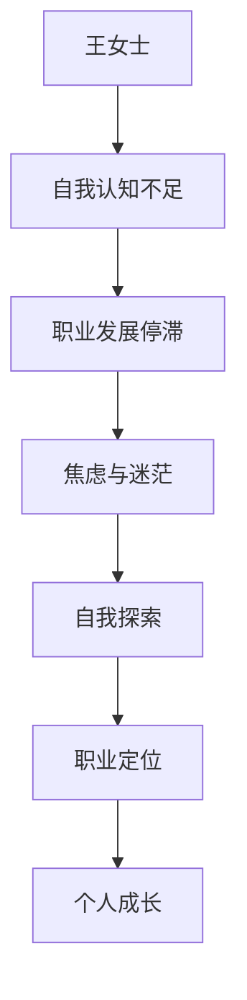
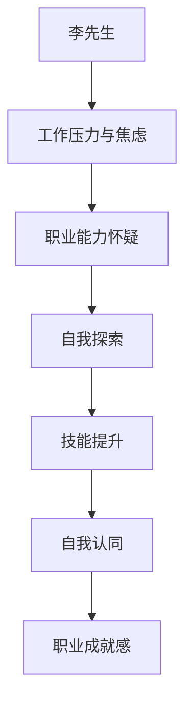
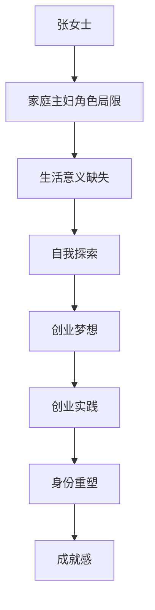

                 

### 文章标题：后身份焦虑时代的自我探索课程

在当今社会，身份焦虑已经成为许多人生活中的一部分。随着职业压力、社会期望和个人发展的多重挑战，人们时常感到困惑和不安。在这个背景下，自我探索成为一种迫切的需求，它不仅关乎个人的心理健康，更影响到我们如何在职场和社会中找到自己的位置。本文旨在探讨后身份焦虑时代的自我探索课程，旨在为读者提供一套逻辑清晰、结构紧凑、简单易懂的解决方案。

**关键词：** 身份焦虑，自我探索，职业发展，心理健康，社会定位。

**摘要：** 本文通过深入分析身份焦虑的成因、自我探索的重要性以及应对策略，帮助读者在后身份焦虑时代找到自我，重塑身份。文章结构分为五个部分，从认知与理解身份焦虑、自我探索的路径与方法、应对策略与实践、个人成长与身份重塑，到后身份焦虑时代的生活启示，系统性地阐述了自我探索的过程和策略。最后，通过实践案例集，为读者提供具体的操作指南。

文章的主要部分将按照以下结构展开：

1. **身份焦虑的认知与理解**
   - **定义与特点**
   - **成因分析**
   - **影响**

2. **自我探索的路径与方法**
   - **重要性**
   - **路径选择**
   - **方法论**

3. **应对身份焦虑的策略与实践**
   - **心理调适策略**
   - **社交支持网络建设**
   - **生活质量提升实践**

4. **个人成长与身份重塑**
   - **重要性**
   - **过程**
   - **案例分析**

5. **后身份焦虑时代的生活启示**
   - **生活态度的调整**
   - **职业规划与人生目标**
   - **社会责任与自我实现**

6. **自我探索实践案例集**
   - **案例一**
   - **案例二**
   - **案例三**

7. **附录**
   - **相关书籍与资源推荐**
   - **自我探索实践工具与技巧**

通过本文的逐步分析和详细讲解，我们希望能够帮助读者在后身份焦虑时代找到自我，实现个人成长和身份重塑。

### 身份焦虑的定义与特点

身份焦虑，是指个体在面对自我认同、角色定位和社会期望时产生的紧张、不安和迷茫情绪。这种焦虑感不仅仅是对特定事件的反应，而是深植于个体内心的长期情绪状态。根据心理学家埃里克·埃里克森的理论，身份焦虑是成长过程中的一个关键阶段，是个人从无序到有序、从依赖到独立的重要转折点。

身份焦虑的特点可以从以下几个方面来理解：

首先，身份焦虑常常表现为对自我认同的困惑。个体可能对自己的职业、社会角色、生活方式等方面产生疑问，无法确定自己的价值和定位。这种困惑往往源于外部环境的复杂性和个人内心的不确定性。

其次，身份焦虑伴随着强烈的自卑感。个体在面对他人的成功和成就时，可能会产生自卑情绪，感觉自己无法胜任或无法满足他人的期望。这种自卑感加剧了个体内心的焦虑和不安。

再次，身份焦虑会导致个体的行为失调。为了逃避焦虑，个体可能会采取一些不健康的应对策略，如过度工作、沉迷于网络、逃避现实等。这些行为不仅无法解决根本问题，反而可能加重焦虑情绪。

最后，身份焦虑对个体的心理健康和社交生活产生深远影响。长期的焦虑情绪可能导致抑郁、焦虑症等心理问题，影响个体的情绪稳定和人际关系。同时，身份焦虑也可能导致社交回避，使个体难以建立和维护稳定的人际关系。

通过上述分析，我们可以看到身份焦虑是一个复杂而深远的心理现象，它不仅影响个体的内心感受，还关系到个体的社会功能和人际关系。了解身份焦虑的定义和特点，是理解自我探索和应对策略的第一步。

### 身份焦虑的成因分析

身份焦虑的形成并非单一因素所致，而是由多种内外部因素交织作用的结果。首先，社会环境是身份焦虑的重要成因之一。现代社会竞争激烈，对个人能力和成就的期望不断升高，导致个体感到压力和焦虑。尤其是在职场环境中，职业成功和社会地位往往被作为衡量个人价值的标准，使得个体在面对这些期待时感到不堪重负。

其次，文化因素也在身份焦虑的形成中起到了重要作用。不同的文化背景对个体身份的认同有着不同的影响。在强调个人主义的文化环境中，个体更注重自我实现和自我价值的追求，这可能导致个体在探索身份的过程中感受到更大的压力。而在集体主义文化中，个体往往需要与家庭、社区和团体保持紧密联系，身份的认同更多依赖于外部群体的认可和接受。

家庭环境对个体身份焦虑的影响也不容忽视。家庭是个人最早接触的社会单元，家庭关系和亲子互动对个体的身份认同有着深远的影响。如果家庭环境充满矛盾和冲突，个体可能会在成长过程中产生自我怀疑和不安。相反，一个温馨和谐的家庭环境可以为个体提供安全感和支持，帮助个体更好地建立自我认同。

个人经历也是身份焦虑形成的一个重要因素。个体在成长过程中经历的挫折和失败，如学业上的不如意、职业发展的瓶颈等，都可能导致身份焦虑的产生。这些经历使个体对自身的价值产生怀疑，从而影响到个体的身份认同。

此外，个体的性格特征和心理素质也在身份焦虑的形成中起到了关键作用。性格内向、敏感和多疑的个体更容易产生身份焦虑。同时，心理素质较差的个体在面对压力和挑战时，可能缺乏有效的应对机制，从而加剧焦虑情绪。

通过以上分析，我们可以看到，身份焦虑的形成是多因素共同作用的结果。理解这些成因有助于我们更好地应对身份焦虑，找到有效的自我探索和调整方法。

### 身份焦虑的影响

身份焦虑对个体心理和社交生活的影响是多方面且深远的。首先，从心理健康角度来看，长期的身份焦虑可能导致情绪问题的加剧，如抑郁、焦虑症等。焦虑情绪会不断累积，影响个体的情绪稳定性，使其在面对生活中的挑战时感到更加无助和无力。这种情绪上的波动不仅影响个体的心理健康，还可能对其生活品质产生负面影响。

其次，身份焦虑对社交生活也有显著影响。由于焦虑感，个体可能会出现社交回避行为，避免与他人进行深入的交流和互动。这种社交回避不仅限制了个体建立和维护稳定人际关系的机会，还可能加剧个体的孤独感。长期处于孤独状态会使个体对自我价值的认同进一步受到挑战，从而形成恶性循环。

此外，身份焦虑对职业发展也存在一定的阻碍。在职场中，身份焦虑可能导致个体过度担忧自己的职业定位和未来发展，从而影响到工作表现和职业规划。焦虑情绪使个体难以集中精力，效率降低，进而影响到工作成就和晋升机会。同时，个体可能因为害怕失败或担心无法达到他人的期望，而放弃尝试新的挑战或机会，从而错失个人成长和发展的良机。

最后，身份焦虑还可能影响到个体的生活质量。长期处于焦虑状态会使个体在各个方面感到疲惫和无力，影响日常生活和工作效率。这种生活质量的下降不仅对个体的身心健康造成负面影响，还可能影响到家庭生活和人际关系的和谐。

总之，身份焦虑对个体的心理健康、社交生活和职业发展都有显著影响。了解这些影响，有助于我们更加重视身份焦虑的问题，并采取积极的措施进行应对和调整。

### 自我探索的重要性

自我探索在应对身份焦虑中扮演着至关重要的角色。首先，自我探索能够帮助个体建立清晰的自我认知，明确自己的价值观、兴趣和优势。这种清晰的认知有助于个体在面临外部压力和挑战时，保持内心的稳定和自信。通过自我探索，个体能够更好地理解自己的情绪和行为模式，从而找到更有效的应对策略。

其次，自我探索有助于个体找到自己的内在动机和目标。在现代社会中，许多人感到迷茫和不安，很大程度上是因为他们没有明确的个人目标和价值观。通过自我探索，个体可以深入了解自己的内心需求，明确自己的人生方向，从而减少迷茫感和焦虑情绪。

此外，自我探索还能够帮助个体建立积极的心理状态。自我探索过程中，个体会不断反思和调整自己的行为和思维模式，这有助于培养积极的自我概念和情绪调节能力。通过自我探索，个体能够学会更加平和地面对生活中的挑战和变化，增强心理韧性。

最后，自我探索还能够促进个体的人际关系和社会适应能力。通过深入了解自己，个体能够更加真诚和自信地与他人交流和互动，建立更深厚的人际关系。同时，自我探索也有助于个体在社会中找到自己的位置，增强社会认同感和归属感。

总之，自我探索是应对身份焦虑的有效途径。它不仅有助于个体建立清晰的自我认知和明确的目标，还能够促进积极的情绪状态和人际关系。通过自我探索，个体能够更好地应对身份焦虑，实现个人成长和心理健康。

### 自我探索的路径选择

自我探索的路径选择多样，每一种路径都有其独特的特点和适用场景。以下是一些常见的自我探索路径及其优缺点：

1. **心理咨询**

心理咨询是一种通过专业心理师的帮助，帮助个体深入了解自我、解决心理问题的方法。优点在于专业性和隐私性，心理咨询师能够提供专业的理论指导和实际操作建议，帮助个体明确自己的情感和需求。缺点是心理咨询费用较高，且需要定期进行，对时间和经济有一定的要求。

2. **自我反思日记**

自我反思日记是通过记录每天的经历、感受和思考，帮助个体深入理解自己的情绪和行为模式。优点在于操作简便、成本低，适合长期坚持。缺点是缺乏专业指导，可能难以深入解决问题。

3. **阅读和书籍**

通过阅读心理学、哲学和自助类书籍，个体可以获取大量的理论知识，帮助自己进行自我探索。优点是内容丰富、获取方便，适合自学和自我提升。缺点是书籍内容往往较为理论化，可能缺乏实际操作指导。

4. **冥想和放松训练**

冥想和放松训练是一种通过冥想、深呼吸等方法，帮助个体放松身心、提高自我意识的途径。优点在于简单易行、效果显著，适合在各种环境中进行。缺点是需要一定的时间投入，且初学者可能难以掌握技巧。

5. **参加团体活动和社交网络**

通过参加团体活动和社交网络，个体可以在互动中了解自己，同时获得他人的反馈和支持。优点在于互动性强、反馈及时，有助于建立社交支持和归属感。缺点是需要一定的社交能力和时间投入。

6. **职业咨询和规划**

职业咨询和规划是通过专业人士的帮助，帮助个体明确职业目标和路径的方法。优点在于专业性强、目标明确，适合有职业发展需求的个体。缺点是费用较高，且需要定期咨询。

选择自我探索的路径时，个体应根据自己的实际情况和需求进行权衡。同时，多种路径的结合使用，往往能取得更好的效果。例如，结合心理咨询和自我反思日记，可以在专业指导和自我反思中找到平衡，从而达到更深入的自我探索。

### 自我探索的方法论

自我探索不仅需要选择合适的路径，还需要采用科学的方法论。以下几种方法在自我探索中尤为重要：

1. **心理测量工具**

心理测量工具，如自我评估问卷和性格测试，可以帮助个体从不同维度了解自己的心理状态和性格特征。常见的工具有MBTI（迈尔斯-布里格斯性格类型指标）、大五人格测试（Big Five Personality Test）等。这些工具通过标准化的量表和评估体系，提供量化的结果，帮助个体清晰地认识自己。

   **使用示例：**
   ```plaintext
   大五人格测试结果显示，我具有较高的开放性和宜人性，但低分值则表明我在尽责性和神经质方面需要改进。这让我意识到，在职业发展中，我更适合创新和人际互动的职位，而在责任感和情绪管理上需要进一步努力。
   ```

2. **行为记录与分析**

行为记录与分析是一种通过记录自己的行为、情绪和反应，进行系统化分析的方法。例如，通过记录每天的日程、情绪波动和应对策略，个体可以识别出自己的行为模式和情绪触发点。

   **使用示例：**
   ```plaintext
   记录了一段时间后，我发现每周三下午是我情绪最低落的时候，通常是因为工作压力和任务堆积。通过分析，我决定在每周三下午安排一段休息时间，进行冥想或轻松阅读，以缓解压力。
   ```

3. **反思和总结**

反思和总结是通过定期回顾自己的经历和成就，进行自我评估和总结的方法。通过反思，个体可以识别自己的成长点、不足之处和改进空间。

   **使用示例：**
   ```plaintext
   在过去的一年中，我在职业上取得了显著的进步，但也发现自己在时间管理和优先级设定上存在不足。通过反思，我决定采用GTD（Getting Things Done）方法，以更高效地管理工作和生活。
   ```

4. **目标设定和规划**

目标设定和规划是一种通过明确短期和长期目标，制定实现路径的方法。这种方法有助于个体保持动力和方向，同时提升自我管理能力。

   **使用示例：**
   ```plaintext
   我设定了一个短期目标：在接下来的三个月内，提高我的公共演讲技巧。为实现这一目标，我制定了详细的学习计划，包括每周参加一次演讲俱乐部、阅读相关书籍和观看演讲视频。
   ```

通过上述方法，个体可以在自我探索过程中更加系统和深入地了解自己，从而制定出更有效的应对策略。自我探索不是一次性的任务，而是一个持续的过程，需要个体不断反思、调整和进步。

### 心理调适策略

面对身份焦虑，采取有效的心理调适策略是至关重要的。以下是一些科学有效的方法，帮助个体缓解焦虑情绪，提升心理健康。

**1. 认知行为疗法（CBT）**

认知行为疗法（CBT）是一种通过改变负面思维和行为模式来缓解心理问题的方法。该方法的核心在于识别和挑战负面思维，将其转化为更积极、理性的思维方式。

   **应用示例：**
   ```plaintext
   当我感到职业上的不确定性时，我会通过CBT技术，识别出自己那些“我无法胜任这份工作”的负面思维，并将其转化为“我可以通过学习提高自己的技能”的积极思维。
   ```

**2. 冥想和正念练习**

冥想和正念练习能够帮助个体放松身心，减少焦虑情绪。通过专注于呼吸和当下的感受，个体能够从思维杂念中抽离，提升自我意识和平静感。

   **应用示例：**
   ```plaintext
   每天早晨，我会花15分钟进行冥想，专注于呼吸，这让我在整个白天都能保持更加专注和平静。
   ```

**3. 深呼吸练习**

深呼吸是一种简单有效的放松技巧，能够迅速缓解紧张和焦虑。通过深吸气、慢呼气的过程，个体可以降低心率和血压，改善整体情绪状态。

   **应用示例：**
   ```plaintext
   当我感到焦虑时，我会闭上眼睛，进行深呼吸练习。深吸气，数到四，然后缓慢呼气，数到六。这个简单的练习能够立即缓解我的紧张情绪。
   ```

**4. 情绪释放技巧**

情绪释放技巧，如哭泣、呐喊和击打拳击袋，可以帮助个体释放积压的情绪，减轻内心的压力。这些方法能够帮助个体在面对挑战时，更加坚强和冷静。

   **应用示例：**
   ```plaintext
   在遇到重大压力时，我会找一个安静的角落，大哭一场，或者大声呐喊，将内心的焦虑和不安释放出来。这样的情绪释放让我感到轻松和解脱。
   ```

**5. 建立健康的生活习惯**

良好的生活习惯，如规律的作息时间、健康的饮食和适量的运动，能够改善个体的心理状态，提升整体的幸福感。

   **应用示例：**
   ```plaintext
   我每天晚上会保持固定的睡眠时间，早上进行适量的晨练，这让我在白天更加精力充沛，焦虑情绪也有所减轻。
   ```

通过这些心理调适策略，个体可以在日常生活中更好地应对身份焦虑，提升心理健康和幸福感。

### 社交支持网络建设

在应对身份焦虑的过程中，建立一个强大的社交支持网络至关重要。这种网络不仅能够提供情感支持，还能帮助个体获取资源和信息，提升应对能力。以下是一些有效的方法来建设社交支持网络：

**1. ** 扩大社交圈 **

通过参加各类社交活动和团体，个体可以结识新朋友，扩大自己的社交圈。这不仅有助于缓解孤独感，还能为个体提供多样化的视角和经验。

   **应用示例：**
   ```plaintext
   我决定每周参加一次社区的读书会，这不仅让我结识了志同道合的朋友，还拓展了我的知识面和思维方式。
   ```

**2. ** 建立深度联系 **

与几位亲密朋友或家人建立深度联系，能够为个体提供情感上的支持和理解。这些深度联系可以在个体感到焦虑时提供安慰和鼓励。

   **应用示例：**
   ```plaintext
   我每周会与我的好友进行一次深度对话，分享自己的困惑和焦虑，这让我感到非常放松和有力量。
   ```

**3. ** 加入互助小组 **

加入相关的互助小组，如职业发展小组、心理健康支持小组等，个体可以在共同的话题和经历中找到共鸣和支持。这些小组提供了一个分享经验和寻求建议的平台。

   **应用示例：**
   ```plaintext
   我加入了职业发展互助小组，与其他正在经历类似职业焦虑的成员一起讨论和解决问题，这让我感到自己并不孤单。
   ```

**4. ** 建立线上社区 **

利用社交媒体和在线论坛，个体可以与全球的同行和爱好者建立联系。这种线上社区不仅提供了丰富的信息资源，还能为个体提供一种无时无刻的社交支持。

   **应用示例：**
   ```plaintext
   我加入了一个关于职业规划的热门论坛，通过参与讨论和分享经验，我不仅获得了宝贵的建议，还结识了许多有共同目标的伙伴。
   ```

通过上述方法，个体可以有效地建设一个强大的社交支持网络，从而在应对身份焦虑时获得更多的力量和资源。

### 生活质量提升实践

在应对身份焦虑的过程中，提升生活质量是一个重要的策略。以下是一些实践方法，帮助个体在日常生活中改善身心健康，提升生活质量。

**1. 保持健康的饮食**

健康的饮食是提升生活质量的基础。个体应确保饮食均衡，摄入足够的蛋白质、维生素和矿物质。避免过多摄入高糖、高脂肪的食物，减少加工食品的摄入。

   **实践示例：**
   ```plaintext
   我每天都会吃一份含有蔬菜、水果和全谷物的健康早餐，这让我在一天中都能保持充沛的精力。
   ```

**2. 坚持适量运动**

适量的运动不仅能够提升身体素质，还能改善心理健康。每天进行至少30分钟的中等强度运动，如快走、慢跑、瑜伽等，有助于缓解焦虑情绪，提升心情。

   **实践示例：**
   ```plaintext
   我每天都会在晚上进行30分钟的瑜伽练习，这让我感到身心放松，焦虑情绪也有所减轻。
   ```

**3. 确保充足睡眠**

充足的睡眠对于身心健康至关重要。个体应确保每晚至少7-8小时的睡眠时间，保持规律的作息时间，避免熬夜。

   **实践示例：**
   ```plaintext
   我每天晚上都会在10点上床睡觉，确保早上能有充足的睡眠时间，这让我在白天更加清醒和专注。
   ```

**4. 培养兴趣爱好**

培养兴趣爱好可以丰富个体的生活，提升幸福感。无论是阅读、绘画、音乐、旅行等，都可以为个体提供放松和愉悦的时光。

   **实践示例：**
   ```plaintext
   我喜欢每周花几个小时学习一门新语言，这不仅提升了我的技能，也让我感到充实和快乐。
   ```

**5. 定期进行自我反思**

定期进行自我反思有助于个体了解自己的情绪和行为模式，找到提升生活质量的方法。例如，每周花时间记录自己的感受和成就，制定改进计划。

   **实践示例：**
   ```plaintext
   我每周会花几个小时进行自我反思，总结过去一周的感受和成就，并制定下周的计划和目标。
   ```

通过上述实践方法，个体可以有效地提升生活质量，从而更好地应对身份焦虑，实现身心健康和幸福感。

### 个人成长的重要性

个人成长是应对身份焦虑的重要手段，它不仅帮助个体提升自我认同感和自信心，还能增强应对各种挑战的能力。首先，个人成长有助于个体在职业和生活中找到方向，明确自己的目标和价值观。通过不断学习和提升技能，个体能够更好地适应环境变化，减少焦虑感。

其次，个人成长有助于培养积极的心态。在面对困难和挑战时，具备成长心态的个体会视其为成长的机会，而不是失败的标志。这种积极的心态能够帮助个体保持乐观和自信，从而更好地应对身份焦虑。

此外，个人成长还能提升个体的心理韧性。通过不断挑战自我、面对失败并从中吸取经验，个体能够增强心理韧性，减少焦虑情绪。个人成长过程中的每一次成功和进步，都会为个体积累信心，提升自我效能感。

最后，个人成长有助于建立良好的人际关系。具备成长心态的个体更容易与他人建立深层次的联系，因为他们愿意分享自己的经历和感受，同时也愿意倾听他人的故事。这种互帮互助的关系网络，不仅能够为个体提供情感支持，还能帮助他们在社会中找到自己的位置。

总之，个人成长是应对身份焦虑的重要策略，它通过提升自我认同感、培养积极心态、增强心理韧性以及建立良好人际关系，帮助个体更好地应对生活中的挑战和不确定性。

### 身份重塑的过程

身份重塑是一个动态且持续的过程，它涉及到个体对自身认知的深度反思和不断调整。首先，个体需要识别和接受当前的身份焦虑状态，这包括对自己的职业定位、社会角色以及生活方式的审视。通过自我反思，个体可以明确哪些方面需要改变和提升。

接下来，个体需要设定具体的目标和计划。这些目标应具备明确性和可实现性，以便个体能够逐步实现。例如，如果个体感到职业发展停滞，他们可以设定学习新技能、参加培训课程或寻找新工作的目标。这些具体的目标将为身份重塑提供方向和动力。

在目标设定之后，个体需要采取行动。行动是实现目标的关键步骤，包括学习新技能、拓展人际关系、参与社区活动等。通过这些实际行动，个体不仅能够积累新的经验和资源，还能逐渐改变自己的身份认知。

此外，身份重塑过程中，个体需要不断反思和调整自己的行为和思维方式。这包括评估目标的实现情况，识别自己在过程中遇到的挑战和障碍，并寻找解决方案。通过这种持续的反思和调整，个体能够逐步实现身份的重塑，找到更加符合自己价值观和社会期望的角色定位。

最后，身份重塑是一个长期的过程，需要个体的耐心和坚持。在重塑过程中，个体可能会遇到挫折和困难，但通过保持积极的心态和不断努力，他们能够最终实现自我成长和身份的转型。

### 身份重塑的案例分析

为了更深入地理解身份重塑的过程，以下是三个具体的案例，它们展示了个人如何通过自我探索和行动成功地重塑自己的身份。

**案例一：从职场迷茫到行业专家的转变**

张先生曾是一名普通的办公室职员，长期感到工作无趣且缺乏成就感。他通过参加职业咨询师的建议，决定进行自我探索，重新定义自己的职业方向。首先，张先生通过性格测试和职业评估工具，确定了他在技术领域的天赋和兴趣。随后，他制定了详细的职业发展计划，包括参加专业培训、自学编程技能，并参与开源项目。经过几年的努力，张先生成功转型为一名行业专家，不仅提升了职业满意度，还获得了行业内的高度认可。

**案例二：从自我怀疑到自信领导者的转变**

李女士是一家公司的中层管理者，一直感到自己的领导能力不足，缺乏自信。她在参加领导力培训课程后，开始进行自我反思，识别出自己内心的恐惧和不确定感。通过不断的实践和反馈，李女士学会了如何有效沟通和激励团队。她积极参与公司的重要项目，承担更多的责任，并通过日记记录自己的成长过程。经过一段时间的努力，李女士逐渐克服了自我怀疑，成为公司中备受尊敬的领导者。

**案例三：从家庭主妇到独立创业者的转变**

王女士是一名家庭主妇，长期在家照顾孩子和家务。她感到自己的生活缺乏意义和成就感。在一次家庭聚会中，王女士的亲戚鼓励她发挥自己的特长，尝试创业。王女士在深思熟虑后，决定开设一家自己的网店，销售手工艺品。她通过自学电商知识、参加在线课程，逐渐掌握了电商运营的技巧。虽然初期面临诸多挑战，但王女士坚持不懈，逐步建立了稳定的客户群体，实现了从家庭主妇到独立创业者的身份转变。

这些案例展示了不同背景的个体如何通过自我探索和行动，成功地重塑自己的身份。他们通过明确目标、持续学习和实践，克服了内在的焦虑和外在的挑战，实现了个人成长和身份的转变。这些案例不仅提供了具体的操作指南，也为其他在身份重塑过程中遇到困惑的个体提供了启示和鼓励。

### 后身份焦虑时代的生活启示

在后身份焦虑时代，个体需要调整生活态度，明确职业规划与人生目标，并承担社会责任与自我实现。首先，生活态度的调整至关重要。个体应培养积极向上的心态，接受生活中的不确定性和变化。通过积极的心态，个体能够更好地应对焦虑情绪，保持内心的平静和稳定。

其次，职业规划与人生目标是应对身份焦虑的有效策略。个体应明确自己的职业发展方向和人生目标，制定具体的行动计划。例如，通过设定短期和长期目标，个体可以逐步实现职业成长和个人价值的提升。同时，定期评估和调整职业规划，确保目标的实现与个人兴趣和市场需求相匹配。

此外，承担社会责任与自我实现是后身份焦虑时代的重要生活启示。个体应关注社会问题，积极参与公益活动，实现个人价值的同时，为社会做出贡献。通过参与社会活动，个体可以找到更深的满足感和归属感，从而减轻身份焦虑。

总之，后身份焦虑时代的生活启示包括积极的生活态度、明确的职业规划与人生目标，以及承担社会责任与自我实现。通过这些启示，个体能够在复杂多变的社会环境中找到自我，实现个人成长和心理健康。

### 自我探索实践案例集

为了更直观地展示如何进行自我探索，我们精选了三个具体案例，详细讲解自我探索的过程、方法及其成果。这些案例涵盖了不同背景的个体，展示了如何通过自我探索实现个人成长和身份重塑。

#### 案例一：从迷茫到职业定位的转变

**背景介绍：**

王女士是一名在一家大型企业工作的职员，工作多年后逐渐感到自己的职业发展停滞，内心充满迷茫和焦虑。她不确定自己的职业方向，对未来的生活感到不确定。

**核心概念与联系：**


**方法与过程：**

1. **自我评估：** 王女士通过性格测试和职业兴趣评估，识别出自己在创造力和组织能力上的优势，同时也发现了自己对于教育行业的兴趣。
2. **信息收集：** 她通过参加职业发展研讨会、阅读相关书籍和与行业专家交流，收集了大量关于教育行业的知识和信息。
3. **目标设定：** 王女士设定了一个具体的目标，即在一年内转型为教育行业的从业者，并制定了详细的职业发展计划。
4. **行动计划：** 王女士参加了教育相关的专业培训课程，通过学习获得了教学资格证书，同时开始在家乡一所学校兼职教课。

**成果与反思：**

经过一年的努力，王女士成功转型为一名教育工作者，不仅找回了职业的成就感，还提升了自我认同感。她通过反思总结，认识到自我探索的重要性，并决定在未来的职业生涯中继续进行自我提升和探索。

#### 案例二：从焦虑到自我认同的提升

**背景介绍：**

李先生是一名软件工程师，工作压力大，经常感到焦虑和不安。他对自己的职业能力产生怀疑，担心无法应对日益复杂的编程任务。

**核心概念与联系：**


**方法与过程：**

1. **心理调适：** 李先生通过咨询心理医生，学会了一些应对焦虑的技巧，如深呼吸、冥想等。
2. **技能提升：** 他报名参加了在线编程课程，系统学习了最新的编程技术和工具。
3. **项目实战：** 李先生主动承担了公司的一个重要项目，通过实践不断提升自己的编程能力。
4. **反馈与调整：** 李先生定期与导师和同事进行反馈交流，不断调整自己的学习计划和职业方向。

**成果与反思：**

经过几个月的努力，李先生不仅克服了焦虑情绪，还获得了同事和领导的认可。他通过实际项目积累了丰富的经验，提升了自我认同感。李先生认识到，自我探索不仅仅是技能的提升，更是心理和情感的调整过程。

#### 案例三：从家庭主妇到创业者的转变

**背景介绍：**

张女士是一名家庭主妇，长期在家照顾孩子和家庭。她感到自己的生活缺乏意义，对未来的生活感到迷茫和不安。

**核心概念与联系：**


**方法与过程：**

1. **自我评估：** 张女士通过自我反思，识别出自己的特长和兴趣爱好，例如对烹饪和手工制作有浓厚的兴趣。
2. **市场调研：** 她通过网络调研和实际考察，发现了市场上对个性化烘焙和手工艺品的需求。
3. **创业规划：** 张女士制定了详细的创业计划，包括产品定位、市场推广和资金管理。
4. **创业实践：** 张女士开始在家制作烘焙产品和手工艺品，通过社交媒体平台进行销售。

**成果与反思：**

经过一段时间的努力，张女士的创业项目取得了成功，不仅实现了经济独立，还找到了生活的意义和成就感。她通过创业实践，成功实现了从家庭主妇到创业者的身份转变，同时也为其他家庭主妇提供了榜样和启示。

通过这三个案例，我们可以看到自我探索在不同背景下的应用和成效。无论是职业发展、心理调适还是创业实践，自我探索都是实现个人成长和身份重塑的重要途径。这些案例不仅提供了具体的操作步骤，也为其他在自我探索道路上迷茫的个体提供了宝贵的经验和启示。

### 附录

#### 相关书籍与资源推荐

**1. 《自我探索之旅：克服身份焦虑的指南》**
作者：约翰·格里菲斯
推荐理由：本书通过生动的案例和实用的方法，帮助读者进行自我探索，克服身份焦虑。

**2. 《人生策略：如何规划你的职业生涯和人生目标》**
作者：大卫·巴赫
推荐理由：本书详细介绍了如何设定职业和人生目标，提供了一套完整的策略框架。

**3. 《心理咨询师与你谈：如何应对身份焦虑》**
作者：玛丽·卡尔森
推荐理由：本书由专业心理咨询师撰写，从心理学角度深入分析身份焦虑的成因和应对方法。

**4. 《冥想：简单有效的自我探索工具》**
作者：肖恩·希尔
推荐理由：本书介绍了冥想的基本方法和益处，适合初学者进行自我探索和情绪管理。

**5. 《社交技巧：如何建立和维护良好的人际关系》**
作者：理查德·尼尔森
推荐理由：本书提供了丰富的社交技巧和策略，帮助个体提升社交能力，建立支持网络。

#### 自我探索实践工具与技巧

**1. 自我评估问卷：** 利用在线自我评估工具，如MBTI、大五人格测试等，帮助个体了解自己的性格特点和优势。

**2. 反思日记：** 使用日记记录每天的经历、感受和思考，进行系统化的自我反思。

**3. 目标设定工具：** 如SMART目标设定法，确保目标具体、可衡量、可实现、相关性高和时间限定。

**4. 冥想APP：** 如Headspace、Calm等，提供指导冥想和放松练习，帮助个体进行心理调适。

**5. 项目管理工具：** 如Trello、Asana等，帮助个体规划和追踪自己的行动计划和目标实现进度。

通过以上书籍和资源，以及实践工具和技巧，读者可以更加系统地开展自我探索，实现个人成长和身份重塑。希望这些推荐能够为读者的自我探索之旅提供有价值的指导和帮助。

