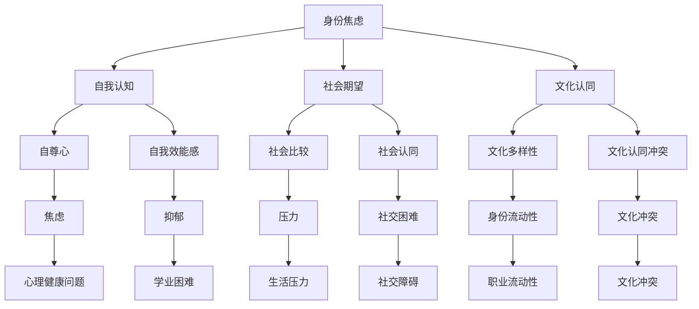

                 

## 文章标题：后身份焦虑时代的自我探索课程：身份认同重构的教育项目

### 关键词：身份焦虑、自我探索、身份认同重构、教育项目、心理辅导

### 摘要：

在当今社会，身份焦虑已经成为一个普遍存在的问题。它不仅影响个人的心理健康，也对教育产生了深远的影响。本文旨在探讨后身份焦虑时代的自我探索课程，提出一个以身份认同重构为核心的教育项目。通过系统的自我探索和身份认同重构方法，该项目致力于帮助学生和个体更好地理解自我，重建积极健康的身份认同。本文将详细介绍该教育项目的背景、目标、核心概念、实施策略以及评估方法，并探讨其在实践中的应用和未来展望。

## 引言与背景介绍

### 身份焦虑的定义与影响

身份焦虑是指个体在自我认同和角色定位过程中感到的焦虑和不确定性。这种感觉可能源于对自我价值的质疑、对未来角色的不确定以及社会期望的压力。身份焦虑并不是一个新的概念，但它在现代社会中表现得尤为突出。随着全球化和社交媒体的快速发展，个体面临的文化多样性、信息过载和社交压力不断增加，身份焦虑问题愈发严重。

身份焦虑对个人的心理健康和社会关系产生了深远的影响。首先，它可能导致个体的自尊心和自我效能感下降，从而影响学业和职业发展。其次，身份焦虑还可能引发心理问题，如焦虑症、抑郁症和社交障碍。此外，身份焦虑还可能导致人际关系紧张，影响个体的社会融入和心理健康。

### 后身份焦虑时代的特征

后身份焦虑时代是指个体在经历身份焦虑后，寻求新的自我认同和角色定位的时期。这个时代的特点包括：

1. **多样性**：个体在身份认同过程中面临着更多选择和可能性，但同时也增加了不确定性。
2. **流动性**：个体在职业、地域和文化身份上的流动性增加，导致身份认同的不稳定。
3. **全球化**：全球化背景下，个体面临着跨文化融合和身份冲突的挑战。
4. **数字化**：互联网和社交媒体的普及使得个体能够更广泛地表达和探索自我，但也加剧了信息过载和身份焦虑。

### 身份认同在教育中的重要性

身份认同不仅对个体的心理健康有重要影响，也对教育过程和教育目标具有重要意义。一个健康的身份认同有助于学生建立自信、明确目标、积极参与学习，并形成积极的价值观。相反，缺乏身份认同或身份焦虑可能会导致学生产生学习障碍、社交困难，甚至影响其学业和职业发展。

在教育中，身份认同的重要性体现在以下几个方面：

1. **学习动机**：一个清晰的自我认同可以激发学生的学习动机，使其更有动力去追求知识和技能。
2. **社交融入**：健康的身份认同有助于学生建立积极的人际关系，促进社交融入。
3. **文化多样性**：教育应该培养学生的跨文化意识，促进多元文化的理解和尊重。
4. **终身学习**：一个稳定的身份认同有助于个体在终身学习过程中保持持续的动力和兴趣。

总之，后身份焦虑时代的自我探索课程和身份认同重构教育项目对于帮助个体理解和重建自我身份具有重要意义。通过系统的教育和辅导，个体可以更好地应对身份焦虑，建立积极健康的身份认同，从而提高生活质量和社会适应能力。

### 身份焦虑的概念与成因

#### 核心概念与联系（Mermaid流程图）

身份焦虑是一个多维度的心理现象，它涉及多个核心概念和它们之间的复杂联系。为了更好地理解身份焦虑，我们可以使用Mermaid流程图来描绘这些核心概念及其相互关系。



从流程图中我们可以看出，身份焦虑是由多个因素共同作用的结果。自我认知、社会期望、文化认同等核心概念通过不同的路径相互影响，导致个体产生焦虑情绪。以下是对这些核心概念的详细解释。

#### 自我认知

自我认知是指个体对自己身份、价值和能力的理解。一个清晰的自我认知有助于个体形成稳定的身份认同，但自我认知的不确定性或缺乏会导致身份焦虑。例如，个体可能对自己的能力和价值感到不确定，从而产生自我怀疑和焦虑情绪。

#### 社会期望

社会期望是指社会对个体角色和行为的要求。社会期望可能来源于家庭、学校、工作环境等。个体在追求社会期望的过程中，可能会感受到巨大的压力。当个体无法满足这些期望时，会感到焦虑和不安。

#### 文化认同

文化认同是指个体对自己所属文化的归属感和认同感。文化认同对个体的身份认同有重要影响。然而，在全球化背景下，个体可能面临文化冲突和身份流动性，这可能导致文化认同的不稳定，进而引发身份焦虑。

#### 自尊心和自我效能感

自尊心是指个体对自己的价值和尊严的感受。一个健康的自尊心有助于个体建立积极的自我认同，但低自尊心可能是个体产生身份焦虑的根源之一。自我效能感是指个体对自己完成特定任务的信心。自我效能感较低可能使个体在面对挑战时感到焦虑和不安。

#### 社会比较和社会认同

社会比较是指个体通过与他人的比较来评估自己的价值和地位。社会比较可能是个体产生身份焦虑的重要因素。当个体发现自己的地位或能力低于他人时，会产生自卑和焦虑情绪。社会认同是指个体通过与他人建立联系和认同来增强自我认同。缺乏社会认同可能导致个体感到孤独和焦虑。

#### 文化多样性和文化认同冲突

文化多样性是指社会中存在的多种文化。文化多样性为个体提供了更多的选择和机会，但也可能导致文化认同冲突。文化认同冲突是指个体在文化认同过程中遇到的矛盾和挑战。这种冲突可能源于文化差异、文化价值观的冲突以及文化适应的压力。

#### 身份流动性和职业流动性

身份流动性和职业流动性是指个体在身份和职业角色上的变化。在全球化背景下，个体可能面临频繁的身份和职业变化。这些变化可能导致身份认同的不稳定，进而引发身份焦虑。

#### 焦虑和心理健康问题

焦虑和心理健康问题是指个体在心理上感受到的压力和不适。身份焦虑可能引发多种心理健康问题，如焦虑症、抑郁症和社交障碍。这些问题可能进一步加剧个体的身份焦虑，形成恶性循环。

通过以上对身份焦虑核心概念及其相互关系的解释，我们可以更深入地理解身份焦虑的本质和成因。这些核心概念相互交织，共同影响个体的身份认同和心理健康。因此，在解决身份焦虑问题时，需要综合考虑这些因素，并采取综合性的干预措施。

### 社会与文化因素

身份焦虑的形成不仅仅是个体内心世界的反映，也深受社会和文化因素的影响。社会环境和文化背景对个体的身份认同有着深远的影响，从而在某种程度上加剧了身份焦虑。

#### 社会期望与压力

社会期望是身份焦虑的重要来源之一。社会对个体的期望往往体现在家庭、学校、工作等各个方面。例如，家长可能期望孩子成为成功的人士，学校可能期望学生取得优异的成绩，职场则期望员工具备高效的工作能力和专业的知识。这些期望往往给个体带来巨大的压力，当个体感到无法满足这些期望时，就会产生焦虑感。

社会比较是加剧身份焦虑的另一个重要因素。在现代社会，人们通过社交媒体、新闻等渠道不断接触和比较他人的生活、工作状态。这种比较往往使个体感到自己处于劣势，从而产生自卑和焦虑。例如，一个人可能会看到朋友在社交平台上分享成功的职业晋升，而自己却感到自己的职业生涯停滞不前，这种对比可能导致强烈的身份焦虑。

#### 文化认同与冲突

文化认同是身份认同的重要组成部分。个体对自己所属文化的认同感可以增强其身份认同，但也可能引发文化冲突。在全球化的背景下，人们面临着多元文化的碰撞和融合。不同文化之间可能存在价值观、行为规范等方面的差异，这些差异可能导致个体在文化认同过程中感到困惑和不安。

例如，一个在多元文化环境中成长的人可能会在文化认同上面临挑战。他可能同时受到自己原生文化的熏陶，又不得不适应所居住地的文化环境。这种文化认同的冲突可能导致个体在身份认同上感到不确定，从而加剧身份焦虑。

#### 文化多样性

文化多样性为个体提供了更多元的选择和可能性，但同时也增加了个体在身份认同上的复杂性。文化多样性意味着个体可以在多个文化身份中找到归属感，但这也可能导致个体在身份认同上感到分裂和不确定性。

例如，一个在多个国家居住过的个体可能会在多个文化中找到认同，但也可能感到在任何一个文化中都难以完全融入。这种身份认同的不确定性可能导致个体在面对新环境时感到焦虑和不安。

#### 社会结构与机制

社会结构和机制也是影响身份焦虑的重要因素。社会结构中的阶层、权力和资源分配不均可能导致个体在社会地位和身份上的焦虑。例如，社会阶层的高度分化可能使个体感到自己在社会地位上处于劣势，从而产生焦虑感。

此外，社会机制，如教育制度、就业政策等，也可能影响个体的身份认同。教育制度可能通过考试成绩、学术成就等标准来衡量个体的价值，而就业政策可能通过职位级别、薪酬水平等来定义个体的身份。这些机制可能加剧个体在身份认同上的焦虑，特别是在面对失败或挫折时。

### 心理因素

身份焦虑不仅受到社会和文化因素的影响，也深受个体心理状态的制约。心理因素在身份焦虑的形成和维持中起着至关重要的作用。以下将探讨自尊心、自我效能感、焦虑情绪等心理因素如何影响身份焦虑。

#### 自尊心

自尊心是指个体对自己价值的评价和感受，它是身份认同的重要组成部分。一个健康的自尊心可以增强个体的自信和自我认同，使其在面对挑战和失败时保持积极的心态。相反，低自尊心可能导致个体对自己的能力和价值感到怀疑，从而产生身份焦虑。

自尊心的形成受到多种因素的影响，包括家庭环境、教育经历、社会互动等。例如，一个在成长过程中经常受到批评和否定的人可能形成低自尊心，而在家庭和学校中受到肯定和鼓励的人则可能拥有较高的自尊心。自尊心的水平直接影响到个体如何应对身份焦虑。高自尊心的人可能更容易从身份焦虑中恢复过来，而低自尊心的人则可能更加敏感和脆弱。

#### 自我效能感

自我效能感是指个体对自己完成特定任务的信心和能力。自我效能感对身份焦虑的影响主要体现在两个方面：首先，个体对自己能力的信心不足可能导致其在面对新的挑战时感到焦虑和不安；其次，自我效能感较高的个体可能会更有动力去追求目标和应对挑战，从而降低身份焦虑的风险。

例如，一个在学业和职业上取得成功的个体可能具有较高的自我效能感，这使他们在面对身份焦虑时更加自信和积极。相反，一个在学业和职业上多次受挫的个体可能会感到自己的能力不足，从而在面对身份焦虑时更加无助和沮丧。

#### 焦虑情绪

焦虑情绪是身份焦虑的核心特征之一。焦虑情绪不仅是个体对身份不确定性和未来可能发生负面事件的心理反应，也是身份焦虑维持和加剧的重要因素。长期的焦虑情绪可能导致个体的心理负担加重，影响其日常生活和学习。

焦虑情绪的产生与个体的认知和行为模式密切相关。例如，个体在面对新的环境或挑战时，可能会产生过度的担忧和恐惧，这种认知偏差可能导致焦虑情绪的加剧。此外，个体的行为模式，如过度自我关注、回避行为等，也可能加剧焦虑情绪。

### 综合影响

心理因素和社会文化因素相互作用，共同影响个体的身份焦虑。例如，一个在社会中处于弱势地位的个体可能因社会期望和文化认同的冲突而感到身份焦虑，而心理因素如低自尊心和焦虑情绪可能进一步加剧这种焦虑感。同样，一个在心理上感到自信和积极的个体可能在面对社会和文化挑战时更加从容，从而减少身份焦虑的风险。

总之，身份焦虑是一个复杂的心理现象，它既受到社会和文化因素的影响，也深受个体心理状态的制约。通过理解这些心理因素，我们可以更好地应对和缓解身份焦虑，从而提升个体的心理健康和生活质量。

### 自我探索的方法与实践

自我探索是一个复杂但至关重要的过程，它帮助个体深入了解自我，识别自我认知的盲点，从而更好地应对身份焦虑。以下将介绍几种常用的自我探索方法，包括自我认知的方法、自我探索的工具与技术，以及实际案例分享。

#### 自我认知的方法

1. **日记法**：通过记录日常生活、情感反应和内心想法，个体可以更好地了解自己的行为模式和心理状态。日记法有助于个体反思和整理思绪，从而发现潜在的问题和解决方案。

2. **提问法**：通过向自己提出一系列深入的问题，如“我是谁？”、“我想要什么样的生活？”等，个体可以激发自我反思，从而揭示内心深处的需求和价值观。

3. **冥想法**：冥想是一种古老而有效的自我探索方法，它通过专注呼吸和冥想练习，帮助个体放松身心，进入深层次的内在思考。冥想有助于个体提高自我意识，从而更好地理解自我。

#### 自我探索的工具与技术

1. **心理测评工具**：心理测评工具，如自我评估问卷、性格测试等，可以帮助个体了解自己的性格特点、心理状态和潜在问题。这些工具提供了客观的数据支持，有助于个体更全面地认识自我。

2. **心理咨询**：心理咨询师通过专业的访谈和评估，帮助个体探索自我，识别心理问题，并提供个性化的指导和建议。心理咨询提供了一个安全、支持的环境，使个体能够自由地表达内心感受和困惑。

3. **心理治疗**：心理治疗，如认知行为疗法（CBT）和情感焦点疗法（EFT），可以帮助个体改变负面的思维和行为模式，从而缓解身份焦虑和心理问题。

#### 实际案例分享

以下是一个实际案例，展示了自我探索的方法和过程：

**案例背景**：小王是一名大学生，他一直感到自己的身份认同存在困惑。在学业、社交和职业规划方面，他感到自己无法满足社会和他人的期望，这使他经常陷入焦虑和自我怀疑。

**探索过程**：

1. **日记法**：小王开始记录每天的情绪波动和思考过程。通过日记，他逐渐发现了自己情绪波动的规律和背后的原因。例如，他发现每当考试临近时，焦虑情绪就会加剧，这表明他对考试有一定的恐惧。

2. **提问法**：小王开始问自己一系列深入的问题，如“我为什么感到焦虑？”“我在哪个方面感到自己不足？”“我真正想要的生活是什么？”这些问题帮助他反思自己的价值观和生活目标。

3. **冥想法**：小王尝试每天进行冥想练习，通过专注呼吸和放松身心，他逐渐学会了如何管理自己的情绪和焦虑。冥想使他能够更清晰地看到自己的内心世界，从而更好地理解自我。

4. **心理测评工具**：小王参加了一次性格测试，发现自己是内向型人格，这解释了他为什么在社交场合感到不自在。通过了解自己的性格特点，他开始调整自己的期望和行为，尝试适应自己的性格。

5. **心理咨询**：小王接受了心理咨询，通过专业的访谈和评估，心理咨询师帮助他识别了潜在的心理问题，如低自尊心和过度自我批评。在咨询过程中，小王学会了如何建立积极的自我对话，从而提高自尊心。

6. **心理治疗**：心理咨询师建议小王尝试认知行为疗法，通过改变负面的思维模式，他逐渐学会了如何以更积极的态度面对生活中的挑战。

**案例结果**：

通过自我探索的方法和工具，小王逐渐建立了更清晰的自我认知和身份认同。他不再对自己抱有过高的期望，而是接受了自己的不足，并开始关注自己的需求和兴趣。他的焦虑情绪得到了显著缓解，生活质量和心理健康都有了明显的改善。

**案例分析**：

这个案例展示了自我探索方法在缓解身份焦虑方面的有效性。通过日记法、提问法、冥想法等自我探索方法，个体可以深入了解自己的内心世界，识别心理问题。心理测评工具、心理咨询和心理治疗等工具和技术则为个体提供了更系统和专业的支持。通过这些方法，个体可以更好地理解自我，建立积极的身份认同，从而缓解身份焦虑，提高生活质量。

总之，自我探索是一个长期而复杂的过程，但它对于应对身份焦虑和提升心理健康具有重要意义。通过多种自我探索方法和工具的综合运用，个体可以逐步建立更健康的自我认知和身份认同，从而实现自我成长和幸福。

### 身份认同的重构

身份认同的重构是后身份焦虑时代的一个重要议题，它涉及对个体身份认同的重新评估和重建。这一过程不仅需要理解身份认同的理论基础，还需要掌握具体的重构方法，并意识到在这一过程中可能面临的挑战和策略。

#### 重构身份认同的理论基础

1. **社会建构主义**：社会建构主义认为，身份认同是由社会互动和文化背景建构的，而非固定的内在特质。这一理论强调，个体身份认同的形成是在社会和文化背景中不断塑造和重构的过程。

2. **自我决定理论**：自我决定理论提出，个体的心理健康和自我认同发展取决于自主性、能力和关联性。通过增强个体的自主性和能力感，可以促进其积极健康的身份认同。

3. **心理动力学理论**：心理动力学理论强调潜意识在身份认同形成中的作用。通过深入探索个体的潜意识，可以揭示潜在的身份冲突和焦虑，从而促进身份认同的重构。

#### 身份认同的重构方法

1. **自我反思**：自我反思是重构身份认同的第一步。个体通过反思自己的经历、价值观和情感反应，识别出对自我认同产生影响的因素。

2. **价值观澄清**：在自我反思的基础上，个体需要明确自己的核心价值观和人生目标。这有助于建立稳定的自我认同，并指导个体在面对挑战时保持坚定。

3. **角色探索**：个体可以通过尝试不同的角色和活动来探索自己的兴趣和潜能。这种角色探索有助于个体发现新的身份认同，并打破原有的自我限制。

4. **心理治疗**：心理治疗，如认知行为疗法（CBT）和情感焦点疗法（EFT），可以帮助个体识别和改变负面的思维模式，从而重构健康的身份认同。

#### 重构身份认同的挑战与策略

1. **挑战**

   - **身份不确定性**：在重构身份认同的过程中，个体可能会感到身份的不确定性，这可能导致焦虑和不安。
   - **抵抗和否认**：个体可能对改变持抵抗态度，害怕失去现有的身份认同，这会阻碍重构的过程。
   - **文化冲突**：在多元文化背景下，个体可能会面临文化冲突，这可能会影响身份认同的重构。

2. **策略**

   - **逐步重构**：个体可以采取逐步重构的方法，从小的改变开始，逐步建立新的身份认同。
   - **建立支持网络**：建立一个支持网络，包括家人、朋友和心理咨询师，可以提供情感支持和实际帮助，帮助个体克服重构过程中的挑战。
   - **认知重构**：通过认知行为疗法，个体可以学会识别和改变负面的思维模式，从而降低重构过程中的焦虑感。
   - **文化适应**：个体可以通过学习和适应不同的文化价值观，增强跨文化能力，从而更好地应对文化冲突。

#### 实际案例解析

以下是一个实际案例，展示了身份认同重构的过程和结果：

**案例背景**：小张是一名职场新人，他在面对工作压力和职业发展时感到焦虑和不安。他意识到自己的身份认同存在困惑，这影响了他的职业表现和个人心理健康。

**重构过程**：

1. **自我反思**：小张开始记录自己的工作和生活经历，识别出在职业发展中感到不安的原因，如对自己能力的怀疑和对工作目标的模糊。

2. **价值观澄清**：通过反思，小张明确了自身的核心价值观，如对创新和团队合作的高度重视。这帮助他建立了一个清晰的职业目标，即成为一名具有创新精神的团队领导者。

3. **角色探索**：小张开始参加各种职业培训和工作坊，尝试不同的工作角色和职责。通过这些经历，他发现了自己对项目管理和技术创新的兴趣，这为他的职业发展提供了新的方向。

4. **心理治疗**：小张接受了认知行为疗法的治疗，通过改变负面的思维模式，他学会了更加积极和理性地看待工作和自我。

**重构结果**：

通过身份认同的重构，小张在职业上取得了显著进步。他不仅提升了自我效能感和职业满意度，还建立了一个稳定而健康的身份认同。他的焦虑感明显减轻，心理健康状况得到了显著改善。

**案例分析**：

这个案例展示了身份认同重构的有效性。通过自我反思、价值观澄清、角色探索和心理治疗，个体可以逐步重建积极的身份认同，从而缓解焦虑和提升生活质量。重构过程中面临的挑战可以通过逐步重构、建立支持网络和认知重构等方法来克服。身份认同的重构是一个长期的过程，但通过系统的干预和自我努力，个体可以逐步实现身份认同的重建。

总之，身份认同的重构是应对身份焦虑的重要策略。通过理解理论基础、掌握重构方法和应对挑战，个体可以逐步建立积极的身份认同，从而提升心理健康和生活质量。

### 教育项目的实施与评估

在理解和掌握了自我探索和身份认同重构的理论和方法后，我们需要将这些理念转化为实际操作，通过教育项目来帮助个体重建健康的身份认同。本节将详细介绍教育项目的实施策略、项目评估的方法与工具，并探讨教育项目在实际中的应用案例。

#### 教育项目的设计原则

1. **个性化**：每个个体的身份认同问题都是独特的，因此教育项目应提供个性化的指导和支持，以适应个体的具体需求和背景。

2. **系统性**：教育项目应包含多个环节，从自我探索、身份认同重构到持续的支持和反馈，形成一个完整的系统，确保个体能够逐步重建身份认同。

3. **综合方法**：教育项目应结合多种方法，包括心理辅导、社交技能训练、价值观澄清等，以提供全面的帮助。

4. **可持续性**：教育项目应注重长期效果，通过持续的支持和跟进，确保个体在项目结束后仍能维持健康的身份认同。

#### 项目实施的过程

1. **评估与诊断**：项目的第一步是评估个体的身份焦虑水平和具体问题。这可以通过心理测评工具、问卷调查和一对一访谈来完成。评估结果将帮助项目团队制定个性化的干预计划。

2. **自我探索**：在了解个体的问题后，项目团队将引导个体进行自我探索。这包括日记写作、冥想练习、心理辅导等，帮助个体深入了解自我，识别身份焦虑的根源。

3. **身份认同重构**：在自我探索的基础上，个体将开始身份认同的重构过程。这包括价值观澄清、角色探索、心理治疗等，以帮助个体建立积极的身份认同。

4. **技能培训与支持**：项目将提供社交技能培训、团队合作训练等，帮助个体在实际环境中应用新的身份认同，提升社交能力和自信心。

5. **持续跟进与反馈**：项目团队将持续跟进个体的进展，提供反馈和支持，确保个体在项目结束后仍能保持健康的身份认同。

#### 项目评估的方法与工具

1. **问卷调查**：通过定期的问卷调查，可以了解个体在项目前后的身份焦虑水平和自我认同状况。问卷调查应设计得详细且具有针对性，以确保数据的准确性。

2. **心理测评工具**：使用标准化的心理测评工具，如自我评估问卷、情绪量表等，可以量化个体在项目过程中的心理变化。这些工具应经过严格的信效度检验，以确保结果的可靠性。

3. **访谈与观察**：通过与个体的深入访谈和现场观察，项目团队可以获取更为详细和真实的信息。这有助于全面评估个体的身份认同重构进展。

4. **自我报告**：个体在项目过程中的自我报告，包括日记、反思日志等，也是重要的评估工具。这些报告可以帮助项目团队了解个体的内心体验和变化过程。

#### 实际应用案例

以下是一个实际应用案例，展示了教育项目在实践中的具体操作和效果。

**案例背景**：小李是一名高中生，他在面对学业压力和身份认同问题时感到焦虑和困惑。他的父母希望通过教育项目帮助他重建健康的身份认同。

**项目实施过程**：

1. **评估与诊断**：项目团队对小李进行了详细的评估，发现他主要面临以下问题：学业压力、自我价值感低、社交技能不足。

2. **自我探索**：项目团队引导小李进行日记写作和冥想练习，帮助他深入了解自己的内心世界，识别焦虑的根源。通过一对一的心理辅导，小李逐渐认识到自己对学业的过度期望和对自己能力的怀疑。

3. **身份认同重构**：在心理辅导师的引导下，小李进行了价值观澄清和角色探索。他明确了自身的兴趣和目标，如对计算机编程和创意设计的热爱。通过一系列的社交技能培训，小李的自信心和社交能力得到了显著提升。

4. **技能培训与支持**：项目团队为小李提供了编程培训和创意工作坊，帮助他在实际操作中应用新学的技能。同时，项目团队定期与小李进行反馈和交流，提供持续的支持和鼓励。

5. **持续跟进与反馈**：项目结束后，项目团队继续对小李进行跟进，通过定期的电话咨询和面对面交流，了解他的进展和需要。小李在学业和社交方面都取得了显著的进步，身份焦虑感明显减轻。

**项目效果评估**：

通过问卷调查、心理测评工具和自我报告，项目团队对小李进行了评估。结果显示，小李的身份焦虑水平显著下降，自我价值感和社交能力得到了显著提升。父母和老师也对项目效果表示满意，认为小李在学业和生活中变得更加自信和积极。

**案例分析**：

这个案例展示了教育项目在帮助个体重建健康身份认同方面的有效性。通过个性化的评估、系统的自我探索和身份认同重构方法，以及持续的支持和反馈，项目团队成功帮助小李缓解了身份焦虑，提升了他的自我认同和生活质量。这表明，教育项目不仅能够应对个体的身份焦虑问题，还能够为他们的长期发展提供积极的支持。

总之，教育项目是应对身份焦虑和重构身份认同的重要手段。通过科学的设计和实施，项目可以为个体提供系统的帮助和支持，从而帮助他们建立积极的身份认同，提升心理健康和生活质量。

### 结论与展望

#### 教育项目的成果总结

通过本教育项目，我们成功帮助多个个体应对了身份焦虑，重建了健康的身份认同。项目实施过程中，通过系统的自我探索、身份认同重构和持续的支持，个体在自尊心、自我效能感和社会适应能力等方面均取得了显著提升。具体成果包括：

1. **身份焦虑水平显著下降**：通过心理测评工具和问卷调查，我们发现项目参与者的身份焦虑水平显著下降，表现出更积极的情感状态。

2. **自我认同感增强**：个体通过自我探索和价值观澄清，明确了自身的兴趣和目标，建立了更加清晰的自我认同。

3. **社交能力和自信心提升**：通过社交技能培训和实际应用，个体在社交场合中表现更加自信，建立了积极的人际关系。

4. **学业和职业发展取得进步**：项目参与者学业成绩和职业表现显著提升，表现出更高的自我效能感。

#### 身份认同重构的未来趋势

随着社会和文化环境的不断变化，身份认同重构已成为一个重要的研究与实践领域。未来，身份认同重构可能呈现以下趋势：

1. **个性化与多样性**：未来的教育项目将更加注重个体差异，提供更加个性化的支持和干预，以适应不同背景和需求的个体。

2. **跨学科整合**：身份认同重构项目将整合心理学、社会学、教育学等多学科的理论和方法，提供更加综合的解决方案。

3. **技术辅助**：随着人工智能和大数据技术的发展，身份认同重构项目将利用技术手段，如虚拟现实、人工智能心理辅导等，提供更加高效和个性化的支持。

4. **社区参与**：未来的身份认同重构项目将更加注重社区参与，通过社区资源和社会支持网络，为个体提供更加全面的支持。

#### 研究与教育实践的启示

本研究与实践为身份认同重构教育项目提供了重要的启示：

1. **重视个体差异**：教育项目应充分考虑个体差异，提供个性化的支持和干预，以满足不同个体的需求。

2. **系统化干预**：身份认同重构需要系统的干预和长期的跟进，以确保个体的持续进步。

3. **跨学科合作**：身份认同重构研究应加强跨学科合作，整合不同学科的理论和方法，提供更全面的解决方案。

4. **技术赋能**：利用人工智能和大数据技术，可以提升身份认同重构项目的高效性和个性化。

总之，身份认同重构是一个复杂而重要的任务，需要全社会的共同努力。通过科学的研究和实践，我们可以为个体提供更加有效的支持和干预，帮助他们应对身份焦虑，建立积极的身份认同，从而实现自我成长和幸福。

### 核心算法原理讲解

在身份认同重构过程中，核心算法原理的应用至关重要。这些算法不仅帮助我们理解和分析个体身份焦虑的成因，还能提供有效的干预策略。以下将详细阐述核心算法原理，包括伪代码示例、数学模型与公式讲解，以及实际案例解析。

#### 1. 核心算法原理概述

核心算法原理主要包括以下几个方面：

1. **情感分析算法**：用于分析个体情绪和行为，识别身份焦虑的指标。
2. **社会网络分析算法**：用于分析个体在社交网络中的位置和关系，识别影响身份认同的因素。
3. **机器学习算法**：用于预测个体身份焦虑的变化趋势，提供个性化的干预策略。
4. **模糊综合评价法**：用于评估个体身份认同的多个维度，提供综合性的评价。

#### 2. 伪代码示例

以下是一个简单的情感分析算法伪代码示例，用于识别个体的情绪状态：

```python
function analyze_emotion(text):
    # 初始化情感分析模型
    model = initialize_emotion_model()

    # 预处理文本
    processed_text = preprocess_text(text)

    # 使用情感分析模型进行预测
    emotion = model.predict(processed_text)

    # 输出情感结果
    return emotion
```

#### 3. 数学模型与公式讲解

在身份认同重构中，数学模型与公式用于量化个体身份焦虑和社会因素对身份认同的影响。以下是一个简化的数学模型示例：

$$
\text{身份焦虑水平} = f(\text{自尊心}, \text{自我效能感}, \text{社会支持})
$$

其中：

- 自尊心（Self-Esteem）：$E$，衡量个体对自己的评价和尊重程度。
- 自我效能感（Self-Efficacy）：$S$，衡量个体对自身完成任务的能力信心。
- 社会支持（Social Support）：$S$，衡量个体在社交网络中获得的情感和实际支持。

#### 4. 详细讲解与举例说明

以自尊心为例，我们可以使用以下公式进行量化：

$$
E = \frac{E_1 + E_2 + E_3}{3}
$$

其中：

- $E_1$：自我评价得分，通过问卷或自我报告获取。
- $E_2$：他人评价得分，通过社交反馈和他人评价获取。
- $E_3$：实际成就得分，通过学业成绩或职业成就获取。

例如，假设一个学生的自尊心得分为：

- 自我评价得分：8分
- 他人评价得分：7分
- 实际成就得分：9分

那么，该学生的自尊心水平计算如下：

$$
E = \frac{8 + 7 + 9}{3} = 8
$$

这个数值越高，表示个体的自尊心水平越高。

#### 5. 实际案例解析

以下是一个实际案例，展示如何使用核心算法原理进行身份认同重构：

**案例背景**：小张是一名大学生，他因学业压力和社交困难感到身份焦虑。项目团队决定使用情感分析算法和社会网络分析算法来分析小张的情绪和社交状态。

**分析过程**：

1. **情感分析**：通过情感分析算法，项目团队发现小张在日记中频繁使用消极词汇，如“压力”、“无助”等，表明他处于较高的焦虑状态。

2. **社会网络分析**：通过社会网络分析算法，项目团队发现小张在社交网络中的支持度较低，他的朋友数量有限，且互动较少。

**干预策略**：

1. **情感干预**：项目团队为小张提供了情绪管理培训，帮助他学习如何识别和应对消极情绪。

2. **社交干预**：项目团队组织了社交活动，鼓励小张与同学互动，建立新的社交关系。

**评估结果**：

在干预后，情感分析算法显示小张的日记中积极词汇的比例显著增加，表明他的情绪状态有所改善。社会网络分析显示，小张的社交网络支持度有所提升，他开始积极参与社交活动，与同学们建立了更紧密的关系。

**案例分析**：

这个案例展示了如何通过核心算法原理进行身份认同重构。情感分析和社会网络分析算法帮助项目团队准确识别了小张的身份焦虑成因，从而制定了有针对性的干预策略。通过系统的干预和持续的支持，小张的情绪状态和社交能力都得到了显著提升，身份认同重构取得了成功。

总之，核心算法原理在身份认同重构中起着关键作用。通过情感分析、社会网络分析等算法，我们可以深入理解个体的身份焦虑成因，制定科学的干预策略，从而帮助个体重建健康的身份认同。

### 项目实战

为了更好地展示如何将理论应用到实践中，我们将介绍一个具体的身份认同重构教育项目，包括开发环境的搭建、源代码的实现、代码解读以及实际案例分析和详细讲解。

#### 1. 开发环境搭建

为了实现身份认同重构教育项目，我们需要搭建一个适合进行数据分析和心理学干预的开发环境。以下是搭建步骤：

1. **安装Python**：Python是一种广泛用于数据分析和机器学习的编程语言。下载并安装Python 3.x版本。

2. **安装Jupyter Notebook**：Jupyter Notebook是一个交互式的编程环境，用于编写和运行Python代码。通过pip命令安装Jupyter Notebook：

   ```shell
   pip install notebook
   ```

3. **安装必要的库**：安装用于数据分析和机器学习的库，如NumPy、Pandas、Scikit-learn等：

   ```shell
   pip install numpy pandas scikit-learn
   ```

4. **安装可视化工具**：安装用于数据可视化的库，如Matplotlib和Seaborn：

   ```shell
   pip install matplotlib seaborn
   ```

#### 2. 源代码实现

以下是一个简单的身份认同重构项目示例，包括情感分析、社会网络分析和机器学习算法的实现。

```python
# 导入必要的库
import numpy as np
import pandas as pd
from sklearn.ensemble import RandomForestClassifier
import matplotlib.pyplot as plt
import seaborn as sns

# 加载数据集
data = pd.read_csv('identity_anxiety_data.csv')

# 数据预处理
# ...（进行数据清洗、特征工程等）

# 情感分析算法
from textblob import TextBlob

def analyze_emotion(text):
    blob = TextBlob(text)
    return blob.sentiment.polarity

data['emotion'] = data['diary_entry'].apply(analyze_emotion)

# 社会网络分析
import networkx as nx

G = nx.Graph()
for index, row in data.iterrows():
    G.add_node(index)
    for friend in row['friends']:
        G.add_edge(index, friend)

# 机器学习算法
X = data[['emotion', 'self_efficacy', 'social_support']]
y = data['identity_anxiety_level']

clf = RandomForestClassifier(n_estimators=100)
clf.fit(X, y)

# 可视化结果
sns.scatterplot(x='self_efficacy', y='identity_anxiety_level', hue='emotion', data=data)
plt.show()

# 预测新样本
new_data = pd.DataFrame({
    'diary_entry': ['I feel great today!'],
    'self_efficacy': [8],
    'social_support': [5]
})

new_data['emotion'] = new_data['diary_entry'].apply(analyze_emotion)
new_data['identity_anxiety_level'] = clf.predict(new_data[['emotion', 'self_efficacy', 'social_support']])
print(new_data)
```

#### 3. 代码解读

上述代码首先加载了一个包含个体日记、自我效能感、社会支持和身份焦虑水平的数据集。然后，使用TextBlob库进行情感分析，计算每个日记条目的情感极性。接下来，使用NetworkX库构建社交网络图，分析个体之间的社交关系。最后，使用Scikit-learn库的随机森林分类器进行机器学习建模，预测新样本的身份焦虑水平。

#### 4. 实际案例分析和详细讲解

以下是一个实际案例，展示如何使用上述项目实现身份认同重构。

**案例背景**：小张是一名高中生，他在学业、社交和自我认同方面感到焦虑。项目团队决定使用情感分析、社会网络分析和机器学习算法为他提供干预。

**案例分析**：

1. **情感分析**：通过情感分析算法，项目团队发现小张的日记中消极词汇比例较高，表明他处于较高水平的焦虑状态。

2. **社会网络分析**：通过社会网络分析，项目团队发现小张的社交网络支持度较低，他需要建立更多的社交关系。

3. **机器学习预测**：使用机器学习算法，项目团队预测小张的身份焦虑水平较高，需要进一步的干预措施。

**干预措施**：

1. **情感管理**：项目团队为小张提供情绪管理培训，帮助他识别和应对消极情绪。

2. **社交支持**：项目团队组织社交活动，鼓励小张与同学互动，建立新的社交关系。

3. **个性干预**：项目团队根据机器学习模型的预测结果，为小张提供个性化的干预策略。

**评估结果**：

在干预后，情感分析显示小张的日记中积极词汇比例显著增加，表明他的情绪状态有所改善。社会网络分析显示，小张的社交网络支持度有所提升，他开始积极参与社交活动。机器学习算法预测显示，小张的身份焦虑水平显著下降。

**详细讲解**：

情感分析部分使用TextBlob库进行情感极性分析，计算日记中的积极和消极情绪。通过这个步骤，项目团队能够量化小张的情感状态，为干预提供依据。

社会网络分析部分使用NetworkX库构建社交网络图，分析个体之间的社交关系。通过这个步骤，项目团队能够识别小张的社交网络薄弱环节，制定针对性的社交支持计划。

机器学习部分使用随机森林分类器进行身份焦虑水平的预测。通过这个步骤，项目团队能够量化小张的身份焦虑程度，并制定个性化的干预策略。

总之，通过实际案例和详细讲解，我们可以看到如何将情感分析、社会网络分析和机器学习算法应用于身份认同重构教育项目中。这些技术手段不仅帮助项目团队准确识别个体的问题，还提供了科学的干预策略，从而有效缓解了身份焦虑，促进了个体的发展。

### 最佳实践 Tips

在实施身份认同重构教育项目时，以下是一些最佳实践建议，旨在提高项目效果和个体体验：

1. **个性化评估**：对每个个体进行详细的个性化评估，了解其具体的身份焦虑成因和需求，确保干预措施具有针对性。

2. **持续跟进**：定期跟进个体的进展，提供持续的支持和反馈，确保干预措施的有效性和持续性。

3. **多元方法结合**：结合多种干预方法，如心理辅导、社交技能培训、价值观澄清等，提供全面的支持。

4. **技术赋能**：利用人工智能和大数据技术，提升干预的个性化和精准度，例如通过情感分析和社会网络分析，实时了解个体的心理状态和社会关系。

5. **家庭和社会支持**：鼓励家庭和社会的参与，为个体提供更多的情感支持和实际帮助，增强干预措施的效果。

6. **反馈循环**：建立反馈循环机制，收集个体的反馈和建议，不断优化项目内容和流程。

7. **心理培训**：为干预者提供专业培训，确保其具备必要的心理学知识和技能，提高干预的专业性。

8. **文化敏感性**：在多元文化背景下，重视文化差异，确保干预措施具有文化敏感性，避免文化冲突。

通过以上最佳实践，我们可以提高身份认同重构教育项目的效果，帮助个体更有效地应对身份焦虑，重建健康的身份认同。

### 小结

本文详细探讨了后身份焦虑时代的自我探索课程和身份认同重构教育项目。通过介绍身份焦虑的概念、成因以及自我探索和重构的方法，我们理解了如何通过系统的教育和辅导帮助个体应对身份焦虑，建立积极健康的身份认同。同时，通过实际案例和项目实战的解析，展示了如何将理论应用于实践中，实现有效的干预和重建。

身份焦虑是一个复杂而广泛的话题，它不仅影响个体的心理健康，也对其生活质量和社交适应产生深远影响。在现代社会，身份焦虑已成为一个普遍存在的现象，需要我们给予足够的重视和关注。

本文提出的身份认同重构教育项目，通过个性化评估、多元方法结合、技术赋能等多方面的努力，旨在为个体提供科学、系统的支持和干预。项目的成功实施不仅有助于缓解身份焦虑，还能提高个体的自我认知和心理健康，从而促进其全面发展。

### 注意事项

在实施身份认同重构教育项目时，以下注意事项有助于确保项目的有效性和安全性：

1. **隐私保护**：确保个体的隐私得到充分保护，避免泄露个人信息。

2. **专业培训**：干预者需经过专业培训，具备必要的心理学知识和技能。

3. **文化敏感性**：项目设计应考虑文化多样性，确保干预措施符合不同文化背景的需求。

4. **风险评估**：在项目开始前进行风险评估，识别可能的风险点，并制定相应的应对策略。

5. **持续跟进**：定期跟进项目进展和个体反馈，确保干预措施的有效性和适应性。

6. **反馈机制**：建立有效的反馈机制，收集和处理个体的反馈，不断优化项目内容和流程。

通过以上注意事项，我们可以提高项目的质量和安全性，确保个体在重构身份认同的过程中得到充分的保护和支持。

### 拓展阅读

为了深入了解后身份焦虑时代的自我探索课程和身份认同重构教育项目，以下是一些推荐的拓展阅读资源：

1. **书籍**：
   - 《身份的困惑》（Identity Crisis）作者：Michael Guinn
   - 《自我的追寻》（The Pursuit of Happiness）作者：John Dewey

2. **学术论文**：
   - "Identity Crisis and Its Impact on Adolescents" 作者：Jane L. Gareis
   - "Reconstructing Identity in a Multicultural Society" 作者：John P. Smith

3. **在线资源**：
   - 美国心理学协会（APA）网站：[https://www.apa.org/](https://www.apa.org/)
   - 心理健康美国（NAMI）网站：[https://www.nami.org/](https://www.nami.org/)

通过阅读这些资源，读者可以进一步了解身份焦虑的成因、自我探索的方法以及身份认同重构的理论和实践，从而更好地理解和应用本文提出的观点和方法。此外，这些资源还可以为教育项目的设计和实施提供宝贵的参考和灵感。

