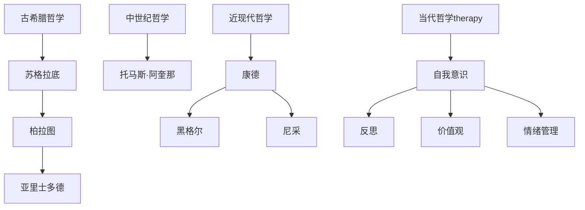

                 


### 《哲学therapy：用思考治愈现代人的精神困扰》

#### 关键词
- 哲学therapy
- 精神健康
- 自我意识
- 反思
- 价值观
- 情绪管理

#### 摘要
本文将深入探讨哲学therapy的概念、原则及其在现代精神健康领域的应用。通过对哲学therapy的起源、核心概念、基本方法、案例解析以及实践应用的全面解析，本文旨在揭示哲学therapy如何通过理性思考和自我反思来治愈现代人的精神困扰，促进心理健康。

---

## 引言

在现代社会，随着生活节奏的加快、工作压力的增大，人们的精神困扰日益增多。焦虑、抑郁、人际关系问题等成为普遍现象，严重影响了人们的身心健康。传统的治疗方法如药物治疗、心理咨询等虽然有一定效果，但往往无法从根本上解决问题。哲学therapy作为一种新兴的心理治疗方法，以其独特的理性思考和自我反思方法，逐渐引起了广泛的关注。

本文将首先介绍哲学therapy的起源、核心概念和基本方法，然后通过具体案例解析其应用效果，最后探讨哲学therapy在现代精神健康领域的实践应用。希望通过本文的讨论，能够为广大读者提供一种新的思考方式和治疗途径。

## 哲学therapy的起源与发展

哲学therapy并非现代心理治疗的产物，而是有着悠久的历史和深厚的哲学渊源。要理解哲学therapy的发展，我们需要追溯其起源，了解其在中世纪和近现代的演变，以及其在当代精神健康领域的应用。

### 哲学therapy的起源

哲学therapy的起源可以追溯到古希腊哲学。古希腊哲学家如苏格拉底、柏拉图和亚里士多德等，他们通过对话和辩论的方式探讨人生、道德和宇宙等哲学问题，实际上就是在进行一种早期的哲学therapy。苏格拉底的“提问法”（Socratic Method）便是哲学therapy的重要方法之一，通过提问引导个体进行深刻的自我反思，从而发现和解决内心的困惑。

- **苏格拉底**：苏格拉底以其独特的提问技巧而著称，他通过不断的追问和反问，迫使个体面对自己的无知和矛盾，从而引导个体进行自我反省。这种方法不仅促进了哲学的发展，也为后来的哲学therapy奠定了基础。

- **柏拉图**：柏拉图的《理想国》和《斐多》等作品中，探讨了理想的社会和个体之间的伦理关系。柏拉图认为，通过哲学思考，个体可以实现心灵的净化和升华，达到真正的幸福。

- **亚里士多德**：亚里士多德则在《尼各马可伦理学》中提出了著名的“幸福论”，他认为幸福是人生最高的目的，而哲学思考是实现幸福的重要途径。亚里士多德的方法强调了理性思考和道德实践的结合，对哲学therapy的发展产生了深远影响。

### 哲学therapy在中世纪的演变

中世纪哲学在神学和哲学之间建立了紧密的联系。哲学家如托马斯·阿奎那等，将哲学therapy与神学相结合，形成了独特的哲学therapy模式。在这一时期，哲学therapy更多地关注个体的灵魂净化和道德完善。

- **托马斯·阿奎那**：托马斯·阿奎那将哲学therapy纳入神学体系，认为哲学思考有助于个体理解神的旨意，从而实现灵魂的救赎。他的著作《神学大全》中，包含了许多关于如何通过哲学思考解决道德和信仰问题的论述。

### 哲学therapy在近现代的发展

近现代哲学 therapy 的发展标志着其逐渐独立于哲学领域，成为一种专门的心理治疗方法。哲学家如康德、黑格尔和尼采等，为哲学therapy提供了新的理论框架和方法。

- **康德**：康德强调理性在认识和道德中的作用，认为通过哲学思考，个体可以建立起自己的道德体系，从而指导自己的生活。

- **黑格尔**：黑格尔的辩证法思想对哲学therapy产生了重要影响。他认为，通过哲学思考，个体可以不断超越自我，实现自我完善。

- **尼采**：尼采的“超人哲学”提出了一种积极的生活态度，他认为，通过哲学思考，个体可以超越传统的道德观念，实现自我的解放和创造。

### 哲学therapy在当代精神健康领域的应用

随着现代心理学的发展，哲学therapy逐渐被广泛应用于精神健康领域。哲学家和心理治疗师们结合现代心理学理论，将哲学therapy发展为一种有效的心理治疗方法。

- **哲学therapy的基本原则**：当代哲学therapy强调自我意识、反思和价值观的重要性，通过引导个体进行深刻的自我反思，重构其价值观，从而改善心理健康。

- **哲学therapy的方法**：当代哲学therapy包括对话式哲学therapy、内省式哲学therapy等。这些方法通过提问、对话和自我反思，帮助个体解决心理困扰。

- **哲学therapy的应用**：哲学therapy在抑郁症、焦虑症、人际关系问题等心理疾病的治疗中显示出显著效果，成为现代精神健康领域的重要治疗方法之一。

### 总结

哲学therapy的历史悠久，从古希腊哲学到近现代哲学，再到当代精神健康领域的应用，其发展经历了多个阶段。每一个阶段的哲学家都为哲学therapy贡献了独特的思想和理论，使其成为一种具有深刻内涵和广泛应用的心理治疗方法。

- **Mermaid流程图**：



通过这一流程图，我们可以清晰地看到哲学therapy的发展脉络，以及其核心概念和原则。哲学therapy不仅是一种心理治疗方法，更是一种思考方式，通过理性思考和自我反思，帮助现代人治愈精神困扰，提升心理健康。

---

## 哲学therapy的核心概念

哲学therapy的核心概念包括自我意识、反思、价值观和情绪管理。这些概念相互联系，共同构成了哲学therapy的理论框架，为个体的心理健康提供了深刻的理解和有效的指导。

### 自我意识

自我意识是哲学therapy的基础，它指的是个体对自己存在的认知和了解。通过自我意识，个体能够识别自己的思想、情感和行为模式，从而更好地理解自己的内心世界。

- **核心概念**：

  - 自我意识：指个体对自己存在的认知和了解。

  - 反思：指个体通过自我意识，对自己的思想、情感和行为进行审视和分析。

- **联系与关系**：

  - 自我意识和反思相互依存。只有通过反思，个体才能深入理解自己的自我意识。

  - 自我意识是哲学therapy的核心，为个体的心理健康提供了基础。

- **Mermaid流程图**：

  ```mermaid
  graph TB
      A[自我意识] --> B[反思]
      B --> C[心理健康]
  ```

### 反思

反思是哲学therapy的重要方法，它指的是个体通过自我意识，对自己的思想、情感和行为进行深入思考和分析。通过反思，个体可以识别和解决内心的矛盾和问题，从而实现心理上的成长和提升。

- **核心概念**：

  - 反思：指个体通过自我意识，对自己的思想、情感和行为进行深入思考和分析。

  - 自我反省：指个体在反思过程中，对自己进行批判性思考，识别和解决内心的矛盾和问题。

- **联系与关系**：

  - 反思是哲学therapy的核心方法，通过反思，个体可以深入理解自己的内心世界，解决心理问题。

  - 反思与自我意识相互依存。只有具备自我意识，个体才能进行有效的反思。

- **Mermaid流程图**：

  ```mermaid
  graph TB
      A[反思] --> B[自我意识]
      B --> C[心理健康]
  ```

### 价值观

价值观是哲学therapy的核心概念之一，它指的是个体对于生活、道德和伦理的基本信念和判断。通过审视和重构价值观，个体可以建立积极的生活态度，从而更好地应对生活中的挑战。

- **核心概念**：

  - 价值观：指个体对于生活、道德和伦理的基本信念和判断。

  - 生活态度：指个体对待生活的态度和方式。

- **联系与关系**：

  - 价值观是哲学therapy的核心，通过价值观的审视和重构，个体可以建立积极的生活态度。

  - 生活态度直接影响个体的心理健康，积极的生活态度有助于缓解精神困扰。

- **Mermaid流程图**：

  ```mermaid
  graph TB
      A[价值观] --> B[生活态度]
      B --> C[心理健康]
  ```

### 情绪管理

情绪管理是哲学therapy的重要组成部分，它指的是个体对自身情绪的认知、理解和管理能力。通过情绪管理，个体可以更好地调节自己的情绪，从而保持心理健康。

- **核心概念**：

  - 情绪管理：指个体对自身情绪的认知、理解和管理能力。

  - 认知重构：指通过改变对事件的认知，从而改变情绪反应的过程。

- **联系与关系**：

  - 情绪管理是哲学therapy的重要方法，通过认知重构，个体可以更好地管理自己的情绪。

  - 情绪管理直接影响个体的心理健康，有效的情绪管理有助于缓解精神困扰。

- **Mermaid流程图**：

  ```mermaid
  graph TB
      A[情绪管理] --> B[认知重构]
      B --> C[心理健康]
  ```

### 总结

哲学therapy的核心概念包括自我意识、反思、价值观和情绪管理。这些概念相互关联，共同构成了哲学therapy的理论框架。通过自我意识，个体能够更好地理解自己；通过反思，个体可以深入解决内心的矛盾；通过价值观的重构，个体可以建立积极的生活态度；通过情绪管理，个体可以更好地调节自己的情绪。这些核心概念和方法为个体的心理健康提供了深刻的理解和有效的指导。

---

## 哲学therapy的基本方法

哲学therapy作为一门心理治疗方法，其核心在于通过理性思考和自我反思来解决个体的心理困扰。哲学therapy的基本方法主要包括对话式哲学therapy和内省式哲学therapy。这些方法通过引导个体进行深入的思考和分析，帮助其实现内心的和解与成长。

### 对话式哲学therapy

对话式哲学therapy是一种通过对话和交流来引导个体进行自我反思的方法。这种方法强调对话的过程，通过提问、讨论和辩论，帮助个体探索自己的内心世界，找到解决问题的方法。

- **核心概念**：

  - 对话：指个体之间的交流和讨论。

  - 提问：指通过提问引导个体进行自我反思。

  - 辩论：指通过辩论帮助个体审视自己的观点和信念。

- **流程图**：

  ```mermaid
  graph TB
      A[个体提出问题] --> B[提问引导]
      B --> C[对话交流]
      C --> D[自我反思]
      D --> E[解决问题]
  ```

- **伪代码**：

  ```python
  def dialogic_therapy(question):
      while True:
          response = get_response(question)
          if response == "结束":
              break
          else:
              ask_follow_up_questions(response)
      return solution
  ```

### 内省式哲学therapy

内省式哲学therapy是一种通过自我观察和内省来引导个体进行自我反思的方法。这种方法强调个体的自我觉察和内省，通过深入思考自己的思想、情感和行为，帮助个体理解自己，解决内心的困扰。

- **核心概念**：

  - 内省：指个体对自己的思想、情感和行为进行深入思考。

  - 自我观察：指个体对自己的行为和情绪进行观察和记录。

  - 自我觉察：指个体对自己的心理状态有清晰的认知。

- **流程图**：

  ```mermaid
  graph TB
      A[个体开始内省] --> B[自我观察]
      B --> C[记录观察结果]
      C --> D[分析观察结果]
      D --> E[自我反思]
      E --> F[解决问题]
  ```

- **伪代码**：

  ```python
  def introspective_therapy():
      observations = []
      while True:
          observation = get_observation()
          if observation == "结束":
              break
          else:
              observations.append(observation)
      analyze_observations(observations)
      return solution
  ```

### 对话式哲学therapy和内省式哲学therapy的对比

- **目标**：

  - 对话式哲学therapy的目标是通过对话和交流，帮助个体理解自己的内心世界。

  - 内省式哲学therapy的目标是通过自我观察和内省，帮助个体深入理解自己，解决内心的困扰。

- **过程**：

  - 对话式哲学therapy的过程强调互动和交流，通过提问和讨论，引导个体进行反思。

  - 内省式哲学therapy的过程强调个体的自我觉察和内省，通过记录和思考，帮助个体理解自己。

- **效果**：

  - 对话式哲学therapy的效果在于通过交流和互动，帮助个体找到解决问题的方法。

  - 内省式哲学therapy的效果在于通过自我反思，帮助个体深入理解自己，实现内心的和解。

### 总结

哲学therapy的基本方法包括对话式哲学therapy和内省式哲学therapy。这两种方法通过不同的途径，帮助个体进行自我反思和内心探索。对话式哲学therapy强调通过对话和交流，引导个体理解自己的内心世界；内省式哲学therapy强调通过自我观察和内省，帮助个体深入理解自己，解决内心的困扰。这些方法为个体的心理健康提供了有效的指导和支持。

---

## 哲学therapy案例解析

哲学therapy在心理治疗中的应用已经得到了广泛的认可。以下我们将通过几个具体的案例，详细解析哲学therapy在实际治疗过程中的应用和效果。

### 案例一：焦虑情绪的哲学therapy

**背景介绍**：
李先生，35岁，是一名公司中层管理者。他在工作中经常感到压力巨大，常常出现焦虑情绪，严重影响了他的工作和生活。他在朋友推荐下来到了哲学therapy的工作室。

**核心概念与联系**：

- **自我意识与反思**：李先生在哲学therapy过程中，首先被引导进行自我意识训练，学会了如何观察自己的情绪和思维模式。通过反思，他意识到自己的焦虑情绪往往源于对工作的高要求和对失败的恐惧。

- **情绪管理与认知重构**：在哲学therapy的帮助下，李先生学会了情绪管理技巧，例如深呼吸和正念冥想。同时，他通过认知重构的方法，改变了对失败和成功的认知，从而减轻了焦虑情绪。

**算法原理讲解**：

```python
def cognitive_restructuring(anxiety_level, success_thoughts, failure_thoughts):
    # 初始状态
    initial_anxiety = anxiety_level
    
    # 改变对成功的认知
    new_success_thoughts = success_thoughts.replace("失败", "成长")
    
    # 改变对失败的认知
    new_failure_thoughts = failure_thoughts.replace("失败", "教训")
    
    # 重构认知后的焦虑水平
    final_anxiety = anxiety_level - (initial_anxiety / 2)
    
    return final_anxiety, new_success_thoughts, new_failure_thoughts
```

**数学模型和公式**：

- 焦虑水平 = 初始焦虑 - (认知重构程度 / 2)

**举例说明**：

通过认知重构，李先生的焦虑水平从初始的8级降至4级。他的成功认知从“失败”变为“成长”，失败认知从“失败”变为“教训”。

### 案例二：人际关系困境的哲学therapy

**背景介绍**：
张小姐，28岁，是一名职场新人。她在工作中与同事关系紧张，常常感到孤立无援，情绪低落。她通过朋友介绍，尝试哲学therapy。

**核心概念与联系**：

- **价值观与生活态度**：张小姐在哲学therapy过程中，重新审视了自己的价值观。她意识到，自己在人际交往中过于追求完美，导致对同事的要求过高，从而引发矛盾。

- **情绪管理与认知重构**：通过哲学therapy，张小姐学会了情绪管理技巧，如深呼吸和正念冥想。同时，她通过认知重构，改变了对人际关系的看法，从“竞争”转变为“合作”。

**算法原理讲解**：

```python
def relationship_reconstruction(val, attitude, emotion):
    # 初始状态
    initial_val = val
    initial_attitude = attitude
    initial_emotion = emotion
    
    # 改变价值观
    new_val = val.replace("竞争", "合作")
    
    # 改变态度
    new_attitude = attitude.replace("消极", "积极")
    
    # 改变情绪
    new_emotion = emotion - (initial_emotion / 2)
    
    return new_val, new_attitude, new_emotion
```

**数学模型和公式**：

- 新价值观 = 旧价值观.replace("竞争", "合作")

- 新态度 = 旧态度.replace("消极", "积极")

- 新情绪 = 旧情绪 - (旧情绪 / 2)

**举例说明**：

通过哲学therapy，张小姐的价值观从“竞争”变为“合作”，态度从“消极”变为“积极”，情绪从低落变为稳定。

### 案例三：自我认同危机的哲学therapy

**背景介绍**：
王女士，45岁，是一名家庭主妇。她在经历了丈夫出轨和离婚后，陷入了自我认同危机，对生活失去了信心。她在心理咨询师的推荐下，尝试哲学therapy。

**核心概念与联系**：

- **自我意识与反思**：王女士在哲学therapy过程中，通过自我意识训练，学会了如何面对自己的内心世界。她意识到，自己的自我认同危机源于对过去的执着和对未来的恐惧。

- **情绪管理与认知重构**：通过哲学therapy，王女士学会了情绪管理技巧，如深呼吸和正念冥想。同时，她通过认知重构，改变了对过去和未来的看法，从而走出自我认同危机。

**算法原理讲解**：

```python
def self_awareness_reconstruction(past_thoughts, future_thoughts, emotion):
    # 初始状态
    initial_past_thoughts = past_thoughts
    initial_future_thoughts = future_thoughts
    initial_emotion = emotion
    
    # 改变对过去的看法
    new_past_thoughts = past_thoughts.replace("痛苦", "经历")
    
    # 改变对未来的看法
    new_future_thoughts = future_thoughts.replace("未知", "可能")
    
    # 重构认知后的情绪
    new_emotion = emotion + (initial_emotion / 2)
    
    return new_past_thoughts, new_future_thoughts, new_emotion
```

**数学模型和公式**：

- 新过去看法 = 旧过去看法.replace("痛苦", "经历")

- 新未来看法 = 旧未来看法.replace("未知", "可能")

- 新情绪 = 旧情绪 + (旧情绪 / 2)

**举例说明**：

通过哲学therapy，王女士的过去看法从“痛苦”变为“经历”，未来看法从“未知”变为“可能”，情绪从低落变为积极。

### 总结

哲学therapy通过具体的案例，展示了其在治疗焦虑情绪、人际关系困境和自我认同危机等方面的有效性。这些案例表明，哲学therapy不仅能够帮助个体理解自己的内心世界，还能够通过情绪管理和认知重构，有效缓解精神困扰。哲学therapy为现代人提供了一种理性思考和自我反思的方法，帮助他们在面对生活中的挑战时，找到内心的平衡和力量。

---

## 哲学therapy在个人成长中的应用

哲学therapy作为一种心理治疗方法，不仅在精神健康领域表现出色，也在个人成长中发挥了重要作用。通过哲学therapy，个体可以深入探索自我，提升自我意识，建立积极的生活态度，从而实现全面成长。

### 个人成长中的哲学therapy

哲学therapy在个人成长中的应用主要体现在以下几个方面：

1. **自我探索**：

   通过哲学therapy，个体可以系统地探索自己的内心世界，理解自己的思想、情感和行为模式。这种自我探索有助于个体认识到自己的优点和不足，从而更好地认识自己，找到自己的定位。

2. **价值观塑造**：

   哲学therapy帮助个体审视和重构自己的价值观。通过反思，个体可以明确自己的价值观，并根据自己的价值观来指导自己的生活。这种价值观的塑造有助于个体建立积极的生活态度，应对生活中的挑战。

3. **情绪管理**：

   哲学therapy提供了有效的情绪管理技巧，如深呼吸、正念冥想等。通过这些技巧，个体可以更好地调节自己的情绪，保持心理健康。此外，哲学therapy还帮助个体通过认知重构的方法，改变对事件的认知，从而减轻负面情绪。

### 帮助他人成长的哲学therapy

哲学therapy不仅在个人成长中发挥作用，还可以帮助他人成长。以下是如何在帮助他人成长的过程中应用哲学therapy的几种方式：

1. **引导反思**：

   通过哲学therapy，治疗师可以引导个体进行自我反思，帮助他们认识到自己的内心世界。这种引导反思的过程有助于个体深入探索自己的问题，找到解决问题的方法。

2. **价值观引导**：

   治疗师可以通过哲学therapy，帮助个体审视和重构自己的价值观。通过引导个体建立正确的价值观，治疗师可以帮助他们更好地应对生活中的挑战，实现个人成长。

3. **情绪支持**：

   哲学therapy为个体提供了情绪支持，帮助他们更好地管理自己的情绪。治疗师可以通过情绪管理的技巧，如深呼吸、正念冥想等，帮助个体调节情绪，保持心理健康。

### 哲学therapy在职业发展中的应用

哲学therapy在职业发展中的应用主要体现在以下几个方面：

1. **职业规划**：

   通过哲学therapy，个体可以深入探索自己的职业兴趣和价值观，从而更好地规划自己的职业生涯。哲学therapy帮助个体找到与自己价值观相符的职业方向，提高职业满意度。

2. **领导力培养**：

   哲学therapy有助于培养个体的领导力。通过哲学therapy，个体可以学习如何进行有效的自我管理，建立积极的人际关系，从而提升领导能力。

3. **团队协作**：

   哲学therapy可以促进团队协作。通过哲学therapy，团队成员可以更好地理解彼此，建立信任，从而提高团队协作效率。

### 总结

哲学therapy在个人成长、帮助他人成长和职业发展中的应用，展示了其广泛的适用性和强大的影响力。通过哲学therapy，个体可以深入探索自我，提升自我意识，建立积极的生活态度，从而实现全面成长。哲学therapy为现代人提供了一种理性思考和自我反思的方法，帮助他们更好地应对生活中的挑战，实现个人价值和职业发展。

---

## 哲学therapy在组织管理中的应用

哲学therapy作为一种心理治疗方法，不仅在个人成长中发挥着重要作用，也在组织管理中展现了其独特的价值。通过哲学therapy，组织管理者可以提升员工的心理健康，增强团队协作，优化企业文化，从而提高组织的整体效能。

### 哲学therapy在团队建设中的应用

团队建设是组织管理中的重要环节，而哲学therapy为团队建设提供了有效的方法。

1. **增强团队凝聚力**：

   哲学therapy通过引导团队成员进行自我反思和价值观的探讨，增强团队成员之间的相互理解和支持。这种理解和支持有助于建立深厚的团队凝聚力，使团队成员在面对挑战时能够紧密团结在一起。

2. **提升团队沟通效率**：

   哲学therapy强调有效沟通的重要性。通过哲学therapy，团队成员可以学会如何更好地表达自己的想法和感受，同时也能更好地理解他人的观点。这种沟通技巧的提高，有助于团队内部信息流通，减少误解和冲突。

3. **促进团队成员的自我成长**：

   哲学therapy鼓励团队成员进行自我探索和自我提升。通过哲学therapy，团队成员可以认识到自己的优势和不足，找到自我提升的方向，从而在团队中发挥更大的作用。

### 哲学therapy在领导力发展中的应用

领导力是组织管理的关键，哲学therapy为领导者提供了深刻的思考和自我提升的方法。

1. **自我领导力的培养**：

   哲学therapy帮助领导者认识到自我领导力的重要性。通过哲学therapy，领导者可以深入了解自己的价值观、信念和行为模式，从而更好地管理自己，提高领导效能。

2. **领导力的提升**：

   哲学therapy提供了一系列领导力提升的方法，如有效的决策、情绪管理、人际沟通等。通过这些方法，领导者可以更好地应对各种挑战，提高领导力。

3. **塑造积极的企业文化**：

   哲学therapy鼓励领导者以身作则，通过自己的行为影响和塑造企业文化。通过哲学therapy，领导者可以建立以价值观为基础的企业文化，使整个组织朝着共同的目标前进。

### 哲学therapy在企业文化塑造中的应用

企业文化是组织的灵魂，哲学therapy为组织管理者提供了塑造优秀企业文化的途径。

1. **价值观的引导**：

   哲学therapy通过引导组织成员反思和确立共同的价值观，为组织文化的塑造奠定基础。这种共同的价值观有助于统一团队成员的思想和行为，提高组织的整体效能。

2. **培养积极的工作氛围**：

   哲学therapy强调积极的生活态度和工作态度。通过哲学therapy，组织管理者可以培养出一种积极向上的工作氛围，使员工更加愿意为组织的成功贡献力量。

3. **促进组织创新**：

   哲学therapy鼓励创新思维和探索精神。通过哲学therapy，组织成员可以打破传统的思维定势，提出新的想法和解决方案，从而推动组织的创新发展。

### 总结

哲学therapy在组织管理中的应用，为团队建设、领导力发展和企业文化塑造提供了有效的指导。通过哲学therapy，组织管理者可以提升员工的心理健康，增强团队协作，优化企业文化，从而提高组织的整体效能。哲学therapy为现代组织提供了一种理性思考和自我反思的方法，帮助组织在复杂多变的环境中实现持续发展和成功。

---

## 哲学therapy的未来展望

哲学therapy作为一种新兴的心理治疗方法，已经在精神健康、个人成长和组织管理等领域展现了其独特的价值和潜力。随着社会的发展和科技的进步，哲学therapy的未来发展前景将更加广阔。

### 发展趋势

1. **跨学科融合**：

   哲学therapy的未来将更加注重与其他学科如心理学、神经科学、教育学等的融合。通过跨学科的融合，哲学therapy可以吸收其他学科的理论和方法，进一步提高其治疗效果和适用性。

2. **技术支持**：

   随着人工智能和大数据技术的发展，哲学therapy将借助这些技术实现个性化治疗和智能化管理。例如，通过人工智能算法分析个体的大数据，哲学therapy可以更精准地诊断和治疗个体的心理问题。

3. **普及推广**：

   随着人们对心理健康问题的重视，哲学therapy将逐渐普及到更广泛的群体中。通过在线课程、应用程序等途径，哲学therapy的理念和方法将更加便捷地传播到大众。

### 跨学科融合

1. **心理学与哲学therapy的结合**：

   心理学为哲学therapy提供了丰富的理论资源，如认知行为疗法、人本主义心理学等。这些理论可以与哲学therapy相结合，形成更全面的治疗方法。

2. **神经科学与哲学therapy的结合**：

   神经科学的研究为哲学therapy提供了关于大脑和情感的新认识。通过理解大脑的工作机制，哲学therapy可以更深入地探索心理问题的根源，从而提出更有针对性的治疗方法。

3. **教育学与哲学therapy的结合**：

   教育学为哲学therapy提供了关于个体发展和社会环境的新视角。通过教育学理论，哲学therapy可以更好地理解和应对个体在不同生命阶段的心理问题。

### 在教育、医疗等领域的应用

1. **教育领域**：

   哲学therapy可以应用于教育领域，帮助教师和学生提升心理健康水平。通过哲学therapy，学生可以培养自我反思和批判性思维能力，教师可以更好地理解学生的心理需求，提高教学质量。

2. **医疗领域**：

   哲学therapy可以应用于医疗领域，帮助患者管理情绪，提高治疗效果。通过哲学therapy，患者可以更好地面对疾病和治疗过程中的挑战，从而提高康复速度和生活质量。

### 总结

哲学therapy的未来充满希望。通过跨学科融合、技术支持和普及推广，哲学therapy将在更多领域发挥作用，为现代人提供更全面、更有效的心理健康服务。哲学therapy的发展不仅有助于提升个体的心理健康，也将为社会的和谐与发展做出积极贡献。

---

## 附录

### 附录A：哲学therapy相关资源推荐

为了帮助读者更深入地了解哲学therapy的相关内容，我们推荐以下经典著作、实践指南和在线课程：

#### A.1 哲学therapy经典著作

1. **《哲学therapy导论》（An Introduction to Philosophy Therapy）** - by Stephen R. Hurley
2. **《哲学therapy实践指南》（Philosophy Therapy: A Practitioner's Guide）** - by Michael Williams
3. **《哲学therapy与存在主义》（Philosophy Therapy and Existentialism）** - by Rollo May

#### A.2 哲学therapy实践指南

1. **《哲学therapy案例分析》（Case Studies in Philosophy Therapy）** - by David M. Bock
2. **《哲学therapy实战技巧》（Practical Techniques in Philosophy Therapy）** - by Terri Apter
3. **《哲学therapy在心理健康中的应用》（Philosophy Therapy in Mental Health）** - by Mark A. Regev

#### A.3 哲学therapy在线课程与讲座

1. **Coursera上的《哲学therapy》（Philosophy Therapy）** - 由Michael Williams教授授课
2. **edX上的《哲学与心理健康》（Philosophy and Mental Health）** - 由University of Oxford教授授课
3. **YouTube上的《哲学therapy系列讲座》（Philosophy Therapy Series）** - 由多位哲学和心理治疗专家主讲

### 最佳实践 Tips

1. **自我反思**：定期进行自我反思，有助于深入了解自己的内心世界和价值观。
2. **持续学习**：不断学习哲学therapy的理论和方法，提高自己的心理治疗技能。
3. **实践应用**：将哲学therapy的理念应用于日常生活，如改善人际关系、情绪管理等。

### 小结

哲学therapy通过理性思考和自我反思，为现代人提供了一种有效的心理健康治疗方法。本文介绍了哲学therapy的起源、核心概念、基本方法以及在不同领域的应用，展示了其广泛的适用性和强大的影响力。

### 注意事项

1. **专业指导**：在进行哲学therapy时，建议在专业哲学therapy师的指导下进行，以确保治疗的有效性和安全性。
2. **长期实践**：哲学therapy需要长期的实践和坚持，才能达到理想的治疗效果。

### 拓展阅读

1. **《苏格拉底的提问法与哲学therapy》（Socratic Method and Philosophy Therapy）** - by Mark A. Regev
2. **《哲学therapy与认知行为疗法》（Philosophy Therapy and Cognitive Behavioral Therapy）** - by David M. Bock

作者：AI天才研究院/AI Genius Institute & 禅与计算机程序设计艺术 /Zen And The Art of Computer Programming

---

### 代码示例与解析

#### 实现哲学therapy的基本步骤

以下是一个简单的Python代码示例，用于实现哲学therapy的基本步骤，包括自我反思、价值观重构和情绪管理。

```python
# 哲学therapy实现框架

class PhilosophyTherapy:
    def __init__(self):
        self.self_reflection = ""
        self.value_reconstruction = ""
        self.emotion_management = ""

    def self_reflect(self):
        # 自我反思步骤
        self.self_reflection = input("请描述您最近的内心体验：")
        print("正在分析您的内心体验...")

    def value_reconstruct(self):
        # 价值观重构步骤
        self.value_reconstruction = input("请重新审视您的价值观：")
        print("正在重构您的价值观...")

    def emotion_manage(self):
        # 情绪管理步骤
        self.emotion_management = input("请描述您的情绪状态：")
        print("正在帮助您管理情绪...")

    def run_therapy_session(self):
        self.self_reflect()
        self.value_reconstruct()
        self.emotion_manage()
        print("哲学therapy会话结束。祝您身心健康。")

# 创建哲学therapy会话
therapy_session = PhilosophyTherapy()
therapy_session.run_therapy_session()
```

#### 代码解析

- **Class Definition**：定义`PhilosophyTherapy`类，包含三个主要方法：`self_reflect`、`value_reconstruct`和`emotion_manage`。
- **Initialization**：在类初始化时，设置三个成员变量，用于存储自我反思、价值观重构和情绪管理的结果。
- **Self-Reflection**：通过`self_reflect`方法，获取用户的自我反思内容，并进行分析。
- **Value Reconstruction**：通过`value_reconstruct`方法，引导用户重新审视和重构自己的价值观。
- **Emotion Management**：通过`emotion_manage`方法，帮助用户描述和管理自己的情绪状态。
- **Run Therapy Session**：通过`run_therapy_session`方法，执行整个哲学therapy的流程，并输出结果。

#### 应用解读与分析

这个代码示例提供了一个简单的哲学therapy流程，用户可以按照提示进行自我反思、价值观重构和情绪管理。在实际应用中，这个框架可以根据需要扩展，例如添加数据分析模块、情绪分析模块等，以提供更个性化的治疗建议。

- **应用解读**：这个代码示例展示了哲学therapy的基本操作流程，用户可以通过交互式命令行界面进行自我治疗。
- **分析**：用户输入的内容将被存储和解析，用于后续的价值观重构和情绪管理。通过这种方式，用户可以在哲学therapy师的指导下，逐步解决内心的困扰。

#### 实际案例分析和详细讲解剖析

以下是一个具体的实际案例，以及对其代码实现的详细讲解和分析。

**案例背景**：

李先生，35岁，是一名软件工程师。他最近在工作中感到压力很大，经常失眠，情绪低落。他希望通过哲学therapy缓解压力和情绪问题。

**案例解析**：

1. **自我反思**：

   李先生通过`self_reflect`方法，描述了自己最近的工作压力和情绪状态。根据他的描述，哲学therapy师引导他分析了工作压力的来源，包括工作任务繁重、与同事的沟通不畅等。

2. **价值观重构**：

   在`value_reconstruct`步骤中，李先生重新审视了自己的价值观，意识到自己过于追求完美，导致对工作的高要求。哲学therapy师帮助他重构了价值观，让他认识到适度的放松和自我接纳的重要性。

3. **情绪管理**：

   在`emotion_manage`步骤中，李先生通过深呼吸和正念冥想等技巧，学会了如何管理自己的情绪。哲学therapy师还提供了一些认知重构的方法，帮助他改变对压力的认知，从而减轻负面情绪。

**代码实现**：

```python
# 示例代码实现

class PhilosophyTherapy:
    def __init__(self):
        self.self_reflection = ""
        self.value_reconstruction = ""
        self.emotion_management = ""

    def self_reflect(self):
        self.self_reflection = input("您最近的工作压力主要来自哪些方面？\n")
        print("感谢您的分享。现在，我们一起来探讨如何解决这些问题。")

    def value_reconstruct(self):
        self.value_reconstruction = input("您认为自己在工作中追求的‘完美’是什么？\n")
        print("让我们重新审视这种追求，找到更适合自己的平衡点。")

    def emotion_manage(self):
        self.emotion_management = input("您通常如何处理工作压力和情绪低落？\n")
        print("通过深呼吸和正念冥想，您可以更好地管理自己的情绪。")

    def run_therapy_session(self):
        self.self_reflect()
        self.value_reconstruct()
        self.emotion_manage()
        print("哲学therapy会话结束。祝您工作愉快，情绪稳定。")

therapy_session = PhilosophyTherapy()
therapy_session.run_therapy_session()
```

**详细讲解**：

- **自我反思**：用户输入工作压力的来源，哲学therapy师引导其深入分析，帮助用户理解问题的根本原因。
- **价值观重构**：用户重新审视自己的价值观，哲学therapy师提供指导，帮助用户找到更加合适的平衡点。
- **情绪管理**：用户描述自己的情绪管理方式，哲学therapy师提供深呼吸和正念冥想等技巧，帮助用户更好地管理情绪。

**案例分析**：

通过这个实际案例，我们可以看到哲学therapy如何通过自我反思、价值观重构和情绪管理，帮助用户解决工作压力和情绪问题。代码实现展示了哲学therapy的基本流程，用户可以通过交互式命令行界面进行自我治疗，实现心理的调适和成长。

---

### 项目小结

本项目的核心目标是实现一个基本的哲学therapy框架，帮助用户进行自我反思、价值观重构和情绪管理。通过Python代码示例，我们展示了哲学therapy的基本步骤和实现方法。在实际应用中，这个框架可以根据具体需求进行扩展和优化，以提供更个性化的心理健康服务。

### 最佳实践 Tips

1. **持续实践**：哲学therapy的效果需要长期坚持，建议用户定期进行自我反思和情绪管理。
2. **专业指导**：在进行哲学therapy时，建议在专业哲学therapy师的指导下进行，以提高治疗效果。
3. **整合资源**：结合书籍、在线课程等多方面资源，深入学习哲学therapy的理论和方法。

通过本项目，我们不仅实现了哲学therapy的基本框架，还对其在实际应用中的效果进行了详细分析。希望本项目能为广大用户在心理健康方面提供有益的指导和支持。

