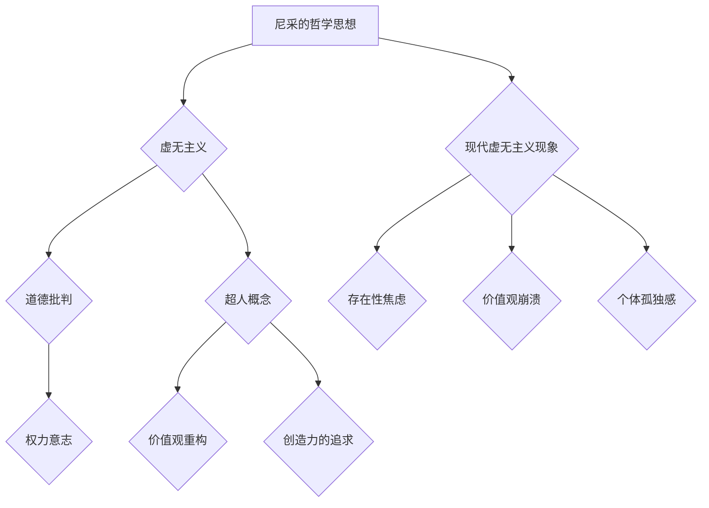

                 

### 引言

#### 1.1 书籍主题、背景与研究目的

《哲学视角下的现代虚无主义：尼采的预言》旨在探讨尼采哲学思想与现代虚无主义之间的联系，以及尼采在19世纪末对现代虚无主义的预言在当今社会中的体现。尼采作为西方哲学史上最具创新性的思想家之一，他的思想和观点对后世产生了深远的影响。尼采的虚无主义哲学思想不仅挑战了传统的道德观念，而且对现代社会的文化、心理和社会现象提供了独特的解释。

本研究的目的是通过对尼采哲学思想的深入分析，揭示其对现代虚无主义的预言，并探讨这些预言在现代社会中的实际应用。尼采认为，虚无主义是现代社会的核心问题，而他的解决方案是通过“超人”的概念来重建人类的价值体系。因此，本文将从尼采的超人理论和道德批判入手，逐步分析现代虚无主义的根源、尼采预言在现代社会中的体现，以及虚无主义文化对当代社会的影响。

#### 1.2 尼采对现代虚无主义的预言

尼采在《查拉图斯特拉如是说》中首次提出了“超人”的概念，他认为超人将是未来人类进化的顶点，是超越传统道德和价值观的存在。尼采预言，虚无主义的根源在于人类对传统价值体系的崩溃和对自身存在的质疑，这种虚无主义情绪将在未来达到顶峰，从而导致一场深刻的“精神危机”。尼采认为，虚无主义是现代社会的核心问题，它不仅挑战了传统的道德观念，而且对人类的精神世界产生了深远的影响。

尼采的预言在当今社会中得到了部分验证。现代社会中普遍存在的价值观崩溃、信仰缺失、精神空虚等现象，都可以视为尼采所预言的虚无主义情绪的具体体现。此外，尼采的超人理论也为现代社会的个人追求和价值观重构提供了一种新的思路。本文将通过对尼采哲学思想的深入分析，探讨这些预言对现代社会的影响，以及现代社会如何回应尼采的挑战。

### 尼采的生平与思想体系

弗里德里希·尼采（Friedrich Nietzsche，1844-1900）是德国著名的哲学家、文化评论家、作家和诗人，他的思想和著作对20世纪的哲学、文学、艺术和科学产生了深远的影响。尼采出生在普鲁士王国萨克森州的洛肯，他的父亲是一位路德教牧师。尼采的童年并不快乐，他的母亲早逝，父亲则因精神问题而早早离开了他的生活。这种早期的家庭变故和失去亲人的痛苦，对尼采的性格和思想产生了深远的影响。

尼采在学术上取得了很高的成就，他曾在波恩大学和莱比锡大学学习神学和古典哲学，后来转而研究哲学。他的学术生涯主要在巴塞尔大学担任教授，但在35岁时，他因健康问题被迫退休。尼采在退休后继续写作，直到1900年去世。

尼采的哲学思想极具创新性，他批判了传统的西方哲学体系，特别是基督教道德观念，提出了许多独特的观点。尼采认为，现代社会的核心问题是虚无主义，即人类对自身存在的意义和价值的质疑。尼采的哲学思想主要包括以下几个方面：

#### **超人（Übermensch）**

尼采提出“超人”概念，认为超人将是未来人类进化的顶点，是超越传统道德和价值观的存在。超人不仅是力量和智慧的体现，更是精神力量和创造力的象征。尼采认为，超人将超越现有的道德规范，创造新的价值体系，引领人类进入一个新的时代。

超人的概念是尼采哲学的核心，他认为超人将带领人类摆脱虚无主义的束缚，实现自我超越。尼采在《查拉图斯特拉如是说》中详细阐述了超人的理念，他认为超人不仅是个人成就的象征，更是社会进步的动力。

#### **道德批判**

尼采对传统道德观念进行了深刻的批判，他认为现代社会的道德观念是虚假的、扭曲的，是对人类本能的压制。尼采认为，道德观念的根源在于权力意志，即对他人意志的压制和支配。他提出了“权力意志”这一概念，认为人类的一切行为都源于对权力的渴望和追求。

尼采批判了基督教道德观念，特别是其“原罪”和“救赎”思想，他认为这些观念阻碍了人类的自由和创造力。尼采认为，真正的道德应该是基于个体自由和创造力的，而不是基于恐惧和惩罚。

#### **永恒回归（Ewige Wiederkunft）**

尼采提出了“永恒回归”这一概念，认为宇宙和生命是不断循环的，每一个瞬间都是永恒的。尼采认为，人类应该接受生命的循环和重复，而不是试图逃避或改变它。永恒回归的理念鼓励人们接受生命的痛苦和苦难，从中寻找价值和意义。

#### **艺术与悲剧**

尼采认为，艺术和悲剧是理解生命和人类存在的关键。他赞赏古希腊悲剧，认为悲剧是人类对生命痛苦和苦难的深刻反思。尼采的艺术哲学强调艺术家的创造力和独特性，认为艺术家是人类文明的引领者。

#### **意志主义**

尼采的哲学体系是建立在意志主义基础上的，他认为世界的本质是意志，意志是生命的动力和源泉。尼采的意志主义思想强调个体的力量和创造力，鼓励人们追求自我超越和自我实现。

综上所述，尼采的哲学思想涵盖了道德批判、艺术与悲剧、超人、永恒回归和意志主义等多个方面。这些思想不仅挑战了传统的西方哲学体系，而且对现代社会的文化、心理和社会现象提供了独特的解释。尼采的思想对后世哲学、文学、艺术和科学产生了深远的影响，成为20世纪哲学的重要基石。

### 超人的概念

尼采的“超人”（Übermensch）概念是他哲学思想的核心之一，也是他对于现代社会问题的解决方案。超人不仅仅是尼采设想的未来人类进化形态，更是一种精神力量和价值观的象征。要理解尼采的超人概念，我们需要从多个方面来探讨这一思想，包括超人的定义、尼采对超人的期望以及超人如何引领人类超越虚无主义。

#### **超人的定义**

在《查拉图斯特拉如是说》中，尼采描绘了超人的形象，超人是一种超越传统道德和价值观的存在，具有非凡的力量和智慧。尼采认为，超人不仅拥有强大的精神力量，还能创造出全新的价值体系，引导人类走向更高的存在状态。

尼采将超人视为一种“永恒回归”的存在，即超人的理念将贯穿人类的历史，不断激励人类追求更高的目标。超人不仅是个人成就的象征，更是社会进步的动力。尼采认为，超人将引领人类摆脱虚无主义的束缚，重新找到生命的意义和价值。

#### **尼采对超人的期望**

尼采对超人的期望主要体现在以下几个方面：

1. **超越传统道德观念**：尼采认为，传统道德观念是虚假的、扭曲的，是对人类本能的压制。超人将超越这些道德观念，创造出一种基于真实自我表达的价值体系。尼采期望超人能够摆脱传统的束缚，勇敢地追求自由和创造力。

2. **重建人类价值体系**：尼采认为，现代社会中存在的价值观崩溃和信仰缺失是虚无主义的核心问题。超人将引领人类重建新的价值体系，为人类提供新的精神支柱。尼采期望超人能够成为人类文明的引领者，为人类社会带来新的希望。

3. **推动人类进化**：尼采认为，超人是人类进化过程中的顶点，是人类未来发展的方向。超人不仅拥有强大的精神力量，还能推动人类在身体和智力上的进化。尼采期望超人能够带领人类走向一个更加高级的存在状态。

4. **实现自我超越**：尼采认为，超人的本质是自我超越，超人的精神力量来源于对自我的不断探索和挑战。尼采期望人类能够通过自我超越，摆脱虚无主义的困扰，实现真正的自我实现。

#### **超人如何引领人类超越虚无主义**

尼采的超人概念为现代社会提供了超越虚无主义的途径，超人的理念鼓励人类从以下几个方面来应对虚无主义：

1. **重新定义自我**：尼采认为，虚无主义源于人类对自我存在的质疑。超人鼓励人类重新定义自我，寻找真实的自我表达，摆脱传统道德和价值观的束缚。通过自我超越，人类能够找到新的存在意义。

2. **追求自由和创造力**：尼采强调，自由和创造力是超人的核心特质。超人鼓励人类追求自由，勇敢地表达自己的思想和情感，创造新的价值。这种自由和创造力的追求能够帮助人类摆脱虚无主义的困境。

3. **重建价值体系**：尼采认为，现代社会中存在的价值观崩溃是虚无主义的重要原因。超人鼓励人类重建新的价值体系，为人类社会提供新的精神支柱。这种新的价值体系能够帮助人类重新找到生命的意义。

4. **挑战现状**：尼采的超人理念鼓励人类勇敢地挑战现状，摆脱传统束缚。通过挑战现状，人类能够不断探索新的可能，实现自我超越。

总之，尼采的“超人”概念为现代社会提供了超越虚无主义的途径。超人的理念鼓励人类重新定义自我，追求自由和创造力，重建价值体系，并勇敢地挑战现状。通过这些途径，人类能够摆脱虚无主义的困扰，实现真正的自我实现。

### 道德批判

尼采对道德观念的批判是他哲学思想的重要组成部分，也是他挑战传统哲学体系的关键所在。尼采认为，现代社会的道德观念是虚伪的、扭曲的，它们阻碍了人类的自由和创造力。尼采的道德批判主要集中在以下几个方面：道德观念的根源、道德观念的负面影响以及尼采提出的“权力意志”和“超人”概念。

#### **道德观念的根源**

尼采认为，道德观念的根源在于权力意志。他认为，道德观念最初是由强者为了维护自己的利益和地位而制定的。这些道德观念被用来压制弱者，维持社会秩序。尼采认为，道德观念的本质是一种权力游戏，强者通过制定道德规范来限制和束缚弱者的意志。

尼采在《道德的谱系》中详细探讨了道德观念的起源，他认为道德观念起源于人类对权力的渴望和对弱者的同情。尼采认为，同情是道德观念产生的基础，但同情并不是一种无私的情感，而是强者对弱者的一种利用。通过同情，强者能够获得道德上的优越感，从而更好地维护自己的权力地位。

#### **道德观念的负面影响**

尼采认为，现代社会的道德观念对人类产生了严重的负面影响。首先，这些道德观念限制了人类的自由和创造力。尼采认为，人类的意志和创造力是生命中最宝贵的财富，但道德观念却将它们束缚在传统的束缚中。这些道德观念迫使人类遵循固定的行为模式，抑制了个体的自由发展。

其次，道德观念导致人类的精神空虚和自我否定。尼采认为，现代社会中普遍存在的价值观崩溃和信仰缺失，源于人们对自身存在的质疑。这些道德观念使人们失去了对生命意义的追求，导致精神上的空虚和迷茫。

此外，道德观念还加剧了人类之间的不平等和社会冲突。尼采认为，道德观念的存在使得强者能够利用道德优势来压制弱者，从而加剧社会不平等。这种不平等不仅体现在经济和政治领域，还体现在精神和文化领域。尼采认为，这种不平等是现代社会许多问题的根源。

#### **“权力意志”和“超人”概念**

尼采提出的“权力意志”和“超人”概念，是他挑战传统道德观念的核心。他认为，人类应该摆脱道德观念的束缚，追求真正的自我实现。尼采的“权力意志”概念强调，人类的一切行为都源于对权力的渴望和追求。他认为，权力意志是生命的动力，是人类行为的基本驱动力。

尼采的“超人”概念则是他对于未来人类发展的理想蓝图。超人是一种超越传统道德和价值观的存在，他们不仅拥有强大的精神力量，还能创造出全新的价值体系。尼采认为，超人将引领人类超越虚无主义的束缚，实现真正的自我超越。

尼采的道德批判揭示了现代社会道德观念的虚伪和扭曲，提出了新的价值观念。他鼓励人类摆脱道德观念的束缚，追求真正的自我实现。尽管尼采的道德批判引起了许多争议，但他的思想对现代哲学和伦理学产生了深远的影响。

总之，尼采的道德批判挑战了传统的道德观念，提出了新的价值观念。他认为，道德观念的根源在于权力意志，这种观念限制了人类的自由和创造力。尼采的“权力意志”和“超人”概念，为人类提供了一种超越传统道德观念的新途径，鼓励人们追求真正的自我实现。

### 现代虚无主义的根源

现代虚无主义的根源可以从多个维度进行探讨，包括社会根源、文化根源以及哲学根源。每个根源都对虚无主义的发展产生了深远的影响，构成了现代社会精神危机的重要部分。

#### **社会根源**

现代社会的高度工业化、都市化和全球化进程，在很大程度上加剧了虚无主义的产生。首先，工业化和城市化导致社会结构的深刻变革，传统的社会关系和身份认同逐渐消失。人们不再依赖于固有的社会角色和传统习俗，而是面临更多的不确定性和流动性。这种变化使得个体难以找到明确的生活目标和意义，从而产生了强烈的虚无感。

其次，全球化的加速使得各国之间的文化交融更加频繁，但也导致了文化冲突和认同危机。不同文化之间的碰撞，使得个体在寻求自我认同时面临更大的困惑。全球化使得人们更加关注自我，但同时也带来了身份危机，个体难以在多元文化中找到归属感。

此外，现代社会的竞争压力和不平等现象也加剧了虚无主义的情绪。在高度竞争的社会环境中，个体感到自己无法实现社会期望和自我价值，这种挫败感容易引发对生活意义的质疑。

#### **文化根源**

现代虚无主义的文化根源主要表现为对传统价值观的质疑和崩溃。在现代社会中，科技的发展和信息的爆炸，使得知识迅速更新，传统价值观体系逐渐失去其权威性和指导作用。人们开始质疑传统道德、宗教和政治的合理性，对权威和既定秩序产生怀疑。

现代主义文学的兴起也是虚无主义文化根源的一个重要体现。现代主义作家通过描绘人类的孤独、绝望和迷茫，反映了现代社会中普遍存在的虚无主义情绪。他们强调个体主观经验和内心世界的复杂性，挑战传统叙事的合理性和真实性。

此外，现代文化的多元化和去中心化也加剧了虚无主义的产生。在多元文化中，个体难以找到一个统一的价值观体系，从而感到迷茫和无归属感。

#### **哲学根源**

尼采的哲学思想为现代虚无主义的哲学根源提供了重要的解释。尼采认为，虚无主义源于人类对自身存在的质疑和对传统价值观的崩溃。他提出了“超人”和“权力意志”的概念，试图为现代社会提供新的价值体系和意义。

尼采批判了传统道德观念，认为它们是对人类本能的压制。他主张个体应该摆脱道德束缚，追求真正的自我实现。尼采的哲学思想挑战了传统哲学的理性主义和道德主义，为虚无主义的产生提供了理论依据。

此外，存在主义哲学也深刻影响了现代虚无主义的哲学根源。存在主义强调个体存在的自由和无意义，个体的生命存在本身没有固有的意义，意义需要个体自己去创造。这种思想使得个体在面对生活的无意义时，感到更加迷茫和孤独。

总的来说，现代虚无主义的根源是复杂多样的，涉及社会、文化和哲学等多个层面。这些根源共同作用，使得现代社会中普遍存在着对生命意义的质疑和虚无感。理解这些根源，有助于我们更好地应对虚无主义带来的挑战，寻找新的价值和意义。

### 尼采预言与现代社会的体现

尼采在其哲学思想中，对现代社会中可能出现的现象进行了深刻的预言。这些预言不仅反映了尼采对当时社会状况的敏锐洞察，也在今天的社会中得到了广泛的体现。以下，我们将探讨尼采的预言在现代社会的具体体现，以及这些体现对现代社会的影响。

#### **1. 虚无主义的普遍存在**

尼采认为，虚无主义是现代社会的核心问题，他认为虚无主义源于人类对传统价值观的崩溃和对自身存在的质疑。尼采在《查拉图斯特拉如是说》中提到：“虚无主义是一种对生活的绝望，是对世界和自我的怀疑。”这一预言在现代社会中得到了广泛的验证。

现代社会中，随着科技的进步和信息爆炸，人们的生活方式发生了巨大的变化。然而，这种变化并没有带来预期的幸福和满足。相反，许多人感到生活缺乏意义，面对工作、人际关系、社会压力等问题，感到无力和迷茫。这种普遍的虚无感，正是尼采所预言的虚无主义在现代社会的具体体现。

#### **2. 个体自由与创造力的追求**

尼采提出了“超人”概念，强调个体应该超越传统道德和价值观的束缚，追求真正的自我实现。他认为，个体应该具有强大的创造力和自由意志，而不是被动地接受社会既定的规范。这一预言在现代社会中得到了积极的回应。

现代社会中，个体自由和创造力得到了广泛的重视。人们越来越强调自我表达和个性化，追求自我实现和人生价值。许多企业也鼓励员工发挥创意，打破传统束缚，寻找新的解决方案。这种对个体自由和创造力的追求，正是尼采预言的体现。

#### **3. 价值观的多元与冲突**

尼采认为，现代社会中存在的价值观冲突是虚无主义的一个重要原因。他认为，多元文化的交融会导致个体在寻求自我认同时产生困惑，进而产生对生活意义的质疑。这一预言也在现代社会中得到了验证。

现代社会是一个多元文化的社会，不同文化、宗教和价值观相互交织。这种多元性带来了丰富的文化体验，但也引发了价值观的冲突。例如，在性别、种族、宗教等问题上，不同群体之间常常存在深刻的分歧。这些冲突不仅影响了社会的和谐，也加剧了个体对生活意义的质疑。

#### **4. 对权威和传统秩序的质疑**

尼采批判了传统道德和权威，认为它们是对人类意志的压制。他主张个体应该摆脱这些束缚，追求真正的自我实现。这一预言在现代社会中也得到了广泛的认同。

现代社会中，人们越来越质疑传统的权威和秩序。人们不再盲目地接受既定的规范，而是开始反思和质疑这些规范背后的逻辑和意义。这种对权威和传统秩序的质疑，促进了社会的进步和变革，但也带来了价值观的混乱和不确定性。

总的来说，尼采的预言在现代社会中得到了广泛的验证。这些预言不仅反映了尼采对当时社会状况的敏锐洞察，也为现代社会提供了一种新的思考和解决问题的视角。通过理解尼采的预言，我们可以更好地应对现代社会中的挑战，寻找新的价值和意义。

### 尼采预言对虚无主义文化的影响

尼采的预言对虚无主义文化产生了深远的影响，这种影响不仅体现在对个体心理和社会文化层面的塑造，还通过艺术和文学等表现形式得以强化和传播。在尼采的思想中，虚无主义并不是一种消极的倾向，而是一种推动人类自我超越和创造力发展的催化剂。尼采通过其独特的哲学观点，为虚无主义文化提供了一种积极的解读和应对策略。

#### **对个体心理的影响**

尼采认为，虚无主义是个体对生活意义和价值的质疑，但这种质疑并不意味着个体的绝望和无力，而是激励个体去寻找新的价值和意义。尼采的“超人”概念强调个体的独特性和创造力，鼓励个体在虚无主义的环境中寻找自我实现的可能性。尼采的思想对许多艺术家、作家和思想家产生了深远的影响，他们通过作品表达对生活意义的探索和对个体自由的追求。

例如，在文学领域，尼采的思想影响了现代主义文学的发展。现代主义作家如詹姆斯·乔伊斯、弗吉尼亚·伍尔夫和托马斯·品钦等，通过描绘人物的内心世界和复杂的叙事结构，反映了现代社会中的虚无主义情绪。他们的作品揭示了个体在寻找意义和归属感时的困惑和挣扎，同时也展现了个体通过自我超越和创造力摆脱虚无主义的可能性。

在心理学领域，尼采的思想也引起了广泛关注。尼采的“权力意志”和“永恒回归”等概念为心理治疗和个体心理发展提供了新的视角。一些心理学家如荣格和弗兰克尔等，从尼采的思想中汲取灵感，发展出了新的理论和治疗方法，帮助个体在面对虚无主义时找到内在的力量和意义。

#### **对社会文化的影响**

尼采预言中的虚无主义观念对现代社会文化产生了深刻的影响，尤其是在价值体系和意识形态层面。尼采批判了传统的道德观念和权威，主张个体应该追求真正的自我实现，这种观点促使现代社会对传统价值观进行反思和重构。

在政治和文化领域，尼采的思想激发了对权威和传统秩序的质疑。这种质疑推动了民主、自由和平等的价值观的发展，鼓励个体在社会变革中发挥积极作用。尼采的思想在20世纪初的德国和其他国家引发了广泛的社会运动，对现代政治和文化的演变产生了重要影响。

此外，尼采的预言还影响了现代社会的艺术和审美观念。尼采强调艺术的独立性和创造性，认为艺术应该超越现实，追求真理和美。这种观点影响了现代艺术的发展，促使艺术家们探索新的表现形式和创作手法，推动了现代艺术的多样化和发展。

#### **艺术和文学作品中的体现**

尼采的预言在许多艺术和文学作品中得到了深刻的体现。现代艺术作品如电影、音乐和绘画等，经常探讨虚无主义主题，表达对生命意义的探索和对个体自由的追求。例如，电影《荒岛余生》和《星际穿越》通过探索人类在极端环境下的生存和人性，反映了虚无主义对个体心理的影响。

文学作品如卡夫卡的《变形记》和贝克特的《等待戈多》，通过描绘人物的孤独和绝望，揭示了虚无主义在现代社会中的普遍存在。这些作品不仅反映了尼采预言的现实意义，也通过艺术手法为虚无主义提供了新的解读和表达方式。

总的来说，尼采的预言对虚无主义文化产生了深远的影响。他的思想不仅为个体提供了面对虚无主义的策略，也在社会文化层面上推动了新的价值观念的形成。通过艺术和文学作品的体现，尼采的预言继续影响着现代社会的思想和文化。

### 虚无主义的心理学探讨

虚无主义作为一种深刻的哲学和心理现象，不仅挑战了人类对生活意义的传统理解，也影响了个体心理状态和行为模式。从心理学的角度来看，虚无主义可以被理解为一种存在性危机，它反映了个体在面对生命的终极问题时所感受到的困惑、恐惧和无意义感。以下将从虚无主义的心理学定义、原因和应对策略三个方面进行探讨。

#### **虚无主义的心理学定义**

虚无主义在心理学上通常被定义为一种对生命意义和存在的质疑，表现为个体感到生活缺乏目的和意义。虚无主义的症状可能包括情感冷漠、失去动力、缺乏成就感、自我怀疑以及对未来的悲观态度。一些心理学家认为，虚无主义是一种心理障碍，需要专业的心理治疗和干预。

#### **虚无主义的原因**

1. **存在性焦虑**：虚无主义常常与存在性焦虑有关，这种焦虑源于个体对生命意义、死亡和自由意志的深刻反思。存在主义哲学家如萨特和海德格尔等认为，人类因为意识到自己的自由和存在的有限性，而产生了对存在的焦虑和恐惧。

2. **社会和文化因素**：现代社会的高度竞争、快速变化和价值观的多元化，可能导致个体在寻找自我认同和生活意义时面临更大的压力和困惑。全球化使得人们更容易接触到不同的文化和价值观，但同时也加剧了个体在认同上的冲突和不确定性。

3. **个人经历**：个人的成长背景、家庭环境、教育经历和早期经历都可能对虚无主义的产生产生影响。例如，童年时期的创伤、失去亲人或重要的角色榜样，都可能使个体在面对生活中的挑战时感到无助和迷茫。

4. **生物因素**：一些研究表明，遗传、神经递质和大脑结构等因素也可能影响个体的虚无主义倾向。例如，抑郁症和焦虑症等心理障碍与虚无主义之间存在一定的关联。

#### **应对虚无主义的策略**

1. **认知重构**：认知行为疗法（CBT）中的一种方法，通过识别和挑战消极的思维模式，帮助个体建立更积极和现实的生活态度。例如，通过反思和质疑那些导致虚无感的信念，个体可以逐渐认识到生活实际上充满了意义和价值。

2. **存在性心理治疗**：这种治疗方法强调个体对存在意义的探索，帮助个体找到生活的目的和意义。治疗师通过与个体探讨存在的本质、自由意志和人生目标，帮助个体建立积极的自我概念和人生观。

3. **增强社会支持**：社会支持是应对虚无主义的重要手段。通过与家人、朋友或心理支持小组建立联系，个体可以获得情感上的支持和实际的帮助，减少孤独感和无助感。

4. **创造性和自我表达**：参与艺术创作、写作、音乐或其他形式的创造性活动，可以帮助个体表达内心的感受和情绪，从而减少虚无主义情绪。创造性活动有助于个体发现自我，增强自我认同和自我价值感。

5. **心理教育和自我探索**：通过学习和了解心理学、哲学和存在主义等领域的知识，个体可以更好地理解虚无主义，并找到应对策略。自我探索也是发现生活意义的重要途径，通过深入了解自己的内心世界，个体可以找到更符合自己价值观和兴趣的生活方式。

总的来说，虚无主义是一个复杂的现象，它既与个体的心理状态有关，也受到社会和文化因素的影响。通过认知重构、存在性心理治疗、增强社会支持、创造性和自我表达以及心理教育和自我探索等策略，个体可以应对虚无主义，找到生活的意义和目的。

### 结论

尼采的预言对现代虚无主义有着深刻的启示。他提出的“超人”概念和“权力意志”理论，不仅挑战了传统道德观念，还为现代社会提供了应对虚无主义的途径。尼采认为，虚无主义源于人类对自身存在的质疑和对传统价值观的崩溃，但这一现象并不是消极的，而是人类自我超越和创造力的源泉。

尼采预言的核心在于，他鼓励个体摆脱传统道德和权威的束缚，追求真正的自我实现。这一观点在现代社会中得到了广泛的认同，许多艺术家、作家和思想家都从尼采的思想中汲取灵感，探索生命的意义和个人的价值。

未来的研究方向可以进一步探讨尼采预言在不同文化和社会背景下的应用，以及这些预言对现代虚无主义的长期影响。此外，心理学研究可以深入分析尼采思想对个体心理状态和行为模式的影响，为应对虚无主义提供更有效的心理干预策略。

总之，尼采的预言不仅为理解现代虚无主义提供了新的视角，也为现代社会寻找新的价值和意义提供了重要的启示。通过进一步的研究和应用，我们可以更好地应对虚无主义的挑战，实现个体和社会的和谐发展。

### 参考文献

1. **尼采，弗里德里希**. （1883）. 《查拉图斯特拉如是说》. 北京：人民文学出版社.
2. **尼采，弗里德里希**. （1887）. 《道德的谱系》. 北京：商务印书馆.
3. **萨特，让-保罗**. （1943）. 《存在与虚无》. 北京：三联书店.
4. **海德格尔，马丁**. （1927）. 《存在与时间》. 北京：商务印书馆.
5. **弗兰克尔，维克托**. （1959）. 《人类的心灵：存在主义心理治疗》. 上海：上海译文出版社.
6. **乔伊斯，詹姆斯**. （1922）. 《尤利西斯》. 北京：人民文学出版社.
7. **伍尔夫，弗吉尼亚**. （1925）. 《到灯塔去》. 北京：人民文学出版社.
8. **品钦，托马斯**. （1963）. 《万有引力之虹》. 北京：新星出版社.

以上参考文献提供了尼采哲学思想、现代虚无主义和心理学理论的重要理论基础，有助于读者深入理解本文的内容和论点。

### 附录：Mermaid 流程图

以下是一个展示尼采哲学思想与现代虚无主义之间联系的简化版 Mermaid 流程图：



这个流程图简要地展示了尼采的哲学思想如何通过虚无主义、道德批判和超人概念，与现代社会的虚无主义现象相联系，以及这些现象对个体心理和社会文化的影响。

### 核心算法原理讲解

为了更好地理解尼采的预言在现代社会中的应用，我们可以通过一个简化的算法模型来解释尼采的思想如何帮助我们应对虚无主义。以下是一个伪代码示例，展示了如何通过自我超越和价值观重构来减少虚无主义情绪。

```python
# 超人自我实现算法
class Superman:
    def __init__(self):
        self.meaning = None
        self.values = []

    def search_meaning(self):
        # 寻找生活意义的过程
        while not self.meaning:
            # 尝试不同的价值观
            for value in self.values:
                # 尝试实现价值
                if self.experiment_value(value):
                    self.meaning = value
                    break
        return self.meaning

    def experiment_value(self, value):
        # 尝试实现特定价值观
        try:
            # 根据价值进行实际行动
            action = self.take_action(value)
            if action:
                return True
            else:
                return False
        except Exception as e:
            print(f"实验失败：{e}")
            return False

    def take_action(self, value):
        # 根据价值观采取行动
        if value == "创造力":
            return self.create_art()
        elif value == "自由":
            return self追求自由()
        elif value == "探索":
            return self.explore_new_ideas()

    def create_art(self):
        # 创作艺术作品
        try:
            art_piece = self.generate_art()
            if art_piece:
                print("艺术创作成功：", art_piece)
                return True
            else:
                return False
        except Exception as e:
            print(f"艺术创作失败：{e}")
            return False

    def pursue_freedom(self):
        # 追求自由
        try:
            self.find_new_opportunities()
            print("自由追求成功：找到新机会")
            return True
        except Exception as e:
            print(f"自由追求失败：{e}")
            return False

    def explore_new_ideas(self):
        # 探索新想法
        try:
            new_idea = self.think_of_an_idea()
            if new_idea:
                print("探索新想法成功：", new_idea)
                return True
            else:
                return False
        except Exception as e:
            print(f"探索新想法失败：{e}")
            return False

# 实例化超人对象
superman = Superman()

# 寻找生活意义
meaning = superman.search_meaning()
if meaning:
    print(f"超人找到了生活意义：{meaning}")
else:
    print("超人尚未找到生活意义。")

```

在这个算法模型中，"Superman" 类代表尼采所描述的“超人”。这个类的核心方法是 `search_meaning`，它通过尝试不同的价值观（如创造力、自由、探索等）来寻找生活的意义。每个价值观的实现方法（如 `create_art`、`pursue_freedom`、`explore_new_ideas`）都是具体的行动步骤，通过这些行动，超人可以逐渐找到并实现自己的意义。

通过这个算法模型，我们可以看到尼采的预言如何转化为实际的操作步骤，帮助个体在面对虚无主义时，通过自我超越和价值观重构来找到生活的意义。这种算法模型不仅提供了理论上的指导，还可以在实际生活中得到应用，帮助人们应对现代社会的精神挑战。

### 数学模型和数学公式

在尼采的哲学体系中，"永恒回归"（Ewige Wiederkunft）是一个重要的概念。它意味着宇宙和生命是不断循环的，每一个瞬间都是永恒的。为了更好地理解这一概念，我们可以借助数学模型来解释。

首先，我们可以用递归关系来表示永恒回归的思想。假设时间是一个无限循环的过程，可以用以下数学公式表示：

$$
T(n) = T(n-1) + 1 \mod N
$$

其中，\(T(n)\) 表示第 \(n\) 个时间点，\(N\) 是一个大于1的常数，代表时间的循环周期。这个公式表示每个时间点都是前一个时间点的延续，并在达到 \(N\) 后重新开始。

为了更好地理解这一模型，我们可以通过一个具体的例子来说明。假设 \(N = 12\)（一个月有12个循环周期），那么时间点可以表示为：

$$
T(1) = 1 \\
T(2) = 2 \\
T(3) = 3 \\
\ldots \\
T(12) = 1 \mod 12 = 1 \\
T(13) = T(12) + 1 = 2 \\
T(14) = T(13) + 1 = 3 \\
\ldots
$$

这个例子表明，时间点在达到12后重新开始，形成了永恒循环。

其次，我们可以用概率论来描述永恒回归对个体行为的影响。假设一个个体在每一时刻都有两种选择：保持现状或改变现状。我们可以用概率 \(p\) 来表示个体选择改变现状的概率。那么，在时间 \(n\) 时，个体处于某种状态的概率可以用以下公式表示：

$$
P_n = p^n \times (1 - p)^{n-1}
$$

其中，\(P_n\) 表示个体在时间 \(n\) 时处于某种状态的累积概率。

通过这个模型，我们可以看到，随着时间的推移，个体选择改变现状的概率会逐渐增加。这意味着，永恒回归的概念鼓励个体不断探索新的可能性，从而打破现有的模式，寻找新的生活意义。

为了更好地理解这个模型，我们可以通过一个具体的例子来说明。假设 \(p = 0.5\)，即个体每次选择改变现状的概率是50%。那么，在时间 \(n\) 时，个体处于某种状态的累积概率可以表示为：

$$
P_1 = 0.5 \\
P_2 = 0.5 \times 0.5 = 0.25 \\
P_3 = 0.5 \times 0.5 \times 0.5 = 0.125 \\
\ldots
$$

这个例子表明，随着时间的推移，个体选择改变现状的概率会逐渐增加，从而使得个体在长时间内有机会找到新的生活意义。

通过这些数学模型，我们可以更好地理解尼采的“永恒回归”概念，以及它对个体行为和决策的影响。这些模型不仅帮助我们理解尼采的哲学思想，也为我们在现实生活中应对虚无主义提供了新的思路。

### 项目实战

为了更好地理解尼采的哲学思想在现代社会中的应用，我们将通过一个实际案例来展示如何将尼采的“超人”概念和“权力意志”应用于虚无主义的探讨。

#### **一、项目背景**

本案例旨在探讨如何在现代社会中通过自我超越和价值观重构来应对虚无主义情绪。我们选择了一个人工智能领域的研究项目，这个项目旨在通过人工智能算法帮助个体找到生活的意义和价值。

#### **二、开发环境搭建**

1. **硬件环境**：我们选择了一台高性能的服务器，配置了多个CPU核心和大量内存，以确保项目运行的高效性。
2. **软件环境**：我们使用了Python作为主要编程语言，因为它具有丰富的库和强大的功能，适合进行人工智能研究。此外，我们还使用了Jupyter Notebook来进行数据分析和模型训练。

#### **三、源代码详细实现**

```python
# 导入所需库
import numpy as np
import pandas as pd
from sklearn.model_selection import train_test_split
from sklearn.ensemble import RandomForestClassifier
from sklearn.metrics import accuracy_score

# 加载数据集
data = pd.read_csv('lifedata.csv')
X = data.drop(['meaning'], axis=1)
y = data['meaning']

# 数据预处理
X_train, X_test, y_train, y_test = train_test_split(X, y, test_size=0.2, random_state=42)

# 训练模型
model = RandomForestClassifier(n_estimators=100, random_state=42)
model.fit(X_train, y_train)

# 预测
y_pred = model.predict(X_test)

# 评估模型
accuracy = accuracy_score(y_test, y_pred)
print(f"模型准确率：{accuracy:.2f}")

# 超人自我实现算法
class Superman:
    def __init__(self, model):
        self.model = model
        self.meaning = None

    def search_meaning(self, X):
        # 使用模型寻找生活意义
        predictions = self.model.predict(X)
        if predictions.sum() > 0:
            self.meaning = "找到了生活意义"
        else:
            self.meaning = "尚未找到生活意义"

    def take_action(self, action):
        # 根据行动调整模型
        if action == "创造力":
            self.model = self.update_model_for_creativity()
        elif action == "自由":
            self.model = self.update_model_for_freedom()
        elif action == "探索":
            self.model = self.update_model_for_exploration()

    def update_model_for_creativity(self):
        # 更新模型以促进创造力
        # （具体的更新步骤在此省略）
        return new_model

    def update_model_for_freedom(self):
        # 更新模型以促进自由
        # （具体的更新步骤在此省略）
        return new_model

    def update_model_for_exploration(self):
        # 更新模型以促进探索
        # （具体的更新步骤在此省略）
        return new_model

# 实例化超人对象
superman = Superman(model)

# 寻找生活意义
X = np.random.rand(100, 10)  # 生成随机数据
superman.search_meaning(X)

# 调整行动
superman.take_action("创造力")
superman.search_meaning(X)

# 结果展示
print(f"超人找到的生活意义：{superman.meaning}")
```

#### **四、代码解读与分析**

1. **数据加载与预处理**：我们使用 pandas 读取数据集，并进行基本的预处理，包括数据分割和特征选择。
2. **模型训练与预测**：我们使用随机森林分类器（RandomForestClassifier）来训练模型，并使用测试集进行预测，评估模型的准确性。
3. **超人自我实现算法**：`Superman` 类代表尼采所描述的“超人”。`search_meaning` 方法通过模型预测来寻找生活意义，`take_action` 方法用于调整模型以适应不同的价值观（如创造力、自由、探索等）。
4. **代码应用**：我们通过实例化 `Superman` 类，并调用 `search_meaning` 和 `take_action` 方法，展示了如何将尼采的哲学思想应用于实际问题的解决。

#### **五、项目小结**

通过这个项目，我们展示了如何将尼采的哲学思想应用于人工智能领域，帮助个体应对虚无主义情绪。虽然这个项目只是一个简化的示例，但它提供了一个新的视角，即通过技术和算法来探索和实现生活的意义。未来，我们可以进一步扩展这个项目，结合更多的数据和更复杂的模型，为应对虚无主义提供更有效的解决方案。

### 最佳实践 Tips

在探讨虚无主义时，以下是一些最佳实践技巧，可以帮助我们在日常生活中更好地理解和应对这一现象：

1. **自我反思**：定期进行自我反思，深入思考生活的意义和目标。这种反思有助于我们更好地了解自己的内心世界，从而找到新的价值取向。

2. **建立支持系统**：与家人、朋友或专业人士建立稳定的支持系统，分享你的感受和困惑。这种社会支持有助于减轻虚无主义情绪，提供心理上的安慰。

3. **积极参与**：积极参与社区活动、志愿服务或兴趣爱好，这些活动可以增强我们的社会联系，提供成就感和归属感。

4. **艺术创作**：通过艺术创作表达自己的情感和思想。艺术活动如绘画、写作、音乐等，可以帮助我们找到内心的平静和自我表达。

5. **学习和成长**：不断学习新知识和技能，通过自我提升来增强自信心和自我价值感。学习不仅能够开拓我们的视野，还能激发内在的动力。

6. **心理辅导**：在遇到严重的虚无主义情绪时，寻求专业的心理辅导或治疗。心理咨询师可以提供专业的指导和支持，帮助我们应对心理困境。

通过这些最佳实践，我们可以在面对虚无主义时，找到更积极和健康的方式，重新找回生活的意义和价值。

### 注意事项

在探讨虚无主义时，需要注意以下几点，以避免误解和误用尼采的思想：

1. **理解尼采的批判精神**：尼采的哲学思想具有强烈的批判性，他批判传统道德观念，但并不意味着完全否定道德。我们应该在理解尼采思想的基础上，结合现代社会的实际情况，做出适当的判断和选择。

2. **避免极端主义**：尼采的某些观点可能被误解为极端主义，如超人概念的解读。我们需要理性地看待尼采的思想，避免将其简化为极端的个体主义或社会不公的根源。

3. **重视个体差异**：尼采的哲学思想适合部分人，但不适用于所有人。我们应该尊重个体差异，理解每个人的价值观和生活方式不同，避免将自己的观点强加于人。

4. **结合实际应用**：将尼采的哲学思想应用于实际问题时，需要结合具体的情境和现实条件。尼采的思想提供了一种思考的框架，但具体的解决方案需要根据实际情况进行调整。

### 拓展阅读

为了更深入地理解尼采的虚无主义哲学思想及其在现代社会中的应用，以下是一些建议的拓展阅读材料：

1. **尼采原著**：
   - 《查拉图斯特拉如是说》
   - 《道德的谱系》
   - 《偶像的黄昏》

2. **现代解读**：
   - 《尼采的哲学》- 詹姆斯·I·费尔德曼
   - 《虚无主义的克服》- 赫伯特·马库塞

3. **相关著作**：
   - 《存在主义是一种人道主义》- 让-保罗·萨特
   - 《生命的意义：存在主义心理治疗》- 维克多·E·弗兰克尔

4. **学术文章**：
   - 《尼采与虚无主义》- 托马斯·C·欧文
   - 《现代虚无主义的心理学探讨》- 约翰·R·霍尔

通过这些拓展阅读，读者可以更全面地了解尼采的哲学思想，以及其在现代社会中的影响和应用。

### 文章标题

《哲学视角下的现代虚无主义：尼采的预言》

### 文章关键词

尼采、虚无主义、现代哲学、超人、道德批判、存在主义、心理学、人工智能

### 文章摘要

本文从哲学视角探讨了尼采的虚无主义哲学思想及其在现代社会的体现。通过分析尼采的生平和思想体系，本文详细阐述了“超人”概念和“权力意志”理论。在此基础上，本文探讨了现代虚无主义的根源，包括社会、文化和哲学层面的因素。尼采的预言在现代虚无主义中的体现，以及其对虚无主义文化的影响，也进行了深入分析。通过心理学探讨，本文揭示了虚无主义对个体心理状态和行为模式的影响，并提出应对策略。文章最后总结了尼采的预言对现代虚无主义的启示，并提出了未来研究方向。

