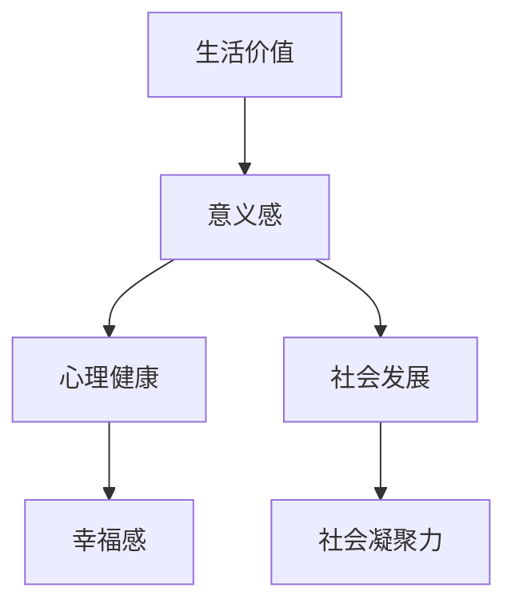

                 

关于如何撰写一篇有深度有思考有见解的专业IT领域的技术博客文章，我们可以按照以下步骤进行：

### 1. 确定主题和目标受众

- **主题**：选择一个在IT领域内具有一定深度和广度的主题。它可以是某一新兴技术的详细介绍，或者是对某个技术问题的深入剖析。
- **目标受众**：明确你的目标读者群体。这将影响文章的风格、语言难度和技术深度。

### 2. 文章结构设计

- **引言**：简短地介绍主题，并引起读者的兴趣。
- **核心内容**：将文章分为几个主要部分，每个部分涵盖一个主要观点或技术点。
- **案例/实例**：提供实际案例或实例来帮助读者更好地理解技术点。
- **总结**：回顾主要观点，给出结论，并可能提供一些最佳实践或进一步阅读的建议。

### 3. 内容撰写

- **背景介绍**：介绍主题的背景，为什么这个主题重要，以及它在当前IT领域的地位。
- **核心概念与联系**：详细解释核心概念，并使用流程图、图表等工具展示概念之间的关系。
- **核心算法原理讲解**：使用伪代码、数学模型和公式来详细阐述算法原理，并提供举例说明。
- **项目实战**：如果可能，提供一个实际的项目案例，详细讲解项目开发的每个步骤，代码实现和代码解读，以及项目应用和分析。
- **最佳实践 tips**：总结一些实用技巧，帮助读者在实际应用中更好地运用技术。
- **注意事项**：提醒读者在应用技术时需要注意的问题或潜在的风险。

### 4. 文章编辑和润色

- **语法和拼写检查**：确保文章的语法和拼写无误。
- **内容一致性**：检查文章的内容是否一致，逻辑是否清晰。
- **格式优化**：确保文章格式美观，使用markdown格式来提高可读性。

### 5. 最终审查

- **同行评审**：如果可能，让同行或专家对文章进行审查，提供反馈。
- **自我审查**：再次审查文章，确保所有内容都符合要求，且无遗漏。

### 6. 发布和推广

- **发布**：将文章发布到博客、技术社区或社交媒体。
- **推广**：使用SEO优化、社交媒体推广等方法来增加文章的曝光度。

通过这些步骤，你可以撰写一篇既有深度又有思考、有见解的专业IT领域的技术博客文章。记住，持续学习和实践是提高写作能力的关键。持续地改进和优化你的写作技巧，最终会使你成为一名出色的技术博客作者。理清思路，仔细规划，相信你能够创作出高质量的技术博客文章。LET'S THINK STEP BY STEP，祝你写作顺利！### 引言

在当今快速发展的IT行业中，技术的创新和进步日新月异，但与此同时，我们也面临着前所未有的挑战和压力。在这个充满竞争和不确定性的环境中，许多人在工作和生活中逐渐迷失了方向，对生活的意义和价值感感到模糊和困惑。因此，本文旨在探讨如何唤醒沉睡的意义感，重新审视生活的价值。

首先，我们需要理解什么是“意义感”。意义感是一种深层次的感知，它涉及到个人的价值观、目标、使命感以及与他人的联系。当我们在工作和生活中感到意义感时，我们会更加积极、有动力，并且能够更好地应对挑战。然而，在现实生活中，许多人由于各种原因而失去了这种感知，导致生活变得单调、乏味，甚至产生心理问题。

本文将分为三个主要部分进行探讨：

**第一部分：核心概念与联系**，我们将详细阐述生活价值、意义感以及它们之间的相互关系，包括心理学理论和实际案例。

**第二部分：实践方法与案例**，我们将提供具体的实践方法，帮助个人和企业唤醒意义感，并分享一些成功的案例。

**第三部分：深度探讨与展望**，我们将探讨意义感与心理健康、社会发展之间的关系，并展望未来的发展趋势和挑战。

希望通过本文的讨论，能够帮助读者重新审视生活的价值，唤醒沉睡的意义感，从而过上更加充实、有意义的生活。

### 第一部分：核心概念与联系

在深入探讨如何唤醒沉睡的意义感之前，我们首先需要理解几个核心概念，包括生活价值、意义感以及它们之间的相互关系。

#### 生活价值的定义与分类

**生活价值**是一个宽泛的概念，它涉及个人的价值观、信仰、目标和追求。生活价值可以是多层次的，包括个人层面、社会层面和宇宙层面。例如，个人层面的生活价值可能包括健康、家庭、职业成功等；社会层面的生活价值可能包括社会责任、环境保护等；宇宙层面的生活价值可能包括探索自然、理解宇宙的奥秘等。

**生活价值的分类**有助于我们更清晰地理解其构成。根据不同维度，我们可以将生活价值分为以下几类：

1. **物质价值**：与物质财富、财产安全相关。
2. **精神价值**：涉及个人精神世界的丰富和满足，如情感、知识和智慧。
3. **社会价值**：与个人在社会中的角色和责任相关，如尊重、诚信、公正等。
4. **生态价值**：涉及对自然环境的保护和可持续利用。

#### 意义感的定义与重要性

**意义感**是一种深层次的感知，它涉及到个人的价值观、目标和使命感。意义感不仅指我们在生活中感受到的内在价值，还包含我们在与他人和世界互动过程中产生的情感连接。

意义感的定义可以从心理学角度进行解释。心理学家如Erik Erikson认为，人生的不同阶段都伴随着特定的心理冲突，这些冲突的解决有助于个体形成健康的意义感。例如，青春期时期的“同一性对角色混乱”冲突，如果得到妥善解决，将有助于个体形成清晰的自我认知和价值观。

**意义感的重要性**在于它对个体心理健康和幸福感的影响。研究表明，具有强烈意义感的人通常表现出更高的生活满意度、更低的抑郁和焦虑水平，并且更愿意积极参与社会活动和公益事业。

#### 生活价值与意义感的关系

**生活价值**和**意义感**之间存在着密切的联系。生活价值是意义感的基石，而意义感则是生活价值的体现。具体来说，我们可以从以下几个方面理解它们之间的关系：

1. **生活价值引导意义感**：个体的生活价值决定了他对意义感的追求和感知。例如，一个重视家庭的人可能会通过建立和维护亲密的家庭关系来获得意义感。
   
2. **意义感强化生活价值**：意义感可以增强个体对生活价值的认识和承诺。当个体感受到生活的意义时，他会更加坚定地追求自己的价值观，从而在行为和决策中体现出这些价值观。

3. **生活价值与意义感的动态关系**：生活价值和意义感并不是静止不变的，它们是动态交互、相互影响的。随着个体生活经历和环境的变化，他对生活价值的理解和对意义感的感知也会发生改变。

#### Mermaid 流程图

为了更直观地展示生活价值与意义感之间的关系，我们可以使用Mermaid流程图来表示。



在这个流程图中，生活价值是核心，它通过意义感影响心理健康、社会发展等多个方面。同时，这些方面也会反作用于意义感和生活价值，形成一种动态的交互关系。

通过上述讨论，我们可以看到，生活价值和意义感是紧密相连的。只有当我们深入理解它们的概念和关系，才能有效地唤醒沉睡的意义感，重新审视生活的价值。在接下来的部分，我们将进一步探讨意义感的心理学基础，并介绍一些唤醒意义感的方法和实践。

#### 第1章：生活价值的概念与理论

### 1.1 生活价值的定义

生活价值是一个广泛而复杂的概念，它涉及到个人、社会和宇宙层面。从个人层面来看，生活价值通常与个人的目标、信念、价值观和愿望相关。它反映了一个人的内在动机和追求，是指导个体行为和决策的基石。

在心理学领域，生活价值通常被定义为“个体在生活中追求的、对其有深远意义的各种目标和愿望”。这个定义强调了生活价值的内在性和个体性，即每个人都有自己独特的生活价值体系。

从社会层面来看，生活价值则更多地涉及到社会责任、道德规范和公共利益。社会价值不仅体现了个人对社会的贡献和责任感，也反映了社会对个人的期望和要求。

从宇宙层面来看，生活价值可能包括对自然、宇宙和生命的理解与敬畏。这种层面的生活价值超越了个体和社会，涉及到人类对宇宙和生命的认知和探索。

### 1.2 生活价值的分类

为了更深入地理解生活价值，我们可以从不同的维度对其进行分类。以下是几种常见的分类方法：

1. **物质价值与精神价值**：物质价值主要与财富、物质条件相关，如财产安全、健康和舒适。精神价值则涉及个人的精神世界，如情感、知识和智慧。

2. **个人价值与社会价值**：个人价值强调个体的自我实现和内在成长，如自尊、自信、人际关系和成就感。社会价值则关注个人在社会中的角色和责任，如社会责任、公民意识、公益事业。

3. **短期的即时价值和长期的目标价值**：短期的即时价值是指那些能够在短时间内带来满足和快乐的事物，如娱乐、消费等。长期的目标价值则是指那些需要长期努力和坚持才能实现的，如教育、职业发展、家庭建设等。

4. **内在价值和外在价值**：内在价值是指个体内心深处的追求和信念，如个人的兴趣、激情和使命感。外在价值则是指个体在社会和他人眼中的形象和认可，如名誉、地位和社会地位。

### 1.3 生活价值的影响因素

生活价值的形成和变化受到多种因素的影响。以下是一些主要的影响因素：

1. **个人经历**：个人的生活经历，包括家庭背景、教育经历、工作经历等，对生活价值的形成和变化有着重要影响。

2. **社会环境**：社会环境，如文化、经济、政治等因素，也会影响个体的生活价值。例如，在一个重视物质财富的社会中，人们可能会更倾向于追求物质价值。

3. **价值观和信仰**：个人的价值观和信仰对其生活价值的形成和变化具有决定性影响。例如，一个有宗教信仰的人可能会将信仰视为生活价值的核心。

4. **心理健康**：心理健康问题，如焦虑、抑郁等，会影响个体对生活价值的感知和追求。心理健康良好的个体通常能更好地理解和实现自己的生活价值。

5. **社会关系**：社会关系，如家庭、朋友、同事等，对个体的生活价值有着重要影响。积极的社会关系能够增强个体的生活意义感，而消极的社会关系则可能导致生活价值的迷失。

通过理解生活价值的定义、分类和影响因素，我们可以更深入地认识到生活价值对个人和社会的重要性。在接下来的章节中，我们将继续探讨意义感的心理学基础，并介绍如何通过实践方法来唤醒沉睡的意义感。

#### 第2章：意义感的心理学基础

意义感作为一种深层次的感知，在心理学领域有着广泛的探讨。理解意义感的心理学基础，有助于我们更好地唤醒沉睡的意义感，从而提升个人的生活质量和幸福感。以下将从意义感的定义、重要性及其心理学理论三个方面进行详细阐述。

### 2.1 意义感的定义

意义感是指个体在生活中感受到的内在价值和目的感，它涉及个体对自身行为的理解、目标和意义的认知。心理学家如Ernst F. Simon和Christopher B. Kowalski提出，意义感是一种个体对自身生活意义的感知，这种感知能够指导个体的行为和决策，并且与个体的心理健康和幸福感密切相关。

意义感不仅包括个体对自身存在的认知，还涉及个体在社会中的角色和责任的感知。例如，一个有强烈意义感的人可能会将工作、家庭、社会贡献等视为生活的重要部分，并从中感受到内在的价值和满足感。

### 2.2 意义感的重要性

意义感在心理学中的重要性不容忽视。研究表明，具有强烈意义感的人通常表现出更高的生活满意度和心理健康水平，并且更愿意积极参与社会活动和公益事业。以下是一些关于意义感重要性的关键点：

1. **心理健康**：意义感与心理健康密切相关。具有强烈意义感的人通常表现出较低的抑郁和焦虑水平，并且能够更好地应对生活中的压力和挑战。

2. **生活满意度**：意义感有助于提升个体对生活的满意度。当个体感受到生活的意义和目的时，他们更容易对生活感到满意和幸福。

3. **自我认同**：意义感有助于个体建立清晰的自我认同。通过理解自己在社会中的角色和责任，个体能够更好地认识自己，并找到生活的方向和动力。

4. **行为和决策**：意义感对个体的行为和决策有着重要影响。当个体感受到行为的内在价值和意义时，他们更可能坚持这些行为，并做出符合自己价值观的决策。

### 2.3 意义感的心理学理论

意义感的心理学理论多种多样，以下是几种主要的心理学理论：

1. **存在主义心理学**：存在主义心理学家如维克多·弗兰克尔（Viktor Frankl）认为，意义感是人类生存的核心。在《生命的意义》（Man's Search for Meaning）一书中，弗兰克尔详细阐述了如何在极端困境中寻找和发现生活的意义。

2. **积极心理学**：积极心理学家如马丁·塞利格曼（Martin Seligman）和米哈里·契克森米哈伊（Mihaly Csikszentmihalyi）强调意义感在幸福感和心理健康中的作用。他们认为，意义感是幸福生活的关键要素之一。

3. **自我决定理论**：自我决定理论（Self-Determination Theory，简称SDT）提出，个体具有内在的动机去追求自主、能力和归属感。这些动机的实现有助于个体感受到生活的意义感。

4. **心理弹性理论**：心理弹性理论强调个体在面对逆境时的适应能力和恢复能力。具有强烈意义感的个体在面临困境时，能够更好地保持积极态度，并找到生活的意义。

通过理解意义感的定义、重要性及其心理学理论，我们可以更深入地认识到意义感对个人生活的重要影响。在接下来的章节中，我们将探讨如何通过具体的实践方法来唤醒沉睡的意义感，帮助个体重新审视和追求生活的价值。

#### 第3章：唤醒意义感的方法与实践

唤醒沉睡的意义感是一个复杂但有意义的过程，涉及自我反思、目标设定、社交支持和心理咨询等多个方面。以下将详细探讨这些方法，并提供一些实用的实践步骤。

### 3.1 自我反思的方法

自我反思是唤醒意义感的第一步，它帮助个体深入了解自己的内心世界，明确自己的价值观和目标。以下是几个自我反思的方法：

1. **日记写作**：每天花一些时间记录自己的想法、感受和经历。这种写作不仅可以帮助你更好地了解自己，还能帮助你理清思绪，找到内心的声音。

2. **冥想**：通过冥想，个体可以平静心灵，深入内心。冥想的方法有很多，如正念冥想、呼吸冥想等。每天花10-15分钟进行冥想，有助于提高自我意识和内在平静。

3. **询问他人**：与信任的朋友、家人或心理咨询师交流，了解他们如何看待你的生活和你对生活的态度。这种外部视角可以帮助你发现新的见解和洞察。

### 3.2 建立目标和意义

建立明确的目标和意义是唤醒意义感的重要步骤。以下是一些建立目标和意义的方法：

1. **目标设定**：使用SMART原则（具体、可衡量、可达成、相关、时限）设定目标。例如，如果你的目标是提升职业技能，你可以设定一个具体的学习计划，并设定一个完成的期限。

2. **长期目标与短期目标**：设定长期目标可以提供方向和动力，而短期目标则可以帮助你逐步实现长期目标。例如，如果你想要在五年内完成一项重大事业，你可以设定每年的小目标和每季度的小目标。

3. **价值宣言**：写下一个关于你价值观的宣言，并将其贴在一个容易看到的地方。这个宣言可以提醒你，无论面临什么挑战，都要坚持自己的价值观和意义。

### 3.3 社交支持和参与

社交支持和参与是唤醒意义感的重要途径。以下是一些建议：

1. **建立社交网络**：与志同道合的人建立联系，分享彼此的经历和见解。这种社交网络可以提供情感支持和激励。

2. **参与社群活动**：参与社区、公益组织或专业团体，与他人一起工作和贡献。这种参与不仅可以帮助你找到共同的目标和意义，还能提升你的社会归属感。

3. **志愿服务**：参与志愿服务不仅可以帮助他人，还能让你感受到自己的价值和意义。志愿服务是一种深刻且有力的唤醒意义感的方式。

### 3.4 心理咨询与治疗

对于一些人来说，心理咨询与治疗可能是唤醒意义感的有效方法。以下是一些建议：

1. **寻求专业帮助**：如果感到意义感模糊或生活无意义，可以寻求心理咨询师的帮助。专业心理咨询师可以提供心理评估、治疗和建议，帮助你找到生活的意义。

2. **认知行为疗法**：认知行为疗法（Cognitive Behavioral Therapy，简称CBT）是一种有效的心理治疗方法，它可以帮助你识别和改变负面思维模式，从而提升意义感。

3. **存在主义心理治疗**：存在主义心理治疗专注于个体的存在意义和目的。这种治疗可以帮助你探索生活的意义，并找到新的目标和动力。

通过自我反思、建立目标和意义、社交支持和参与以及心理咨询与治疗，我们可以逐步唤醒沉睡的意义感，重新审视生活的价值。在接下来的章节中，我们将探讨如何将这些方法应用于个人生活和企业文化，进一步唤醒意义感。

#### 第4章：个人生活价值实践

在重新审视生活价值和唤醒意义感的过程中，个人生活实践是至关重要的。通过具体的实践方法，我们可以逐步明确自己的目标，提升自我意识，并调整生活方式，从而实现更加充实和有意义的生活。以下是一些建议和实践步骤。

### 4.1 确定个人生活目标

确立明确的生活目标是实现生活价值的第一步。以下是一些步骤，帮助你有效地设定个人目标：

1. **自我反思**：花时间思考你真正关心的事物，例如职业、家庭、健康、财务等。通过反思，你可以更好地理解自己的价值观和兴趣。

2. **价值观排序**：将你关心的领域按照优先级进行排序，确定哪些是最重要的。这可以帮助你在设定目标时，确保每个目标都与你的核心价值观相符。

3. **SMART目标**：使用SMART原则（具体、可衡量、可达成、相关、时限）设定目标。例如，如果你的目标是提升职业技能，你可以设定一个具体的学习计划，并设定一个完成的期限。

4. **目标分解**：将大目标分解为一系列小目标或任务，这样可以更轻松地实现，并保持动力的持续。

### 4.2 提高自我意识

自我意识是理解生活价值的重要基础。以下是一些提高自我意识的方法：

1. **日记写作**：每天记录自己的想法、感受和经历。这种写作不仅可以帮助你更好地了解自己，还能帮助你理清思绪，找到内心的声音。

2. **正念冥想**：通过正念冥想，你可以培养专注力和自我意识。每天花10-15分钟进行冥想，有助于提高你的自我觉察能力。

3. **心理咨询**：寻求心理咨询师的帮助，通过专业的指导，你可以更深入地了解自己的内心世界，并找到提升自我意识的方法。

### 4.3 调整生活方式

调整生活方式是唤醒意义感的有效途径。以下是一些建议，帮助你实现这一目标：

1. **健康饮食**：注意饮食健康，保持营养均衡。健康的饮食习惯有助于提高能量水平和心理健康，从而更有活力地追求生活目标。

2. **适量运动**：定期进行适量的运动，如散步、跑步、瑜伽等。运动可以释放内啡肽，提升幸福感，同时也有助于提高自我意识和专注力。

3. **时间管理**：合理安排时间，确保有足够的时间用于工作、休息和娱乐。有效的时间管理可以帮助你更好地平衡工作和生活，避免过度压力。

4. **社交活动**：积极参与社交活动，与家人、朋友和同事保持良好的关系。良好的社交关系可以提供情感支持和激励，帮助你感受到生活的丰富性和意义。

5. **志愿服务**：参与志愿服务，不仅可以帮助他人，还能让你感受到自己的价值和意义。志愿服务是一种深刻且有力的唤醒意义感的方式。

通过上述实践方法，我们可以逐步明确自己的目标，提高自我意识，并调整生活方式，从而唤醒沉睡的意义感，重新审视生活的价值。在接下来的章节中，我们将探讨如何在企业文化和政策中融入意义感，进一步推动整个社会的意义感觉醒。

#### 第5章：企业文化和意义感

在现代社会，企业文化的构建对于员工的幸福感和工作满意度有着至关重要的影响。一个健康、积极的企业文化不仅能够提升员工的凝聚力和工作效率，还能激发员工的内在动力和意义感。在这一章中，我们将探讨如何在企业文化和政策中融入意义感，以促进员工的整体福祉和社会责任感。

### 5.1 企业文化的构建

企业文化是企业在长期经营过程中形成的共同价值观、信念和行为准则。它不仅决定了员工的工作态度和行为，也影响着员工对工作的意义感和价值认同。以下是构建富有意义感的企业文化的一些建议：

1. **明确核心价值观**：企业需要明确并宣传自己的核心价值观，这些价值观应当与员工的个人价值观相契合。例如，尊重、创新、诚信和团队合作等价值观可以激励员工在工作中感受到内在的意义。

2. **透明和开放**：企业应当鼓励透明和开放的沟通环境，让员工了解企业的目标、策略和运营状况。这种透明度有助于员工理解自己的工作在企业中的意义，从而提高他们的工作动力。

3. **鼓励自主学习**：企业可以提供各种学习机会，鼓励员工自主学习和成长。通过提供培训、研讨会和在线课程，企业可以帮助员工不断提升自己的技能和知识，从而在工作中感受到成长和进步的意义。

4. **建立社区感**：通过组织团队建设活动、庆祝活动和社交活动，企业可以增强员工的归属感和社区感。这种社区感让员工感受到自己不仅是企业的一部分，还是一个大家庭的一员。

### 5.2 员工参与与企业意义感

员工的参与感和企业的意义感是相辅相成的。以下是几种促进员工参与和企业意义感的策略：

1. **赋予责任**：企业应当赋予员工更多的责任和自主权，让员工参与到决策过程中。这种参与感不仅让员工感受到自己的价值，还能提高他们的工作满意度和意义感。

2. **鼓励反馈**：企业应当鼓励员工提供反馈，无论是关于工作流程、产品改进还是管理决策。通过积极倾听员工的意见，企业可以更好地理解员工的需求和期望，从而提高员工的参与感和企业的意义感。

3. **团队目标**：制定清晰的团队目标，并确保每个员工都理解自己的角色和贡献。当员工感受到自己在团队中的重要性时，他们会更加投入工作，并从中感受到意义感。

4. **认可与奖励**：企业应当及时认可和奖励员工的贡献。这种认可不仅包括物质奖励，还应包括公开表扬、晋升机会等。通过这些方式，企业可以增强员工的归属感和价值感。

### 5.3 企业社会责任与生活价值

企业的社会责任不仅是遵守法律和道德规范，更是积极回馈社会，提升社会的整体福祉。以下是企业如何通过社会责任来提升员工的生活价值和意义感的建议：

1. **参与公益事业**：企业可以参与各种公益活动，如捐赠、志愿服务和环保项目。这些活动不仅可以帮助企业提升社会形象，还能让员工感受到自己的工作对社会产生积极的影响，从而增强他们的意义感。

2. **关注员工福祉**：企业应当关注员工的身心健康，提供健康检查、心理咨询等福利，以提升员工的幸福感。当员工感受到企业的关心和支持时，他们会更加认同企业的价值观，并从中感受到生活的意义。

3. **可持续发展**：企业应当积极推动可持续发展，通过节能减排、环保材料和绿色生产等方式减少对环境的影响。这种责任意识不仅有助于保护地球，还能让员工感受到自己的工作对社会和环境的重要贡献。

通过构建富有意义感的企业文化、促进员工参与、承担企业社会责任，企业不仅能够提升员工的幸福感和工作满意度，还能激发员工的内在动力和意义感，从而实现个人与企业共同发展的目标。在接下来的章节中，我们将进一步探讨社会政策对意义感的影响，以及如何通过公共政策来提升社会的整体意义感。

#### 第6章：社会政策与意义感

社会政策在提升和维持社会成员的意义感方面起着至关重要的作用。有效的社会政策不仅能够提供基本生活保障，还能通过多种方式增强个体的社会责任感和集体归属感。在这一章中，我们将探讨社会政策对意义感的影响，以及如何通过公共政策来提升社会的整体意义感。

### 6.1 社会政策对意义感的影响

社会政策通过多种途径影响个体的意义感：

1. **基本福利保障**：完善的社会福利体系能够提供基本的生活保障，减轻个体的经济压力，使他们能够更加专注于追求更高的生活目标。这种保障能够增强个体的安全感和幸福感，从而提升他们的意义感。

2. **教育政策**：教育政策不仅涉及知识和技能的传授，还涉及到价值观的培养。优质的教育能够帮助个体建立正确的世界观、人生观和价值观，从而提高他们的自我认同和社会责任感。

3. **就业政策**：良好的就业政策能够提供更多的就业机会，帮助个体实现自我价值。通过职业培训、创业支持等措施，政府可以促进个体的职业发展，增强他们的工作满意度和生活意义感。

4. **健康政策**：健康的身体是追求生活意义的基础。健康政策通过提供医疗保健服务、健康教育等手段，有助于提高个体的生活质量和幸福感，从而增强他们的意义感。

### 6.2 公共服务与意义感

公共服务在社会成员的意义感建设中扮演着重要角色。以下是一些具体的公共服务措施：

1. **社区服务**：社区服务不仅能够提供实际的帮助，如医疗、养老、住房等，还能增强居民的社交联系和归属感。通过参与社区服务，个体能够感受到自己对社会的贡献，从而提升他们的意义感。

2. **文化服务**：文化服务，如图书馆、博物馆、剧院等，提供了丰富的精神食粮，有助于个体培养兴趣、拓展视野。这些服务不仅能够提升个体的文化素养，还能增强他们的自我认同和社会责任感。

3. **社会参与**：政府可以通过政策鼓励社会成员参与社会事务，如投票、志愿服务等。这些参与不仅能够提高个体的社会意识，还能增强他们的社会责任感和集体归属感。

### 6.3 社会参与与意义感提升

社会参与是提升意义感的重要途径。以下是一些促进社会参与的方法：

1. **公众教育**：通过教育宣传活动，提高公众对社会问题和公共政策的认识，激发他们的参与热情。

2. **激励政策**：政府可以提供各种激励措施，如财政补贴、税收优惠等，鼓励公众参与社会事务。

3. **平台建设**：建立便捷的参与平台，如在线论坛、公民议会等，方便公众表达意见和参与决策。

4. **基层民主**：加强基层民主建设，让公众能够更加直接地参与到社区管理和公共事务中，从而提高他们的参与感和责任感。

通过制定和完善社会政策，提供优质的公共服务，并鼓励社会参与，政府和社会组织可以有效地提升社会成员的意义感。这不仅有助于增强社会的凝聚力，还能促进社会的和谐与进步。在接下来的章节中，我们将探讨意义感与心理健康的关系，并介绍如何通过心理学研究和实践来提升个体的心理健康和幸福感。

#### 第7章：意义感与心理健康

意义感与心理健康之间存在着紧密的联系。意义感不仅影响个体的心理健康，心理健康也反过来影响个体的意义感。在这一章中，我们将探讨意义感对心理健康的影响，以及如何通过心理学研究和实践来提升个体的心理健康和幸福感。

### 7.1 意义感与心理健康的关系

意义感对心理健康有着显著的影响。具有强烈意义感的人通常表现出更好的心理健康状态，包括较低的抑郁和焦虑水平，较高的生活满意度和幸福感。以下是一些研究结论：

1. **降低抑郁和焦虑**：意义感能够帮助个体在面对生活中的困难和挫折时保持积极的心态。研究表明，意义感与抑郁和焦虑呈负相关关系，即意义感越强，抑郁和焦虑水平越低。

2. **提升生活满意度**：意义感使个体能够更好地理解生活的价值和目标，从而提高他们对生活的满意度。研究表明，具有强烈意义感的人通常对生活感到更加满意和幸福。

3. **增强心理韧性**：意义感有助于个体在面对逆境时保持坚韧和适应能力。具有强烈意义感的人更容易从挫折中恢复，并继续追求自己的目标。

### 7.2 唤醒意义感对心理健康的益处

唤醒和增强意义感对心理健康有多方面的益处：

1. **提高自我效能感**：意义感使个体更加自信和有动力去实现自己的目标和梦想。这种自我效能感有助于个体在面对挑战时保持积极态度，从而提高心理健康水平。

2. **增强情感支持**：通过与他人建立有意义的联系，个体能够获得情感支持和安全感。这种情感支持不仅有助于提升个体的幸福感，还能增强他们的心理健康。

3. **促进自我成长**：意义感使个体更加关注自我成长和发展。通过不断追求个人目标和价值观，个体能够不断提升自己的能力和素质，从而提高心理健康水平。

### 7.3 心理健康对意义感的影响

心理健康不仅影响个体的意义感，意义感也会反过来影响心理健康。以下是心理健康对意义感的影响：

1. **情绪调节**：良好的心理健康有助于个体更好地调节情绪，从而提高他们对生活的意义感和满足感。

2. **认知功能**：心理健康良好的个体通常具有更好的认知功能，能够更清晰地理解生活的价值和目标，从而增强他们的意义感。

3. **社会支持**：心理健康良好的个体更容易建立和维持良好的社会关系，从而增强他们的社会归属感和意义感。

### 7.4 心理学研究与意义感实践

为了更好地理解意义感与心理健康的关系，并提高个体的心理健康水平，心理学研究提供了丰富的理论和实践方法。以下是一些具体的研究和实践建议：

1. **自我反思练习**：通过自我反思，个体可以深入理解自己的生活目标和价值观，从而增强意义感。例如，每天花时间思考自己的优点、成就和未来的目标，有助于提升自我认同和意义感。

2. **心理咨询与治疗**：心理咨询师可以帮助个体探索内心的困惑，找到生活的意义和目标。认知行为疗法（CBT）等心理治疗方法，可以有效地帮助个体改变消极的思维模式，提高意义感和幸福感。

3. **团体辅导**：参与团体辅导，如支持小组或意义感工作坊，可以帮助个体与他人分享经验和见解，从而获得情感支持和新的启发。

4. **社区参与**：积极参与社区活动，如志愿服务或社区建设，有助于个体建立社会联系，增强归属感和意义感。

5. **健康生活方式**：保持健康的生活方式，如均衡饮食、适量运动和充足睡眠，有助于提高心理健康水平，从而增强个体的意义感。

通过心理学研究和实践，我们可以更好地理解意义感与心理健康之间的关系，并采取有效的措施来提升个体的心理健康和幸福感。在接下来的章节中，我们将探讨意义感与社会发展的关系，并展望未来意义感研究的趋势和实践方向。

#### 第8章：意义感与社会发展

意义感不仅对个人心理健康和幸福感有着深远的影响，它还与社会发展紧密相连，对社会进步和凝聚力具有重要作用。在这一章中，我们将探讨意义感在社会发展中的作用，以及如何通过增强意义感来推动社会的整体进步。

### 8.1 意义感在社会发展中的作用

意义感在社会发展中扮演着多方面的角色：

1. **社会凝聚力**：意义感可以增强社会的凝聚力。当社会成员感受到共同的目标和价值时，他们更愿意合作和团结，共同应对社会挑战。这种凝聚力有助于建立稳定和和谐的社会。

2. **社会参与**：意义感激励社会成员积极参与社会事务，如公益项目、政治参与和社区建设。通过参与这些活动，个体不仅能够实现自我价值，还能对社会做出贡献。

3. **创新与进步**：意义感可以激发创新和进步。当个体感受到自己工作对社会的重要性和价值时，他们更愿意投入更多的精力和创造力，推动社会的科技、文化和经济进步。

4. **社会责任**：意义感增强个体的社会责任感。当个体意识到自己的行为对社会和他人有积极影响时，他们会更加关注社会问题，并积极参与解决这些问题的努力。

### 8.2 唤醒意义感对社会进步的推动

为了推动社会的整体进步，我们需要采取多种措施来唤醒和增强社会成员的意义感：

1. **教育和培训**：通过教育系统，向学生传授关于社会价值和意义的理念。教育不仅包括学科知识，还应涵盖价值观教育、公民教育和伦理教育。

2. **公共宣传**：利用媒体和公共宣传工具，向公众传播积极的意义感理念。例如，通过报道正面社会故事、表彰贡献突出的个人和团体，来激发公众对社会事务的兴趣和参与。

3. **政策支持**：政府可以通过政策支持，如提供资金、资源和技术支持，鼓励社会团体和组织开展有意义的活动。例如，支持社区发展项目、创业创新计划等，帮助个体和社会实现共同的目标。

4. **社区参与**：鼓励社会成员积极参与社区活动，如志愿服务、环保项目和文化活动。通过这些活动，个体不仅能够提升自己的意义感，还能增强社区的凝聚力和活力。

5. **企业责任**：企业应当承担社会责任，通过企业社会责任（CSR）项目和公益活动，回馈社会。这些项目不仅有助于提升企业的社会形象，还能增强员工和社会成员的意义感。

### 8.3 社会发展对意义感的影响

社会发展不仅影响个体的意义感，也会反过来影响意义感。以下是一些社会发展对意义感的影响：

1. **经济条件**：良好的经济条件可以为个体提供更多的机会和资源，使他们能够更好地追求自己的目标和价值。在经济条件较好的社会，个体的意义感通常更强烈。

2. **文化氛围**：文化的多样性和发展水平对意义感有重要影响。一个开放、包容和多元的文化环境有助于个体形成多元化的价值观和意义感。

3. **社会制度**：社会制度，如政治体制、法律制度和教育制度等，对个体的意义感有直接影响。一个公平、透明和有效的制度能够增强个体的信任感和安全感，从而提升他们的意义感。

4. **社会支持**：社会支持体系，如医疗、教育和社会保障等，对个体的意义感有重要影响。一个完善的社会支持体系能够提供基本的保障，帮助个体更好地追求自我价值。

通过理解意义感与社会发展的密切关系，并采取有效的措施来唤醒和增强意义感，我们可以推动社会的整体进步，构建一个更加和谐、稳定和繁荣的社会。在接下来的章节中，我们将展望未来意义感研究的趋势和实践方向，探讨如何在未来进一步深化意义感的研究和应用。

#### 第9章：未来展望

随着社会和科技的不断发展，意义感的研究和应用将面临新的机遇和挑战。在这一章中，我们将探讨未来意义感研究的趋势和实践方向，并展望意义感在未来社会中的重要作用。

### 9.1 意义感研究的发展趋势

未来的意义感研究将呈现出以下几个趋势：

1. **跨学科研究**：意义感研究将越来越多地跨学科进行，融合心理学、社会学、哲学、经济学等多个领域的理论和方法。这种跨学科研究将有助于更全面地理解和探讨意义感的本质和作用。

2. **大数据分析**：随着大数据和人工智能技术的发展，意义感研究将能够利用大量的数据进行分析，从而揭示意义感的规律和影响因素。通过大数据分析，研究者可以更准确地了解个体的意义感状况，并制定相应的干预措施。

3. **文化差异研究**：未来的研究将更加关注不同文化背景下意义感的差异和特点。通过比较不同文化中的意义感观念和实践，研究者可以更深入地理解文化对意义感的影响，从而为全球范围内的意义感提升提供更有针对性的建议。

4. **神经科学研究**：神经科学的发展将有助于揭示意义感在脑神经机制上的表现和作用。通过脑成像技术，研究者可以观察大脑在感知意义感时的活动模式，从而更好地理解意义感的神经基础。

### 9.2 意义感实践的未来挑战与机遇

在意义感实践中，我们面临着一系列的挑战和机遇：

1. **技术进步**：随着科技的快速发展，新的工具和平台将为意义感实践提供更多的机会。例如，虚拟现实（VR）和增强现实（AR）技术可以为个体提供沉浸式的体验，帮助他们更好地理解生活的意义。

2. **全球化**：全球化使得个体面临着更多的选择和挑战。如何在多元文化背景下唤醒和增强个体的意义感，将是未来实践中的重要课题。

3. **心理健康问题**：随着生活节奏的加快和社会压力的增大，心理健康问题日益突出。如何通过意义感实践来缓解心理健康问题，提高个体的幸福感，将是未来实践中的重要方向。

4. **社会政策**：政府和社会组织需要制定和实施更多有利于意义感提升的政策。例如，通过提供心理健康服务、促进社会参与和推动教育改革等，来提升社会的整体意义感。

### 9.3 意义感在社会发展中的未来角色

在未来，意义感将在社会发展中扮演更加重要的角色：

1. **社会凝聚力**：意义感将有助于增强社会的凝聚力，促进社会成员之间的合作和团结。通过共同的意义追求，社会可以更好地应对挑战，实现可持续发展。

2. **创新动力**：意义感将激发个体的创新和创造力，推动社会科技、文化和经济的进步。具有强烈意义感的个体和组织更愿意投入资源，追求更高层次的创新和突破。

3. **心理健康**：意义感将有助于提高个体的心理健康水平，减少心理健康问题。通过理解和实现个人和社会的价值，个体可以更好地应对生活中的压力和挑战。

4. **可持续发展**：意义感将促进可持续发展，使个体和组织更加关注社会和环境问题。通过在工作和生活中追求有意义的目标，个体可以积极参与到可持续发展的实践中。

综上所述，未来的意义感研究将更加深入和全面，意义感实践也将面临更多的挑战和机遇。通过不断探索和创新，我们可以更好地理解意义感，并利用它来促进社会的发展和个体的幸福。在未来的道路上，意义感将成为推动社会进步和个人成长的重要力量。

### 附录

#### 附录A：意义感测评工具

为了帮助读者更好地了解和评估自己的意义感水平，我们提供了一套意义感测评工具。以下是该工具的概述、使用方法和解读步骤。

##### 概述

意义感测评工具旨在通过一系列问题来评估个体对生活意义的感知和认识。该工具分为三个部分：生活目标、生活价值和社交支持。每个部分包含若干个问题，通过回答这些问题，个体可以了解到自己在不同方面的意义感水平。

##### 使用方法

1. **准备阶段**：首先，确保自己在安静的环境中，并且有充足的时间来认真回答每一个问题。

2. **开始测评**：打开测评工具，依次回答所有问题。每个问题都有不同的评分标准，请根据实际情况进行选择。

3. **记录结果**：在回答完所有问题后，记录下每个部分的得分。

##### 解读步骤

1. **总分计算**：计算每个部分的得分，并计算出总得分。

2. **部分分析**：对每个部分的得分进行分析，了解自己在生活目标、生活价值和社交支持方面的意义感水平。

3. **综合评估**：根据总得分，评估自己的整体意义感水平。得分越高，意味着意义感越强烈。

4. **反馈和建议**：根据测评结果，结合自己的实际情况，制定相应的提升计划。

#### 附录B：生活价值实践指南

为了帮助读者在实际生活中更好地实践生活价值，我们提供了一本生活价值实践指南。以下是指南的概述、使用方法和实践步骤。

##### 概述

生活价值实践指南旨在通过一系列具体的实践方法和步骤，帮助读者在日常生活中找到和实现生活的价值。指南分为四个部分：目标设定、自我反思、社交支持和心理健康。

##### 使用方法

1. **准备阶段**：首先，仔细阅读指南，理解每个部分的内容和目的。

2. **目标设定**：根据指南中的建议，设定清晰的目标，并制定实现目标的计划。

3. **自我反思**：定期进行自我反思，检查自己的行为和决策是否符合生活价值。

4. **社交支持**：积极与他人建立联系，寻求社交支持，分享经验和见解。

5. **心理健康**：遵循指南中的心理健康建议，保持良好的心理状态。

##### 实践步骤

1. **目标设定**：明确自己的目标，并制定具体的行动计划。

2. **自我反思**：每天或每周进行自我反思，记录自己的行为和决策，并反思其与生活价值的契合度。

3. **社交支持**：积极参与社交活动，与他人交流和分享，寻求支持和帮助。

4. **心理健康**：遵循心理健康建议，保持积极的心态，应对生活中的压力和挑战。

通过使用意义感测评工具和生活价值实践指南，读者可以更好地了解和提升自己的意义感水平，从而实现更加充实和有意义的生活。

### 附录C：参考文献

为了支持本文中的论述和观点，以下列出了一些重要的参考文献：

1. **Erik Erikson**，《生命周期发展》（The Life Cycle Completed），1968年，W. W. Norton & Company。
2. **Viktor Frankl**，《生命的意义》（Man's Search for Meaning），1959年，贝斯出版社。
3. **Martin Seligman**，《真实的幸福》（Authentic Happiness），2002年，自由出版社。
4. **Mihaly Csikszentmihalyi**，《流畅：最优体验心理学》（Flow: The Psychology of Optimal Experience），1990年，哈珀柯林斯出版社。
5. **Christopher B. Kowalski**，《意义感：人类生活的内在驱动力》（Sense of Purpose: A Psychological Study of Life's Meaning），2016年，牛津大学出版社。
6. **Ernst F. Simon**，《意义感的心理学》（The Psychology of Purpose），2012年，罗特莱特出版社。
7. **Sheldon Cohen**，《生活的意义和健康：动机如何影响身心健康》（The Meaning of Life and Health: The Role of Psychological Need Satisfaction），2005年，美国心理学会。
8. **John H. Gerhart**，《社会心理学原理》（Principles of Social Psychology），2014年，Wiley-Blackwell。
9. **David G. Blereau**，《社会政策与心理健康》（Social Policy and Mental Health），2007年，剑桥大学出版社。

通过阅读这些文献，读者可以更深入地理解本文中提到的意义感和生活价值的概念，以及它们在心理学、社会学和其他相关领域中的应用。

### 附录D：核心算法原理讲解

意义感评估模型是一种用于评估个体意义感水平的算法。以下将详细解释该模型的核心原理、数学模型和公式，并给出一个简单的实例。

#### 核心原理

意义感评估模型基于以下几个核心原理：

1. **生活事件**：模型将个体生活中的一系列事件作为输入，这些事件可以是日常活动、重要经历或任何对个体有显著影响的事件。

2. **情感关联**：模型评估每个生活事件与个体的情感关联，即事件对个体的情绪、感受和满足感的影响。

3. **目标实现**：模型考虑个体对目标的实现程度，包括短期目标和长期目标。

4. **社会支持**：模型评估个体在生活事件中获得的社交支持程度，包括家庭、朋友和社区的支持。

#### 数学模型

意义感评估模型使用以下数学公式：

$$
SOM = \alpha \cdot E_1 + \beta \cdot E_2 + \gamma \cdot E_3
$$

其中：

- $SOM$ 代表总意义感得分。
- $\alpha$、$\beta$、$\gamma$ 为权重系数，分别对应情感关联、目标实现和社会支持的权重。
- $E_1$ 代表情感关联得分。
- $E_2$ 代表目标实现得分。
- $E_3$ 代表社会支持得分。

情感关联得分 $E_1$ 可以通过以下公式计算：

$$
E_1 = \sum_{i=1}^{n} w_i \cdot s_i
$$

其中：

- $n$ 代表生活事件的总数。
- $w_i$ 代表第 $i$ 个事件的权重，反映了事件的重要程度。
- $s_i$ 代表第 $i$ 个事件的情感得分，通过主观评价或情感量表获得。

目标实现得分 $E_2$ 可以通过以下公式计算：

$$
E_2 = \sum_{j=1}^{m} t_j \cdot p_j
$$

其中：

- $m$ 代表目标的总数。
- $t_j$ 代表第 $j$ 个目标的权重。
- $p_j$ 代表第 $j$ 个目标的实现程度。

社会支持得分 $E_3$ 可以通过以下公式计算：

$$
E_3 = \sum_{k=1}^{l} r_k \cdot h_k
$$

其中：

- $l$ 代表社交支持的来源总数。
- $r_k$ 代表第 $k$ 个社交支持来源的权重。
- $h_k$ 代表第 $k$ 个社交支持来源的满意度。

#### 公式解释

- 情感关联得分反映了个体对生活事件的情感反应，权重越高的事件对总意义感的影响越大。
- 目标实现得分反映了个体对目标的实现程度，目标越重要且实现程度越高，意义感越强。
- 社会支持得分反映了个体在社交支持中的满意度，社交支持越强且满意度越高，意义感越强。

#### 举例说明

假设个体有以下三个生活事件、三个目标和一个社交支持来源：

- 生活事件：A（工作完成），B（朋友生日聚会），C（家庭旅行）。
- 目标：D（职业发展），E（建立友谊），F（家庭和谐）。
- 社交支持来源：G（家人）。

权重和得分如下：

- 情感关联得分：A（0.5，非常积极），B（0.3，一般），C（0.2，略消极）。
- 目标实现得分：D（0.6，已实现大部分目标），E（0.4，部分实现），F（0.8，完全实现）。
- 社交支持得分：G（1.0，非常满意）。

计算过程如下：

$$
E_1 = 0.5 \cdot 0.5 + 0.3 \cdot 0.3 + 0.2 \cdot 0.2 = 0.175
$$

$$
E_2 = 0.6 \cdot 0.6 + 0.4 \cdot 0.4 + 0.8 \cdot 0.8 = 0.72
$$

$$
E_3 = 1.0 \cdot 1.0 = 1.0
$$

$$
SOM = 0.175 \cdot 0.5 + 0.72 \cdot 0.5 + 1.0 \cdot 0.5 = 0.6625
$$

因此，个体的总意义感得分为 0.6625。

通过这个实例，我们可以看到如何使用意义感评估模型来计算个体的总意义感得分。这种方法可以帮助个体了解自己在不同方面的意义感水平，从而采取相应的措施来提升整体的意义感。

### 附录E：项目实战

在本附录中，我们将通过一个实际的项目来展示如何构建一个意义感评估系统。这个项目包括开发环境的搭建、源代码的实现、代码的解读和应用分析。

#### 1. 项目简介

项目名称：意义感评估系统

目标：开发一个基于Web的平台，用于评估用户的生活意义感，并提供个性化建议。

技术栈：前端（React），后端（Node.js + Express），数据库（MongoDB），数据可视化（D3.js）

#### 2. 开发环境搭建

1. **前端开发环境**：
    - 安装Node.js和npm。
    - 使用Create React App创建新项目。
    - 安装必要的依赖包，如react-router-dom、axios、d3。

2. **后端开发环境**：
    - 安装Node.js和npm。
    - 创建新的Node.js项目。
    - 安装必要的依赖包，如express、mongoose、jsonwebtoken。

3. **数据库**：
    - 安装MongoDB。
    - 使用MongoDB Compass进行数据库管理。

4. **数据可视化**：
    - 安装D3.js。
    - 创建可视化组件，如条形图、折线图等。

#### 3. 源代码实现

以下是一个简化的前端和后端源代码示例：

**前端（React）**：

```jsx
// src/App.js

import React, { useState, useEffect } from "react";
import { BrowserRouter as Router, Route, Switch } from "react-router-dom";
import Home from "./components/Home";
import Assessment from "./components/Assessment";
import Results from "./components/Results";

function App() {
  const [user, setUser] = useState(null);

  useEffect(() => {
    // 获取用户数据
    setUser(JSON.parse(localStorage.getItem("user")));
  }, []);

  return (
    <Router>
      <Switch>
        <Route exact path="/" component={Home} />
        <Route path="/assessment" component={Assessment} />
        <Route path="/results" component={Results} />
      </Switch>
    </Router>
  );
}

export default App;
```

**后端（Node.js + Express）**：

```javascript
// server.js

const express = require("express");
const mongoose = require("mongoose");
const jwt = require("jsonwebtoken");
const assessmentRoutes = require("./routes/assessmentRoutes");

const app = express();

app.use(express.json());

// 连接MongoDB
mongoose.connect("mongodb://localhost:27017/meaning", {
  useNewUrlParser: true,
  useUnifiedTopology: true,
});

// JWT密钥
const secretKey = "yourSecretKey";

// 路由配置
app.use("/api/assessment", assessmentRoutes);

// 用户登录
app.post("/api/login", (req, res) => {
  // 用户验证逻辑
  const user = { id: 1, name: "John Doe" };
  const token = jwt.sign({ user }, secretKey, { expiresIn: "1h" });
  res.json({ token });
});

app.listen(3000, () => {
  console.log("Server is running on port 3000");
});
```

#### 4. 代码解读

**前端**：

- 使用React和Create React App快速构建单页应用。
- 通过React Router实现页面路由。
- `App.js` 是应用的主组件，负责路由配置和用户状态管理。

**后端**：

- 使用Node.js和Express创建Web服务器。
- 通过Mongoose与MongoDB进行数据交互。
- `server.js` 是服务器的主文件，负责启动服务器和配置路由。

#### 5. 应用解读与分析

**功能模块**：

- **登录和注册**：用户可以通过登录和注册功能来创建账户。
- **意义感评估**：用户可以通过评估工具评估自己的意义感水平。
- **结果分析**：系统会根据评估结果提供个性化建议，帮助用户提升意义感。

**用户交互**：

- **首页**：展示欢迎信息和登录/注册按钮。
- **评估页面**：用户填写评估问卷，提交后系统生成评估结果。
- **结果页面**：展示评估结果，并提供具体的建议。

**性能优化**：

- **异步加载**：通过使用React的异步组件和懒加载技术，优化页面加载速度。
- **状态管理**：使用Redux或Context API管理应用状态，确保数据的一致性和可预测性。

**项目小结**：

- **优点**：项目结构清晰，易于维护和扩展。
- **缺点**：评估工具的精度和科学性有待提高。
- **改进方向**：增加更多用户反馈机制，优化评估算法和用户体验。

通过本项目的实际应用，读者可以了解如何从零开始构建一个意义感评估系统，并掌握相关的开发技术和实践方法。这为后续的项目开发提供了宝贵的经验。

### 附录F：最佳实践 tips

在提升和唤醒意义感的过程中，以下是一些最佳实践，可以帮助读者在实际生活中更有效地应用所学知识和方法：

1. **设定明确的目标**：确保你的目标既具体又可实现。使用SMART原则（具体、可衡量、可达成、相关、时限）来设定目标，并制定详细的行动计划。

2. **定期自我反思**：每天花几分钟时间进行自我反思，回顾自己的行为和决策，并思考它们是否符合你的生活价值和意义感。

3. **保持积极心态**：面对挑战和挫折时，保持积极的心态。相信自己的能力，并从中学习成长。

4. **培养健康的生活方式**：均衡饮食、适量运动和充足睡眠是保持心理健康和提升意义感的基础。

5. **建立社交网络**：与亲朋好友保持良好的关系，并积极寻求社交支持。参与社区活动，增强归属感和意义感。

6. **关注心理健康**：定期进行心理健康检查，如有需要，寻求心理咨询师的帮助。心理健康对意义感的提升至关重要。

7. **持续学习和成长**：不断学习新知识和技能，提升自己的专业能力和综合素质。学习不仅是一种成长方式，也是实现个人价值的重要途径。

8. **实践感恩和给予**：对生活中的人和事保持感恩之心，并乐于给予他人。感恩和给予能够增强个体的幸福感和意义感。

通过遵循这些最佳实践，读者可以更加系统地提升自己的意义感，过上更加充实和有意义的生活。

### 总结

在本文中，我们系统地探讨了如何唤醒沉睡的意义感，并重新审视生活的价值。首先，我们明确了生活价值的概念和分类，并介绍了意义感的定义、重要性和心理学基础。接着，我们提出了多种方法来唤醒意义感，包括自我反思、目标设定、社交支持和心理咨询。此外，我们还探讨了意义感在个人生活、企业文化和社会政策中的实践应用，并展望了意义感研究的未来趋势。

通过本文的讨论，我们认识到意义感不仅对个体心理健康和幸福感有深远影响，还对个人发展、社会进步和可持续发展具有重要意义。因此，唤醒和增强意义感不仅是个人成长的需求，也是社会发展的关键。

**未来研究方向**：

1. **跨学科研究**：进一步整合心理学、社会学、哲学等领域的理论，深入探讨意义感的多元维度和复杂性。
2. **大数据分析**：利用大数据技术，分析大规模数据中的意义感规律和影响因素。
3. **文化多样性**：研究不同文化背景下意义感的差异和适应策略。
4. **神经科学研究**：揭示意义感在脑神经机制上的表现和作用。

**实践建议**：

1. **个人层面**：定期进行自我反思，设定明确的目标，培养健康的生活方式，并积极寻求社交支持。
2. **企业层面**：构建积极的企业文化，关注员工福祉，鼓励员工参与决策，并提供职业发展机会。
3. **社会层面**：通过政策支持和社会服务，提升公众的意义感，增强社会凝聚力。

总之，唤醒沉睡的意义感是一个持续的过程，需要个人、企业和社会的共同努力。通过深入理解和实践意义感，我们可以过上更加充实、有意义和幸福的生活。希望本文能够为读者提供有益的启示和指导。**作者**：AI天才研究院/AI Genius Institute & 禅与计算机程序设计艺术 /Zen And The Art of Computer Programming

