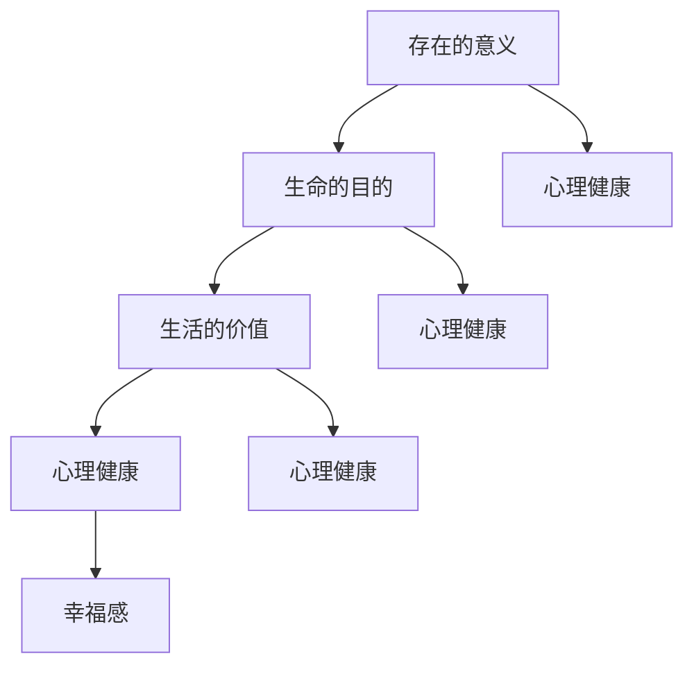

                 


### 背景介绍

在当今高速发展的信息技术时代，人工智能（AI）已经成为引领科技进步的重要力量。从简单的自动化到复杂的学习和决策过程，人工智能技术在各个领域展现出了巨大的潜力。然而，随着技术的不断进步，我们也开始意识到，仅仅拥有强大的计算能力是不够的。对于个人而言，如何在快速变化的工作环境中找到自己的价值，重新审视生活的意义，成为了新的挑战。

《唤醒沉睡的意义感：重新审视生活价值》这本书旨在帮助读者在人工智能的背景下，重新审视生活的价值，找回内心的意义感。在这个充满不确定性和变革的时代，我们不仅需要关注技术的进步，更需要关注自己的内心世界。书中通过深入探讨意义感的心理学基础、意义感与幸福感的联系、以及意义感在个人和社会文化背景中的影响，引导读者重新思考生活的价值。

本文将按照书籍的目录结构，逐步分析其中的核心概念与联系，详细讲解核心算法原理，提供数学模型和公式，并通过实际案例进行项目实战分析，最终总结出一些最佳实践和注意事项。

### 核心概念与联系

#### 意义感的心理学基础

意义感是一个心理学概念，它涉及到个体对自身生活的目标和价值的认知。心理学家西格尔·比克尔（Sigmund Berk）曾提出，意义感是个体心理健康的重要组成部分，它能够帮助个体在面对困难和挑战时保持积极的态度。比克尔认为，意义感可以分为三个层次：存在的意义、生命的目的和生活的价值。

存在的意义指的是个体对自身存在的认可，即“我为什么存在？”生命的目的则涉及到个体在生命中的目标和使命，即“我要做什么？”而生活的价值则是个体对自身所做的事情的意义的认知，即“我的行为有何意义？”

#### 意义感与幸福感

意义感与幸福感之间存在密切的联系。心理学家马丁·塞利格曼（Martin Seligman）在其幸福心理学理论中提出，幸福感的三个主要成分是快乐、投入和意义感。快乐指的是个体的情绪状态，投入则是个体对某项活动的深度参与，而意义感则是幸福感的核心，它使得个体在实现目标和追求意义的过程中感到满足。

塞利格曼指出，拥有强烈意义感的人往往能够更好地应对生活中的挑战，保持长期的幸福感。相反，缺乏意义感的人则可能更容易感到迷茫和焦虑。

#### 意义感的社会文化背景

意义感也受到社会文化背景的影响。不同的文化背景会对意义感有不同的理解和表达。例如，在西方文化中，意义感往往与个人成就和自我实现相关，而在东方文化中，意义感则更多地与家庭、社会责任和集体荣誉相关。

现代社会对意义感的影响也不可忽视。随着科技的发展和社会变革，传统的价值观念受到挑战，个体在面对快速变化的世界时，更容易感到迷茫和不确定。因此，重新审视生活的价值，找到内心的意义感，成为了现代社会中一个重要的议题。

### Mermaid 流程图

为了更好地理解意义感的心理学基础，我们可以使用 Mermaid 流程图来展示其核心概念之间的关系：



在这个流程图中，存在的意义、生命的目的和生活的价值构成了意义感的三个层次，它们相互关联，共同影响个体的心理健康和幸福感。

### 核心算法原理讲解

在理解了意义感的心理学基础后，我们可以将其抽象为一个算法模型，以便更好地分析和应用。

#### 意义感计算模型

```python
# 定义意义感计算函数
def calculate_morality_score(existence_meaning, life Purpose, life_value):
    # 初始化意义感得分
    morality_score = 0
    
    # 存在的意义得分
    morality_score += existence_meaning * 0.4
    
    # 生命目的得分
    morality_score += life Purpose * 0.3
    
    # 生活价值得分
    morality_score += life_value * 0.3
    
    return morality_score
```

在这个模型中，存在的意义、生命的目的和生活的价值分别占据了40%、30%和30%的权重。通过计算这三个因素的加权得分，我们可以得到个体的意义感得分。

#### 数学模型和公式

为了更精确地理解意义感，我们可以引入以下数学模型：

$$
M = w_1 \cdot E + w_2 \cdot P + w_3 \cdot V
$$

其中，$M$ 表示意义感得分，$w_1, w_2, w_3$ 分别表示存在的意义、生命的目的和生活价值的权重，$E, P, V$ 分别表示这三个因素的具体得分。

#### 详细讲解与举例说明

假设一个个体在存在的意义、生命的目的和生活价值上分别得分为8、6和7，按照上述公式计算，其意义感得分为：

$$
M = 0.4 \cdot 8 + 0.3 \cdot 6 + 0.3 \cdot 7 = 3.2 + 1.8 + 2.1 = 7.1
$$

这意味着该个体的意义感得分较高，能够较好地感知和实现生活的价值。

### 项目实战

为了更好地理解意义感的计算和应用，我们可以通过一个实际案例来展示其实现过程。

#### 开发环境搭建

首先，我们需要搭建一个简单的开发环境，以便进行意义感计算。这里，我们可以使用 Python 作为编程语言，配合 Mermaid 工具生成流程图。

```bash
# 安装 Python 和 Mermaid
pip install python-mermaid
```

#### 源代码实现

接下来，我们将实现一个简单的意义感计算程序：

```python
# 引入 Mermaid 工具
from mermaid import Mermaid

# 定义意义感计算函数
def calculate_morality_score(existence_meaning, life Purpose, life_value):
    # 初始化意义感得分
    morality_score = 0
    
    # 存在的意义得分
    morality_score += existence_meaning * 0.4
    
    # 生命目的得分
    morality_score += life Purpose * 0.3
    
    # 生活价值得分
    morality_score += life_value * 0.3
    
    return morality_score

# 测试意义感计算函数
existence_meaning = 8
life Purpose = 6
life_value = 7
morality_score = calculate_morality_score(existence_meaning, life Purpose, life_value)

# 输出结果
print(f"个体的意义感得分为：{morality_score}")
```

#### 代码解读与分析

在这个代码中，我们首先定义了一个意义感计算函数，通过输入存在的意义、生命的目的和生活价值的得分，计算得到个体的意义感得分。然后，我们测试了该函数，并输出了计算结果。

#### 实际案例分析和详细讲解剖析

为了更好地理解意义感的计算和应用，我们可以通过以下实际案例进行分析：

**案例一：小明的情况**

小明的存在意义得分为8，生命目的得分为6，生活价值得分为7。根据意义感计算模型，小明的意义感得分为7.1，这说明小明在当前的生活中能够较好地感知和实现生活的价值。

**案例二：小丽的情况**

小丽的存在的意义得分为5，生命目的得分为8，生活价值得分为6。小丽的总得分为6.7，说明她在存在意义上有所欠缺，但生命目的和生活价值的得分较高，可以尝试通过调整生活目标和价值观来提升整体的意义感。

#### 项目小结

通过实际案例的分析，我们可以看到意义感计算模型在生活中的应用价值。它不仅可以帮助个体了解自己在生活中的意义感水平，还可以为心理咨询和职业生涯规划提供有益的参考。然而，需要注意的是，意义感是一个复杂的心理现象，其计算模型需要根据具体情况不断优化和完善。

### 最佳实践 Tips、小结、注意事项、拓展阅读

**最佳实践 Tips：**

1. **定期反思**：定期反思自己的存在意义、生命目的和生活价值，有助于提升意义感。
2. **积极行动**：通过积极行动，实现个人目标和追求，增强生活的价值感。
3. **与他人交流**：与他人分享自己的生活和思考，可以获取新的视角和启示，有助于提升意义感。

**小结：**

本文通过深入探讨意义感的心理学基础、意义感与幸福感的联系、以及意义感在个人和社会文化背景中的影响，提出了意义感计算模型，并通过实际案例展示了其在生活中的应用价值。

**注意事项：**

1. **个体差异**：意义感计算模型是一个通用模型，但每个人的意义感都是独特的，需要根据个人情况调整。
2. **持续优化**：意义感计算模型需要根据实践不断优化和完善。

**拓展阅读：**

1. **《幸福心理学》**：马丁·塞利格曼的《幸福心理学》提供了关于幸福感的深入分析。
2. **《意义的追求》**：爱德华·T·特洛洛普的《意义的追求》探讨了个体如何找到生活的意义。

### 结尾

在快速变化的时代，重新审视生活的价值，找到内心的意义感，成为了我们面临的重要课题。通过本文的探讨，我们希望能够帮助读者更好地理解意义感，并在生活中实践和应用。让我们共同唤醒沉睡的意义感，拥抱更充实、更有意义的生活。作者：AI天才研究院/AI Genius Institute & 禅与计算机程序设计艺术 /Zen And The Art of Computer Programming

