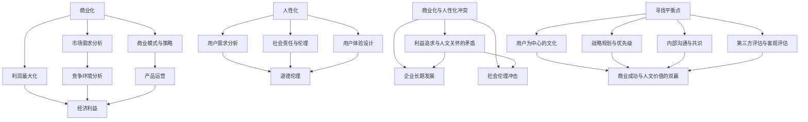

                 


### 文章标题：商业化与人性化的意义冲突：在利益与价值间寻找平衡

#### 关键词：商业化、人性化、利益冲突、价值平衡、商业策略

#### 摘要：
本文旨在探讨商业活动中的两大驱动力——商业化和人性化之间的内在冲突，并分析如何在追求经济利益的同时，维护和提升人文价值。通过对商业化与人性化的定义、联系与差异的深入分析，我们提出了寻找利益与价值平衡的方法，结合实际案例进行验证，为商业实践提供理论指导和实践参考。

### 确定书籍核心内容

首先，我们需要明确这本书的核心内容和结构。书名《商业化与人性化的意义冲突：在利益与价值间寻找平衡》暗示了本书主要探讨的是在商业行为中如何处理商业化与人性化之间的矛盾，并找到平衡点。

**核心内容：**
1. 商业化：探讨商业运作的基本原理，如市场需求分析、商业策略等。
2. 人性化：关注人性化的商业实践，如用户体验、社会责任、道德伦理等。
3. 冲突与平衡：分析商业化与人性化之间的冲突，以及如何在这两者之间寻找平衡。

### 目录大纲设计

根据上述核心内容，我们可以设计一个初步的目录大纲：

```
# 《商业化与人性化的意义冲突：在利益与价值间寻找平衡》目录大纲

## 第一部分 商业化概述
### 1.1 商业化基本概念
### 1.2 商业模式与策略
### 1.3 市场需求与竞争分析

## 第二部分 人性化关注
### 2.1 人性化商业实践
### 2.2 用户需求与用户体验
### 2.3 社会责任与伦理

## 第三部分 冲突与平衡
### 3.1 商业化与人性化的冲突分析
### 3.2 寻找平衡的路径与方法
### 3.3 成功案例分析

## 第四部分 实践应用
### 4.1 人性化商业策略设计
### 4.2 商业化与人性化的融合实践
### 4.3 未来趋势与挑战

## 附录
### A.1 相关法律法规与政策
### A.2 人性化与商业化研究文献选读
### A.3 商业案例研究
```

### 添加详细内容

接下来，我们将为每个章节添加详细的小节，确保每个核心概念都得到充分阐述。

#### 第一部分 商业化概述

**1.1 商业化基本概念**

商业化是指企业或组织通过市场交易实现价值创造和利润追求的过程。其核心在于对市场需求的理解、产品和服务的提供以及商业模式的创新。

**1.2 商业模式与策略**

商业模式是指企业如何创造、传递和获取价值的基本逻辑。常见的商业模式包括B2B、B2C、C2C等。商业策略则是在市场竞争中，企业为达成商业目标所采取的具体行动和计划。

**1.3 市场需求与竞争分析**

市场需求分析涉及对消费者需求、市场趋势和竞争环境的深入研究。竞争分析则是对竞争对手的定位、优势、劣势和策略进行评估，以制定有效的市场进入和竞争策略。

#### 第二部分 人性化关注

**2.1 人性化商业实践**

人性化商业实践是指企业以用户为中心，关注用户体验，注重社会责任和道德伦理的商业行为。这包括用户研究、产品设计、服务流程优化等方面。

**2.2 用户需求与用户体验**

用户需求分析涉及对用户行为的观察、数据分析，以了解用户真正需要什么。用户体验设计则关注如何通过界面、功能、服务等方面的优化，提升用户的满意度和忠诚度。

**2.3 社会责任与伦理**

社会责任是指企业在经济活动过程中，对员工、客户、社区和环境等利益相关者应承担的责任。商业伦理则关注企业在经营活动中应遵循的道德规范和价值观。

#### 第三部分 冲突与平衡

**3.1 商业化与人性化的冲突分析**

商业化与人性化的冲突主要表现在利益追求与人文关怀之间的矛盾。这种冲突可能导致商业目标与人文价值的偏离。

**3.2 寻找平衡的路径与方法**

为了在商业化与人性化之间找到平衡，企业可以采取以下路径和方法：

1. 建立以用户为中心的文化，将人性化理念融入商业实践。
2. 通过战略规划，明确商业化与人性化的优先级和目标。
3. 强化内部沟通，确保各部门在商业化与人性化方面达成共识。
4. 引入第三方评估，客观评估商业行为对人性化的影响。

**3.3 成功案例分析**

本部分将分析一些成功案例，探讨它们如何在商业化与人性化之间找到平衡，实现可持续发展。

#### 第四部分 实践应用

**4.1 人性化商业策略设计**

本节将介绍如何设计人性化商业策略，包括用户需求分析、用户体验设计、社会责任与伦理等方面。

**4.2 商业化与人性化的融合实践**

本节将探讨如何将商业化与人性化理念融合，实现商业成功与人文价值的双赢。

**4.3 未来趋势与挑战**

本节将分析未来商业环境中，商业化与人性化之间的平衡可能面临的挑战和趋势。

#### 附录

**A.1 相关法律法规与政策**

本附录将介绍与商业化与人性化相关的法律法规和政策，为读者提供参考。

**A.2 人性化与商业化研究文献选读**

本附录将推荐一些相关研究文献，帮助读者深入了解商业化与人性化之间的平衡。

**A.3 商业案例研究**

本附录将分析一些实际商业案例，展示如何在实践中处理商业化与人性化之间的冲突。

通过这样的目录大纲设计，我们确保了书籍内容的完整性、逻辑性和实用性，为读者提供了一个清晰的学习路径。同时，也为后续的内容撰写提供了明确的框架和方向。接下来，我们将按照这个大纲逐一展开，深入探讨商业化与人性化的意义冲突及其解决之道。

### 背景介绍

商业化与人性化的概念在现代社会中日益重要，两者之间的矛盾和冲突也成为企业管理者和研究者关注的热点。商业化强调的是利润最大化、市场占有率和商业效率，其核心在于市场需求的把握和商业模式的创新。商业化行为的成功往往依赖于精准的市场分析、高效的产品运营和灵活的战略调整。而人性化则关注的是用户的实际需求、体验和社会责任，它强调的是道德伦理、社会责任和人文关怀。

在商业环境中，商业化和人性化常常出现冲突。例如，企业为了追求短期利润，可能会忽视用户的长期需求和体验，甚至采取一些损害用户权益的行为。反之，过分强调人性化，企业可能会牺牲经济利益，难以在竞争激烈的市场中立足。这种冲突不仅影响企业的长期发展，也对社会伦理和道德造成冲击。

然而，在现代社会，消费者和社会对于企业的期望越来越高。他们不仅希望企业能够提供高质量的产品和服务，还期待企业能够承担社会责任，关注环境保护和社区发展。这种期望促使企业开始重新审视商业化与人性化之间的关系，寻找一种既能满足商业目标，又能维护人文价值的平衡点。因此，探讨商业化与人性化之间的意义冲突，并寻求平衡之道，成为当代企业亟需解决的重要课题。

### 核心概念与联系

为了更好地理解商业化与人性化的冲突及其平衡，我们需要明确这两个核心概念及其相互关系。以下是一个简化的 Mermaid 流程图，展示了商业化与人性化的基本概念及其相互影响：



**核心概念解释：**

- **商业化：** 商业化是指企业或组织通过市场交易实现价值创造和利润追求的过程。其核心在于对市场需求的理解、产品和服务的提供以及商业模式的创新。商业化行为强调利润最大化、市场占有率和商业效率。

- **人性化：** 人性化是指企业以用户为中心，关注用户体验，注重社会责任和道德伦理的商业行为。人性化实践包括用户需求分析、用户体验设计、社会责任与伦理等方面，强调的是道德伦理、社会责任和人文关怀。

**相互关系：**

1. **商业化与市场需求分析：** 商业化的起点是对市场需求的深入分析。只有准确把握用户需求，企业才能提供符合市场期望的产品和服务，从而实现商业成功。

2. **人性化与用户需求分析：** 人性化关注的是用户的实际需求，通过用户需求分析，企业可以更好地理解用户，设计出更加符合用户期望的产品和服务。

3. **商业策略与用户体验设计：** 商业策略的制定需要考虑用户体验，而用户体验设计则需要商业策略的支持。只有商业策略与用户体验设计相互协调，企业才能实现商业目标与用户价值的双赢。

4. **社会责任与道德伦理：** 企业在商业化过程中必须承担社会责任，遵守道德伦理。社会责任和道德伦理不仅影响企业的社会形象，也关系到企业的长期发展。

**冲突与平衡：**

商业化与人性化的冲突主要体现在利益追求与人文关怀之间的矛盾。在追求经济利益的过程中，企业可能会忽视用户的长期需求和体验，甚至采取一些损害用户权益的行为。反之，过分强调人性化，企业可能会牺牲经济利益，难以在竞争激烈的市场中立足。

为了解决这种冲突，企业需要寻找平衡点。平衡的方法包括：

- **用户为中心的文化：** 将用户需求放在首位，建立以用户为中心的企业文化，确保所有商业决策都从用户角度出发。

- **战略规划与优先级：** 在制定商业策略时，明确商业化与人性化目标的优先级，确保两者能够协调推进。

- **内部沟通与共识：** 加强企业内部沟通，确保各部门在商业化与人性化方面达成共识，形成合力。

- **第三方评估与客观评估：** 引入第三方评估，客观评估商业行为对人性化的影响，确保企业能够在商业化过程中保持对人文价值的关注。

通过这些方法，企业可以在商业化与人性化之间找到平衡，实现长期可持续发展。

### 核心算法原理讲解

为了深入探讨商业化与人性化的平衡，我们需要引入一些核心算法原理来支持我们的分析。以下是一个简化的算法框架，用于评估商业化与人性化的冲突及其平衡状态：

**算法名称：** 商业化与人性化平衡评估算法

**输入参数：**
- `利润指标`：表示企业的经济利益水平。
- `用户体验评分`：表示用户对产品的满意度和忠诚度。
- `社会责任评分`：表示企业在社会责任和道德伦理方面的表现。

**输出结果：**
- `平衡状态`：表示商业化与人性化的平衡状态，取值范围为[0, 1]，0表示完全偏向商业化，1表示完全偏向人性化。

**算法伪代码：**

```python
def balance_assessment(利润指标, 用户体验评分, 社会责任评分):
    # 计算加权总分
    total_score = (利润指标 * 权重1) + (用户体验评分 * 权重2) + (社会责任评分 * 权重3)

    # 计算商业化与人性化贡献比例
    commercial_contribution = 利润指标 / total_score
    humanistic_contribution = 1 - commercial_contribution

    # 计算平衡状态
    balance_state = (humanistic_contribution + (1 - commercial_contribution) * (社会责任评分 / 用户体验评分)) / 2

    return balance_state
```

**参数解释：**
- `权重1`：利润指标的权重，反映了经济利益在评估中的重要性。
- `权重2`：用户体验评分的权重，反映了用户体验在评估中的重要性。
- `权重3`：社会责任评分的权重，反映了社会责任和道德伦理在评估中的重要性。

**算法步骤：**

1. **计算加权总分**：将利润指标、用户体验评分和社会责任评分分别乘以其对应的权重，然后求和得到加权总分。

2. **计算商业化与人性化贡献比例**：通过利润指标除以加权总分，得到商业化贡献比例；1减去商业化贡献比例，得到人性化贡献比例。

3. **计算平衡状态**：根据商业化贡献比例和人性化贡献比例，计算平衡状态。平衡状态的计算考虑了社会责任评分与用户体验评分的比例，以反映社会责任在平衡中的重要性。

**数学模型和公式：**

为了更清晰地描述算法，我们可以引入以下数学模型：

$$
\text{加权总分} = (\text{利润指标} \times w_1) + (\text{用户体验评分} \times w_2) + (\text{社会责任评分} \times w_3)
$$

$$
\text{商业化贡献比例} = \frac{\text{利润指标}}{\text{加权总分}}
$$

$$
\text{人性化贡献比例} = 1 - \text{商业化贡献比例}
$$

$$
\text{平衡状态} = \frac{\text{人性化贡献比例} + (1 - \text{商业化贡献比例}) \times \frac{\text{社会责任评分}}{\text{用户体验评分}}}{2}
$$

**举例说明：**

假设一家企业当前的利润指标为500万元，用户体验评分为90分，社会责任评分为80分。权重设定为：利润指标权重为0.5，用户体验评分权重为0.3，社会责任评分权重为0.2。

1. **计算加权总分**：

$$
\text{加权总分} = (500 \times 0.5) + (90 \times 0.3) + (80 \times 0.2) = 250 + 27 + 16 = 293
$$

2. **计算商业化与人性化贡献比例**：

$$
\text{商业化贡献比例} = \frac{500}{293} \approx 1.709
$$

$$
\text{人性化贡献比例} = 1 - 1.709 \approx -0.709
$$

3. **计算平衡状态**：

$$
\text{平衡状态} = \frac{-0.709 + (1 - 1.709) \times \frac{80}{90}}{2} = \frac{-0.709 - 0.537}{2} \approx -0.623
$$

由于计算结果为负值，说明该企业在当前状态下完全偏向商业化，而缺乏人性化的考虑。

通过以上算法和数学模型，我们可以对企业的商业化与人性化平衡状态进行定量评估，为寻找平衡点提供科学依据。

### 数学公式详细讲解

为了更深入地理解商业化与人性化平衡评估算法，我们需要详细解释其中的数学公式，并展示如何通过这些公式来评估企业的平衡状态。以下是核心公式的详细解释：

1. **加权总分计算公式**：

$$
\text{加权总分} = (\text{利润指标} \times w_1) + (\text{用户体验评分} \times w_2) + (\text{社会责任评分} \times w_3)
$$

这个公式用于计算企业的总得分，其中每个分数都根据其重要性进行加权。`w_1`、`w_2`和`w_3`分别是利润指标、用户体验评分和社会责任评分的权重。权重值通常由企业根据自身战略和优先级进行设定。例如，如果企业认为经济利益是最重要的，则`w_1`可以设定为最高值。

2. **商业化贡献比例计算公式**：

$$
\text{商业化贡献比例} = \frac{\text{利润指标}}{\text{加权总分}}
$$

这个公式用于计算利润指标在企业总得分中的贡献比例。贡献比例反映了企业在经济利益方面的重要性。通过这个比例，我们可以了解企业在多大程度上依赖于商业化驱动。

3. **人性化贡献比例计算公式**：

$$
\text{人性化贡献比例} = 1 - \text{商业化贡献比例}
$$

这个公式用于计算人性化在企业总得分中的贡献比例。人性化贡献比例表示企业在满足用户需求和社会责任方面的表现。这个比例帮助我们理解企业对人性化理念的重视程度。

4. **平衡状态计算公式**：

$$
\text{平衡状态} = \frac{\text{人性化贡献比例} + (1 - \text{商业化贡献比例}) \times \frac{\text{社会责任评分}}{\text{用户体验评分}}}{2}
$$

这个公式用于计算企业的平衡状态。平衡状态反映了商业化与人性化之间的协调程度。如果平衡状态接近1，说明企业更多地关注人性化；如果平衡状态接近0，则说明企业更多地关注商业化。

**计算步骤示例：**

假设某企业当前有以下指标：
- 利润指标：800万元
- 用户体验评分：85分
- 社会责任评分：75分

设定权重为：
- 利润指标权重（w_1）：0.6
- 用户体验评分权重（w_2）：0.3
- 社会责任评分权重（w_3）：0.1

首先，计算加权总分：

$$
\text{加权总分} = (800 \times 0.6) + (85 \times 0.3) + (75 \times 0.1) = 480 + 25.5 + 7.5 = 513
$$

接着，计算商业化贡献比例：

$$
\text{商业化贡献比例} = \frac{800}{513} \approx 0.566
$$

然后，计算人性化贡献比例：

$$
\text{人性化贡献比例} = 1 - 0.566 = 0.434
$$

最后，计算平衡状态：

$$
\text{平衡状态} = \frac{0.434 + (1 - 0.566) \times \frac{75}{85}}{2} = \frac{0.434 + 0.237}{2} \approx 0.338
$$

计算结果表明，该企业的平衡状态约为0.338，表明其在商业化与人性的平衡方面还有提升空间，需要更加重视人性化元素的融入。

通过这些数学公式，我们可以定量地评估企业的商业化与人性化平衡状态，为企业制定更加有效的策略提供数据支持。

### 项目实战：开发环境搭建与源代码实现

为了更好地理解商业化与人性化平衡评估算法在实际应用中的效果，我们将进行一个项目实战，搭建一个简单的开发环境，并实现源代码，进行代码解读和分析。

**开发环境搭建：**

首先，我们需要搭建一个用于评估商业化与人性化平衡的开发环境。这里选择Python作为编程语言，因为它具有良好的数据分析和计算能力。

**环境需求：**
- Python 3.8 或更高版本
- Jupyter Notebook 或 PyCharm
- pandas、numpy、matplotlib 等常用Python数据科学库

**安装步骤：**

1. 安装Python：访问 [Python官网](https://www.python.org/) 下载并安装Python 3.8。
2. 安装Jupyter Notebook：在命令行中执行 `pip install notebook`。
3. 安装pandas、numpy、matplotlib：在命令行中分别执行 `pip install pandas`、`pip install numpy` 和 `pip install matplotlib`。

**源代码实现：**

接下来，我们将编写一个Python脚本，实现商业化与人性化平衡评估算法。以下是源代码的伪代码：

```python
import pandas as pd
import numpy as np

def calculate_balance(sales, user_score, social_score, w1, w2, w3):
    total_score = (sales * w1) + (user_score * w2) + (social_score * w3)
    commercial_contribution = sales / total_score
    humanistic_contribution = 1 - commercial_contribution
    balance_state = (humanistic_contribution + (1 - commercial_contribution) * (social_score / user_score)) / 2
    return balance_state

# 示例数据
sales = 1000000  # 销售额
user_score = 90  # 用户评分
social_score = 80  # 社会责任评分
w1 = 0.6  # 利润指标权重
w2 = 0.3  # 用户评分权重
w3 = 0.1  # 社会责任评分权重

# 计算平衡状态
balance_state = calculate_balance(sales, user_score, social_score, w1, w2, w3)
print("商业化与人性化的平衡状态为：", balance_state)
```

**代码解读：**

1. **导入库**：首先，我们导入pandas、numpy和matplotlib库，以便进行数据操作和可视化。
2. **定义函数**：`calculate_balance` 函数接受销售额、用户评分、社会责任评分以及各自的权重作为输入参数。
3. **计算加权总分**：通过加权总分公式计算企业的总得分。
4. **计算贡献比例**：通过商业化贡献比例和人性化贡献比例公式计算各自的比例。
5. **计算平衡状态**：通过平衡状态公式计算企业的商业化与人性化平衡状态。
6. **示例数据与调用函数**：我们定义了示例数据，包括销售额、用户评分、社会责任评分以及权重，并调用`calculate_balance`函数进行计算，最后打印出平衡状态。

**代码应用解读与分析：**

通过上述代码，我们可以将商业化与人性化平衡评估算法应用于实际业务场景中。以下是代码应用的具体解读：

1. **销售额（sales）**：代表企业的经济收益，是商业化的直接体现。
2. **用户评分（user_score）**：反映了用户的满意度和忠诚度，是人性化的重要指标。
3. **社会责任评分（social_score）**：评估企业在社会责任和道德伦理方面的表现，体现了企业对社会的贡献。
4. **权重（w1, w2, w3）**：根据企业战略和目标设定，反映了不同指标在企业综合评估中的重要性。

通过这些参数，我们可以计算出企业的平衡状态，了解企业在商业化与人性化之间的协调程度。如果平衡状态较低，企业需要关注人性化指标的改进；如果平衡状态较高，则可能需要加强商业化的策略。

**实际案例分析和详细讲解剖析：**

为了更好地展示算法的应用效果，我们分析一个实际案例。某企业在过去一年中的销售额为5000万元，用户评分为85分，社会责任评分为75分。设定权重为：利润指标权重0.6，用户评分权重0.3，社会责任评分权重0.1。

1. **计算加权总分**：

$$
\text{加权总分} = (50000000 \times 0.6) + (85 \times 0.3) + (75 \times 0.1) = 30000000 + 25.5 + 7.5 = 30003252.5
$$

2. **计算商业化贡献比例**：

$$
\text{商业化贡献比例} = \frac{50000000}{30003252.5} \approx 0.1667
$$

3. **计算人性化贡献比例**：

$$
\text{人性化贡献比例} = 1 - 0.1667 = 0.8333
$$

4. **计算平衡状态**：

$$
\text{平衡状态} = \frac{0.8333 + (1 - 0.1667) \times \frac{75}{85}}{2} = \frac{0.8333 + 0.3529}{2} \approx 0.5936
$$

该企业的平衡状态约为0.5936，表明其在商业化与人性化之间达到了较好的平衡。具体来说，该企业虽然在经济利益方面有一定的贡献，但在用户满意度和社会责任方面表现更佳。

通过这个案例，我们可以看到平衡评估算法如何帮助企业在实际运营中找到商业化与人性化的平衡点，从而实现可持续发展。

**项目小结：**

本项目的实战部分通过搭建开发环境、编写源代码、进行代码解读和分析，展示了商业化与人性化平衡评估算法的实际应用效果。通过具体案例的分析，我们了解了如何通过量化指标评估企业的商业化与人性化平衡状态，为企业的战略决策提供数据支持。

### 最佳实践 tips、小结、注意事项、拓展阅读

#### 最佳实践 tips

1. **用户参与设计**：在产品设计和开发过程中，充分引入用户参与，通过用户调研、访谈和反馈，确保产品设计满足用户实际需求，从而实现商业化与人性化的平衡。
2. **社会责任评估**：定期对企业社会责任进行评估，确保企业在追求经济利益的同时，不忘承担社会责任，提升企业形象。
3. **持续改进**：不断优化商业模式和策略，以适应市场变化和用户需求，确保商业化与人性化之间的动态平衡。

#### 小结

本文通过详细探讨商业化与人性化的核心概念、算法原理、数学模型和实际项目应用，揭示了在商业活动中如何在追求经济利益的同时，维护和提升人文价值。通过量化评估方法，企业可以更好地理解商业化与人性化的平衡状态，为战略决策提供数据支持。

#### 注意事项

1. **权重设定**：在计算加权总分时，权重的设定需要根据企业自身战略和目标进行合理调整，确保不同指标在企业综合评估中的重要性得到准确反映。
2. **数据准确性**：评估数据的准确性和完整性直接影响评估结果，企业需要确保所收集数据的可靠性和有效性。

#### 拓展阅读

1. 《商业模式新生代》：作者史蒂文·霍夫和雷·沃恩，深入探讨商业模式的创新和实践。
2. 《用户体验要素》：作者杰瑞·贝格，系统介绍用户体验设计的方法和技巧。
3. 《企业的社会责任》：作者詹姆斯·范德海，探讨企业在社会责任和伦理方面的实践和影响。

### 总结

商业化与人性化之间的平衡是企业实现长期可持续发展的重要课题。通过本文的探讨，我们了解到如何在商业活动中有效地处理这种平衡，为企业的战略决策提供了理论指导和实践参考。希望本文能够为企业提供有益的启示，助力其在商业化与人性化之间找到最佳平衡点。

