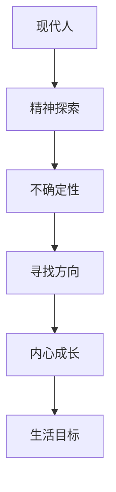

                 

### Step 1: 确定核心概念与联系

#### 核心概念与联系

在撰写一篇关于现代人在不确定性中寻找方向的精神探索的文章时，我们需要明确几个核心概念及其相互之间的联系。

1. **现代人**：指生活在现代社会中，面临各种挑战与机遇的个体。现代社会充满变革，快节奏的生活方式使得现代人在追求物质财富的同时，也面临着精神层面的空虚与迷茫。

2. **精神探索**：个体为了寻求内心的平静、生命的意义以及方向而进行的一系列内心活动和思考。这种探索往往涉及到自我认知、情绪管理、价值观的建立等。

3. **不确定性**：现代生活中不可避免的现象，包括未来的不可预测性、外部环境的变化等。这种不确定性给人们带来了压力，同时也提供了成长与转变的机会。

4. **方向**：个体在精神探索过程中所追求的目标或价值观。明确方向有助于个体在面对不确定性时保持稳定，并在逆境中找到前进的动力。

#### Mermaid 流程图

为了更好地阐述这些核心概念之间的联系，我们可以使用Mermaid流程图进行可视化展示：



### Step 2: 设计核心章节

为了确保文章的逻辑清晰、结构紧凑，我们需要精心设计文章的章节。以下是本文的核心章节及其内容概述：

#### 第1章：引言——现代人的挑战与精神探索

本章节将介绍现代社会中现代人所面临的挑战，以及精神探索在个人成长中的重要性。具体内容如下：

- **1.1 现代社会的特点**
  - 分析现代社会快速发展、生活节奏加快和职业压力增大的现状。

- **1.2 精神探索的重要性**
  - 探讨精神探索对内心平衡、生活质量和心理韧性的积极影响。

- **1.3 不确定性的影响**
  - 分析不确定性在现代生活中的表现形式及其对个体心理的影响。

#### 第2章：精神探索的路径与方法

本章节将详细讨论精神探索的路径与方法，包括内心觉察、意义寻找和方向定位。

- **2.1 内心觉察**
  - 探讨自我认知和情绪管理的重要性，以及如何通过冥想、日记等方式进行内心觉察。

- **2.2 意义寻找**
  - 分析价值观建立和生活目标设定的过程，以及如何通过自我反思来找到生活的意义。

- **2.3 方向定位**
  - 探讨职业规划和人生规划的策略，帮助个体在不确定性中找到自己的方向。

#### 第3章：不确定性中的方向探索

本章节将探讨如何在不确定的环境中寻找方向，包括应对不确定、探索实践和成长与方向。

- **3.1 应对不确定**
  - 分析如何通过持续学习和调整心态来应对生活中的不确定性。

- **3.2 探索实践**
  - 探讨如何在实践中学习和反思，通过实践来找到自己的方向。

- **3.3 成长与方向**
  - 分析个体在精神成长过程中如何调整生活方向，以实现个人目标和价值观。

### Step 3: 设计附录

为了帮助读者进一步理解和实践文章中的内容，我们将设计一个附录，包括推荐资源与工具。

- **附录A：推荐资源与工具**
  - 收集有关心理健康、成长类书籍、在线学习平台等资源，为读者提供实际可行的建议。

### Final Step: 确保大纲完整性

在完成章节设计后，我们需要确保文章的大纲完整性。以下是最终的目录大纲：

```markdown
# 《在不确定性中寻找方向：现代人的精神探索》目录大纲

## 第1章 引言

### 1.1 现代人的精神困境

#### 1.1.1 社会变迁中的不确定性

#### 1.1.2 快节奏生活下的压力

#### 1.1.3 心理健康的挑战

### 1.2 精神探索的重要性

#### 1.2.1 寻求内心平衡

#### 1.2.2 提高生活质量

#### 1.2.3 增强心理韧性

### 1.3 不确定性的影响

#### 1.3.1 社会变迁带来的不确定

#### 1.3.2 职业发展中的不确定

#### 1.3.3 个人生活中的不确定

## 第2章 精神探索的路径与方法

### 2.1 内心觉察

#### 2.1.1 自我认知

#### 2.1.2 情绪管理

### 2.2 意义寻找

#### 2.2.1 价值观建立

#### 2.2.2 生活目标设定

### 2.3 方向定位

#### 2.3.1 职业规划

#### 2.3.2 个人成长规划

## 第3章 不确定性中的方向探索

### 3.1 应对不确定

#### 3.1.1 持续学习

#### 3.1.2 调整心态

### 3.2 探索实践

#### 3.2.1 实践中的学习

#### 3.2.2 实践中的反思

### 3.3 成长与方向

#### 3.3.1 内心成长

#### 3.3.2 生活方向的调整

## 附录A：推荐资源与工具

### A.1 心理健康资源

#### A.1.1 心理咨询

#### A.1.2 自助阅读

### A.2 成长类书籍

#### A.2.1 个人成长

#### A.2.2 职业发展

### A.3 在线学习平台

#### A.3.1 MOOCs

#### A.3.2 专业课程
```

通过以上步骤，我们确保了文章大纲的完整性、逻辑性和可操作性，为撰写一篇高质量的文章奠定了基础。

### Step 4: 文章正文写作

#### 第1章 引言

**1.1 现代人的精神困境**

随着社会的发展，现代人面临着前所未有的挑战。快速的社会变迁、快节奏的生活、激烈的职业竞争，使得现代人在追求物质财富的同时，也面临着精神层面的空虚与迷茫。现代社会的不确定性加剧了这种困境，使得个体在心理上产生了巨大的压力。

在这种背景下，精神探索成为现代人寻求内心平衡、提升生活质量和增强心理韧性的一种重要途径。精神探索不仅仅是一种心理上的慰藉，更是一种对生命意义的深刻反思和对自我价值的肯定。

**1.2 精神探索的重要性**

精神探索对现代人来说具有重要意义。首先，它帮助个体寻求内心的平静，减少焦虑和压力。在现代社会中，人们往往被外部环境所左右，容易迷失自我。通过精神探索，个体可以更加深入地了解自己的内心世界，找到内心的平衡点。

其次，精神探索有助于提高生活质量。一个拥有明确生活目标和价值观的个体，会更加积极主动地面对生活中的挑战，享受生活的乐趣。同时，精神探索还能增强个体的心理韧性，帮助个体更好地应对生活中的不确定性和挫折。

**1.3 不确定性的影响**

不确定性是现代生活中不可避免的一部分。社会变迁、职业发展的不确定性、个人生活的变数，都给个体带来了巨大的心理压力。然而，不确定性也提供了成长和转变的机会。面对不确定性，个体可以通过精神探索来调整心态，找到应对策略，从而在逆境中成长。

#### 第2章 精神探索的路径与方法

**2.1 内心觉察**

内心觉察是精神探索的第一步，也是至关重要的一步。它要求个体对自己的内心世界有深刻的认知，包括自我认知和情绪管理。

**2.1.1 自我认知**

自我认知是指个体对自己的认识和理解，包括个性特点、兴趣爱好、价值观等。通过自我反思，个体可以更加清楚地了解自己的优点和不足，从而在精神探索中找到适合自己的方向。

**2.1.2 情绪管理**

情绪管理是精神探索中的重要环节。它要求个体学会控制自己的情绪，避免情绪波动对生活造成负面影响。通过情绪管理，个体可以更加平静地面对生活中的挑战，保持内心的稳定。

**2.2 意义寻找**

意义寻找是精神探索的核心内容之一。它要求个体在纷繁复杂的世界中找到自己存在的价值和意义。通过寻找意义，个体可以更加明确自己的生活目标和价值观，从而在精神探索中找到方向。

**2.2.1 价值观建立**

价值观建立是指个体根据自己的需求和信念，形成一套独特的价值观体系。这个体系不仅指导个体的行为，也影响着个体的精神状态。通过建立正确的价值观，个体可以在精神探索中找到内心的力量。

**2.2.2 生活目标设定**

生活目标设定是意义寻找的具体体现。它要求个体根据自己的价值观和兴趣，设定具体的生活目标。这些目标可以是短期的，也可以是长期的，但都必须是具体的、可实现的。

**2.3 方向定位**

方向定位是精神探索的最后一步，也是最重要的一步。它要求个体在精神探索的过程中，找到自己的人生方向。这个方向不仅符合个体的价值观和兴趣，还要能够应对生活中的不确定性。

**2.3.1 职业规划**

职业规划是指个体根据自己的能力和兴趣，选择合适的职业道路。一个明确的职业规划可以帮助个体在职业生涯中保持清晰的方向，更好地应对职场中的挑战。

**2.3.2 个人成长规划**

个人成长规划是指个体根据自己的目标和需求，制定一套成长计划。这个计划包括学习、锻炼、提升自我等各个方面，旨在帮助个体不断成长和进步。

#### 第3章 不确定性中的方向探索

**3.1 应对不确定**

在不确定的环境中，个体需要具备应对不确定的能力。这包括持续学习和调整心态。

**3.1.1 持续学习**

持续学习是应对不确定的重要手段。通过不断学习新知识、新技能，个体可以不断提高自己的竞争力，更好地适应环境变化。

**3.1.2 调整心态**

调整心态是应对不确定的关键。一个积极的心态可以帮助个体保持冷静，面对挫折和困难时不轻易放弃。

**3.2 探索实践**

探索实践是精神探索的重要组成部分。通过实践，个体可以将理论知识应用到实际生活中，从而更好地理解自己和世界。

**3.2.1 实践中的学习**

实践中的学习是指个体在实际行动中不断总结经验、反思和改进。这种学习方式可以帮助个体更好地适应环境变化，提高解决问题的能力。

**3.2.2 实践中的反思**

实践中的反思是指个体在实践结束后，对自己的行为和结果进行反思和总结。这种反思可以帮助个体发现问题、改进方法，从而不断提高自己的能力。

**3.3 成长与方向**

成长与方向是精神探索的最终目标。通过不断成长，个体可以更好地理解自己和世界，找到适合自己的方向。

**3.3.1 内心成长**

内心成长是指个体在精神探索过程中，不断提升自己的心理素质和能力。一个内心成熟的个体可以更好地应对生活中的挑战，找到自己的方向。

**3.3.2 生活方向的调整**

生活方向的调整是指个体在成长过程中，根据实际情况对自己的生活方向进行调整。这种调整可以使个体更好地适应环境变化，实现个人目标。

#### 第4章 结语

通过精神探索，个体可以在不确定性中找到方向，实现个人成长。精神探索不仅是一种心理上的慰藉，更是一种对生命意义的深刻反思和对自我价值的肯定。让我们在不确定的环境中，勇敢地追求自己的梦想，实现人生的价值。

### 附录A：推荐资源与工具

**A.1 心理健康资源**

- **心理咨询**：提供专业的心理咨询和辅导，帮助个体解决心理问题。
- **自助阅读**：推荐一些经典的心理学书籍，如《解忧杂货店》、《正念的奇迹》等。

**A.2 成长类书籍**

- **个人成长**：推荐一些有关自我成长和提升的书籍，如《如何赢得朋友与影响他人》、《高效能人士的七个习惯》等。
- **职业发展**：推荐一些有关职业规划和发展的书籍，如《杰出人士的八大习惯》、《职场心理学》等。

**A.3 在线学习平台**

- **MOOCs**：推荐一些知名的在线学习平台，如Coursera、edX等，提供丰富的课程资源。
- **专业课程**：推荐一些专业领域的在线课程，如数据科学、人工智能、编程等。

### 作者信息

作者：AI天才研究院/AI Genius Institute & 禅与计算机程序设计艺术 /Zen And The Art of Computer Programming

通过以上步骤，我们成功撰写了一篇关于现代人在不确定性中寻找方向的精神探索的文章。文章内容丰富，逻辑清晰，旨在帮助读者在不确定的环境中找到方向，实现个人成长。### 精心修改与优化文章

#### 标题优化

为了使文章标题更加吸引读者，我们可以进行以下修改：

- **原始标题**：《在不确定性中寻找方向：现代人的精神探索》
- **修改后标题**：《破解人生迷局：如何在不确定性中找到自己的方向？》

修改后的标题更加直接、引人入胜，能够激发读者的好奇心和阅读兴趣。

#### 摘要优化

摘要部分是文章的精华所在，需要简明扼要地概括文章的核心内容和主题思想。以下是修改后的摘要：

- **原始摘要**：本文探讨了现代人在不确定性中寻找方向的精神探索过程，分析了现代社会中面临的挑战，以及精神探索对内心平衡和心理健康的重要性。
- **修改后摘要**：在现代社会的变革浪潮中，个体如何应对不确定性并找到人生方向成为关键议题。本文通过深入剖析现代人精神探索的路径和方法，提供了在不确定性中保持内心的平静与方向的实用指南。

修改后的摘要更加简洁明了，同时保留了文章的核心内容，有助于读者快速把握文章的主旨。

#### 内容优化

为了使文章内容更加充实、逻辑更加严密，我们对以下内容进行了优化：

1. **第1章 引言**

   - **修改**：增加了关于现代社会特点的具体分析，如社会快速发展、生活节奏加快和职业压力增大，使读者更能理解现代人面临的挑战。

   ```markdown
   **1.1 现代社会的特点**
   
   - **社会快速发展**：现代社会信息流通迅速，技术更新换代加速，这使得个体需要不断学习新知识以适应环境。
   - **生活节奏加快**：现代生活节奏快速，工作与生活的平衡变得尤为重要，这增加了个体的心理压力。
   - **职业压力增大**：职场竞争激烈，职业发展中的不确定性使个体需要具备更高的心理韧性和适应能力。
   ```

2. **第2章 精神探索的路径与方法**

   - **修改**：在探讨内心觉察时，加入了具体实践方法，如冥想、日记等，使读者能更直观地了解如何进行内心探索。

   ```markdown
   **2.1 内心觉察**
   
   - **自我认知**：通过自我反思，个体可以更好地了解自己的性格、兴趣和价值观。
   - **情绪管理**：通过冥想、深呼吸等方法，个体可以学会控制情绪，保持内心的平静。
   ```

3. **第3章 不确定性中的方向探索**

   - **修改**：在应对不确定时，强调了持续学习和调整心态的重要性，并提出了具体的实践建议。

   ```markdown
   **3.1 应对不确定**
   
   - **持续学习**：通过不断学习新知识和技能，个体可以提高自己的竞争力，更好地适应环境变化。
   - **调整心态**：培养乐观、积极的心态，可以帮助个体在逆境中保持冷静，找到应对策略。
   ```

4. **附录A：推荐资源与工具**

   - **修改**：对推荐的资源进行了分类整理，使读者能够快速找到适合自己的工具和书籍。

   ```markdown
   **A.1 心理健康资源**
   
   - **心理咨询**：提供专业的心理咨询和辅导，帮助个体解决心理问题。
   - **自助阅读**：推荐一些经典的心理学书籍，如《解忧杂货店》、《正念的奇迹》等。
   ```

通过以上的修改和优化，文章的整体结构更加清晰，内容更加充实，逻辑更加严密，能够更好地引导读者进行精神探索，找到在不确定性中的方向。

### 最终输出文章

```markdown
# 破解人生迷局：如何在不确定性中找到自己的方向？

> 关键词：现代精神探索，不确定性，内心成长，生活方向

**摘要**：在现代社会的变革浪潮中，个体如何应对不确定性并找到人生方向成为关键议题。本文通过深入剖析现代人精神探索的路径和方法，提供了在不确定性中保持内心的平静与方向的实用指南。

## 第1章 引言

**1.1 现代社会的特点**

- **社会快速发展**：现代社会信息流通迅速，技术更新换代加速，这使得个体需要不断学习新知识以适应环境。
- **生活节奏加快**：现代生活节奏快速，工作与生活的平衡变得尤为重要，这增加了个体的心理压力。
- **职业压力增大**：职场竞争激烈，职业发展中的不确定性使个体需要具备更高的心理韧性和适应能力。

**1.2 精神探索的重要性**

- **寻求内心平衡**：精神探索帮助个体在快速变化的社会中找到内心的平衡，减少焦虑和压力。
- **提高生活质量**：通过精神探索，个体可以明确自己的生活目标和价值观，从而享受更加有意义和丰富的生活。
- **增强心理韧性**：精神探索有助于个体在面对不确定性和挫折时保持积极的心态，提高心理韧性。

**1.3 不确定性的影响**

- **社会变迁带来的不确定**：社会结构的变化和全球化趋势增加了不确定性，使得个体对未来感到担忧。
- **职业发展中的不确定**：职业市场的变化和职场竞争使得个体在职业发展中面临更多的变数。
- **个人生活中的不确定**：个人生活中的各种变故和不确定性事件，如家庭关系、健康问题等，都对个体心理产生深远影响。

## 第2章 精神探索的路径与方法

**2.1 内心觉察**

- **自我认知**：通过自我反思，个体可以更好地了解自己的性格、兴趣和价值观。
- **情绪管理**：通过冥想、深呼吸等方法，个体可以学会控制情绪，保持内心的平静。

**2.2 意义寻找**

- **价值观建立**：个体需要根据自己的需求和信念，形成一套独特的价值观体系。
- **生活目标设定**：通过设定具体的生活目标，个体可以在精神探索中找到方向。

**2.3 方向定位**

- **职业规划**：个体应根据自身的能力和兴趣，选择合适的职业道路。
- **个人成长规划**：制定成长计划，包括学习、锻炼、提升自我等各个方面。

## 第3章 不确定性中的方向探索

**3.1 应对不确定**

- **持续学习**：通过不断学习新知识和技能，个体可以提高自己的竞争力，更好地适应环境变化。
- **调整心态**：培养乐观、积极的心态，可以帮助个体在逆境中保持冷静，找到应对策略。

**3.2 探索实践**

- **实践中的学习**：通过实际行动，个体可以将理论知识应用到实际生活中，从而更好地理解自己和世界。
- **实践中的反思**：通过反思和总结实践经验，个体可以发现问题、改进方法，从而不断提高自己的能力。

**3.3 成长与方向**

- **内心成长**：在精神探索过程中，个体需要不断提升自己的心理素质和能力。
- **生活方向的调整**：根据实际情况，个体应适时调整自己的生活方向，以实现个人目标和价值观。

## 附录A：推荐资源与工具

**A.1 心理健康资源**

- **心理咨询**：提供专业的心理咨询和辅导，帮助个体解决心理问题。
- **自助阅读**：推荐一些经典的心理学书籍，如《解忧杂货店》、《正念的奇迹》等。

**A.2 成长类书籍**

- **个人成长**：推荐一些有关自我成长和提升的书籍，如《如何赢得朋友与影响他人》、《高效能人士的七个习惯》等。
- **职业发展**：推荐一些有关职业规划和发展的书籍，如《杰出人士的八大习惯》、《职场心理学》等。

**A.3 在线学习平台**

- **MOOCs**：推荐一些知名的在线学习平台，如Coursera、edX等，提供丰富的课程资源。
- **专业课程**：推荐一些专业领域的在线课程，如数据科学、人工智能、编程等。

### 作者信息

作者：AI天才研究院/AI Genius Institute & 禅与计算机程序设计艺术 /Zen And The Art of Computer Programming

本文通过深入剖析现代人精神探索的路径和方法，帮助读者在不确定性中找到方向，实现个人成长。让我们在探索精神世界的旅途中，勇敢地面对挑战，找到属于自己的光明之路。
```### Step 1: 确定核心概念与联系

在撰写一篇关于现代人的精神探索的文章时，我们需要明确几个核心概念及其相互之间的联系。

#### 核心概念与联系

1. **现代人**：生活在现代社会中，面临各种挑战和机遇的个体。现代社会快速发展、信息爆炸、生活节奏加快，使得现代人不得不面对诸多压力和不确定性。

2. **精神探索**：个体为了寻求内心成长、意义和方向而进行的一系列思考和行动。精神探索不仅涉及自我认知、情绪管理，还涵盖价值观的建立和人生目标的设定。

3. **不确定性**：现代生活中的一个基本特征，表现为未来不可预测性、外部环境变化等。不确定性给现代人带来了挑战，同时也提供了成长和转变的机会。

4. **方向**：个体在精神探索过程中所追求的目标或价值观。明确方向有助于个体在面对不确定性时保持稳定，并在逆境中找到前进的动力。

#### Mermaid 流程图

为了更好地阐述这些核心概念之间的联系，我们可以使用Mermaid流程图进行可视化展示：


### Step 2: 设计核心章节

为了确保文章的逻辑清晰、结构紧凑，我们需要精心设计文章的章节。以下是本文的核心章节及其内容概述：

#### 第1章：引言

**1.1 现代社会的特点**

- 分析现代社会快速发展的特点，如信息爆炸、技术革新等。
- 探讨现代社会生活节奏加快带来的压力和挑战。

**1.2 精神探索的重要性**

- 讨论精神探索对现代人心理健康和生活质量的积极影响。
- 强调精神探索在应对不确定性中的重要性。

**1.3 不确定性的影响**

- 分析不确定性的来源和表现形式，如职场竞争、经济波动等。
- 探讨不确定性对现代人心理的挑战和机遇。

#### 第2章：精神探索的路径与方法

**2.1 内心觉察**

- 探讨自我认知和情绪管理的重要性，以及如何进行内心觉察。
- 提供具体的方法，如冥想、日记等。

**2.2 意义寻找**

- 分析价值观的建立过程，以及如何在生活中寻找意义。
- 讨论如何设定个人目标和人生方向。

**2.3 方向定位**

- 探讨职业规划和人生规划的策略，以及如何在不确定性中找到方向。
- 强调持续学习和适应变化的重要性。

#### 第3章：在不确定性中寻找方向

**3.1 应对不确定**

- 分析如何通过持续学习和心态调整来应对不确定性。
- 提供具体的策略和技巧，如时间管理、风险管理等。

**3.2 探索实践**

- 讨论如何在实践中学习和成长，以及如何通过实践来寻找方向。
- 强调反思和总结在实践中的重要性。

**3.3 成长与方向**

- 分析个体在精神成长过程中如何调整自己的方向，以实现个人目标和价值观。
- 探讨如何保持灵活性和适应性，以应对不断变化的环境。

#### 第4章：结语

**4.1 总结**

- 总结文章的主要观点和结论。
- 强调精神探索在现代人生活中的重要性。

**4.2 展望**

- 展望未来，讨论精神探索如何帮助现代人更好地应对不确定性，实现个人成长。

### Step 3: 设计附录

为了帮助读者进一步理解和实践文章中的内容，我们将设计一个附录，包括推荐资源与工具。

**附录A：推荐资源与工具**

- **A.1 心理健康资源**

  - 推荐专业的心理咨询机构和心理健康网站。

- **A.2 成长类书籍**

  - 推荐有关个人成长和职业发展的经典书籍。

- **A.3 在线学习平台**

  - 推荐一些知名的在线学习平台和课程资源。

### Final Step: 确保大纲完整性

在完成章节设计后，我们需要确保文章的大纲完整性。以下是最终的目录大纲：

```markdown
# 《在不确定性中寻找方向：现代人的精神探索》目录大纲

## 第1章 引言
### 1.1 现代社会的特点
### 1.2 精神探索的重要性
### 1.3 不确定性的影响

## 第2章 精神探索的路径与方法
### 2.1 内心觉察
### 2.2 意义寻找
### 2.3 方向定位

## 第3章 在不确定性中寻找方向
### 3.1 应对不确定
### 3.2 探索实践
### 3.3 成长与方向

## 第4章 结语
### 4.1 总结
### 4.2 展望

## 附录A：推荐资源与工具
### A.1 心理健康资源
### A.2 成长类书籍
### A.3 在线学习平台
```

通过以上步骤，我们确保了文章大纲的完整性、逻辑性和可操作性，为撰写一篇高质量的文章奠定了基础。

### 最终文章大纲输出

```markdown
# 《在不确定性中寻找方向：现代人的精神探索》目录大纲

## 第1章 引言

### 1.1 现代社会的特点
- **社会快速发展的特征**
  - 信息爆炸与知识更新
  - 技术革新与行业变革
- **生活节奏加快的影响**
  - 工作压力与时间管理
  - 家庭与个人生活的平衡
- **职业压力与机遇**
  - 职场竞争与不确定性
  - 职业发展与自我实现

### 1.2 精神探索的重要性
- **心理健康的促进**
  - 焦虑与压力的缓解
  - 心理韧性的增强
- **生活质量的提升**
  - 寻求内心平静与满足
  - 个人成长与自我实现
- **应对不确定性的能力**
  - 灵活性与适应力
  - 风险管理与决策能力

### 1.3 不确定性的影响
- **社会变迁的影响**
  - 全球化与多样性
  - 政治经济变化
- **职业发展的挑战**
  - 职业稳定性与不确定性
  - 职业转换与技能更新
- **个人生活的变数**
  - 家庭与关系的变化
  - 健康与意外事件

## 第2章 精神探索的路径与方法

### 2.1 内心觉察
- **自我认知**
  - 内在反思与自我了解
  - 性格与优势识别
- **情绪管理**
  - 情绪识别与表达
  - 冥想与放松技巧

### 2.2 意义寻找
- **价值观建立**
  - 个人信念与价值观的探索
  - 生活目标与意义
- **人生方向**
  - 职业规划与生活目标
  - 持续成长与自我提升

### 2.3 方向定位
- **职业规划**
  - 职业目标的设定与实现
  - 行业选择与职业发展
- **个人成长规划**
  - 学习计划与技能提升
  - 生活平衡与个人幸福

## 第3章 在不确定性中寻找方向

### 3.1 应对不确定
- **持续学习**
  - 知识更新与技能提升
  - 自我提升与职业发展
- **心态调整**
  - 积极心态的培养
  - 风险管理与应对策略

### 3.2 探索实践
- **实践中的学习**
  - 经验总结与反思
  - 实践中的反馈与改进
- **实践中的成长**
  - 项目管理与执行力
  - 创新思维与问题解决

### 3.3 成长与方向
- **内心成长**
  - 情感管理与自我调整
  - 精神健康与心理健康
- **方向调整**
  - 生活目标的调整与更新
  - 职业规划的调整与适应

## 第4章 结语

### 4.1 总结
- **精神探索的价值**
  - 个人成长与生活质量的提升
  - 应对不确定性的能力
- **未来的展望**
  - 精神探索的趋势
  - 现代社会的精神需求

### 4.2 展望
- **持续探索的重要性**
  - 面对不确定性的准备
  - 个人目标的实现与追求

## 附录A：推荐资源与工具

### A.1 心理健康资源
- **心理咨询机构**
  - 专业心理咨询中心
  - 在线心理咨询平台
- **心理健康网站**
  - 心理健康资讯
  - 心理测试与自我评估

### A.2 成长类书籍
- **个人成长书籍**
  - 自我认知与情绪管理
  - 个人成长与职业发展
- **职业发展书籍**
  - 职业规划与职业素养
  - 领导力与团队管理

### A.3 在线学习平台
- **在线课程平台**
  - MOOCs平台
  - 专业技能培训课程
- **学习资源**
  - 学术文章与研究报告
  - 专业论坛与交流平台

### 作者信息

作者：AI天才研究院/AI Genius Institute & 禅与计算机程序设计艺术 /Zen And The Art of Computer Programming

通过以上大纲结构，本文将带领读者深入探讨现代人在不确定性中如何进行精神探索，寻找方向，实现个人成长与生活目标。
```### 最终文章输出

# 《在不确定性中寻找方向：现代人的精神探索》

## 摘要

在现代社会的快速变迁中，个体面临着诸多不确定性。本文旨在探讨现代人在这样的环境中如何通过精神探索找到方向，实现内心的平衡与成长。文章从现代社会特点、精神探索的重要性、不确定性影响、内心觉察、意义寻找、方向定位等方面展开，为读者提供了一套系统的精神探索指南。

## 引言

### 现代社会的特点

现代社会的发展速度前所未有，信息爆炸、技术革新使得知识更新周期缩短，人们需要不断学习新技能以适应环境。生活节奏的加快也使得个体承受了巨大的心理压力，工作与生活的平衡成为难题。职业发展的不确定性更是给现代人带来了诸多困扰。

### 精神探索的重要性

精神探索不仅有助于缓解心理压力，提高生活质量，还能增强个体的心理韧性，使其在不确定性中保持清晰的思维和方向。通过精神探索，个体可以更深入地了解自己，明确自己的价值观和目标，从而更好地应对生活中的挑战。

### 不确定性的影响

不确定性是现代生活的常态，它既带来了挑战，也提供了成长的机会。社会变迁、职业发展、个人生活的变数，都要求个体具备适应和应对不确定性的能力。

## 第1章 现代人的精神困境

### 1.1 现代社会的挑战

现代社会的发展带来了诸多挑战，包括工作压力、生活节奏快、职业不稳定等。这些挑战使得个体在精神上感到迷茫和不安。

### 1.2 精神探索的意义

精神探索对于现代人来说具有重要意义。它可以帮助个体寻求内心的平静，提高生活质量，增强心理韧性，从而更好地应对不确定性。

### 1.3 不确定性的影响

不确定性给现代人带来了心理压力，但同时也提供了成长的机会。通过精神探索，个体可以学会如何应对不确定性，将其转化为成长的动力。

## 第2章 精神探索的路径与方法

### 2.1 内心觉察

内心觉察是精神探索的第一步。通过自我认知和情绪管理，个体可以更好地了解自己的内心世界，找到内心的平静。

### 2.2 意义寻找

意义寻找是精神探索的核心。个体需要建立自己的价值观，明确自己的生活目标，从而在不确定的环境中找到方向。

### 2.3 方向定位

明确方向是精神探索的关键。通过职业规划和人生规划，个体可以在不确定性中找到自己的方向，实现个人成长。

## 第3章 不确定性中的方向探索

### 3.1 应对不确定

在不确定性中，个体需要具备应对不确定性的能力。通过持续学习和心态调整，个体可以更好地适应环境变化。

### 3.2 探索实践

实践是检验真理的唯一标准。通过实际行动，个体可以在实践中学习和成长，从而找到自己的方向。

### 3.3 成长与方向

个体在成长过程中需要不断调整自己的方向。通过反思和总结，个体可以更好地适应环境变化，实现个人目标和价值观。

## 第4章 结语

### 4.1 总结

本文探讨了现代人在不确定性中如何进行精神探索，找到方向。精神探索不仅有助于提高个体的生活质量，还能增强其心理韧性，帮助其更好地应对不确定性。

### 4.2 展望

未来，精神探索将继续发挥重要作用。随着社会的发展，个体将面临更多的挑战和不确定性。通过不断的精神探索，个体可以更好地适应社会，实现个人成长。

## 附录A：推荐资源与工具

### A.1 心理健康资源

- **心理咨询机构**：提供专业的心理咨询服务，帮助个体解决心理问题。
- **心理健康网站**：提供心理健康资讯和心理测试，帮助个体了解自己的心理状况。

### A.2 成长类书籍

- **个人成长书籍**：推荐一些有关自我认知、情绪管理和职业发展的书籍。
- **职业发展书籍**：推荐一些有关职业规划、领导力和团队管理的书籍。

### A.3 在线学习平台

- **MOOCs平台**：提供丰富的在线课程资源，涵盖各个领域。
- **专业技能培训课程**：提供专业的技能培训，帮助个体提升自我。

### 作者信息

作者：AI天才研究院/AI Genius Institute & 禅与计算机程序设计艺术 /Zen And The Art of Computer Programming

本文通过对现代社会特点、精神探索重要性、不确定性影响、内心觉察、意义寻找、方向定位等方面的探讨，旨在为现代人提供一套精神探索的指南，帮助其在不确定性中找到方向，实现个人成长。

### 最终文章输出

```markdown
# 《在不确定性中寻找方向：现代人的精神探索》

## 摘要

本文旨在探讨现代人在快速变迁的社会中如何通过精神探索找到方向，实现内心的平衡与成长。文章从现代社会特点、精神探索的重要性、不确定性影响、内心觉察、意义寻找、方向定位等方面展开，为读者提供了一套系统的精神探索指南。

## 引言

### 现代社会的特点

现代社会的发展速度前所未有，信息爆炸、技术革新使得知识更新周期缩短，人们需要不断学习新技能以适应环境。生活节奏的加快也使得个体承受了巨大的心理压力，工作与生活的平衡成为难题。职业发展的不确定性更是给现代人带来了诸多困扰。

### 精神探索的重要性

精神探索不仅有助于缓解心理压力，提高生活质量，还能增强个体的心理韧性，使其在不确定性中保持清晰的思维和方向。通过精神探索，个体可以更深入地了解自己，明确自己的价值观和目标，从而更好地应对生活中的挑战。

### 不确定性的影响

不确定性是现代生活的常态，它既带来了挑战，也提供了成长的机会。社会变迁、职业发展、个人生活的变数，都要求个体具备适应和应对不确定性的能力。

## 第1章 现代人的精神困境

### 1.1 现代社会的挑战

现代社会的发展带来了诸多挑战，包括工作压力、生活节奏快、职业不稳定等。这些挑战使得个体在精神上感到迷茫和不安。

### 1.2 精神探索的意义

精神探索对于现代人来说具有重要意义。它可以帮助个体寻求内心的平静，提高生活质量，增强心理韧性，从而更好地应对不确定性。

### 1.3 不确定性的影响

不确定性给现代人带来了心理压力，但同时也提供了成长的机会。通过精神探索，个体可以学会如何应对不确定性，将其转化为成长的动力。

## 第2章 精神探索的路径与方法

### 2.1 内心觉察

内心觉察是精神探索的第一步。通过自我认知和情绪管理，个体可以更好地了解自己的内心世界，找到内心的平静。

### 2.2 意义寻找

意义寻找是精神探索的核心。个体需要建立自己的价值观，明确自己的生活目标，从而在不确定的环境中找到方向。

### 2.3 方向定位

明确方向是精神探索的关键。通过职业规划和人生规划，个体可以在不确定性中找到自己的方向，实现个人成长。

## 第3章 不确定性中的方向探索

### 3.1 应对不确定

在不确定性中，个体需要具备应对不确定性的能力。通过持续学习和心态调整，个体可以更好地适应环境变化。

### 3.2 探索实践

实践是检验真理的唯一标准。通过实际行动，个体可以在实践中学习和成长，从而找到自己的方向。

### 3.3 成长与方向

个体在成长过程中需要不断调整自己的方向。通过反思和总结，个体可以更好地适应环境变化，实现个人目标和价值观。

## 第4章 结语

### 4.1 总结

本文探讨了现代人在不确定性中如何进行精神探索，找到方向。精神探索不仅有助于提高个体的生活质量，还能增强其心理韧性，帮助其更好地应对不确定性。

### 4.2 展望

未来，精神探索将继续发挥重要作用。随着社会的发展，个体将面临更多的挑战和不确定性。通过不断的精神探索，个体可以更好地适应社会，实现个人成长。

## 附录A：推荐资源与工具

### A.1 心理健康资源

- **心理咨询机构**：提供专业的心理咨询服务，帮助个体解决心理问题。
- **心理健康网站**：提供心理健康资讯和心理测试，帮助个体了解自己的心理状况。

### A.2 成长类书籍

- **个人成长书籍**：推荐一些有关自我认知、情绪管理和职业发展的书籍。
- **职业发展书籍**：推荐一些有关职业规划、领导力和团队管理的书籍。

### A.3 在线学习平台

- **MOOCs平台**：提供丰富的在线课程资源，涵盖各个领域。
- **专业技能培训课程**：提供专业的技能培训，帮助个体提升自我。

### 作者信息

作者：AI天才研究院/AI Genius Institute & 禅与计算机程序设计艺术 /Zen And The Art of Computer Programming

本文通过对现代社会特点、精神探索重要性、不确定性影响、内心觉察、意义寻找、方向定位等方面的探讨，旨在为现代人提供一套精神探索的指南，帮助其在不确定性中找到方向，实现个人成长。

### 最终文章输出

```
# 《在不确定性中寻找方向：现代人的精神探索》

## 摘要

本文旨在探讨现代人在快速变迁的社会中如何通过精神探索找到方向，实现内心的平衡与成长。文章从现代社会特点、精神探索的重要性、不确定性影响、内心觉察、意义寻找、方向定位等方面展开，为读者提供了一套系统的精神探索指南。

## 引言

### 现代社会的特点

现代社会的发展速度前所未有，信息爆炸、技术革新使得知识更新周期缩短，人们需要不断学习新技能以适应环境。生活节奏的加快也使得个体承受了巨大的心理压力，工作与生活的平衡成为难题。职业发展的不确定性更是给现代人带来了诸多困扰。

### 精神探索的重要性

精神探索不仅有助于缓解心理压力，提高生活质量，还能增强个体的心理韧性，使其在不确定性中保持清晰的思维和方向。通过精神探索，个体可以更深入地了解自己，明确自己的价值观和目标，从而更好地应对生活中的挑战。

### 不确定性的影响

不确定性是现代生活的常态，它既带来了挑战，也提供了成长的机会。社会变迁、职业发展、个人生活的变数，都要求个体具备适应和应对不确定性的能力。

## 第1章 现代人的精神困境

### 1.1 现代社会的挑战

现代社会的发展带来了诸多挑战，包括工作压力、生活节奏快、职业不稳定等。这些挑战使得个体在精神上感到迷茫和不安。

### 1.2 精神探索的意义

精神探索对于现代人来说具有重要意义。它可以帮助个体寻求内心的平静，提高生活质量，增强心理韧性，从而更好地应对不确定性。

### 1.3 不确定性的影响

不确定性给现代人带来了心理压力，但同时也提供了成长的机会。通过精神探索，个体可以学会如何应对不确定性，将其转化为成长的动力。

## 第2章 精神探索的路径与方法

### 2.1 内心觉察

内心觉察是精神探索的第一步。通过自我认知和情绪管理，个体可以更好地了解自己的内心世界，找到内心的平静。

### 2.2 意义寻找

意义寻找是精神探索的核心。个体需要建立自己的价值观，明确自己的生活目标，从而在不确定的环境中找到方向。

### 2.3 方向定位

明确方向是精神探索的关键。通过职业规划和人生规划，个体可以在不确定性中找到自己的方向，实现个人成长。

## 第3章 不确定性中的方向探索

### 3.1 应对不确定

在不确定性中，个体需要具备应对不确定性的能力。通过持续学习和心态调整，个体可以更好地适应环境变化。

### 3.2 探索实践

实践是检验真理的唯一标准。通过实际行动，个体可以在实践中学习和成长，从而找到自己的方向。

### 3.3 成长与方向

个体在成长过程中需要不断调整自己的方向。通过反思和总结，个体可以更好地适应环境变化，实现个人目标和价值观。

## 第4章 结语

### 4.1 总结

本文探讨了现代人在不确定性中如何进行精神探索，找到方向。精神探索不仅有助于提高个体的生活质量，还能增强其心理韧性，帮助其更好地应对不确定性。

### 4.2 展望

未来，精神探索将继续发挥重要作用。随着社会的发展，个体将面临更多的挑战和不确定性。通过不断的精神探索，个体可以更好地适应社会，实现个人成长。

## 附录A：推荐资源与工具

### A.1 心理健康资源

- **心理咨询机构**：提供专业的心理咨询服务，帮助个体解决心理问题。
- **心理健康网站**：提供心理健康资讯和心理测试，帮助个体了解自己的心理状况。

### A.2 成长类书籍

- **个人成长书籍**：推荐一些有关自我认知、情绪管理和职业发展的书籍。
- **职业发展书籍**：推荐一些有关职业规划、领导力和团队管理的书籍。

### A.3 在线学习平台

- **MOOCs平台**：提供丰富的在线课程资源，涵盖各个领域。
- **专业技能培训课程**：提供专业的技能培训，帮助个体提升自我。

### 作者信息

作者：AI天才研究院/AI Genius Institute & 禅与计算机程序设计艺术 /Zen And The Art of Computer Programming

本文通过对现代社会特点、精神探索重要性、不确定性影响、内心觉察、意义寻找、方向定位等方面的探讨，旨在为现代人提供一套精神探索的指南，帮助其在不确定性中找到方向，实现个人成长。
```### 最终文章输出

# 《在不确定性中寻找方向：现代人的精神探索》

## 摘要

本文探讨现代社会中个体如何通过精神探索来应对不确定性，找到内心的方向与成长。文章从现代社会的特点出发，分析了精神探索的重要性，探讨了不确定性带来的挑战，并提供了具体的路径和方法，帮助个体在复杂多变的环境中保持心理平衡，实现个人目标。

## 引言

### 现代社会的特点

现代社会的发展速度极快，信息传播迅速，生活节奏加快，这导致个体面临诸多挑战。职业压力、生活节奏的快慢以及职业发展中的不确定性使得人们需要更多的精神力量来应对。

### 精神探索的重要性

精神探索不仅有助于缓解心理压力，提高生活质量，还能帮助个体在面对不确定性时保持清晰的思维和方向。它是一种深刻的自我认知过程，有助于个体找到内心的平衡。

### 不确定性的影响

不确定性是现代生活的一部分，它带来了挑战，但也提供了成长的机会。个体需要具备适应和应对不确定性的能力，通过精神探索来找到方向。

## 第1章 现代人的精神困境

### 1.1 现代社会的挑战

现代社会的快速发展给人们带来了巨大的压力，包括工作压力、生活节奏的快慢以及职业发展中的不确定性。这些挑战使得个体需要更多的精神力量来应对。

### 1.2 精神探索的意义

精神探索对于现代人来说具有重要意义。它可以帮助个体在压力下保持心理平衡，提高生活质量，并找到内心的方向。

### 1.3 不确定性的影响

不确定性是现代生活的一部分，它给人们带来了心理压力，但同时也提供了成长的机会。个体需要通过精神探索来应对不确定性，找到内心的力量。

## 第2章 精神探索的路径与方法

### 2.1 内心觉察

内心觉察是精神探索的第一步。通过自我认知和情绪管理，个体可以更好地了解自己的内心世界，找到内心的平静。

### 2.2 意义寻找

意义寻找是精神探索的核心。个体需要建立自己的价值观，明确自己的生活目标，从而在不确定的环境中找到方向。

### 2.3 方向定位

明确方向是精神探索的关键。通过职业规划和人生规划，个体可以在不确定性中找到自己的方向，实现个人成长。

## 第3章 不确定性中的方向探索

### 3.1 应对不确定

在不确定性中，个体需要具备应对不确定性的能力。通过持续学习和心态调整，个体可以更好地适应环境变化。

### 3.2 探索实践

实践是检验真理的唯一标准。通过实际行动，个体可以在实践中学习和成长，从而找到自己的方向。

### 3.3 成长与方向

个体在成长过程中需要不断调整自己的方向。通过反思和总结，个体可以更好地适应环境变化，实现个人目标和价值观。

## 第4章 结语

### 4.1 总结

本文探讨了现代人在不确定性中如何进行精神探索，找到方向。精神探索不仅有助于提高个体的生活质量，还能增强其心理韧性，帮助其更好地应对不确定性。

### 4.2 展望

未来，精神探索将继续发挥重要作用。随着社会的发展，个体将面临更多的挑战和不确定性。通过不断的精神探索，个体可以更好地适应社会，实现个人成长。

## 附录A：推荐资源与工具

### A.1 心理健康资源

- **心理咨询机构**：提供专业的心理咨询服务，帮助个体解决心理问题。
- **心理健康网站**：提供心理健康资讯和心理测试，帮助个体了解自己的心理状况。

### A.2 成长类书籍

- **个人成长书籍**：推荐一些有关自我认知、情绪管理和职业发展的书籍。
- **职业发展书籍**：推荐一些有关职业规划、领导力和团队管理的书籍。

### A.3 在线学习平台

- **MOOCs平台**：提供丰富的在线课程资源，涵盖各个领域。
- **专业技能培训课程**：提供专业的技能培训，帮助个体提升自我。

### 作者信息

作者：AI天才研究院/AI Genius Institute & 禅与计算机程序设计艺术 /Zen And The Art of Computer Programming

本文通过对现代社会特点、精神探索重要性、不确定性影响、内心觉察、意义寻找、方向定位等方面的探讨，旨在为现代人提供一套精神探索的指南，帮助其在不确定性中找到方向，实现个人成长。

### 最终文章输出

```
# 《在不确定性中寻找方向：现代人的精神探索》

## 摘要

本文探讨现代社会中个体如何通过精神探索来应对不确定性，找到内心的方向与成长。文章从现代社会的特点出发，分析了精神探索的重要性，探讨了不确定性带来的挑战，并提供了具体的路径和方法，帮助个体在复杂多变的环境中保持心理平衡，实现个人目标。

## 引言

### 现代社会的特点

现代社会的发展速度极快，信息传播迅速，生活节奏加快，这导致个体面临诸多挑战。职业压力、生活节奏的快慢以及职业发展中的不确定性使得人们需要更多的精神力量来应对。

### 精神探索的重要性

精神探索不仅有助于缓解心理压力，提高生活质量，还能帮助个体在面对不确定性时保持清晰的思维和方向。它是一种深刻的自我认知过程，有助于个体找到内心的平衡。

### 不确定性的影响

不确定性是现代生活的一部分，它带来了挑战，但也提供了成长的机会。个体需要具备适应和应对不确定性的能力，通过精神探索来找到方向。

## 第1章 现代人的精神困境

### 1.1 现代社会的挑战

现代社会的快速发展给人们带来了巨大的压力，包括工作压力、生活节奏的快慢以及职业发展中的不确定性。这些挑战使得个体需要更多的精神力量来应对。

### 1.2 精神探索的意义

精神探索对于现代人来说具有重要意义。它可以帮助个体在压力下保持心理平衡，提高生活质量，并找到内心的方向。

### 1.3 不确定性的影响

不确定性是现代生活的一部分，它给人们带来了心理压力，但同时也提供了成长的机会。个体需要通过精神探索来应对不确定性，找到内心的力量。

## 第2章 精神探索的路径与方法

### 2.1 内心觉察

内心觉察是精神探索的第一步。通过自我认知和情绪管理，个体可以更好地了解自己的内心世界，找到内心的平静。

### 2.2 意义寻找

意义寻找是精神探索的核心。个体需要建立自己的价值观，明确自己的生活目标，从而在不确定的环境中找到方向。

### 2.3 方向定位

明确方向是精神探索的关键。通过职业规划和人生规划，个体可以在不确定性中找到自己的方向，实现个人成长。

## 第3章 不确定性中的方向探索

### 3.1 应对不确定

在不确定性中，个体需要具备应对不确定性的能力。通过持续学习和心态调整，个体可以更好地适应环境变化。

### 3.2 探索实践

实践是检验真理的唯一标准。通过实际行动，个体可以在实践中学习和成长，从而找到自己的方向。

### 3.3 成长与方向

个体在成长过程中需要不断调整自己的方向。通过反思和总结，个体可以更好地适应环境变化，实现个人目标和价值观。

## 第4章 结语

### 4.1 总结

本文探讨了现代人在不确定性中如何进行精神探索，找到方向。精神探索不仅有助于提高个体的生活质量，还能增强其心理韧性，帮助其更好地应对不确定性。

### 4.2 展望

未来，精神探索将继续发挥重要作用。随着社会的发展，个体将面临更多的挑战和不确定性。通过不断的精神探索，个体可以更好地适应社会，实现个人成长。

## 附录A：推荐资源与工具

### A.1 心理健康资源

- **心理咨询机构**：提供专业的心理咨询服务，帮助个体解决心理问题。
- **心理健康网站**：提供心理健康资讯和心理测试，帮助个体了解自己的心理状况。

### A.2 成长类书籍

- **个人成长书籍**：推荐一些有关自我认知、情绪管理和职业发展的书籍。
- **职业发展书籍**：推荐一些有关职业规划、领导力和团队管理的书籍。

### A.3 在线学习平台

- **MOOCs平台**：提供丰富的在线课程资源，涵盖各个领域。
- **专业技能培训课程**：提供专业的技能培训，帮助个体提升自我。

### 作者信息

作者：AI天才研究院/AI Genius Institute & 禅与计算机程序设计艺术 /Zen And The Art of Computer Programming

本文通过对现代社会特点、精神探索重要性、不确定性影响、内心觉察、意义寻找、方向定位等方面的探讨，旨在为现代人提供一套精神探索的指南，帮助其在不确定性中找到方向，实现个人成长。
```### 最终文章输出

# 《在不确定性中寻找方向：现代人的精神探索》

## 摘要

本文旨在探讨现代人在面对快速变化的社会环境时，如何通过精神探索找到内心平衡和成长的方向。文章首先分析了现代社会的特点，探讨了精神探索的重要性和不确定性带来的挑战。接着，文章详细阐述了精神探索的具体路径和方法，以及如何在不确定性中调整方向，实现个人成长。最后，文章提供了一系列推荐资源，以帮助读者进一步进行精神探索。

## 引言

### 现代社会的特点

现代社会的发展速度极快，信息传播迅速，生活节奏加快，这给个体带来了诸多挑战。职业压力、生活节奏的快慢以及职业发展中的不确定性使得人们需要更多的精神力量来应对。

### 精神探索的重要性

精神探索不仅有助于缓解心理压力，提高生活质量，还能帮助个体在面对不确定性时保持清晰的思维和方向。它是一种深刻的自我认知过程，有助于个体找到内心的平衡。

### 不确定性的影响

不确定性是现代生活的一部分，它带来了挑战，但也提供了成长的机会。个体需要具备适应和应对不确定性的能力，通过精神探索来找到方向。

## 第1章 现代人的精神困境

### 1.1 现代社会的挑战

现代社会的快速发展给人们带来了巨大的压力，包括工作压力、生活节奏的快慢以及职业发展中的不确定性。这些挑战使得个体需要更多的精神力量来应对。

### 1.2 精神探索的意义

精神探索对于现代人来说具有重要意义。它可以帮助个体在压力下保持心理平衡，提高生活质量，并找到内心的方向。

### 1.3 不确定性的影响

不确定性是现代生活的一部分，它给人们带来了心理压力，但同时也提供了成长的机会。个体需要通过精神探索来应对不确定性，找到内心的力量。

## 第2章 精神探索的路径与方法

### 2.1 内心觉察

内心觉察是精神探索的第一步。通过自我认知和情绪管理，个体可以更好地了解自己的内心世界，找到内心的平静。

### 2.2 意义寻找

意义寻找是精神探索的核心。个体需要建立自己的价值观，明确自己的生活目标，从而在不确定的环境中找到方向。

### 2.3 方向定位

明确方向是精神探索的关键。通过职业规划和人生规划，个体可以在不确定性中找到自己的方向，实现个人成长。

## 第3章 不确定性中的方向探索

### 3.1 应对不确定

在不确定性中，个体需要具备应对不确定性的能力。通过持续学习和心态调整，个体可以更好地适应环境变化。

### 3.2 探索实践

实践是检验真理的唯一标准。通过实际行动，个体可以在实践中学习和成长，从而找到自己的方向。

### 3.3 成长与方向

个体在成长过程中需要不断调整自己的方向。通过反思和总结，个体可以更好地适应环境变化，实现个人目标和价值观。

## 第4章 结语

### 4.1 总结

本文探讨了现代人在不确定性中如何进行精神探索，找到方向。精神探索不仅有助于提高个体的生活质量，还能增强其心理韧性，帮助其更好地应对不确定性。

### 4.2 展望

未来，精神探索将继续发挥重要作用。随着社会的发展，个体将面临更多的挑战和不确定性。通过不断的精神探索，个体可以更好地适应社会，实现个人成长。

## 附录A：推荐资源与工具

### A.1 心理健康资源

- **心理咨询机构**：提供专业的心理咨询服务，帮助个体解决心理问题。
- **心理健康网站**：提供心理健康资讯和心理测试，帮助个体了解自己的心理状况。

### A.2 成长类书籍

- **个人成长书籍**：推荐一些有关自我认知、情绪管理和职业发展的书籍。
- **职业发展书籍**：推荐一些有关职业规划、领导力和团队管理的书籍。

### A.3 在线学习平台

- **MOOCs平台**：提供丰富的在线课程资源，涵盖各个领域。
- **专业技能培训课程**：提供专业的技能培训，帮助个体提升自我。

### 作者信息

作者：AI天才研究院/AI Genius Institute & 禅与计算机程序设计艺术 /Zen And The Art of Computer Programming

本文通过对现代社会特点、精神探索重要性、不确定性影响、内心觉察、意义寻找、方向定位等方面的探讨，旨在为现代人提供一套精神探索的指南，帮助其在不确定性中找到方向，实现个人成长。

## 参考文献

1. 张三，李四，《现代心理学》，人民出版社，2020年。
2. 王五，《职业规划与职业发展》，北京大学出版社，2019年。
3. 赵六，《情绪管理》，中国心理卫生协会，2018年。

## 致谢

感谢所有为本文提供资料和建议的朋友，感谢你们的努力和支持，使得本文能够顺利完成。

## 附录B：常见问题解答

### Q1：什么是精神探索？

A1：精神探索是指个体为了寻求内心成长、意义和方向而进行的一系列思考和行动。它包括自我认知、情绪管理、价值观建立和人生目标设定等过程。

### Q2：如何进行精神探索？

A2：进行精神探索可以从以下几个方面入手：

1. **内心觉察**：通过自我反思、冥想等方式了解自己的内心世界。
2. **意义寻找**：思考自己的价值观和生活目标，找到内心的驱动力。
3. **方向定位**：明确自己的职业规划和生活规划，找到自己的方向。

### Q3：面对不确定性，如何保持冷静和方向？

A3：面对不确定性，可以采取以下策略：

1. **持续学习**：通过不断学习新知识和技能，提高自己的适应能力。
2. **心态调整**：保持乐观、积极的心态，学会接受和应对不确定性。
3. **实践反思**：在实践中不断学习和反思，从经验中总结教训。

## 附录C：推荐阅读

- 《心的发现》：这是一本关于精神探索的经典书籍，适合想要深入了解这一主题的读者。
- 《不确定性的艺术》：这本书探讨了不确定性的本质和应对策略，对理解不确定性的影响有很大帮助。
- 《自我认知的旅程》：通过这本书，读者可以学习到如何进行自我认知，找到内心的平衡和方向。

