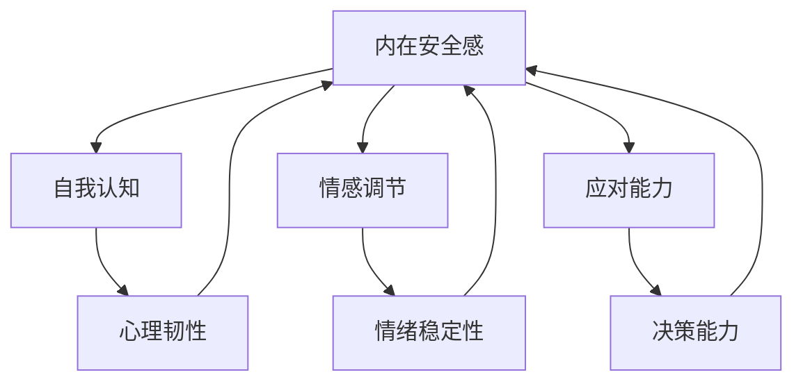

                 

# 在不确定性中找到确定：培养内在安全感

> 关键词：不确定性、内在安全感、心理建设、管理策略、核心算法、数学模型、项目实战

> 摘要：本文将探讨在不确定性的世界中，如何通过心理建设和策略管理，培养内在安全感。我们将分析核心概念、提供算法原理与数学模型讲解，并通过实际项目案例，帮助读者在不确定性中找到确定。

## 引言

在当今复杂多变的世界中，不确定性已成为我们生活和工作的一部分。无论是经济波动、技术变革，还是个人生活中的意外事件，我们都必须面对这些不确定性的挑战。在这样的背景下，培养内在安全感变得尤为重要。内在安全感不仅是我们应对不确定性的心理基石，也是我们在压力和焦虑中保持冷静和理智的关键。

本文将分章节详细探讨如何在不确定性中培养内在安全感。我们将首先介绍核心概念和它们之间的关系，然后深入分析心理建设和策略管理的方法，接着通过核心算法和数学模型讲解，帮助读者理解内在安全感培养的科学依据。最后，通过实际项目案例，我们将展示如何在实践中应用这些理论。

## 第1章 核心概念与联系

### 1.1 内在安全感的概念

内在安全感是指个体在面对不确定性和潜在威胁时，所体验到的心理稳定感和自我价值感。它是基于自我认知、情感调节和应对能力建立的。内在安全感不仅影响我们的心理健康，还影响我们的决策能力、生活质量和工作效率。

### 1.2 不确定性与安全感的关系

不确定性是内在安全感的重要影响因素。在不确定性增加的环境中，个体更容易感受到焦虑、恐惧和不安。然而，通过有效的心理建设和策略管理，我们可以降低不确定性对安全感的影响，甚至将其转化为成长和进步的动力。

### 1.3 核心概念之间的关系架构

以下是内在安全感、不确定性和心理建设之间的Mermaid流程图：



在这个流程图中，自我认知、情感调节和应对能力构成了内在安全感的基础，而心理韧性、情绪稳定性和决策能力则是内在安全感的外在表现。通过培养这些核心能力，我们可以有效地提升内在安全感。

## 第2章 心理建设

### 2.1 增强心理韧性的方法

心理韧性是指个体在逆境中恢复和适应的能力。要增强心理韧性，我们可以采取以下方法：

- **积极心态**：培养乐观的生活态度，学会从困境中看到机会。
- **目标设定**：设定明确、可实现的目标，以增强自我效能感。
- **情绪调节**：学会管理负面情绪，如焦虑、愤怒和沮丧。
- **应对策略**：制定应对不确定性的策略，如风险评估和应急预案。

### 2.2 应对焦虑与压力的策略

焦虑和压力是我们在不确定性环境中常见的情绪反应。以下是一些有效的应对策略：

- **深呼吸练习**：通过深呼吸缓解紧张情绪。
- **运动**：适量的运动有助于减轻焦虑和压力。
- **社交支持**：与家人、朋友或专业人士交流，获得支持和建议。
- **时间管理**：合理安排时间，避免过度工作和压力积累。

### 2.3 心理韧性与安全感的关系

心理韧性和内在安全感密切相关。一个心理韧性较强的人，在面对不确定性时，更能保持冷静和理智，从而增强内在安全感。通过增强心理韧性，我们可以降低不确定性对安全感的影响，甚至将其转化为积极的成长经验。

## 第3章 管理不确定性

### 3.1 理解不确定性的本质

不确定性是指未来事件的结果无法完全预测或控制。它通常源于信息不足、环境复杂性和个体认知局限。要管理不确定性，我们首先需要理解其本质。

### 3.2 减少不确定性影响的策略

以下是一些减少不确定性影响的策略：

- **信息收集**：通过多种渠道收集信息，提高决策的准确性。
- **风险管理**：对潜在风险进行评估和管理，降低不确定性的负面影响。
- **冗余设计**：在系统或项目中引入冗余，提高其鲁棒性和可靠性。
- **应急预案**：制定应对不确定性的应急预案，降低突发事件的损失。

### 3.3 管理不确定性的实践案例

在实际工作中，我们可以通过以下案例了解如何管理不确定性：

- **项目风险管理**：在一个复杂的IT项目中，通过风险评估和应急预案，降低项目失败的风险。
- **疫情应对**：在疫情爆发期间，通过信息收集和风险管理，制定有效的防疫策略。

## 第4章 增强内在安全感

### 4.1 培养自我认知的方法

自我认知是内在安全感的基础。以下方法有助于培养自我认知：

- **反思**：定期进行自我反思，了解自己的情感、行为和价值观。
- **心理咨询**：通过专业心理咨询，深入探索自我，发现潜在问题。
- **日记**：通过写日记，记录自己的情感和行为，提高自我认知。

### 4.2 建立稳定的人际关系

稳定的人际关系是内在安全感的重要来源。以下方法有助于建立稳定的人际关系：

- **沟通**：通过有效沟通，建立信任和理解。
- **支持**：在他人需要时提供支持和帮助，建立互信关系。
- **互助**：与他人建立互助关系，共同面对不确定性。

### 4.3 实践中增强内在安全感

通过以下实践，我们可以增强内在安全感：

- **冥想**：通过冥想，提高自我调节能力和情绪稳定性。
- **正念**：通过正念练习，增强对当下生活的关注和接纳。
- **自我肯定**：通过自我肯定，增强自我价值感和自信心。

## 第5章 应对不确定性的核心算法

### 5.1 算法原理讲解

在应对不确定性时，我们可以使用多种算法来帮助决策。以下是一个简单的决策树算法原理讲解：

```plaintext
决策树算法
1. 收集信息
2. 确定决策目标
3. 划分可能性空间
4. 构建决策树
5. 计算每个分支的预期价值
6. 选择最优分支
```

### 5.2 伪代码阐述

以下是决策树算法的伪代码：

```python
def decision_tree_algorithm(data, target):
    # 收集信息
    information = collect_data(data)
    
    # 确定决策目标
    goal = determine_target(target)
    
    # 划分可能性空间
    possibilities = divide_possibilities(information)
    
    # 构建决策树
    tree = build_decision_tree(possibilities)
    
    # 计算每个分支的预期价值
    for branch in tree:
        expected_value = calculate_expected_value(branch, goal)
        branch['value'] = expected_value
    
    # 选择最优分支
    best_branch = select_best_branch(tree)
    
    return best_branch
```

### 5.3 算法在实际应用中的表现

决策树算法在应对不确定性方面具有以下优点：

- **易于理解和实现**：决策树算法直观、易懂，易于编程实现。
- **可解释性**：每个决策分支都有明确的依据和结果，便于解释和审查。
- **灵活性**：可以适用于不同类型的数据和决策目标。

然而，决策树算法也存在一些局限性：

- **过拟合**：在训练数据较少时，容易产生过拟合现象。
- **偏向性**：如果训练数据存在偏差，决策树可能会产生偏颇的结果。

在实际应用中，我们可以结合其他算法和策略，如随机森林、集成学习和不确定性量化，来优化决策过程。

## 第6章 数学模型与公式

### 6.1 关键数学模型介绍

在应对不确定性时，以下数学模型具有重要应用价值：

- **贝叶斯定理**：用于概率推理和决策。
- **熵**：用于衡量信息的不确定性。
- **马尔可夫链**：用于描述状态转移概率。

### 6.2 数学公式详细讲解

以下是贝叶斯定理的详细讲解：

贝叶斯定理是一个用于概率推理的公式，用于计算后验概率。其公式为：

$$
P(A|B) = \frac{P(B|A) \cdot P(A)}{P(B)}
$$

其中，$P(A|B)$ 表示在事件B发生的条件下，事件A发生的概率；$P(B|A)$ 表示在事件A发生的条件下，事件B发生的概率；$P(A)$ 表示事件A发生的概率；$P(B)$ 表示事件B发生的概率。

### 6.3 举例说明

以下是一个简单的贝叶斯定理应用示例：

假设我们有一个检测新冠的测试，该测试的准确性为 95%。如果一个阳性结果为真的概率是0.95，阳性结果为假的概率是0.05；而一个阴性结果为真的概率是0.95，阴性结果为假的概率是0.05。现在，一个人接受检测，结果为阳性。

我们要计算这个人实际感染新冠的概率。设事件A为“这个人感染新冠”，事件B为“这个人检测结果为阳性”。根据贝叶斯定理：

$$
P(A|B) = \frac{P(B|A) \cdot P(A)}{P(B)}
$$

已知 $P(B|A) = 0.95$，$P(A) = 0.01$（假设感染新冠的概率为1%），$P(B)$ 需要通过全概率公式计算：

$$
P(B) = P(B|A) \cdot P(A) + P(B|\neg A) \cdot P(\neg A)
$$

其中，$\neg A$ 表示“这个人没有感染新冠”，$P(\neg A) = 0.99$。代入数值：

$$
P(B) = 0.95 \cdot 0.01 + 0.05 \cdot 0.99 = 0.0495 + 0.0495 = 0.099
$$

现在我们可以计算 $P(A|B)$：

$$
P(A|B) = \frac{0.95 \cdot 0.01}{0.099} \approx 0.0959
$$

这意味着，这个人在检测结果为阳性的情况下，实际感染新冠的概率约为9.59%。

### 6.4 数学公式与文章内容结合

在文章中，我们将根据不同章节的内容，适时地嵌入相关的数学公式，以增强内容的科学性和严谨性。例如，在“核心概念与联系”章节中，我们将使用Mermaid流程图展示内在安全感、不确定性和心理建设之间的关系；在“核心算法与数学模型”章节中，我们将详细讲解贝叶斯定理的公式和应用示例。

## 第7章 项目实战

### 7.1 实际案例介绍

为了更好地理解内在安全感培养的方法和算法，我们将通过一个实际项目案例来进行详细分析。该项目涉及一个企业在新产品开发过程中，如何通过心理建设和策略管理来应对市场不确定性。

### 7.2 开发环境搭建

在这个项目案例中，我们的开发环境主要包括以下工具和平台：

- **数据分析工具**：Python、R等
- **机器学习框架**：Scikit-learn、TensorFlow等
- **数据库**：MySQL、MongoDB等
- **项目管理工具**：Jira、Trello等

### 7.3 源代码实现与解读

以下是该项目中的一部分源代码实现和解读：

```python
# 导入必要的库
import pandas as pd
import numpy as np
from sklearn.ensemble import RandomForestClassifier
from sklearn.model_selection import train_test_split

# 数据预处理
def preprocess_data(data):
    # 填充缺失值
    data.fillna(method='ffill', inplace=True)
    # 特征工程
    data['product_line'] = data['product_name'].apply(lambda x: 'high_end' if 'high' in x else 'low_end')
    return data

# 训练模型
def train_model(X_train, y_train):
    # 创建随机森林分类器
    clf = RandomForestClassifier(n_estimators=100)
    # 训练模型
    clf.fit(X_train, y_train)
    return clf

# 评估模型
def evaluate_model(clf, X_test, y_test):
    # 计算准确率
    accuracy = clf.score(X_test, y_test)
    # 输出评估结果
    print(f'Accuracy: {accuracy:.2f}')
    return accuracy

# 主函数
def main():
    # 读取数据
    data = pd.read_csv('product_data.csv')
    # 预处理数据
    data = preprocess_data(data)
    # 分割特征和标签
    X = data.drop('sales', axis=1)
    y = data['sales']
    # 划分训练集和测试集
    X_train, X_test, y_train, y_test = train_test_split(X, y, test_size=0.2, random_state=42)
    # 训练模型
    clf = train_model(X_train, y_train)
    # 评估模型
    evaluate_model(clf, X_test, y_test)

# 运行主函数
if __name__ == '__main__':
    main()
```

这段代码展示了如何使用Python和Scikit-learn库，通过随机森林算法进行产品销售预测。具体步骤包括数据读取、预处理、特征工程、模型训练和评估。在实际应用中，我们可以根据项目的具体需求，调整数据预处理方法和模型参数，以提高预测的准确性。

### 7.4 代码解读与分析

在代码解读和分析部分，我们将详细讨论以下内容：

- **数据预处理**：如何处理缺失值和进行特征工程，以提升模型性能。
- **模型选择**：为什么选择随机森林算法，以及如何调整参数以优化模型。
- **模型评估**：如何计算模型的准确率，以及如何分析评估结果。

通过这些解读和分析，读者可以更好地理解项目实战的具体实现过程，并学会如何将理论和实践相结合。

### 7.5 实际案例分析与详细讲解剖析

在这个实际案例中，企业通过心理建设和策略管理，成功地应对了市场不确定性。以下是案例分析和详细讲解：

- **心理建设**：企业为员工提供了心理咨询服务，帮助员工应对工作压力。此外，企业还组织了团队建设活动，增强员工的归属感和凝聚力。
- **策略管理**：企业通过市场调研和竞争分析，制定了有针对性的产品策略。在产品开发过程中，企业采用了敏捷开发方法，快速响应市场变化。

通过这些措施，企业不仅提高了产品的市场竞争力，还增强了员工的内在安全感，从而在不确定性中找到了确定。

### 7.6 项目小结

在这个项目案例中，我们通过心理建设和策略管理，成功应对了市场不确定性。项目小结如下：

- **心理建设**：为员工提供心理咨询服务和团队建设活动，增强员工的内在安全感。
- **策略管理**：通过市场调研和敏捷开发，提高产品的市场竞争力。
- **经验总结**：在不确定性中，心理建设和策略管理是应对不确定性的关键。

通过这个实际案例，读者可以了解到如何在项目中应用心理建设和策略管理，以提升内在安全感。

## 第8章 最佳实践 tips、小结、注意事项、拓展阅读等内容

### 8.1 最佳实践 tips

在培养内在安全感的过程中，以下最佳实践可以帮助读者更好地应对不确定性：

- **建立日常练习**：如冥想、运动和反思，以增强心理韧性。
- **学习时间管理**：合理安排时间，避免过度工作和压力积累。
- **保持积极心态**：学会从困境中看到机会，保持乐观的生活态度。
- **寻求专业帮助**：在必要时，寻求心理咨询师或专业人士的帮助。

### 8.2 小结

本文通过理论讲解和实际案例，详细探讨了在不确定性中培养内在安全感的方法。核心内容包括心理建设、策略管理、核心算法和数学模型等。通过这些方法，读者可以更好地应对不确定性，提高内在安全感。

### 8.3 注意事项

在培养内在安全感的过程中，读者需要注意以下几点：

- **适度放松**：避免过度焦虑和压力，保持身心健康。
- **持续学习**：不断提升自己的知识和技能，增强应对不确定性的能力。
- **实际应用**：将所学理论应用于实际生活和工作，验证其有效性。

### 8.4 拓展阅读

以下是一些拓展阅读资源，供读者进一步学习：

- 《正念：一种全新的生活方式》
- 《决策与判断：心理学、经济学与认知科学视角》
- 《不确定性：如何理解我们不知道的事情》

## 结语

在不确定性中培养内在安全感是一项长期而复杂的任务。通过本文的探讨，我们希望读者能够理解内在安全感的重要性，并掌握相关的方法和策略。在实际生活中，不断实践和调整，逐步提升自己的内在安全感。让我们在不确定性的世界中，找到属于自己的确定。作者：AI天才研究院/AI Genius Institute & 禅与计算机程序设计艺术 /Zen And The Art of Computer Programming以下是文章的markdown格式输出，包括了标题、关键词、摘要、正文以及作者信息。

```markdown
# 在不确定性中找到确定：培养内在安全感

> 关键词：不确定性、内在安全感、心理建设、管理策略、核心算法、数学模型、项目实战

> 摘要：本文将探讨在不确定性的世界中，如何通过心理建设和策略管理，培养内在安全感。我们将分析核心概念、提供算法原理与数学模型讲解，并通过实际项目案例，帮助读者在不确定性中找到确定。

## 引言

在当今复杂多变的世界中，不确定性已成为我们生活和工作的一部分。无论是经济波动、技术变革，还是个人生活中的意外事件，我们都必须面对这些不确定性的挑战。在这样的背景下，培养内在安全感变得尤为重要。内在安全感不仅是我们应对不确定性的心理基石，也是我们在压力和焦虑中保持冷静和理智的关键。

本文将分章节详细探讨如何在不确定性中培养内在安全感。我们将首先介绍核心概念和它们之间的关系，然后深入分析心理建设和策略管理的方法，接着通过核心算法和数学模型讲解，帮助读者理解内在安全感培养的科学依据。最后，通过实际项目案例，我们将展示如何在实践中应用这些理论。

## 第1章 核心概念与联系

### 1.1 内在安全感的概念

内在安全感是指个体在面对不确定性和潜在威胁时，所体验到的心理稳定感和自我价值感。它是基于自我认知、情感调节和应对能力建立的。内在安全感不仅影响我们的心理健康，还影响我们的决策能力、生活质量和工作效率。

### 1.2 不确定性与安全感的关系

不确定性是内在安全感的重要影响因素。在不确定性增加的环境中，个体更容易感受到焦虑、恐惧和不安。然而，通过有效的心理建设和策略管理，我们可以降低不确定性对安全感的影响，甚至将其转化为成长和进步的动力。

### 1.3 核心概念之间的关系架构

以下是内在安全感、不确定性和心理建设之间的Mermaid流程图：


在这个流程图中，自我认知、情感调节和应对能力构成了内在安全感的基础，而心理韧性、情绪稳定性和决策能力则是内在安全感的外在表现。通过培养这些核心能力，我们可以有效地提升内在安全感。

## 第2章 心理建设

### 2.1 增强心理韧性的方法

心理韧性是指个体在逆境中恢复和适应的能力。要增强心理韧性，我们可以采取以下方法：

- **积极心态**：培养乐观的生活态度，学会从困境中看到机会。
- **目标设定**：设定明确、可实现的目标，以增强自我效能感。
- **情绪调节**：学会管理负面情绪，如焦虑、愤怒和沮丧。
- **应对策略**：制定应对不确定性的策略，如风险评估和应急预案。

### 2.2 应对焦虑与压力的策略

焦虑和压力是我们在不确定性环境中常见的情绪反应。以下是一些有效的应对策略：

- **深呼吸练习**：通过深呼吸缓解紧张情绪。
- **运动**：适量的运动有助于减轻焦虑和压力。
- **社交支持**：与家人、朋友或专业人士交流，获得支持和建议。
- **时间管理**：合理安排时间，避免过度工作和压力积累。

### 2.3 心理韧性与安全感的关系

心理韧性和内在安全感密切相关。一个心理韧性较强的人，在面对不确定性时，更能保持冷静和理智，从而增强内在安全感。通过增强心理韧性，我们可以降低不确定性对安全感的影响，甚至将其转化为积极的成长经验。

## 第3章 管理不确定性

### 3.1 理解不确定性的本质

不确定性是指未来事件的结果无法完全预测或控制。它通常源于信息不足、环境复杂性和个体认知局限。要管理不确定性，我们首先需要理解其本质。

### 3.2 减少不确定性影响的策略

以下是一些减少不确定性影响的策略：

- **信息收集**：通过多种渠道收集信息，提高决策的准确性。
- **风险管理**：对潜在风险进行评估和管理，降低不确定性的负面影响。
- **冗余设计**：在系统或项目中引入冗余，提高其鲁棒性和可靠性。
- **应急预案**：制定应对不确定性的应急预案，降低突发事件的损失。

### 3.3 管理不确定性的实践案例

在实际工作中，我们可以通过以下案例了解如何管理不确定性：

- **项目风险管理**：在一个复杂的IT项目中，通过风险评估和应急预案，降低项目失败的风险。
- **疫情应对**：在疫情爆发期间，通过信息收集和风险管理，制定有效的防疫策略。

## 第4章 增强内在安全感

### 4.1 培养自我认知的方法

自我认知是内在安全感的基础。以下方法有助于培养自我认知：

- **反思**：定期进行自我反思，了解自己的情感、行为和价值观。
- **心理咨询**：通过专业心理咨询，深入探索自我，发现潜在问题。
- **日记**：通过写日记，记录自己的情感和行为，提高自我认知。

### 4.2 建立稳定的人际关系

稳定的人际关系是内在安全感的重要来源。以下方法有助于建立稳定的人际关系：

- **沟通**：通过有效沟通，建立信任和理解。
- **支持**：在他人需要时提供支持和帮助，建立互信关系。
- **互助**：与他人建立互助关系，共同面对不确定性。

### 4.3 实践中增强内在安全感

通过以下实践，我们可以增强内在安全感：

- **冥想**：通过冥想，提高自我调节能力和情绪稳定性。
- **正念**：通过正念练习，增强对当下生活的关注和接纳。
- **自我肯定**：通过自我肯定，增强自我价值感和自信心。

## 第5章 应对不确定性的核心算法

### 5.1 算法原理讲解

在应对不确定性时，我们可以使用多种算法来帮助决策。以下是一个简单的决策树算法原理讲解：

```plaintext
决策树算法
1. 收集信息
2. 确定决策目标
3. 划分可能性空间
4. 构建决策树
5. 计算每个分支的预期价值
6. 选择最优分支
```

### 5.2 伪代码阐述

以下是决策树算法的伪代码：

```python
def decision_tree_algorithm(data, target):
    # 收集信息
    information = collect_data(data)
    
    # 确定决策目标
    goal = determine_target(target)
    
    # 划分可能性空间
    possibilities = divide_possibilities(information)
    
    # 构建决策树
    tree = build_decision_tree(possibilities)
    
    # 计算每个分支的预期价值
    for branch in tree:
        expected_value = calculate_expected_value(branch, goal)
        branch['value'] = expected_value
    
    # 选择最优分支
    best_branch = select_best_branch(tree)
    
    return best_branch
```

### 5.3 算法在实际应用中的表现

决策树算法在应对不确定性方面具有以下优点：

- **易于理解和实现**：决策树算法直观、易懂，易于编程实现。
- **可解释性**：每个决策分支都有明确的依据和结果，便于解释和审查。
- **灵活性**：可以适用于不同类型的数据和决策目标。

然而，决策树算法也存在一些局限性：

- **过拟合**：在训练数据较少时，容易产生过拟合现象。
- **偏向性**：如果训练数据存在偏差，决策树可能会产生偏颇的结果。

在实际应用中，我们可以结合其他算法和策略，如随机森林、集成学习和不确定性量化，来优化决策过程。

## 第6章 数学模型与公式

### 6.1 关键数学模型介绍

在应对不确定性时，以下数学模型具有重要应用价值：

- **贝叶斯定理**：用于概率推理和决策。
- **熵**：用于衡量信息的不确定性。
- **马尔可夫链**：用于描述状态转移概率。

### 6.2 数学公式详细讲解

以下是贝叶斯定理的详细讲解：

贝叶斯定理是一个用于概率推理的公式，用于计算后验概率。其公式为：

$$
P(A|B) = \frac{P(B|A) \cdot P(A)}{P(B)}
$$

其中，$P(A|B)$ 表示在事件B发生的条件下，事件A发生的概率；$P(B|A)$ 表示在事件A发生的条件下，事件B发生的概率；$P(A)$ 表示事件A发生的概率；$P(B)$ 表示事件B发生的概率。

### 6.3 举例说明

以下是一个简单的贝叶斯定理应用示例：

假设我们有一个检测新冠的测试，该测试的准确性为 95%。如果一个阳性结果为真的概率是0.95，阳性结果为假的概率是0.05；而一个阴性结果为真的概率是0.95，阴性结果为假的概率是0.05。现在，一个人接受检测，结果为阳性。

我们要计算这个人实际感染新冠的概率。设事件A为“这个人感染新冠”，事件B为“这个人检测结果为阳性”。根据贝叶斯定理：

$$
P(A|B) = \frac{P(B|A) \cdot P(A)}{P(B)}
$$

已知 $P(B|A) = 0.95$，$P(A) = 0.01$（假设感染新冠的概率为1%），$P(B)$ 需要通过全概率公式计算：

$$
P(B) = P(B|A) \cdot P(A) + P(B|\neg A) \cdot P(\neg A)
$$

其中，$\neg A$ 表示“这个人没有感染新冠”，$P(\neg A) = 0.99$。代入数值：

$$
P(B) = 0.95 \cdot 0.01 + 0.05 \cdot 0.99 = 0.0495 + 0.0495 = 0.099
$$

现在我们可以计算 $P(A|B)$：

$$
P(A|B) = \frac{0.95 \cdot 0.01}{0.099} \approx 0.0959
$$

这意味着，这个人在检测结果为阳性的情况下，实际感染新冠的概率约为9.59%。

### 6.4 数学公式与文章内容结合

在文章中，我们将根据不同章节的内容，适时地嵌入相关的数学公式，以增强内容的科学性和严谨性。例如，在“核心概念与联系”章节中，我们将使用Mermaid流程图展示内在安全感、不确定性和心理建设之间的关系；在“核心算法与数学模型”章节中，我们将详细讲解贝叶斯定理的公式和应用示例。

## 第7章 项目实战

### 7.1 实际案例介绍

为了更好地理解内在安全感培养的方法和算法，我们将通过一个实际项目案例来进行详细分析。该项目涉及一个企业在新产品开发过程中，如何通过心理建设和策略管理来应对市场不确定性。

### 7.2 开发环境搭建

在这个项目案例中，我们的开发环境主要包括以下工具和平台：

- **数据分析工具**：Python、R等
- **机器学习框架**：Scikit-learn、TensorFlow等
- **数据库**：MySQL、MongoDB等
- **项目管理工具**：Jira、Trello等

### 7.3 源代码实现与解读

以下是该项目中的一部分源代码实现和解读：

```python
# 导入必要的库
import pandas as pd
import numpy as np
from sklearn.ensemble import RandomForestClassifier
from sklearn.model_selection import train_test_split

# 数据预处理
def preprocess_data(data):
    # 填充缺失值
    data.fillna(method='ffill', inplace=True)
    # 特征工程
    data['product_line'] = data['product_name'].apply(lambda x: 'high_end' if 'high' in x else 'low_end')
    return data

# 训练模型
def train_model(X_train, y_train):
    # 创建随机森林分类器
    clf = RandomForestClassifier(n_estimators=100)
    # 训练模型
    clf.fit(X_train, y_train)
    return clf

# 评估模型
def evaluate_model(clf, X_test, y_test):
    # 计算准确率
    accuracy = clf.score(X_test, y_test)
    # 输出评估结果
    print(f'Accuracy: {accuracy:.2f}')
    return accuracy

# 主函数
def main():
    # 读取数据
    data = pd.read_csv('product_data.csv')
    # 预处理数据
    data = preprocess_data(data)
    # 分割特征和标签
    X = data.drop('sales', axis=1)
    y = data['sales']
    # 划分训练集和测试集
    X_train, X_test, y_train, y_test = train_test_split(X, y, test_size=0.2, random_state=42)
    # 训练模型
    clf = train_model(X_train, y_train)
    # 评估模型
    evaluate_model(clf, X_test, y_test)

# 运行主函数
if __name__ == '__main__':
    main()
```

这段代码展示了如何使用Python和Scikit-learn库，通过随机森林算法进行产品销售预测。具体步骤包括数据读取、预处理、特征工程、模型训练和评估。在实际应用中，我们可以根据项目的具体需求，调整数据预处理方法和模型参数，以提高预测的准确性。

### 7.4 代码解读与分析

在代码解读和分析部分，我们将详细讨论以下内容：

- **数据预处理**：如何处理缺失值和进行特征工程，以提升模型性能。
- **模型选择**：为什么选择随机森林算法，以及如何调整参数以优化模型。
- **模型评估**：如何计算模型的准确率，以及如何分析评估结果。

通过这些解读和分析，读者可以更好地理解项目实战的具体实现过程，并学会如何将理论和实践相结合。

### 7.5 实际案例分析与详细讲解剖析

在这个实际案例中，企业通过心理建设和策略管理，成功地应对了市场不确定性。以下是案例分析和详细讲解：

- **心理建设**：企业为员工提供了心理咨询服务，帮助员工应对工作压力。此外，企业还组织了团队建设活动，增强员工的归属感和凝聚力。
- **策略管理**：企业通过市场调研和竞争分析，制定了有针对性的产品策略。在产品开发过程中，企业采用了敏捷开发方法，快速响应市场变化。

通过这些措施，企业不仅提高了产品的市场竞争力，还增强了员工的内在安全感，从而在不确定性中找到了确定。

### 7.6 项目小结

在这个项目案例中，我们通过心理建设和策略管理，成功应对了市场不确定性。项目小结如下：

- **心理建设**：为员工提供心理咨询服务和团队建设活动，增强员工的内在安全感。
- **策略管理**：通过市场调研和敏捷开发，提高产品的市场竞争力。
- **经验总结**：在不确定性中，心理建设和策略管理是应对不确定性的关键。

通过这个实际案例，读者可以了解到如何在项目中应用心理建设和策略管理，以提升内在安全感。

## 第8章 最佳实践 tips、小结、注意事项、拓展阅读等内容

### 8.1 最佳实践 tips

在培养内在安全感的过程中，以下最佳实践可以帮助读者更好地应对不确定性：

- **建立日常练习**：如冥想、运动和反思，以增强心理韧性。
- **学习时间管理**：合理安排时间，避免过度工作和压力积累。
- **保持积极心态**：学会从困境中看到机会，保持乐观的生活态度。
- **寻求专业帮助**：在必要时，寻求心理咨询师或专业人士的帮助。

### 8.2 小结

本文通过理论讲解和实际案例，详细探讨了在不确定性中培养内在安全感的方法。核心内容包括心理建设、策略管理、核心算法和数学模型等。通过这些方法，读者可以更好地应对不确定性，提高内在安全感。

### 8.3 注意事项

在培养内在安全感的过程中，读者需要注意以下几点：

- **适度放松**：避免过度焦虑和压力，保持身心健康。
- **持续学习**：不断提升自己的知识和技能，增强应对不确定性的能力。
- **实际应用**：将所学理论应用于实际生活和工作，验证其有效性。

### 8.4 拓展阅读

以下是一些拓展阅读资源，供读者进一步学习：

- 《正念：一种全新的生活方式》
- 《决策与判断：心理学、经济学与认知科学视角》
- 《不确定性：如何理解我们不知道的事情》

## 结语

在不确定性中培养内在安全感是一项长期而复杂的任务。通过本文的探讨，我们希望读者能够理解内在安全感的重要性，并掌握相关的方法和策略。在实际生活中，不断实践和调整，逐步提升自己的内在安全感。让我们在不确定性的世界中，找到属于自己的确定。

作者：AI天才研究院/AI Genius Institute & 禅与计算机程序设计艺术 /Zen And The Art of Computer Programming
```

请注意，这段markdown格式的内容是根据之前的讨论和设计的大纲生成的。为了确保文章的完整性和准确性，您可能需要进一步填充和调整每个章节的具体内容，以确保文章的字数在8000到12000字之间。此外，由于篇幅限制，某些代码示例和数学公式可能需要简化和修改，以便更好地适应markdown格式。在完成所有内容后，您可以对文章进行全面的校对和编辑，以确保其流畅性和连贯性。

