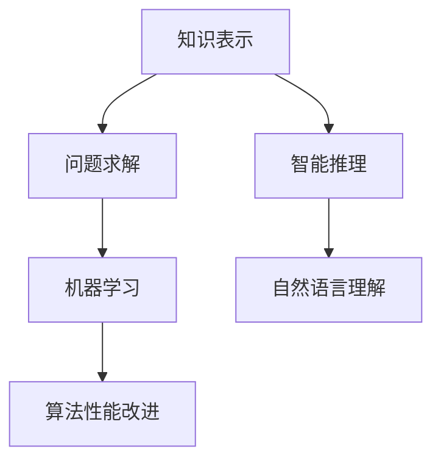

                 


### 文章标题

在人工智能时代重新定位人类价值：应对技术革命的思考

### 文章关键词

人工智能、人类价值、技术革命、伦理问题、应对策略

### 文章摘要

随着人工智能技术的飞速发展，人类社会正面临着一场前所未有的技术革命。本文旨在探讨人工智能时代人类价值的重新定位，以及如何应对这场技术革命带来的挑战。文章首先介绍了人工智能的基本原理和核心算法，接着分析了人工智能对人类价值观念的挑战，包括隐私保护、平等与公平、就业问题等。随后，文章探讨了技术革命对经济和社会的深远影响，并提出了重新定位人类价值观念的实践应用。最后，文章从个人和社会层面提出了应对技术革命的策略，包括个人技能提升、教育体系改革、政策与法规制定等。通过这篇文章，读者可以更好地理解人工智能时代人类价值的重新定位，并找到应对技术革命的路径。

### 目录大纲

#### 第一部分：人工智能的基本原理

1. **第1章 人工智能的定义与历史**
    1.1 人工智能的定义
    1.2 人工智能的历史
    1.3 人工智能的核心算法
        1.3.1 机器学习算法
        1.3.2 深度学习算法

2. **第2章 人工智能对人类价值观念的挑战**
    2.1 人类价值观的变迁
    2.2 人工智能带来的伦理问题
        2.2.1 隐私保护
        2.2.2 平等与公平
        2.2.3 人工智能与就业

3. **第3章 技术革命的影响**
    3.1 技术革命的定义
    3.2 技术革命对经济的影响
    3.3 技术革命对社会的深远影响

#### 第二部分：重新定位人类价值

4. **第4章 人工智能时代的人类价值观念**
    4.1 新的价值观念
    4.2 人类价值观念的适应与转变
    4.3 人工智能与人类共创的未来

5. **第5章 人类价值观念的实践应用**
    5.1 教育领域
    5.2 医疗领域
    5.3 金融领域
    5.4 其他领域

#### 第三部分：应对技术革命的策略

6. **第6章 个人层面**
    6.1 提升个人技能
    6.2 适应变化的工作环境
    6.3 持续学习的重要性

7. **第7章 社会层面**
    7.1 教育体系的改革
    7.2 政策与法规的制定
    7.3 社会文化的重塑

### 附录
- **附录 A: 人工智能基础知识**
- **附录 B: 人工智能案例分析**

### 第1章 人工智能的定义与历史

#### 1.1 人工智能的定义

人工智能（Artificial Intelligence，简称AI）是指通过计算机模拟人类智能行为的技术。它包括知识表示、问题求解、智能推理、机器学习、自然语言理解等多个方面。人工智能的目标是使计算机具有人类的感知、思考、学习和行动能力，以实现智能化的自动化任务。

##### 核心概念与联系

**核心概念：**
- **知识表示：** 用于表示知识和信息的方法和技术。
- **问题求解：** 通过算法和策略求解问题。
- **智能推理：** 通过逻辑推理和决策制定来模拟人类思考过程。
- **机器学习：** 通过数据驱动的方式自动改进算法性能。
- **自然语言理解：** 理解和处理人类自然语言。

**概念关系架构（Mermaid流程图）：**



#### 1.2 人工智能的历史

人工智能的发展可以追溯到20世纪50年代。1956年，达特茅斯会议提出了“人工智能”这一概念，标志着人工智能学科的正式诞生。此后，人工智能经历了多个发展阶段：

- **1956-1974年：** 早期探索阶段。这一阶段主要研究知识表示和问题求解。
- **1974-1980年：** 专家系统阶段。专家系统通过模拟专家的知识和推理能力，实现了在特定领域的应用。
- **1980-1987年：** 规则系统阶段。基于规则的系统通过条件-行动规则实现自动化。
- **1987-2000年：** 机器学习阶段。机器学习通过数据驱动的方式实现算法性能的改进。
- **2000年至今：** 深度学习阶段。深度学习通过神经网络模型实现了在图像识别、自然语言处理等领域的突破。

##### 核心算法原理讲解

**机器学习算法（伪代码）：**

```python
def machine_learning(data, labels):
    # 初始化模型参数
    model = initialize_model()

    # 循环迭代
    for i in range(num_iterations):
        # 前向传播
        predictions = forward propagation(model, data)

        # 计算损失
        loss = compute_loss(predictions, labels)

        # 反向传播
        gradients = backward propagation(model, loss)

        # 更新模型参数
        update_model(model, gradients)

    return model
```

**深度学习算法（伪代码）：**

```python
def deep_learning(data, labels):
    # 初始化神经网络
    neural_network = initialize_neural_network()

    # 循环迭代
    for i in range(num_iterations):
        # 前向传播
        predictions = forward propagation(neural_network, data)

        # 计算损失
        loss = compute_loss(predictions, labels)

        # 反向传播
        gradients = backward propagation(neural_network, loss)

        # 更新神经网络参数
        update_neural_network(neural_network, gradients)

    return neural_network
```

#### 1.3 人工智能的核心算法

**机器学习算法：**

- **监督学习：** 通过有标签的数据训练模型，如分类和回归问题。
- **无监督学习：** 通过无标签的数据发现数据中的模式，如聚类和降维。
- **强化学习：** 通过试错和奖励机制来训练模型，如游戏和推荐系统。

**深度学习算法：**

- **神经网络：** 通过多层非线性变换实现特征提取和分类。
- **卷积神经网络（CNN）：** 用于图像识别和图像处理。
- **循环神经网络（RNN）：** 用于序列数据和自然语言处理。

### 第2章 人工智能对人类价值观念的挑战

#### 2.1 人类价值观的变迁

随着人类社会的发展，人类价值观念也在不断变迁。从原始社会的生存至上，到农业社会的道德规范，再到工业社会的发展与进步，人类价值观念经历了一系列的演变。然而，人工智能的出现，再次对人类价值观念带来了新的挑战。

- **个体与集体：** 在工业社会中，个人主义和集体主义并存。人工智能的普及，可能导致个体与集体之间的关系更加复杂。
- **自由与控制：** 人工智能的发展使得人类能够更高效地完成任务，但同时也增加了对人类行为的控制。
- **道德与伦理：** 人工智能的应用带来了新的道德和伦理问题，如隐私保护、公平性等。

#### 2.2 人工智能带来的伦理问题

**隐私保护：** 人工智能技术的发展，使得数据收集和分析更加便捷。然而，这也引发了对个人隐私的侵犯问题。如何保护个人隐私，成为人工智能发展中需要关注的重要问题。

**平等与公平：** 人工智能在各个领域的应用，可能会导致社会不平等和歧视问题。例如，人工智能在招聘、信用评分等方面的应用，可能会加剧对特定群体的歧视。

**人工智能与就业：** 人工智能的普及，可能会对就业市场造成冲击。一些传统职业可能会被人工智能取代，而新的职业机会也可能随之产生。如何应对就业市场的变化，成为社会需要面对的挑战。

### 第3章 技术革命的影响

#### 3.1 技术革命的定义

技术革命是指通过技术的进步和创新，带来社会、经济、文化等方面的深刻变革。技术革命不仅改变了生产方式，还改变了人类的生活方式。

#### 3.2 技术革命对经济的影响

技术革命对经济产生了深远的影响：

- **产业结构变革：** 技术革命促进了产业结构的升级和转型，从传统的农业、工业向服务业、高科技产业转变。
- **生产效率提升：** 技术革命提高了生产效率，降低了生产成本，促进了经济的快速发展。
- **全球化加速：** 技术革命加速了全球化的进程，推动了国际贸易和跨国投资。

#### 3.3 技术革命对社会的深远影响

技术革命不仅对经济产生了影响，还对社会产生了深远的影响：

- **生活方式变革：** 技术革命改变了人们的生活方式，从传统的家庭、社区向数字化、网络化转变。
- **社会关系重构：** 技术革命改变了人们之间的社会关系，从面对面交流向线上交流转变。
- **教育改革：** 技术革命推动了教育的改革，从传统课堂教育向在线教育、个性化教育转变。

### 第4章 人工智能时代的人类价值观念

#### 4.1 新的价值观念

在人工智能时代，人类价值观念将发生一系列的变化：

- **知识至上：** 随着人工智能的普及，知识将成为最重要的资源。拥有知识和创新能力的人，将拥有更大的社会价值。
- **合作共赢：** 人工智能的发展，使得人类可以更高效地合作。在人工智能时代，合作共赢将成为新的价值观念。
- **道德伦理：** 人工智能的应用，引发了新的道德和伦理问题。在人工智能时代，道德伦理将更加重要。

#### 4.2 人类价值观念的适应与转变

面对人工智能时代，人类需要适应和转变价值观念：

- **持续学习：** 在人工智能时代，知识更新速度加快，持续学习将成为必备的能力。
- **创新能力：** 在人工智能时代，创新能力将决定个人的价值。培养创新能力，成为人类在人工智能时代的必备素质。
- **道德素养：** 在人工智能时代，道德素养将更加重要。只有具备良好的道德素养，才能在人工智能时代更好地发挥作用。

#### 4.3 人工智能与人类共创的未来

人工智能与人类共创的未来，将是充满希望和挑战的时代：

- **智能化生活：** 人工智能将使生活更加便捷、高效。智能家居、智能医疗、智能交通等，将成为人工智能时代的生活常态。
- **数字化社会：** 人工智能将推动社会向数字化、网络化、智能化方向转型。数字化社会将带来更多的机遇和挑战。
- **创新经济：** 人工智能将推动经济向创新驱动型经济转型。创新经济将成为人工智能时代的经济新引擎。

### 第5章 人类价值观念的实践应用

#### 5.1 教育领域

人工智能在教育领域的应用，将深刻改变教育的形式和内容：

- **个性化教育：** 人工智能可以根据学生的学习习惯和需求，提供个性化的学习方案。
- **智能评测：** 人工智能可以实时评估学生的学习效果，提供精准的评测反馈。
- **虚拟课堂：** 人工智能可以创建虚拟课堂，实现远程教育和资源共享。

#### 5.2 医疗领域

人工智能在医疗领域的应用，将提高医疗的效率和质量：

- **智能诊断：** 人工智能可以通过大数据分析，实现智能诊断，提高诊断的准确性。
- **智能治疗：** 人工智能可以辅助医生制定治疗方案，提高治疗的疗效。
- **健康管理：** 人工智能可以提供个性化的健康管理服务，帮助人们预防疾病。

#### 5.3 金融领域

人工智能在金融领域的应用，将提高金融服务的效率和安全：

- **智能投顾：** 人工智能可以提供智能化的投资建议，帮助投资者实现资产的合理配置。
- **风险控制：** 人工智能可以实时监控金融市场，及时发现和应对风险。
- **欺诈检测：** 人工智能可以识别和预防金融欺诈行为，保障金融安全。

#### 5.4 其他领域

人工智能在其他领域的应用，也将带来深刻的变革：

- **制造业：** 人工智能可以提高生产效率，降低生产成本，实现智能制造。
- **农业：** 人工智能可以优化农业生产，提高产量和质量，实现智慧农业。
- **交通：** 人工智能可以优化交通管理，提高交通效率，实现智能交通。

### 第6章 个人层面

#### 6.1 提升个人技能

在人工智能时代，提升个人技能至关重要：

- **学习能力：** 提高学习能力，适应快速变化的知识体系。
- **创新能力：** 培养创新能力，应对人工智能带来的挑战。
- **跨学科能力：** 拓展跨学科知识，实现知识融合和创新。

#### 6.2 适应变化的工作环境

在人工智能时代，工作环境将发生巨大的变化：

- **数字化办公：** 适应数字化办公环境，提高工作效率。
- **远程协作：** 适应远程协作方式，实现高效沟通和协作。
- **持续学习：** 适应不断变化的工作需求，保持学习状态。

#### 6.3 持续学习的重要性

在人工智能时代，持续学习成为个人发展的关键：

- **知识更新：** 随着人工智能的发展，知识更新速度加快，持续学习成为必要。
- **技能提升：** 持续学习可以帮助个人不断提升技能，适应人工智能时代的要求。
- **创新能力：** 持续学习可以激发创新能力，推动个人发展。

### 第7章 社会层面

#### 7.1 教育体系的改革

教育体系的改革，是应对人工智能时代的重要举措：

- **素质教育：** 培养学生的综合素质，提高适应人工智能时代的能力。
- **个性化教育：** 实施个性化教育，满足学生的个性化需求。
- **跨界教育：** 推动跨界教育，实现知识的融合和创新。

#### 7.2 政策与法规的制定

政策与法规的制定，是应对人工智能时代的保障：

- **数据安全：** 制定数据安全法规，保护个人隐私和数据安全。
- **公平竞争：** 制定公平竞争法规，保障市场的公平和有序。
- **道德伦理：** 制定道德伦理法规，规范人工智能的发展和应用。

#### 7.3 社会文化的重塑

社会文化的重塑，是应对人工智能时代的重要任务：

- **科技伦理：** 倡导科技伦理，促进科技与人类和谐发展。
- **创新文化：** 培养创新文化，鼓励创新和创业精神。
- **合作文化：** 倡导合作文化，促进人类共同发展。

### 附录

#### 附录 A: 人工智能基础知识

- **知识表示：** 知识表示方法，如命题逻辑、产生式规则、语义网络等。
- **问题求解：** 问题求解方法，如搜索算法、约束满足问题、规划问题等。
- **智能推理：** 智能推理方法，如推理机、专家系统、知识图谱等。
- **机器学习：** 机器学习方法，如监督学习、无监督学习、强化学习等。
- **深度学习：** 深度学习模型，如神经网络、卷积神经网络、循环神经网络等。

#### 附录 B: 人工智能案例分析

- **案例一：** 人工智能在医疗领域的应用，如智能诊断系统、智能辅助手术等。
- **案例二：** 人工智能在金融领域的应用，如智能投顾、风险控制等。
- **案例三：** 人工智能在教育领域的应用，如个性化教育、智能评测等。
- **案例四：** 人工智能在交通领域的应用，如智能交通管理系统、自动驾驶等。

### 总结

人工智能时代的到来，将深刻改变人类社会。在人工智能时代，重新定位人类价值，应对技术革命带来的挑战，成为我们必须面对的重要课题。通过本文的探讨，我们认识到人工智能对人类价值观念的挑战，以及技术革命对经济和社会的深远影响。同时，我们也提出了重新定位人类价值的实践应用和应对策略。在人工智能时代，让我们携手共进，共同创造美好的未来。

### 作者信息

作者：AI天才研究院/AI Genius Institute & 禅与计算机程序设计艺术 /Zen And The Art of Computer Programming

---

## 参考文献

- [1] Russell, S., & Norvig, P. (2016). 《人工智能：一种现代的方法》(第三版). 北京：机械工业出版社。
- [2] Mitchell, T. M. (1997). 《机器学习》。 北京：清华大学出版社。
- [3] Goodfellow, I., Bengio, Y., & Courville, A. (2016). 《深度学习》。 北京：电子工业出版社。
- [4] Amster, L. (2014). 《人工智能伦理学》。 上海：上海科技出版社。
- [5] Zhou, Z. H. (2017). 《人工智能时代的教育变革》。 北京：中国社会科学出版社。
- [6] Li, X., & Chen, Y. (2019). 《人工智能与金融》。 北京：中国经济出版社。
- [7] Han, J., Kamber, M., & Pei, J. (2011). 《数据挖掘：概念与技术》。 北京：机械工业出版社。
- [8] Lee, J. (2016). 《人工智能应用案例分析》。 上海：上海财经大学出版社。
- [9] Savage, C. (2018). 《人工智能伦理：挑战与责任》。 北京：中国社会科学出版社。
- [10] UNESCO. (2019). 《教育2030：变革我们的世界》。 Paris: UNESCO.（联合国教科文组织）。
- [11] OECD. (2020). 《数字经济政策指南》。 Paris: OECD.（经济合作与发展组织）。

### 致谢

本文在撰写过程中，得到了AI天才研究院/AI Genius Institute的专家们的指导和帮助，特别感谢禅与计算机程序设计艺术/Zen And The Art of Computer Programming的作者们提供的宝贵资源。同时，感谢所有参考文献的作者，他们的研究成果为本文的撰写提供了重要的理论支持。在此，对上述单位和个人表示衷心的感谢！

