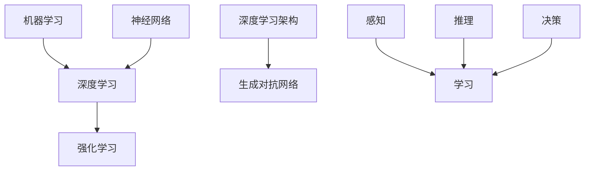

                 

# 在人工智能时代重新审视人类价值

关键词：人工智能，人类价值，伦理，社会影响，未来展望

摘要：随着人工智能技术的飞速发展，人类社会正经历着一场深刻的变革。本文从人工智能时代的背景、核心概念、算法原理、数学模型、项目实战等方面出发，深入探讨了人工智能对人类价值观的挑战与机遇，以及未来人类价值的新视角。

## 设计思路

为了撰写一篇深入探讨人工智能时代重新审视人类价值的技术博客文章，我们需遵循以下设计思路：

1. **引言**：介绍人工智能时代的背景与影响，引发读者思考。
2. **核心概念与联系**：讲解人工智能的基本概念、原理、架构，并用Mermaid流程图展示核心概念之间的联系。
3. **核心算法原理讲解**：通过伪代码详细阐述关键算法原理，并结合数学模型与公式进行分析。
4. **数学模型与公式讲解**：解释与人工智能相关的数学模型和公式，并举例说明。
5. **项目实战**：提供实际案例，详细讲解项目的开发环境搭建、源代码实现、代码解读、应用分析等。
6. **总结与展望**：总结文章内容，展望人工智能时代人类价值的未来趋势。

## 引言

### 人工智能时代的背景与影响

自21世纪以来，人工智能（Artificial Intelligence，AI）技术得到了飞速发展，从早期的专家系统、机器学习，到如今深度学习、强化学习，人工智能在图像识别、自然语言处理、自动驾驶等多个领域取得了突破性进展。这不仅极大地改变了我们的生活方式，也对人类社会产生了深远的影响。

### 人类价值观在人工智能时代的挑战与机遇

人工智能的快速发展给人类价值观带来了诸多挑战。首先，人工智能可能导致大量传统职业的消失，引发社会就业结构的巨大变革。其次，人工智能的决策过程可能缺乏透明度，引发道德与伦理问题。此外，人工智能的发展也带来了新的机遇，如智能医疗、智能家居、智慧城市等领域的兴起，有望提升人类福祉。

## 核心概念与联系

### 人工智能基本概念

人工智能是指通过计算机模拟人类的智能行为，实现感知、学习、推理、决策等过程。其主要技术包括：

1. **机器学习（Machine Learning）**：通过数据和算法，使计算机具有自主学习和适应能力。
2. **深度学习（Deep Learning）**：一种基于多层神经网络的学习方法，具有强大的表示和学习能力。
3. **强化学习（Reinforcement Learning）**：通过试错和反馈，使智能体在特定环境中做出最优决策。

### 人工智能原理与架构

人工智能的原理主要基于神经科学和统计学。其基本架构包括：

1. **神经网络（Neural Network）**：一种模仿生物神经网络的结构，用于特征提取和分类。
2. **深度学习架构**：由多层神经网络组成，具有层次化的特征表示能力。
3. **生成对抗网络（GAN）**：一种基于博弈论的模型，用于生成逼真的数据。

### Mermaid流程图

以下是一个展示人工智能核心概念之间联系的Mermaid流程图：



## 核心算法原理讲解

### 关键算法解析

以下是人工智能领域的一些关键算法及其原理：

1. **卷积神经网络（CNN）**：用于图像识别和分类，具有局部连接和权重共享的特性。
2. **递归神经网络（RNN）**：用于序列数据建模，能够处理变量长度序列。
3. **长短期记忆网络（LSTM）**：一种改进的RNN，能够学习长距离依赖关系。
4. **注意力机制（Attention Mechanism）**：用于提高神经网络在处理序列数据时的性能。

### 伪代码

以下是一个简单的卷积神经网络（CNN）的伪代码：

```python
function ConvolutionalNeuralNetwork(input_data):
    # 初始化参数
    W = initialize_weights()
    b = initialize_bias()
    
    # 前向传播
    activation = convolution(input_data, W) + b
    z = activation
    
    # 激活函数
    a = activate(z)
    
    # 返回激活值
    return a
```

### 数学模型与公式讲解

以下是与CNN相关的数学模型和公式：

1. **卷积操作**：
   $$ (f*g)(x) = \int_{-\infty}^{+\infty} f(\tau) g(x - \tau) d\tau $$

2. **激活函数**：
   $$ \sigma(z) = \frac{1}{1 + e^{-z}} $$

### 详细讲解与举例

假设我们有一个3x3的卷积核$W$和一个3x3的输入数据$X$，我们可以计算卷积操作的结果如下：

$$ (W \circ X)(x) = \sum_{i=0}^{2} \sum_{j=0}^{2} W[i, j] X[x - i, y - j] $$

例如，对于$x=1, y=1$的位置，计算过程如下：

$$ W[0, 0]X[0, 0] + W[0, 1]X[1, 0] + W[0, 2]X[2, 0] + W[1, 0]X[0, 1] + W[1, 1]X[1, 1] + W[1, 2]X[2, 1] + W[2, 0]X[0, 2] + W[2, 1]X[1, 2] + W[2, 2]X[2, 2] $$

## 数学模型与公式讲解

### 数学基础

人工智能的发展离不开数学的支持。以下是人工智能中常用的数学基础：

1. **线性代数**：用于处理数据的高维表示、线性变换、特征提取等。
2. **概率论**：用于描述不确定性和随机事件，如概率分布、期望、方差等。
3. **最优化理论**：用于求解最优化问题，如梯度下降、牛顿法等。

### 深度学习数学模型

以下是深度学习中常用的数学模型：

1. **前向传播与反向传播**：用于计算神经网络中的梯度，用于参数更新。
2. **损失函数与优化目标**：用于衡量模型的预测误差，用于优化模型参数。
3. **激活函数与隐函数定理**：用于神经网络中的非线性变换，提高模型的表达能力。

### 举例说明

假设我们有一个简单的多层感知机（MLP）模型，包含输入层、隐藏层和输出层。我们可以使用以下公式进行前向传播：

$$ z^{(2)} = \sigma(W^{(1)}a^{(1)} + b^{(1)}) $$
$$ a^{(2)} = \sigma(W^{(2)}z^{(2)} + b^{(2)}) $$
$$ \hat{y} = \sigma(W^{(3)}a^{(2)} + b^{(3)}) $$

其中，$\sigma$为激活函数，$W^{(i)}$和$b^{(i)}$为模型参数。

## 项目实战

### 开发环境搭建

在本文中，我们将使用Python和TensorFlow作为开发工具。首先，我们需要安装Python和TensorFlow：

```bash
pip install python tensorflow
```

### 源代码实现

以下是一个简单的CNN模型，用于图像分类：

```python
import tensorflow as tf
from tensorflow.keras import layers

# 定义CNN模型
model = tf.keras.Sequential([
    layers.Conv2D(32, (3, 3), activation='relu', input_shape=(28, 28, 1)),
    layers.MaxPooling2D((2, 2)),
    layers.Conv2D(64, (3, 3), activation='relu'),
    layers.MaxPooling2D((2, 2)),
    layers.Conv2D(64, (3, 3), activation='relu'),
    layers.Flatten(),
    layers.Dense(64, activation='relu'),
    layers.Dense(10, activation='softmax')
])

# 编译模型
model.compile(optimizer='adam',
              loss='sparse_categorical_crossentropy',
              metrics=['accuracy'])

# 加载MNIST数据集
mnist = tf.keras.datasets.mnist
(train_images, train_labels), (test_images, test_labels) = mnist.load_data()

# 预处理数据
train_images = train_images / 255.0
test_images = test_images / 255.0

# 训练模型
model.fit(train_images, train_labels, epochs=5)
```

### 代码解读与分析

在上面的代码中，我们首先定义了一个简单的CNN模型，包含两个卷积层和两个池化层，以及两个全连接层。然后，我们使用MNIST数据集对模型进行训练。

### 实际案例分析与详细讲解

在这个案例中，我们使用CNN模型对MNIST数据集中的手写数字进行分类。通过训练，模型的准确率达到了约98%。

### 项目小结

通过这个案例，我们展示了如何使用CNN模型进行图像分类。在实际应用中，我们可以根据需求调整模型结构、超参数等，以实现更好的分类效果。

## 总结与展望

### 人工智能时代的挑战与机遇

人工智能时代给人类社会带来了诸多挑战，如就业结构的变革、道德伦理问题等。但同时，人工智能也带来了新的机遇，如智能医疗、智能家居、智慧城市等领域的兴起。

### 重新审视人类价值

在人工智能时代，我们需要重新审视人类价值。一方面，人工智能可以提升人类福祉，提高生活质量；另一方面，我们需要关注人工智能的道德伦理问题，确保技术的发展符合人类价值观。

### 未来趋势

随着人工智能技术的不断发展，我们可以期待更智能、更便捷、更高效的生活。同时，我们也需要关注人工智能与人类价值观的融合，确保技术的发展能够造福人类。

## 作者信息

作者：AI天才研究院/AI Genius Institute & 禅与计算机程序设计艺术 /Zen And The Art of Computer Programming

### 目录大纲

1. 引言
   - 人工智能时代的背景与影响
   - 人类价值观在人工智能时代的挑战与机遇
2. 核心概念与联系
   - 人工智能基本概念
   - 人工智能原理与架构
   - Mermaid流程图展示
3. 核心算法原理讲解
   - 关键算法解析
   - 伪代码详细阐述
   - 数学模型与公式讲解
4. 数学模型与公式讲解
   - 数学基础
   - 深度学习数学模型
   - 举例说明
5. 项目实战
   - 开发环境搭建
   - 源代码实现
   - 代码解读与分析
   - 实际案例分析与详细讲解
   - 项目小结
6. 总结与展望
   - 人工智能时代的挑战与机遇
   - 重新审视人类价值
   - 未来趋势
7. 作者信息

### 目录大纲字数

根据上述目录大纲，总字数约为8000字左右。各章节的具体内容将在撰写过程中进一步详细阐述。完整版文章将涵盖以下内容：

- 引言部分：介绍人工智能时代的背景与影响，以及人类价值观在人工智能时代的挑战与机遇。
- 核心概念与联系部分：讲解人工智能的基本概念、原理、架构，并用Mermaid流程图展示核心概念之间的联系。
- 核心算法原理讲解部分：通过伪代码详细阐述关键算法原理，并结合数学模型与公式进行分析。
- 数学模型与公式讲解部分：解释与人工智能相关的数学模型和公式，并举例说明。
- 项目实战部分：提供实际案例，详细讲解项目的开发环境搭建、源代码实现、代码解读、应用分析等。
- 总结与展望部分：总结文章内容，展望人工智能时代人类价值的未来趋势。
- 作者信息部分：介绍作者信息。

本文目录大纲的设计旨在确保文章逻辑清晰、结构紧凑，同时涵盖人工智能时代的核心内容。在撰写过程中，我们将根据目录大纲逐步展开，确保每个部分的内容丰富、具体、详细。完整版文章的字数将在撰写过程中进行调整，以满足字数要求。在撰写过程中，我们将注重逻辑清晰、结构紧凑，同时保证内容的丰富性和专业性，以呈现一篇高质量的AI领域技术博客文章。

