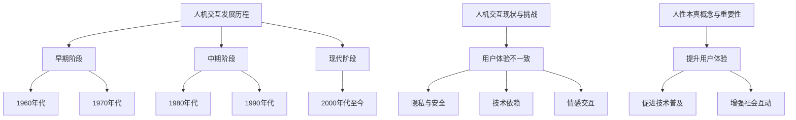
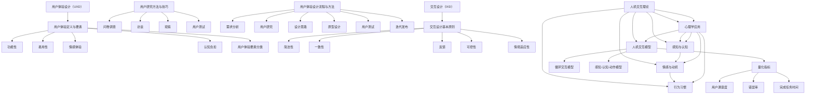
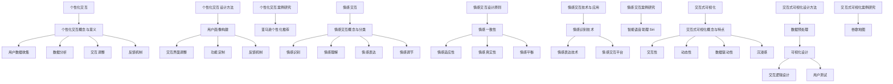
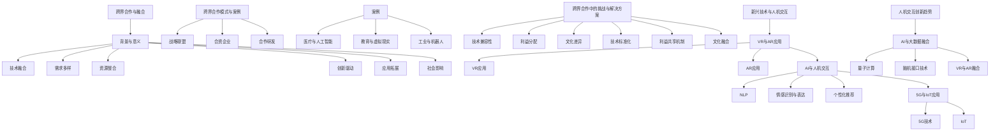
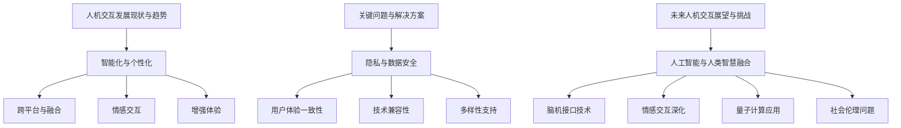

```mermaid
graph TD
    A[语音交互技术] --> B[语音交互原理与流程]
    B --> C[声音采集]
    B --> D[语音识别]
    B --> E[NLP处理]
    B --> F[语音合成]
    G[语音识别技术] --> H[语音多样性]
    H --> I[背景噪声]
    H --> J[多语言处理]
    K[语音交互挑战与解决方案] --> L[准确性]
    L --> M[实时性]
    L --> N[多语言支持]
    L --> O[隐私保护]
    K --> P[深度学习算法]
    K --> Q[多语言模型]
    K --> R[隐私保护机制]

    S[视觉交互技术] --> T[视觉交互原理与特点]
    T --> U[图像识别]
    T --> V[界面设计]
    T --> W[感知增强]
    X[视觉交互技术与应用] --> Y[虚拟现实]
    Y --> Z[增强现实]
    AA[视觉交互挑战与解决方案] --> BB[硬件性能]
    BB --> CC[算法优化]
    BB --> DD[用户体验设计]

    EE[生理信号交互技术] --> FF[生理信号交互概念与分类]
    FF --> GG[心电交互]
    FF --> HH[脑电交互]
    FF --> II[肌电交互]
    JJ[生理信号交互设计方法] --> KK[信号检测与预处理]
    KK --> LL[信号分析]
    KK --> MM[交互设计]
    NN[生理信号交互挑战与解决方案] --> OO[信号噪声]
    NN --> PP[信号稳定性]
    NN --> QQ[用户体验]
    NN --> RR[无创或低创设计]
    NN --> SS[信号去噪技术]
    NN --> TT[鲁棒性算法]
```

```mermaid
graph TD
    A[隐私与数据安全] --> B[隐私保护伦理问题]
    B --> C[知情同意]
    B --> D[透明度]
    B --> E[数据最小化]
    B --> F[数据安全]
    G[数据安全挑战与解决方案] --> H[数据泄露]
    H --> I[数据滥用]
    H --> J[数据匿名化]
    G --> K[加密技术]
    G --> L[访问控制]
    G --> M[数据匿名化技术]
    G --> N[隐私政策]
    O[法律法规] --> P[GDPR]
    O --> Q[CCPA]
    O --> R[PIPL]

    S[平等与包容] --> T[包容性设计]
    T --> U[可访问性]
    T --> V[适应性]
    T --> W[多语言支持]
    X[促进平等人机交互] --> Y[多样性]
    X --> Z[用户参与]
    X --> AA[无障碍]
    BB[性别与年龄问题] --> CC[性别差异]
    BB --> DD[年龄差异]

    EE[人的价值和人的权利] --> FF[人的价值与权利概念]
    FF --> GG[尊重用户]
    FF --> HH[保护隐私]
    FF --> II[公正公平]
    JJ[人机交互影响人的权利] --> KK[隐私权]
    KK --> LL[知情权]
    KK --> MM[自主权]
    NN[伦理原则] --> OO[尊重原则]
    NN --> PP[公正原则]
    NN --> QQ[责任原则]
    NN --> RR[透明原则]
```
                 

### 第1章 引言

在人机交互技术不断发展的今天，如何保持人性本真成为了一个重要而复杂的问题。本章将引出这一主题，通过回顾人机交互的发展历程、分析现状与挑战，以及阐述人性本真的概念与重要性，为后续章节的讨论奠定基础。

### 1.1 人机交互的发展历程

人机交互（Human-Computer Interaction，简称HCI）是一门研究人与计算机之间交互的设计、理论和技术的交叉学科。它起源于20世纪60年代，随着计算机技术的飞速发展，人机交互逐渐从单一的输入输出设备发展到多层次、多感官的综合交互系统。

**早期阶段：**

- **1960年代**：计算机主要作为科学研究的工具，人机交互主要是通过键盘和显示器进行文本交互。这一时期，界面设计简单，用户体验较差。

- **1970年代**：图形用户界面（GUI）的出现，使得计算机操作变得更加直观。鼠标、窗口、图标等元素成为主流，交互设计开始注重用户体验。

**中期阶段：**

- **1980年代**：随着个人计算机的普及，人机交互技术进一步发展，触摸屏、语音识别等新技术开始应用于实际场景。

- **1990年代**：互联网的兴起使得远程交互成为可能，Web界面和浏览器成为人机交互的主要形式。

**现代阶段：**

- **2000年代至今**：移动设备、智能手机、虚拟现实（VR）、增强现实（AR）等新技术的出现，为人机交互带来了更多可能性。智能助理、语音交互、手势控制等交互方式越来越普及。

### 1.2 人机交互的现状与挑战

当前，人机交互技术已广泛应用于各个领域，从日常生活中的电子邮件、社交媒体，到复杂的工业控制系统、医疗设备，都体现了人机交互的重要性。然而，随着技术的进步，人机交互也面临着一系列挑战：

**用户体验不一致：**

- 不同平台、设备之间的交互体验差异较大，用户需要在多个系统中适应不同的交互方式。

**隐私与安全：**

- 随着大数据和人工智能的发展，用户隐私保护成为重要问题。如何平衡隐私保护和用户体验是一个持续的挑战。

**技术依赖：**

- 人们对智能设备的依赖性越来越强，如何确保技术不会取代人与人之间的真实互动，也是一个值得关注的问题。

**情感交互：**

- 人类在交流过程中不仅仅是信息的传递，还包括情感、态度等方面的交流。如何设计出能够理解并回应人类情感的人机交互系统，是一个亟待解决的问题。

### 1.3 人性本真的概念与重要性

人性本真是指人类在自然状态下所具有的特质和本能，包括情感、理智、创造力等。在人机交互中保持人性本真，意味着在设计交互系统时，要尊重人类的这些自然特质，使得人机交互不仅仅是高效的信息传递，更是情感的交流与互动。

**保持人性本真的重要性：**

- **提升用户体验：** 人性化设计可以提升用户的满意度，使得交互过程更加自然、流畅。

- **促进技术普及：** 当人机交互系统能够更好地适应人类的习惯和需求，人们更愿意接受和使用新技术。

- **增强社会互动：** 通过人性化的设计，人机交互可以成为人与人之间沟通的桥梁，促进社会互动。

综上所述，人机交互的发展历程、现状与挑战为我们提供了一个广阔的背景，而人性本真的概念则为人机交互设计提供了重要的指导原则。在接下来的章节中，我们将深入探讨人机交互的核心概念、设计方法以及面临的种种挑战。希望通过对这些内容的分析，能够为人机交互领域的研究与实践提供有益的参考。

---

**Mermaid 流程图：**



---

### 第2章 人机交互的核心概念

在人机交互领域中，理解并掌握核心概念是设计出人性化交互系统的基础。本章将详细探讨人机交互的核心概念，包括用户体验设计（UXD）、交互设计（IXD）以及人机交互理论。通过这些概念，我们将建立起对人性本真在人机交互中保持的重要性的基础理解。

### 2.1 用户体验设计（UXD）

用户体验设计（User Experience Design，简称UXD）是设计学科的一个重要分支，旨在优化用户在使用产品或服务时的整体感受和体验。用户体验不仅包括功能性、易用性，还涵盖了用户在操作过程中的情感体验、认知负担等因素。

#### 2.1.1 用户体验的定义与要素

用户体验（User Experience，简称UX）可以从多个维度来理解：

- **功能性**：系统能否满足用户的基本需求，如信息的准确获取、任务的顺利完成。
- **易用性**：用户在使用系统时是否感到简便、直观，操作过程中是否遇到不必要的困难。
- **情感体验**：用户在交互过程中的情感状态，如愉悦、焦虑、满意等。
- **认知负担**：用户在操作系统时所需的认知资源，包括注意力、记忆等。

用户体验的要素可以分为以下几类：

- **功能性要素**：包括系统的目标设定、功能实现、错误处理等。
- **可用性要素**：涉及用户界面的设计、交互流程的设计等。
- **情感要素**：包括视觉设计、声音设计、情感反应等。
- **社会要素**：涉及用户在系统中的社交互动、协作体验等。

#### 2.1.2 用户研究的方法与技巧

为了设计出符合用户体验的产品，用户研究是至关重要的一环。以下是一些常用的用户研究方法与技巧：

- **问卷调查**：通过设计问卷，收集用户对产品或服务的看法和反馈。
- **访谈**：通过面对面的访谈，深入了解用户的需求、行为和体验。
- **观察**：通过观察用户在真实环境中的操作行为，发现潜在的问题和改进点。
- **用户测试**：邀请用户实际使用产品或服务，并记录其操作过程和反馈。
- **可用性测试**：通过模拟真实使用场景，评估产品的易用性和功能性。

#### 2.1.3 用户体验设计的流程与方法

用户体验设计的流程通常包括以下步骤：

1. **需求分析**：确定目标用户群体，明确设计目标和需求。
2. **用户研究**：通过调研方法了解用户的需求和行为模式。
3. **设计思路**：基于用户研究结果，提出设计方案和交互模型。
4. **原型设计**：制作产品原型，包括界面设计、交互逻辑等。
5. **用户测试**：通过用户测试，收集用户反馈并进行迭代优化。
6. **迭代发布**：根据用户反馈，进行多次迭代优化，最终发布产品。

用户体验设计的核心方法是“以人为本”，通过持续的用户研究和迭代优化，不断提升产品的用户体验。以下是一个简化版的设计流程图：

```
需求分析 --> 用户研究 --> 设计思路 --> 原型设计 --> 用户测试 --> 迭代发布
```

### 2.2 交互设计（IXD）

交互设计（Interaction Design，简称IXD）关注的是用户与产品之间的互动过程，它不仅包括界面设计，还涵盖了交互逻辑、用户体验等方面。交互设计的目的是使产品在使用过程中更加自然、高效、愉悦。

#### 2.2.1 交互设计的基本原则

交互设计应遵循以下基本原则：

- **简洁性**：界面设计应尽量简洁，避免不必要的复杂性。
- **一致性**：不同页面或功能之间的操作逻辑应保持一致，以减少用户的学习成本。
- **反馈**：及时给予用户反馈，让用户知道他们的操作是否成功。
- **可控性**：用户应能够轻松地撤销或重做操作，确保他们有控制权。
- **情境适应性**：设计应考虑不同用户在不同情境下的需求，提供灵活的交互方式。

#### 2.2.2 交互设计工具与资源

在进行交互设计时，可以使用以下工具和资源：

- **Sketch、Adobe XD**：用于界面设计的软件工具。
- **Axure、Figma**：用于原型设计和交互设计的工具。
- **用户测试工具**：如Optimizely、UserTesting等，用于收集用户反馈和数据。
- **设计资源网站**：如UI Movement、Behance等，提供丰富的设计灵感和资源。

#### 2.2.3 交互设计案例研究

通过分析成功的交互设计案例，可以更好地理解交互设计的实践和方法。以下是一些经典的交互设计案例：

- **苹果iPhone**：iPhone的简洁界面和直观的交互逻辑使得用户能够快速上手，提升了用户体验。
- **Airbnb**：Airbnb通过地图导航、筛选功能等设计，使得用户能够轻松找到合适的住宿，提高了搜索效率。
- **亚马逊Prime Video**：亚马逊Prime Video的界面设计注重内容展示和播放控制，用户能够方便地浏览和观看视频。

### 2.3 人机交互理论

人机交互理论为交互设计提供了理论基础，主要包括心理学、认知科学和计算机科学等领域的知识。以下是人机交互理论的一些核心概念：

#### 2.3.1 心理学在交互设计中的应用

心理学在人机交互设计中的应用主要体现在以下几个方面：

- **感知与认知**：研究用户如何感知和解读界面元素，如颜色、形状、文字等。
- **情感与动机**：理解用户在交互过程中的情感变化和动机，以设计出更能激发用户情感和动机的界面。
- **行为习惯**：研究用户在长期使用中的行为模式，以优化交互流程。

#### 2.3.2 人机交互模型

人机交互模型是用来描述人和计算机之间交互过程的模型，常见的有：

- **循环交互模型**：描述了用户和计算机之间的循环交互过程，包括感知、思考、动作、反馈等阶段。
- **感知-认知-动作模型**：强调用户在交互过程中的感知、认知和动作三个环节。

#### 2.3.3 人机交互的量化指标

人机交互的量化指标用于评估交互效果，常见的量化指标有：

- **用户满意度**：通过问卷调查或用户访谈来评估用户对产品的满意度。
- **错误率**：统计用户在操作过程中犯错的频率。
- **完成任务时间**：测量用户完成任务所需的时间。

通过以上对人机交互核心概念的详细讨论，我们为理解如何保持人性本真提供了理论基础。在接下来的章节中，我们将进一步探讨如何通过人性化设计来提升人机交互的质量和效果。

---

**Mermaid 流程图：**



---

### 第3章 人性化人机交互设计

在人机交互领域，人性化设计已经成为提升用户体验、增强系统亲和力的重要手段。本章将重点探讨个性化交互、情感交互和交互式可视化等人性化设计方法，通过具体案例研究来展示这些方法在实际应用中的效果。

#### 3.1 个性化交互

个性化交互（Personalized Interaction）是一种根据用户的特点、偏好和需求来调整交互系统的方法。通过个性化交互，系统能够更好地满足用户的个别需求，提高用户满意度。

**3.1.1 个性化交互的概念与意义**

个性化交互的概念基于用户数据分析和机器学习技术，通过以下方式实现：

- **用户数据收集**：收集用户的偏好、行为等数据。
- **数据分析**：使用数据挖掘和机器学习算法，分析用户的特征和需求。
- **交互调整**：根据分析结果，调整交互界面和功能，使其更加符合用户的习惯。

个性化交互的意义在于：

- **提升用户体验**：个性化交互可以减少用户在学习系统时所需的努力，提高操作效率。
- **增强用户忠诚度**：个性化的服务可以增强用户对产品的认可和依赖，提高用户忠诚度。
- **增加商业价值**：通过个性化推荐，可以提供更精准的广告和服务，提高转化率和用户满意度。

**3.1.2 个性化交互的设计方法**

个性化交互的设计方法主要包括以下步骤：

1. **用户画像构建**：通过数据分析构建用户画像，包括用户的基本信息、行为习惯、偏好等。
2. **交互界面调整**：根据用户画像，调整界面布局、颜色、字体等，使其更加符合用户的偏好。
3. **功能定制**：根据用户需求，提供定制化的功能，如快捷方式、自定义设置等。
4. **反馈机制**：建立用户反馈机制，收集用户对个性化服务的评价，进行持续优化。

**3.1.3 个性化交互案例研究**

以下是一个个性化交互的案例研究：

**案例：亚马逊个性化推荐**

亚马逊通过个性化推荐系统，为用户推荐可能的购买物品。这个系统的实现步骤包括：

1. **用户数据分析**：收集用户的历史购买记录、搜索行为等数据。
2. **推荐算法**：使用协同过滤算法，分析用户的相似行为，推荐相似的物品。
3. **个性化调整**：根据用户偏好，调整推荐列表的排序，使其更加符合用户的兴趣。
4. **用户反馈**：收集用户对推荐物品的评价，不断优化推荐算法。

通过这个案例，我们可以看到个性化交互在提升用户满意度、增加销售额方面的显著效果。

#### 3.2 情感交互

情感交互（Emotional Interaction）是一种在人机交互中融入情感元素的设计方法。通过情感交互，系统能够更好地模拟人类的情感交流，提升用户的情感体验。

**3.2.1 情感交互的概念与分类**

情感交互的概念基于情感计算（Affective Computing）领域的研究，主要关注系统如何识别、理解、表达和处理情感。情感交互可以分类为：

- **情感识别**：系统通过视觉、语音、生理信号等手段识别用户的情感状态。
- **情感理解**：系统分析情感信号，理解用户的情感意图和需求。
- **情感表达**：系统通过语音、动作、表情等方式表达情感，与用户进行情感交流。
- **情感调节**：系统根据用户的情感状态，提供相应的调节策略，如放松、激励等。

**3.2.2 情感交互的设计原则**

情感交互的设计应遵循以下原则：

- **情感一致性**：系统的情感反应应与其功能和行为保持一致，避免出现情感冲突。
- **情感适应性**：系统应能够适应不同的用户和情境，提供个性化的情感交互。
- **情感真实性**：系统的情感表达应尽量真实，以提高用户的信任感和共鸣。
- **情感平衡**：系统应在情感表达中保持平衡，避免过于夸张或过于冷漠。

**3.2.3 情感交互技术与应用**

情感交互技术主要包括：

- **情感识别技术**：使用机器学习、深度学习等方法，从用户的语音、文字、表情、生理信号等数据中识别情感。
- **情感表达技术**：使用语音合成、动画、视频等技术，模拟人类的情感表达。
- **情感交互平台**：构建集成情感识别、理解和表达功能的交互平台，实现全方位的情感交互。

以下是一个情感交互的案例研究：

**案例：智能语音助理 Siri**

苹果公司的智能语音助理 Siri 通过情感识别和表达技术，实现了与用户的情感交流。Siri 能够识别用户的情感状态，如愉悦、愤怒、悲伤等，并相应地调整其语音语调和回答方式，以更好地满足用户的需求。例如，当用户表达愤怒时，Siri 会使用较为冷静和理性的回答，试图缓解用户的情绪。

#### 3.3 交互式可视化

交互式可视化（Interactive Visualization）是一种通过用户与视觉数据的互动来理解和分析信息的交互设计方法。通过交互式可视化，用户可以更直观、更深入地理解复杂的数据和信息。

**3.3.1 交互式可视化的概念与特点**

交互式可视化的概念基于数据可视化（Data Visualization）和交互设计（Interaction Design），其主要特点包括：

- **交互性**：用户可以通过鼠标、触摸屏等设备与可视化界面进行互动。
- **动态性**：可视化界面可以根据用户的操作动态地更新和调整。
- **数据驱动性**：可视化结果基于用户提供的数据，能够实时反映数据的变化。
- **沉浸感**：通过动态效果和交互性，用户可以沉浸在数据的分析过程中。

**3.3.2 交互式可视化设计的方法**

交互式可视化设计的方法主要包括以下步骤：

1. **数据预处理**：对原始数据进行清洗、转换和整理，使其适合可视化。
2. **可视化设计**：选择合适的可视化图表和元素，设计交互界面。
3. **交互逻辑设计**：设计用户与可视化界面之间的交互逻辑，包括交互元素、交互方式和交互效果。
4. **用户测试**：通过用户测试，评估可视化设计的效果和用户满意度，进行迭代优化。

**3.3.3 交互式可视化案例研究**

以下是一个交互式可视化的案例研究：

**案例：谷歌地图**

谷歌地图通过交互式可视化技术，为用户提供了一个直观、易用的地图浏览和分析工具。用户可以通过缩放、拖动、点击等交互操作，查看不同区域的地形、交通、天气等信息。例如，用户可以点击某个地点，查看该地点的详细信息，如餐厅评价、景点介绍等。这种交互式可视化设计不仅提高了用户的使用效率，还增强了用户的沉浸感和体验。

通过本章对个性化交互、情感交互和交互式可视化的讨论，我们可以看到人性化设计在提升人机交互质量方面的重要性。在接下来的章节中，我们将进一步探讨人机交互中的技术挑战，以及如何解决这些挑战，以实现更加人性化的交互系统。

---

**Mermaid 流程图：**



---

### 第4章 人机交互中的技术挑战

在人机交互领域，尽管技术取得了显著进步，但仍然面临着一系列技术挑战。这些挑战不仅影响了人机交互的质量和效率，还涉及到隐私、安全、多样性和公平性等多个方面。本章将详细探讨人机交互中的几个关键技术挑战，并分析可能的解决方案。

#### 4.1 语音交互技术

语音交互技术作为人机交互的重要形式之一，已经在智能家居、智能助理等领域得到广泛应用。然而，语音交互技术仍面临诸多挑战。

**4.1.1 语音交互的原理与流程**

语音交互技术的基本原理包括语音识别（Speech Recognition）、自然语言处理（Natural Language Processing, NLP）和语音合成（Text-to-Speech, TTS）。其基本流程如下：

1. **声音采集**：通过麦克风等设备采集用户的语音信号。
2. **语音识别**：将语音信号转换为文本，常见的语音识别算法包括隐马尔可夫模型（HMM）、深度神经网络（DNN）等。
3. **自然语言处理**：对转换后的文本进行分析，理解用户的意图和命令，常见的NLP算法包括词性标注、句法分析等。
4. **语音合成**：根据用户的意图生成相应的语音回应。

**4.1.2 语音识别技术**

语音识别技术是人机交互的核心环节，其准确性和速度直接影响到用户体验。语音识别技术面临的挑战包括：

- **语音多样性**：不同地区、不同口音、不同语速的语音识别。
- **背景噪声**：在嘈杂环境中语音识别的准确性下降。
- **多语言处理**：支持多种语言和多语种的语音识别。

**4.1.3 语音交互的挑战与解决方案**

语音交互面临的挑战主要包括以下几方面：

- **准确性**：提高语音识别的准确性是关键，可以通过增加训练数据、使用深度学习算法等方法来提升。
- **实时性**：确保语音交互的实时响应，需要优化算法和硬件设备。
- **多语言支持**：开发跨语言模型和多语言适配技术，以支持更多语言。
- **隐私保护**：语音交互涉及用户隐私信息，需要确保语音数据的加密和匿名化处理。

解决方案包括：

- **深度学习算法**：使用深度学习算法，如卷积神经网络（CNN）、循环神经网络（RNN）等，提高语音识别的准确性和实时性。
- **多语言模型**：开发多语言语音识别模型，支持多种语言和口音。
- **隐私保护机制**：在数据收集、存储和处理过程中，采用加密和匿名化技术，保护用户隐私。

#### 4.2 视觉交互技术

视觉交互技术通过视觉媒介实现人与计算机之间的交互，广泛应用于虚拟现实（VR）和增强现实（AR）等领域。然而，视觉交互技术也面临诸多挑战。

**4.2.1 视觉交互的原理与特点**

视觉交互技术的基本原理包括：

- **图像识别**：使用计算机视觉算法，如卷积神经网络（CNN）、深度学习等，识别和解析图像内容。
- **界面设计**：设计直观、易用的视觉界面，使用户能够通过视觉反馈进行交互。
- **感知增强**：通过增强现实技术，将虚拟信息叠加到真实环境中，提供更丰富的交互体验。

视觉交互的特点包括：

- **沉浸感**：用户可以沉浸在虚拟或增强的现实环境中，与虚拟对象进行互动。
- **直观性**：通过视觉媒介，用户可以直观地理解交互结果，操作更简单。
- **灵活性**：支持多种交互方式，如手势、语音、文字等。

**4.2.2 视觉交互技术与应用**

视觉交互技术的主要应用包括：

- **虚拟现实（VR）**：通过头戴显示器（HMD）等设备，用户可以进入一个虚拟的世界，进行沉浸式体验。
- **增强现实（AR）**：通过增强现实设备，如智能手机或头戴显示器，将虚拟信息叠加到真实环境中，提供交互式体验。

视觉交互技术面临的挑战主要包括：

- **硬件限制**：高质量的视觉交互需要高性能的硬件支持，但目前硬件设备的价格较高。
- **准确性**：计算机视觉算法的准确性和实时性仍需提升，以满足复杂的交互需求。
- **用户体验**：如何设计出更加自然、直观的交互界面，提高用户体验，是视觉交互技术的重要挑战。

**4.2.3 视觉交互的挑战与解决方案**

视觉交互面临的挑战及其解决方案包括：

- **硬件性能提升**：通过技术创新，如增强计算能力、优化图形渲染等，提高硬件性能。
- **算法优化**：使用深度学习和计算机视觉技术，提升图像识别和处理能力。
- **用户体验设计**：通过用户研究和迭代优化，设计出更加直观、易用的交互界面。

#### 4.3 生理信号交互技术

生理信号交互技术通过捕捉和分析用户的生理信号，实现人与计算机之间的交互。这种技术广泛应用于医疗保健、人机辅助等领域，但同样面临技术挑战。

**4.3.1 生理信号交互的概念与分类**

生理信号交互技术基于生理信号检测和分析，常见的生理信号包括心电信号（ECG）、脑电信号（EEG）、肌电信号（EMG）等。生理信号交互技术可以分类为：

- **心电交互**：通过捕捉心电信号，实现与计算机的交互。
- **脑电交互**：通过捕捉脑电信号，实现与计算机的交互。
- **肌电交互**：通过捕捉肌电信号，实现与计算机的交互。

**4.3.2 生理信号交互的设计方法**

生理信号交互的设计方法主要包括：

1. **信号检测与预处理**：使用传感器和信号处理算法，检测和预处理生理信号。
2. **信号分析**：使用机器学习和信号处理技术，分析生理信号，提取特征。
3. **交互设计**：设计基于生理信号的交互界面和交互逻辑。

**4.3.3 生理信号交互的挑战与解决方案**

生理信号交互技术面临的挑战主要包括：

- **信号噪声**：生理信号中常含有噪声，需要有效的信号去噪和处理方法。
- **信号稳定性**：生理信号的稳定性受多种因素影响，需要开发鲁棒性强的信号分析算法。
- **用户体验**：如何设计出对用户无侵入或低侵入性的生理信号交互设备，是用户体验的重要考虑因素。

解决方案包括：

- **信号去噪技术**：使用滤波、放大等信号处理技术，去除噪声，提高信号质量。
- **鲁棒性算法**：开发鲁棒性强的机器学习和信号处理算法，提高信号分析的准确性。
- **无创或低创设计**：设计无创或低创的生理信号交互设备，减少用户的不适感。

通过本章对语音交互技术、视觉交互技术和生理信号交互技术的讨论，我们可以看到人机交互领域面临的多个技术挑战。在解决这些挑战的过程中，需要结合多学科的知识和技术，不断探索和创新。只有这样，才能实现更加人性化、高效和安全的交互系统。

---

**Mermaid 流程图：**



---

### 第5章 人机交互中的伦理与社会问题

随着人机交互技术的不断进步和应用，伦理和社会问题也逐渐成为关注的焦点。本章将深入探讨人机交互中的隐私与数据安全、平等与包容、人的价值和人的权利等问题，并分析相应的挑战与解决方案。

#### 5.1 隐私与数据安全

隐私与数据安全是人机交互中最为重要和敏感的问题之一。随着大数据和人工智能技术的广泛应用，用户数据的安全性和隐私保护变得尤为重要。

**5.1.1 隐私保护的伦理问题**

隐私保护涉及的伦理问题主要包括：

- **知情同意**：用户在提供个人信息时，应明确知晓其数据将被如何使用，并同意使用。
- **透明度**：数据处理过程应保持透明，用户应能够了解其数据如何被收集、存储、处理和共享。
- **数据最小化**：只收集和处理与特定目的直接相关的最少数据，避免过度收集。
- **数据安全**：采取有效的安全措施，防止数据泄露、篡改和滥用。

**5.1.2 数据安全的挑战与解决方案**

数据安全面临的挑战包括：

- **数据泄露**：未经授权的访问和数据泄露是数据安全的主要威胁。
- **数据滥用**：不当使用用户数据，如进行恶意营销、歧视等。
- **数据匿名化**：在数据处理过程中，如何确保数据匿名化，避免个人信息被重新识别。

解决方案包括：

- **加密技术**：使用强加密技术，保护用户数据的机密性。
- **访问控制**：实施严格的访问控制策略，确保只有授权人员能够访问敏感数据。
- **数据匿名化**：采用数据匿名化技术，如数据扰动、差分隐私等，降低数据泄露的风险。
- **隐私政策**：制定清晰的隐私政策，告知用户数据收集、使用和保护的流程。

**5.1.3 隐私与数据安全的法律法规**

为了应对隐私与数据安全的挑战，各国相继出台了相关法律法规，如：

- **欧盟通用数据保护条例（GDPR）**：规定了数据保护的基本原则和用户权利，对数据处理的合规性有严格要求。
- **美国加州消费者隐私法（CCPA）**：赋予用户对其个人数据的更多控制权，包括知情权、访问权、删除权等。
- **中国个人信息保护法（PIPL）**：对个人信息保护进行了全面规定，明确了个人信息的处理原则和用户权益。

#### 5.2 平等与包容

人机交互技术应确保所有人，无论年龄、性别、身体条件等，都能平等地获得和利用技术服务。平等与包容是人机交互设计的重要原则。

**5.2.1 人机交互中的包容性设计**

包容性设计（Inclusive Design）旨在确保所有用户，包括残障人士、老年人、儿童等，都能无障碍地使用产品和服务。包容性设计的要点包括：

- **可访问性**：确保产品和服务对所有人都是可访问的，包括视觉、听觉、行动障碍人士。
- **适应性**：产品应能够适应不同用户的需求，提供灵活的配置选项。
- **多语言支持**：支持多种语言，确保不同语言背景的用户都能使用产品。

**5.2.2 促进平等的人机交互**

为了促进平等的人机交互，设计者应考虑以下因素：

- **多样性**：在产品设计过程中，考虑多样化的用户群体，确保产品适用于各种人群。
- **用户参与**：邀请多样化的用户参与设计过程，收集不同用户的反馈，优化产品设计。
- **无障碍**：设计无障碍的用户界面，确保残障人士能够轻松使用产品。

**5.2.3 人机交互中的性别与年龄问题**

性别与年龄问题在人机交互中具有重要意义。不同性别和年龄的用户在使用产品时可能存在差异，设计者应关注：

- **性别差异**：在界面设计和功能设置上，考虑性别差异，提供符合不同性别用户需求的选项。
- **年龄差异**：在界面设计和交互逻辑上，考虑不同年龄段用户的能力和认知水平，提供易于理解的选项。

#### 5.3 人的价值和人的权利

人机交互技术不仅影响用户体验，还涉及到人的价值和人的权利。确保人的价值和人的权利在人机交互中得到尊重和保障是设计者应承担的责任。

**5.3.1 人的价值和人的权利的概念**

人的价值是指人的尊严、自由、平等和独立等基本属性，人的权利是指人在社会生活中享有的各种合法权利。

**5.3.2 人机交互中的人的价值维护**

人机交互中的人的价值维护包括：

- **尊重用户**：尊重用户的独立性和自主性，确保用户在使用过程中拥有控制权。
- **保护隐私**：保护用户的个人隐私，防止个人信息被滥用。
- **公正公平**：确保所有用户在交互过程中受到公正对待，避免歧视和偏见。

**5.3.3 人机交互对人的权利的影响**

人机交互技术可能对人的权利产生以下影响：

- **隐私权**：人机交互技术可能涉及用户隐私信息的收集和利用，需要确保隐私权的保护。
- **知情权**：用户应有权了解其数据如何被使用，确保知情权得到尊重。
- **自主权**：用户应能够在交互过程中自主决定和选择，不受技术限制。

**5.3.4 人机交互中的伦理原则**

为了确保人机交互中的伦理原则得到遵循，设计者应遵循以下伦理原则：

- **尊重原则**：尊重用户的基本权利和尊严。
- **公正原则**：确保公平对待所有用户，避免歧视和偏见。
- **责任原则**：对用户数据安全和个人隐私负有责任，确保数据安全和隐私保护。
- **透明原则**：确保数据处理过程透明，用户能够了解其数据的使用情况。

通过本章对隐私与数据安全、平等与包容、人的价值和人的权利等伦理和社会问题的讨论，我们可以看到人机交互技术不仅需要追求技术上的进步，更需要关注社会伦理和人的权利。在未来的发展中，人机交互技术应以人为本，确保技术的应用能够真正造福人类。

---

**Mermaid 流程图：**



---

### 第6章 人机交互中的创新实践

在人机交互领域，创新实践不断推动技术进步和用户体验的提升。本章将探讨跨界合作与融合、新兴技术与人机交互、以及人机交互的创新趋势。通过这些实践，我们能够更好地理解如何利用先进技术实现更加人性化和高效的人机交互。

#### 6.1 跨界合作与融合

跨界合作与融合是指不同领域之间的技术、知识和资源的整合，以实现更广泛的应用和更深远的影响。这种合作模式在推动人机交互技术的发展中扮演着关键角色。

**6.1.1 跨界合作的背景与意义**

跨界合作的背景主要体现在以下几个方面：

- **技术融合**：随着信息技术的飞速发展，各种技术之间的界限日益模糊，跨界合作成为技术进步的必然趋势。
- **需求多样**：用户需求多样化，单一领域的技术难以满足复杂的需求，跨界合作能够提供更全面和个性化的解决方案。
- **资源整合**：通过跨界合作，不同领域的企业和组织能够共享资源，提高研发效率，降低成本。

跨界合作的意义包括：

- **创新驱动**：跨界合作促进了技术创新，推动了人机交互技术的发展。
- **应用拓展**：跨界合作使人机交互技术能够应用于更多领域，如医疗、教育、工业等。
- **社会影响**：跨界合作有助于解决社会问题，提高生活质量，促进社会进步。

**6.1.2 跨界合作的模式与案例**

跨界合作的模式主要包括：

- **战略联盟**：不同领域的企业或机构通过签订合作协议，共同研发新产品或服务。
- **合资企业**：不同领域的企业共同出资，成立合资企业，共同开发和推广产品。
- **合作研发**：企业或研究机构之间建立研发合作关系，共同承担研发任务。

以下是一些跨界合作的案例：

- **医疗与人工智能**：医疗领域与人工智能技术相结合，开发智能诊断系统、个性化治疗方案等，提高医疗服务的质量和效率。
- **教育与虚拟现实**：教育领域与虚拟现实技术相结合，创建虚拟课堂、虚拟实验室等，提供更加丰富和互动的教学体验。
- **工业与机器人**：工业领域与机器人技术相结合，开发自动化生产线、智能工厂等，提高生产效率和产品质量。

**6.1.3 跨界合作中的挑战与解决方案**

跨界合作面临的挑战主要包括：

- **技术兼容性**：不同领域的技术可能存在兼容性问题，需要开发跨平台的技术解决方案。
- **利益分配**：跨界合作中的利益分配问题，需要建立公平合理的利益分配机制。
- **文化差异**：不同领域的企业或机构可能有不同的文化背景，需要加强沟通和协调。

解决方案包括：

- **技术标准化**：制定统一的技术标准，确保不同技术之间的兼容性。
- **利益共享机制**：建立利益共享机制，确保各方在合作中获得合理的利益。
- **文化融合**：加强跨领域的文化交流与沟通，增进相互理解，提高合作效率。

#### 6.2 新兴技术与人机交互

新兴技术的不断涌现为人机交互带来了新的可能性和机会。以下是一些重要新兴技术及其在人机交互中的应用：

**6.2.1 虚拟现实（VR）与增强现实（AR）在人机交互中的应用**

虚拟现实（VR）和增强现实（AR）技术为人机交互提供了全新的交互体验。

- **VR应用**：VR技术通过创建虚拟环境，用户可以沉浸在虚拟世界中，进行探索、学习和娱乐。在医疗、教育、游戏等领域，VR技术提供了沉浸式体验，提高了用户体验。
- **AR应用**：AR技术通过将虚拟信息叠加到现实环境中，提供了增强现实体验。在零售、维修、教育等领域，AR技术帮助用户更好地理解和操作现实世界中的物品。

**6.2.2 人工智能（AI）与人机交互**

人工智能（AI）技术在人机交互中的应用正在不断扩展，为交互系统提供了智能化的解决方案。

- **自然语言处理（NLP）**：通过自然语言处理技术，交互系统可以理解用户的自然语言输入，实现语音识别和语音合成，提供更加自然和流畅的交互体验。
- **情感识别与表达**：AI技术可以分析用户的语音、文字和行为，识别用户的情感状态，并根据用户情感进行智能响应，提供更加贴心的交互体验。
- **个性化推荐**：通过机器学习算法，AI技术可以根据用户的历史行为和偏好，提供个性化的推荐和服务，提高用户的满意度和忠诚度。

**6.2.3 5G与物联网（IoT）与人机交互**

5G和物联网（IoT）技术的快速发展为人机交互带来了新的机遇。

- **5G技术**：5G技术提供了高速、低延迟的网络连接，使得远程交互和实时交互成为可能。在智能交通、智慧城市等领域，5G技术提高了人机交互的效率和响应速度。
- **物联网（IoT）**：物联网技术将各种设备和传感器连接起来，实现设备间的智能交互和协同工作。在智能家居、工业物联网等领域，物联网技术提高了人机交互的智能化和自动化水平。

#### 6.3 人机交互的创新趋势

随着技术的不断进步和应用，人机交互领域呈现出一些明显的创新趋势。

**6.3.1 人工智能与大数据的融合**

人工智能与大数据的融合将推动人机交互向更加智能化和个性化方向发展。通过分析大量用户数据，交互系统可以更好地理解用户的需求和行为，提供个性化的交互体验。

**6.3.2 量子计算与人机交互**

量子计算技术具有巨大的计算潜力，未来可能在人机交互领域发挥重要作用。量子计算可以帮助交互系统处理更复杂的计算任务，提高交互的效率和智能水平。

**6.3.3 脑机接口技术**

脑机接口技术（Brain-Computer Interface, BCI）通过直接连接大脑和计算机，实现思维控制的交互方式。未来，脑机接口技术可能为人机交互带来全新的交互模式和体验。

**6.3.4 虚拟现实与增强现实的融合**

随着虚拟现实（VR）和增强现实（AR）技术的不断发展，未来可能会出现更加融合的虚拟现实体验。通过融合VR和AR技术，用户可以同时体验到虚拟世界和现实世界的结合，实现更加丰富的交互体验。

通过本章对跨界合作、新兴技术以及人机交互创新趋势的讨论，我们可以看到人机交互领域充满机遇和挑战。未来，随着技术的不断进步和应用，人机交互将变得更加智能化、个性化和人性化，为用户提供更加优质和高效的交互体验。

---

**Mermaid 流程图：**



---

### 第7章 总结与展望

在人机交互技术不断发展的今天，如何保持人性本真成为了一个至关重要的问题。本章将总结人机交互的发展现状与趋势，分析关键问题与解决方案，并对未来人机交互的展望与挑战进行探讨。

#### 7.1 人机交互的发展现状与趋势

人机交互技术经历了从简单的键盘和显示器交互到复杂的语音、手势、情感交互的转变。目前，人机交互技术已经广泛应用于智能家居、智能助理、虚拟现实、增强现实等领域，展现出以下几个显著趋势：

1. **智能化与个性化**：随着人工智能和大数据技术的发展，人机交互系统越来越智能化，能够根据用户行为和偏好提供个性化的服务。
2. **跨平台与融合**：不同技术之间的融合，如5G与物联网（IoT）、虚拟现实（VR）与增强现实（AR）等，使得人机交互应用场景更加丰富。
3. **情感交互**：情感交互技术的发展，使得人机交互不仅仅是信息的传递，还包括情感的交流与互动，提升了用户体验。
4. **增强体验**：通过交互式可视化、虚拟现实和增强现实等技术，用户可以获得更加沉浸式的交互体验。

#### 7.2 人机交互中的关键问题与解决方案

在人机交互技术的发展过程中，仍然存在一些关键问题，需要我们深入研究和解决：

1. **隐私与数据安全**：随着数据的广泛应用，隐私保护成为关键挑战。解决方案包括数据加密、隐私政策制定、用户知情同意等。
2. **用户体验一致性**：不同平台和设备之间的用户体验差异较大，需要通过标准化和一致性设计来提升用户体验。
3. **技术兼容性**：跨界合作中的技术兼容性问题是另一个挑战，通过制定统一的技术标准和开发跨平台解决方案可以缓解这一问题。
4. **多样性支持**：确保人机交互系统能够支持不同性别、年龄、身体条件等多样化的用户需求，实现包容性设计。

#### 7.3 未来人机交互的展望与挑战

未来，人机交互技术将继续朝着更加智能化、个性化和人性化的方向发展。以下是对未来人机交互的一些展望与挑战：

1. **人工智能与人类智慧的融合**：通过人工智能技术，人机交互系统将更加智能，能够理解用户的意图和情感，提供更加个性化的服务。
2. **脑机接口技术**：脑机接口技术（BCI）将实现直接连接大脑和计算机，使得人机交互更加自然和高效。
3. **情感交互的深化**：情感交互技术将不断发展，使得人机交互不仅仅是信息的传递，更是情感的交流与共鸣。
4. **量子计算的应用**：量子计算技术的应用将极大地提升人机交互系统的计算能力和智能化水平。
5. **社会伦理问题**：随着人机交互技术的广泛应用，如何确保技术的伦理性和社会责任将成为重要议题。

总之，人机交互技术的发展不仅带来了巨大的机遇，也带来了诸多挑战。保持人性本真，以人为本，将是未来人机交互技术发展的关键。只有通过技术创新与社会责任的有机结合，我们才能实现更加人性化、高效和安全的交互系统。

---

**Mermaid 流程图：**



---

### 附录

#### 附录A：参考文献

1. Norman, D. A. (1986). *The Design of Everyday Things*. Basic Books.
2. Shneiderman, B. (2010). *Designing the User Interface: Strategies for Effective Human-Computer Interaction*. J. Ben jamin, Ltd.
3. Blythe, M. A., Gayo, I., & Macaulay, C. (2011). *Perspectives on Personalisation and Human-Computer Interaction*. Springer.
4. Dourish, P., & Hejl, D. (2013). *Understanding Interaction Design*. Morgan & Claypool Publishers.
5. Rodden, T., & Harper, R. S. (Eds.). (2013). *Human-Computer Interaction: Human Factors, Cognitive Psychology, and Design*. Taylor & Francis.

#### 附录B：常用工具与资源推荐

1. **用户体验设计工具**：
   - **Sketch**：适用于界面设计的强大工具。
   - **Adobe XD**：用于原型设计和交互设计的综合工具。
   - **Figma**：基于网页的协作设计工具。

2. **交互设计资源网站**：
   - **UI Movement**：提供丰富的设计灵感和资源。
   - **Behance**：展示专业设计师作品的平台。
   - **Awwwards**：评选优秀网站设计的平台。

3. **用户研究工具**：
   - **Optimizely**：用于A/B测试和用户体验优化的工具。
   - **UserTesting**：提供真实用户反馈的在线测试服务。

4. **数据可视化工具**：
   - **Tableau**：强大的数据可视化工具。
   - **D3.js**：用于创建交互式数据可视化的JavaScript库。

#### 附录C：人机交互案例库

1. **苹果iPhone**：经典的图形用户界面设计案例。
2. **谷歌地图**：交互式可视化应用的典范。
3. **亚马逊个性化推荐**：基于个性化交互的购物体验。
4. **微软小冰**：情感交互的智能助理。
5. **谷歌Glass**：增强现实设备的应用案例。

#### 附录D：人机交互术语表

1. **用户体验（UX）**：用户在使用产品或服务时的整体感受和体验。
2. **用户体验设计（UXD）**：优化用户在产品或服务使用过程中的体验的设计活动。
3. **交互设计（IXD）**：关注用户与产品或系统之间的交互过程和交互逻辑的设计。
4. **情感计算**：研究如何让计算机识别、理解、表达和模拟情感的技术。
5. **虚拟现实（VR）**：通过计算机模拟产生三维空间，用户在其中可以沉浸体验。
6. **增强现实（AR）**：在现实世界中叠加虚拟信息，提供增强的视觉体验。
7. **隐私保护**：确保用户数据安全、防止数据泄露的行为和措施。
8. **跨平台**：在不同平台（如Web、移动、桌面等）上都能运行的技术。
9. **包容性设计**：确保产品和服务能够被不同群体（包括残障人士、老年人等）无障碍使用的设计方法。

通过以上附录，希望读者能够更全面地了解人机交互的相关知识，并能够在实际应用中灵活运用所学到的技巧和方法。

