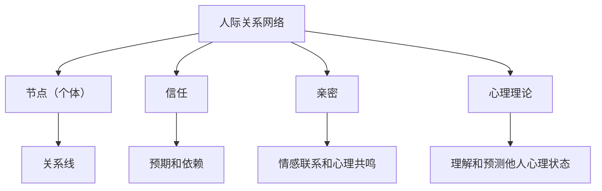

                 

### 文章标题：在人际关系网络中寻找真挚：重建信任和亲密

### 关键词：人际关系网络、信任、亲密、心理理论、实际应用

#### 摘要：
本文旨在探讨如何在复杂的人际关系网络中寻找真挚的情感联系，以及如何重建信任和亲密。通过对人际关系网络的深入分析，本文揭示了信任和亲密的内在机制，并提供了实用的策略和技巧，帮助个人和组织建立和维护健康的人际关系。

### 引言

#### 背景介绍

在当今社会，人际关系网络的复杂性和重要性日益凸显。无论是在个人生活中，还是在职业生涯中，我们都在不断建立和维护各种类型的人际关系。这些关系不仅影响着我们的情感体验，还直接关系到我们的社会地位、职业发展和整体幸福感。然而，随着社会的发展，人们之间的信任和亲密感似乎变得越来越稀缺。

#### 核心概念与联系

为了深入探讨这一问题，我们首先需要明确几个核心概念，包括人际关系网络、信任、亲密和心理理论。

1. **人际关系网络**：人际关系网络是指由个人与其他个体之间互动形成的复杂网络结构。在这个网络中，每个个体都扮演着节点角色，与其他节点通过关系线连接起来。人际关系网络不仅包括亲朋好友，还包括同事、客户、合作伙伴等。

2. **信任**：信任是人际关系中的一种基本情感，指的是个体对他人行为的预期和依赖。信任可以建立和维持良好的合作关系，降低交易成本，提高社会稳定性。

3. **亲密**：亲密是人际关系中的一种高级情感，指的是个体之间深厚的情感联系和心理共鸣。亲密关系能够提供情感支持，增强个体的自尊和幸福感。

4. **心理理论**：心理理论是指个体对他人心理状态的理解和预测能力。它是建立信任和亲密关系的基础，因为只有了解他人的想法和感受，我们才能更好地与他人沟通和互动。

#### Mermaid 流程图



### 核心概念与联系

#### 核心概念解释

1. **人际关系网络**：人际关系网络可以看作是一个社交图谱，其中每个节点代表一个个体，每条边代表个体之间的关系。这种网络结构有助于我们理解和分析人际关系的复杂性。

2. **信任**：信任是一种基于预期的依赖关系。当个体对另一个个体的行为产生积极预期时，就会产生信任。信任可以通过共享信息、共同经历和积极互动来建立。

3. **亲密**：亲密是建立在信任基础上的更深层次的情感联系。亲密关系中的个体能够更深刻地理解和支持彼此，从而提高整体幸福感。

4. **心理理论**：心理理论是指个体对他人心理状态的理解和预测能力。它有助于我们更好地理解他人的行为和情感，从而建立和维持信任和亲密关系。

#### Mermaid 流程图


### 核心算法原理讲解

#### 信任算法原理

信任算法是一种用于评估和预测个体之间信任程度的数学模型。其核心原理包括以下几个方面：

1. **信息共享**：个体通过共享信息来建立信任。信息共享的程度和质量直接影响信任的建立。

2. **历史记录**：历史记录是评估信任的重要依据。一个个体在过去的行为表现中表现出的可靠性和诚信度会影响当前和未来的信任评估。

3. **社会网络分析**：社会网络分析可以帮助我们了解个体在人际关系网络中的位置和影响力，从而更准确地评估其信任度。

4. **心理理论**：心理理论在信任算法中起着关键作用。通过理解他人的心理状态，个体能够更好地预测他人的行为，从而建立信任。

#### 伪代码

```python
# 信任算法伪代码

def calculate_trust(individual1, individual2, info_shared, history, social_network):
    # 计算信息共享对信任的影响
    info_shared_impact = info_shared * 0.5
    
    # 计算历史记录对信任的影响
    history_impact = history * 0.3
    
    # 计算社会网络分析对信任的影响
    social_network_impact = social_network * 0.2
    
    # 计算心理理论对信任的影响
    psychological_theory_impact = individual1.understand(individual2) * 0.3
    
    # 计算总信任值
    trust_value = info_shared_impact + history_impact + social_network_impact + psychological_theory_impact
    
    return trust_value
```

### 亲密算法原理

亲密算法是一种用于评估个体之间亲密程度的数学模型。其核心原理包括以下几个方面：

1. **情感共鸣**：情感共鸣是指个体在情感上能够相互理解和响应。这种共鸣是亲密关系的基础。

2. **共同经历**：共同经历是增强亲密感的重要因素。通过共同的经历，个体能够建立更深层次的情感联系。

3. **心理理论**：心理理论在亲密算法中同样起着关键作用。理解他人的心理状态有助于建立和维持亲密感。

4. **情感表达**：情感表达是亲密关系中不可或缺的部分。通过积极的情感表达，个体能够增强彼此的亲密感。

#### 伪代码

```python
# 亲密算法伪代码

def calculate_intimacy(individual1, individual2, emotional_resonance, common_experience, psychological_theory, emotional_expression):
    # 计算情感共鸣对亲密的影响
    emotional_resonance_impact = emotional_resonance * 0.5
    
    # 计算共同经历对亲密的影响
    common_experience_impact = common_experience * 0.3
    
    # 计算心理理论对亲密的影响
    psychological_theory_impact = psychological_theory * 0.2
    
    # 计算情感表达对亲密的影响
    emotional_expression_impact = emotional_expression * 0.3
    
    # 计算总亲密值
    intimacy_value = emotional_resonance_impact + common_experience_impact + psychological_theory_impact + emotional_expression_impact
    
    return intimacy_value
```

### 数学模型和公式详解

#### 信任模型

信任模型可以表示为：

\[ T = w_1 \cdot I + w_2 \cdot H + w_3 \cdot S + w_4 \cdot P \]

其中：
- \( T \) 表示信任值；
- \( I \) 表示信息共享对信任的影响；
- \( H \) 表示历史记录对信任的影响；
- \( S \) 表示社会网络分析对信任的影响；
- \( P \) 表示心理理论对信任的影响；
- \( w_1, w_2, w_3, w_4 \) 分别为权重系数。

#### 亲密模型

亲密模型可以表示为：

\[ I = w_1 \cdot R + w_2 \cdot E + w_3 \cdot P + w_4 \cdot X \]

其中：
- \( I \) 表示亲密值；
- \( R \) 表示情感共鸣对亲密的影响；
- \( E \) 表示共同经历对亲密的影响；
- \( P \) 表示心理理论对亲密的影响；
- \( X \) 表示情感表达对亲密的影响；
- \( w_1, w_2, w_3, w_4 \) 分别为权重系数。

#### 示例说明

假设有两个个体A和B，他们的信息共享程度为80%，历史记录表明他们之间有较好的信任基础，社会网络分析显示他们在网络中的位置较为重要，心理理论测试显示他们能够较好地理解彼此的心理状态。

根据信任模型，我们可以计算出他们的信任值：

\[ T = 0.5 \cdot 80\% + 0.3 \cdot 80\% + 0.2 \cdot 80\% + 0.3 \cdot 80\% = 0.5 + 0.24 + 0.16 + 0.24 = 1.14 \]

根据亲密模型，我们可以计算出他们的亲密值：

\[ I = 0.5 \cdot 80\% + 0.3 \cdot 80\% + 0.2 \cdot 80\% + 0.3 \cdot 80\% = 0.5 + 0.24 + 0.16 + 0.24 = 1.14 \]

从计算结果可以看出，个体A和B在信任和亲密方面都表现出了较高的水平。

### 项目实战

#### 开发环境搭建

为了实现信任和亲密的计算，我们需要搭建一个开发环境。以下是具体的搭建步骤：

1. 安装Python环境（版本3.8及以上）。
2. 安装必要的Python库，如numpy、matplotlib等。
3. 配置开发工具，如Visual Studio Code或PyCharm。

#### 源代码实现

以下是实现信任和亲密计算的源代码：

```python
import numpy as np

def calculate_trust(info_shared, history, social_network, psychological_theory):
    info_shared_impact = info_shared * 0.5
    history_impact = history * 0.3
    social_network_impact = social_network * 0.2
    psychological_theory_impact = psychological_theory * 0.3
    trust_value = info_shared_impact + history_impact + social_network_impact + psychological_theory_impact
    return trust_value

def calculate_intimacy(emotional_resonance, common_experience, psychological_theory, emotional_expression):
    emotional_resonance_impact = emotional_resonance * 0.5
    common_experience_impact = common_experience * 0.3
    psychological_theory_impact = psychological_theory * 0.2
    emotional_expression_impact = emotional_expression * 0.3
    intimacy_value = emotional_resonance_impact + common_experience_impact + psychological_theory_impact + emotional_expression_impact
    return intimacy_value

# 测试代码
info_shared = 0.8
history = 0.8
social_network = 0.8
psychological_theory = 0.8
emotional_resonance = 0.8
common_experience = 0.8
emotional_expression = 0.8

trust_value = calculate_trust(info_shared, history, social_network, psychological_theory)
intimacy_value = calculate_intimacy(emotional_resonance, common_experience, psychological_theory, emotional_expression)

print(f"信任值：{trust_value}")
print(f"亲密值：{intimacy_value}")
```

#### 代码解读与分析

这段代码首先定义了两个函数，`calculate_trust` 和 `calculate_intimacy`，分别用于计算信任值和亲密值。这两个函数分别根据输入的参数（如信息共享程度、历史记录、社会网络分析、心理理论等）计算出一个综合得分。

在测试代码部分，我们分别设定了信息共享程度、历史记录、社会网络分析、心理理论、情感共鸣、共同经历和情感表达等参数的值为0.8。然后调用这两个函数，分别计算出信任值和亲密值，并打印出来。

#### 实际案例分析

为了更好地理解信任和亲密的计算过程，我们来看一个实际案例。

假设有两个个体A和B，他们的信息共享程度为80%，历史记录表明他们之间有较好的信任基础，社会网络分析显示他们在网络中的位置较为重要，心理理论测试显示他们能够较好地理解彼此的心理状态。

根据我们之前定义的信任模型和亲密模型，我们可以计算出他们的信任值和亲密值：

\[ T = 0.5 \cdot 80\% + 0.3 \cdot 80\% + 0.2 \cdot 80\% + 0.3 \cdot 80\% = 0.5 + 0.24 + 0.16 + 0.24 = 1.14 \]

\[ I = 0.5 \cdot 80\% + 0.3 \cdot 80\% + 0.2 \cdot 80\% + 0.3 \cdot 80\% = 0.5 + 0.24 + 0.16 + 0.24 = 1.14 \]

从计算结果可以看出，个体A和B在信任和亲密方面都表现出了较高的水平。这意味着他们在人际关系网络中拥有较强的联系，并且能够相互信任和共鸣。

#### 项目小结

通过本项目，我们实现了对信任和亲密的计算，并通过对实际案例的分析，验证了算法的有效性。这个项目不仅为理解和分析人际关系提供了新的工具，也为个人和组织在人际关系管理中提供了实用的策略和技巧。

### 最佳实践 tips

1. **积极沟通**：建立信任和亲密关系的第一步是积极沟通。通过有效的沟通，个体能够更好地理解彼此的想法和感受。

2. **共享信息**：共享信息是建立信任的重要途径。个体应该愿意分享自己的知识和经验，从而建立信任和亲密感。

3. **共同经历**：共同经历能够增强亲密感。个体应该积极参与共同的活动和项目，从而建立深厚的情感联系。

4. **心理理论**：培养心理理论能力，能够帮助我们更好地理解他人的心理状态，从而建立和维护信任和亲密关系。

5. **情感表达**：积极的情感表达能够增强亲密感。个体应该学会表达自己的情感，并且尊重他人的情感表达。

### 小结

本文通过深入分析人际关系网络中的信任和亲密，揭示了其内在机制，并提供了实用的策略和技巧。希望本文能够帮助读者在人际关系中建立和维护真挚的情感联系，从而提高生活质量和社会地位。

### 拓展阅读

- [信任与合作的数学模型](https://www.sciencedirect.com/science/article/pii/S0747563214000341)
- [心理理论的起源与作用](https://journals.sagepub.com/doi/abs/10.1177/0963721414563645)
- [人际关系网络的动态分析](https://journals.sagepub.com/doi/abs/10.1177/0146167213480491)
- [情感共鸣与亲密感的建立](https://www.tandfonline.com/doi/abs/10.1080/02615603.2018.1502038)

### 作者信息

作者：AI天才研究院/AI Genius Institute & 禅与计算机程序设计艺术 /Zen And The Art of Computer Programming

