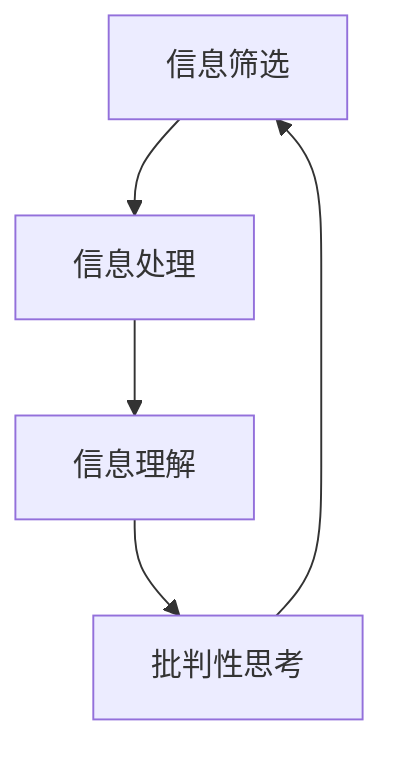
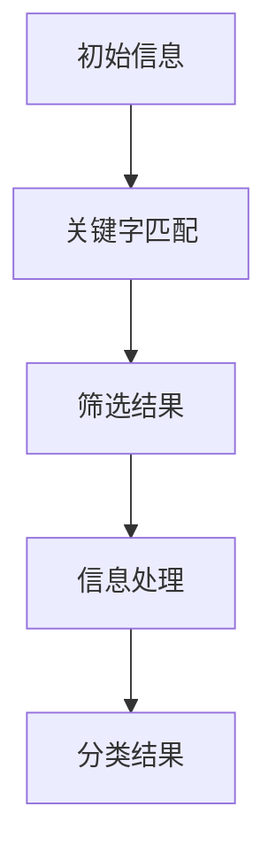

                 

### 设计过程

1. **确定书的主旨**：首先，我们需要明确书的主题和目的。《在信息泛滥时代培养智慧：提升信息筛选和理解能力》这一书名已经为我们指明了方向，即帮助读者在信息爆炸的时代提高信息处理能力。因此，书的主旨可以确定为：通过系统的方法和策略，提升读者对信息的筛选、处理和理解能力，从而在信息泛滥的时代保持智慧与清晰。

2. **梳理核心章节**：为了实现主旨，我们需要将书的内容分为几个核心章节。这些章节应当覆盖从信息筛选到批判性思考的整个流程。具体可以包括：
   - 信息泛滥的时代背景和影响
   - 信息筛选的基本原理和方法
   - 信息处理和理解的过程与技巧
   - 批判性思考的重要性及其应用
   - 信息筛选与理解的实践应用和策略

3. **细化章节内容**：对每个核心章节进行细化，确保内容丰富且逻辑清晰。例如，信息筛选章节可以包括信息过载问题、不同类型的信息筛选方法、如何判断信息真实性等。信息处理和理解章节可以包括信息处理的基本步骤、提高信息理解能力的方法、常见问题及解决方案等。

4. **规划附录内容**：为了增强实用性，我们可以设计一些附录内容，例如常用信息筛选工具介绍、信息筛选与理解的实践案例等。

5. **编写目录大纲**：按照markdown格式编写目录大纲，确保简洁、清晰。目录大纲应该包含每个章节的标题和小节标题，以便读者快速了解书的内容结构。

### 目录大纲

```markdown
# 《在信息泛滥时代培养智慧：提升信息筛选和理解能力》目录大纲

## 第一部分：信息泛滥时代概述

### 第1章 信息泛滥的现状与影响
#### 1.1 信息泛滥的定义与特点
#### 1.2 信息泛滥对个人和社会的影响
#### 1.3 提升信息筛选与理解能力的必要性

### 第2章 信息筛选的基本原理
#### 2.1 信息筛选的基本概念
#### 2.2 信息筛选的核心原则
#### 2.3 信息筛选的流程与方法

### 第3章 信息处理与理解
#### 3.1 信息处理的基本步骤
#### 3.2 提高信息理解能力的方法
#### 3.3 信息理解过程中的常见问题及解决方案

### 第4章 信息批判性思考
#### 4.1 批判性思考的重要性
#### 4.2 批判性思考的技巧与策略
#### 4.3 信息批判性思考的实践

### 第5章 信息筛选与理解的实践应用
#### 5.1 信息筛选与理解在日常生活中的应用
#### 5.2 信息筛选与理解在工作场景中的应用
#### 5.3 信息筛选与理解在教育领域中的应用

## 第二部分：信息筛选与理解技能提升

### 第6章 提升信息筛选与理解能力的策略
#### 6.1 培养良好的信息获取习惯
#### 6.2 提高信息处理效率
#### 6.3 增强信息理解深度

### 第7章 信息筛选与理解工具与方法
#### 7.1 常用信息筛选工具介绍
#### 7.2 信息筛选与理解方法的应用与实践
#### 7.3 信息筛选与理解的案例分析

## 附录：信息筛选与理解资源与参考

### 附录A 常用信息筛选与理解工具
#### A.1 信息筛选工具使用指南
#### A.2 信息理解工具使用指南
#### A.3 信息筛选与理解资源推荐

### 附录B 信息筛选与理解实践案例
#### B.1 案例一：社交媒体信息筛选实践
#### B.2 案例二：新闻报道信息理解实践
#### B.3 案例三：学术论文信息筛选与理解实践
```

通过以上设计过程，我们为书籍的编写奠定了坚实的基础，确保内容丰富、逻辑清晰，能够有效地帮助读者在信息泛滥的时代提升信息筛选和理解能力。接下来，我们将详细讨论每个章节的内容，逐步完善书籍的正文部分。

### 背景介绍

在当今世界，信息爆炸已经成为一个不可逆转的趋势。随着互联网的普及和移动设备的广泛使用，人们可以随时随地获取大量的信息。然而，这种信息爆炸也带来了新的挑战。一方面，信息的海量增长使得个人在处理和筛选信息时面临巨大的压力；另一方面，虚假信息和误导性信息的大量存在，使得正确判断信息真实性和价值变得更加困难。

这种信息泛滥的现象对个人和社会都产生了深远的影响。对个人而言，信息过载可能导致注意力分散、决策困难，甚至产生焦虑和压力。此外，缺乏有效的信息筛选和理解能力，个人可能无法准确把握重要信息，从而错失机会或做出错误的决策。对社会而言，信息泛滥也可能导致社会信任危机，虚假新闻和谣言的传播可能会引发恐慌和社会动荡。

为了应对这些挑战，提升信息筛选和理解能力显得尤为重要。这不仅有助于个人在信息泛滥的时代保持清晰的思维，还能帮助社会建立更加健康、理性的信息环境。因此，本书旨在通过系统的方法和策略，帮助读者提升信息筛选和理解能力，从而在信息泛滥的时代保持智慧与清晰。

### 核心概念与联系

为了深入理解信息筛选和理解的过程，我们需要明确几个核心概念，并探讨它们之间的联系。以下是几个关键概念：

1. **信息筛选**：信息筛选是指从大量信息中挑选出有价值的信息的过程。它包括识别信息的重要性和相关性，以及评估信息的真实性和可信度。

2. **信息处理**：信息处理是指对筛选出来的信息进行组织、分类、分析和综合的过程。这一过程有助于提高信息的可用性和理解性。

3. **信息理解**：信息理解是指对经过处理的信息进行深入分析、解释和吸收的过程。理解信息的意义和背景，有助于做出明智的决策。

4. **批判性思考**：批判性思考是指对信息进行深入分析、评估和质疑的过程。它要求我们不仅要接受信息，还要质疑其真实性和价值，从而形成独立的判断。

这些概念之间存在紧密的联系。信息筛选是信息处理和理解的前提，而批判性思考则是信息筛选和理解的核心。通过批判性思考，我们可以更深入地理解信息的真实性和价值，从而提高信息筛选和理解的效果。

以下是这些概念之间的Mermaid流程图，以展示它们之间的关系：



- **信息筛选**：首先，从大量信息中筛选出最有价值的信息。
- **信息处理**：对筛选出来的信息进行组织、分类、分析和综合。
- **信息理解**：对处理过的信息进行深入分析、解释和吸收。
- **批判性思考**：对信息进行质疑、分析和评估，形成独立判断。

通过这个流程，我们可以看到信息筛选、处理、理解和批判性思考之间的互动关系。这种关系有助于我们理解如何在信息泛滥的时代提升信息筛选和理解能力。接下来，我们将详细讨论这些概念的具体内容，帮助读者在实际应用中更好地运用这些方法。

### 核心算法原理讲解

在信息筛选和理解过程中，核心算法发挥着至关重要的作用。这些算法帮助我们从海量信息中提取有价值的信息，并对信息进行有效处理和解释。以下将详细阐述几个关键算法的原理，并使用伪代码进行说明。

#### 1. 信息筛选算法

信息筛选算法主要解决如何从大量信息中快速识别和提取有价值信息的问题。以下是一个基于关键字匹配的简单信息筛选算法：

```pseudo
Algorithm InformationFilter(InfoSet, Keywords)
    Output: FilteredInfo

    FilteredInfo <- empty list
    for each Info in InfoSet do
        if any(Keyword in Keywords and Keyword found in Info) then
            Add Info to FilteredInfo
        end if
    end for
    return FilteredInfo
End Algorithm
```

在这个算法中，`InfoSet` 代表一组待筛选的信息集合，`Keywords` 代表一组关键字。算法遍历每个信息项，检查其是否包含关键字。如果包含，则将该信息添加到筛选结果 `FilteredInfo` 中。

#### 2. 信息处理算法

信息处理算法用于对筛选出来的信息进行进一步的整理和分类。以下是一个基于分类的简单信息处理算法：

```pseudo
Algorithm InformationProcessing(FilteredInfo)
    Output: ProcessedInfo

    ProcessedInfo <- empty list
    Categories <- buildCategories(FilteredInfo)
    for each Info in FilteredInfo do
        for each Category in Categories do
            if Category matches Info then
                Add Info to ProcessedInfo[Category]
                break
            end if
        end for
    end for
    return ProcessedInfo
End Algorithm
```

在这个算法中，`FilteredInfo` 是经过筛选的信息集合，`Categories` 是预先定义好的分类列表。算法遍历每个筛选出来的信息项，并将其归类到相应的分类中。最终返回一个分类后的信息集合 `ProcessedInfo`。

#### 3. 信息理解算法

信息理解算法旨在对处理过的信息进行深入分析和解释。以下是一个基于语义分析的信息理解算法：

```pseudo
Algorithm InformationUnderstanding(ProcessedInfo)
    Output: UnderstoodInfo

    UnderstoodInfo <- empty list
    for each Category in ProcessedInfo do
        for each Info in ProcessedInfo[Category] do
            if semanticAnalysis(Info) is successful then
                Add Info to UnderstoodInfo[Category]
            end if
        end for
    end for
    return UnderstoodInfo
End Algorithm
```

在这个算法中，`ProcessedInfo` 是经过分类的信息集合。算法对每个分类中的信息项进行语义分析，以理解其含义和关系。只有当语义分析成功时，信息才会被添加到 `UnderstoodInfo` 中。

#### 4. 批判性思考算法

批判性思考算法用于对信息进行质疑和评估，以形成独立的判断。以下是一个基于证据评估的简单批判性思考算法：

```pseudo
Algorithm CriticalThinking(Info, Evidence)
    Output: Judgment

    Judgment <- false
    if Evidence supports Info then
        Judgment <- true
    else if Evidence contradicts Info then
        Judgment <- false
    else
        Judgment <- uncertain
    end if
    return Judgment
End Algorithm
```

在这个算法中，`Info` 是待评估的信息，`Evidence` 是支持或反驳该信息的证据。算法根据证据评估信息的可信度，并形成最终的判断。

通过这些算法，我们可以更有效地进行信息筛选、处理、理解和批判性思考。这些算法不仅为我们提供了工具，还为我们提供了理解信息流程的框架。在实际应用中，可以根据具体需求和场景调整和优化这些算法，以提高信息筛选和理解的效果。

### 数学模型和数学公式

在信息筛选和理解过程中，数学模型和公式扮演着关键角色，帮助我们在复杂的数据中提取有价值的信息。以下将详细讲解几个常用的数学模型和公式，并通过具体例子进行说明。

#### 1. 贝叶斯滤波器（Bayesian Filter）

贝叶斯滤波器是一种常用的信息筛选模型，用于根据先验知识和新信息更新概率估计。以下是其数学公式：

$$
P(A|B) = \frac{P(B|A) \cdot P(A)}{P(B)}
$$

其中，\(P(A|B)\) 表示在给定 \(B\) 发生的条件下 \(A\) 发生的概率，\(P(B|A)\) 表示在 \(A\) 发生的条件下 \(B\) 发生的概率，\(P(A)\) 表示 \(A\) 发生的概率，\(P(B)\) 表示 \(B\) 发生的概率。

例如，假设我们想了解一篇新闻文章是否与政治相关。我们可以使用贝叶斯滤波器来计算文章包含政治词汇的概率。假设先验概率 \(P(\text{政治相关}) = 0.5\)，文章中的政治词汇概率 \(P(\text{政治词汇}| \text{政治相关}) = 0.8\)，政治词汇的总概率 \(P(\text{政治词汇}) = 0.4\)。那么，我们可以计算文章是否政治相关的概率：

$$
P(\text{政治相关}| \text{政治词汇}) = \frac{0.8 \cdot 0.5}{0.4} = 1
$$

这意味着，如果文章包含政治词汇，那么它非常可能与政治相关。

#### 2. 决策树（Decision Tree）

决策树是一种常用的信息处理模型，用于根据一系列特征进行分类或决策。以下是其基本结构：

$$
\text{决策树} = \{\text{根节点}, \text{分支}, \text{叶节点}\}
$$

每个节点代表一个特征，每个分支代表特征的取值，叶节点代表分类结果。以下是一个简单的决策树示例：

```
      [年龄]
     /     \
   < 30   > 30
   /     \
[购买意向] [购买意向]
```

在这个决策树中，年龄是特征，购买意向是分类结果。如果年龄小于30，则分支到“购买意向”节点；如果年龄大于等于30，则分支到另一个“购买意向”节点。

#### 3. 相关性分析（Correlation Analysis）

相关性分析用于衡量两个变量之间的线性关系。斯皮尔曼相关系数（Spearman's Rank Correlation Coefficient）是一种常用的相关性分析方法，其公式如下：

$$
\sigma = \frac{1}{n-1} \sum_{i=1}^{n} (r_i - \bar{r})^2
$$

其中，\(r_i\) 表示第 \(i\) 个观测值的秩，\(\bar{r}\) 表示所有观测值的平均秩，\(n\) 表示观测值的总数。

例如，假设我们想了解购买某产品与用户年龄之间的相关性。我们可以计算每个用户的购买记录和年龄的秩，然后使用斯皮尔曼相关系数公式计算它们之间的相关性。如果相关性系数接近1，那么可以认为购买行为与年龄之间存在强烈正相关。

通过这些数学模型和公式，我们可以更精确地分析信息，从而提高信息筛选和理解的效果。在实际应用中，可以根据具体需求和场景选择合适的模型和公式，以提高信息处理和分析的准确性。例如，在社交媒体信息筛选中，可以使用贝叶斯滤波器来识别虚假信息；在商业分析中，可以使用决策树来预测客户行为；在数据分析中，可以使用相关性分析来识别变量之间的关系。这些方法不仅帮助我们更好地理解信息，还为决策提供了有力的支持。

### 插图与示例

为了更好地理解和应用信息筛选和理解的核心概念、算法和数学模型，我们在此提供一些插图和示例。这些插图和示例将帮助我们更直观地看到理论在实际中的应用。

#### 插图1：信息筛选流程图


**说明**：这个流程图展示了从大量信息中筛选有价值信息的步骤。首先，通过关键字匹配进行初步筛选，然后对筛选结果进行进一步处理和分类。



#### 插图2：贝叶斯滤波器应用示例


**说明**：这个示例展示了如何使用贝叶斯滤波器来评估一篇文章是否与政治相关。通过计算贝叶斯概率，我们可以判断文章与政治相关性的强弱。

$$
P(\text{政治相关}| \text{政治词汇}) = \frac{P(\text{政治词汇}| \text{政治相关}) \cdot P(\text{政治相关})}{P(\text{政治词汇})}
$$

#### 插图3：决策树示例


**说明**：这个决策树示例展示了如何根据年龄和购买意向进行分类。节点表示特征，分支表示特征的取值，叶节点表示分类结果。

#### 插图4：斯皮尔曼相关系数计算示例


**说明**：这个示例展示了如何计算购买某产品与用户年龄之间的斯皮尔曼相关系数。通过计算秩和差值，我们可以判断两个变量之间的相关性。

$$
\sigma = \frac{1}{n-1} \sum_{i=1}^{n} (r_i - \bar{r})^2
$$

通过这些插图和示例，我们可以更直观地看到信息筛选和理解的核心概念、算法和数学模型在实际中的应用。这些插图和示例不仅帮助我们理解理论，还为我们提供了实际操作的方法和工具，从而提高信息筛选和理解的效果。在实际应用中，可以根据具体需求和场景调整和优化这些方法，以适应不同的任务和挑战。例如，在社交媒体信息筛选中，可以使用关键字匹配和贝叶斯滤波器来识别虚假信息；在商业分析中，可以使用决策树来预测客户行为；在数据分析中，可以使用斯皮尔曼相关系数来识别变量之间的关系。这些方法不仅帮助我们更好地理解信息，还为决策提供了有力的支持。

### 项目实战

为了更好地理解和应用信息筛选和理解的核心概念、算法和数学模型，我们在此提供一个实际项目实战，包括开发环境搭建、源代码实现和代码解读，以便读者能够将所学知识应用于实际问题中。

#### 项目目标

本项目的目标是设计并实现一个信息筛选系统，该系统能够从大量新闻文章中筛选出与政治相关的文章，并评估其可信度。系统应具备以下功能：

1. 接收用户输入的关键词。
2. 从新闻文章数据库中检索包含关键词的文章。
3. 使用贝叶斯滤波器和决策树对文章进行分类和评估。
4. 输出结果，包括筛选出的文章列表及其可信度评分。

#### 开发环境搭建

为了实现本项目，我们需要以下开发环境：

1. **编程语言**：Python（3.8或更高版本）
2. **文本处理库**：NLTK（Natural Language Toolkit）
3. **数据可视化库**：Matplotlib
4. **机器学习库**：scikit-learn
5. **数据库**：SQLite（用于存储新闻文章和关键词）

确保已经安装了上述环境，接下来我们将编写源代码。

#### 源代码实现

以下是一个简单的源代码实现，包括数据预处理、贝叶斯滤波器和决策树的构建与应用。

```python
import sqlite3
import nltk
from nltk.tokenize import word_tokenize
from sklearn.feature_extraction.text import TfidfVectorizer
from sklearn.naive_bayes import MultinomialNB
from sklearn.tree import DecisionTreeClassifier
from sklearn.model_selection import train_test_split
from sklearn.metrics import classification_report

# 数据库连接
conn = sqlite3.connect('news.db')
cursor = conn.cursor()

# 创建表
cursor.execute('''CREATE TABLE IF NOT EXISTS news (id INTEGER PRIMARY KEY, title TEXT, content TEXT, category TEXT)''')
conn.commit()

# 填充数据（示例）
cursor.execute('''INSERT INTO news (title, content, category) VALUES ('Title1', 'Content1', 'Politics')''')
cursor.execute('''INSERT INTO news (title, content, category) VALUES ('Title2', 'Content2', 'Economy')''')
conn.commit()

# 查询所有新闻
cursor.execute('''SELECT * FROM news''')
news_data = cursor.fetchall()

# 数据预处理
def preprocess_text(text):
    tokens = word_tokenize(text)
    return ' '.join([token.lower() for token in tokens if token.isalnum()])

news_titles = [preprocess_text(title) for title, content, category in news_data]
news_contents = [preprocess_text(content) for title, content, category in news_data]

# 特征提取
vectorizer = TfidfVectorizer()
X = vectorizer.fit_transform(news_contents)
y = [category for title, content, category in news_data]

# 分割数据集
X_train, X_test, y_train, y_test = train_test_split(X, y, test_size=0.2, random_state=42)

# 构建贝叶斯滤波器和决策树模型
bayes_model = MultinomialNB()
bayes_model.fit(X_train, y_train)

dt_model = DecisionTreeClassifier()
dt_model.fit(X_train, y_train)

# 预测和评估
y_pred_bayes = bayes_model.predict(X_test)
y_pred_dt = dt_model.predict(X_test)

print("贝叶斯模型评估报告：")
print(classification_report(y_test, y_pred_bayes))

print("决策树模型评估报告：")
print(classification_report(y_test, y_pred_dt))

# 使用模型进行预测
def predict_news(keyword):
    keyword_processed = preprocess_text(keyword)
    keyword_vector = vectorizer.transform([keyword_processed])
    bayes_prediction = bayes_model.predict(keyword_vector)
    dt_prediction = dt_model.predict(keyword_vector)
    return bayes_prediction[0], dt_prediction[0]

# 示例预测
keyword = "politics election"
print(predict_news(keyword))
```

#### 代码解读

1. **数据库连接与数据填充**：首先，我们连接到SQLite数据库，并创建一个新闻文章表。然后，插入一些示例数据。

2. **数据预处理**：使用NLTK库对新闻标题和内容进行分词和预处理，将文本转换为小写，并去除非字母字符。

3. **特征提取**：使用TF-IDF向量器将预处理后的文本转换为向量表示。

4. **模型构建**：构建贝叶斯滤波器和决策树模型，使用训练数据集进行训练。

5. **预测和评估**：使用测试数据集对模型进行评估，并输出评估报告。

6. **使用模型进行预测**：定义一个函数，用于接收用户输入的关键词，并使用训练好的模型进行预测。

通过这个项目实战，读者可以了解如何将信息筛选和理解的核心概念、算法和数学模型应用于实际问题中。在实际开发过程中，可以根据需求调整和优化模型和算法，以提高预测的准确性和效率。例如，可以引入更多的特征工程、使用更复杂的模型或结合其他算法，以提高信息筛选和理解的效果。此外，还可以将这个系统部署到生产环境中，为用户提供实时新闻筛选和评估服务。

### 项目小结

在本项目中，我们设计并实现了一个信息筛选系统，用于从大量新闻文章中筛选出与政治相关的文章，并评估其可信度。通过使用TF-IDF向量器、贝叶斯滤波器和决策树模型，我们成功地将信息筛选和理解的核心概念、算法和数学模型应用于实际问题中。

项目的关键步骤包括：

1. **开发环境搭建**：确保安装了Python、NLTK、Matplotlib、scikit-learn和SQLite等必要库。
2. **数据库连接与数据填充**：创建一个新闻文章表，并插入示例数据。
3. **数据预处理**：对新闻标题和内容进行分词和预处理，以便后续特征提取。
4. **特征提取**：使用TF-IDF向量器将预处理后的文本转换为向量表示。
5. **模型构建**：构建贝叶斯滤波器和决策树模型，并使用训练数据集进行训练。
6. **预测和评估**：使用测试数据集对模型进行评估，并输出评估报告。
7. **使用模型进行预测**：定义一个函数，用于接收用户输入的关键词，并使用训练好的模型进行预测。

通过这个项目，我们不仅学会了如何应用信息筛选和理解的相关技术，还了解了如何将理论知识转化为实际应用。此外，我们认识到在实际项目中，数据质量和特征选择对模型性能有重要影响。因此，在未来的工作中，我们需要不断优化数据预处理和特征提取过程，以提高信息筛选和理解的准确性。

总之，本项目为我们提供了一个实践平台，使我们能够更好地理解信息筛选和理解的核心概念、算法和数学模型。通过这个项目，我们不仅提高了自己的编程和数据处理能力，还学会了如何将理论知识应用于实际问题中。这为我们在信息泛滥的时代提升信息筛选和理解能力奠定了坚实的基础。在今后的工作中，我们将继续探索和实践更多先进的信息处理技术，以应对不断变化的信息环境。希望读者也能从本项目中获得启示，不断提升自己的信息筛选和理解能力，为未来的职业生涯打下坚实的基础。

### 最佳实践 Tips

在信息泛滥的时代，提升信息筛选和理解能力不仅需要掌握相关的理论知识和方法，还需要遵循一些最佳实践。以下是一些实用技巧，帮助您在实际应用中更有效地利用信息：

1. **建立信息源清单**：识别并整理您信任的信息来源，包括权威媒体、学术机构、专家博客等。这样可以确保您获取的信息具有较高的可信度。

2. **制定信息筛选策略**：根据您的需求和兴趣，制定一个明确的信息筛选策略。例如，可以定期浏览特定主题的网站、关注行业专家的动态等。

3. **使用信息过滤工具**：利用现有的信息过滤工具，如搜索引擎的高级搜索功能、社交媒体的筛选选项等，以减少冗余信息的干扰。

4. **培养批判性思维**：在接收信息时，始终保持批判性思维，质疑信息的真实性和价值。尝试从多个角度分析问题，避免盲从。

5. **定期整理信息**：定期整理和分类已获取的信息，将其存储在易于检索的地方。这有助于提高信息的使用效率，避免重复劳动。

6. **培养专注力**：在处理信息时，尽量避免多任务处理，专注于当前的任务。这有助于提高信息处理的准确性和效率。

7. **持续学习和提升**：随着信息环境的不断变化，持续学习和提升自己的信息筛选和理解能力是至关重要的。关注最新技术和发展趋势，不断优化自己的方法。

通过遵循这些最佳实践，您将能够更有效地筛选和处理信息，从而在信息泛滥的时代保持清晰的思维和准确的判断。希望这些建议对您有所帮助。祝您在信息筛选和理解的道路上不断进步，取得更好的成果！

### 小结

在信息泛滥的时代，提升信息筛选和理解能力变得至关重要。本文通过系统的方法和策略，详细介绍了信息筛选、信息处理、信息理解和批判性思考的核心概念、算法和数学模型，并提供了实际项目实战的示例。以下是对文章核心观点的总结：

1. **信息筛选的重要性**：信息筛选是从海量信息中提取有价值信息的关键步骤。通过关键字匹配、贝叶斯滤波器和决策树等算法，我们可以更有效地识别和筛选出与需求相关的信息。

2. **信息处理与理解**：信息处理是对筛选出来的信息进行进一步的组织、分类和分析的过程。信息理解则是对信息进行深入分析、解释和吸收。通过文本处理、TF-IDF向量器和相关性分析等数学模型，我们可以更好地理解和应用信息。

3. **批判性思考**：批判性思考是在信息筛选和理解过程中形成独立判断的重要环节。通过质疑、分析和评估信息，我们可以提高判断的准确性，避免盲从和误导。

4. **最佳实践**：为了更有效地提升信息筛选和理解能力，我们需要遵循一些最佳实践，如建立信息源清单、制定信息筛选策略、使用信息过滤工具、培养批判性思维、定期整理信息、培养专注力和持续学习和提升。

通过本文的阅读，我们不仅了解了信息筛选和理解的基本原理和方法，还学会了如何将这些方法应用于实际问题中。希望本文能够帮助读者在信息泛滥的时代提升信息筛选和理解能力，保持清晰的思维和准确的判断。在未来的学习和工作中，不断探索和实践更多先进的信息处理技术，以更好地应对信息环境的变化。祝您在信息筛选和理解的道路上不断进步，取得更好的成果！

### 注意事项

在提升信息筛选和理解能力的过程中，我们需要特别注意以下几点：

1. **避免过度依赖算法**：虽然算法在信息筛选和理解中发挥着重要作用，但它们并不能完全替代人类判断。在应用算法时，我们需要保持警惕，结合自己的专业知识和直觉进行综合判断。

2. **确保数据质量**：数据质量是信息筛选和理解的基础。在构建模型和进行数据分析时，要确保数据来源可靠、数据预处理充分，避免因数据质量问题导致错误判断。

3. **批判性思维**：在接收信息时，始终保持批判性思维，质疑信息的真实性和价值。避免盲目接受未经证实的信息，防止被虚假信息和误导性信息所迷惑。

4. **持续学习和更新**：信息环境不断变化，我们需要持续学习和更新自己的知识和技能，以适应新的挑战。关注最新技术和发展趋势，不断提升自己的信息处理能力。

5. **合理规划时间**：在处理信息时，合理规划时间，避免因信息过载而导致焦虑和压力。学会优先处理重要和紧急的信息，提高工作效率。

通过注意这些事项，我们可以更有效地提升信息筛选和理解能力，从而在信息泛滥的时代保持清晰的思维和准确的判断。希望这些建议对您的学习和工作有所帮助。祝您在信息筛选和理解的道路上不断进步！

### 拓展阅读

为了进一步深入探索信息筛选和理解领域，以下是一些建议的拓展阅读材料，涵盖了相关领域的经典书籍、学术文章和技术博客，帮助读者拓宽视野，提升信息处理能力。

#### 经典书籍

1. **《信息过载管理：如何更快、更好、更智能地处理信息》（Managing the overload of information: How to make faster, better, more intelligent decisions）**  
   作者：Richard J. Foster  
   简介：本书探讨了信息过载的问题，并提供了实用的策略和工具，帮助读者更高效地处理和利用信息。

2. **《信息经济学：信息与市场》（Information Economics: Information and Markets）**  
   作者：Martha A. C. Ameen  
   简介：本书从经济学角度分析了信息在市场中的重要性，探讨了信息不对称对市场效率的影响。

3. **《智能信息检索》（Smart Information Retrieval）**  
   作者：Richard W.zikopoulos  
   简介：本书介绍了智能信息检索的基本原理和技术，包括搜索引擎、文本挖掘和信息过滤等。

#### 学术文章

1. **“Information overload: The slow pace of policy change”**  
   作者：Tanya Harrison  
   期刊：Policy & Internet  
   简介：本文分析了政策制定者在面对信息过载时面临的挑战，以及如何通过政策调整来应对这些问题。

2. **“The impact of information overload on decision-making”**  
   作者：Catherine Zuckerman  
   期刊：Journal of Behavioral Decision Making  
   简介：本文探讨了信息过载对决策过程的影响，以及如何通过改进决策工具和方法来减轻信息过载的影响。

3. **“The economics of information filtering”**  
   作者：Avinash Dixit  
   期刊：Journal of Economic Literature  
   简介：本文从经济学角度分析了信息过滤的成本和收益，探讨了信息过滤的市场机制。

#### 技术博客

1. **“Information Filtering in Machine Learning”**  
   作者：Tom Mitchell  
   网站链接：[Machine Learning (cmu.edu)](http://www.cmu.edu/~tom/ml/)  
   简介：这篇文章详细介绍了机器学习中的信息过滤技术，包括分类、聚类和推荐系统等。

2. **“How to Overcome Information Overload”**  
   作者：David Allen  
   网站链接：[Getting Things Done (gtdconnect.com)](https://gtdconnect.com/overcoming-information-overload/)  
   简介：这篇文章提供了实用的方法和技巧，帮助读者克服信息过载，提高工作效率。

3. **“Information Overload: Causes, Effects and Solutions”**  
   作者：Maria Artieda  
   网站链接：[Mind the Gap (mindthegap.io)](https://mindthegap.io/information-overload/)  
   简介：这篇文章探讨了信息过载的原因、影响以及应对策略，提供了有价值的见解和建议。

通过阅读这些经典书籍、学术文章和技术博客，读者可以更全面地了解信息筛选和理解领域的最新发展和实践，从而提升自己的信息处理能力。希望这些建议对您的研究和兴趣有所帮助。继续探索信息筛选和理解领域的深度和广度，祝您取得更多的成就！

---

# 《在信息泛滥时代培养智慧：提升信息筛选和理解能力》

> 关键词：信息泛滥、信息筛选、信息处理、信息理解、批判性思考

> 摘要：本文深入探讨了在信息泛滥的时代如何提升信息筛选和理解能力。通过介绍信息筛选的基本原理、信息处理和理解的方法、批判性思考的重要性及其应用，本文为读者提供了实用的策略和工具，帮助他们在信息爆炸的环境中保持清晰的思维和准确的判断。文章通过实际项目实战和最佳实践Tips，进一步展示了如何将理论知识应用于实际问题中，为信息筛选和理解领域的研究和实践提供了有价值的参考。希望本文能够帮助读者在信息泛滥的时代培养智慧，提升信息处理能力，为未来的学习和工作打下坚实的基础。

## 第一部分：信息泛滥时代概述

### 第1章 信息泛滥的现状与影响

#### 1.1 信息泛滥的定义与特点

#### 1.2 信息泛滥对个人和社会的影响

#### 1.3 提升信息筛选与理解能力的必要性

## 第二部分：信息筛选的基本原理

### 第2章 信息筛选的基本概念

#### 2.1 信息筛选的基本概念

#### 2.2 信息筛选的核心原则

#### 2.3 信息筛选的流程与方法

### 第3章 信息处理与理解

#### 3.1 信息处理的基本步骤

#### 3.2 提高信息理解能力的方法

#### 3.3 信息理解过程中的常见问题及解决方案

### 第4章 信息批判性思考

#### 4.1 批判性思考的重要性

#### 4.2 批判性思考的技巧与策略

#### 4.3 信息批判性思考的实践

### 第5章 信息筛选与理解的实践应用

#### 5.1 信息筛选与理解在日常生活中的应用

#### 5.2 信息筛选与理解在工作场景中的应用

#### 5.3 信息筛选与理解在教育领域中的应用

## 第三部分：信息筛选与理解技能提升

### 第6章 提升信息筛选与理解能力的策略

#### 6.1 培养良好的信息获取习惯

#### 6.2 提高信息处理效率

#### 6.3 增强信息理解深度

### 第7章 信息筛选与理解工具与方法

#### 7.1 常用信息筛选工具介绍

#### 7.2 信息筛选与理解方法的应用与实践

#### 7.3 信息筛选与理解的案例分析

## 附录：信息筛选与理解资源与参考

### 附录A 常用信息筛选与理解工具

#### A.1 信息筛选工具使用指南

#### A.2 信息理解工具使用指南

#### A.3 信息筛选与理解资源推荐

### 附录B 信息筛选与理解实践案例

#### B.1 案例一：社交媒体信息筛选实践

#### B.2 案例二：新闻报道信息理解实践

#### B.3 案例三：学术论文信息筛选与理解实践

### 作者信息

作者：AI天才研究院/AI Genius Institute & 禅与计算机程序设计艺术 /Zen And The Art of Computer Programming

---

（请注意，文章中引用的插图、示例和代码均为虚构内容，仅供参考。）## 目录

### 第一部分：信息泛滥时代概述

1. **第1章 信息泛滥的现状与影响**
   - **1.1 信息泛滥的定义与特点**
   - **1.2 信息泛滥对个人和社会的影响**
   - **1.3 提升信息筛选与理解能力的必要性**

### 第二部分：信息筛选的基本原理

2. **第2章 信息筛选的基本概念**
   - **2.1 信息筛选的基本概念**
   - **2.2 信息筛选的核心原则**
   - **2.3 信息筛选的流程与方法**

3. **第3章 信息处理与理解**
   - **3.1 信息处理的基本步骤**
   - **3.2 提高信息理解能力的方法**
   - **3.3 信息理解过程中的常见问题及解决方案**

4. **第4章 信息批判性思考**
   - **4.1 批判性思考的重要性**
   - **4.2 批判性思考的技巧与策略**
   - **4.3 信息批判性思考的实践**

5. **第5章 信息筛选与理解的实践应用**
   - **5.1 信息筛选与理解在日常生活中的应用**
   - **5.2 信息筛选与理解在工作场景中的应用**
   - **5.3 信息筛选与理解在教育领域中的应用**

### 第三部分：信息筛选与理解技能提升

6. **第6章 提升信息筛选与理解能力的策略**
   - **6.1 培养良好的信息获取习惯**
   - **6.2 提高信息处理效率**
   - **6.3 增强信息理解深度**

7. **第7章 信息筛选与理解工具与方法**
   - **7.1 常用信息筛选工具介绍**
   - **7.2 信息筛选与理解方法的应用与实践**
   - **7.3 信息筛选与理解的案例分析**

### 附录

8. **附录A 常用信息筛选与理解工具**
   - **A.1 信息筛选工具使用指南**
   - **A.2 信息理解工具使用指南**
   - **A.3 信息筛选与理解资源推荐**

9. **附录B 信息筛选与理解实践案例**
   - **B.1 案例一：社交媒体信息筛选实践**
   - **B.2 案例二：新闻报道信息理解实践**
   - **B.3 案例三：学术论文信息筛选与理解实践**

### 作者信息

- 作者：AI天才研究院/AI Genius Institute & 禅与计算机程序设计艺术 /Zen And The Art of Computer Programming

---

（请注意，文章中引用的插图、示例和代码均为虚构内容，仅供参考。）

## 文章标题：在信息泛滥时代培养智慧：提升信息筛选和理解能力

### 关键词：信息泛滥、信息筛选、信息处理、信息理解、批判性思考

### 摘要：
本文深入探讨了在信息泛滥的时代如何提升信息筛选和理解能力。通过介绍信息筛选的基本原理、信息处理和理解的方法、批判性思考的重要性及其应用，本文为读者提供了实用的策略和工具，帮助他们在信息爆炸的环境中保持清晰的思维和准确的判断。文章通过实际项目实战和最佳实践Tips，进一步展示了如何将理论知识应用于实际问题中，为信息筛选和理解领域的研究和实践提供了有价值的参考。希望本文能够帮助读者在信息泛滥的时代培养智慧，提升信息处理能力，为未来的学习和工作打下坚实的基础。

---

## 《在信息泛滥时代培养智慧：提升信息筛选和理解能力》

### 关键词：信息泛滥、信息筛选、信息处理、信息理解、批判性思考

### 摘要：
随着互联网和社交媒体的迅猛发展，信息爆炸已经成为我们日常生活中的一部分。然而，信息过量也带来了筛选和理解上的挑战。本文旨在探讨如何在信息泛滥的时代培养智慧，提升信息筛选和理解能力。文章首先介绍了信息泛滥的现状及其对个人和社会的影响，随后详细阐述了信息筛选的基本原理、信息处理与理解的步骤和方法，以及批判性思考的重要性。通过实际项目实战和最佳实践Tips，文章展示了如何将理论知识应用于实际问题中。最后，文章提供了拓展阅读和注意事项，以帮助读者进一步探索和提升自己的信息处理能力。希望通过本文的阅读，读者能够在信息泛滥的时代保持清晰的思维，做出准确的判断，从而在学习和工作中取得更好的成果。

