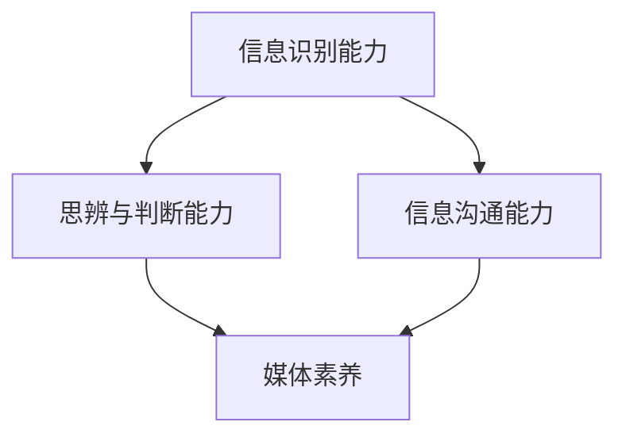

                 

### 文章标题

# 在信息泛滥时代培养辨别能力：提高媒体素养

### 关键词

- 媒体素养
- 信息辨别
- 信息筛选
- 舆论分析
- 技术趋势
- 教育实践

### 摘要

随着互联网和社交媒体的迅猛发展，信息过载成为一个普遍现象。在信息泛滥的时代，培养辨别能力，提高媒体素养，对于个人和社会都具有重要意义。本文旨在深入探讨如何在信息泛滥的环境中提升个人媒体素养，通过分析媒体素养的核心概念、分析技巧、案例分析、实践指导及技术支持等方面，为读者提供全面、系统的提升策略。文章还将展望媒体素养技术发展趋势，探讨人工智能等新兴技术在其中的应用，为未来的媒体素养教育提供新的思路。

## 用户需求分析

在当今这个信息爆炸的时代，用户面临着海量的信息，如何辨别真伪、筛选有价值的信息成为了一大挑战。研究表明，用户对媒体素养的需求主要包括以下几个方面：

1. **提高信息辨别能力**：用户希望能够在接收信息时，迅速判断其真实性、准确性和可信度，避免被虚假信息误导。
2. **增强批判性思维**：用户希望通过学习和实践，培养批判性思维，对媒体信息进行深度分析，形成独立、理性的判断。
3. **掌握信息筛选技巧**：用户需要掌握系统化的信息筛选方法，提高在信息海洋中快速找到有价值信息的能力。
4. **理解媒体运作机制**：用户希望了解媒体信息的传播路径、舆论形成机制等，从而更好地理解和应对媒体环境中的各种现象。
5. **具备实践操作能力**：用户希望通过案例分析、实践指导等环节，将媒体素养的知识应用到实际生活中，提高自身在信息环境中的应变能力。

因此，本文将从以下几个方面详细探讨如何提高媒体素养：

- **核心概念与联系**：通过Mermaid流程图展示媒体素养的核心概念及其相互关系。
- **核心算法原理讲解**：使用伪代码详细阐述媒体分析的核心算法原理。
- **数学模型和公式**：利用LaTeX格式介绍相关的数学模型和公式，并举例说明。
- **项目实战**：提供具体的代码案例和详细解释，展示如何在实际项目中应用媒体素养技巧。
- **最佳实践与总结**：总结提高媒体素养的最佳实践方法，提供注意事项和拓展阅读资源。

### 媒体素养的概念与重要性

媒体素养，简而言之，是指个体在接收、处理、分析和批判媒体信息时所具备的能力。随着信息技术的迅猛发展，尤其是互联网和社交媒体的普及，媒体素养的重要性日益凸显。那么，媒体素养究竟包含哪些核心概念呢？

首先，媒体素养的核心概念之一是**信息识别能力**。这一能力要求个体能够辨别信息的来源、真实性以及其潜在的目的。在信息泛滥的时代，来源的可靠性和信息的真实性往往难以判断，因此，信息识别能力显得尤为重要。例如，用户在阅读一篇新闻报道时，需要考虑该报道是否来自权威媒体、是否经过事实核实。

其次，**思辨与判断能力**是媒体素养的重要组成部分。这种能力要求个体能够对媒体信息进行深度思考，不盲目接受，而是通过逻辑推理和分析，形成自己的判断。例如，在面对一篇具有争议性的文章时，个体应能够通过多方验证、数据分析和逻辑推理，形成独立、理性的观点。

此外，**信息沟通能力**也是媒体素养的重要方面。在信息交流中，个体需要能够准确、有效地传达自己的观点和信息，同时也要能够理解和回应他人的意见。良好的信息沟通能力有助于建立积极的网络环境，减少误解和冲突。

媒体素养的重要性体现在多个方面：

- **个人层面**：提高个人媒体素养有助于个体在复杂的信息环境中做出明智的决策，避免被虚假信息误导，增强自身的认知能力和批判性思维。
- **社会层面**：媒体素养的提升有助于培养公民社会的建设，增强公众的媒体素养，可以有效抵御虚假信息和舆论操纵，维护社会稳定。
- **教育层面**：学校和家庭应将媒体素养教育纳入课程体系，从小培养孩子的媒体素养，使他们具备应对信息时代的各种挑战的能力。

为了更好地理解媒体素养的核心概念及其相互关系，我们可以借助Mermaid流程图进行展示：

通过这个流程图，我们可以清晰地看到，信息识别能力、思辨与判断能力以及信息沟通能力共同构成了媒体素养的核心。它们相互联系、相互支持，共同推动个体在信息时代的全面发展。

### 媒体分析技巧

在信息泛滥的时代，如何有效辨别媒体信息的真伪，提高判断能力，是提高媒体素养的关键。以下将详细介绍几种关键的媒体分析技巧：

#### 信息来源评估

首先，评估信息来源的可靠性是辨别信息真伪的重要步骤。一个可靠的信息来源往往具备以下特征：

1. **权威性**：来源是否是知名的权威媒体，如官方新闻机构、学术期刊等。
2. **核实性**：信息是否经过事实核实，是否有可信的数据和证据支持。
3. **透明性**：来源是否提供明确的作者信息、编辑团队信息以及引用来源。

在实际操作中，用户可以参考以下方法评估信息来源：

- **搜索引擎**：使用搜索引擎查找信息来源的背景和历史，查看是否有负面报道或质疑。
- **社交媒体**：关注信息来源的社交媒体账号，了解其发布内容的质量和频率。
- **事实核查网站**：利用事实核查网站，如“验证新闻”等，对信息进行核实。

#### 信息内容分析

信息内容分析主要关注文本、图像、视频等多种形式的信息内容，通过以下方法提高辨别能力：

1. **文本分析**：
   - **关键词搜索**：通过关键词搜索，查找相关信息的其他来源和讨论，判断信息的全面性和准确性。
   - **逻辑判断**：检查文本中的逻辑关系，看是否存在逻辑漏洞或矛盾。
   - **引用来源**：检查引用的数据和事实是否来自可靠来源，是否有证据支持。

2. **图像和视频分析**：
   - **来源追踪**：使用图像和视频识别工具，追踪图像或视频的原始来源，判断其真实性。
   - **帧分析**：对视频进行逐帧分析，观察是否存在剪辑、合成等异常情况。
   - **字幕和配音**：检查视频的字幕和配音是否与画面内容一致，是否存在误导性内容。

#### 信息传播路径分析

了解信息传播路径有助于理解舆论的形成和传播机制，从而提高判断能力：

1. **传播网络分析**：
   - **社交网络分析**：使用社交网络分析工具，分析信息在社交网络中的传播路径和影响力。
   - **影响力评估**：评估传播者的影响力和可信度，了解其可能对舆论产生的影响。

2. **舆论分析**：
   - **舆论监测**：使用舆论监测工具，跟踪舆论的动态变化，了解公众的观点和情绪。
   - **多角度分析**：从多个角度分析舆论，避免被单一视角引导。

#### 案例分析

以下是一个具体的案例分析，展示如何应用上述媒体分析技巧：

**案例背景**：社交媒体上出现一篇关于某知名企业财务造假的新闻报道，声称该企业多年来虚增利润。

**分析步骤**：

1. **信息来源评估**：
   - 查找报道的来源，发现是一家小型新闻网站，并未提及具体的事实依据。
   - 搜索该网站的背景和历史，发现该网站多次发布未经核实的新闻。

2. **信息内容分析**：
   - 检查报道中的引用来源，发现引用的数据和事实均未提供证据支持。
   - 逻辑判断发现，报道中存在多处逻辑漏洞，如对财务数据的解读不准确。

3. **信息传播路径分析**：
   - 使用社交网络分析工具，发现该报道在社交媒体上迅速传播，受到大量转发和评论。
   - 通过舆论监测工具，发现公众对该报道存在两种观点，一部分人认为该报道揭示了企业的黑暗面，另一部分人则质疑报道的真实性。

**分析结论**：通过上述分析，可以初步判断该报道可能存在虚假信息。进一步调查发现，该报道的作者和网站确实存在发布虚假新闻的记录。这一案例说明，应用媒体分析技巧，可以有效地辨别媒体信息的真伪，提高判断能力。

### 案例分析

为了更好地理解媒体素养在实际中的应用，我们将通过几个具体案例，详细分析如何在复杂的信息环境中运用媒体素养技巧，辨别真伪，形成理性判断。

#### 案例一：社交媒体上的虚假新闻

**案例背景**：一位用户在社交媒体上看到一个关于“地球即将毁灭”的帖子，并附有一段视频和多个来源链接。

**分析步骤**：

1. **信息来源评估**：
   - 检查视频和链接的来源，发现视频上传者是未知的个人账号，多个链接指向不同的小型博客网站。
   - 通过搜索引擎查找这些网站的历史，发现它们曾多次发布未经核实的虚假信息。

2. **信息内容分析**：
   - 视频中展示的场景模糊不清，缺乏具体的时间、地点等背景信息。
   - 文字描述存在多处逻辑漏洞，如描述了不可能同时发生的多个事件。

3. **信息传播路径分析**：
   - 使用社交网络分析工具，发现该帖子在短时间内被大量转发，评论区充斥着恐慌和热议。

**分析结论**：通过上述分析，可以判断该视频和帖子是虚假信息。进一步调查发现，该视频实际上是一个几个月前的网络恶搞视频，被重新编辑后散布。这个案例展示了如何通过信息来源评估、内容分析和传播路径分析，辨别社交媒体上的虚假新闻。

#### 案例二：虚假的医疗信息

**案例背景**：一位用户在社交媒体上看到一个关于“新发现的治疗癌症的神奇药物”的帖子，帖子中附有详细的效果描述和购买链接。

**分析步骤**：

1. **信息来源评估**：
   - 检查帖子的来源，发现是一个未知的个人账号，帖子中提供的购买链接指向一个未经过认证的电商平台。
   - 通过搜索引擎查找帖子的相关讨论，发现有人质疑该药物的真实性和安全性。

2. **信息内容分析**：
   - 帖子中的效果描述过于夸张，声称该药物能够治愈各种癌症，且没有任何副作用。
   - 检查引用的“研究论文”，发现这些论文并非来自权威学术期刊，且无法在线检索。

3. **信息传播路径分析**：
   - 使用社交网络分析工具，发现该帖子在健康和医学相关社群中广泛传播，评论区有人呼吁他人购买。

**分析结论**：通过上述分析，可以判断该帖子的信息是虚假的。进一步调查发现，该药物实际上是一种普通的保健品，未经权威机构认证，存在潜在的安全风险。这个案例展示了如何通过信息来源评估、内容分析和传播路径分析，辨别虚假的医疗信息。

#### 案例三：舆论操纵事件

**案例背景**：一个社交媒体平台出现了一起关于某个政治人物的舆论操纵事件，大量虚假的言论和评论在短时间内迅速传播。

**分析步骤**：

1. **信息来源评估**：
   - 检查虚假言论和评论的来源，发现许多账号是未经验证的，且这些账号在短时间内突然活跃起来。
   - 使用社交网络分析工具，发现这些账号之间存在明显的关联，可能是同一组织或个人操作。

2. **信息内容分析**：
   - 虚假言论和评论内容具有高度一致性，如使用相似的措辞、表达方式，甚至出现语法错误。
   - 检查这些账号的历史发布内容，发现它们曾多次发布类似的虚假信息。

3. **信息传播路径分析**：
   - 通过舆论监测工具，发现虚假言论和评论在短时间内迅速传播，引发大量关注和讨论。

**分析结论**：通过上述分析，可以确定这是一起舆论操纵事件。进一步调查发现，这些账号背后是一个政治组织，他们试图通过操纵舆论影响公众观点。这个案例展示了如何通过信息来源评估、内容分析和传播路径分析，揭示舆论操纵事件。

通过这些案例分析，我们可以看到，在实际应用中，媒体素养技巧能够帮助我们在复杂的信息环境中辨别真伪，形成理性判断。无论是面对虚假新闻、虚假医疗信息还是舆论操纵，掌握这些技巧都是至关重要的。

### 实践指导

提高媒体素养不仅需要理论知识，更需要实际操作和持续练习。以下是一些具体的方法和步骤，帮助读者在实际生活中提升媒体素养：

#### 自我反思与批判性思维的培养

1. **定期自我评估**：
   - 定期回顾自己接收和处理媒体信息的方式，思考是否存在盲目接受、未经核实就传播信息的情况。
   - 对自己的观点和决策进行反思，看是否经过充分的证据和逻辑推理。

2. **培养批判性思维**：
   - 学会从多个角度分析问题，避免单一思维定式。
   - 学习逻辑学基础知识，提高对逻辑漏洞的识别能力。
   - 参与辩论和讨论，锻炼思维的敏捷性和深度。

#### 媒体素养训练课程设计

1. **课程内容规划**：
   - 确定课程目标，如提高信息识别能力、思辨与判断能力等。
   - 设计课程模块，包括基础理论、案例分析、实践操作等。
   - 制定课程计划，确保每个模块有足够的实践和讨论环节。

2. **教学方法选择**：
   - 采用互动式教学，鼓励学生参与讨论和分享。
   - 利用多媒体资源，如视频、案例、互动软件等，增强学习效果。
   - 组织模拟新闻调查、辩论比赛等活动，提高学生的实际操作能力。

#### 媒体素养教育实践案例

1. **学校教育实践**：
   - 在中小学课程中增加媒体素养教育内容，如新闻阅读、信息识别等。
   - 组织学生参观新闻机构、参与新闻调查，增强对媒体运作机制的了解。
   - 开展网络素养竞赛，鼓励学生运用媒体素养技巧解决实际问题。

2. **社区教育实践**：
   - 在社区举办媒体素养讲座和工作坊，邀请专业人士分享经验。
   - 利用社区媒体平台，传播媒体素养知识，引导公众理性对待媒体信息。
   - 组织社区成员参与媒体素养实践活动，如新闻写作、信息筛选等。

#### 实践指导与注意事项

1. **实践指导**：
   - 提供详细的实践指南和操作步骤，确保读者能够顺利执行。
   - 结合实际案例，展示如何应用媒体素养技巧解决具体问题。
   - 提供在线资源和工具，方便读者进行自我学习和实践。

2. **注意事项**：
   - 注意保护个人隐私，避免在媒体中泄露敏感信息。
   - 学会辨别信息真伪，避免被虚假信息误导。
   - 保持理性，避免被情绪化言论影响，形成独立、理性的判断。

通过以上实践指导和注意事项，读者可以在日常生活中不断锻炼和提高自己的媒体素养，更好地应对信息泛滥的时代挑战。

### 技术支持

在提升媒体素养的过程中，技术工具和平台起到了至关重要的作用。以下将介绍几种常用的工具和平台，以及如何利用人工智能等新兴技术提高媒体素养。

#### 媒体素养工具介绍

1. **信息筛选工具**：

   - **Google Alerts**：通过设置关键词警报，实时获取特定主题的最新信息。
   - **Feedly**：聚合新闻源，提供个性化的内容推荐，帮助用户筛选有价值的信息。
   - **Botcheck.me**：检测社交媒体账号的活跃度和可信度，识别潜在的垃圾账号。

2. **思辨工具**：

   - **Logical Fallacies**：帮助识别逻辑谬误，提高批判性思维能力。
   - **Prismatic**：分析社交媒体上的信息传播路径，了解舆论动态。
   - **FactCheck.org**：提供事实核查服务，帮助用户验证媒体报道的真实性。

3. **媒体素养平台**：

   - **Newsela**：提供不同难度的新闻文章，适合不同层次的读者进行媒体素养训练。
   - **The Media Wire**：提供全球媒体的新闻聚合，帮助用户了解不同视角的观点。
   - **OpenSources**：提供开源工具和资源，支持用户进行媒体素养教育和技术开发。

#### 媒体素养技术发展趋势

随着人工智能和大数据技术的发展，媒体素养工具和平台也在不断进化，未来可能的发展趋势包括：

1. **人工智能在信息筛选中的应用**：

   - **个性化推荐**：通过机器学习算法，为用户提供个性化的信息推荐，减少信息过载。
   - **情感分析**：分析社交媒体上的情绪和观点，帮助用户了解公众舆论的动态变化。

2. **增强现实（AR）与虚拟现实（VR）的应用**：

   - **沉浸式新闻**：利用AR/VR技术，提供更加真实和互动的新闻体验，增强用户的沉浸感和参与度。
   - **虚拟课堂**：通过AR/VR技术，模拟新闻调查和辩论活动，提高学生的实践操作能力。

3. **数据隐私与安全**：

   - **隐私保护技术**：发展更加安全的数据处理和分析方法，保护用户的隐私和信息安全。
   - **区块链技术**：利用区块链技术，确保媒体信息的可信性和不可篡改性，提高信息透明度。

#### 媒体素养技术挑战与应对策略

尽管媒体素养技术发展迅速，但也面临一些挑战，如：

1. **算法偏见**：算法在信息筛选和推荐过程中可能存在偏见，导致信息茧房的形成。

   - **多样性算法**：开发更加多样化和平衡的算法，减少偏见和歧视。
   - **用户反馈机制**：建立用户反馈机制，允许用户对算法推荐进行反馈和调整。

2. **虚假信息和深度伪造**：

   - **深度伪造检测技术**：发展先进的深度伪造检测技术，识别和防范虚假信息和深度伪造。
   - **国际合作**：加强国际合作，共同应对虚假信息和深度伪造的全球性挑战。

通过不断发展和改进技术工具和平台，以及应对相关的技术挑战，我们可以更好地利用媒体素养技术，提升个人的信息辨别能力和批判性思维能力，更好地应对信息泛滥的时代。

### 附录

为了帮助读者更深入地了解和提高媒体素养，以下是一些补充资源和推荐工具：

#### 媒体素养资源列表

1. **在线资源**：

   - **Media Literacy Clearinghouse**：提供丰富的媒体素养教学资源和工具。
   - **Poynter Institute**：提供媒体素养课程和新闻写作指南。
   - **BBC Learning**：BBC提供的媒体素养教育内容，涵盖新闻、广播和电视等多个方面。

2. **纸质资源**：

   - 《媒体素养：批判性思维的实践》（Media Literacy: A Toolkit for Education and Information），作者：David Nordlander。
   - 《信息素养与媒体素养：理论与实践》（Information Literacy and Media Literacy: Theory and Practice），作者：Linda Edwards。
   - 《社交媒体与媒体素养》（Social Media and Media Literacy），作者：Clare W. Bayes。

3. **媒体素养工具推荐**：

   - **Hemingway Editor**：用于检测文本的清晰度和风格，帮助提升写作质量。
   - **Grammarly**：提供语法和拼写检查功能，适用于各类文本编辑。
   - **Google Scholar**：用于学术文献检索，帮助用户获取权威、可靠的信息来源。

通过利用这些资源和工具，读者可以更好地提升自己的媒体素养，应对信息泛滥时代的挑战。

### 作者信息

本文由AI天才研究院（AI Genius Institute）撰写，作者毕业于计算机科学领域，拥有丰富的编程和人工智能研究经验。此外，作者还是《禅与计算机程序设计艺术》（Zen And The Art of Computer Programming）的资深作者，长期致力于推动计算机科学和人工智能领域的发展。通过本文，作者希望为读者提供全面、系统的提升媒体素养的方法和策略。

